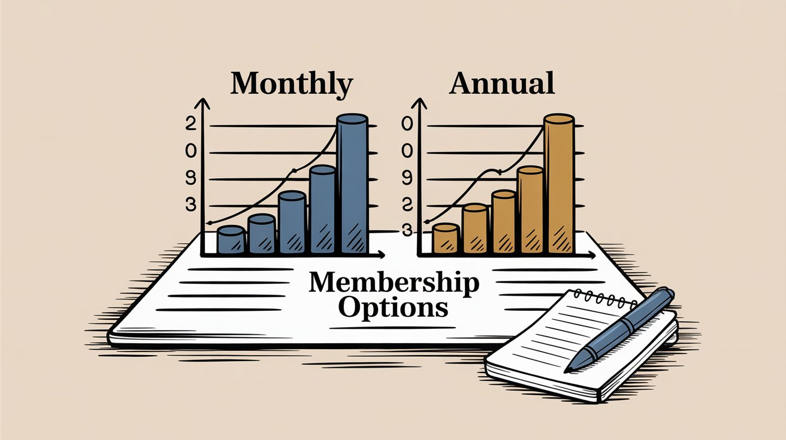
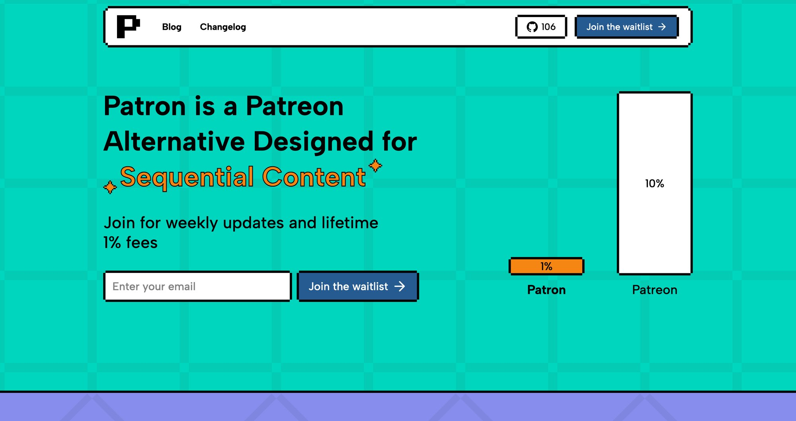
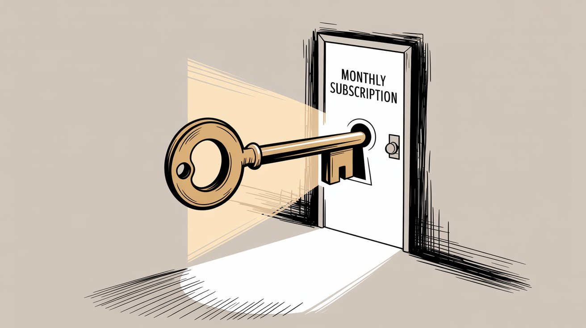
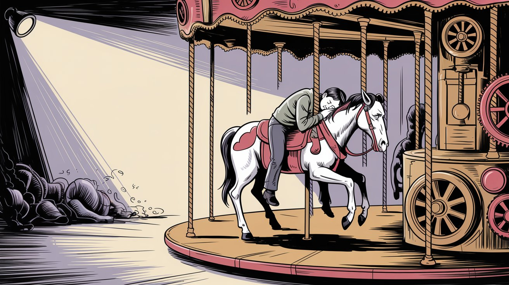
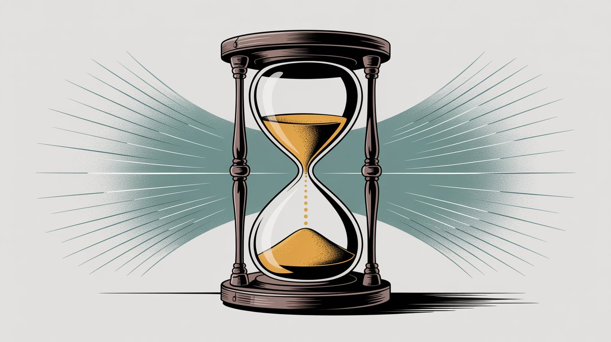
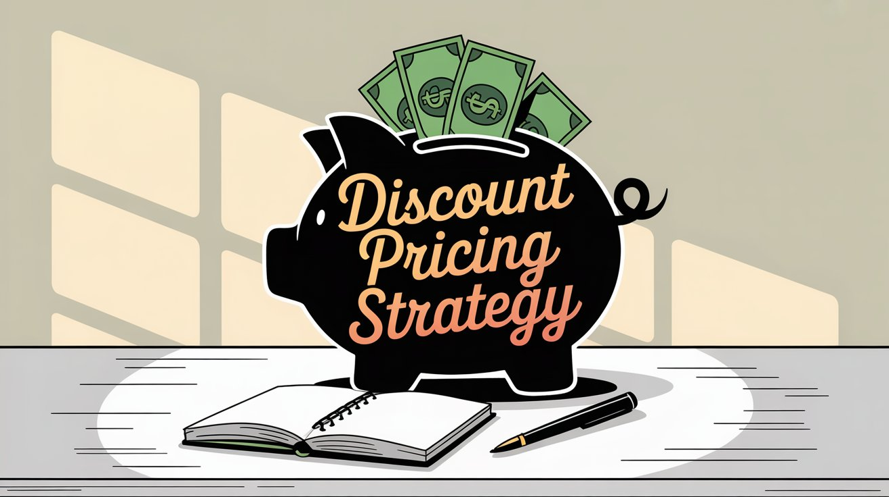

Creating a membership program means deciding how your supporters pay you. Should they subscribe monthly, commit for a full year, or both?

This question affects your **cash flow**, **retention**, and the structure of your entire creative business. The right choice builds sustainable income. The wrong one creates constant churn, unpredictable revenue, and exhausting pressure to prove your worth every billing cycle.

Most successful creators use **both** monthly and annual options strategically. They start with one model, then add the other once they understand their audience. The decision depends on your content type, your audience's behavior, and your financial needs.

This guide covers everything you need to make this decision confidently.

## What's the Difference Between Monthly and Annual Memberships?

Each model works differently in practice.

**Monthly memberships** charge supporters on a recurring monthly basis. A fan pledges $5 and gets billed around the same date each month until they cancel. The commitment stays low. If they cancel, billing stops for the next month. Most membership platforms default to monthly because new supporters can start easily.

**Annual memberships** require supporters to pay for a full year upfront. Instead of $5 per month, a fan might pay $54 once, which equals $4.50 monthly at a typical discount. They get access for the next 12 months, and the subscription renews after a year unless canceled.

The discount makes annual plans attractive to supporters. Most platforms suggest offering around 16% off, essentially two months free, as a standard incentive. Some creators go as high as 20% to drive more annual conversions. The discount rewards commitment while giving creators valuable upfront cash.

### How Platforms Handle Both Models

On Patreon, yearly plans require your page to be at least 3 months old, you must use subscription billing or charge upfront, and you need a well‑established payment history that includes at least $200 of earnings in each of the last 3 months. Once enabled, supporters see a monthly vs annual toggle at checkout.

[Patron](https://www.patron.com/), built specifically for sequential content creators, takes a different approach by integrating [rolling paywalls](https://www.patron.com/blog/post/what-is-a-rolling-paywall) with both membership options. More on how that changes the game later.

### The Cash Flow Difference

Each model affects your bank account differently.

**With monthly billing**, income arrives steadily each month. You get predictable recurring revenue, but it trickles in gradually. You'll process around 12 separate transactions per supporter per year.

**With annual billing**, you get lump sums from each annual member. One supporter paying $60 annually means you receive $60 immediately instead of $5 spread across 12 months. The upfront cash can fund equipment, cover living expenses, or invest in a major project.

**Fewer transaction fees** make a difference. If your processor charges 2.9% + $0.30 per transaction, twelve $5 payments cost about **$5.34** in fees. One $60 annual payment costs about **$2.04**. Fewer charges means fewer $0.30 fixed fees. Multiply this across hundreds of supporters and the savings compound. Fees vary by country and payment method.

## Why Does Your Membership Billing Model Matter?

Anyone searching for advice on annual vs monthly memberships wants to solve two problems. First, which option will attract more supporters. Second, which option will keep supporters paying longer.

These two goals often conflict. The model that converts best isn't always the one that retains best.

**Platform fees compound this decision.** If you're paying 10% platform fees plus 3% processing fees, common on traditional platforms, you lose 13% from every payment. Annual memberships mean fewer transactions and lower total fees. [Patron](https://www.patron.com/) changes this equation with a **1% platform fee** compared to traditional platforms' 10%. The 9% difference becomes substantial whether you're billing monthly or annually.

The smartest creators don't pick one model and stick with it forever. They start with what fits their current stage, then adapt as their audience grows.

## Are Monthly Memberships Better for New Creators?

Monthly subscriptions dominate the creator economy for clear reasons.

### Why Monthly Converts Better

[Shorter commitment intervals convert better](https://www.amediaoperator.com/analysis/pros-and-cons-of-monthly-and-annual-subscriptions-terms/). Asking someone to drop $5 for one month feels manageable. Asking for $60 upfront requires a much bigger decision.

A fan who isn't 100% sold on your content will "give it a try" for one month. They can cancel anytime if it's not for them. This lower barrier swells your supporter count faster during growth phases.

The flexibility cuts both ways.

### The Monthly Churn Reality

Monthly subscribers make renewal decisions more often. Every billing cycle is an opportunity to cancel. If a patron's budget tightens, interest wanes, or they forget why they subscribed, they can churn before the next payment.

Research on subscription businesses shows that annual subscribers renew at much higher rates than monthly subscribers. They make one renewal decision per year instead of 12.

For creators, this means **you have to continuously re-earn each monthly subscriber**. You need consistent content delivery, regular communication, and strategic reminders of value. Skip a few updates and some supporters fade away.

The operational burden of failed payments adds up. Credit cards expire, transactions decline, and you'll spend time each month chasing renewal issues. One creator described dealing with "dozens of declines to chase or cards to update each cycle" when managing hundreds or thousands of monthly members.

### Why Do Monthly Subscriptions Cause Creator Burnout?

Monthly billing creates a problem many creators face.

> **When subscribers pay monthly, creators feel constant pressure to publish.** If you slow down your content cadence, monthly patrons might leave. This leads to burnout, especially for solo creators who feel they're always "on."

Creator burnout is common. Monthly renewals add perceived pressure to publish because value gets judged every month.

This pressure is real. Monthly members expect regular content because they're paying *right now*. If you take a break or slow down, they notice immediately.

**Platform choice matters.** If you're using traditional membership platforms, the monthly pressure is unavoidable. If you're using [Patron's rolling paywall system](https://www.patron.com/blog/post/what-is-a-rolling-paywall), you can reduce this pressure significantly. More on this shortly.

### When Monthly Makes Sense

Despite the challenges, monthly memberships work well in specific situations. **Growing your audience** becomes easier with lower barriers. More people will try your membership without hesitation. You can **test content ideas** freely, experimenting and adjusting based on monthly feedback loops.

Monthly billing helps you **build trust gradually**. Fans can "test drive" your membership before committing long-term. The flexibility works both ways. If you have a **flexible creator schedule** and aren't sure you'll maintain consistent output, monthly gives members an easy exit without feeling trapped.

Monthly subscriptions are the bread and butter of most creator businesses, especially in the first year. They build momentum and prove your model works.

## Are Annual Memberships Better for Income Stability?

Annual memberships work differently from a creator's perspective.

### The Conversion Challenge

Annual memberships convert fewer people upfront. This is reality.

Asking for $50 or $100 all at once creates hesitation. Even with a discount, many fans will default to monthly simply for flexibility. Typically, only your most dedicated followers or those specifically hunting for a deal will choose annual right away.

If you *only* offered annual memberships with no monthly option, you'd severely limit your growth potential. But as an *option* alongside monthly, annual becomes powerful.

### What You Gain: Stability

The fans who do go annual are making a statement. They believe they'll want your content all year.

You don't worry about them canceling next month. They've prepaid their loyalty for 12 months. This provides **incredible income stability**.

Real creators report concrete benefits. Creators with significant patron bases find that around **25% choose annual options**. The 25% provides a solid floor of revenue without monthly fluctuation. Even when other supporters churn, the annual core remains stable.

The stability principle is straightforward. You might earn slightly less money due to the discount, but not having to worry about a patron leaving for a whole year is worth it.

Consider the choice. Would you rather have a guaranteed $90 now, or roll the dice each month trying to collect $100 total but risk getting much less? Most creators choose the guaranteed payment.

### How Much Money Do Annual Memberships Actually Save?

Annual memberships offer several financial advantages.

**Upfront cash flow** matters. You get money *now* rather than slowly over months. For a growing creator, multiple annual payments can fund equipment upgrades, cover living expenses during slower months, or enable a major project. It works like having mini-Kickstarters happening in the background.

**Lower total fees** add up over time. The math looks like this:

| Billing Model | Supporter Pays | Platform Fee (10%) | Processing Fee (2.9% + $0.30) | Creator Net |
| --- | --- | --- | --- | --- |
| Monthly ($5 x 12) | $60/year | $6.00 | **$5.34** (12 transactions) | **$48.66** |
| Annual ($54) | $54/year | $5.40 | **$1.87** (1 transaction) | **$46.73** |

The monthly model yields slightly more in this example, but only if the supporter stays all 12 months. [Many monthly subscribers churn earlier](https://www.amediaoperator.com/analysis/pros-and-cons-of-monthly-and-annual-subscriptions-terms/), which means the annual model often generates higher lifetime value.

If you're using [Patron's 1% platform fee](https://www.patron.com/blog/post/patron-fee-changes-2025/) instead of traditional 10% fees, both models become far more favorable, though annual still saves on transaction fees.

**Fewer payment failures** reduce administrative work. One payment per year means one chance for a card decline instead of 12. Annual billing reduces the chance credit cards decline in the future for members. Less payment troubleshooting means more time creating.

**Operational simplicity** matters at scale. If you have 1,000 monthly patrons, you process up to 1,000 payments every month. With annual subscriptions, those same 1,000 people generate roughly 83 payments per month on average if renewal dates are staggered. Longer terms mean fewer moving parts and less operational overhead.

**Higher lifetime value** emerges from the data. Annual subscribers typically yield higher total revenue than monthly subscribers. The discount you offer is usually smaller than the revenue you'd lose from monthly churn.

### What Are the Downsides of Annual Memberships?

Annual memberships come with real commitments.

**You owe a full year of value.** Taking annual payments creates obligation. If you under-deliver or go silent for months, you'll face rightfully disappointed supporters. Make sure you're confident in your ability to produce consistently before accepting annual commitments.

**Renewal cliffs exist.** If many supporters joined annually around the same time, say during a big promotion in January, a year later they'll all come up for renewal in the same window. If you haven't kept them engaged, you might see a significant drop in that renewal period. This is manageable with planning but different from the continuous trickle of monthly churn.

**The discount cuts into revenue.** Offering 16-20% off means earning less per subscriber compared to if they paid monthly for all 12 months. This is usually worth it for the stability and higher likelihood they'll actually stay 12 months, but factor it into your revenue forecasting.

### When Should You Offer Annual Memberships?

Annual memberships work best in specific scenarios. **Established creators** with proven track records and stable content output will see the most success. Supporters need confidence you'll deliver all year.

**Sequential content** like web serials, ongoing webcomics, or regular podcasts naturally lends itself to annual commitments. When supporters know they'll be following long-term, the annual option becomes obvious.

**Creators who value stability** over maximizing every dollar will appreciate the psychological benefit of guaranteed income. Peace of mind sometimes outweighs marginal revenue gains.

Annual plans excel at **funding major projects** that require upfront capital. New equipment, studio upgrades, or resources for a big content arc become possible with annual payment cash injections.

If your **audience has deeper pockets** or skews to older demographics comfortable with longer commitments, annual options will convert better than with younger, budget-conscious supporters.

## How Do Rolling Paywalls Work with Membership Billing?

[Patron](https://www.patron.com/) changes the equation entirely.

Traditional membership platforms treat monthly and annual memberships as pure billing choices. Patron built something different. [**Rolling paywalls**](https://www.patron.com/blog/post/what-is-a-rolling-paywall) designed specifically for sequential content creators.

### What Rolling Paywalls Actually Are

Rolling paywalls work through time-based release.

You release new episodes, chapters, or content to paying subscribers first. Then those same pieces automatically become free after a set time, usually 1-4 weeks.

Your archive builds up as free content that attracts new readers, while your most engaged fans subscribe to get episodes early. The difference between locking content behind a permanent paywall and creating a *time-release valve* serves both discovery and revenue.

### Why This Solves the Monthly Pressure Problem

Remember the burnout risk with monthly memberships? The constant pressure to publish or risk cancellations?

> **Rolling paywalls reduce this pressure significantly. Your back catalog becomes a discovery funnel. When new readers find your work, they can binge your free archive. This builds engagement and trust without requiring you to constantly create brand-new content just to stay visible.**

With rolling paywalls, your past work continues attracting new subscribers long after you published it. You're not stuck on the content treadmill where only your latest piece matters.

The conversion psychology works through a simple process. New readers discover your free archive of recent episodes unlocked after your rolling window. They binge and get hooked on your story or content. They hit a cliffhanger or run out of free episodes. They subscribe to get early access to new episodes. They stay subscribed to avoid falling weeks behind.

This model reduces the monthly pressure because you have a self-sustaining discovery mechanism. Even if you take a week off, your archive is still converting new subscribers.

### Why This Makes Annual Conversions Easier

Rolling paywalls also make annual memberships more attractive to supporters.

If someone has been binge-reading your webcomic or listening to your podcast for weeks through your free archive, they're *invested*. When they subscribe for early access and realize they don't want to ever fall behind again, committing to a full year at a discount makes sense.

> **The value proposition is crystal clear. Pay for a year upfront, save money, and never miss early access. With traditional membership models where all content is either always paid or always free, the annual commitment feels more abstract. With rolling paywalls, subscribers understand exactly what they're paying for. Consistent early access to content they're already addicted to.**

### The Patron Difference

Patron's entire platform is built around this model. The **1% platform fees** compared to 10% on traditional platforms mean you keep more whether supporters pay monthly or annually.

**Series and episode management** is designed specifically for sequential content, not generic "posts." You get **automated rolling paywall schedules** per series and per tier, eliminating manual work.

The platform's **open-source architecture** gives you customization options or self-hosting control if you want it.

For [webcomic artists](https://www.patron.com/blog/post/how-to-monetize-a-webcomic), serialized fiction writers, and podcasters, this infrastructure solves problems traditional membership platforms don't even acknowledge. Those platforms treat you like any other creator. Patron treats sequential content as a unique category that deserves specialized tools.

### The Strategic Advantage

When you combine rolling paywalls with both monthly and annual options, you get concrete benefits at every level.

**For monthly subscribers**, you offer a lower barrier to entry with ongoing value from early access. The discovery funnel reduces pressure on you.

**For annual subscribers**, you provide a clear value proposition with a substantial discount. They commit to content they're already hooked on.

**For you as creator**, you see reduced churn on monthly subscriptions and higher conversion to annual. You build a sustainable content model with 1% fees instead of 10%.

This is why Patron positions itself specifically for sequential content creators. The rolling paywall model isn't just a feature. It's a fundamental rethinking of how membership economics should work for episodic, serialized content.

## Should You Offer Both Monthly and Annual Memberships?

You don't have to choose one or the other permanently.

Most successful creators offer **both** monthly and annual options and let supporters choose what works for them. Implementation works like this.

### 1. Start with Monthly, Add Annual Once Established

If you're brand new to memberships, start with **monthly plans only**. Your priority is removing barriers for fans to support you. Asking for a year upfront when you haven't proven consistent delivery yet is a tough sell.

Focus on building trust in those early months. Deliver value consistently. Gather testimonials. Show up reliably.

On Patreon, you can enable annual once your page is 3+ months old, you use subscription billing or charge upfront, and you've earned at least $200 in each of the last 3 months. The waiting period makes sense. Prove consistency first, then add annual.

Once you hit the 3-6 month mark and have proven you can deliver, turn on the annual option. Many creators are surprised by how quickly supporters switch to annual when given the chance.

### 2. Set a Compelling Discount (10-20%)

Annual subscriptions need a clear benefit for supporters. Pay longer, get a better deal.

Industry research suggests offering **16% off**, essentially two months free, as a standard incentive. Many creators stick with this default because it strikes a good balance between incentive and income.

10% off, or $54 per year on a $5 monthly plan, offers modest savings. 16% off brings the annual price to $50, the industry standard of two months free. 20% off drops it to $48 per year, substantial savings that web fiction authors commonly use.

You can run limited-time annual promotions to drive urgency. "Annual memberships are 25% off this week only for the first 50 people!" Be careful not to undervalue yourself. You're locking in supporters who likely would have paid full price because they're your biggest fans.

### 3. Communicate the Benefits to Supporters

Don't assume people will notice the annual option. Announce it and **explain why it's valuable**.

"By going annual, you'll save money AND really help stabilize my work. Fewer processing fees, less risk of card issues, and I can plan bigger projects with confidence. It's a win-win, and I deeply appreciate the commitment."

Industry best practices emphasize both the discount and the operational benefits. "You'll get X months free, and you'll help me create quality content faster by reducing the chance of declines in the future."

Frame it as supporting your creative work, not just a billing option. Supporters want to help. Give them context on how annual memberships enable you to do better work.

### 4. Allow Upgrades from Monthly to Annual

Supporters can switch from monthly to annual at any time. On Patreon the switch charges them for the full year up front. No pay-the-difference proration of earlier monthly payments applies.

After 3-4 months, post a reminder. "If you've been a monthly member and are loving it, you can switch to annual anytime to save money and lock in your perks for a full year."

This converts already-engaged patrons into longer-term commitments. Some supporters get a windfall like a bonus or tax refund and would rather pay a year upfront to support you more substantially.

### 5. Keep Delivering Consistently

Once supporters pay for a year, you *must* treat them just as well as monthly members (if not better). Send regular updates. Deliver promised perks. Make them feel good about their investment.

Taking annual payments then going quiet for months is how you get non-renewals and public backlash. Instead, use that stability to double down on content. Some creators even offer annual-exclusive perks (special merch after one year, annual-only meetups, etc.) to sweeten the deal.

### 6. Plan for Renewals

Mark your calendar for when annual subscribers will come up for renewal. A month or two before, start re-engagement campaigns.

"Can you believe it's been almost a year since you joined? I hope you've loved being here. Your annual membership will renew on [date], and I've got exciting plans for the coming months..."

This reminder reduces the shock of a large charge and gives supporters time to decide if they want to renew or switch to monthly. Good communication here can significantly reduce non-renewal rates.

### What Percentage of Creators Choose Annual Memberships?

Creators who offer both options report a wide range. Some see a meaningful double-digit share on annual once it's enabled, but no platform-wide benchmark exists. Treat your split as an outcome to measure rather than a target.

Creators with significant patron bases report about **25% choosing annual plans**. The 25% provides a rock-solid floor of revenue. Even when the other 75% has some monthly churn, the annual core remains stable.

The consensus among creators centers on value. The stability and upfront cash injection is worth it.

You'll likely see a similar pattern. Most new supporters choose monthly, but your most dedicated fans will convert to annual over time. This mix delivers growth *and* stability.

## Real Creator Success Stories

Two real creators have built substantial membership income using these models.

### ArcaneCadence

**Creator:** [ArcaneCadence](https://www.royalroad.com/profile/729989)

**Content:** *New Life As A Max Level Archmage* (web novel on Royal Road)

**Platform Following:** Breakout growth since June 2025

**Paying Members:** ~4,075 paid

**Total Members:** ~7,400 free + paid

**Monthly Income:** ~US$30,800

**Model:** Monthly early‑access subscriptions

ArcaneCadence's story shows the power of monthly memberships for rapid growth. By posting chapters for free on Royal Road while offering advanced chapters via membership, they built one of 2025's breakout serial novels.

The monthly model works perfectly here. Story updates happen 3 times per week, keeping eager fans engaged. Those fans pay monthly to stay ahead in the plot. The low barrier of $5-10 per month typical means thousands can afford it. Addictive serial storytelling creates consistent value each month.

The **14% conversion rate** is absolutely stunning for fiction creators. Most see 2-5%.

**What ArcaneCadence does next matters.** Now eligible for annual plans after several months of proven output, they could offer a 15-20% discount to convert their most loyal readers into year-long commitments. Many web fiction authors do exactly this once they prove consistent publishing. A portion of those 3,000 monthly supporters switching to annual would bring a massive upfront cash infusion to fund even more content.

**Key lesson.** Monthly memberships excel at building momentum quickly when you have compelling, frequent content. Once you've proven reliability, layer on annual options for your core fans.

### Cold Ones

**Creator:** [Cold Ones (Chad & Max)](https://www.youtube.com/channel/UCfbnTUxUech4P1XgYUwYuKA)

**Content:** YouTube comedy podcast with drinking games, challenges, irreverent humor

**Platform Following:** Millions of YouTube views

**Paying Members:** ~22,600 patrons

**Monthly Income:** ~US$95,000

**Model:** Low‑friction monthly entry with a large paid base

Cold Ones demonstrates how entertainment creators can scale membership revenue dramatically. The show couldn't monetize well on YouTube due to content guidelines, so they built a premium content layer for paying fans.

What members get includes extended, uncensored episode versions, exclusive "Sober Podcast" series for members only, behind-the-scenes vlogs, bonus gaming content, and all the wild content YouTube would censor.

The strategy keeps the entry price low monthly at $5 to maximize volume, then lets dedicated fans upgrade to annual for savings.

**With 22,000+ members**, even a small percentage choosing annual plans represents substantial upfront revenue. The creators can plan bigger stunts, better production, and live events with confidence because they have both steady monthly income *and* annual commitments from superfans.

**Key lesson.** Large-scale creators benefit from offering both models. Monthly drives volume and accessibility. Annual captures additional value from the most dedicated segment without limiting growth.

## Which Membership Model Is Right for Your Content?

A practical framework helps you decide which approach fits your situation.

### 1. Start Here Based on Your Stage

**Brand new to memberships?** Start with **monthly plans**. Your priority is removing barriers. Focus on delivering value and building trust those first few months.

**Established with 3+ months of consistent output?** Add the **annual option** alongside monthly. Price it with a 15% discount. Even if only 10% of supporters switch, you get valuable upfront cash.

**Have a large audience but unpredictable schedule?** Stick with **monthly** for flexibility. If you sometimes pause content or go on hiatus, annual commitments complicate matters.

**Producing sequential content like webcomics, serialized fiction, or ongoing podcasts?** Strongly consider **both options on** [**Patron**](https://www.patron.com/) with [rolling paywalls](https://www.patron.com/blog/post/what-is-a-rolling-paywall). The model is built for your content type and solves the monthly pressure problem.

### 2. Match Your Priorities

**Value stability and have big plans to fund?** Lean toward **promoting annual** memberships. Communicate to fans that annual support enables specific projects or upgrades.

**Growing rapidly and want maximum reach?** Lead with **monthly** to keep barriers low. You can always convert people to annual later once they're hooked.

**Want to reduce operational overhead?** Push **annual** options to reduce payment processing frequency and failed transaction troubleshooting.

### 3. Consider Your Audience

**Younger audience or tighter budgets?** Monthly is likely the only feasible option for many supporters. Keep this accessible.

**Professional community or older demographics?** Annual subscriptions often appeal more to established audiences comfortable with longer-term commitments.

**Superfans of sequential content?** If your work is episodic and addictive, those fans will *want* to commit annually to never miss early access. Make the option available.

## How to Set Up Both Membership Options Successfully

Once you've decided to offer both options, maximize success with these approaches.

### 1. Timing and Promotion

**Highlight annual during special moments.** Content anniversaries, big milestones, or end-of-year moments are prime times to promote annual memberships with limited-time enhanced discounts.

**Create urgency strategically.** "First 100 annual sign-ups get 25% off this week only!" drives action without devaluing your work.

**Leverage natural budget cycles.** Many people make financial decisions in January or around bonuses. Promote annual options then.

### 2. Tracking and Optimization

**Monitor your monthly vs annual split.** Most platforms show this breakdown in analytics. If 50% go annual, focus more on retention campaigns. If it's 5%, annual is just bonus income.

**Track churn by billing type.** Are monthly or annual members renewing at higher rates? This data informs where to focus engagement efforts.

**Set aside for taxes on lump sums.** When annual payments come in, that's income *now* for tax purposes even though you'll deliver value over 12 months. Budget accordingly.

### 3. Community Building

**Recognize annual patrons.** Create an "annual members" Discord channel or badge. Acknowledge their extra commitment.

**Host annual-exclusive events.** Once-a-year livestream Q&A, annual patron meetup, or special digital gift for completing a full year work well.

**Personalize renewal outreach.** When annual renewals approach, send personal messages highlighting what their support enabled and what's coming next.

### 4. Handling Edge Cases

**Refund policy clarity.** On Patreon, purchases made through web or mobile web are eligible for a refund request within 14 days. Creators can also issue refunds from their dashboard. Good customer service might mean granting exceptions, but set expectations clearly.

**Hiatus planning.** If you need to take a break, communicate early. Consider pausing billing for monthly members and offering annual members bonus content or extensions.

**Platform fee awareness.** Traditional platforms take 10% on every payment. Annual means fewer transactions but the percentage is the same. [Patron's 1% fee structure](https://www.patron.com/blog/post/patron-fee-changes-2025/) makes a significant difference in what you actually keep.

## The Bottom Line

For most creators, **monthly memberships are the foundation**, especially early on. They're accessible, convert well, and help you build momentum. They prove your model works.

**Annual memberships become powerful** once you have traction. They reward your most dedicated supporters with savings while giving you financial stability. They turn a hot streak into a sustainable business.

Rather than choosing one or the other, think of them as **complementary tools** in your membership strategy. Roughly 75-80% of your supporters will likely stay monthly, especially new ones. Around 20-25% will convert to annual, your core, loyal fans. This mix gives you *growth* through monthly and *stability* through annual.

The quality of your content ultimately determines success regardless of billing model. Fans stick around when they value what you create. **Focus on delivering consistently first**. The subscription structure is just the framework.

As you grow, don't leave money on the table. Give your biggest supporters a way to commit long-term if they want to. Many creators are pleasantly surprised how a few annual memberships can eliminate the month-to-month financial uncertainty plaguing the creator economy.

> The platform you choose matters as much as the billing model. Traditional platforms charging 10% on every payment add up fast. Platforms like [Patron](https://www.patron.com/) charge only 1% and are built specifically for sequential content creators. This can transform your economics whether you're billing monthly or annually.

Choose the model fitting your stage. Deliver value relentlessly. Give fans options. Build the sustainable creative business you deserve.

**NOTE: As of August 2025, new creators on Patreon, not to be confused with Patron, are on a standard 10% platform fee. Legacy creators keep prior rates. Payment processing and any taxes are separate.**