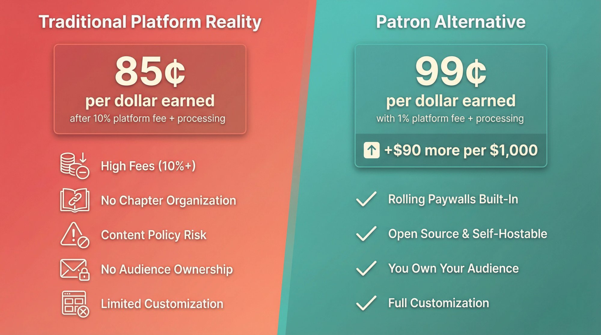
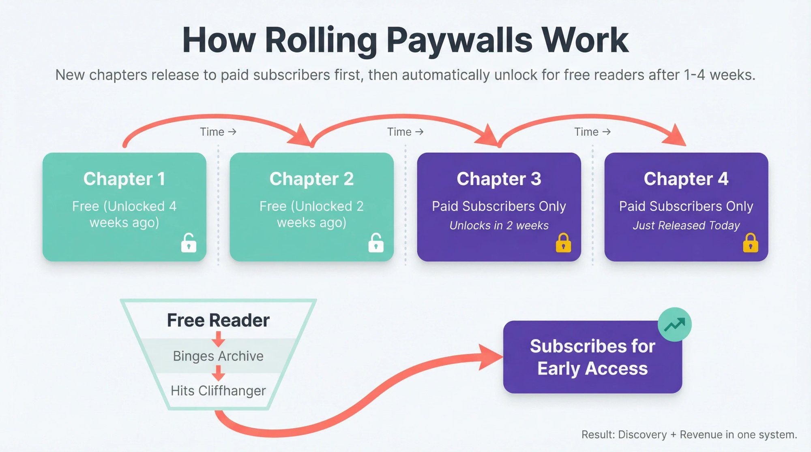
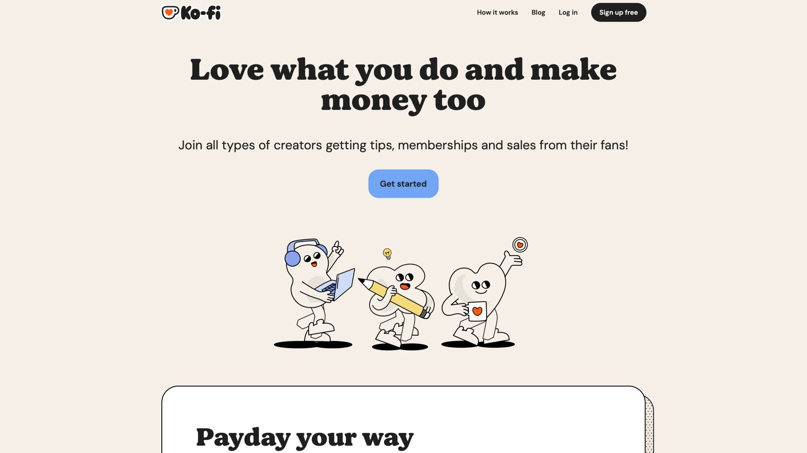
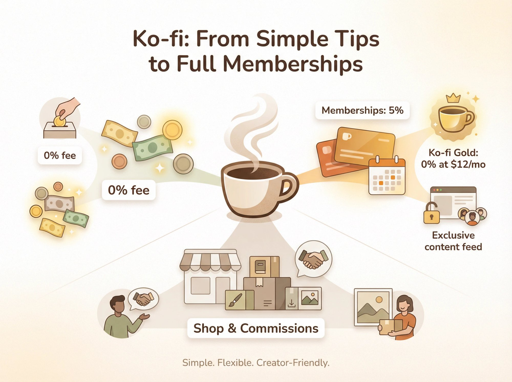
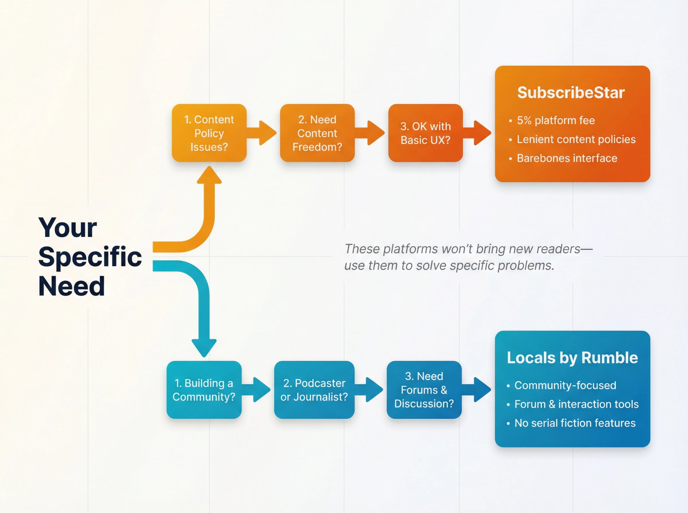
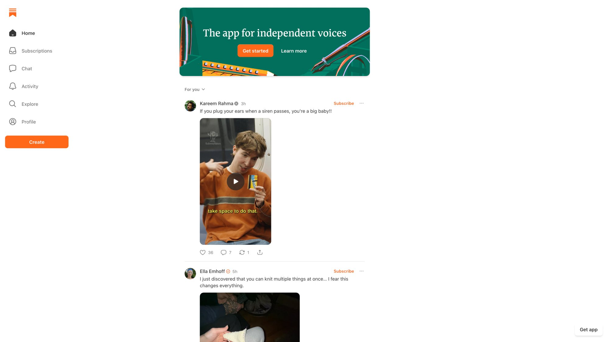
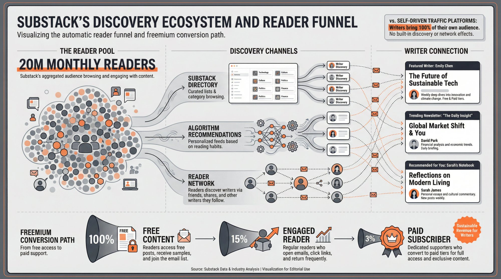
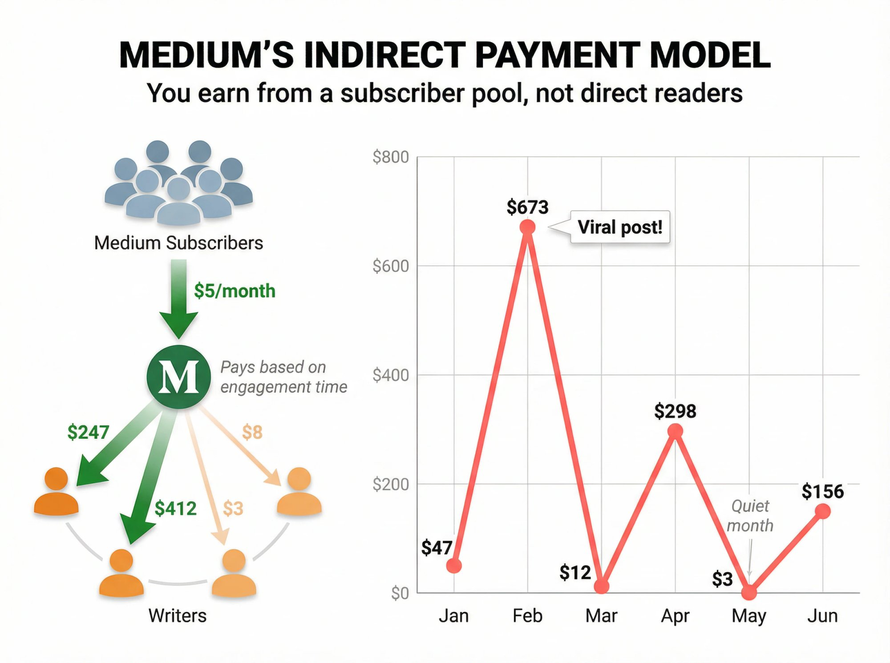

If you're a writer looking to earn directly from readers, the largest membership platform isn't your only option anymore. And in 2025, it might not even be your *best* option.

For years, that platform dominated fan funding for creators. It worked. Authors built communities there, serialized novels, and turned readers into paying supporters. But recent changes have writers reconsidering. In August 2025, the incumbent platform introduced a [flat 10% platform fee for all new creators](https://support.patreon.com/hc/en-us/articles/36426991446797-A-standard-platform-fee-for-new-creators-effective-after-August-4-2025). Add payment processing fees (around 2.9% + $0.30 per transaction), and you're suddenly keeping only about **85 cents of every dollar** your readers pay. You can [calculate your true take-home pay](https://www.patron.com/blog/post/how-to-calculate-your-true-patreon-take-home-pay-2025/) to see the exact impact on your earnings.

That math stings. A writer making $1,000 monthly from supporters might take home just **$850 after everything's deducted**. Over a year, that's $1,800 disappearing into platform fees alone. Understanding the [2025 fee changes](https://www.patron.com/blog/post/patreon-fee-changes-2025/) helps you make an informed decision about alternatives.

**Writers now have real alternatives.** Some charge as little as 1% in platform fees. Others are purpose-built for serial fiction with features like [rolling paywalls](https://www.patron.com/blog/post/what-is-a-rolling-paywall/) and chapter scheduling. A few give you built-in discovery that can grow your audience organically.

This guide breaks down every major alternative available to writers in 2025. We'll cover membership platforms, newsletter tools, self-hosted solutions, and help you figure out which fits your specific situation.

## Why Writers Are Leaving Traditional Platforms like Patreon in 2025

Several pain points are pushing authors toward alternatives. Understanding them helps you evaluate what matters most for your own work.

**The fee problem is real.** Between the 10% platform fee and payment processing, writers on traditional platforms like Patreon keep roughly 80-85% of what readers pay. That's a significant cut, especially when alternatives exist that take far less. On an open-source platform like [Patron](https://www.patron.com/), early adopters pay just **1%**. The difference on $1,000 in monthly support? About $90 stays in your pocket instead of the platform's. For a detailed breakdown, see our guide on [calculating your true take-home pay](https://www.patron.com/blog/post/how-to-calculate-your-true-patreon-take-home-pay-2025/).

**Serial fiction gets second-class treatment.** The incumbent platform wasn't designed for reading. Posts appear in a chronological feed with no chapter organization, no e-reader interface, no easy way for readers to navigate a 200-chapter novel. Many authors end up posting free chapters on sites like [Royal Road](https://www.patron.com/blog/category/royal-road/) or Wattpad, then using Patreon only for "early access" posts. It's a clunky workaround that frustrates everyone.

**Content policies bite unexpected creators.** Erotica writers, romance authors with steamy scenes, and fanfic creators pushing boundaries have all learned that Patreon can be strict about content. Some authors have had their pages banned with limited warning. If you write anything that brushes against community guidelines, that unpredictability becomes a business risk. We've covered [what to do if your content gets banned](https://www.patron.com/blog/post/what-to-do-if-patreon-content-got-banned/) and how to protect yourself.

**You don't really own your audience.** When readers subscribe on traditional platforms, you don't automatically get their email addresses. If you ever leave (or get kicked off), reaching those supporters becomes difficult. Industry research shows this ownership distinction matters enormously for building a sustainable author business.

**Customization is limited.** Your page looks like everyone else's page. It lives on their domain. If branding and a unique reader experience matter to you, traditional platforms don't offer much flexibility.

## What Is a Rolling Paywall

[**Rolling paywalls**](https://www.patron.com/blog/post/what-is-a-rolling-paywall/) are changing how serial fiction authors make money. You release new chapters to paying subscribers first. After a set time, usually one to four weeks, those same chapters automatically unlock for free readers.

Rolling paywalls solve the impossible choice between *discovery* and *revenue*.

Traditional paywalls force you to pick: either your content is locked behind a subscription, limiting who can find you, or it's free for everyone, which means your most devoted fans have no reason to pay. Rolling paywalls let you have both.

Free readers binge your archive, get hooked on your story, hit a cliffhanger where they've run out of free chapters, and subscribe to read ahead. Once they're paying, they stay subscribed because falling weeks behind means losing access to ongoing discussions and spoilers.

Your archive becomes a discovery engine. New readers find you through search, social shares, or recommendations. They read for free, fall in love with your work, then convert to paying supporters when they catch up. Your most dedicated fans happily pay for early access. This model works especially well when combined with [early access monetization strategies](https://www.patron.com/blog/post/how-to-monetize-a-podcast-with-early-access-not-ads/).

[Patron](https://www.patron.com/) built [rolling paywalls](https://www.patron.com/blog/post/what-is-a-rolling-paywall/) as a core feature. Traditional platforms don't natively support this; creators have had to manually unlock old posts or maintain separate sites. That manual work disappears with purpose-built tools.

## Best Membership Platforms for Writers

These platforms let readers subscribe and support you on an ongoing basis, similar to traditional membership models. The differences come down to fees, features, and how well they serve your specific type of writing. You can explore more about [choosing between platforms](https://www.patron.com/blog/post/ko-fi-vs-patreon-which-platform-is-best-for-creators/) to find what works best for you.

### Patron: The 1% Fee Alternative for Serial Fiction

[Patron](https://www.patron.com/) is a new membership platform designed specifically for sequential content: web novels, [webcomics](https://www.patron.com/blog/category/webcomics/), [podcasts](https://www.patron.com/blog/category/podcast/), anything released in episodes or chapters. It's currently in early access (alpha) but already offers the core features to run a membership.

[Patron](https://www.patron.com/) charges a **1% platform fee** for early adopters, locked in for life. You keep $99 of every $100 in fan support, versus $90 on traditional 10% platforms. You still pay standard Stripe processing of around 2.9% plus $0.30, but there's no high commission skim on top. Compare this to [current fee structures](https://www.patron.com/blog/post/patreon-fee-changes-2025/) on traditional platforms.

The math makes a real difference:

| Monthly Revenue | Traditional Platform (10% + fees) | Patron (1% + fees) | You Keep Extra |
| --- | --- | --- | --- |
| $500 | ~$425 | ~$480 | $55/month |
| $1,000 | ~$850 | ~$960 | $110/month |
| $2,500 | ~$2,125 | ~$2,400 | $275/month |

[**Rolling paywalls**](https://www.patron.com/blog/post/what-is-a-rolling-paywall/) **built in.** This is [Patron's](https://www.patron.com/) flagship feature. Publish a chapter to paying subscribers first, set it to automatically unlock after your chosen delay. Your patrons always get the newest chapters while your back catalog gradually opens up to attract new readers. No manual unlocking. No maintaining two separate sites.

**Series organization that makes sense.** [Patron](https://www.patron.com/) is built around the concept of series and episodes, not a generic blog feed. Readers can navigate your work in order. You get tools for scheduled releases, content segmentation by tier, and chapter organization that actually reflects how serial fiction works. Check out our [tier pricing guide](https://www.patron.com/blog/post/how-to-price-your-webcomic-tiers/) for strategies on structuring your offerings.

**Open-source and self-hostable.** The codebase is [Apache-2.0 licensed on GitHub](https://github.com/patroninc/patron). Tech-savvy writers can run their own instance. For everyone else, the hosted platform handles everything. Either way, you're not locked into a proprietary system. Follow our [development progress](https://www.patron.com/changelog/) to see what's shipping weekly.

**Creator-friendly policies.** [Patron](https://www.patron.com/) won't ban lawful content just because it's edgy. Adult fiction that triggers problems on traditional platforms like Patreon can live safely here, as long as it's legal. The platform is evolving fast, with [weekly updates on the changelog](https://www.patron.com/changelog/), and they're actively seeking input from early users. Read about [what happens if content gets banned elsewhere](https://www.patron.com/blog/post/what-to-do-if-patreon-content-got-banned/) and how [Patron](https://www.patron.com/) handles these situations differently.

*The honest trade-off* is that [Patron](https://www.patron.com/) is new. It doesn't have the ecosystem or name recognition of established platforms yet. You'll be inviting fans via waitlist links. Some features like mobile apps and built-in discovery are still in development. You're trading polish and audience size for low fees and features built specifically for how you work. Read about [how Patron got started](https://www.patron.com/blog/post/you-can-just-do-things-getting-patron-com/) to understand the vision.

Patron works best for web novelists, [webcomic artists](https://www.patron.com/blog/post/how-to-monetize-a-webcomic/), [podcasters](https://www.patron.com/blog/post/how-to-monetize-a-podcast-with-early-access-not-ads/), and anyone releasing sequential content regularly. It also fits creators who care about [open-source](https://github.com/patroninc/patron) or want the option to self-host. If you're comfortable being an early adopter, [Patron](https://www.patron.com/) offers a different approach to creator economics.

### Ko-fi: Best for Tips and Simple Memberships

Ko-fi started as a simple "buy me a coffee" tip jar and has evolved into something more versatile. It now supports one-off donations, memberships, commissions, and digital sales. The philosophy is flexibility without complexity. For a detailed comparison, read our [breakdown of popular creator platforms](https://www.patron.com/blog/post/ko-fi-vs-patreon-which-platform-is-best-for-creators/).

Ko-fi charges 0% on one-time donations, so you keep everything minus payment processing. For memberships and shop sales, Ko-fi takes 5%, unless you subscribe to **Ko-fi Gold** at $12/month, which reduces the platform fee to 0%. Many creators opt for Gold once they're making more than a few hundred dollars since it quickly pays for itself.

Membership tiers function similarly to Patreon, letting you offer different levels with supporter-only content like advance chapters or behind-the-scenes posts. Consider [annual vs monthly membership structures](https://www.patron.com/blog/post/annual-vs-monthly-memberships-for-creators/) when planning your tiers. The commissions and shop features let you sell services and digital goods directly. A novelist could sell ebook PDFs. An editor could take freelance gigs. Everything lives on one page. Instant payouts mean you can withdraw to PayPal or Stripe anytime with no monthly schedule lock. The simple interface reduces friction for both you and supporters, and fans can donate without creating an account.
    

*The trade-off* is that Ko-fi intentionally stays lean. There's no built-in discovery to bring new readers. Analytics on the free tier are basic. Community features aren't as developed. You're responsible for driving traffic. Ko-fi gives you the tools to get paid, but not much beyond that.

Ko-fi works best for writers who want simplicity and control over fees. If you're just starting out monetizing, Ko-fi is a friendly first step. It's free to start with no approval needed. It also works well for authors who prefer one-time support over recurring subscriptions. Just remember that you'll need to bring the audience yourself.

### Buy Me a Coffee: Easy Setup With a Polished Look

Buy Me a Coffee (BMC) operates similarly to Ko-fi but with a more polished interface and a few extra features. The trade-off is a **flat 5% fee** on all transactions, with no option to eliminate it.

Your BMC page can serve almost like a lightweight website. You can showcase your work, post updates, and send newsletters to supporters. The "Extras" feature lets you sell digital products or services a la carte. Built-in email tools help you thank supporters and stay connected.

If you want something more branded than Ko-fi but aren't ready for a full website, BMC sits in that middle ground nicely. The interface feels professional with minimal setup. Many authors who aren't technically inclined appreciate the out-of-the-box polish.

*The trade-off* is that the 5% fee applies to everything, always. For modest earnings it's fine, but at higher volumes it adds up fast. If you're making thousands monthly, you might pay more here than on traditional platforms.

BMC works best for writers who value a clean, professional presentation and don't mind paying 5% for convenience. If you primarily want to offer a few membership perks and maybe sell a digital book, BMC covers it simply.

### Ream: Platform for Serial Fiction Writers

If you're a serial fiction author, Ream was made for you. Launched in 2023 by novelists frustrated with traditional platforms, Ream brands itself as "a home where storytellers rule the world." In practice, it's a subscription platform built around reading long-form fiction.

Ream offers a social e-reader app where subscribers read your stories in a clean, book-like interface instead of scrolling through blog posts or Google Drive documents. Chapter scheduling lets you queue releases for specific times, which helps maintain a consistent weekly or biweekly cadence. Free followers can follow you and read public content, and you get their email addresses when they do. This creates a funnel where free followers read, get hooked, and convert to paid subscribers for early access. The built-in community gives your readers a space to discuss chapters, share reactions, and connect with each other.
    

Ream takes **10%** of revenue, matching Patreon. The argument is that specialized features and reader experience justify the same cut.

**Creator-friendly content policies.** Ream was partly founded because of content censorship on traditional platforms like Patreon. If you write romance or erotica that might get flagged elsewhere, Ream is more permissive (within legal bounds). About 60-70% of Ream authors are romance writers.

**Real results:** Web serial author ArcaneCadence launched "New Life as a Max Level Archmage" in mid-2025, built a massive [Royal Road](https://www.patron.com/blog/category/royal-road/) following, then directed readers to Ream for early access. By late 2025, she had built thousands of paying subscribers earning tens of thousands of dollars monthly from her story.

*The trade-off* is that Ream is still newer and smaller. There's no central browsing feature for readers to discover new authors. You're expected to bring your audience from elsewhere. And the 10% fee matches traditional platforms, so the economic advantage comes from features, not pricing.

Ream works best for serial fiction authors who want purpose-built tools in one place. If you're serializing a novel and want hosting, payment, email collection, and community features unified, Ream delivers.

### Other Alternatives Worth Considering

A few smaller membership platforms serve specific needs:

**SubscribeStar** functions like Patreon but with more lenient content policies. The 5% fee is competitive, and it's become a haven for creators who run afoul of stricter guidelines elsewhere. The user experience is more barebones, and some supporters find payment options clunky, but for writers in genres that face restrictions, it's worth considering. Learn more about [handling content policy issues](https://www.patron.com/blog/post/what-to-do-if-patreon-content-got-banned/).

**Locals** (by Rumble) focuses on community-oriented subscriptions popular with podcasters and commentators. You create a gated community with forums, posts, and interaction. For non-fiction writers or journalists building tight-knit communities, it could work, though it lacks serial fiction tools.

These smaller platforms typically won't bring you new readers. Use them if they solve a specific problem (like content freedom) that bigger platforms can't.

## Newsletter Platforms for Writers

Not every writer wants a membership model. Some prefer sending content via email or earning through a platform's existing reader pool. These options work differently from traditional patronage.

### Substack: Best for Writers Who Want Discovery

Substack lets you publish newsletters and charge subscribers for access. It has exploded among journalists, essayists, and independent bloggers, with over **20 million monthly active readers** across all newsletters.

Substack takes 10% on subscriber payments, plus Stripe processing. There are no upfront costs. Substack only makes money when you do.

Many readers find new writers through Substack's directory and recommendations. If you write on popular topics, new readers can stumble onto your work without you marketing to them directly. This is a genuine advantage over platforms that require you to drive all your own traffic. The editor is minimal and distraction-free. You publish, and it goes out via email and web. For writers who find membership management distracting, Substack's simplicity appeals. Many successful Substacks offer some posts free and some paid. You can build an audience with free content, then convert a percentage to paying subscribers.
    

*The trade-off* is that newsletter format isn't ideal for serial fiction. Readers consume chapters via email, which works for some but feels awkward compared to a dedicated reading app. There's no table of contents for a serial, just an archive. And the 10% fee isn't reducible.

Substack works best for writers of articles, essays, short stories, or commentary who want built-in discovery and direct reader relationships. It works especially well if you have or want to grow an email list.

### Medium: Get Paid Without Managing Subscriptions

Medium takes a completely different approach. You don't charge readers directly. Instead, you publish for free, and Medium pays you based on how much time paying Medium members spend reading your work.

Medium has subscribers who pay $5/month for unlimited reading. When those paying members read your articles, Medium allocates a portion of their fee to you based on engagement.

Medium requires no paywall management. You just write and Medium handles monetization. The platform has millions of readers and algorithmic distribution, so a resonant article can reach far more people than you'd ever find through your own marketing. The overhead is low with a simple editor, no subscription management, and no community tools to maintain.
    

*The trade-off* is that income is unpredictable. One month you might earn hundreds from a viral post. The next month, nothing catches fire and you make $3. It's hard to plan around. You also don't own the audience relationship the way you do with direct subscriptions.

Medium works best for essayists, bloggers, and writers of standalone articles who want exposure without managing subscriptions. Think of Medium income as a bonus rather than a primary revenue source.

## How to Self-Host Your Membership Site

For writers who want complete ownership, self-hosting eliminates platform dependency entirely. It requires more technical effort but maximizes your control and minimizes fees.

**Memberful** lets you embed subscription functionality into your own website. You can lock posts for paying members, handle Stripe payments, and manage subscribers on your own domain with your own branding. The Pro plan at $49/month removes transaction fees beyond credit card processing.

**Ghost** is an open-source publishing platform with built-in membership features. Run your own site, send emails, gate content, with 0% transaction fees on higher tiers. It's more technical to set up but offers full branding control.

**WordPress plugins** like MemberPress or Paid Memberships Pro add subscription features to existing WordPress sites. Yearly license fees ($175-360) but no per-transaction cuts.

*The trade-off* is that you handle everything. Site maintenance, security, user experience, and driving all your own traffic fall on you. There's no network effect. Readers need to create yet another account on yet another website. This path makes sense once you have an established audience and resources to manage technical infrastructure.

**DIY options** exist too. Some authors run PayPal donation buttons with manual email lists, or gate content via Discord/Telegram channels. It works for some, but the administrative overhead grows quickly.

## How to Choose the Best Platform for Your Writing

There's no universal "best" option. The right choice depends on your specific situation.

**Match platform to content type.** Serializing a novel? [Patron](https://www.patron.com/) or Ream offer purpose-built tools with [rolling paywalls](https://www.patron.com/blog/post/what-is-a-rolling-paywall/). Writing essays or journalism? Substack's discovery matters. Want simple tips without ongoing obligations? Ko-fi's flexibility fits.

**Consider your audience's habits.** If readers already follow you on [Royal Road](https://www.patron.com/blog/category/royal-road/) or Wattpad, steering them to a familiar reading experience creates less friction than asking them to subscribe to a newsletter.

The real question isn't which platform is best. It's which platform fits how you actually work and what your readers actually want.

**Weigh control versus convenience.** Self-hosting gives maximum ownership but maximum work. Hosted platforms are turnkey but take a cut and set the rules.

**Think about where you are in your journey.** Still building an audience? Platforms with discovery (Substack, Medium) help you grow. Already have devoted fans? Low-fee options like [Patron](https://www.patron.com/) or Ko-fi Gold maximize what you keep from existing supporters.

**Mixing platforms is fine.** Many authors maintain multiple income streams. They post free content on one platform for discovery, paid subscriptions on another for monetization, and direct ebook sales for additional revenue. Different segments of your audience may prefer different ways to support you.

If you're ready to make a change, our guide on [switching to Patron](https://www.patron.com/blog/post/switch-from-patreon-to-patron/) walks you through the transition process step by step.

## Platform Fees Compared (2025)

| Platform | Platform Fee | Payment Processing | Total Typical Cost | Key Differentiator |
| --- | --- | --- | --- | --- |
| [Patron](https://www.patron.com/) | 1% | ~3% | ~4% | [Rolling paywalls](https://www.patron.com/blog/post/what-is-a-rolling-paywall/), [open-source](https://github.com/patroninc/patron) |
| Ko-fi (free) | 0% (tips) / 5% (memberships) | ~3% | 3-8% | Flexibility, simplicity |
| Ko-fi Gold | 0% | ~3% | ~3% + $12/mo | Best for consistent income |
| Buy Me a Coffee | 5% | ~3% | ~8% | Polished interface |
| Ream | 10% | ~3% | ~13% | Fiction-focused features |
| Substack | 10% | ~3% | ~13% | Built-in discovery |
| Patreon | 10% | ~3% | ~13% | Established user base |
| Memberful Pro | 0% | ~3% | ~3% + $49/mo | Full website integration |

## Writer Platform Alternatives FAQ

**What exactly is a rolling paywall?**

A [rolling paywall](https://www.patron.com/blog/post/what-is-a-rolling-paywall/) lets you release content to paying subscribers first, then automatically unlock it for free readers after a set time (usually one to four weeks). Your subscribers always get early access while your back catalog grows as free content that attracts new readers. [Patron](https://www.patron.com/) offers this as a built-in feature.

**Which platform has the lowest fees for writers?**

[Patron](https://www.patron.com/) charges just 1% for early adopters, plus standard payment processing (~3%). Ko-fi Gold charges $12/month flat with 0% transaction fees, making it very competitive for consistent earners. Patreon typically take 10% plus processing. Use our [take-home pay calculator](https://www.patron.com/blog/post/how-to-calculate-your-true-patreon-take-home-pay-2025/) to compare your actual earnings across platforms.

**Can I use multiple platforms at the same time?**

Yes, and many successful authors do. You might post free content on Medium for discovery, run paid subscriptions on [Patron](https://www.patron.com/) for dedicated fans, and sell completed ebooks through your own store. Just be clear with readers about what each channel offers.

**What if I write content that might violate mainstream platform policies?**

Platforms like Ream, SubscribeStar, and [Patron](https://www.patron.com/) have more permissive content policies than traditional options. Ream was specifically founded after its creator faced content restrictions elsewhere. [Patron](https://www.patron.com/) commits to not banning lawful content just because it's edgy. Learn more about [what to do if your content gets banned](https://www.patron.com/blog/post/what-to-do-if-patreon-content-got-banned/) on traditional platforms like Patreon. Always review specific platform terms for your genre.

**How do I migrate from the dominant platform to an alternative?**

Most creators recommend a gradual transition. Announce the new platform to your existing supporters, explain why you're moving (lower fees, better features, etc.), and potentially run both in parallel during the transition. Our detailed guide on [switching to Patron](https://www.patron.com/blog/post/switch-from-patreon-to-patron/) covers the complete process. Some platforms offer import tools, but building fresh on a better-suited platform is often cleaner than trying to migrate everything.

**Which platform is best specifically for serial fiction?**

[Patron](https://www.patron.com/) and Ream are both designed for serial content. [Patron](https://www.patron.com/) offers [rolling paywalls](https://www.patron.com/blog/post/what-is-a-rolling-paywall/), series organization, and 1% fees. Ream provides a dedicated reader app, chapter scheduling, and community features at a 10% fee. Both beat Patreon for serial fiction workflow. [Webtoon creators](https://www.patron.com/blog/post/best-platform-for-webtoon-creators/) and [webcomic artists](https://www.patron.com/blog/post/how-to-monetize-a-webcomic/) will find specialized support on [Patron](https://www.patron.com/) as well.

## What Matters Most for Writer Success

No matter which platform you choose, the core of success stays the same: consistently create work that resonates with readers, and nurture relationships with those readers.

Platforms are infrastructure. They facilitate the exchange of value between you and your audience. The best platform is the one that gets out of your way, keeps more money in your pocket, and fits how you actually work.

For serial fiction writers tired of the old model's limitations, [Patron](https://www.patron.com/) offers a different approach. [Rolling paywalls](https://www.patron.com/blog/post/what-is-a-rolling-paywall/) solve the discovery-versus-revenue problem. [Fees respect your work](https://www.patron.com/blog/post/patreon-fee-changes-2025/). [Open-source flexibility](https://github.com/patroninc/patron) puts you in control. It's early, it's [evolving fast](https://www.patron.com/changelog/), and it's built by people who understand what sequential creators need.

Whatever you choose, stop letting platform fees eat your earnings. The alternatives exist. Your readers will follow where you lead them.

*Data in this article is current as of late 2025. Prices and policies change, so verify details before committing to any platform.*
