If you create 18+ comics, choosing where to host and monetize your work isn't just important. It's existential. The past few years have been brutal for adult creators. Payment processors tightened their grip, major platforms overhauled their content policies, and [Gumroad outright banned most NSFW art sales in early 2024](https://www.maketecheasier.com/patreon-alternatives-for-nsfw-artists/).

You're probably asking. *Where can I safely publish and actually earn from my work in 2025?*

This guide breaks down the platforms welcoming NSFW comic artists, compares their fees and policies with real creator data, and helps you choose the setup that protects both your creative freedom and your income.

## What Do NSFW Comic Artists Need from a Platform?

Not all platforms handle adult content equally. Before diving into specific options, let's establish what matters when you're creating work most payment processors would rather pretend doesn't exist.

### Why Content Policies Matter for Adult Comic Artists

Your platform needs to **explicitly allow your type of NSFW content**. This isn't one-size-fits-all. Some platforms permit adult art but ban certain themes (**anything involving minors, bestiality, non-consensual scenarios, extreme violence**). Others are far more permissive.

[Traditional membership platforms tightened enforcement significantly in 2024](https://www.patron.com/blog/post/what-to-do-if-patreon-content-got-banned/), partly due to payment processor pressure. What flew under the radar last year might get you suspended today. Always review guidelines thoroughly before investing time building your page.

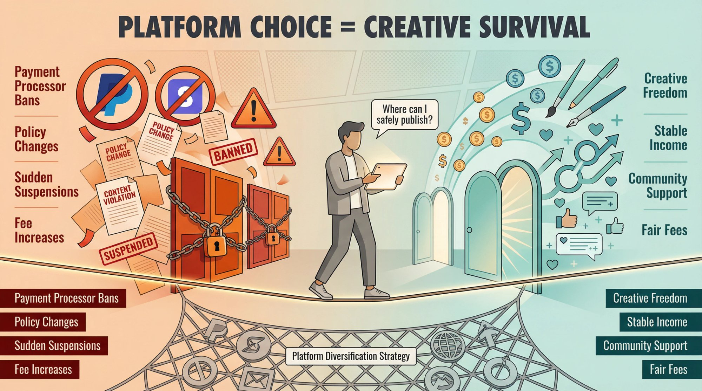

### How to Find Readers for Your NSFW Comics

Consider where your fans already congregate. If you've built a following on mainstream webcomic platforms or social media, you'll need a [monetization platform that integrates smoothly](https://www.patron.com/blog/post/how-to-monetize-a-webcomic/) with your existing presence.

Many successful NSFW creators use a [two-platform strategy for webcomics](https://www.patron.com/blog/post/best-platform-for-webtoon-creators/). **Free platform for discovery** on Webtoon, Tapas, or your own site **leads to paid platform for monetization**.

Take the BL webcomic *R.U. Screwed* by Bittie. It amassed over **90 million views** and **200k+ subscribers** on Tapas, then converted dedicated fans into **7,900+ paying supporters** through early access to new chapters.

### What Features Do Adult Comic Artists Need?

Different monetization models require different tools. For **membership or subscription models**, you need reliable recurring payment processing, tier management, and content scheduling. For **digital sales**, you want storefront functionality for PDFs, art packs, or complete chapters. For **community engagement**, look for integrated comments, Discord connectivity, or direct messaging.

**Sequential content specifically.** This is where most platforms fall short. Comics aren't standalone posts. They're ongoing narratives that need proper organization, navigation by chapter, and ideally, timed release features like [rolling paywalls](https://www.patron.com/blog/post/what-is-a-rolling-paywall/).

### How Rolling Paywalls Work for NSFW Comics

Speaking of which. [**Rolling paywalls**](https://www.patron.com/blog/post/what-is-a-rolling-paywall/) **solve a critical problem for sequential creators**.

Rolling paywalls let you monetize early access while your back catalog builds organic discovery. It's the difference between a permanent paywall that blocks new readers and a time-release valve that converts them into subscribers.

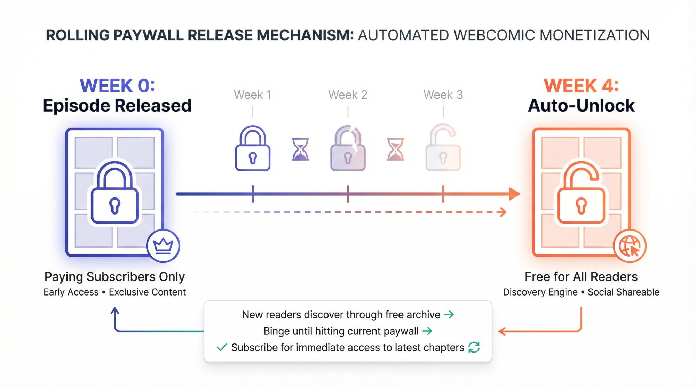

Here's how they work. You release new episodes to paying subscribers first, then those same episodes automatically become free after a set time (usually 1-4 weeks). This creates a sustainable conversion funnel. New readers discover your comic through the free archive. They binge until hitting the paywall. They subscribe to get immediate access to latest chapters. They stay subscribed to avoid falling weeks behind.

This model lets you monetize early access while your back catalog builds organic discovery. Traditional platforms that lock everything behind a permanent paywall lose the discovery engine. Platforms with no paywall features at all force you to manually manage what should be automated.

[Patron](https://patron.com) was built specifically for this workflow, with [rolling paywall automation for webcomics and serialized fiction](https://www.patron.com/blog/post/what-is-a-rolling-paywall/). But even if you're managing releases manually on other platforms, understanding this conversion psychology helps you structure your monetization strategy.

### Platform Fees Comparison for NSFW Creators (2025)

Platform fees vary dramatically, and they compound quickly.

| **Platform Type** | **Platform Fee** | **Payment Processing** | **Your Take-Home (per $1,000)** |
| --- | --- | --- | --- |
| Traditional membership (new creators) | ~10% | ~3% + $0.30/transaction | ~$870 |
| SubscribeStar | 5% | ~3% + $0.30/transaction | ~$920 |
| Pixiv FANBOX | 10% | ~3% + PayPal fees | ~$870 |
| OnlyFans | 20% | Included | ~$800 |
| Ko-fi Gold | 0% (with $6/mo subscription) | ~3% + $0.30/transaction | ~$970 |
| [Patron](https://patron.com) (early adopter) | 1% | ~3% + $0.30/transaction | ~$960 |
| Self-hosted (Ghost, WordPress) | 0% | ~3% + $0.30/transaction | ~$970 |

*Note: These are approximations. Actual fees depend on transaction size, currency, and payment method.*

That **9% difference** between traditional platforms and lower-fee alternatives? On $5,000/month, that's **$450 you're losing annually**. On $10,000/month, it's **$900/month** (**$10,800/year**). [Read more about platform fee comparisons](https://www.patron.com/blog/post/patron-fee-changes-2025/).

### Which Payment Processors Accept NSFW Content?

Even if a platform allows your content, payment processors often don't. Many NSFW creators have experienced this pain. **PayPal** is historically hostile to adult content, though some platforms route around this. **Stripe** is more permissive but still has restrictions on extreme content. **Payoneer** is often used as an alternative for international creators. **Direct bank transfers** are slower but more reliable for controversial content.

Some platforms have established relationships with processors that tolerate adult content. Others... haven't. [Payment processor pressure has forced policy changes across the industry](https://www.patron.com/blog/post/what-to-do-if-patreon-content-got-banned/), which is why diversification matters.

### How to Choose a Stable Platform for Adult Content

Here's what keeps creators up at night. *Will this platform suddenly change its mind about adult content?*

Look at track record. Has the platform grandfathered existing creators during policy changes? Has it communicated policy updates clearly and in advance? Has it built features specifically for adult creators, or merely tolerated them?

Also consider whether the platform facilitates community. Built-in comments, community posts, and Discord integration can increase subscriber retention significantly.

## Best Platforms for NSFW Comic Artists in 2025

Now let's examine specific options, with real creator data and honest trade-offs.

### Quick Platform Comparison Chart

| **Platform** | **Platform Fee** | **NSFW Policy** | **Best For** | **Key Advantage** |
| --- | --- | --- | --- | --- |
| Patreon | ~10% | Allowed but restricted | Mainstream content, established audience | Massive user base, robust features |
| SubscribeStar | 5% | Very permissive | Edgy/extreme content | Creative freedom, low censorship |
| Pixiv FANBOX | ~10% | Permissive (Japan law) | Anime/manga style artists | Integrated with Pixiv, Asian audience |
| OnlyFans | 20% | Adult-focused | Interaction-heavy content | No NSFW fear, direct fan engagement |
| Ko-fi | 0-5% | Moderate restrictions | Tame content + digital sales | Flexible monetization, low fees |
| Itch.io | 0-10% (you choose) | Permissive for fiction | Selling complete works | Pay-what-you-want, creator-controlled fees |
| Self-hosted (Patron) | 1% (or 0% DIY) | Unrestricted (legal content) | Sequential creators | Rolling paywalls, full control |

### Patreon for NSFW Comics. Pros and Cons

**The Landscape.** The household names in creator funding do allow adult content, but with significant caveats. Many NSFW webcomic artists still use these platforms for their familiarity and large user base.

Take [artist InCase, who earns around **$17,000 per month** from **~5,700 supporters**](https://graphtreon.com/creator/InCaseArt), publishing the erotic fantasy comic *Alfie*. And Bittie's *R.U. Screwed* has over **7,000 paying members**, making it the **#1 ranked adult comic** in the category.

**Strengths.** Traditional platforms offer a massive user base with built-in audience. Robust features like tiered memberships, Discord integration, and merchandise support. Supporters trust them for recurring payments. Stable income if you build a following.

**Limitations.**

**Content enforcement is unpredictable.** While vanilla adult content is generally fine, anything "edgy" risks suspension. Explicitly banned: content involving minors, incest, bestiality, extreme gore, non-consensual scenarios.

But here's the problem: **enforcement is inconsistent**. [In mid-2024, some fiction writers received warnings for consensual erotic scenes in text](https://www.patron.com/blog/post/what-to-do-if-patreon-content-got-banned/) that had been fine for years. Fantasy monster-girl art? [Artist Slugbox had his account threatened because monster girls weren't "human enough"](https://www.patron.com/blog/post/what-to-do-if-patreon-content-got-banned/) and thus violated bestiality rules.

**Discovery is limited.** NSFW pages are hidden from public search by default. You need to bring your own audience.

**Fees are steep.** [New creators default to **~10% platform fees**](https://www.patron.com/blog/post/patron-fee-changes-2025/) (legacy accounts may have 5-8%), plus processing fees. For every $1,000 you earn, expect to keep around **$870** after all fees.

**Best for** creators whose NSFW content stays comfortably within mainstream platform boundaries, and who value the established ecosystem over creative freedom or lower fees.

**Critical tip.** Mark your page as "Adult Content" in settings. Stay obsessively updated on policy changes. [Have a backup plan and consider switching platforms if fees or policies become untenable](https://www.patron.com/blog/post/switch-from-patreon-to-patron/).

### SubscribeStar for Adult Comics. Complete Review

**The Alternative.** SubscribeStar operates very similarly to traditional membership platforms (fans subscribe monthly for exclusive posts), but with [far more relaxed content rules](https://www.maketecheasier.com/patreon-alternatives-for-nsfw-artists/).

They even run a dedicated adult site called **SubscribeStar.adult** specifically for 18+ creators.

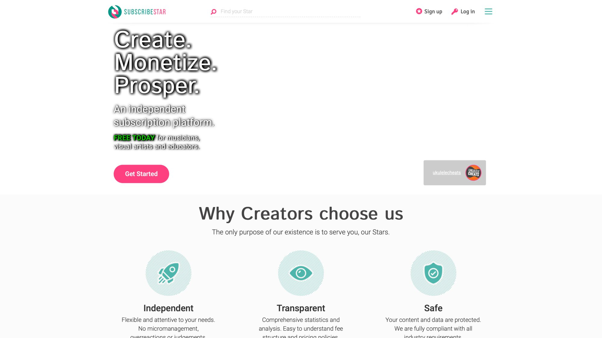

**Strengths**

[Almost anything legal goes.](https://www.maketecheasier.com/patreon-alternatives-for-nsfw-artists/) Artists can post content that would never fly on mainstream platforms, making it ideal for more extreme fetish material or edgy themes.

**5% platform fee** means creators keep **95% of pledges** (before payment processing). That's significantly better economics than the mainstream alternative.

[Payouts via Payoneer and bank transfers](https://www.maketecheasier.com/patreon-alternatives-for-nsfw-artists/) (not PayPal, which often refuses NSFW payments).

In short. Creator-friendly and censorship-light.

**Limitations**

**Smaller audience.** Many fans haven't heard of SubscribeStar, so you'll need to actively migrate and educate your followers. Some will hesitate to put their card into a new platform.

[Manual approval required for new creators](https://www.maketecheasier.com/patreon-alternatives-for-nsfw-artists/), which can take days or weeks. Plan ahead.

**Barebones features.** No native merchandise, no polished mobile apps. The UX is functional but not refined. Discovery is essentially zero. It's a paid feed for your existing fanbase.

**Fees.** 5% platform cut, plus payment processing fees. Creators typically net more per dollar than on mainstream platforms.

**Best for** NSFW comic artists who push boundaries, or anyone at risk of mainstream platform bans. If your comic features fantasy creatures that might be deemed "bestiality" (yes, that's happened to artists like [Slugbox, whose monster-girl art got flagged](https://www.patron.com/blog/post/what-to-do-if-patreon-content-got-banned/)), SubscribeStar offers security.

**Strategy tip.** Many creators maintain two presences: a "PG-13" mainstream account with censored content, and an "NC-17" SubscribeStar for uncensored/full experience. This casts a wider net while protecting your revenue stream.

### Pixiv FANBOX for Hentai and Adult Manga Artists

**The Japanese Option.** [FANBOX is extremely popular among anime-style artists](https://www.maketecheasier.com/patreon-alternatives-for-nsfw-artists/), including hentai and doujinshi creators. If your NSFW comic skews toward manga/anime aesthetic or you have a Pixiv following, this is a natural choice.

As of 2024, [FANBOX had over **230,000 creators** and **millions of users**](https://www.maketecheasier.com/patreon-alternatives-for-nsfw-artists/).

**Strengths**

**High tolerance for adult content.** Japanese law is the standard, meaning 2D erotic art is fine with [legally required censoring of genitals (mosaics/blurs)](https://www.maketecheasier.com/patreon-alternatives-for-nsfw-artists/) where mandated. In practice: hentai, BDSM, and most fetish content is allowed.

[Creators keep **90% of earnings**](https://www.maketecheasier.com/patreon-alternatives-for-nsfw-artists/) (FANBOX takes **~10%**), which is better economics than mainstream platforms.

**Integrated with Pixiv**, the massive art-sharing site. Fans who follow your free Pixiv art can seamlessly subscribe to your FANBOX for exclusive content. It's built for artists, with gallery-like posting and simple tier setup.

**Limitations**

**Interface feels Japanese-centric.** Even translated, navigation might feel less intuitive than Western platforms. Parts of the creator dashboard or fan messages might appear in Japanese.

[Censorship laws apply.](https://www.maketecheasier.com/patreon-alternatives-for-nsfw-artists/) You'll need to censor explicit bits to comply, which some Western artists find restrictive.

**Audience is heavily anime/manga focused.** If your style is Western or you're not already on Pixiv, you may struggle to find fans here.

**Fees.** Approximately 10% platform fee ([you keep 90%](https://www.maketecheasier.com/patreon-alternatives-for-nsfw-artists/)), plus PayPal fees on withdrawal. Small currency conversion fees when transferring funds from JPY.

**Best for** hentai artists, doujin creators, and NSFW comic artists with anime art style or existing Pixiv fanbase. If you create content that might be banned on US platforms but is legal in Japan (with appropriate censorship), FANBOX might work.

**Integration tip.** Post free teaser art on Pixiv to drive traffic to your FANBOX. Many creators offer works-in-progress, high-res files, or early comic pages on FANBOX while posting low-res or delayed releases on Pixiv.

### Should Comic Artists Use OnlyFans in 2025?

**The Controversial Option.** [OnlyFans is synonymous with adult subscription content](https://www.maketecheasier.com/patreon-alternatives-for-nsfw-artists/). While dominated by performers and cosplayers, some illustrators and NSFW artists use it for sharing art or comic pages.

**Strengths**

**No fear of NSFW bans.** OnlyFans famously attempted to ban explicit content in 2021 under payment processor pressure, then [reversed the decision within days](https://www.maketecheasier.com/patreon-alternatives-for-nsfw-artists/), recommitting to adult creators. You won't get banned for consensual adult imagery easily (they still have rules against illegal content).

**Unique monetization features.** Live streaming, private DMs, custom content sales, tips, pay-per-view messages. If you like personalized art or live drawing sessions for top fans, OnlyFans enables this.

**Name recognition is huge.** Many fans already have accounts. Integration with Twitter/X makes promotion straightforward.

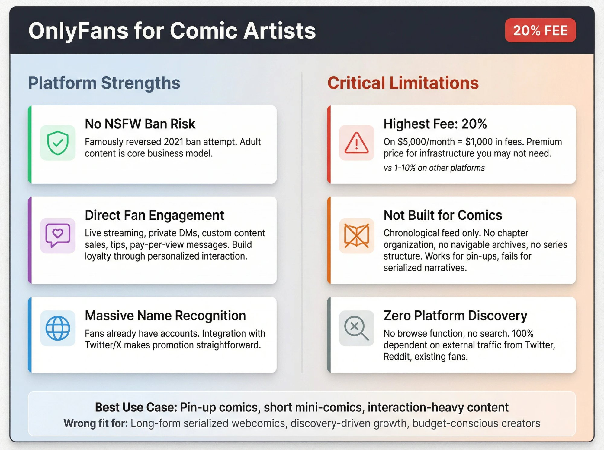

**Limitations**

[**20% platform fee**](https://www.maketecheasier.com/patreon-alternatives-for-nsfw-artists/) is one of the **highest in the industry**. You're paying a premium for infrastructure and brand recognition.

**Not designed for comic readability.** It's essentially a chronological feed of posts. There's no way to organize by chapters or provide navigable comic archives. This works for pin-ups or standalone pages, but not long-form serialized narratives. [For sequential storytelling, platforms built for webcomics work better](https://www.patron.com/blog/post/best-platform-for-webtoon-creators/).

**Strict verification required.** You must provide ID, get approved, and tag whether content contains real people. OnlyFans also forbids certain niches (similar banned list: no minors, bestiality, incest, extreme violence).

**Zero platform discovery.** Fans have to come from your external promotion. OnlyFans isn't a place people browse for art like they might on other platforms.

**Fees.** 20% platform cut. Payouts via bank transfer. They pay monthly or more frequently once you meet minimum threshold.

**Best for** NSFW artists treating their work as an **ongoing content feed** rather than serialized narrative. Works well for erotic pin-up comics, short mini-comics, or daily sketches that keep fans engaged. Also interesting as a side-channel for personalized interactions (commissions via DM system).

**Marketing reality.** Your success depends entirely on external promotion. Use Twitter, Reddit (many NSFW art subreddits exist), and be consistent. The messaging feature can build loyalty (send subscribers thank-you sketches or bonus panels), which matters when the platform takes 20%.

### Ko-fi for NSFW Artists. What You Need to Know

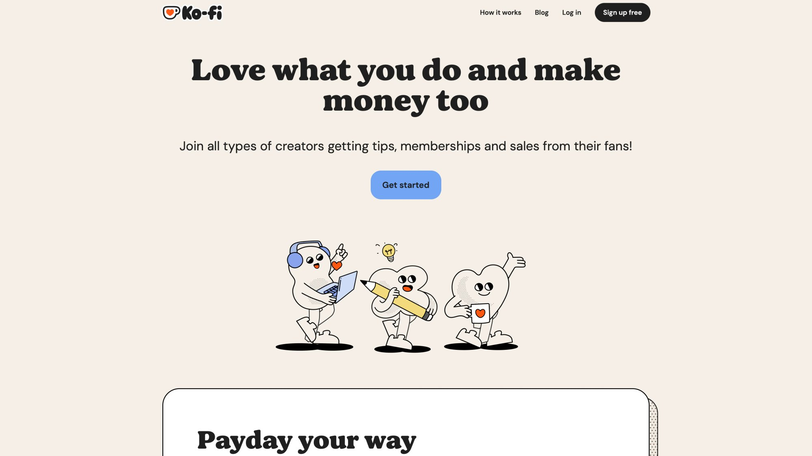

**The Tip-Jar Evolution.** Ko-fi started as simple tipping but now offers memberships, digital shops, and commissions. It allows NSFW content *with proper tagging*, though policies are somewhat conservative.

**Strengths**

**Flexible monetization in one place.** Accept one-off donations, sell digital downloads (PDFs, zines, art packs), or set up monthly supporter tiers.

[**0% platform fee** on donations, and if you subscribe to Ko-fi Gold (**$6/mo**), **0% on everything**](https://chartlex.com/blogs/news/patreon-vs-kofi-musicians-2025) (otherwise **5%** on memberships/sales). This can mean significantly more money in your pocket.

**No forced recurring payments.** Some fans prefer chipping in occasionally rather than subscribing, and Ko-fi handles this gracefully. NSFW tagging available so your page is hidden from public browsing but accessible via direct link.

**Limitations**

Ko-fi's NSFW policy is stricter than the tag implies. The tag is meant for nudity or softcore content, not extreme hardcore. Ko-fi explicitly states: tagging NSFW "doesn't mean all kinds of NSFW are allowed". Pornographic imagery that violates terms can still get you banned.

This makes Ko-fi safer for pin-up art or suggestive comics, but if your work is hardcore or fetishistic, you're at risk.

**Lacks community features.** No built-in discovery for NSFW creators since your page won't appear in searches if marked 18+. While you can make posts for supporters, it's not as robust as other platforms with no native Discord integration.

**No "membership culture" yet.** Fans may view it as a tip jar and need encouragement to join monthly tiers. [Learn more about Ko-fi vs traditional membership platforms](https://www.patron.com/blog/post/ko-fi-vs-patreon-which-platform-is-best-for-creators/).

**Fees.** [0% on donations to 5% on memberships/commissions if on free plan](https://chartlex.com/blogs/news/patreon-vs-kofi-musicians-2025). Payment processing (Stripe/PayPal) fees still apply separately.

**Best for** creators who want a no-frills, low-fee solution and whose NSFW content is relatively tame or artistic (boudoir pin-ups, mild erotic comics). Great if you want to **sell digital comic issues or bundles** in addition to subscriptions (Ko-fi's shop handles this easily, unlike platforms built purely for memberships).

**Implementation tip.** Clearly communicate what supporters get because Ko-fi isn't as standardized as other platforms. Use the NSFW tag in settings to comply with terms. Keep in mind Ko-fi uses PayPal or Stripe, so the same restrictions apply. When in doubt, contact Ko-fi support first.

### How to Sell NSFW Comics on [Itch.io](http://Itch.io)

### 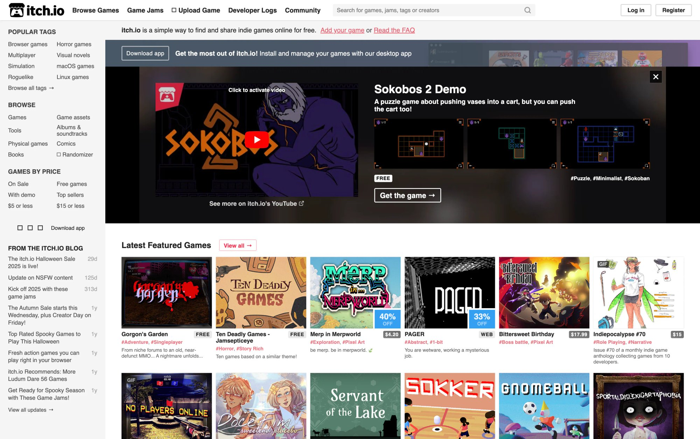

**The Indie Marketplace.** [Itch.io is known for indie games](https://www.maketecheasier.com/patreon-alternatives-for-nsfw-artists/), but it's also friendly to comics and digital art, including adult content. It's not a subscription platform. Instead, you upload files (PDFs, image packs, .zip of pages) and set a price or let fans pay what they want.

**Strengths**

**Freedom and control over sales.** Sell individual chapters, volumes, or bundles of your comic. Set your own prices.

[Innovative **Open Revenue Sharing** model](https://www.maketecheasier.com/patreon-alternatives-for-nsfw-artists/). You choose what cut Itch takes, anywhere from 0% to 100%. Yes, you can set it to 0% and keep all revenue (they survive on creators voluntarily setting ~10% default). This is arguably the best fee structure if you're selling content.

**NSFW fictional content is fine.** [Drawn erotica, adult games, lewd comics are allowed](https://www.maketecheasier.com/patreon-alternatives-for-nsfw-artists/) as long as it's not real photography of illegal content.

**Community features.** Comments, devlogs, and tagging for discoverability. Itch's audience is used to paying for digital content, so your comic might get discovered through search (including "Adult" content filter).

**Limitations**

**Not a subscription service** means no recurring income unless you manually release new paid chapters regularly. It's a store, not a membership platform. [For recurring memberships with rolling paywalls, consider platforms like Patron](https://patron.com).

**Fans need to find you** (though you can integrate Itch purchases with your own website easily).

[No adult *real* content allowed](https://www.maketecheasier.com/patreon-alternatives-for-nsfw-artists/) (to comply with PayPal/Stripe), but for comics, that's not an issue.

**Platform is less mainstream.** Some readers might not have an account or know how to use it.

**Fees.** Creator-selected, default 10% which you can reduce or raise. If you set 0%, you only pay payment processing fees around 3%. Itch also handles VAT for EU purchases and lets you generate free download keys.

**Best for** NSFW comic artists who prefer to **sell complete works or packs** rather than drip-feed page-by-page. If you release chapters as PDF downloads or complete volumes, Itch is fantastic. Also great as **secondary income**: run a membership platform for ongoing support, but sell high-resolution chapter bundles on Itch for people who prefer paying once.

Furry and kink content creators often use Itch to sell art packs that wouldn't be allowed elsewhere.

**Discovery tip.** Enable "NSFW" on project pages for proper filtering. Use tags like "comic," "doujin," "NSFW" so the right audience finds you. Consider setting minimum price but allow pay-what-you-want (fans often pay more generously). Write devlog updates about your comic progress to draw followers who see when you release new issues.

### Self-Hosting Your NSFW Comic Site with Patron. Complete Guide

**The Independent Route.** If you want full ownership and no platform rules, go self-hosted: run your own website with a membership system. This could mean using an open-source tool like [Patron](https://patron.com) or a CMS like Ghost to manage subscribers.

Essentially, *you become your own platform.*

**Strengths**

**Total freedom** (within legal bounds and payment processor terms). When you self-host, you set content rules. No random bans. If you own the site, it won't remove your content unless *you* take it down.

**Customize user experience** for reading your comic, integrate with your existing webcomic site, and keep almost all revenue (aside from payment fees).

**Open-source platforms make this viable.** [Patron is Apache-licensed](https://github.com/patroninc/patron) and was [specifically created for webcomic and serial fiction creators frustrated with traditional platforms](https://www.patron.com/blog/post/what-to-do-if-patreon-content-got-banned/). [Patron offers features like **rolling paywalls**](https://www.patron.com/blog/post/what-is-a-rolling-paywall/) (release pages to supporters first, then auto-unlock for free readers later) which are killer for webcomics building hype while gaining new readers.

If using [Patron's hosted alpha, you'd only have a **1% fee**](https://www.patron.com/blog/post/patron-fee-changes-2025/) and permissive content policies (they won't police legal adult content).

Other options: **Ghost** (open-source publishing platform) has membership/subscription features for paid chapters. WordPress has plugins (MemberPress, etc.) to lock posts for paid members.

Self-hosting also means choosing alternative payment processors if needed (some creators [even accept crypto to avoid payment bans](https://www.patron.com/blog/post/what-to-do-if-patreon-content-got-banned/), though that's niche).

**Limitations**

**Technical responsibility is yours.** When running your own setup, *you* handle site maintenance, security, backups, and customer support. If the site breaks or there's a billing glitch, it's on you. You'll need at least basic web dev skills or budget to hire help.

**Still not 100% free of rules.** You rely on payment processors like Stripe or PayPal unless you go crypto. Stripe's terms for adult content apply (they prohibit truly extreme or illegal content, and you must have age verification for some adult businesses). Compliance is your responsibility.

**Zero discoverability.** You won't appear in any platform directory. Marketing is entirely on you. It's also harder to build trust with fans to input credit cards on an individual's site versus a known platform (using trusted processor widgets helps).

**Fees.** Varies. If using [Patron's hosted service (currently in alpha), it's 1% fee for early adopters](https://www.patron.com/blog/post/patron-fee-changes-2025/). If [self-hosting Patron](https://github.com/patroninc/patron) or Ghost, platform fee is 0%. You just pay for web hosting and Stripe/PayPal fees per transaction. Ghost charges nothing beyond hosting unless using their Ghost(Pro) hosting. WordPress plus plugin might have license costs but no revenue cut. Essentially you keep around 97% or more of money since Stripe takes approximately 2.9% plus 30 cents.

**Best for** established creators with strong, loyal fanbases, or those kicked off every other platform who need an independent solution. If you already have a popular webcomic site getting traffic, adding your own membership system converts that traffic without sending visitors elsewhere.

This is for creators who value **longevity and control** over convenience. You're future-proofing income from platform policy changes.

Real example. NSFW artist [Slugbox eventually moved to selling content on his own site](https://www.patron.com/blog/post/what-to-do-if-patreon-content-got-banned/) after a major platform tried controlling his art across all sites. He lost some casual supporters in the move, but [ultimately he no longer lives in fear of a platform's next policy change](https://www.patron.com/blog/post/what-to-do-if-patreon-content-got-banned/).

**Transition strategy.** Communicate clearly with fans. Provide guides on how to subscribe and reassure them it's secure (use HTTPS, known payment gateway). Have a mailing list or Discord to keep community tight during transition. Be ready to wear many hats: you're the creator *and* customer support when someone's card fails.

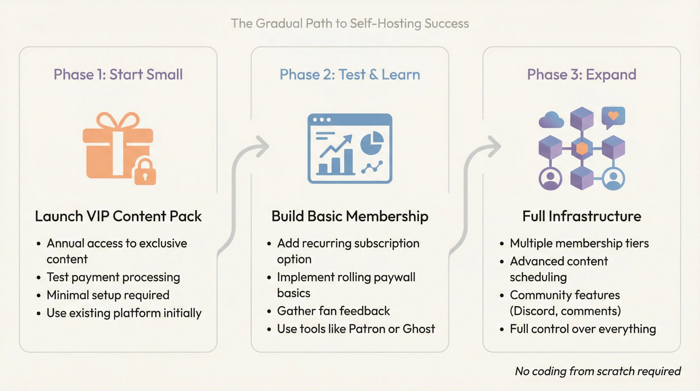

Start small. Maybe offer annual "VIP content pack" on your site as test, then expand to full membership if demand exists. You don't have to code from scratch. Tools like [Patron can give you full membership infrastructure](https://patron.com), and Ghost handles email newsletters to subscribers out of the box.

## Success Stories. How NSFW Comic Artists Make Money

Let's look at two NSFW comic creators finding success through different approaches.

### How Bittie Earns $12K to $63K Monthly from NSFW Comics

**Creator.** [Bittie (Kimmikala)](https://www.webtoons.com/p/community/en/u/Kimmikala)

**Comic.** *R.U. Screwed* (Boys' Love webcomic)

**Strategy.** Free platform for reach plus paid membership for revenue

*R.U. Screwed* garnered over 90 million views on Tapas/Webtoon. Rather than rely solely on ad revenue, Kimmikala monetized via membership platform.

She posts new pages weekly for subscribers, while eventually releasing them free on Tapas/Webtoon. This [**early-access strategy using rolling paywall principles**](https://www.patron.com/blog/post/what-is-a-rolling-paywall/) keeps fans eager to subscribe for latest pages.

Her [membership tiers start at just $2/month](https://www.patron.com/blog/post/how-to-price-your-webcomic-tiers/), lowering the bar for college-aged readers to support.

**Results.** Approximately **7,900 paying supporters** with [estimated earnings of **$12,000 to $63,000 per month**](https://graphtreon.com/creator/ruscrewed) and [**#1 rank in adult comics category**](https://graphtreon.com/creator/ruscrewed).

The formula. **Free PG-13 version for broad reach plus supporter-only uncensored/early version for superfans.** This showcases how NSFW comic artists can leverage mainstream platforms for audience-building and pair them with monetization.

Bittie also engages her community with bonus illustrations and character polls, keeping subscriptions sticky. Her success proves that even with platform fees and rules, a massive readership will gladly pay for convenience and support of beloved stories.

### Why Slugbox Left Patreon and Went Independent

**Creator.** Slugbox

**Art.** Colorful monster-girl and furry illustrations

**Journey.** Mainstream platform, then policy conflicts, leading to independence

Slugbox was once a popular creator on the mainstream membership platform Patreon, but [around 2020 ran into enforcement conflicts](https://www.patron.com/blog/post/what-to-do-if-patreon-content-got-banned/). The platform flagged his original character (a monster girl) [as violating "bestiality" rules simply because she wasn't human](https://www.patron.com/blog/post/what-to-do-if-patreon-content-got-banned/).

They even [demanded he remove certain artwork from *all his web platforms*](https://www.patron.com/blog/post/what-to-do-if-patreon-content-got-banned/) and forbade him from using other sites to host what they banned (an alarming overreach).

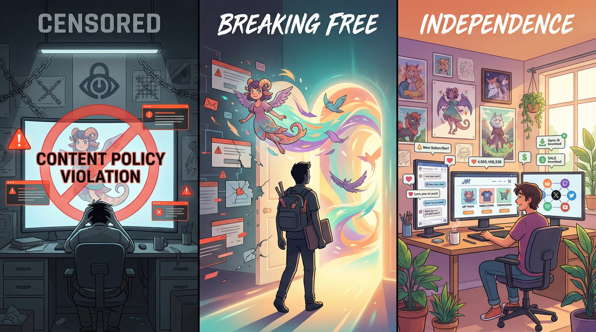

**His response.** [Slugbox left the platform entirely](https://www.patron.com/blog/post/what-to-do-if-patreon-content-got-banned/), set up his own website to sell art packs, and adopted more permissive platforms for ongoing support.

Yes, [he lost some casual followers who never made the jump](https://www.patron.com/blog/post/what-to-do-if-patreon-content-got-banned/) (almost inevitable). But he preserved creative freedom and maintained his core fanbase on his own terms.

By diversifying (personal storefront + NSFW-friendly platforms), Slugbox could continue earning a living [**without living in fear of the next policy change**](https://www.patron.com/blog/post/what-to-do-if-patreon-content-got-banned/).

His journey underlines a key point. **The "best" platform might be *multiple platforms***, and owning your distribution is the only foolproof safeguard against sudden bans.

## How to Choose the Right Platform for Your NSFW Comic

Each platform has distinct strengths. The "best" choice depends on **your content and your audience**.

**If your comic is relatively tame at R-rated and you want maximal reach,** traditional membership platforms or Ko-fi might serve you well. Large audience pools, established trust, and you avoid the extreme content they ban. Or use mainstream for main support and Ko-fi for one-off sales.

**If your comic pushes boundaries or you've been burned by bans,** SubscribeStar or [self-hosting via Patron](https://patron.com)/Ghost gives peace of mind to create freely. You might trade off some discoverability, but you won't walk on eggshells with every page you draw.

**If you thrive on social engagement and bonus content,** OnlyFans can be interesting, letting you treat fans to behind-the-scenes and personal interactions (good for pin-up artists or if you also cosplay as your character). Discord community features can complement whichever platform you pick.

**If you prefer selling finished work over subscriptions,** Itch.io or even periodic crowdfunding campaigns for print editions might be your avenue. Note that some crowdfunding platforms don't allow pornography. Many adult comic creators use them for art books by keeping it R-rated.

### Should You Use Multiple Platforms for NSFW Comics?

Many creators adopt **platform diversification**. [Run a mainstream account for general audience, but maintain a SubscribeStar for uncensored director's cut](https://www.patron.com/blog/post/what-to-do-if-patreon-content-got-banned/). Or use FANBOX for anime fans and mainstream for Western fans.

This stabilizes income. [If one platform falters, you have others](https://www.maketecheasier.com/patreon-alternatives-for-nsfw-artists/). It's more work to maintain multiple pages, but consider it insurance.

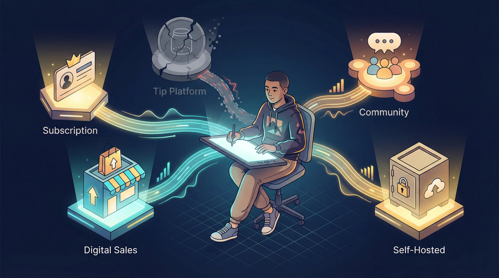

### Staying Updated on Platform Policy Changes

The NSFW creator landscape evolves as policies and laws change. What's true in 2025 could shift by 2026. Platforms adjust rules (often due to pressure from payment providers or app stores) and new alternatives emerge.

Follow creator community news. [When in doubt, reach out to platforms to ask if your specific content is allowed](https://www.patron.com/blog/post/what-to-do-if-patreon-content-got-banned/). Better to get ruling in writing than assume.

## Final Thoughts

**The best platform for you is the one that lets you connect with fans, earn sustainable income, and sleep at night without worry.**

For some, that's mainstream platforms with their polish and reach (despite fees). For others, it's smaller sites that respect adult art. And for a growing number, it's DIY solutions that future-proof their work from corporate crackdowns.

You may even find success using combination of platforms to cover all bases. Evaluate trade-offs, know your priorities (creative freedom vs. built-in audience vs. features vs. fees), and you'll make the right choice for your NSFW comic.

**Data in this guide is current as of late 2025.** Fees or policies could change, so always double-check latest information before committing.

Now go forth and get your work out there. The internet is hungry for quality adult comics, and with the right platform strategy, your fans can safely indulge and support you.

## Frequently Asked Questions

### Can I use multiple platforms simultaneously?

Absolutely, and many successful NSFW creators do exactly this. A common strategy is using one platform for mainstream/censored content to capture wider audience, while maintaining another for uncensored content. You might post PG-13 versions on a traditional platform while directing your most dedicated fans to SubscribeStar or your own site for full content. Just be mindful of each platform's terms of service regarding cross-promotion.

### What happens if I get banned from a platform?

First, [read the platform's appeal process](https://www.patron.com/blog/post/what-to-do-if-patreon-content-got-banned/) and respond quickly if you believe it's an error. If the ban stands, immediately communicate with your supporters through email lists or Discord (which is why building these off-platform communities is crucial). Many creators successfully [migrate to alternative platforms like Patron](https://www.patron.com/blog/post/switch-from-patreon-to-patron/), though you'll typically lose some casual supporters in the transition. This is why platform diversification and owning your audience contact information (email list, Discord server) matters so much.

### How do rolling paywalls work for NSFW comics?

[Rolling paywalls](https://www.patron.com/blog/post/what-is-a-rolling-paywall/) release new episodes to paying subscribers first, then automatically make those same episodes free after a set time (typically 1-4 weeks). This lets you monetize early access while your back catalog builds organic discovery. New readers discover your comic through free archive, binge until hitting the paywall, then subscribe for immediate access to latest chapters. They stay subscribed to avoid falling weeks behind. [Patron](https://patron.com) was built specifically for this workflow, with [automated rolling paywall features for webcomics](https://www.patron.com/blog/post/what-is-a-rolling-paywall/).

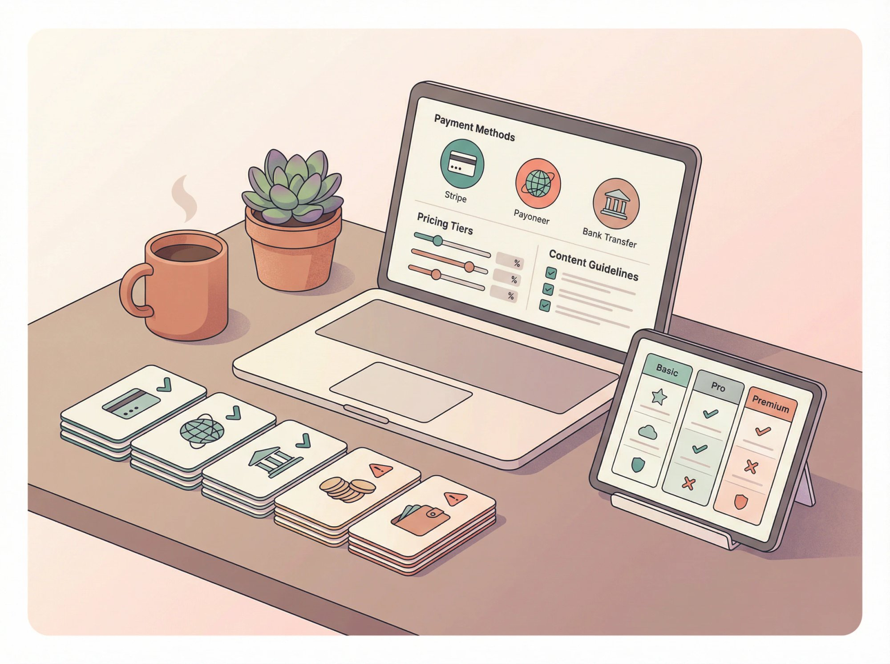

### What's the safest payment method for adult content?

No single method is perfectly safe, but some are more reliable than others. Stripe is generally more permissive than PayPal for adult content, though still has restrictions on extreme material. Payoneer is often used as alternative for international creators. Direct bank transfers are slower but more reliable for controversial content. Some platforms have established processor relationships that tolerate adult content better than if you tried processing payments independently. If going fully independent, consider accepting multiple payment methods to reduce risk.

### Do I need to censor my art on these platforms?

It depends on the platform and your location. Pixiv FANBOX requires [censorship of genitals (mosaics/blurs) to comply with Japanese law](https://www.maketecheasier.com/patreon-alternatives-for-nsfw-artists/). Traditional membership platforms don't require visual censorship but ban certain themes entirely. SubscribeStar has minimal censorship requirements. Self-hosted options let you set your own rules (within legal bounds and payment processor requirements). Always review specific platform guidelines for your content type.

### How much should I charge for NSFW comic subscriptions?

Successful NSFW comic creators typically offer multiple tiers starting low ($2-5/month for early access) and scaling up ($10-25+ for bonus content, high-res files, character polls, etc.). Bittie's *R.U. Screwed* starts at $2/month, making it accessible to students and casual fans, while offering premium tiers for dedicated supporters. [Learn more about pricing strategies for webcomic tiers](https://www.patron.com/blog/post/how-to-price-your-webcomic-tiers/). Research similar creators in your genre to understand market rates. Remember: it's easier to start lower and add value than to start high and lower prices later.

### Should I keep my real name private when creating NSFW content?

Many NSFW creators use pen names or pseudonyms for privacy and professional separation. This is entirely your choice. If using a pseudonym, be consistent across all platforms for brand recognition. Note that some platforms require real identity verification for payment processing (even if your public creator name is a pseudonym). You'll need to provide real information to the platform/payment processor, but this doesn't have to be public-facing.

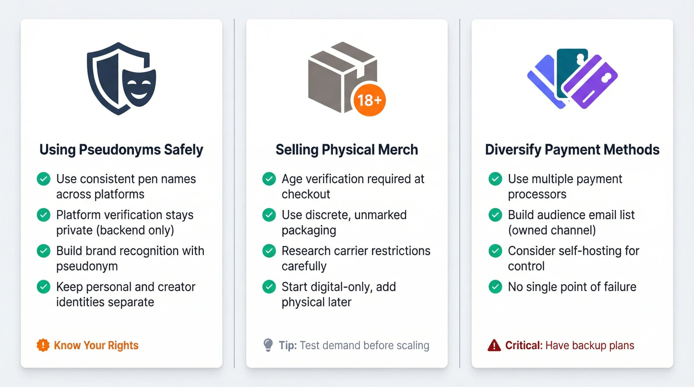

### Can I sell physical merchandise of NSFW comics?

Yes, though it's more complex than digital content. You'll need to handle age verification, discrete packaging, and comply with shipping regulations (some carriers have restrictions on adult materials). Platforms like traditional membership sites offer merchandise integration, but many NSFW creators use separate services or self-fulfill to maintain control. Consider starting with digital-only content and adding physical merchandise once you have proven demand and can handle logistics.

### What if payment processors suddenly stop supporting adult content?

This is exactly why diversification matters. [Payment processor pressure has forced policy changes across the industry](https://www.patron.com/blog/post/what-to-do-if-patreon-content-got-banned/). Strategies to mitigate risk include: maintaining presence on multiple platforms with different payment processors, building direct relationships with your audience (email lists, Discord), considering alternative payment methods (though cryptocurrency remains niche), and potentially [moving toward self-hosting where you control more of the stack](https://patron.com). No solution is foolproof, but diversification reduces single points of failure.

### How do taxes work for NSFW creator income?

Creator income is typically treated as self-employment income, regardless of content type. You'll need to report all earnings and pay applicable taxes. Platforms may or may not provide tax forms depending on your location and earnings threshold. Many creators work with accountants familiar with creative businesses. Keep detailed records of all income and expenses (platform fees, equipment, software subscriptions, etc.). Tax treatment of adult content varies by jurisdiction. Consult with a tax professional familiar with your local laws.

### Is it legal to create and sell NSFW comics?

In most jurisdictions, yes, as long as all depicted characters are clearly adults and content doesn't violate local obscenity laws. Laws vary significantly by country and even by state/province. Content that's legal in one jurisdiction might be illegal in another. Always ensure depicted characters are unambiguously adult, avoid content involving minors (even fictional), and familiarize yourself with laws in your jurisdiction. When in doubt, consult with a lawyer familiar with adult content regulations in your area. Remember that platform terms of service may be more restrictive than the law.

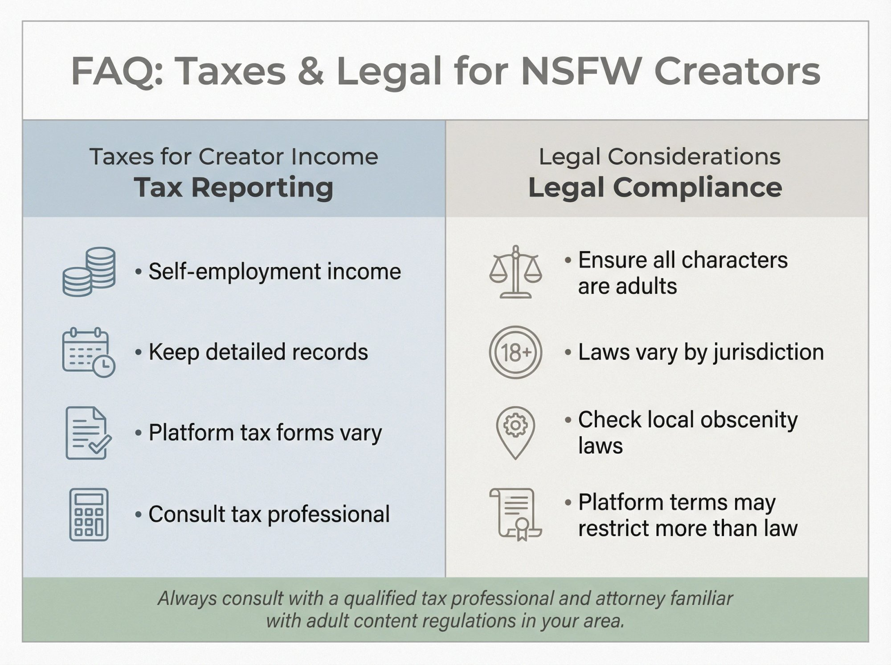