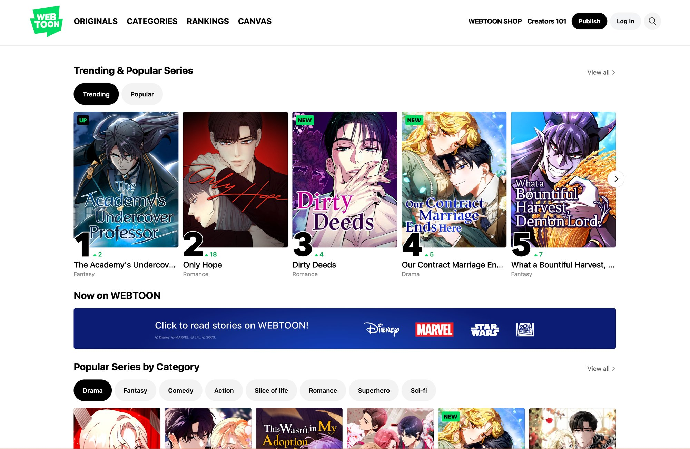
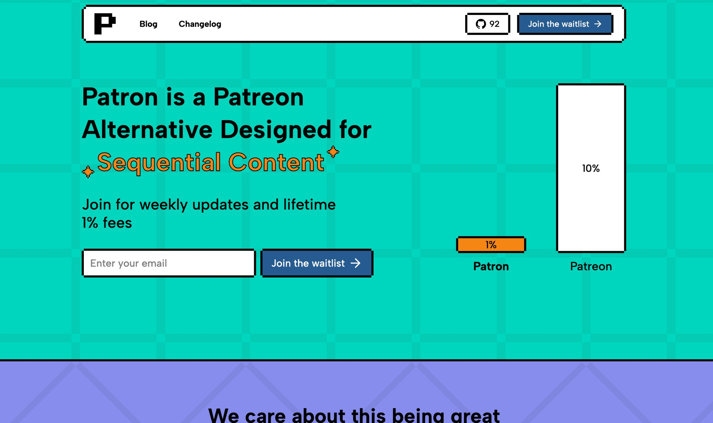
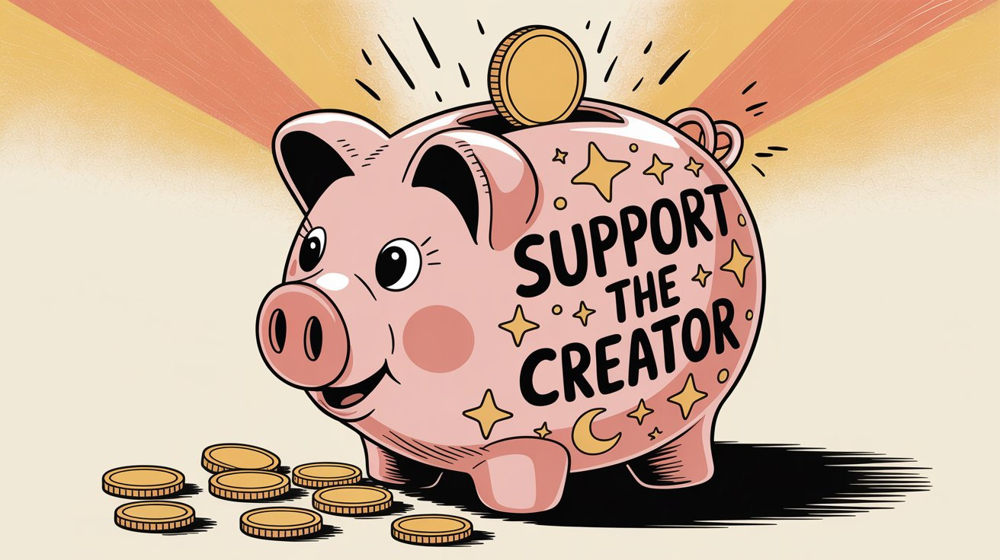

Webtoon creators face a unique challenge in 2025. The answer to "what's the best platform?" is never just one, it's always two. You need one platform where new readers can discover your comic, and another where devoted fans pay for early access through a rolling paywall subscription. This two-platform strategy is how most successful webtoon creators actually make money.

Here's how rolling paywalls work: You release new episodes to paying subscribers first, then those same episodes automatically become free after a set time (usually 1-4 weeks).

Your archive builds up as free content that attracts new readers, while your most engaged fans subscribe to get episodes early. It's the difference between locking content behind a permanent paywall and creating a time-release valve that serves both discovery and revenue.

## Why Webtoon Creators Need Two Platforms

The reality is simple: **no single platform solves both discovery and monetization**. Here's why successful webtoon creators always use two:

**Platform #1: Discovery:** Free platforms like WEBTOON and Tapas have millions of readers browsing for new comics. This is where new readers find your work. You post episodes for free to build an audience and prove your comic resonates.

**Platform #2: Monetization via Rolling Paywalls:** Once you have readers, you need consistent revenue. This is where subscription platforms come in. Devoted fans pay monthly to get new episodes 1-4 weeks early. After that window, episodes roll out to the free platform where new readers discover them.

This structure works because it serves two audiences simultaneously:

- **New readers** discover your comic through the free archive on WEBTOON/Tapas
- **Devoted fans** get early access and support your work through subscriptions

**Here's why rolling paywalls convert and retain subscribers:** 

A reader discovers your comic on WEBTOON, binges your free archive, and hits either a cliffhanger or runs out of episodes. They want more immediately, so they subscribe to get the next episodes early rather than waiting weeks. 

Once subscribed, they tend to stay subscribed because churning means waiting the entire rolling paywall period (often 2-4 weeks) before they can read new episodes again. The rolling paywall creates both the initial motivation to subscribe (impatience for more content) and the ongoing retention (fear of falling weeks behind).

## Where to Publish Your Webtoon for Maximum Reach

If your primary goal is reaching readers, you need to be on at least one major webcomic publishing platform. These are where millions of readers browse for new comics.

### WEBTOON: Best Platform for Webtoon Audience Growth

WEBTOON is the largest webtoon platform globally, with [**around 170 million monthly active users**](https://www.sec.gov/Archives/edgar/data/1997859/000119312524151708/d396527ds1.htm) across 150+ countries, with users spending around 30 minutes per day on the app. It's essentially the YouTube of webcomics.

**How it works:** WEBTOON has a free self-publishing section called **CANVAS** where anyone can upload episodes. Top CANVAS series that gain big followings might get picked up as WEBTOON Originals, which are contracted, featured series paid by the company.

**Monetization:** WEBTOON offers an Ad Revenue Sharing Program to CANVAS creators who meet eligibility requirements: **1,000 total subscribers** and **40,000 global monthly page views**. Once approved, creators receive **50% of Net Ad Revenue** on eligible ad placements, with a **minimum payout of US$100** (paid in $100 increments). **Reward Ads** unlock at **100,000 global monthly page views** once Viewer Ads are enabled. ([WEBTOON Ad Revenue Policy](https://www.webtoons.com/en/terms/adRevenueSharingPolicy))

But this revenue is modest for most creators. Two well-documented creator disclosures from 2021-2023 show how low CANVAS ad income can be:

- **Morishita** reported around **500,000 page views**, **23k subscribers**, **19 episodes**, and earned only about **$80 total** in ad revenue over 2020-2021.
- **TambriArt** reported **2.2 million views** over two years with about **$824 total**; their effective rate fluctuated from **$0.50 per 1,000 views** in one month to only **$0.28 per 1,000 views** in another.

_These are historical data points but still illustrate the order-of-magnitude gap between CANVAS ads and membership income._ ([How Much Money Do Webtoon Creators Earn?](https://taddy.org/blog/how-much-money-webtoon-artists-make))

_Ad pennies won't pay the bills for most CANVAS creators._

Becoming a paid Original is another path. According to WEBTOON's SEC filings, **professional creators earned on average around $48,000 in 2023**, with the **top 100 averaging $1 million**. WEBTOON's highest-paid creator reportedly made **over $9 million in one year**. In aggregate, WEBTOON **paid creators over $2.8 billion from 2017-2023**. ([WEBTOON S-1 Filing](https://www.sec.gov/Archives/edgar/data/1997859/000119312524151708/d396527ds1.htm))

**Scale and competition:** As of year-end 2023, WEBTOON reported **55.1 million pieces of content** on platform and approximately **124,000 episodes published per day** in Q4 2023. This explains how competitive discovery is on CANVAS. ([WEBTOON S-1 Filing](https://www.sec.gov/Archives/edgar/data/1997859/000119312524151708/d396527ds1.htm))

**WEBTOON Pros:**

- **Unmatched audience size**: The largest pool of webtoon readers in the world (170M MAU). If you want exposure, WEBTOON is king.
- **Easy entry**: Anyone can upload on CANVAS for free. The platform is well-known and has a slick mobile app.
- **Promotion opportunities**: If you hit it big, WEBTOON may offer an Originals contract. Originals get in-app promotion, and successful series often lead to merchandise, book deals, or even film/TV adaptations.
- **Community engagement**: Readers can comment, like, and share. WEBTOON's audience spends around 30 minutes a day on the app on average.

**WEBTOON Cons:**

- **Tough competition**: With 55.1 million pieces of content and 124k daily episodes, it's a brutally crowded field. It's challenging for new comics to get discovered.
- **Limited direct income**: Unless you accumulate large readership, ad revenue is tiny. You essentially earn nothing on-platform until you're fairly popular.
- **Content restrictions**: WEBTOON has content guidelines updated as recently as August 2025. Explicit sexual content or extreme gore isn't allowed on CANVAS. This can limit certain genres (though some creators bypass this by offering spicy bonus content on membership platforms like [Patron](https://www.patron.com/)). ([WEBTOON Community Policy](https://www.webtoons.com/en/terms/canvasPolicy))
- **Originals pressure**: If you become an Original, you often have to sign away some rights and stick to a rigorous schedule. There have been complaints about lack of support for some creators.

**The reality?** WEBTOON is the best platform for reaching a huge webcomic audience. Post your comic on CANVAS to maximize visibility. Just know that you'll likely need to monetize off-platform until you're among the top tier.

### Tapas: Second-Best Platform for Webtoon Discovery

Tapas is another popular webcomic platform, especially for English-speaking creators and readers. It's smaller than WEBTOON, but still significant. Tapas reports millions of registered readers and thousands of creators. The Tapas app hosts both webcomics and webnovels.

**How it works:** Tapas allows anyone to publish for free. It has a dashboard for creators and more of a social/community vibe than WEBTOON. Tapas features some comics as Tapas Originals (often licensed or created via partnerships) which are behind a paywall. Most user-uploaded comics are free to read, with optional monetization features.

**Monetization:** Tapas has two main built-in earning features:

- **Ad Revenue Program:** You need **100 subscribers** to unlock ads. Once in, creators receive **70% of ad revenue** on eligible impressions.
- **Ink Donations (Tipping):** Creators can receive "Ink" from readers, which can be purchased or earned by watching ads. To activate tipping, you must have **250 subscribers**. Tapas enforces a **$25 minimum** before you can cash out. ([Reddit discussion on Tapas payouts](https://www.reddit.com/r/webtoons/comments/1chce9y/psa_small_creators_possibly_will_never_see/))

Tapas has also experimented with Early Access and Bonus Programs. They have a Creator Bonus Program for popular creators (if you have 30,000 followers anywhere, you can apply). They also offer selected creators the ability to put new episodes in Early Access behind a paywall for Ink, with older guidance referencing a 50% revenue share on pay-gated episodes.

**Tapas Pros:**

- **Supportive community**: Many creators praise Tapas for having a friendly, tight-knit creator community. The platform has forums and often spotlights community comics.
- **Multiple monetization methods**: Tapas gives you ways to start earning on-platform (ads, tips) at lower thresholds. It's feasible to start seeing income once you cross 100-250 subscribers.
- **Audience for specific niches**: Tapas is known for genres like romance, BL, and fantasy. Some creators find they have dedicated followings on Tapas even if they're not huge on WEBTOON.
- **No exclusivity**: You retain your rights and can cross-post your series elsewhere (unless you sign a contract for a Tapas Original).

**Tapas Cons:**

- **Smaller reach**: While it has millions of registered users, it's a fraction of WEBTOON's user base. If going by potential readership, Tapas is second tier.
- **Lower earning potential**: Ad rates and tipping on Tapas tend to yield small change unless you have a big following. Creators report modest earnings from hundreds of thousands of page views over several years.
- **Less brand recognition**: Outside of the webcomic community, "WEBTOON" is the brand everyone knows. Telling casual readers "find me on WEBTOON" might be simpler than "find me on Tapas."
- **Content limits**: Tapas has content guidelines similar to WEBTOON. Anything too explicit will be removed or need censoring.

**The verdict:** Tapas is the second-best publishing platform for webtoon creators, especially for those working in popular genres. Posting on both WEBTOON and Tapas maximizes reach. Many creators do exactly this: release episodes simultaneously on WEBTOON Canvas and Tapas.

### More Webtoon Publishing Platforms to Consider

Beyond WEBTOON and Tapas, there are smaller or newer platforms where you can publish your webcomic:

**GlobalComix:** An up-and-coming comics platform that emphasizes creator monetization. On GlobalComix, you can upload your comic and sell chapters or subscriptions directly to readers. **Content revenue share is 65-70%** depending on plan, and **donation revenue share 92-95%**. The **payout threshold is $30** with PayPal or bank options. GlobalComix allows mature content with age-gating policies (explicit sexual content is restricted but mature themes are allowed with proper tagging). ([GlobalComix Publishing](https://globalcomix.com/publish))

**NamiComi:** A relatively new player (launched around 2023-2024) aiming to attract creators from other platforms. NamiComi has built-in subscriptions where creators can set prices, with **Stripe and PayPal** supported. Subscriptions and comic publishing have been live since 2024-2025. ([NamiComi Subscriptions Policy](https://namicomi.com/en/terms/subscriptions))

**ComicFury:** A free, old-school hosting platform for webcomics. It provides you a website for your comic and forums for community, all at no cost. But it doesn't have a large built-in reader base compared to the big apps. There's no built-in monetization or app. Use ComicFury if you want a personal comic site without coding one from scratch.

**Your Own Website:** In the past, many webcomic artists set up their own sites to host comics independently. The benefit is full control and owning your traffic. But in 2025 this route is much harder to pull off successfully for a new creator. Discoverability is the big challenge. It's difficult to attract real readers without an established platform's audience.

**Strategy tip:** Many savvy webtoon creators adopt a "mirror everywhere" strategy: post your comic on multiple platforms simultaneously. For example, upload on WEBTOON Canvas, Tapas, GlobalComix, and maybe one or two others. There's little downside besides the extra time formatting and uploading.

But don't spread yourself so thin that you can't keep up with updates. If managing four upload schedules is too much, focus on the one or two platforms where you get the best response.

## How to Monetize Your Webtoon: Best Platforms Compared

Growing a fanbase is wonderful, but how do you turn fans into financial support? The native monetization on free comic platforms (ads and tiny tips) usually isn't enough to live on. That's why many webtoon artists turn to membership and donation platforms.

### Best Membership Platforms for Webtoon Monetization

Currently, Patreon is the most popular by such a drastic margin that it's not worth comparing others in detail. It is the go-to monetization hub for webcomic creators. Almost all of the biggest WEBTOON CANVAS creators use Patreon as a membership platform with rolling paywalls and earn far more there than from on-site ads.

**How webtoon artists use Patreon:** The standard model is **rolling paywall early access**. You release new comic episodes to paying members first (typically 1-4 weeks early), then those same episodes automatically roll out as free content on your public platforms. This works perfectly because it doesn't require creating extra content, you're offering timed early access to work you're already creating. Your paid episodes become your free discovery funnel.

Beyond early access, creators also offer exclusive bonus content: bonus chapters or mini-comics, behind-the-scenes sketches, work-in-progress shots, Q&A posts, and even NSFW artwork. Many membership platforms allow adult content behind an age filter, which means if your comic has a spicy side that can't be posted on WEBTOON/Tapas, you can share it privately with paying members.

#### Real Success Stories

**The WEBTOON-to-Patreon conversion funnel works.** Some of the most successful webcomic creators built their entire income strategy around this combination: post episodes for free on WEBTOON to build a massive following, then convert even a small percentage of those readers into paying supporters on Patreon.

When you have millions of free readers on WEBTOON, converting just 1-2% into paid members can generate life-changing income. The key is creating a compelling hook that makes readers want more immediately, then offering them a way to get it through early access memberships.

**Income potential:** Membership income can range from a few dollars to tens of thousands per month. Some revealing stats for a few top creators. If you want to see more, check out [Graphtreon's top comic creators list](https://graphtreon.com/top-patreon-creators/comics).

| Creator                       | Platform Following   | Paying Members      | Monthly Patreon Income     |
| ----------------------------- | -------------------- | ------------------- | -------------------------- |
| Alice Oseman (Heartstopper)   | 585.9M WEBTOON VIEWS | 25,257 paid members | $15-62k (estimated range)  |
| PastaFlavour (Boy Girlfriend) | 183.7M WEBTOON views | 7,130 paid members  | $10-$59k (estimated range) |
| Pet Foolery                   | 12.5M WEBTOON views  | 20,759 paid members | $17-70k (estimated range)  |

_Sources:_ [_Alice Oseman Graphtreon_](https://graphtreon.com/creator/aliceoseman)_,_ [_PastaFlavour Graphtreon_](https://graphtreon.com/creator/Pastaflavour)_,_ [_Pet Foolery Patreon_](https://www.patreon.com/petfoolery) _- data as of October 2025_

#### Pros and Cons of Membership

Traditional membership platforms like Patreon typically take around **10% of creator earnings for new creators** (as of August 2025), plus payment processing fees (around 2.9% + $0.30 per transaction) and currency conversion fees. Budget around **13-15% in total platform and payment fees**.

**Pros of Traditional Membership Platforms:**

- [x] 
**Proven track record**: It's where dozens of webcomic artists are already succeeding. Fans are familiar with these platforms and trust them.

- [x] 
**Robust features**: They're built for memberships. You can set up multiple tiers with different rewards, manage member-only posts, and integrate with community platforms like Discord for member-exclusive servers.

- [x] 
**Predictable monthly income**: Unlike relying on volatile ad clicks, membership platforms give you recurring revenue. This helps if you're trying to go full-time.

- [x] 
**Direct fan relationship**: Your paying members are your super-fans. These platforms give you their contact and a way to communicate directly.

- [x] 
**Flexible content allowances**: You can post things that might violate other platforms' rules (steamy artwork, uncut pages) as long as you tag appropriately.

**Cons of Traditional Membership Platforms:**

- [ ] 
**Fees can be significant**: The 10% platform cut (for new creators as of August 2025) plus processing fees means you're paying 13-15% of your earnings based on the [Patreon Fee Overview](https://support.patreon.com/hc/en-us/articles/11111747095181-Creator-fees-overview).

- [ ] 
**Not built for comics or rolling paywalls**: Most platforms use a blog feed interface that wasn't designed for long vertical comics or automated release scheduling. Creators often post comic episodes as image attachments, which can be clunky. Worse, there's no native rolling paywall system, you manually manage what's free versus paid, which means you're either manually updating posts or maintaining separate systems. Some creators complain about image quality compression and lack of proper webcomic reading experience.

- [ ] 
**Low discoverability**: People won't stumble on your profile and become a new fan. Discovery happens on free platforms or social media. Membership platforms are mainly for converting existing fans.

- [ ] 
**Administrative load**: Running a membership platform means managing rewards, posting consistently, manually handling rolling releases, and keeping members happy. It's essentially running a small side business.

**The numbers don't lie:** Patreon is currently the standard for webtoon monetization. If you have even a small fan following, setting up a membership page to offer early episodes and behind-the-scenes perks is usually the best way to start earning real money. But the high fees and comic-unfriendly interfaces have led many creators to seek alternatives.

### Patron: Membership Platform Built for Webtoon Creators

[Patron](https://www.patron.com/) is a newly launched [open-source membership platform](https://www.patron.com/blog/category/about) (currently in alpha) specifically designed for sequential content creators like webcomic artists, serial writers, and podcasters.

**What makes Patron different:**

**Rolling paywalls:** You can release an episode to paying supporters first, then it automatically becomes free later on a schedule. This preserves early access value while turning your archive into top-of-funnel content for discovery.

> **This changes everything:** Rolling paywalls let you monetize early access while building organic discovery through your archive. It's the difference between a paywall and a time-release valve.

**Series-based organization:** Unlike traditional platforms' blog-style feed, Patron is built around series. Members can read your episodes in order easily, with proper navigation designed for sequential content.

**Ultra-low fees:** Patron is aiming to keep fees at **1% for early adopters** by staying lean and avoiding venture pressure. Compare that to the 10% that traditional platforms charge for new creators.

**Open source:** The platform is [Apache 2.0 licensed](https://www.patron.com/blog/category/technical), meaning more transparency and the ability to self-host if you're technical. Modern stack includes Rust backend, React client, TypeScript SDK.

**What's live now:** As of September 2025, Patron has a functional web app with authentication, profile management, series and posts APIs, file endpoints, and release scheduling. The team [ships weekly updates](https://www.patron.com/changelog) with a fast cadence.

**What's coming:** Discord integration, email systems, community chat, CDN-backed file delivery, and migration tools are on the roadmap.

Patron is new, so it doesn't have established user bases yet. But if you're frustrated with high platform fees or limitations for comic hosting, it's worth watching. _Early adopters lock in the 1% fee lifetime._

Check out [Patron](https://www.patron.com/) if you want a platform built specifically for how you create.

### Ko-fi: Tip-Based Monetization

Ko-fi began as a simple "buy me a coffee" donation button and has evolved into a multi-feature platform. It centers on **one-time tips** (donations) but also offers optional monthly memberships and a storefront for digital goods or commissions.

For webtoon creators, Ko-fi can be used to accept one-off donations, offer simple monthly supporter tiers, or sell downloads/merch (like PDF compilations of chapters, wallpapers).

**Fees:** Ko-fi's big appeal is the **0% platform fee on one-time donations**. For memberships and shop sales on free accounts, Ko-fi takes **5%**. **Ko-fi Gold** (a paid subscription) removes Ko-fi's platform fee on memberships and shop sales to 0%, though payment processing fees still apply. ([Ko-fi Fee Information](https://help.ko-fi.com/hc/en-us/articles/360002506494-Does-Ko-fi-take-a-fee))

**Ko-fi vs Traditional Platforms:** The core philosophy differs. Ko-fi is like a tip jar, great for sporadic support with no strings attached. Traditional membership platforms are subscription engines, designed for ongoing patronage and content delivery.

Ko-fi is wonderful if you want zero pressure. Fans can drop in, leave a tip when they feel like it, and there's no expectation of continuous content. For a webtoon creator on a consistent update schedule, a membership platform's model of monthly perks might fit better. But you could still use Ko-fi as a supplementary option.

**Ko-fi Pros:**

- **Ultra-low fees on tips:** 0% platform fee on donations is fantastic.
- **No commitment for fans:** Fans don't have to commit to a monthly charge. This lowers the barrier.
- **Simplicity:** Ko-fi is extremely easy to set up. You can start accepting money within minutes.
- **Versatility:** You can do donations, commissions, sell digital downloads, or set up membership tiers.
- **Instant payout:** Tips go straight to your linked PayPal or Stripe.

**Ko-fi Cons:**

- **Not a true membership community:** While Ko-fi has added memberships, it doesn't have the same community feel or member management features that dedicated platforms do.
- **Discoverability still low:** Similar to other monetization platforms, people won't find you via Ko-fi's site unless you promote it.
- **Fewer tools for content delivery:** Dedicated membership platforms have mature systems for posting updates. Ko-fi's posts and membership features are more basic.
- **Less perception of exclusivity:** Fans often associate dedicated platforms with "exclusive content" and Ko-fi with "quick tip."

**The practical use:** Ko-fi is best as a low-friction supplement to your monetization strategy. It's ideal if you want to give fans an easy, commitment-free way to support you. You could simply put a Ko-fi donate button on your comic profile saying "Enjoying the comic? You can buy me a coffee!"

### Alternative Ways to Monetize Your Webtoon

**Third-party integration tools:** Some services help you integrate membership features with comic reading apps. These can solve the issue of traditional platforms not being great comic readers, but they add another layer of complexity to your workflow.

**Direct sales platforms:** You can compile pages into digital issues or volumes and sell them on various platforms. Some platforms take around 30-35% of sales. They also have subscription models where readers pay monthly and it's split among creators based on reading time.

**Others:** Pixiv FANBOX (popular among Japanese artists, around 5-10% fee), SubscribeStar (membership alternative), Buy Me A Coffee (Ko-fi competitor), Kickstarter for one-time projects (printing a book, funding a season).

The main thing is to choose a platform that fits your style of work and fanbase:

- If you release content regularly and can commit to perks: membership model like [Patron](https://www.patron.com/).
- If you prefer spontaneity or want to avoid obligations: donation/tip model like Ko-fi.
- If your comic can be packaged into products: consider selling PDFs or merch.
  There's no one-size-fits-all. The best platforms are the ones that attract your target readers and make it easy for them to support you.

## How to Choose the Best Platforms for Your Webtoon

Now that the landscape has been surveyed, how do you decide which platforms to use? Here are some guiding questions:

**Where is your biggest audience likely to be?** If your comic is a classic scrolling webtoon in a popular genre (romance, fantasy), WEBTOON Canvas is almost mandatory for maximum reach. Ideally, plan to mirror on at least two free platforms (WEBTOON and Tapas) to see where you gain traction.

**How do you want to monetize, and how soon?** If you're just starting out, you might hold off on setting up a membership platform until you have a few episodes out. But don't wait too long. Even 100 dedicated readers can contain 5-10 people willing to pay. If you want an easy start: put a Ko-fi button up. If you're ready to provide perks: consider a [membership platform like Patron](https://www.patron.com/).

**Consider your content schedule and capacity:** Be realistic. Running a membership platform means committing to a schedule. If you struggle to keep up with just making the comic, adding extra work could stress you out. In that case, perhaps go with Ko-fi donations at first. On the other hand, if you have a buffer of pages and love engaging with fans, a [membership platform](https://www.patron.com/) will feel rewarding.

**Think about fees and long-term sustainability:** New creators on traditional platforms now pay 10% platform fees (as of August 2025). If you despise the idea of giving up that much, explore alternatives like [Patron](https://www.patron.com/) (with 1% fees for early adopters). Just note that building an audience on a brand-new platform can be harder. One compromise: use established platforms now while you're growing, but keep an eye on emerging alternatives. ([Patreon Fee Overview](https://support.patreon.com/hc/en-us/articles/11111747095181-Creator-fees-overview))

**Your genre and audience demographics:** If your comic appeals to younger teens, note that they might not have access to a credit card. In-app systems like tipping might capture some support from that crowd. But generally, older readers (20s and up) are the ones who subscribe. If you know your audience skews younger, focus on growing a huge audience and consider monetizing through official partnerships or merch later. If your audience is older, lean into membership platforms.

**Don't forget alternative revenue streams:** You can also make money through merchandise, print books, and licensing once your webtoon is popular. Many WEBTOON stars sell on Threadless/Redbubble or do Kickstarter preorders for graphic novels. If your series really takes off, you might get offers from publishers or studios.

## Best Webtoon Platform Strategy: The Winning Formula

1. **Publish for free on a major platform** (or multiple): WEBTOON for sure, and Tapas as a strong second. Also consider GlobalComix in parallel if you can manage it. This is your fan-funnel where readers will discover and fall in love with your story.
2. **Promote your work** on social media: A loyal following on Twitter/Instagram/TikTok/Discord will amplify everything. Many paying members come from off-platform engagement.
3. **Set up rolling paywall early access on a membership platform:** Start a [membership platform like Patron](https://www.patron.com/) when you have enough content to offer early episodes. Release episodes to subscribers 1-4 weeks early, then let them roll out as free content on your discovery platforms. This creates a sustainable revenue stream while your archive continuously attracts new readers. Use Ko-fi as a supplementary option for one-time tips.
4. **Be transparent and consistent:** Set clear expectations and deliver on time. Consistency builds trust, which leads to long-term support. If you need to pause, communicate it. Fans are understanding if kept in the loop.
5. **Re-evaluate periodically:** Every so often, assess what's working. Did 90% of your members pick the "early access" tier and nobody wants the $15 tier with prints? Maybe drop or adjust. Is Tapas bringing only 5% of your readers while requiring extra effort? Maybe focus on WEBTOON instead. Tailor your approach as you learn.

## The Future of Webtoon Creator Monetization

It's an exciting (if challenging) time to be a webtoon creator. The audience for digital comics keeps growing worldwide, and platforms are racing to improve how they serve creators. WEBTOON's recent SEC filings show significant creator payouts and hint at continued platform growth.

Meanwhile, the success of membership platforms has inspired new alternatives like Patron and put some control back in creators' hands. The fact that independent comic artists can pull in 4-5 figures a month from fans is a testament to how valuable your content can be with the right strategy.

The best platform for you will likely be a combination: a big free comic platform plus a fan monetization platform that together empower you to tell your story and sustain your creative journey. For many creators, traditional membership platforms work well, pairing audience-building platforms with established monetization tools.

But don't sleep on the [emerging alternatives discussed here](https://www.patron.com/blog). You might find a perfect fit for your niche, especially if you're looking for [lower fees and better tools for sequential content](https://www.patron.com/), or more transparency through open source development.

> **Remember this:** The platforms are tools, but your content is the star. Focus on making a comic that readers love. If you can do that, fans will follow you wherever you go and support you however they can.

Use these platforms to form a bridge between your creativity and your audience's enthusiasm. When done right, it's a win-win: readers get more of the story they adore, and you get to earn a living doing what you love.

Whether it's watching ads on WEBTOON, tipping you on Ko-fi, or becoming a supporter on [Patron](https://www.patron.com/), your fans want to support you. Give them the tools to do it.

---

## Sources and References

All data is current to October 2025 unless explicitly labeled as historical:

- WEBTOON audience, engagement, and creator earnings: [WEBTOON S-1 SEC Filing](https://www.sec.gov/Archives/edgar/data/1997859/000119312524151708/d396527ds1.htm)
- WEBTOON CANVAS Ad Revenue Sharing: [Ad Revenue Policy](https://www.webtoons.com/en/terms/adRevenueSharingPolicy)
- WEBTOON Community Policy: [Content Guidelines](https://www.webtoons.com/en/terms/canvasPolicy)
- Historical creator earnings examples: [Taddy - How Much Money Do Webtoon Creators Earn?](https://taddy.org/blog/how-much-money-webtoon-artists-make)
- Tapas monetization discussion: [Reddit - Tapas Payouts](https://www.reddit.com/r/webtoons/comments/1chce9y/psa_small_creators_possibly_will_never_see/)
- GlobalComix publishing: [GlobalComix Creator Info](https://globalcomix.com/publish)
- NamiComi subscriptions: [NamiComi Subscription Policy](https://namicomi.com/en/terms/subscriptions)
- Patreon fee structure: [Creator Fees Overview](https://support.patreon.com/hc/en-us/articles/11111747095181-Creator-fees-overview)
- Ko-fi fees: [Ko-fi Fee Information](https://help.ko-fi.com/hc/en-us/articles/360002506494-Does-Ko-fi-take-a-fee)
- Creator case studies:
  - [Red & Flynn - Nevermore Patreon](https://www.patreon.com/nevermorewebtoon)
  - [PastaFlavour - Graphtreon](https://graphtreon.com/creator/Pastaflavour)
  - [Peter Barton - A Kat's Blessing Patreon](https://www.patreon.com/KatWebtoon/about)
