Serial fiction creators face a frustrating reality. You need one platform to build an audience and a completely different one to actually make money from your work. Free platforms like Royal Road bring readers to your story, but they don't pay you. Membership platforms let fans support you financially, but they often lack the tools serial storytellers actually need.

**The solution?** [**Rolling paywalls**](https://www.patron.com/blog/post/what-is-a-rolling-paywall/)**.**

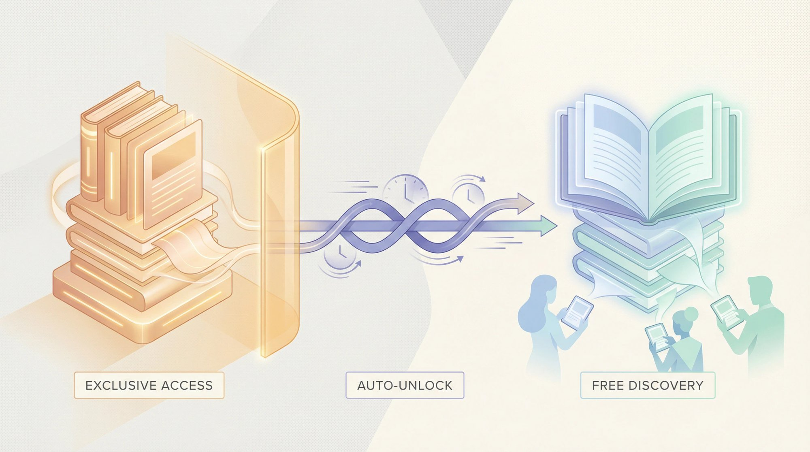

Here's how they work. You release new chapters to paying subscribers first, then those same chapters automatically become free after a set time (usually one to four weeks). Your archive builds up as free content that attracts new readers through search engines and social sharing. Meanwhile, your most engaged fans subscribe to get chapters early.

This creates a conversion funnel that actually works. Readers binge your free archive, hit a cliffhanger or run out of episodes, and subscribe for immediate access to more. They stay subscribed because falling weeks behind feels worse than the monthly cost. Rolling paywalls solve both discovery *and* monetization at the same time.

If you're searching for a **ReamStories alternative**, you're probably already thinking about these problems. Maybe Ream's 10% fee feels steep now that traditional membership platforms charge the same. Maybe the July 2024 leadership upheaval made you nervous about the platform's direction. Or maybe you've realized Ream's reader base skews heavily toward romance and erotica, and your fantasy epic or LitRPG doesn't quite fit.

Whatever your reason, you've got options. Here's what's actually out there for serial fiction creators in 2025.

## What Is ReamStories and Why Are Creators Switching?

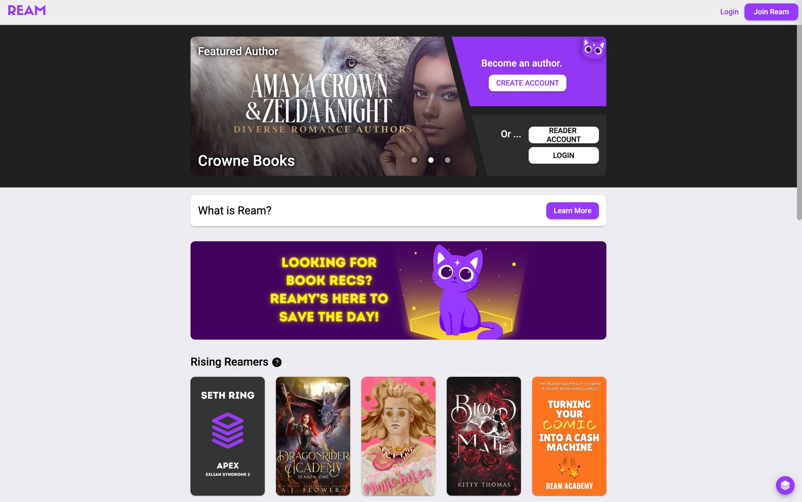

ReamStories (usually just called Ream) launched in 2023 as a membership platform built specifically for fiction authors. Think of it as a hybrid. Part Wattpad for story publishing. Part traditional subscription platform for paid memberships. Part Facebook Group for community features. Readers subscribe to an author for monthly support and gain access to early chapters, exclusive bonus scenes, and a built-in eReader experience.

The platform charges a **10% platform fee** on creator earnings, plus standard Stripe payment processing fees. That puts total fees somewhere around 13-14% of what your subscribers pay.

Ream offers some genuinely useful features for serial writers. Web and mobile eReader designed for consuming chapters in order. Scheduling tools for automated chapter drops. Reader comment threads on each chapter. Email notifications when you publish.

So why are authors exploring alternatives?

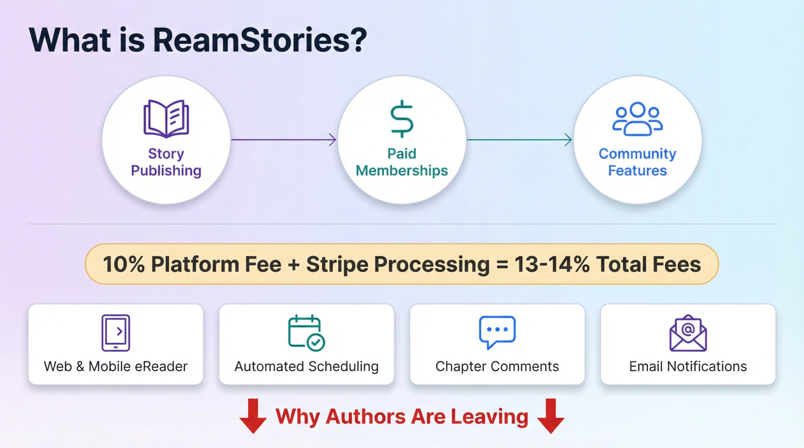

### Why Ream Has Limited Reader Discovery

Ream doesn't drive much reader discovery on its own. As one Royal Road author [pointed out in a forum discussion](https://www.royalroad.com/forums/thread/132003). *"It's not somewhere to post a story hoping people see it... not linked to Royal Road, so it's not going to work as well."* You'll still need platforms like Royal Road, Wattpad, or your own marketing to grow your free readership. Ream is where you *monetize* existing fans, not where you *find* new ones.

### Romance and Erotica Dominate Ream's Audience

Ream's early adopter base skews heavily toward romance and erotica. A Royal Road forum moderator [observed](https://www.royalroad.com/forums/thread/132003). *"It's obvious at a glance they want to appeal to the porn and romance readers."* Based on community observations, romance appears to be one of their top genres, with LitRPG and fantasy gaining some traction. If you write outside these genres, you might find fewer built-in readers compared to broader platforms.

### The July 2024 Leadership Shakeup

In July 2024, Ream reportedly experienced significant internal changes. Co-founder Michael Evans, who had been the public face of the platform, departed from his leadership role under circumstances that generated discussion in the author community. Fantasy author Jez Cajiao, who had moved his subscribers to Ream, reportedly announced his departure from the platform around that time. For authors weighing a long-term home for their reader community, platform leadership stability is worth considering.

### How Ream's Fees Compare to Patreon Now

When Ream launched, traditional membership platforms like Patreon were charging less for many creators. But as of August 2025, [new creators on Patreon now pay a standard 10% fee](https://www.patron.com/blog/post/patreon-fee-changes-2025/). That means Ream's fee advantage has essentially disappeared. If you're paying 10% either way, the calculus shifts toward whichever platform offers better features, larger audiences, or more stability.

## Why Rolling Paywalls Work for Serial Fiction

Before comparing specific platforms, understanding why rolling paywalls work so well for serial content matters. This isn't just a feature preference. It's a business model that fundamentally changes how you can grow and monetize your work.

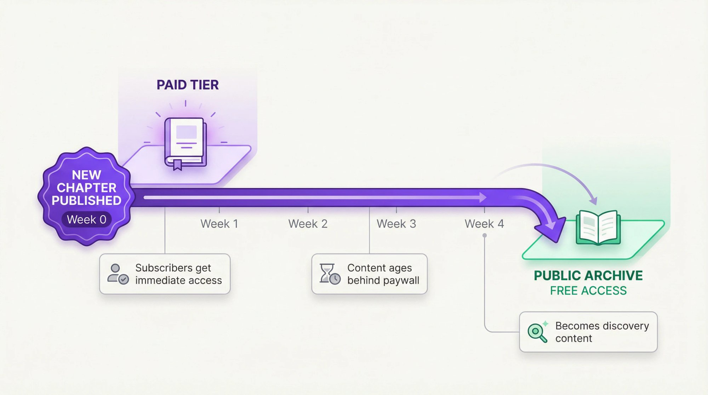

**The discovery problem with traditional paywalls**

If you lock all your content behind a subscription, new readers can't sample your work. They have to pay before they know if they'll like your story. Most won't take that gamble. Your growth stalls because discovery requires freely accessible content, but monetization requires restricting access.

**How rolling paywalls solve this**

With a [rolling paywall](https://www.patron.com/blog/post/what-is-a-rolling-paywall/), your newest content stays exclusive to paying subscribers for a set window (typically one to four weeks). After that window, chapters automatically unlock for free readers.

Your archive becomes a discovery funnel. Free readers can binge dozens of chapters, get hooked on your story, and build real attachment to your characters.

Cliffhangers become conversion points. When a free reader catches up to the publicly available content and hits a cliffhanger, they face a choice. Wait weeks for the next free chapter or subscribe to read ahead immediately. Many choose to pay.

Subscribers stay subscribed. Once someone is caught up on the paid tier, dropping their subscription means falling four or more weeks behind. The switching cost feels significant. Retention improves.

This model is why successful serial fiction creators on Royal Road often maintain membership followings in the thousands. The [Jane Friedman blog notes](https://janefriedman.com/the-serial-first-model-how-royal-road-powers-direct-to-fan-author-careers/) that Royal Road has quietly become a launchpad for authors earning significant income through this exact strategy.

**The problem.** Most membership platforms don't automate rolling paywalls. Authors have to manually cross-post to free platforms on a delay, which creates extra work and room for errors. Platforms built specifically for serial content, like [Patron](https://patron.com), handle this automatically.

## Patron: Open-Source ReamStories Alternative for Creators

We built [Patron](https://patron.com) specifically to solve the problems serial fiction creators face. Traditional platforms treat all content the same. Whether you're posting behind-the-scenes photos or publishing chapter 47 of an ongoing saga. We designed every feature around sequential content.

**Lifetime 1% platform fees for early adopters.**

That's not a typo. While Ream and traditional platforms both charge 10%, [Patron charges just 1%](https://microlaunch.net/p/patron). You'll still pay standard Stripe processing fees (around 2.9% plus $0.30 per transaction), but the platform cut drops from $100 per $1,000 earned to just $10. Learn more about [how to calculate your true take-home pay](https://www.patron.com/blog/post/how-to-calculate-your-true-patreon-take-home-pay-2025/) across different platforms.

### How Much You Save With 1% vs 10% Fees

| Monthly Revenue | Traditional Platform (10%) | Patron (1%) | You Keep Extra |
| --- | --- | --- | --- |
| $500 | $50 to platform | $5 to platform | **$45 more** |
| $1,000 | $100 to platform | $10 to platform | **$90 more** |
| $5,000 | $500 to platform | $50 to platform | **$450 more** |
| $30,000 | $3,000 to platform | $300 to platform | **$2,700 more** |

*Fee comparison excludes Stripe processing costs, which are similar across all platforms.*

At higher earnings levels, those savings become genuinely life-changing. An author earning $30,000 monthly would keep an extra **$2,700 every month**, or **$32,400 per year**, by using Patron instead of a 10% platform.

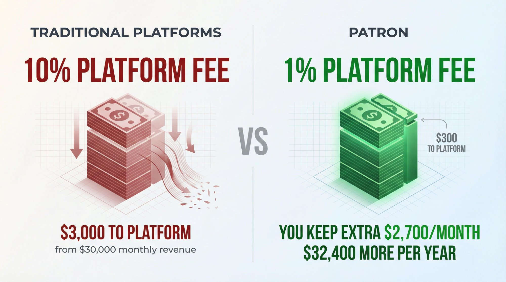

### Automated Rolling Paywalls

[Patron](https://patron.com) automates the [rolling paywall workflow](https://www.patron.com/blog/post/what-is-a-rolling-paywall/) entirely. Set your delay window once, and each chapter you publish to paying subscribers automatically unlocks for free readers on schedule. No manual cross-posting. No spreadsheets tracking what goes live when. The system handles it.

Your free and paid readers can both exist on the same platform, with content dripping from premium to public based on your rules. *This is the core feature that makes Patron different from general-purpose membership tools.*

### Series Tools and Release Scheduling

We've built the content model around how serial fiction actually works. Posts are organized into series. Each series can have its own paywall settings, its own subscriber tiers, and its own release schedule. Readers navigate your work in chapter order, not as a reverse-chronological feed of disconnected posts.

Release scheduling lets you batch-write when inspiration strikes and have chapters go live automatically over time. Set up a queue, and your readers get consistent updates even when life gets complicated. You can also decide between [annual vs monthly membership models](https://www.patron.com/blog/post/annual-vs-monthly-memberships-for-creators/) to find what works best for your audience.

### Why Open Source Matters for Creators

Patron is [open source under the Apache 2.0 license](https://github.com/patroninc/patron). For non-technical creators, this might seem abstract, but it has real implications.

**Transparency.** Anyone can inspect how the platform works. No mystery algorithms or hidden fee structures.

**Community development.** Features and fixes can come from users, not just our team. The roadmap reflects what creators actually need.

**No vendor lock-in.** If Patron ever shut down or you just wanted full control, you could self-host the entire platform. Your community isn't trapped.

**Trust.** Open source projects build credibility because there's nothing to hide.
    

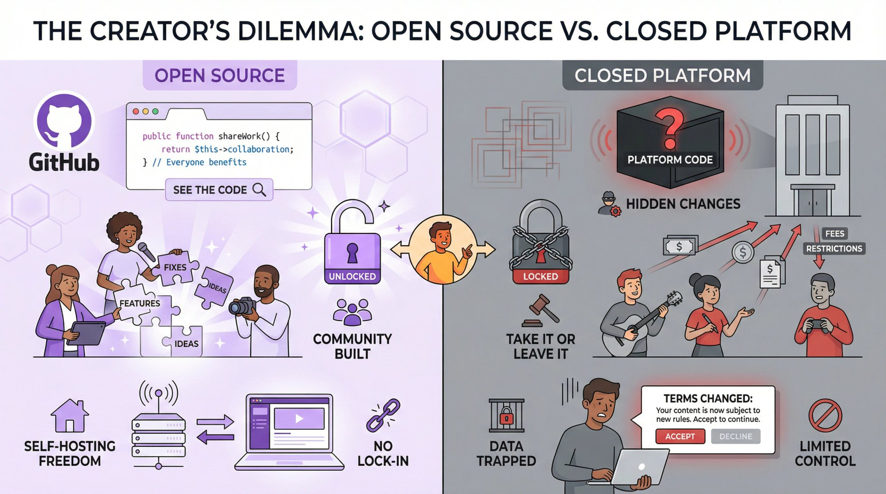

### Alpha Stage and What to Expect

Honest disclosure. [Patron](https://patron.com) is currently in alpha. We launched in late 2025 and are shipping improvements weekly. Check our [changelog](https://www.patron.com/changelog/) to see the rapid development pace. The core platform works, with authentication, content posting, and series management all functional. Payment processing is actively being built out. But some features you'd find on mature platforms (like a native mobile app or extensive integrations) are still in development.

For creators willing to be early adopters, the trade-off is clear. You get dramatically lower fees and purpose-built features for serial content. You accept that some polish is still coming. Many authors have made that trade happily, especially those frustrated with giving up 10% of their earnings to platforms that weren't built for their workflow.

The founder, Nick Khami, previously built Trieve (a YC W24 company [acquired by Mintlify in 2025](https://www.trieve.ai/blog/trieve-is-being-acquired-by-mintlify)), so the team has real execution credibility. Read the full story of [how we acquired the patron.com domain](https://www.patron.com/blog/post/you-can-just-do-things-getting-patron-com/) for insight into our approach. We're not going to disappear.

## Traditional Membership Platforms: Are They Still Worth It?

The biggest name in creator memberships isn't going anywhere. For many authors, especially those who already have established subscriber bases, traditional platforms remain a reasonable choice despite the higher fees.

**The numbers.** These platforms now charge a [10% platform fee for new creators as of August 2025](https://www.patron.com/blog/post/patreon-fee-changes-2025/), plus payment processing fees that bring the total to roughly 12-14% of subscriber payments. On $1,000 of pledges, about $100 goes to the platform and $30-50 to payment processors.

### Why Many Creators Still Choose Traditional Platforms

**Brand recognition matters.** With over 8 million monthly active patrons supporting creators ([Backlinko](https://backlinko.com/patreon-users)), these platforms have massive built-in trust. Readers know how they work. They already have payment methods saved. There's less friction in getting someone to support you when they recognize and trust the platform.

**Features have matured.** Years of development mean robust tiered memberships, Discord integration, analytics, promotional tools, and native mobile apps. While not designed for serialized fiction specifically, many authors have adapted these tools successfully.

**Stability counts.** For all the occasional complaints, major membership platforms have global infrastructure, support teams, and established processes for handling VAT, sales tax, and compliance. They're not going to suddenly disappear or pivot to a different market.

### What 10% Platform Fees Really Cost You

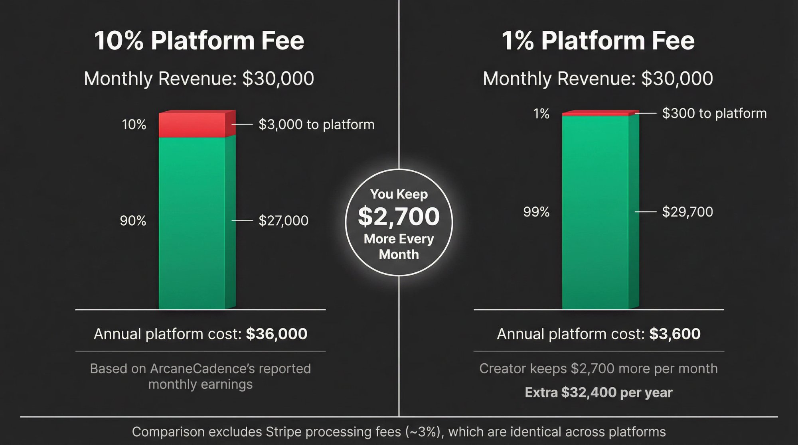

The fee structure hits hardest when you start earning real money. Look at what successful serial fiction authors actually earn:

| Creator | Platform Following | Paying Subscribers | Est. Monthly Income |
| --- | --- | --- | --- |
| Zogarth (The Primal Hunter) | 23,000+ followers | 10,000+ paying | ~$82,000/month |
| ArcaneCadence | [23,600+ Royal Road followers](https://www.royalroad.com/profile/729989) | 3,800+ paying | ~$30,000/month |

*Sources: Industry tracking data, October 2025*

Zogarth's success story is legendary in the web fiction community. Starting on Royal Road with *The Primal Hunter* in 2021, he built a passionate fanbase through consistent quality and frequent updates. His membership page now generates an estimated **$82,000 per month**. At a 10% platform fee, that's roughly $8,200 going to the platform every month, nearly $100,000 per year.

ArcaneCadence's rise was even faster. Launching *"New Life As A Max Level Archmage"* in mid-2025, they built over 23,000 Royal Road followers and converted nearly 4,000 of them into paying subscribers within months. At around $30,000 monthly, they're paying approximately **$3,000 in platform fees every month**.

These authors prove the model works. But they also illustrate why fee sensitivity increases with success. A 1% platform fee would save Zogarth over **$80,000 annually**. For ArcaneCadence, the difference exceeds **$30,000 per year**. The [Patron blog breaks down these calculations](https://www.patron.com/blog/post/how-to-calculate-your-true-patreon-take-home-pay-2025/) with detailed examples.

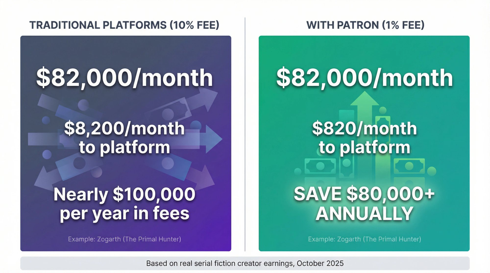

### Payment Problems and Policy Concerns

Traditional platforms haven't been without problems. In mid-2023, a [payment processing change caused credit cards to be flagged as fraudulent](https://www.royalroad.com/forums/thread/132003), auto-canceling pledges for many creators. One author reported. *"Half my patrons disappeared."* The platform's response was slow, essentially telling users to work it out with their banks. The underlying issue got fixed, but it damaged trust for creators who experienced it.

Content policies have also frustrated some authors. Certain adult content, some political speech, and other edge cases have led to account actions over the years. For most serial fiction authors, this won't be an issue. But if your work pushes boundaries, it's worth knowing that platform policies can change. We've written a guide on [what to do if your content gets banned](https://www.patron.com/blog/post/what-to-do-if-patreon-content-got-banned/) to help creators navigate these situations when they arise.

## Ko-fi vs Buy Me a Coffee. Which Has Lower Fees?

For creators who prioritize simplicity and minimal fees over specialized features, **Ko-fi** and **Buy Me a Coffee** offer alternatives. These platforms started as tip jars but have added subscription features that work for some authors. The [Patron blog compares Ko-fi vs traditional membership platforms](https://www.patron.com/blog/post/ko-fi-vs-patreon-which-platform-is-best-for-creators/) to help you understand the key differences.

### Ko-fi and Buy Me a Coffee Fee Breakdown

Ko-fi's free plan charges 5% on subscription payments. Their Gold plan ($12/month for new subscribers) drops that to 0% on all earnings. Buy Me a Coffee charges a flat 5% regardless of plan.

For context, on $500/month in subscriptions, Ko-fi's free plan takes $25. Ko-fi Gold takes $12 (the subscription cost). Traditional platforms take $50.

### Strengths in Speed, Flexibility, and Payouts

**Speed.** You can create a page and start accepting money in minutes. No approval process, no complex setup.

**Flexibility.** Accept one-time tips, recurring subscriptions, and sell digital products all from one profile. Some authors maintain a membership platform for chapter subscriptions and a separate tip jar for casual tips or one-off ebook purchases.

**Instant payouts.** Money goes directly to your PayPal or Stripe as it comes in, rather than waiting for monthly payouts.

### Limitations and No Serial Fiction Tools

Neither platform was built for serialized content. There's no chapter organization, no series structure, no [rolling paywall automation](https://www.patron.com/blog/post/what-is-a-rolling-paywall/). You'd post chapters as blog posts or attachments, and readers would scroll through a reverse-chronological feed. As your archive grows, this gets messy.

Discovery and community features are minimal. There's no native forum, limited commenting, and virtually no built-in audience. These are tools for monetizing existing fans, not finding new ones.

### Best for Supplemental Income Streams

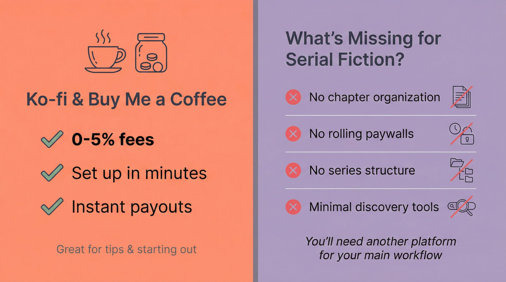

Ko-fi works well as a *supplemental* income stream. Some authors maintain it alongside a primary membership platform, using it for readers who prefer one-time tips or want to purchase completed volumes as ebooks. It's also a solid starting point for authors just beginning to monetize, since the low friction lets you test whether your audience will pay before committing to a more complex platform.

## Can Substack Work for Serial Fiction Writers?

**Substack** has become a major player in the newsletter space, and some fiction authors have adapted it for serialized storytelling. The model is different. Instead of readers visiting a website to access content, chapters arrive directly in their inboxes.

### How Substack Works for Fiction

Substack charges a [10% platform fee on paid subscriptions](https://www.forbes.com/sites/entertainment/article/what-is-substack/), plus Stripe's processing fees. That's the same cut as traditional membership platforms and Ream. The value proposition isn't about saving money. It's about the email-first format and network effects.

### When Substack Works Well

**You own the subscriber list.** Email addresses belong to you. If you ever leave Substack, you take that list with you. On most membership platforms, you can export a list, but email isn't the primary communication channel.

**High engagement.** Email open rates often beat "check a website" engagement. When a chapter lands in someone's inbox, they're more likely to read it than if they have to remember to visit a platform.

**Network discovery.** Substack has built recommendation features where writers can cross-promote each other. If you can tap into existing Substack communities (say, a network of fantasy writers with newsletters), there's potential for organic growth.

### Why Substack Struggles With Long Chapters

The email format doesn't suit all story types. A 5,000-word chapter as an email can feel overwhelming. Some authors adapt by sending shorter chapters or splitting longer ones across multiple emails. Others send summaries with links to read the full chapter on the Substack website.

Substack's culture accommodates various content lengths, though many successful newsletters feature weekly essays of 1,000-2,000 words. Serial fiction authors pushing frequent long chapters may need to adjust expectations around what readers want in their inbox versus what they'll click through to read.

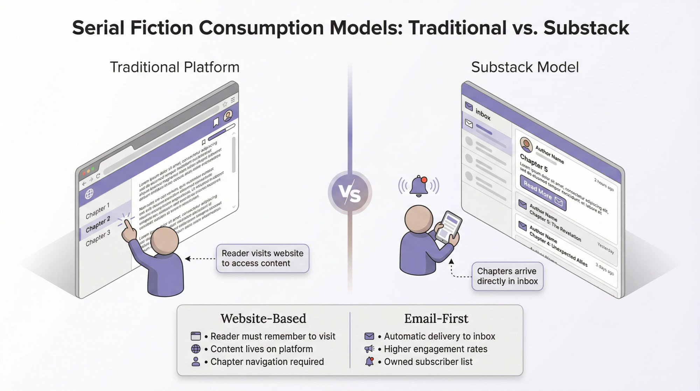

Pricing norms also differ. Substack readers typically pay $5-10 monthly or $30-50 annually for newsletters. That's somewhat lower than what avid fiction fans often pay for early chapter access on traditional membership platforms. Your mileage may vary. For guidance on structuring your pricing, see our article on [annual vs monthly memberships for creators](https://www.patron.com/blog/post/annual-vs-monthly-memberships-for-creators/).

### Best for Email-First Authors

Substack works for authors who can write compelling, self-contained episodes that read well as emails. It's also interesting for authors who want to build an email list they fully control, even if they use other platforms for primary monetization. Some creators maintain both. A Substack for weekly recaps or bonus content. A separate membership platform for the main chapter subscription.

## Self-Hosting Options. Ghost, Discord, and DIY Platforms

For technically inclined creators or those with very specific needs, self-hosting and niche platforms offer maximum control with minimal (or zero) platform fees.

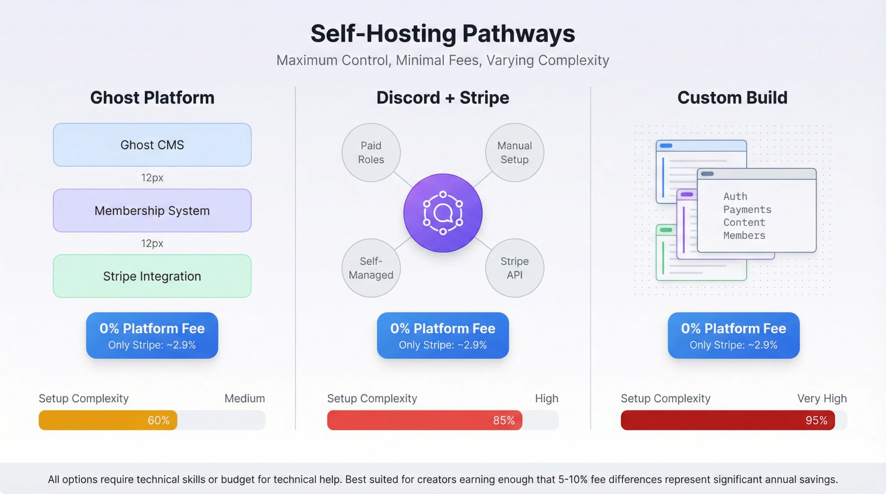

### Ghost as Self-Hosted Membership Platform

Ghost is an open-source publishing platform with built-in membership and paywall features. You can use **Ghost(Pro)** (their hosted service, starting around $15-18/month for up to 1,000 members) or self-host the software on your own server.

Self-hosted Ghost means you pay only Stripe's processing fees. No platform cut at all. You get full control over branding, design, and features. The trade-off is setup complexity and ongoing maintenance responsibility.

Ghost is a solid choice for authors who want to run their own subscription website without building everything from scratch. It handles payments, member management, and email delivery. You'd need to customize the theme and navigation for chapter-based fiction consumption, but it's doable.

### Discord and Guilded for Paid Communities

Some creators bypass traditional platforms entirely by running their own Discord server with paid roles managed through Stripe. Guilded (a Discord alternative) [supports monetization features for creators](https://www.royalroad.com/forums/thread/132003).

This is the most DIY approach. You save maximum money with just Stripe's fees but handle everything yourself. Role management, content delivery, support. It works best for authors with strong technical skills or a community that's already Discord-native.

### Is Self-Hosting Right for You?

Consider self-hosting or niche platforms if you're earning enough that even a 5-10% fee difference represents thousands annually. You need technical skills or budget for help to manage your own infrastructure. Your content faces policy restrictions on mainstream platforms. You value full ownership and control over community features.

For most authors, the time investment isn't worth it until you're earning substantial income. But it's good to know the option exists. Alternatively, [Patron's open-source model](https://github.com/patroninc/patron) gives you the self-hosting option with a platform that's already built for serial content.

## How to Pick the Best Platform for Your Serial Fiction

With so many options, the decision can feel overwhelming. Here's a framework based on what matters for serial fiction creators.

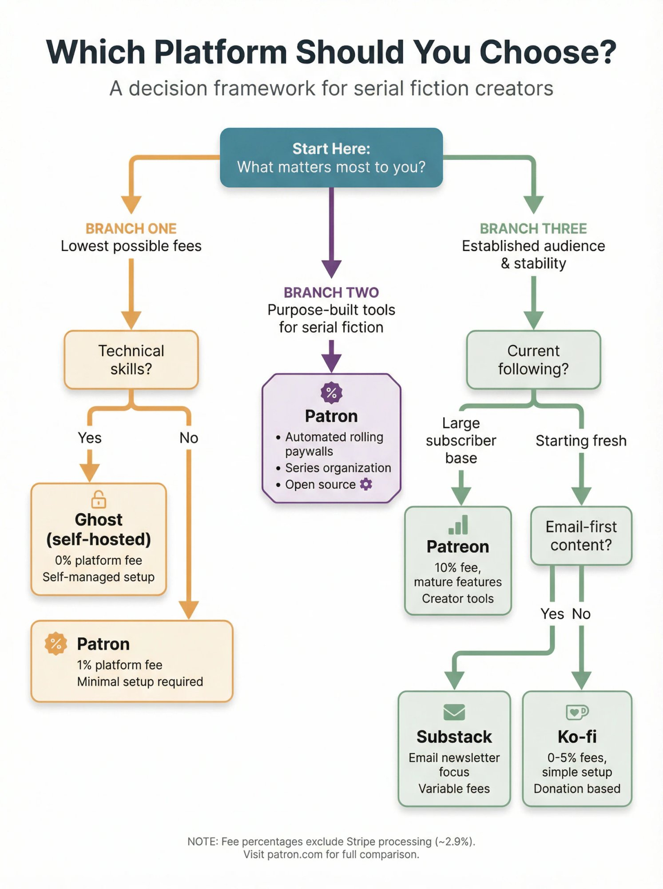

### Platform Comparison Table

| Platform | Platform Fee | Rolling Paywalls | Open Source | Best For |
| --- | --- | --- | --- | --- |
| [Patron](https://patron.com) | 1% | Yes, built-in | Yes | Serial fiction creators who want low fees and purpose-built features |
| Traditional platforms | 10% | No (manual only) | No | Creators with established audiences who value brand recognition |
| ReamStories | 10% | Partial | No | Romance/erotica authors who want fiction-specific features |
| Ko-fi | 0-5% | No | No | Authors wanting simplicity or supplemental income |
| Substack | 10% | No | No | Authors who want email-first distribution |
| Ghost (self-hosted) | 0% | No | Yes | Technical creators wanting full control |

### Which Platform Fits Your Needs?

[**Patron**](https://patron.com) **works best for** authors who write serial fiction and want [rolling paywalls automated](https://www.patron.com/blog/post/what-is-a-rolling-paywall/). Low fees matter to you, especially as you scale. You're comfortable with an early-stage platform that's [actively improving](https://www.patron.com/changelog/). You value [open source transparency](https://github.com/patroninc/patron) and the option to self-host.

**Traditional membership platforms work best for** authors who already have a large subscriber base there. Brand recognition and reader trust are paramount. You need mature features like merch integration or advanced analytics. Stability and global infrastructure outweigh fee concerns.
    

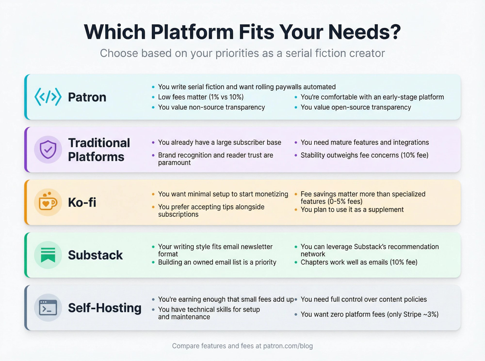

**Ko-fi works best for** authors who want to start monetizing with minimal setup. You prefer accepting tips alongside subscriptions. Fee savings matter more than specialized features. You plan to use it as a supplement to another platform.

**Substack works best for** authors whose writing style fits the email newsletter format. Building an owned email list is a priority. You can leverage Substack's recommendation network.

**Self-hosting works best for** authors earning enough that even small percentage fees add up significantly. You have technical skills for setup and maintenance. You need full control over content policies and platform decisions.
    

## ReamStories Alternative FAQ. Common Questions Answered

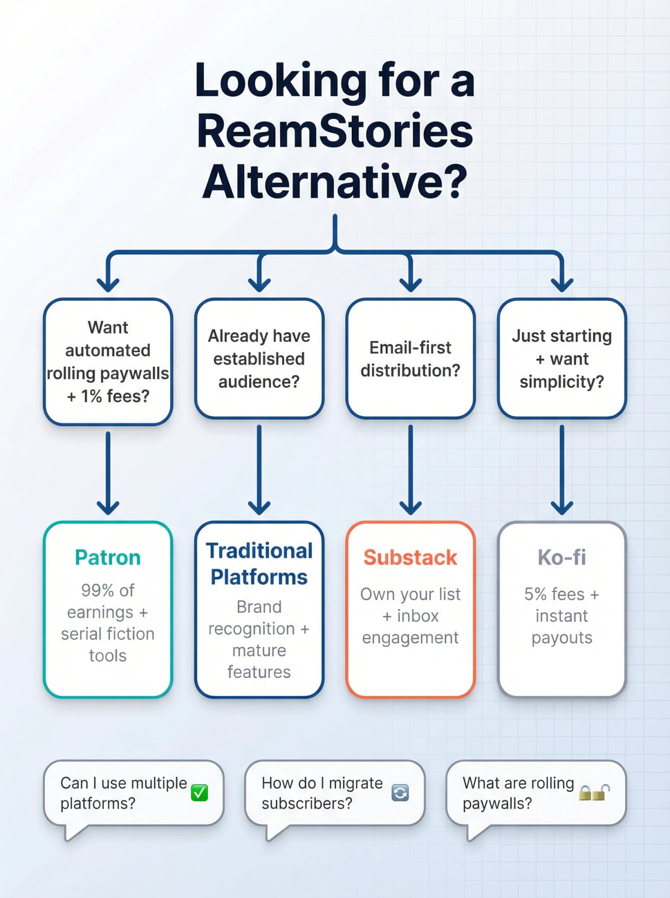

**What's the biggest difference between ReamStories and Patron?**

Fees and automation. Both platforms target fiction creators, but Ream charges 10% while [Patron](https://patron.com) charges 1%. Patron also automates [rolling paywalls](https://www.patron.com/blog/post/what-is-a-rolling-paywall/) entirely, where your content automatically becomes free after a set window, without you having to manually cross-post.

**Can I use multiple platforms at once?**

Absolutely. Many authors maintain a presence on several platforms to serve different audience segments. You might have a primary membership platform for your most dedicated fans and a supplemental tip jar for casual supporters who prefer one-time tips. Avoid burnout from managing too many channels.

**How do I migrate subscribers from one platform to another?**

Most platforms let you export subscriber email lists. The transition usually involves announcing the move to your community, explaining why it benefits them, and offering incentives to switch. Lower fees might mean lower subscription costs or more content. Expect some drop-off during migration, but loyal fans typically follow. Our guide on [switching from traditional platforms to Patron](https://www.patron.com/blog/post/switch-from-patreon-to-patron/) walks through the process step by step.

**What exactly are rolling paywalls?**

[Rolling paywalls](https://www.patron.com/blog/post/what-is-a-rolling-paywall/) are a time-based access system. New chapters are exclusive to paying subscribers for a set period (one to four weeks typically), then automatically become free. This lets you build a free archive for discovery while maintaining value for subscribers who want immediate access.

**Does open source matter for creators?**

For non-technical creators, open source provides peace of mind. You can verify there are no hidden fees or algorithm changes, and the community can contribute improvements. For technical creators, it means the option to self-host and customize. Open source platforms also can't "rug pull" you because the [code remains available](https://github.com/patroninc/patron) even if the company changes direction.

**Is Patron ready for serious use?**

[Patron](https://patron.com) is in alpha, meaning the core features work but the platform is still adding polish and capabilities. Check our [weekly changelog](https://www.patron.com/changelog/) to see what's shipping. Authors willing to be early adopters can lock in 1% fees for life while helping shape the product's development. If you need every possible feature today, a mature platform might serve you better. If you're willing to grow with a platform in exchange for dramatically lower fees, Patron is worth joining now.

## Which ReamStories Alternative Is Best for You?

Serial fiction creators in 2025 have more options than ever for monetizing their work. The "best" platform depends on your specific situation. Where you are in your author journey. How much you're earning. What features you actually need. How much you value community trust versus cost savings.

For most serial fiction authors just starting to monetize, or those frustrated with giving 10% of their hard-earned income to platforms that weren't built for their workflow, [**Patron**](https://patron.com) **offers the most compelling value proposition**.

[Rolling paywalls](https://www.patron.com/blog/post/what-is-a-rolling-paywall/) that actually automate your free-to-paid content strategy. Series organization designed for how serialized stories work. [Open source transparency](https://github.com/patroninc/patron) so you know exactly what you're getting. And fees that let you keep **99% of what your readers pay you** instead of 90%.

The creators earning $82,000 per month on traditional platforms are proof that the serial fiction model works. *Imagine what they could do (what you could do) keeping an extra 9% of every dollar.* The math on [fee savings alone](https://www.patron.com/blog/post/how-to-calculate-your-true-patreon-take-home-pay-2025/) is compelling.

We're building [Patron](https://patron.com) because we believe serial fiction creators deserve better tools and fairer economics. If that resonates, we'd love to have you join us.