**Yes, you can make money from a podcast** (but probably not in the way you think). The [creator economy is now worth over $250 billion](https://www.patron.com/blog/category/monetization/) and projected to double by 2027, with more than **200 million people worldwide** identifying as content creators. Podcasters are carving out their share of this massive opportunity, but the path to profitability looks different than traditional media.

Platform ads alone won't pay your bills unless you're pulling massive numbers. Most successful podcasters use a mix of revenue streams, with [direct fan support](https://www.patron.com/blog/post/annual-vs-monthly-memberships-for-creators/) often outpacing advertising income. If you're starting a podcast (or already running one) and wondering whether it can become a real income source, this guide breaks down exactly how [podcasters make money in 2026](https://www.patron.com/blog/category/podcast/) and what it actually takes to turn your show into a sustainable business.

## What You Need to Know About Podcast Monetization in 2026

Most people get this wrong about podcast income.

**Platform discovery is hard.** Unlike YouTube or TikTok, where algorithms can surface your content to strangers, podcasts typically grow slower because audio isn't as easily discoverable. As of 2025, [Spotify introduced podcast recommendations](https://techcrunch.com/2025/05/28/spotify-amps-up-podcast-discovery-with-new-features/) on its Home page, though the scale and impact are significantly less than YouTube/TikTok. [Apple Podcasts relies primarily on editorial curation](https://www.socialwick.com/top-podcast-platforms-in-2025-and-how-to-get-featured), and Google Podcasts was discontinued. Growth usually happens through word-of-mouth, cross-promotion on other platforms, or appearing as a guest on established shows.

You need to be strategic about monetization from day one. You can't just publish episodes and wait for the money to roll in.

**The creator economy is real.** Despite the discovery challenges, podcasting is absolutely viable as an income source. [Major membership platforms have paid out over $10 billion to creators](https://www.axios.com/2025/08/05/patreon-10-billion-creator-economy-ai) since 2013, with [more than 25 million paid memberships](https://www.axios.com/2025/08/05/patreon-10-billion-creator-economy-ai) as of August 2025. What separates podcasters who monetize successfully from those who don't? They treat their show like a business, not just a hobby.

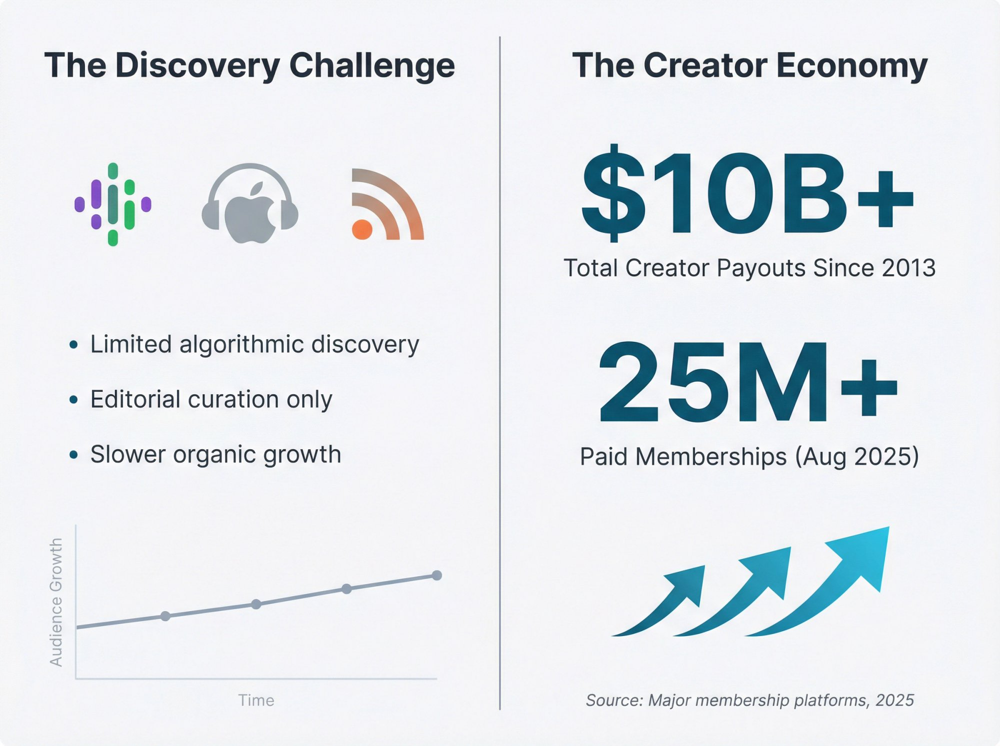

## How to Make Money from Podcasts with Direct Fan Support

Most podcasters discover this eventually: **your most engaged listeners will pay to support you** if you give them a reason and an easy way to do it.

### Best Membership Platforms for Podcasters

[Platforms designed for creators](https://www.patron.com/) let your audience pay a monthly subscription to support your show. In return, they get perks like [early access to episodes](https://www.patron.com/blog/post/how-to-monetize-a-podcast-with-early-access-not-ads/) (released to paying members first, then to the public a week later), bonus episodes or extended cuts, behind-the-scenes content, ad-free versions of your show, access to a private Discord or community space, and exclusive Q&A sessions or AMAs.

> **Why this works psychologically:** When listeners binge your back catalog and hit a cliffhanger or run out of episodes, they're primed to subscribe to get more immediately. They also want to avoid falling weeks behind on new episodes. This creates natural conversion moments throughout the listener journey.

### The Rolling Paywall Strategy

If you produce episodic or serialized content, [rolling paywalls](https://www.patron.com/blog/post/what-is-a-rolling-paywall/) are particularly effective. You release new episodes to paying subscribers first, then those same episodes automatically become free after a set time (usually **1-4 weeks**).

Your archive builds up as free content that attracts new listeners through search and social sharing, while your most engaged fans subscribe to get episodes early.

> **The key insight:** It's the difference between locking content behind a permanent paywall and creating a time-release system that serves both discovery and revenue.

This model is baked into [Patron's platform](https://www.patron.com/) specifically for sequential content creators, with release scheduling and automated unlocking built right in.

### Platform Fees Matter More Than You Think

If you have **100 supporters** paying **$10 per month**, that's **$1,000** in gross revenue. But platform fees eat into that significantly.

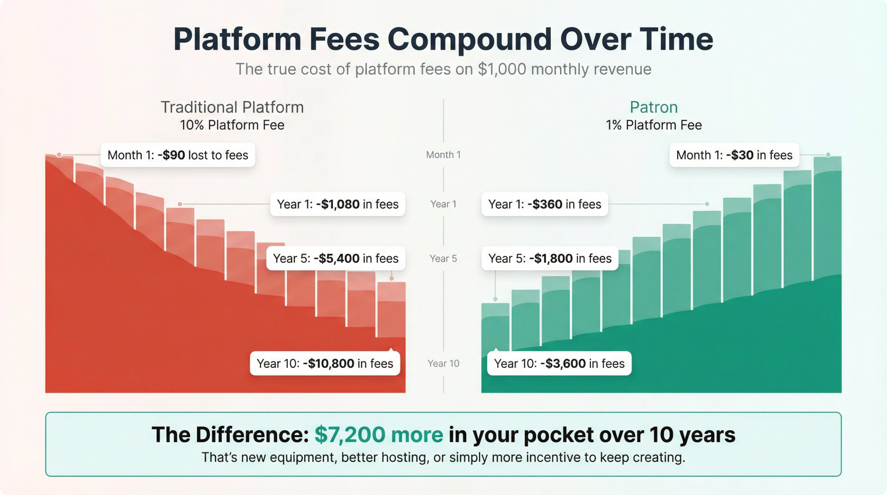

But platform fees eat into that significantly.

[Traditional platforms changed their fee structures in 2025](https://www.patron.com/blog/post/patreon-fee-changes-2025/), with new creators on major platforms facing **10% platform fees**, plus payment processing fees of around **2.9% + $0.30** per transaction. That's roughly **13-15%** in total platform and payment fees you need to budget for.

[Patron](https://www.patron.com/) offers **1% fees for early adopters**. That's a massive difference that compounds over time. On **$1,000** of monthly support:

| **Platform**         | **Fee Structure**                | **Your Net Income** |
| -------------------- | -------------------------------- | ------------------- |
| Traditional Platform | 10% + processing (~13-15% total) | ~$870               |
| Patron               | 1% + processing (~4% total)      | ~$931               |
| **Difference**       | **9% more**                      | **+$61/month**      |

That's **$61 more per month**, or over **$730 extra per year** in your pocket instead of platform fees. Over a career, [the math is compelling](https://www.patron.com/blog/post/how-to-calculate-your-true-patreon-take-home-pay-2025/).

### When to Launch Fan Support

Don't launch too early. If you have **50 listeners**, opening a membership page may not yield much and could distract you from growing your show. Usually, podcasters open these up once they have at least _a few hundred dedicated listeners_, or they're getting comments like "How can I support you?"

One good strategy: announce a membership when you have something special planned (a new season, a special project) which motivates people to chip in. Be transparent about why you're asking for support. Your audience likes knowing what their money enables, whether that's better equipment, more frequent episodes, or simply freeing up your time to create.

Also, engage your paying members closely. They're your superfans. Respond to their messages, involve them in content decisions, maybe let them vote on upcoming episode topics. That personal connection justifies their monthly support and turns casual supporters into long-term patrons.

## How to Get Podcast Sponsorships and Brand Deals

Once you've built an audience, companies will pay you to promote their products or services during your episodes.

### How Podcast Sponsorships Work

Sponsors typically pay based on **CPM** (cost per mille, or per 1,000 downloads). Rates vary wildly by niche. Generic audience shows typically command **$15-25 CPM**, while niche professional or business audiences can reach **$30-50 CPM**. _Highly targeted technical audiences_ sometimes hit **$50-100+ CPM**, though rates at the upper end require very specialized listener demographics.

If your show averages **5,000 downloads** per episode and you charge **$25 CPM**, that's **$125 per sponsored episode**. Do that weekly and you're looking at **$500/month** from one sponsor.

**You have three ad placement options.** Pre-roll ads run before the episode starts and tend to be shortest with lowest engagement and rates. Mid-roll ads placed in the middle of your episode get _the highest engagement_ because listeners are already invested, which means they command the highest rates. Post-roll ads at the end see lower completion rates and moderate pricing.

Most podcasters find mid-roll ads convert best because the audience is already engaged. Just don't interrupt during a critical story beat. Place it at a natural transition point.

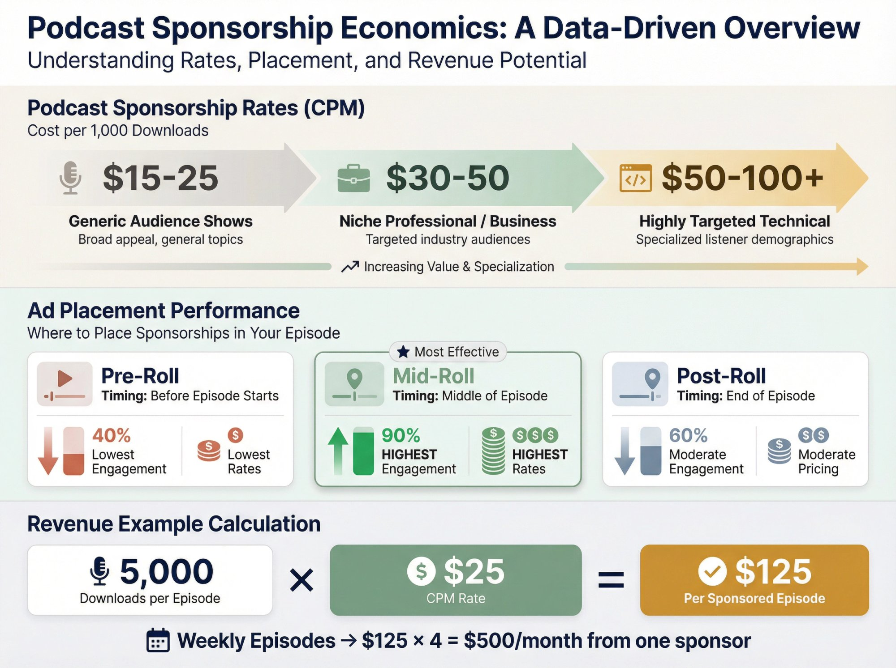

### Finding Sponsors

Early on, you may need to pitch yourself. Identify brands that align with your show's topic and audience. Run a true crime podcast? Reach out to audiobook services, VPN companies, or mystery box subscriptions. Business show? Try productivity tools, web hosting, or online course platforms.

Create a simple **media kit** (one-page PDF) with your stats. Include your average downloads per episode, audience demographics (age, location, interests), engagement metrics like completion rate if you track it, and past sponsor testimonials once you have them.

As you grow larger (typically **10,000+ downloads** per episode), sponsors will start approaching you. Make it easy by listing a business email in your show notes.

### Be Selective (Your Credibility is on the Line)

Only accept sponsorships from products you genuinely believe in or have tested. A VPN sponsorship might pay well, but if you promote a shady service, you'll lose listener trust _fast_. Your audience can tell when you're reading a script versus actually recommending something.

Also, **always disclose sponsorships clearly**. It's legally required in most places and just ethical practice. A simple "This episode is sponsored by X" at the start works fine.

## Making Money with Platform Podcast Ads

Some podcast hosting platforms offer automated advertising programs, though these typically require significant listenership before they're worth it.

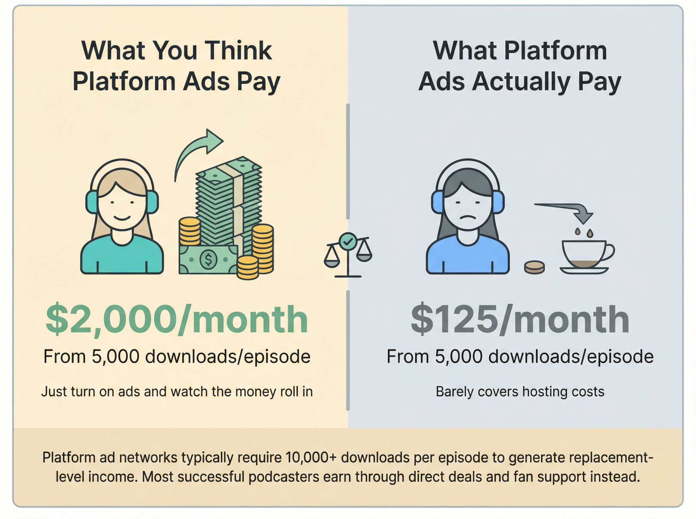

### Spotify Podcast Ads

Spotify has been building out its podcast monetization tools, including automated ad insertion for creators who meet certain criteria. The exact thresholds and rates vary, but you generally need _thousands of streams_ per episode to qualify for meaningful revenue.

### Spotify for Creators

[Spotify for Creators](https://techcrunch.com/2023/03/08/spotify-is-revamping-its-podcaster-tools-including-anchor-and-is-partnering-with-patreon/) (formerly Anchor, rebranded from "Spotify for Podcasters" in 2024-2025) offers [Premium Sponsorships](https://podnews.net/update/spotify-anchor-podcast-monetisation) where they sell host-read sponsor credits on select podcasters' behalf, rather than traditional "sponsorship matching." While this can provide some passive income once set up, the CPMs are often lower than direct deals, and you need substantial download numbers to see real money. Selection for Premium Sponsorships is limited to certain creators.

### The Reality Check on Ad Revenue

Platform ads won't replace a day job unless you're getting _substantial_ download numbers consistently. While high-income podcasters ([averaging 250-500 downloads per episode](https://adopter.media/podcast-advertising-guide/)) can earn $50,000+/year through premium niches and direct deals, platform ad networks typically require **10,000+** downloads per episode to generate replacement-level income. Most podcasters who make meaningful income do so through **direct deals and fan support**, not platform ad networks.

Think of platform ads as coffee money that covers hosting costs, not your main [monetization strategy](https://www.patron.com/blog/category/monetization/).

## How to Use Affiliate Marketing for Podcast Income

This is where you recommend products or services and earn a commission when listeners purchase through your unique link.

### How Podcasters Use Affiliate Links

Since you can't click a link in audio, podcasters work around this by mentioning a custom URL or promo code during the episode (like "Visit example.com/yourshow" or "Use code YOURSHOW for 20% off"), putting affiliate links in show notes and episode descriptions, creating a resources page on their website with all recommended tools and products, and sharing links on social media when promoting new episodes.

### What to Promote

Choose affiliate products relevant to your content and genuinely useful to your audience. A tech podcast might affiliate with hosting services, software tools, or online courses. A fitness show could promote workout equipment, supplement companies, or meal planning services. A business podcast might partner with productivity tools, books, or business software.

**Always disclose affiliate relationships.** A simple note like "Some links are affiliate links which help support the show at no extra cost to you" maintains trust while being legally compliant.

### Commission Potential

Affiliate rates vary wildly:

| **Product Type**                         | **Commission Rate**                   |
| ---------------------------------------- | ------------------------------------- |
| Physical products (Amazon Associates)    | 1-10% (most common categories 1-4.5%) |
| Software/SaaS tools                      | 20-50% recurring                      |
| Online courses/digital products          | 30-50%                                |
| High-ticket items (coaching, consulting) | $100-1,000+ per sale                  |

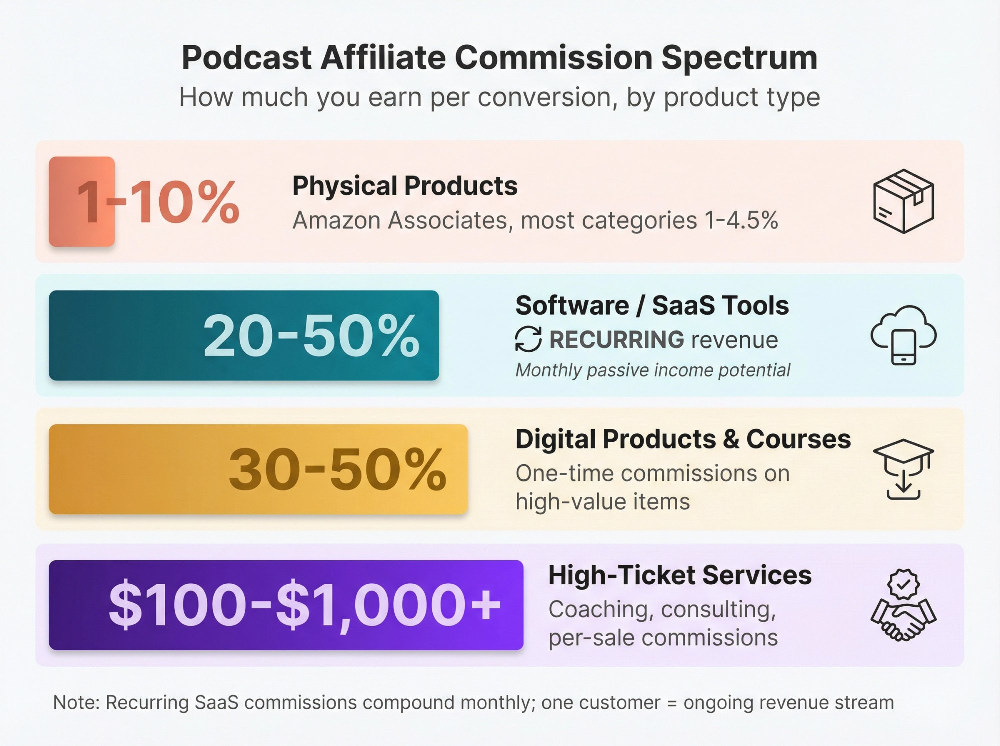

A niche podcast with **1,000 engaged listeners** can still earn affiliate commissions if those listeners are highly targeted and your content drives purchase decisions.

## How to Sell Your Own Products and Services Through Your Podcast

As your show grows and you establish expertise, creating your own offerings becomes viable.

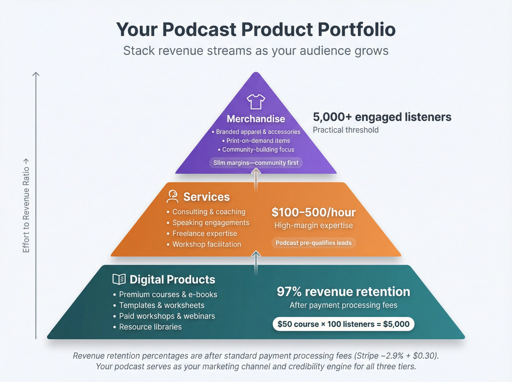

### Digital Products for Podcasters

If your podcast teaches something, **premium courses** are a natural extension. You can also create **e-books or guides** that dive deeper into topics you cover on the show, develop **templates or tools** like worksheets, checklists, or resource lists your audience finds valuable, or run **paid workshops and webinars** where you teach or consult in real-time.

You keep approximately **97%** of the revenue after standard payment processing fees ([Stripe charges 2.9% + $0.30](https://stripe.com/pricing), PayPal charges 2.99-3.49% + $0.30). A **$50 course** sold to just **100 listeners** is **$5,000** in revenue.

### Services Leveraging Your Platform

Your podcast serves as an extended audition for your expertise. Consultants, coaches, and freelancers use their show to demonstrate knowledge and attract clients. A marketing podcast host might offer consulting services, a language learning show could provide tutoring or coaching, and an interview show with industry leaders could lead to speaking gigs or workshop opportunities.

This isn't passive income, but it can be high-margin (**$100-500/hour** for consulting or coaching) and your podcast pre-qualifies leads who already know, like, and trust you.

### Merchandise (For the Right Shows)

Branded T-shirts, mugs, stickers, and other merch work well if you have:

- A strong brand or memorable catchphrases
- A community that identifies with your show
- Strong audience engagement (success depends more on engagement than absolute numbers, though **5,000+ engaged listeners** is often mentioned as a practical benchmark)

Print-on-demand services like Teespring or Printful handle production and shipping with no upfront inventory, though margins are slim. Think of merch more as community-building than a primary revenue stream unless you hit significant scale.

## Why Most Successful Podcasters Use Multiple Revenue Streams

Most successful podcasters won't tell you this upfront:

> **You need multiple income streams.**

Relying solely on platform ads means you're at the mercy of algorithms and download numbers. A [diversified monetization strategy](https://www.patron.com/blog/category/guides/) might look like:

- **40% from fan support** ([Patron](https://www.patron.com/)/membership platform)
- **30% from direct sponsorships** (negotiated brand deals)
- **15% from affiliate commissions** (products you recommend)
- **10% from platform ads** (Spotify automated ads)
- **5% from your own products** (occasional course or e-book sales)

This diversity insulates you from changes in any single revenue source. If ad rates drop or a sponsor cancels, you're not scrambling to cover your bills.

**Think of it as financial resilience, not just revenue optimization.**

## How Much Money Can You Really Make from a Podcast?

Building podcast income looks like this in practice.

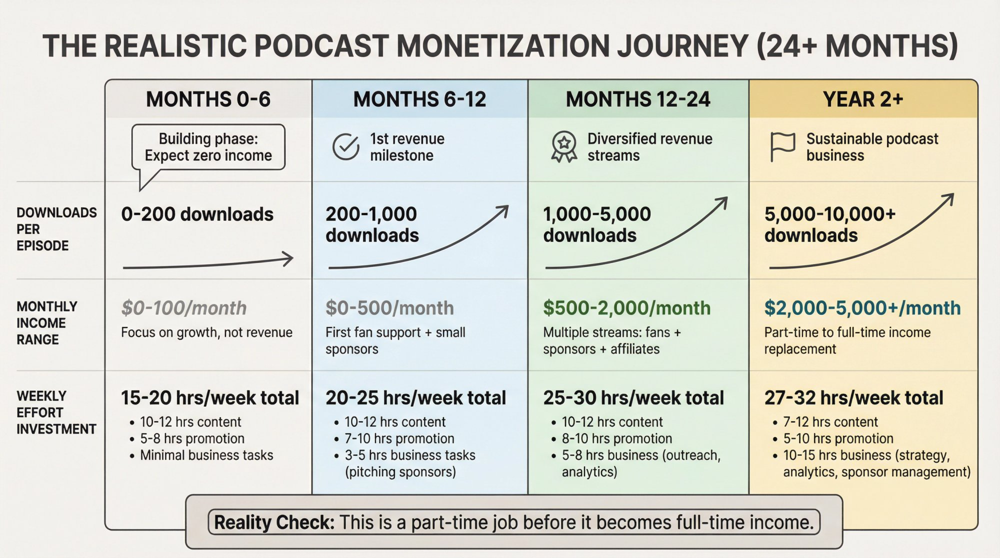

**Timeline expectations:**

**Months 0-6**: Focus entirely on creating great content and building an audience. Monetization is premature. You might experiment with affiliate links in show notes, but don't expect meaningful revenue.

**Months 6-12**: If you've been consistent, you might have a few hundred regular listeners (which would be above the [median of 127 monthly downloads](https://prioridata.com/data/podcast-statistics/)). Consider [opening a fan support option](https://www.patron.com/blog/post/how-to-monetize-a-podcast-with-early-access-not-ads/). Maybe land your first small sponsorship deal. _Monthly income: $0-500._

**Months 12-24**: With steady growth, you could have **1,000-5,000 downloads** per episode. Now you're combining fan support, affiliate income, and perhaps regular sponsors. _Monthly income: $500-2,000._

**Year 2+**: At **5,000-10,000+ downloads** per episode with a diversified strategy, you might replace a part-time income. _Monthly income: $2,000-5,000+._

These are rough benchmarks. Niche shows with highly engaged audiences can monetize faster at lower numbers. Broad entertainment shows might need bigger audiences to see similar revenue.

**The effort investment** is also real. Successful podcast businesses typically require:

- **7-12 hours per week** on content creation (recording, editing, show notes) for weekly shows
- **5-10 hours per week** on promotion and audience engagement
- **5 hours per week** on business tasks (sponsorship outreach, analytics, admin)

It's not passive. It's a part-time job before it becomes a full-time income.

## What It Really Takes to Make Money Podcasting

Making money from podcasting requires more than just hitting record and publish.

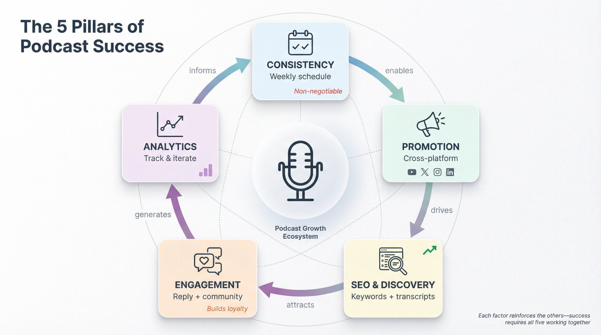

### 1. Consistency is Non-Negotiable

Your audience needs to know when to expect new episodes. Whether that's weekly, biweekly, or even monthly, stick to it. Inconsistent publishing kills momentum and makes sponsors nervous.

If weekly is too aggressive, do biweekly and commit to it. Better to underpromise and overdeliver than burn out after three months of daily episodes.

### 2. Promotion Outside the Podcast App

Since podcast discovery is limited, successful shows promote heavily on other platforms. **YouTube** lets you repurpose episodes as video (even with just a static image) or create clips from highlights. **Social media** is essential for sharing quotes, audiograms, or short clips on Twitter, Instagram, TikTok, and LinkedIn. An **email newsletter** can send weekly updates with your latest episode and why listeners should care. **Guest appearances** on other podcasts in your niche drive cross-promotion that actually works.

Think of your podcast as the hub, but social media and other platforms as the spokes bringing new listeners to your show.

### 3. SEO and Discoverability

While podcast apps don't have traditional SEO, you can still optimize for discovery. Make **episode titles** clear and searchable by including keywords people might use. Write detailed **show notes** with relevant keywords and links. Create a **website or blog** for your podcast with transcripts or written summaries of episodes that rank in Google and drive traffic. Upload full episodes or clips to **YouTube** with keyword-optimized titles and descriptions.

Many podcasters discover their biggest growth comes from YouTube or Google search, not from podcast apps.

### 4. Audience Engagement Builds Loyalty

Reply to emails and social media comments. Ask questions at the end of episodes to encourage listener interaction. Create a community space (Discord, Facebook Group) where listeners can discuss episodes.

Engaged listeners become paying supporters, share your show, and stick around for years. They're infinitely more valuable than passive drive-by listeners.

### 5. Analytics and Iteration

Track which episodes perform best (downloads, completion rates if available, engagement). Look for patterns:

- Do interview episodes get more downloads than solo episodes?
- Do certain topics consistently outperform?
- What time of week or month sees the best release performance?

Use data to refine your content strategy. Creating more of what your audience loves is the fastest path to growth.

## Podcast Monetization Strategies by Format Type

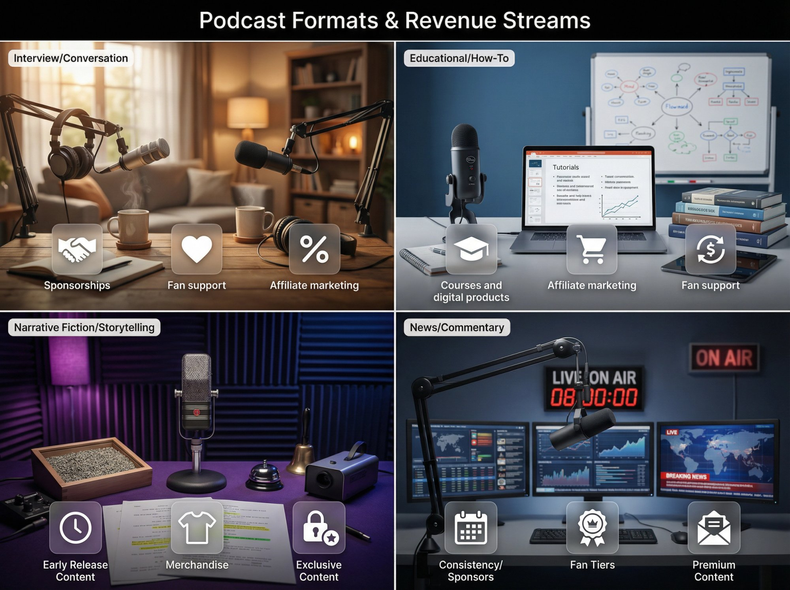

Monetization tactics that work for an interview show might not work for a narrative fiction podcast. Here's how different formats typically monetize:

### Interview/Conversation Shows

**Best revenue streams**: Sponsorships (easy to integrate host-read ads), fan support (loyal following develops), affiliate marketing (guests' products/services)

**Approach**: Build a library of episodes that showcase different aspects of your niche. Each guest brings their network, expanding your reach. Monetize through embedded sponsorships and a membership tier for bonus episodes or early access.

### Educational/How-To Podcasts

**Best revenue streams**: Your own courses/products (natural upsell from free content), affiliate marketing (tools you teach), fan support

**Approach**: Your podcast is top-of-funnel marketing for deeper paid resources. Create a course, coaching program, or comprehensive guide that goes beyond what you cover in episodes. Use affiliate links for tools you demonstrate.

### Narrative Fiction/Storytelling

**Best revenue streams**: Fan support (dedicated fanbases), merchandise (if branded well), membership-style exclusive content

**Approach**: Serialized stories create natural cliffhangers and binge behavior. Offer [early access to new episodes](https://www.patron.com/blog/post/what-is-a-rolling-paywall/), bonus chapters, or behind-the-scenes content to paying supporters. This format particularly benefits from [Patron's rolling paywall features](https://www.patron.com/) built for episodic content.

### News/Commentary Shows

**Best revenue streams**: Sponsorships (timely content attracts advertisers), fan support, affiliate marketing

**Approach**: Consistency is critical (daily or weekly analysis). Sponsors value shows that cover breaking news. Premium subscribers might get deeper analysis, ad-free versions, or a members-only newsletter.

## Common Podcast Monetization Mistakes to Avoid

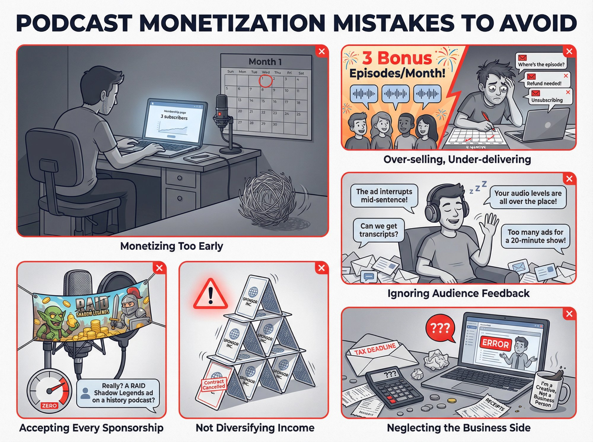

Knowing what not to do is just as important as knowing what works.

**Monetizing too early.** Launching a membership page when you have 30 listeners sets you up for disappointment. Focus first on creating great content and growing your audience to a few hundred engaged listeners before asking for money.

**Over-selling and under-delivering.** If you promise three bonus episodes per month to supporters but only deliver one, you'll lose members fast. Start conservative with perks and overdeliver rather than overpromise.

**Accepting every sponsorship offer.** A random mobile game sponsorship on your serious journalism podcast feels off and damages credibility. Be selective. Your audience's trust is worth more than a one-time payout.

**Ignoring audience feedback.** If multiple listeners say your mid-roll ad interrupts at a jarring point, move it. If they ask for transcripts and you can provide them, do it. Small improvements compound into loyalty.

**Not diversifying income.** Relying solely on one sponsor or platform ad network is risky. They can cut rates, change terms, or disappear. Build multiple streams so you're not vulnerable to any single point of failure.

**Neglecting the business side.** Track expenses (hosting, equipment, software), set aside money for taxes, understand what's deductible. As soon as you earn money, you're running a business. Treat it like one from day one.

## How to Start Making Money from Your Podcast: First 90 Days

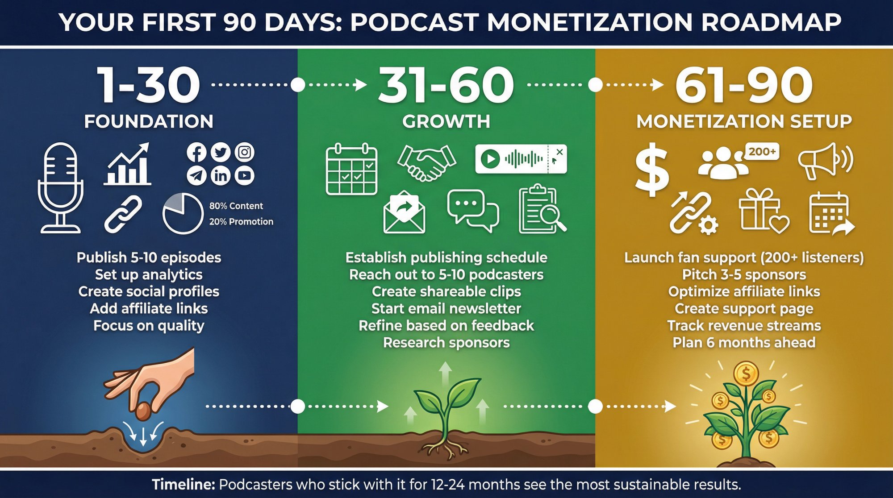

If you're launching a podcast with monetization in mind (or trying to monetize an existing show), here's a practical roadmap:

### Days 1-30: Foundation

- Publish your first **5-10 episodes** to give new listeners a back catalog
- Set up basic analytics (most hosting platforms include this)
- Create social media profiles and start building an email list
- Put affiliate links for tools you mention in show notes (even if traffic is low)
- Focus **80% on content quality, 20% on promotion**

### Days 31-60: Growth

- Establish a consistent publishing schedule
- Reach out to **5-10 other podcasters** for guest swap opportunities
- Create shareable content (audiograms, quote graphics) for social media
- Start a simple email newsletter (even just episode announcements)
- Continue refining your content based on early feedback
- Research potential sponsors in your niche (for future outreach)

### Days 61-90: Monetization Setup

- If you have **200+ engaged listeners**, consider [launching fan support via Patron](https://www.patron.com/) (note: while top creators average 1% conversion, you can start at any audience size)
- Pitch **3-5 potential sponsors** with your media kit (even if small)
- Optimize your show notes with affiliate links to relevant products
- Create a "support the show" page with multiple giving options
- Set up tracking for which revenue streams perform best
- Plan your first **6 months of content** to maintain momentum

Stay consistent, engage your audience, and don't expect overnight results. Podcasting is a long game, but the podcasters who stick with it for **12-24 months** see the most sustainable results.

## Why Podcasters Choose Patron to Maximize Revenue

Since we're [Patron](https://www.patron.com/), here's specifically why podcasters are using our platform over traditional alternatives.

### Built for Sequential Content

Unlike generic membership platforms, [Patron is designed for creators making episodic content](https://www.patron.com/blog/category/podcast/) like podcasts, webcomics, and serialized fiction. The features are tailored to how podcast audiences actually consume content. **Release scheduling** lets you set episodes to release on a specific date and time automatically. [**Rolling paywalls**](https://www.patron.com/blog/post/what-is-a-rolling-paywall/) give members early access, then episodes unlock for free listeners on your schedule. **Series management** organizes episodes into seasons or series for easier navigation. **Audience insights** show which episodes drive the most conversions and engagement.

### The 1% Fee Advantage

At **1% fees for early adopters** versus the industry standard **10%**, the math is simple. On **$2,000** of monthly member support:

| **Platform**                      | **Monthly Revenue** | **Platform Fee** | **Your Take-Home** |
| --------------------------------- | ------------------- | ---------------- | ------------------ |
| Traditional Platform              | $2,000              | ~$200 (10%)      | ~$1,700            |
| [Patron](https://www.patron.com/) | $2,000              | ~$20 (1%)        | ~$1,930            |
| **Difference**                    | \-                  | **9% more**      | **+$230/month**    |

That's **$230 more in your pocket every month** (or **$2,760 per year**). That's new equipment, better hosting, or simply more incentive to keep creating great content.

### Open Source Means Transparency

[Patron is open source](https://github.com/patroninc/patron) (Apache 2.0 license), which means you can see exactly how the platform works. No black-box algorithms deciding your visibility. No hidden fees or surprise policy changes. The code is public on GitHub, and the roadmap is transparent.

For podcasters who've been burned by platforms changing terms or shutting down features, this transparency is valuable peace of mind.

### When to Choose Patron

[Patron](https://www.patron.com/) makes the most sense if you:

- Produce episodic content that benefits from rolling release schedules
- Want to keep more of your revenue (that **1% fee** matters at scale)
- Value platform transparency and open-source principles
- Are building a long-term podcast business, not just testing the waters

The platform entered early alpha in September 2025 and remains in alpha as of December 2025, so if you need a massive existing user base or every feature under the sun, more established platforms might fit better. But for podcasters who want a creator-first platform with minimal fees and features built specifically for sequential content, [it's worth exploring](https://www.patron.com/blog/post/switch-from-patreon-to-patron/).

## The Bottom Line: Can You Actually Make Money?

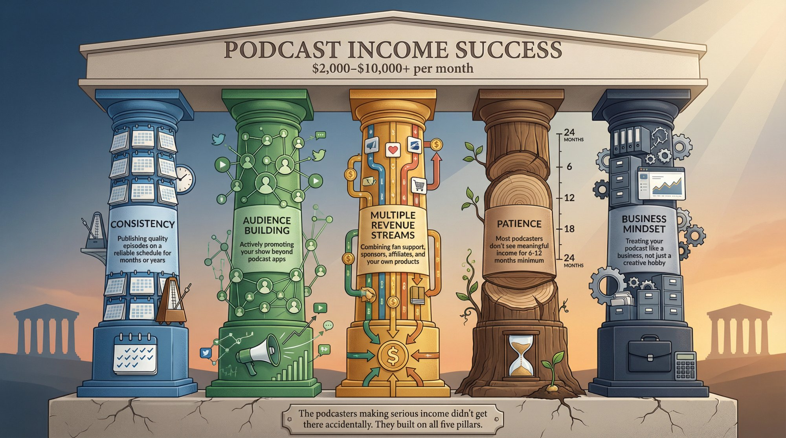

Can you make money from a podcast in 2026?

**Yes, absolutely.** But it requires:

- **Consistency**: Publishing quality episodes on a reliable schedule for months or years
- **Audience building**: Actively promoting your show beyond podcast apps
- **Multiple revenue streams**: Combining [fan support](https://www.patron.com/blog/post/annual-vs-monthly-memberships-for-creators/), sponsors, affiliates, and possibly your own products
- **Patience**: Most podcasters don't see meaningful income for **6-12 months** minimum
- **Business mindset**: Treating your podcast like a business, not just a creative hobby

The podcasters making **$2,000-10,000+ per month** didn't get there accidentally. They created valuable content, built engaged audiences, diversified their monetization, and stuck with it through the slow early months.

If you're willing to put in the work and play the long game, podcasting can absolutely become a viable income source. Some podcasters even build it into a six-figure business (though that's rare and takes years of dedicated effort).

Are you willing to do what it takes? If the answer is yes, start recording, publish consistently, engage your audience, and experiment with monetization. The opportunity is real for those who commit to it.

## Frequently Asked Questions

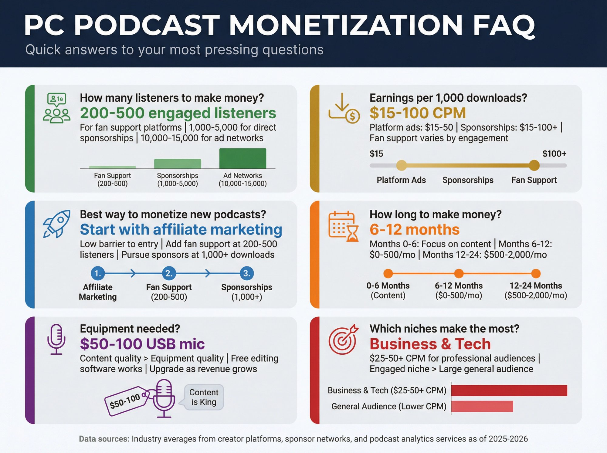

### How many listeners do you need to make money from a podcast?

You can start making small amounts with just a few hundred dedicated listeners through fan support platforms like [Patron](https://www.patron.com/). For traditional sponsorships, while some opportunities exist at **1,000-5,000 downloads** per episode (especially for direct deals), traditional ad networks typically require **10,000-15,000 monthly downloads**. The key is engagement quality. A highly niche show with **500 dedicated listeners** can out-earn a general show with **5,000 passive listeners** through direct support and affiliate marketing.

### How much do podcasts make per 1,000 downloads?

This varies widely by monetization method. Platform ads might pay **$15-50 per 1,000 downloads** depending on your niche and CPM rates. Sponsorships typically range from **$15-100+ per 1,000 downloads** based on audience targeting and advertiser demand. Fan support and affiliate revenue aren't directly tied to download numbers. A smaller, engaged audience can generate more income through these channels than raw download counts suggest.

### What's the best way to monetize a new podcast?

For new podcasts, start with affiliate marketing (low barrier to entry, just add links to products you mention) and focus on building your audience. Once you have **200-500 engaged listeners**, consider [opening fan support via Patron](https://www.patron.com/). While top creators average 1% conversion (requiring tens of thousands of followers for substantial membership numbers), you can technically start at any audience size. Don't pursue sponsorships until you consistently hit **1,000+ downloads** per episode and have several months of analytics to show potential advertisers.

### How long does it take to make money from podcasting?

Most podcasters don't see meaningful revenue for **6-12 months** of consistent publishing. The first few months should focus entirely on creating great content and growing your audience. While the $50-200/month range is realistic for early monetization, specific timelines vary by audience growth. By **12-18 months** with steady growth, **$500-2,000/month** becomes achievable with multiple revenue streams. The timeline to full-time income varies significantly and is rarely specified in concrete months, though it typically requires building to thousands or tens of thousands of listeners.

### Do you need a lot of equipment to start a profitable podcast?

No. Many successful podcasters started with just a USB microphone (**$50-100**) and free editing software like Audacity. Your content quality matters infinitely more than having a **$5,000** studio setup. Invest in a decent microphone and quiet recording space first. You can upgrade equipment as revenue grows. Focus your early budget on content quality and promotion rather than fancy gear.

### Can you make money from podcasting on Spotify?

Yes, but Spotify's automated ad programs typically require substantial listenership (_thousands of streams_ per episode) before generating meaningful revenue. A better approach is using Spotify as one distribution channel while monetizing through direct sponsorships, [fan support on platforms like Patron](https://www.patron.com/blog/category/podcast/), and affiliate marketing. Don't rely solely on Spotify's monetization tools. They're supplemental, not primary income for most podcasters.

### What podcast niches make the most money?

Business, technology, and niche professional podcasts can command premium CPM rates. While most industry data shows **$25-50 CPM** for mid-roll host-read ads in these niches, specialized audiences occasionally reach **$50+** (with **$100+** being rare and typically reserved for highly specialized audiences). True crime, comedy, and entertainment shows can also be profitable at scale but typically see lower CPMs (**$15-30**). A highly engaged niche audience can be more profitable than a large general audience, so choose a topic you're passionate about rather than chasing purely lucrative niches.

### Should I use Patron for my podcast?

If you're comparing podcast monetization platforms, the key differentiators are fees and features. Traditional platforms charge **10%** for new creators, while [Patron offers 1% fees for early adopters](https://www.patron.com/blog/post/patreon-fee-changes-2025/). On **$1,000** monthly income, that's **$90 more in your pocket** with Patron. [Patron is also purpose-built for sequential content](https://www.patron.com/blog/post/best-patreon-alternatives-for-writers/) with features like rolling paywalls and release scheduling that podcasters specifically need. The trade-off is Patron is newer (entered early alpha in September 2025) with a smaller user base, while established platforms have more name recognition.

### Do podcasts need a website to make money?

Not strictly required, but highly recommended. A website lets you add SEO-optimized show notes and transcripts that rank in Google, provides a central hub for affiliate links and sponsor information, and gives you an email signup form to build a direct relationship with listeners. Many successful podcasters get more traffic from Google to their website than from podcast app searches, making a website a valuable long-term asset for monetization and audience growth.

### How do I find sponsors for my podcast?

Start by creating a simple one-page media kit with your download stats, audience demographics, and engagement metrics. Research companies that sell products or services relevant to your niche and reach out directly with a pitch explaining why your audience matches their customer base. [Podcorn has no minimum download requirements](https://help.podcorn.com/en/articles/3743035-frequently-asked-questions), making it accessible for smaller podcasters, while [AdvertiseCast requires at least 2,500 downloads per episode](https://castos.com/podcast-ads-guide/) to join. As your show grows, sponsors will start approaching you. Make it easy by listing a business email in your show description and on your website.
