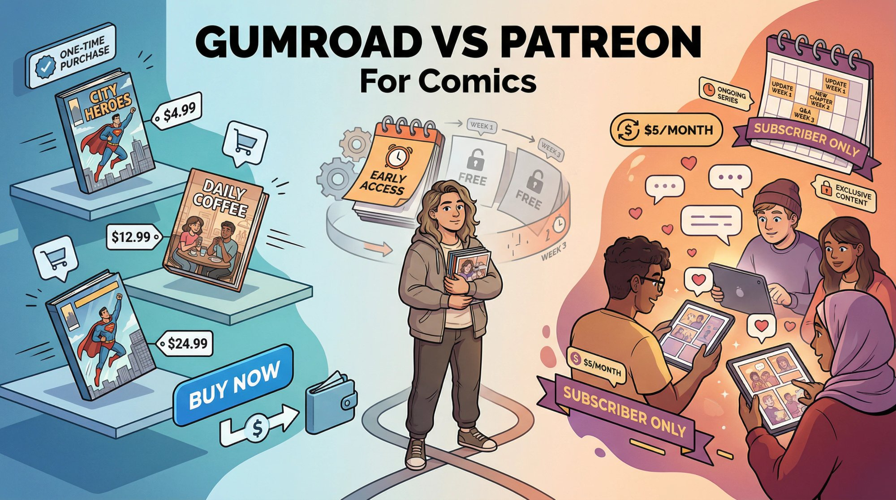
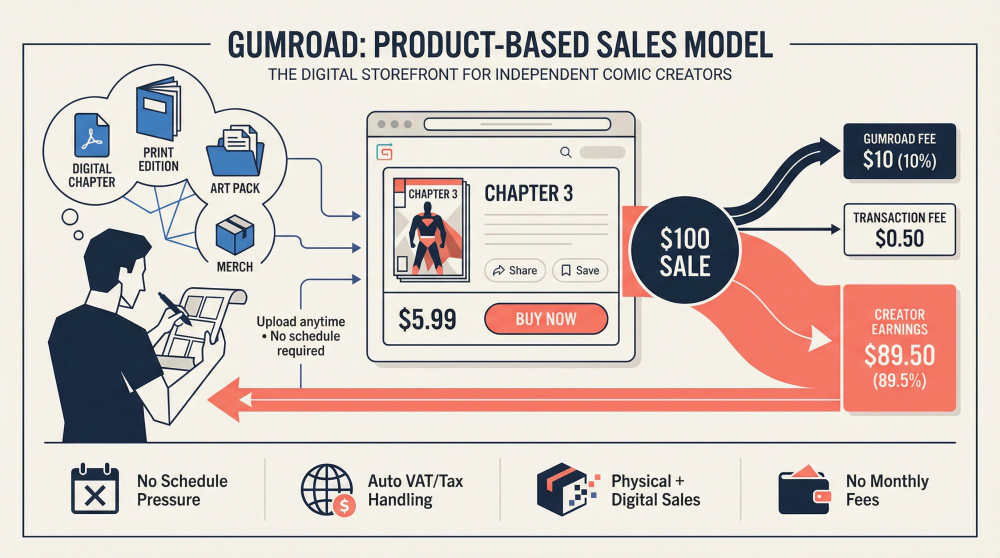
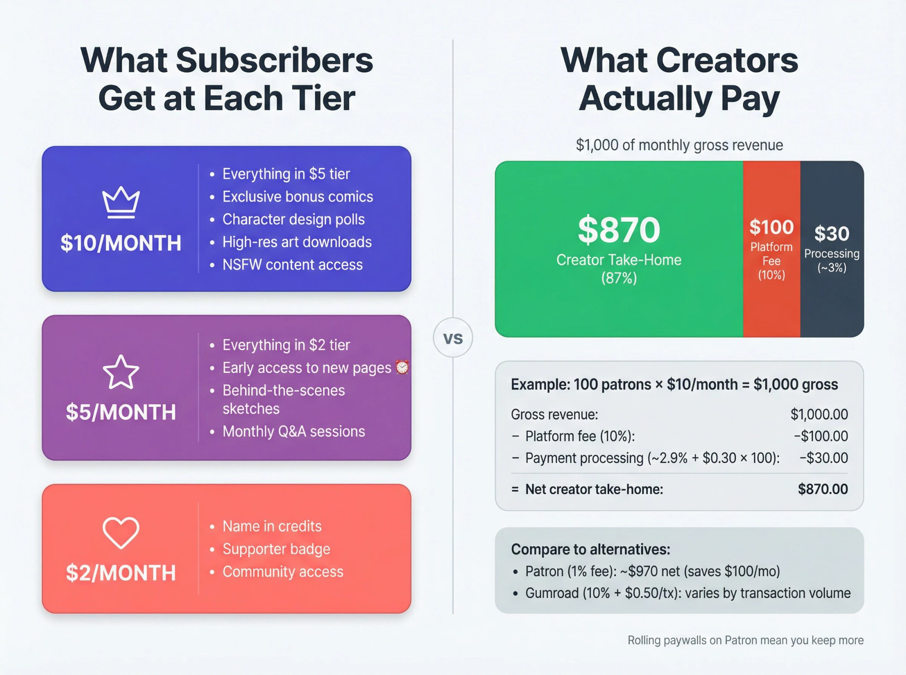
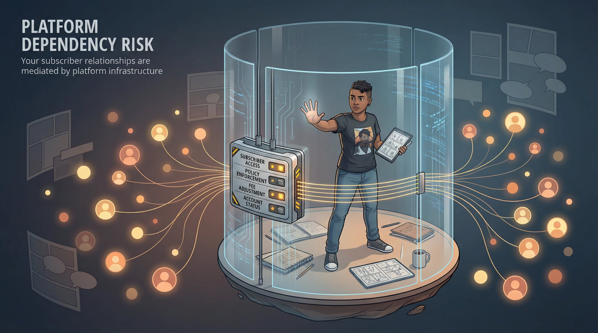
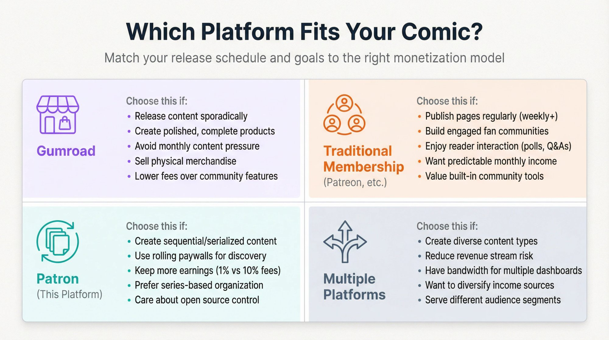
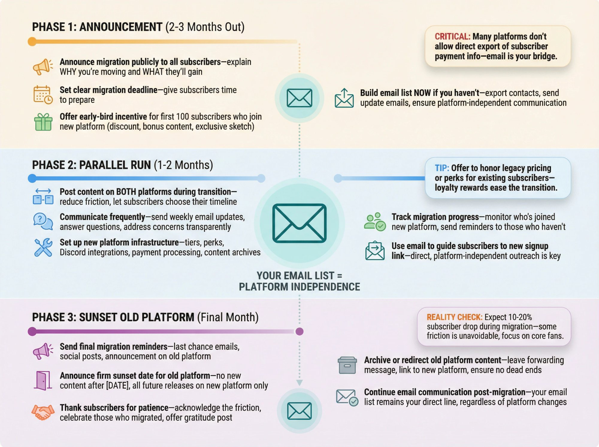
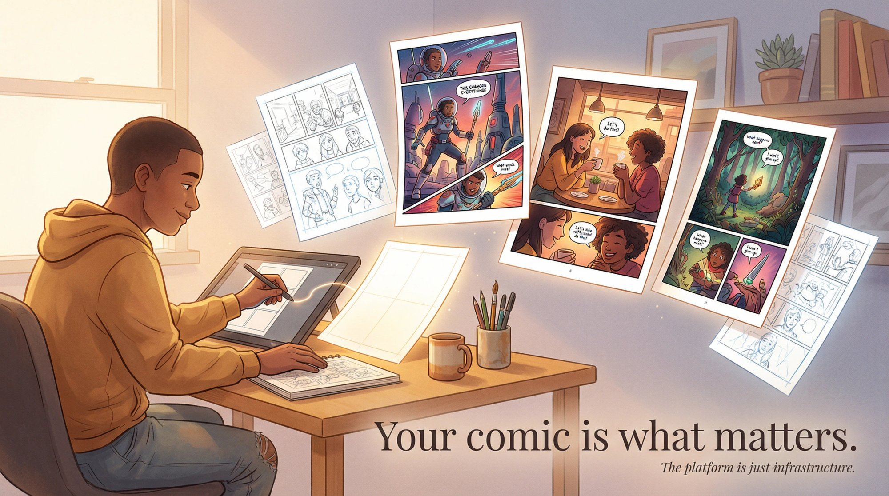

Comic creators face a choice that sounds simple but isn't. **Do you want to sell your work like products, or build a subscription community around it?**

Gumroad gives you a digital storefront. Drop a PDF of your latest chapter, set a price, and fans buy it whenever they're ready. Traditional membership platforms (the kind that charge monthly fees and promise community features) flip the model entirely. There, you're not selling individual comics. You're selling ongoing access, early releases, and a sense of belonging to an exclusive club.

Both approaches have made real money for real creators. The [webcomic market hit $7.6 billion in 2024](https://www.patron.com/blog/post/how-to-monetize-a-webcomic/) and keeps growing. [Over 25 million paying supporters](https://www.patron.com/blog/category/webcomics/) now fund creators through membership platforms. But most comparison articles miss something important. **Comics aren't like other content.**

Sequential content creates a unique problem. You need readers to discover your work (which means free access to build an audience). But you also need to earn from your most engaged fans (which usually means putting content behind a paywall). These two goals seem to fight each other.

[**Rolling paywalls**](https://www.patron.com/blog/post/what-is-a-rolling-paywall/) **solve this.** Instead of permanently locking content or keeping everything free, rolling paywalls release new episodes to paying subscribers first, then automatically unlock those same episodes for free readers after a set period (usually one to four weeks). Your archive builds up as free content that attracts new readers through search and social sharing. Meanwhile, your most engaged fans subscribe to get episodes early and stay subscribed to avoid falling weeks behind on the story.

This is the approach we've built [Patron](https://patron.com/) around, specifically for sequential content creators. But before we get into why that matters, let's break down exactly what Gumroad and traditional membership platforms offer comic creators in 2025.

## Gumroad vs Patreon Features for Comic Creators

Before getting into the details, here's how these platforms stack up for comic creators.

| Feature | Gumroad | Patreon |
| --- | --- | --- |
| **Primary Model** | Direct sales of digital/physical products; optional simple subscriptions | Recurring monthly memberships with tiered rewards |
| **Platform Fees** | 10% + $0.50 per transaction; 30% if discovered via Gumroad marketplace | 10% platform fee for new creators (as of August 2025) plus payment processing (~3-5%) |
| **Payout Schedule** | Weekly (every Friday) | Monthly (processed after each billing cycle) |
| **Community Features** | Minimal (email updates, downloads) | Robust (posts feed, comments, polls, Discord integration) |
| **Best For** | Selling completed issues, volumes, merch; sporadic releases | Consistent content output; building engaged fan communities |

Both platforms have legitimate strengths. The question is which strengths matter more for your specific situation.

## How Gumroad Works for Selling Comics

Gumroad launched in 2011 with a straightforward goal. Make it easy to sell digital products directly to fans. For [comic artists](https://www.patron.com/blog/category/webcomics/), it functions like running your own online shop. List your PDF chapters, print editions, art packs, or merchandise. Fans pay once and get immediate access.

**What Gumroad does well**

You can sell anything without committing to a production schedule. Got a finished chapter? Upload it, set a price, and you're done. Working on a graphic novel that won't be ready for six months? No problem. Gumroad doesn't care when or how often you release content.

The fee structure is simple. **10% plus $0.50 per transaction** for sales you drive yourself. No monthly platform fees eating into your earnings regardless of whether you make sales. If someone discovers you through Gumroad's marketplace, the fee jumps to 30%, but most comic creators drive their own traffic from social media or their websites anyway.

Physical goods work seamlessly alongside digital. Want to sell signed copies of your graphic novel? Art prints? Enamel pins featuring your characters? Gumroad handles shipping information collection and lets you set shipping costs by region.

Since January 2025, Gumroad became merchant of record, which means they automatically handle VAT, GST, and sales tax collection worldwide. *One less headache for you.*

**The Gumroad membership option.** While Gumroad is known for one-time purchases, they've added subscription functionality. Some creators have moved their comics to Gumroad specifically because it lets them offer "both monthly support AND one-off comic purchases" in one place. Subscribers can even get automatic discounts on products in your store.

**Where Gumroad falls short for comics**

No community infrastructure exists within the platform. Your "membership" is essentially a paid email list with file access. If you want fans discussing your latest pages, speculating about plot twists, or chatting with each other, you'll need to build that somewhere else (Discord, a forum, social media).

The flat **$0.50 fee per transaction** hurts low-priced items badly. Sell a mini-comic for $1, and Gumroad keeps $0.60 of it. This pricing structure favors bundled products and higher price points over micro-transactions.

Adult content faces restrictions on Gumroad. They prohibit certain explicit and obscene content. If your comic ventures into NSFW territory, read their policies carefully before building your storefront there. Many adult comic creators use traditional membership platforms specifically because those platforms accommodate age-restricted content more permissively.

Discovery is *entirely* on you. Nobody browses Gumroad looking for their next favorite webcomic. You build your audience elsewhere and send them to Gumroad to buy. The platform is a transaction layer, not a community or discovery engine.

## How Patreon Works for Webcomic Subscriptions

Subscription platforms like Patreon pioneered the creator membership model that's now everywhere online. Instead of selling individual items, you're inviting fans to pay monthly in exchange for ongoing perks. Early access, behind-the-scenes content, polls, direct interaction, and community belonging.

For [creators making money from webcomics](https://www.patron.com/blog/post/how-to-monetize-a-webcomic/), this model can provide something invaluable. **Predictable monthly income.**

**The appeal of recurring revenue**

When fans subscribe, they pledge a set amount each month until they actively cancel. You start each month knowing roughly what you'll earn, rather than hoping someone decides to buy your latest chapter. For creators trying to go full-time or at least cover consistent expenses, this stability changes everything.

**Early access as the core value proposition**

The most popular reward for webcomic memberships is simple. Subscribers read new pages days or weeks before they go public. This creates real urgency. Fans who *need* to know what happens next will pay for that privilege. And once they're caught up with early access, canceling means falling behind on a story they're invested in.

**Community features that keep fans engaged**

Traditional membership platforms provide built-in tools. A posts feed where you share updates and fans can comment. Direct messaging. Polls that let subscribers vote on a character's costume design or which side story to explore next. Discord integration for real-time chat. Your membership becomes more than content delivery. It becomes a clubhouse for your most devoted readers.

[**Tiered pricing**](https://www.patron.com/blog/post/how-to-price-your-webcomic-tiers/) **captures different fan segments**

You can set up multiple tiers. Maybe $2/month gets supporters mentioned in your credits. $5/month adds early access. $10/month includes bonus sketches or NSFW content. This flexibility means casual fans can contribute what they're comfortable with, while superfans can pay more for additional perks.

**The costs and tradeoffs**

Platform fees have increased significantly. [As of August 2025, new creators face a 10% platform fee](https://www.patron.com/blog/post/patreon-fee-changes-2025/) on their earnings, plus payment processing fees (typically around 2.9% + $0.30 per transaction). Budget for roughly **13-15% of your gross revenue** going to platform and payment fees. Understanding [how to calculate your true take-home pay](https://www.patron.com/blog/post/how-to-calculate-your-true-patreon-take-home-pay-2025/) is essential before committing to any platform.

The subscription model demands consistent output. When people pay monthly, they expect regular value. If you disappear for weeks without updates, subscriptions start canceling. This creates pressure that some creators thrive under (deadlines force productivity) and others find exhausting.

Traditional membership platforms weren't built for sequential content. There's no native comic reader, no chapter organization, no clean way to let a new subscriber binge your 200-page backlog. Posts show up in a feed like a blog. If someone joins wanting to start from Chapter 1, they're scrolling backward through months of posts. Many comic creators end up posting their archives elsewhere (their own site, [Webtoon and similar platforms](https://www.patron.com/blog/category/webtoon/)) and using memberships purely for new releases and extras.

Payouts happen monthly, not weekly like Gumroad. If you have a sudden cash need or a big launch that brings in new subscribers mid-month, you're waiting until next month's processing to see that money.

Platform dependency creates risk. Your subscriber list lives on their platform. If they change policies, raise fees, or (in rare cases) suspend your account, you lose direct access to your supporters. [Policy controversies have happened before](https://www.washingtonpost.com/news/the-intersect/wp/2017/12/13/facing-a-rebellion-of-furious-creators-patreon-backs-away-from-a-new-fee/), and while platforms usually listen to creator pushback, you're ultimately renting space in someone else's ecosystem. Knowing [what to do if your content gets banned](https://www.patron.com/blog/post/what-to-do-if-patreon-content-got-banned/) is worth considering before you're locked in.

## How Much Do Webcomic Creators Earn on Patreon?

Real numbers matter more than theoretical comparisons. Some successful webcomic creators earn substantial income through memberships.

| Creator | Platform Following | Paying Subscribers | Estimated Monthly Income |
| --- | --- | --- | --- |
| Pet Foolery (Pixie and Brutus) | Millions on Instagram | 10,000+ paid members | [$17,000 - $71,000](https://graphtreon.com/creator/petfoolery) |
| Jeph Jacques (Questionable Content) | Long-running webcomic | 12,000+ paid members | Estimated $20,000 - $82,000 |
| John Allison (Scary Go Round) | Veteran webcomic creator | ~1,400 paid members | [$3,000 - $10,000 (estimated)](https://graphtreon.com/creator/scarygoround) |

*Data from public membership pages and third-party analytics, as of late 2025*

**Notice the pattern.** Pet Foolery posts free comics regularly on Instagram (with over 3 million followers), while providing exclusive Pixie and Brutus content to subscribers. The free content builds audience; the paid membership turns superfans into supporters.

Jeph Jacques updates his free webcomic five days a week and treats his membership as essentially a tip jar with modest extras. His secret isn't elaborate perks. It's *consistency*. Fans know he's delivering every weekday, and a meaningful percentage are willing to pay to support that.

John Allison combines memberships for ongoing support with separate product sales for completed PDF collections on his [personal website](https://scarygoround.com/). Different revenue streams serving different fan preferences.

## Why Rolling Paywalls Work Better for Comics

Here's the fundamental tension comic creators face. **Discovery and monetization seem to work against each other.**

Put everything behind a paywall, and new readers can't find you. Keep everything free, and you're hoping for tip-jar generosity or advertising revenue (which rarely pays well for independent creators).

Most comparison articles frame this as a binary choice. Gumroad's sales model or traditional subscription memberships. But sequential content like comics has different dynamics than one-off products or monthly podcast episodes.

**The discovery funnel for comics works like this**

Someone finds your comic through social media, a recommendation, or search. They start reading. If it's good, they binge. And then something magical happens. They catch up to your current episode and hit a cliffhanger.

**This is the conversion moment.**

That reader is emotionally invested. They *need* to know what happens next. If you offer early access for a few dollars a month, a percentage of those readers will subscribe. Not because they want to support you out of charity, but because the wait is unbearable and paying solves their problem.

Once subscribed, they stay. Canceling means falling behind on a story they're following. Unlike other content types where you might cancel a membership during a slow month, unsubscribing from a serialized comic means losing ground you can't easily recover.

**The rolling paywall advantage.** Your free archive keeps growing, improving search visibility. New readers always have content to discover. The conversion moment happens naturally when they catch up. Subscribers maintain their "ahead" status as long as they stay subscribed.

[**Rolling paywalls**](https://www.patron.com/blog/post/what-is-a-rolling-paywall/) **optimize this entire funnel.** New episodes release to subscribers first. After a set delay (one week, two weeks, a month), those episodes become free.

Your free archive keeps growing, improving search visibility and social shareability. New readers always have content to discover and binge. The conversion moment happens naturally when they catch up to paid content. Subscribers maintain their "ahead" status as long as they stay subscribed.
    

Traditional membership platforms don't really support this workflow. You either post content as subscriber-only (killing your discovery funnel) or post publicly (losing the early access incentive). Manually managing delayed releases is technically possible but tedious.

## How Patron Compares to Gumroad and Patreon

At [Patron](https://patron.com/), we built our platform specifically around the needs of sequential content creators. [Webcomics](https://www.patron.com/blog/category/webcomics/), serialized fiction, [podcasts with ongoing narratives](https://www.patron.com/blog/post/how-to-monetize-a-podcast-with-early-access-not-ads/).

[**Rolling paywalls**](https://www.patron.com/blog/post/what-is-a-rolling-paywall/) **are core functionality, not an afterthought.** Set your delay period, and new episodes automatically release to paying subscribers first, then unlock for free readers on schedule. No manual reposting. No juggling multiple platforms.

**Our fee structure is dramatically different.** We charge [1% for early adopters](https://patron.com/), compared to the [10% platform fees on traditional membership platforms](https://www.patron.com/blog/post/patreon-fee-changes-2025/). On $1,000 monthly revenue, that's **$10 to us versus $100 to competitors**. We've committed to staying lean and avoiding venture capital pressure that typically forces platforms to raise fees over time.

**Series and episode organization matters.** We built our content system around series with ordered episodes, not a generic blog feed. Readers can start from Chapter 1 and work forward. You can schedule releases in advance. The experience is designed for following a story, not scrolling through posts.

**Open source gives you options.** Our [codebase is Apache 2.0 licensed on GitHub](https://github.com/patroninc/patron). If you need custom features, you can self-host. If you're worried about platform lock-in, your data remains yours. This level of transparency and control doesn't exist with traditional membership platforms.

We're still in early alpha as of 2025, actively shipping features weekly. Check our [changelog](https://www.patron.com/changelog/) to see our progress. If you want to get in early and lock in 1% fees for life, [join our waitlist](https://patron.com/).

## Can You Use Gumroad and Patreon Together?

Gumroad and membership platforms aren't mutually exclusive. Many successful comic creators use both strategically.

**The standard hybrid approach**

Publish your comic for free somewhere like your own site, [platforms like Webtoon](https://www.patron.com/blog/post/best-platform-for-webtoon-creators/), or Tapas to maximize readership. Run a membership for early access and subscriber-only perks. Sell completed volumes, art books, and merchandise on Gumroad.

This covers all your bases. Free content grows your audience. Memberships turn your most engaged fans into recurring supporters. Gumroad captures one-time purchases from readers who prefer buying products over subscribing.

**John Allison's model**

He runs a membership with about 1,400 supporters for ongoing exclusive sketches and early access. Meanwhile, completed webcomic collections sell as PDFs on his [personal website](https://scarygoround.com/) for readers who just want the finished books. Different audiences, different preferences, both contributing revenue.

**Key principles for hybrid monetization**

Differentiate your offerings. Don't put identical content on both platforms. Memberships should feel like ongoing access and community. Gumroad should feel like owning a finished product.

Time your releases strategically. Subscribers get pages first. Free readers get them weeks later. Gumroad buyers get beautifully compiled volumes months after the content went free. Each segment pays for a different value. Immediacy, convenience, ownership.

Don't cannibalize your membership. If someone can get everything you offer by just buying an occasional Gumroad product, why would they subscribe? The membership should provide value that one-time purchases can't replicate. Ongoing early access, community, interaction.
    

Whether you're choosing [annual vs monthly memberships](https://www.patron.com/blog/post/annual-vs-monthly-memberships-for-creators/), the key is understanding what each revenue stream accomplishes for your business.

## Which Platform Is Best for Your Comic?

Here's how to think through your decision.

**Gumroad works best for** creators who release content sporadically rather than on a consistent schedule. It fits creators whose strength is complete, polished products like graphic novels, collected volumes, and art books. Choose Gumroad if you hate the pressure of monthly content obligations or want to sell physical merchandise alongside digital comics. Lower fees matter more than community features.

**Traditional membership platforms work best for** creators who publish new pages regularly and can commit to that cadence. Building a community of engaged fans should appeal to you. These platforms suit creators who enjoy interacting with readers through polls, Q&As, and behind-the-scenes content. Predictable monthly income helps you plan your creative life. You're willing to pay higher fees for built-in community infrastructure.

[**Patron**](https://patron.com/) **works best for** creators of sequential content like [webcomics](https://www.patron.com/blog/category/webcomics/), serialized fiction, and episodic podcasts. [Rolling paywalls](https://www.patron.com/blog/post/what-is-a-rolling-paywall/) appeal to you as a way to balance discovery and monetization. Platform fees matter and you want to keep more of your earnings. Having an organized, series-based content structure sounds better than a generic post feed. Open source and creator control are values you care about.

**Multiple platforms work best for** creators who produce different types of content that fit different models. You want to reduce risk by diversifying revenue streams. You have the bandwidth to manage multiple dashboards and content strategies.
    

## Gumroad vs Patreon FAQ for Comic Creators

**Can I use Gumroad and a membership platform at the same time?**

Absolutely. Many successful creators do exactly this. The key is keeping your offerings distinct. Memberships work best for ongoing access and community; Gumroad works best for finished products and one-time purchases. Make sure fans understand what each platform offers so they can choose what suits them.

**What's the best way to earn from NSFW comics?**

Traditional membership platforms generally accommodate adult content more permissively than Gumroad, which has stricter restrictions on explicit material. Check each platform's content policies carefully before building your presence there. [Patron](https://patron.com/) is developing its content policies as the platform matures through early alpha, so creators should check for updated documentation.

**How do** [**rolling paywalls**](https://www.patron.com/blog/post/what-is-a-rolling-paywall/) **actually work?**

You set a delay period (for example, two weeks). New episodes publish to paying subscribers immediately. After two weeks pass, those same episodes automatically unlock for free readers. Your paid subscribers always stay ahead by the delay period, while your free archive continuously grows.

**When should I start monetizing my comic?**

Not too early. Build an audience first. You need readers who are invested enough in your work to pay for it. Launching monetization with 50 followers rarely works. Focus on creating great content and building readership. When you have fans actively asking how they can support you, that's your signal.

**What if my release schedule is inconsistent?**

Gumroad's product-based model handles irregular releases better than subscription memberships. You can't really promise early access when you don't know when the next release will be. If consistency isn't your strength, focus on selling complete works rather than ongoing subscriptions. Or use [Patron's](https://patron.com/) rolling paywalls, which still work even with variable schedules since the delay is automatic once you publish.

**How do I migrate subscribers from one platform to another?**

This is tricky because platforms don't make it easy. You typically can't export subscriber payment information directly. Most successful migrations involve: announcing the move well in advance, making it easy to sign up on the new platform (maybe with a limited-time discount), and potentially running both platforms simultaneously during a transition period. Build your email list independently of any platform so you can always reach your audience directly. Check out our guide on [switching from traditional platforms to Patron](https://www.patron.com/blog/post/switch-from-patreon-to-patron/) for detailed migration strategies.

## Gumroad vs Patreon for Comics: Final Verdict

Gumroad gives you a simple storefront. Traditional membership platforms give you a subscription community engine. Both can make money for comic creators, but neither was built specifically for how sequential content works.

Comics live on discovery and engagement. New readers need free content to find you. Engaged readers need reasons to pay. [Rolling paywalls](https://www.patron.com/blog/post/what-is-a-rolling-paywall/) can effectively bridge this gap by combining free content for discovery with premium access for supporters, making them a compelling alternative to both pure sales and pure subscription models for many sequential content creators.

Whatever you choose, the fundamentals stay the same. Create great work, grow your audience, and give fans clear ways to support you. The platform is just infrastructure. *Your comic is what matters.*

If you're creating sequential content and want a platform built for exactly that, [Patron](https://patron.com/) is in early alpha with 1% fees locked in for early adopters. We'd love to have you. 