Podcasting went from a niche hobby to a legitimate business. The podcast industry is now a **multi-billion dollar market** as of 2025, with global podcast ad spending hitting **$4.46 billion** and over **580 million listeners** worldwide.

But how do podcasters actually turn downloads into dollars?

It's simpler than you might think. Successful podcasters use a **combination of revenue streams** ranging from advertising deals to direct fan support. Some make millions (think Joe Rogan's **$200 million+** Spotify deal), while others earn modest side income from smaller but engaged audiences.

You don't need to be a superstar to earn from your podcast. Thanks to the industry's growth, creators at all levels now have more options than ever to get paid. This guide breaks down every major monetization method podcasters use in 2025, with real numbers and practical insights you can apply to your own show.

## What Are the Two Main Podcast Revenue Streams?

Before we get into specific methods, understand that podcast monetization falls into two broad categories:

**Advertiser/Sponsor Funding:** Brands pay to reach your audience through ads, sponsorships, and affiliate deals.

**Listener/Community Funding:** Your fans directly support you through [memberships and subscriptions](https://www.patron.com/blog/category/monetization/), donations, and purchases.

Most successful podcasters use a mix of both. The key is building an engaged audience first. Monetization rarely happens overnight, and a podcast in the top 25% gets only about **120 downloads** in its first week. Many shows have far fewer listeners initially, which is why patience and consistent quality content matter.

**That said, _even smaller podcasts_ can earn income by choosing the right strategies for their size and niche.**

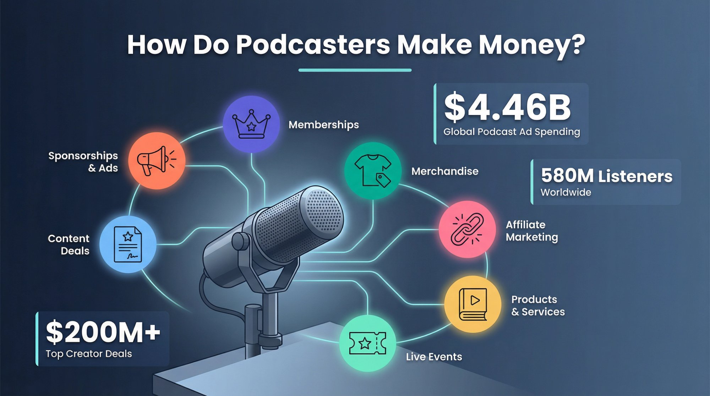

Let's break down how podcasters actually make money.

## How Do Sponsorships and Advertising Work for Podcasts?

Advertising **remains the top revenue source** for many podcasts, especially larger ones.

In this model, companies pay you to promote their product or service to your listeners. It works because of the personal, trusted relationship between hosts and audiences. Around **88% of podcast listeners** have taken action on a podcast ad, and approximately **41-46% of those** ([DesignRush](https://www.designrush.com/agency/audio-production/podcast/trends/podcast-listener-statistics)) have made a purchase because of one.

> **Key insight:** Around 88% of podcast listeners have taken action on a podcast ad, with approximately 41-46% of those making a purchase. This trust is why podcast advertising works so effectively.

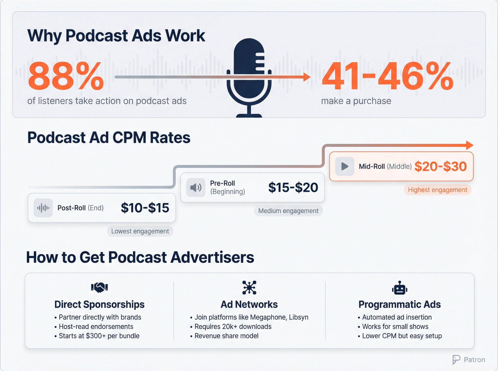

### How Podcast Ads Work

Advertisers typically pay on a **CPM basis** (cost per mille, or per 1,000 downloads). Rates vary by niche and ad placement, but here's what you'll see on average:

| **Ad Placement**             | **Average CPM** | **Engagement Level**            |
| ---------------------------- | --------------- | ------------------------------- |
| Mid-roll (middle of episode) | $20-$30         | Highest (listeners are engaged) |
| Pre-roll (beginning)         | $15-$20         | Medium (some skip)              |
| Post-roll (end)              | $10-$15         | Lowest (many tune out)          |

Let's do the math. If your show gets **10,000 downloads per episode** and you sell a mid-roll slot at **$20 CPM**, that's **$200 from that one ad**. A podcast with 5,000 downloads per episode running two mid-rolls might earn **$200-$300 per episode** from ads.

These numbers scale with audience size. Big shows can make thousands per episode from multiple sponsors, while small shows might earn only modest amounts until they grow.

### What Are the Three Ways to Get Podcast Advertisers?

**1. Direct Sponsorships**

You partner with brands yourself. These are often host-read ads where you personally endorse the product. This works well if you have a niche audience. You can pitch relevant brands with a media kit.

It can start small. One podcaster's first sponsor paid **$300** for a bundle of three ad spots, and it grew into larger contracts as she built credibility. Direct sponsors may offer free products, flat fees, or affiliate-type deals with discount codes that track sales.

**2. Advertising Networks & Marketplaces**

Once you have a substantial audience, you can join podcast ad networks (like Spotify's Megaphone, [Libsyn Ads](https://advertising.libsyn.com/), or Acast) that match you with advertisers.

These networks often require a minimum audience size. For example, [Libsyn Ads' premium Host-Read marketplace](https://advertising.libsyn.com/monetize-your-podcast) requires about **20,000 downloads per new episode** (within the first 30 days), while some other networks want 50,000+. The network handles finding ads and sometimes inserting them. You get a share of the revenue. It's less work for you, but slightly less control than with direct sponsorships.

**3. Programmatic Ads**

A growing trend in 2025 is **dynamic ad insertion and programmatic ad sales**. Even smaller creators can now opt into automatic ad marketplaces that fill your episodes' ad slots with targeted ads.

The CPM rates for programmatic ads might be lower than for custom host-read ads, but they **lower the barrier to start earning**. If you have a few hundred downloads per episode, programmatic ads won't make you rich, but they can generate a bit of income with zero extra effort. Think tens of dollars a month when you're small. As your audience grows, these earnings scale up without you needing to scramble for new systems.

### Tips for Ad Success

**Maintain trust with your listeners.** Choose sponsors that align with your audience's interests, and keep your ad reads authentic. Roughly **80% of listeners** say ads don't spoil the experience, especially if the ads are entertaining or relevant.

Space out ad placements (for example, one mid-roll in a 30-minute episode) and use natural transitions. Overloading your show with too many ads or jarring interruptions can turn listeners off. Strive for balance: monetization is important, but content is king and listener loyalty comes first.

Also, be aware of advertising guidelines and FTC disclosure rules. You must clearly identify sponsored content or affiliate promotions. Transparency protects your credibility in the long run.

## How Can Listener Support and Memberships Generate Income?

Not all podcast revenue comes from brands. **Many podcasters get paid directly by their audience**, arguably the most rewarding way to earn since it's driven by fan appreciation.

If you have a loyal listener base (_even if it's small_), your superfans may gladly chip in to support the show. In recent years, crowdfunding and membership platforms have skyrocketed in popularity for creators.

Listener support can take several forms:

### Recurring Membership Platforms

Thousands of podcasters use [membership platforms](https://www.patron.com/blog/category/monetization/) to generate steady income. For instance, the popular _Maintenance Phase_ podcast offers **$3/month** supporters an exclusive bonus episode feed.

Memberships turn your listeners into a community. You might give paying members:

- [Early access to episodes](https://www.patron.com/blog/post/how-to-monetize-a-podcast-with-early-access-not-ads/)
- Extra Q&A shows or bonus episodes
- Behind-the-scenes updates
- Merchandise discounts
- Shout-outs on air
- Access to a private Discord or community group

**Fans feel like insiders, and you get reliable monthly revenue.**

[**Patron**](https://www.patron.com/) is an open-source membership platform specifically designed for sequential content creators like podcasters. Unlike [traditional platforms' 10% fees for new creators](https://support.patreon.com/hc/en-us/articles/36426991446797-A-standard-platform-fee-for-new-creators-effective-after-August-4-2025), [Patron offers just 1% fees for early adopters](https://www.patron.com/blog/post/how-to-calculate-your-true-patreon-take-home-pay-2025/) while providing powerful features like [release scheduling](https://www.patron.com/) and series management.

#### Fees and Considerations

Membership platforms do take a cut. Traditional platforms charge varying fees. As of August 2025, [traditional membership platforms typically charge 10% platform fees for new creators](https://support.patreon.com/hc/en-us/articles/36426991446797-A-standard-platform-fee-for-new-creators-effective-after-August-4-2025) (existing creators may have legacy 5-12% rates), on top of payment processing fees. Apple and Google also take about **30%** of subscriptions if done through their apps.

Some newer options aim to be more creator-friendly. For example, [**Patron advertises only a 1% fee for early adopters**](https://www.patron.com/) since it's designed as a lean, [open-source alternative](https://github.com/patroninc/patron).

Here's how the fees compare in practice:

| **Platform Type**                          | **Platform Fee** | **Processing Fee** | **Example: $1000 Revenue** |
| ------------------------------------------ | ---------------- | ------------------ | -------------------------- |
| Traditional platforms (new creators, 2025) | 10%              | ~2.9% + $0.30      | ~$871 after fees           |
| Patron (early adopters)                    | 1%               | ~2.9% + $0.30      | ~$961 after fees           |

When choosing a membership solution, **compare the fee structures and features**. But don't just chase the lowest fee. Consider where your audience is most comfortable. Some platforms have established trust with fans, while others offer better control and economics.

It's often wise to start where your audience already is, then possibly migrate later if an alternative proves better. Learn more about [switching platforms](https://www.patron.com/blog/post/switch-from-patreon-to-patron/).

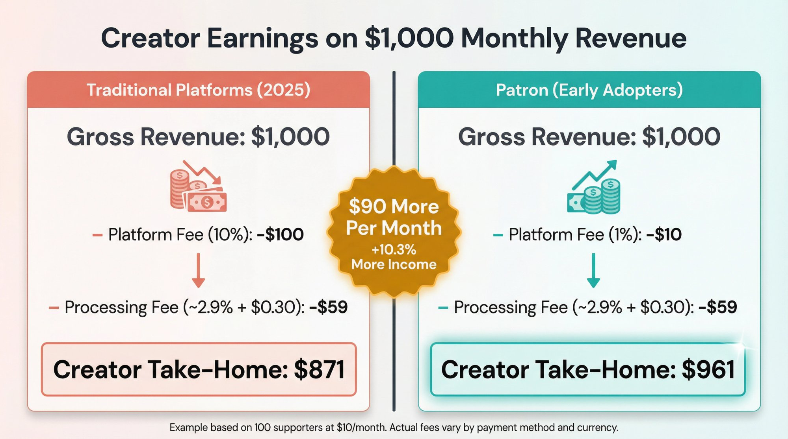

### One-Time Donations and Tips

Not every listener will commit to a monthly payment. Some prefer to give **one-off support** as a "thank you" for content they enjoyed.

Common methods include simple donation links via PayPal or Venmo. These make it easy for someone to send **$5, $10**, or any amount as a gesture of appreciation.

Tips are usually small and unpredictable, but they can add up, and they **require little extra work** beyond sharing the link. Many podcast apps (and YouTube, if you publish there) allow you to put donation links in your show notes or description.

Highlight it briefly in episodes: "If you'd like to support us, you can drop a tip via the link in the notes!"

This is low-pressure monetization, great as supplemental income while you grow toward something bigger.

### Paid Podcast Subscriptions (Apple, Spotify, etc.)

A newer avenue is offering **premium content through the big podcast platforms themselves**. Starting in 2021, Apple Podcasts enabled in-app subscriptions where listeners can pay a few dollars per month to get extra episodes or an ad-free version, right within the Apple Podcasts app.

Similarly, Spotify rolled out paid subscription capabilities, initially taking 0% but as of 2023 taking a **5% fee** from creators.

**The advantage?** Convenience. Users can subscribe with one tap in an app they already use, without visiting an external site.

**The trade-offs:**

_Platform fees:_ Apple takes a hefty cut (around **30% of subscription revenue** in the first year, dropping to **15%** for longer-term subscribers), which is significantly more than most membership platforms charge. So if you charge **$5/month** on Apple, you might only see about **$3.50** after Apple's cut and payment fees.

_Limited audience:_ An Apple Podcasts subscription only reaches listeners on Apple's platform (mostly iOS users). Spotify's paid content only reaches Spotify users. Unlike [an open membership page](https://www.patron.com/) that any fan worldwide can join with an email, these are siloed ecosystems.

_Less flexibility:_ Apple's model has no tiers. Typically it's one price for whatever extra feed you provide. Dedicated membership platforms let you create [multiple membership tiers](https://www.patron.com/blog/post/annual-vs-monthly-memberships-for-creators/) (like **$3/month** for bonus episodes, **$10/month** for bonus plus merch, etc.).

Some podcasters address this by **offering premium content on multiple platforms simultaneously**, but managing it can be a hassle since you have to upload episodes in multiple places.

### Making Memberships Work

**Listener memberships and donations can be powerful**, even for smaller shows. They turn your content into a community-powered project. Many indie podcasters cover their monthly expenses (and then some) through just a few dozen passionate fans contributing regularly.

To succeed with this approach, **focus on offering extra value** to supporters:

- Bonus episodes
- [Early access to new content](https://www.patron.com/blog/post/how-to-monetize-a-podcast-with-early-access-not-ads/)
- Exclusive live streams or AMAs
- A thank-you credit in each episode
- Discord or community access

Even something as simple as a shout-out can delight fans. The _sense of belonging_ can be as important as the content perks. People love to support creators who engage with them.

**Pro Tip:** Promote your membership or support options in a friendly, non-pushy way. A brief mention at the end of episodes (or a footer in your show notes) is usually enough.

For example: _"Enjoying the show? Consider joining our membership for bonus content – link in the description."_

Make sure your free listeners still get plenty of value so they don't feel everything good is behind a paywall. The goal is to invite your true fans to deepen their involvement, not to strong-arm your whole audience into paying.

## How Can Podcasters Make Money from Merchandise?

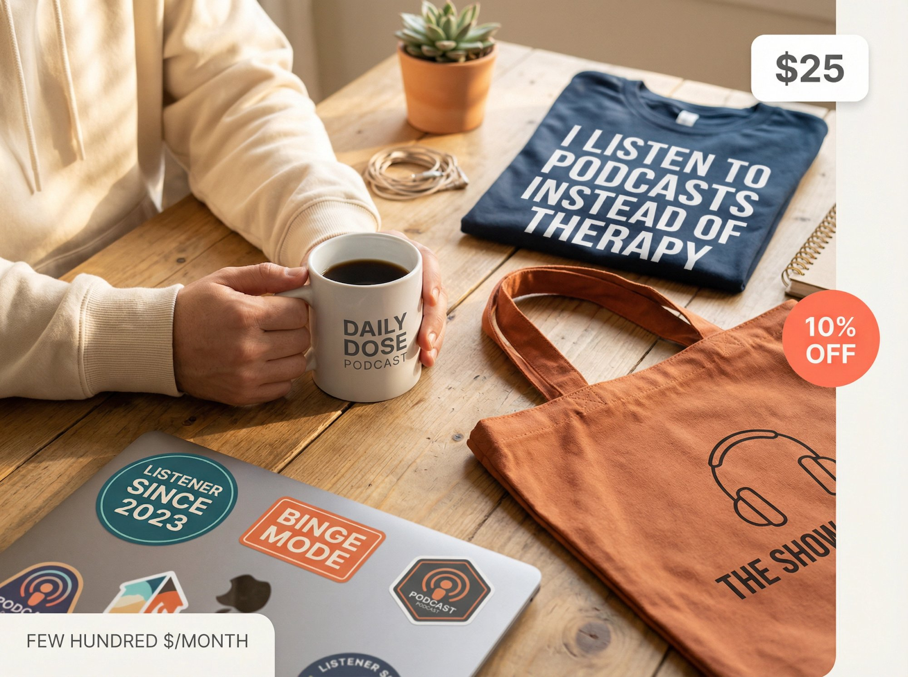

Another popular income stream for podcasters is selling **merchandise**, branded products that fans can purchase to support the show and proudly show off their fandom.

If your podcast has a catchy name, logo, inside jokes, or memorable quotes, you can probably put them on a T-shirt or mug and find buyers. Many listeners love feeling connected to their favorite shows, and merch is a tangible way for them to contribute and advertise the show at the same time.

### Common Merch Items

T-shirts, hoodies, hats, coffee mugs, stickers, tote bags, posters, and enamel pins. Some podcasts get creative and sell niche items aligned with their theme.

For example, a true crime podcast might sell detective-style notebooks, or a comedy podcast might sell a gag item referenced in the show. The hosts of _The Viral Podcast_ sell funny T-shirts and sweatshirts that they themselves wear in video clips, turning their merch into free promo every time they appear on camera.

### Print-on-Demand Makes It Easy

You don't need to front a ton of money to launch merch. **Print-on-demand services** make it easy to start small.

Platforms like Printful, Printify, Teespring, or Redbubble let you upload your designs and list products for sale online, and they handle the printing and shipping _on demand_.

This means there's **no inventory risk**. You don't pay for a batch of 200 shirts and hope they sell. Each item is produced only when someone orders it. The trade-off is each item's base cost is higher than mass-producing yourself, so profits per item might be modest. But for most podcasters, the convenience is worth it.

You can integrate a print-on-demand service with a simple Shopify store or even some podcast hosting sites, so fans can order merch seamlessly.

### Merch Strategy Tips

**Keep designs simple and true to your brand.** Your logo or a popular catchphrase from your show are good starters. Poll your audience via social media or an email list about what kind of merch they'd actually want. No point producing shot glasses if your listeners all said they'd prefer hoodies.

**Mention your merch occasionally on the podcast**, especially when you have new items or a limited-time sale. You can even give listeners a discount code as a thank you: "Check out our new t-shirts on our merch store – use code PODFAN for **10% off** this month."

**Quality matters.** Use reputable print shops or suppliers. A fan won't be thrilled if the **$25** shirt they bought has a scratchy feel or the logo washes off. Order some samples for yourself to ensure you're happy with the products.

**Don't overestimate demand.** It's better to start with a few items and see how they sell, then expand. Since print-on-demand is low-risk, you can experiment with different designs over time. Just be mindful of not overwhelming your audience with constant merch plugs. It should feel like a fun bonus, not a cash grab.

While merch sales might not eclipse ad or subscription revenue for most shows, it can be **significant** for shows with a devoted fanbase. Some comedy and pop-culture podcasts generate substantial income from robust merch lines.

And even for smaller podcasts, a few hundred dollars a month from merch is possible if you have a unique design that resonates with listeners. Plus, merch doubles as marketing: each person wearing your podcast's shirt or drinking from your branded mug is spreading word-of-mouth.

## What Is Affiliate Marketing for Podcasters?

Affiliate marketing is a **low-friction way to earn from** your podcast by recommending products or services and earning a commission on any resulting sales.

It's essentially partnering with brands as an affiliate rather than having them sponsor you upfront. For podcasters, this often means **sharing special discount codes or referral links** with your audience. When listeners make a purchase using your code or link, you get a percentage of the sale (or a fixed bounty).

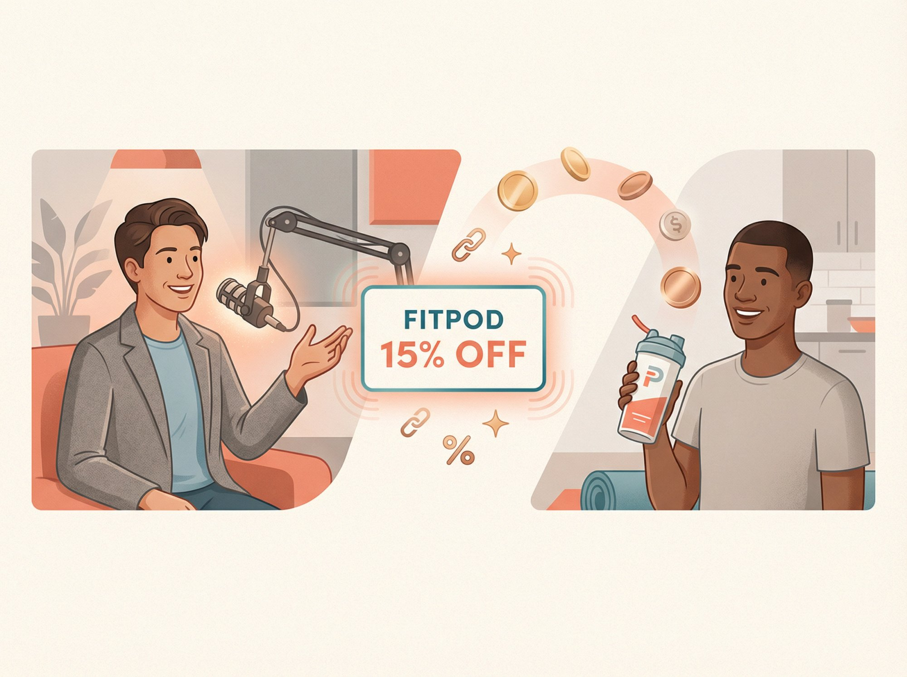

### How It Works

Let's say you host a fitness podcast and you become an affiliate for a protein powder brand. You might mention on an episode, "I've been using XYZ Protein, love the chocolate flavor. If you want to try it, use my code FITPOD at checkout for **15% off**."

If a listener uses that code, the brand tracks it and pays you a cut, maybe **10%** of the sale. Listeners get a deal, the brand gets a sale, and you get a commission. Everyone wins.

### Why Affiliate Marketing Works Well in Podcasts

**It's authentic when done right.** Ideally, you affiliate with products you truly like or that are relevant to your audience. Your recommendations carry weight because listeners trust you as a curator. It feels more organic than a random ad because you're vouching for it.

**There's no audience size requirement.** Even small podcasts can do affiliate promos. You don't need thousands of listeners. You just need to influence the ones you do have. If **50 people** who hear your recommendation go buy the product, you earn money even if your podcast isn't "advertiser big" yet.

**It can be integrated seamlessly.** Often, affiliate mentions fit naturally into content (similar to host-read sponsorships). You can also include affiliate links in your show notes, website, or a follow-up email newsletter for those who want to easily click.

### Getting Started with Affiliates

You can join large **affiliate networks** that give you access to many brands' programs. For instance, Amazon Associates (for virtually any product on Amazon), Commission Junction (CJ), [Awin](https://www.awin.com/us/getting-started-sas) (formerly ShareASale, transitioned in October 2025), or Rakuten Advertising.

These networks let you generate custom links or codes for products relevant to your show.

There are also specialized affiliate programs. If your podcast is about web design, you might join a web hosting company's affiliate program. If it's about books, maybe Audible's audiobook referral program. Tech podcasts often affiliate with gear retailers.

**_Think about your niche_** and what your listeners might buy. Some popular affiliate categories for podcasters include:

- **Books/Audiobooks:** Mention a book and use an Amazon or Audible affiliate link.
- **Courses/Software:** If you discuss tools or online courses. Many business podcasts promote website builders or email marketing services with referral deals.
- **E-commerce products:** Everything from beauty products to gadgets can work, if it ties in. Lifestyle podcasts do this a lot.
- **Podcasting services:** If talking to fellow creators, affiliate for microphones, hosting platforms, editing software, etc.

### Disclosure and Trust

**Disclose that it's an affiliate.** Usually saying "I get a small commission if you use my code, at no extra cost to you" is enough. This transparency is often required by advertising standards and keeps trust with your audience.

While affiliate marketing likely won't yield huge money unless you have a sizable or very purchase-prone audience, it can be nice supplementary income. Some savvy podcasters in lucrative niches (tech, finance, etc.) can earn **thousands per month** via affiliate partnerships by effectively turning their content into a funnel for high-value products.

But even at a smaller scale, you might earn enough to cover your hosting fees or new equipment just by recommending things you genuinely use.

## How to Sell Your Own Products or Services as a Podcaster

Many podcasters earn **_beyond_ the podcast itself** by using their content expertise and audience trust to sell related products or services.

In fact, for some creators the podcast is essentially a marketing channel for a larger business. Here's how podcasters turn their knowledge and influence into income off the air:

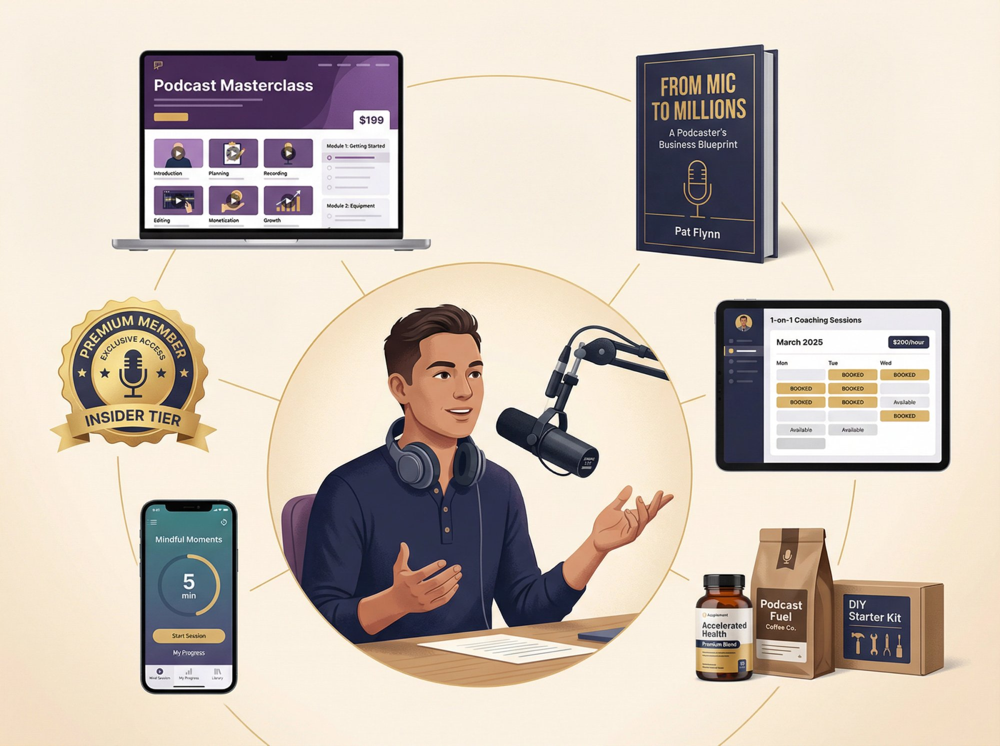

### Online Courses and Workshops

If your podcast teaches or explores a skill (business, language learning, personal development, etc.), there may be demand for a deeper-dive course.

Creators like Pat Flynn and John Lee Dumas famously used their podcasts to launch paid online courses and communities. Online courses can be highly lucrative. Depending on the topic, a course might sell for anywhere from **$50 to $500** or more.

You only need a handful of sign-ups to make a significant impact on your revenue. For example, a course priced at **$199**, with **50 of your listeners** buying it, brings in **$9,950**.

Courses can include video lessons, downloadable guides, even private podcast feed content for students. If you're seen as an authority or mentor in your niche, your listeners might jump at the chance to learn directly from you in a structured way.

### Coaching or Consulting Services

If you offer personal services (coaching, consulting, freelance work), your podcast can attract clients.

For instance, a leadership podcast host might offer one-on-one coaching calls, or a marketing podcast host might take on consulting projects for businesses. By casually mentioning your availability or sharing success stories of clients (with permission), you let listeners know they can _hire you_.

This can be a high-ticket monetization path. Coaches often charge **hundreds per session**, and consultants may charge **thousands** for projects. You obviously need bona fide expertise and time to deliver services, but it can be one of the fastest ways to earn from a small audience because **the value per customer is high**.

Even a few clients from your listener pool can equal a lot of ad revenue. Remember to set up a clear way for interested listeners to reach you, like a contact form or calendar link on your site. And manage your time. Don't over-promise availability and burn out.

### Books and Publications

Podcast hosts often become authors. If you've been delivering valuable content in audio form, there's potential to repurpose or expand it into a book (nonfiction or even fiction, depending on your show).

Writing a book not only creates a product to sell, but it also **elevates your credibility** and can attract new audiences. Many popular podcasts have landed book deals or self-published books. For example, the creators of a hit sci-fi fiction podcast turned their series into a novel trilogy.

You might already have transcripts or show notes that form a starting outline for a book.

Beyond traditional books, consider **ebooks, PDF guides, or printable resources** that your listeners would find useful. These can be sold directly on your website. They might not make you rich, but they're a great **"long tail"** product. Once created, a book or PDF can sell for years with little additional effort.

### Premium Content and Apps

Some podcasters develop premium spin-offs of their content. This could be a paid newsletter subscription, a private community (like a paid Slack, Discord, or forum), or even a mobile app related to the show's content.

For example, a finance podcast might sell access to a stock-tracking app they built, or a mindfulness podcast could sell a companion meditation app. These are more complex undertakings, but if you notice a need in your audience that you can fill with a product, it can become a substantial revenue stream on its own.

### Physical Products Beyond Merch

While T-shirts and mugs are one thing, some podcasts create and sell unique physical products tied to their theme.

A food podcast might sell a branded spice blend or coffee roast. A DIY craft podcast might sell kits. One podcaster, Sara Banta of "Accelerated Health," sells health supplements that align with her wellness podcast. Since she's built trust as an expert, listeners are inclined to try her products.

If you have a clear niche and an idea for a product that listeners would genuinely want, this can blur the line between "podcaster" and "entrepreneur," opening up serious business opportunities.

Of course, developing a product or sourcing inventory requires more effort (or using a dropshipping model where a partner fulfills the product). But a well-targeted product can far out-earn ad money.

### The Bottom Line

**Your podcast can be a platform for selling anything relevant that provides value to your audience.** It's about understanding your listeners' needs and your own strengths.

Are they looking to learn from you in a more interactive way? Do they crave more content than you can fit in a free podcast? Will they pay for personal access or specialized advice?

Answering these questions can reveal monetization ideas that go beyond the usual ad/support paradigm. And importantly, these avenues make you **less dependent on third parties**. You're earning directly from something you created, rather than just getting a slice of ad budgets.

## Can Podcasters Make Money from Live Events?

As podcasts build an audience, many hosts eventually **take the show on the road**, literally or figuratively.

Live events can range from recording a podcast episode in front of an audience (often with paid tickets), to doing a stage show, to hosting meetups or workshops. These not only generate income but also deepen the community bond with your listeners.

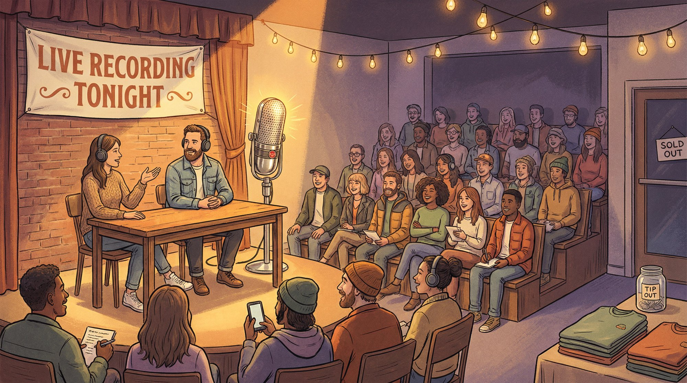

### Live Show Tours & Events

If you have a sizable and geographically concentrated following, you might be able to sell tickets to a live podcast show.

Comedy and entertainment podcasts pioneered this. Popular shows do tours where they perform episodes or special content live. Fans get to experience the show in person (and often meet the hosts via VIP tickets or post-show signings).

Even a smaller local event, like a live recording at a local theater or cafe, could draw your most loyal fans willing to pay **$10-$30** for an evening of podcast fun. The revenue comes from ticket sales (minus venue costs), and potentially merch sales at the event.

While not every podcast has the kind of following to fill a venue, those that do find this both lucrative and excellent for fan engagement.

### Workshops and Conferences

For educational or niche podcasts, doing paid workshops or speaking at industry events can be a monetization path.

For example, if you run a podcast about marketing, you could host a half-day virtual workshop teaching a specific skill, selling tickets/access to it. Or you might be invited to speak at conferences (some pay honorariums or travel at least).

A parenting podcast host might hold a live Q&A seminar for parents. Listeners who see you as an authority might pay to learn directly or interact in real time.

### Live Streaming and Virtual Gifts

Instead of physical events, some podcasters are using live **online** platforms like YouTube Live, Twitch, Instagram Live, or specialized apps to host live-streamed sessions.

These can be billed as virtual live shows or casual hangouts. Many platforms allow **monetization features like Super Chats, Stars, or virtual gifting**, where viewers can tip during the stream.

For instance, some podcast hosting platforms have live streaming features where listeners can send virtual gifts that convert into monetary rewards for the host. Twitch has subscriptions and Bits (tips), YouTube Live has Super Chat (paid highlighted messages).

If your audience is active on these platforms, a live episode or AMA stream can bring in donations in real time. It's also a way to make money **while creating content**. The live stream can often be recorded and released as an episode later (two birds with one stone).

### Speaking Gigs

A successful podcast can raise your profile to the point that you get paid to speak or moderate panels.

This is more indirect. The "money" might not come from the podcast itself but from opportunities the podcast created. Still, it's worth mentioning. Podcasters often become emcees, keynote speakers, or panelists at events related to their topic. Those can come with payment or at least free travel to networking events that open more doors.

### Building Community for Live Success

For any live or in-person endeavor, **building an engaged community is crucial**. You don't need Joe Rogan-level fame to have a great meetup or live show. You just need a core group of die-hard fans in a city.

Start small: maybe a free meetup at first to gauge interest, then a low-cost ticketed event, and build from there. Also, use your existing channels to promote it (podcast announcements, email newsletters, local social media groups).

Creators who have gone this route often say the **intangible benefits** are huge too. Meeting your listeners face-to-face can energize you and give you deeper insight into what they love about your content, which can feed back into making the podcast even better.

And engaged fans who meet you in person are even more likely to support you in other ways (merch, memberships, etc.) because they've formed a personal connection.

## What Are Podcast Licensing and Exclusive Content Deals?

This category is more rarefied, but it's the _holy grail_ for top-tier podcasts: **licensing your content or IP (intellectual property) for big money**.

As the podcast industry matures, we've seen a trend of popular podcasts getting snapped up for exclusive distribution deals or adapted into other media. Here's how podcasters can make money through licensing:

### Exclusive Distribution/License Deals

Some networks or platforms will pay to make a successful podcast exclusive to their channel.

For example, Spotify has signed major podcast deals, including [Joe Rogan's renewed $250M deal](https://variety.com/2024/digital/news/joe-rogan-renews-spotify-deal-not-exclusive-1235895424/) (which ended exclusivity in 2024) and the Alex Cooper Call Her Daddy deal (which [moved to SiriusXM in 2025](https://variety.com/2024/digital/news/alex-cooper-deal-siriusxm-call-her-daddy-exclusive-content-1236112140/) for $125M after her Spotify exclusivity ended). Major platforms continue to pursue exclusive or semi-exclusive distribution agreements with top creators.

Similarly, Amazon Music, SiriusXM, and other players have done deals with podcasts for early or exclusive rights. These deals are typically only offered to shows with huge listenership or a lot of buzz. We're talking top **0.1%** of podcasts. The payouts can be in the **millions**.

While an indie podcaster likely won't seek this out on their own, it's something that may come _to you_ if you hit the big time.

A related angle is **joining a podcast network**. Some podcasts license themselves to networks like Wondery, iHeart, or NPR, where the network then sells ads and handles monetization, giving the creators a cut or a set salary. This can sometimes guarantee income and resources (production help, cross-promotion) in exchange for some creative or financial control.

### Content Syndication and Licensing

Beyond audio, a podcast can be licensed for adaptation. There have been several cases of podcasts turning into TV shows, documentaries, or books.

If your podcast has a strong narrative or a unique concept, Hollywood might come knocking. For instance, the true crime podcast _Serial_ led to a TV series. A comedy podcast might get optioned for a sitcom concept. A fiction podcast might be bought to develop into a film script.

These deals can range from option agreements (a few thousand dollars for the right to shop the idea around) to full production deals (tens of thousands if it moves forward, plus potential royalties).

Again, this isn't common for most podcasters, but it's a potential upside of creating compelling IP. One important step if you think your content has this potential is to legally **protect your intellectual property** (trademarks, copyrights for scripts, etc.) and be careful when signing any contracts with networks or sponsors so you don't accidentally give away these rights.

### Licensing Back-Catalog to Subscription Services

Another model is some podcasts license their older episodes to subscription platforms.

For example, a show might keep its last **100 episodes** free but put the archives older than that behind a paywall via a deal with a service. Or a podcast might do a windowed approach: new episodes available free for 2 weeks, then become subscriber-only.

This is a form of licensing your content access in a timed way. Services like [Stitcher Premium](https://variety.com/2023/digital/news/stitcher-shutting-down-siriusxm-podcast-app-1235655994/) (which was discontinued in August 2023 after being consolidated into SiriusXM) historically offered this model. It's one way to **earn from your archives** if you have a deep catalog that people still want to hear.

### Opportunities Come After Success

These opportunities usually come **after you've built significant success** through the other methods. Think of it as the top of the pyramid of monetization.

The majority of podcasters won't have a Netflix series born from their show, but it's not impossible, and even mid-level shows might get smaller licensing deals that provide a nice bonus income.

If nothing else, it's good to be aware of this landscape. It might influence how you position your podcast brand. For instance, if you have a hunch that your podcast concept could expand to TV, you might run it a bit more like a scripted series and keep good documentation of your stories, etc.

And should lightning strike, and a content agent or network approaches you, you'll understand the basics of how podcasters get paid through licensing: typically an advance or lump sum, possibly with royalty participation, in exchange for certain rights to your content or brand.

## What Are the Emerging Podcast Monetization Trends?

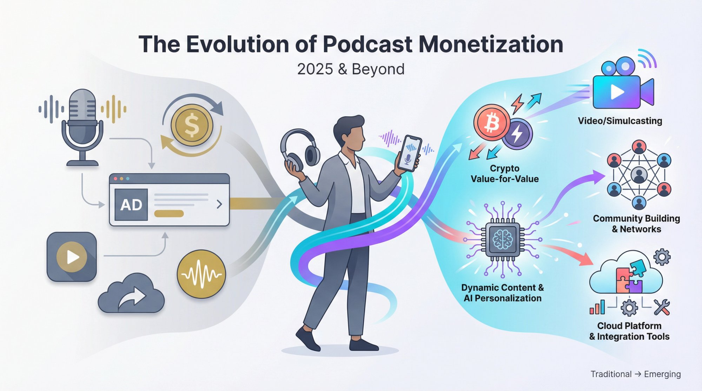

The podcast monetization space is continuously evolving. Here are a few **current trends in 2025** that could shape how podcasters make money moving forward:

### Video and Simulcasting

Podcasts are increasingly becoming a multimedia product.

As of 2025, as many as **41% of U.S. podcast listeners** prefer podcasts with video (so-called "watchable podcasts"). Many podcasters now record video of their studio sessions and release episodes on YouTube or Spotify Video.

This opens up **YouTube's monetization** (ad revenue on videos, which can be substantial if you get enough views). Some podcasters are essentially functioning like YouTubers. They get income from YouTube ads and sponsorships for the video version, while also releasing the audio via RSS.

If you're comfortable on camera, this is a trend worth noting. Also, having a video version helps with discoverability. YouTube is the largest podcast "platform" in terms of where people discover new shows and gives fans another way to engage.

Just be mindful that producing video can add to your workload.

### Community Building as Monetization Lever

More creators are focusing on building dedicated communities around their podcasts, be it on **Discord, Facebook Groups, Slack, or dedicated forums**.

While community itself isn't a direct revenue stream, it **indirectly boosts all monetization** because engagement and loyalty go up. Podcasters with strong communities find that those members are more likely to become paying supporters, attend live events, buy merch, etc.

In 2025, some podcast platforms even introduced in-app community features to help listeners connect with hosts and each other.

Consider cultivating a space for your fans to interact. It can be as simple as regularly interacting on social media or as structured as running a Discord server. When listeners feel like part of a club, they're more invested in your success (literally and figuratively).

> **Community insight:** "Audience loyalty is currency" in the creator economy. When listeners feel like part of a club, they're more invested in your success.

### MicroPayments and Value-for-Value

A niche but interesting development is the **Value for Value** model promoted by the Podcasting 2.0 movement (spearheaded by Adam Curry).

It allows listeners to stream cryptocurrency micropayments (like satoshis via Bitcoin's Lightning Network) to podcasters as they listen, often using podcast apps that support this feature. Listeners can also send "boosts" with messages and a payment attached.

This is mostly embraced by tech-savvy, independent shows as of 2025, but it's a novel twist on listener support, essentially tipping in real time. While not mainstream, it could grow if digital payments become more integrated into listening apps.

### Dynamic Content and Personalization

Beyond dynamic ads, there's exploration of dynamic content insertion.

For instance, inserting location-based messages (maybe promoting your upcoming live show to listeners in a particular city) or personalized calls-to-action (like a thank-you message that only non-members hear, encouraging them to join).

This isn't widespread yet, but as tech advances, podcasters might have more tools to tailor what each listener hears, potentially improving conversion rates for whatever you're selling.

### More Monetization Tools from Hosts

Podcast hosting companies and platforms continue to roll out creator monetization features to stay competitive.

We've touched on many (Apple/Spotify subs, programmatic ads, etc.). Expect hosting providers to make it ever easier to toggle on features like ads, donation buttons, and integration with membership platforms.

For example, some hosts are official partners with Apple Podcasts now, letting you publish Apple subscriber-only episodes right from your hosting dashboard.

Staying informed about your host's latest offerings can give you a head start in maximizing revenue without a ton of extra work.

## How to Build a Multi-Stream Podcast Monetization Strategy

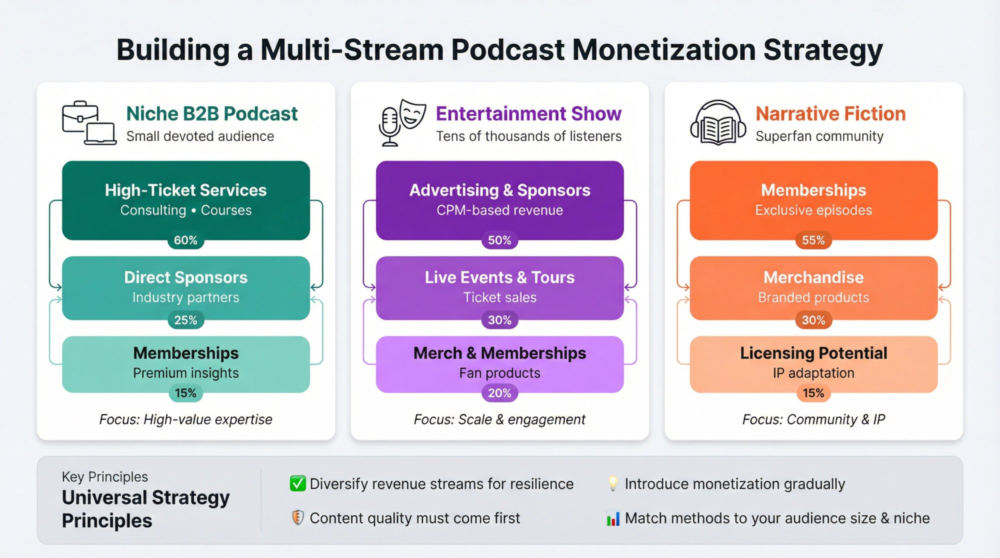

After reviewing these monetization methods, you might be thinking: which one should _I_ focus on?

**There's no single best way.** It depends on your content, audience, and goals. Most podcasters find a blend that works for them.

For example:

**A niche B2B podcast** might have small but devoted listenership, so they make money via a high-priced **online course or consulting**, rather than ads (which require scale).

**A comedy chat show** with tens of thousands of listeners might go heavily into **ads and live tour tickets**, and lighter on memberships.

**A narrative fiction podcast** might primarily rely on **memberships and merch** from superfans, and perhaps hope for a licensing deal down the road.

There's no rule that you must stick to one method. In fact, diversifying your income can make your podcast business more resilient and profitable.

If one source dips, others can cover. Just be careful not to overextend yourself or overwhelm your audience. It's wise to **introduce monetization gradually** and see how your listeners respond.

Maybe start with one sponsorship and one fan-support option. Later add merch, etc.

### The Stage of Your Podcast Matters

Also, keep in mind **the stage of your podcast**. In the very early days (few episodes in, tiny audience), it might be premature to expect any significant revenue.

Many new podcasters don't make a dime for a while, and that's okay. Focus on improving your content and growing your reach. As one podcasting expert noted, "build it and they will come": consistent high-quality episodes are the foundation, and monetization comes as a result.

> **Foundational wisdom:** "Build it and they will come" - consistent high-quality episodes are the foundation. Monetization comes as a result of creating something people want to hear.

You want monetization to **enhance your podcast, not derail it**. It's counterproductive to spend more time chasing dollars than creating the show people want to listen to.

When you do introduce monetization, try to do it in ways that make the show even better. For example, sponsor money lets you improve production quality, or membership funding enables bonus episodes for your biggest fans.

## Why Patron Is Built for Podcasters

If you're serious about building sustainable recurring revenue from your podcast, you need a membership platform that actually works for audio creators.

[**Patron**](https://www.patron.com/) was built specifically for sequential content creators, including podcasters. Here's what makes it different:

### 1% Fees vs. 10% Industry Standard

While [traditional membership platforms typically charge 10% of creator earnings for new creators](https://support.patreon.com/hc/en-us/articles/36426991446797-A-standard-platform-fee-for-new-creators-effective-after-August-4-2025) (plus payment processing fees), [**Patron charges just 1% for early adopters**](https://www.patron.com/).

**_Do the math:_** If you're earning **$1,000/month** from 100 supporters at **$10 each**, you're paying about **$100** in platform fees on traditional platforms (as of August 2025). On Patron? Just **$10**. That's **$90 more in your pocket every month**, or **$1,080 more per year**.

### Open Source and Creator Control

[Patron is fully open source](https://github.com/patroninc/patron), which means:

- You can see exactly how it works (no black box algorithms)
- You can [self-host if you want complete control](https://github.com/patroninc/patron)
- The community can contribute improvements
- You're not locked into a proprietary system

This matters for podcasters who want to build a sustainable business without being at the mercy of platform policy changes.

### Series Management and Release Scheduling

Unlike generic membership platforms, [Patron is built for **episodic content**](https://www.patron.com/). You can [organize your podcast into series](https://www.patron.com/blog/category/podcast/), [schedule releases](https://www.patron.com/), and manage access in a way that actually makes sense for audio creators.

Learn more about [how to earn from a podcast with early access strategies](https://www.patron.com/blog/post/how-to-monetize-a-podcast-with-early-access-not-ads/).

### Join the Early Adopter Program

[Patron is currently in early access](https://www.patron.com/), and we're offering **lifetime 1% fees** to creators who join now. As a podcaster, you already know the value of building from the ground up. Join us at [patron.com](https://www.patron.com/) and lock in the lowest fees in the industry.

## Success in Podcast Monetization = Listener Value + Creativity

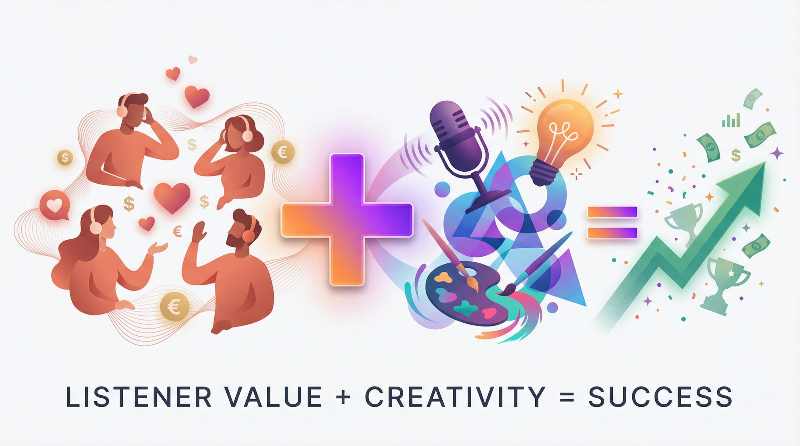

To wrap up, podcasters make money by **providing value**, either to advertisers (access to an engaged niche audience) or directly to listeners (extra content, products they love, etc.).

The more value you create, the more you can earn. Be creative and patient.

A podcaster in 2025 has a toolkit full of options that didn't exist a decade ago, so take advantage of them. Experiment with a few revenue streams, use your podcast's strengths to guide you, and most importantly, keep your listeners' experience front and center.

With the right mix of strategies, your podcast can not only pay for itself but become a significant income source. It's absolutely possible. Thousands of podcasters are doing it through the avenues we discussed.

Now that you know **how podcasters make money**, you can craft a [monetization game plan](https://www.patron.com/blog/category/monetization/) that fits your unique voice and community.

## Frequently Asked Questions

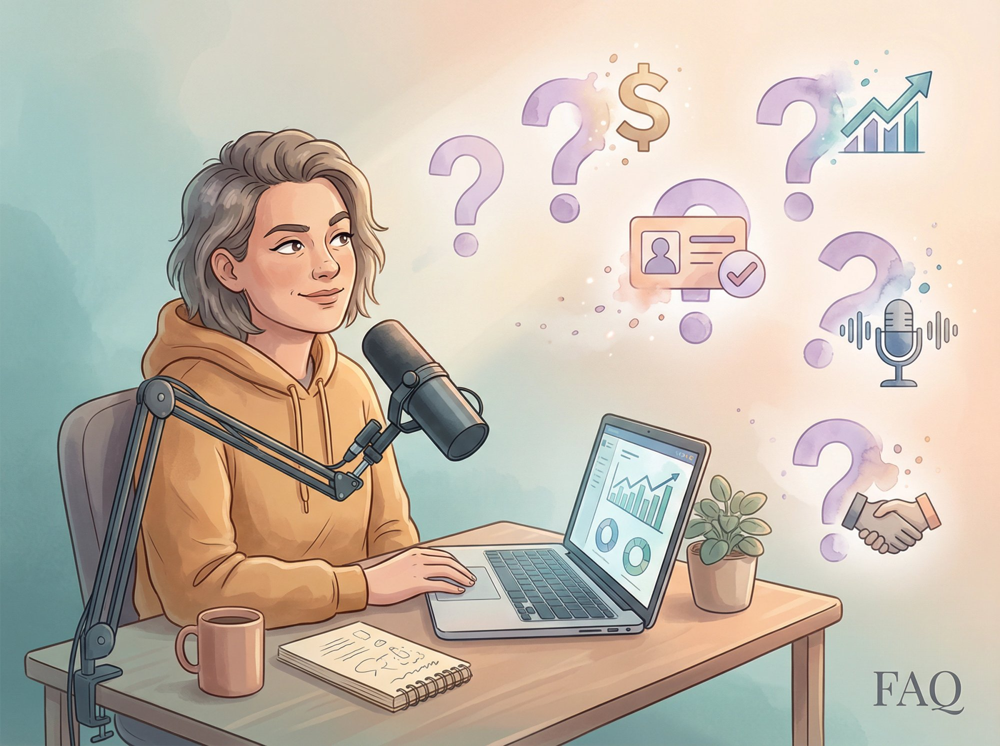

**How many downloads do I need to make money from my podcast?**

There's no magic number, but context matters. For advertising, most ad networks want at least **5,000-20,000 downloads per month**. You can start earning sooner with programmatic ads (even a few hundred downloads can generate a little income), direct sponsorships (if you have a highly targeted niche), or listener support through [memberships on platforms like Patron](https://www.patron.com/) (you only need a handful of passionate fans to cover your costs).

**What's the most profitable way to earn from a podcast?**

It depends on your audience size and niche. For larger shows, advertising often generates the most revenue. For smaller or highly engaged audiences, direct listener support through [membership platforms](https://www.patron.com/) typically provides better returns. Many successful podcasters use a combination: ads for broad revenue, memberships for predictable income, and products/services for high-ticket opportunities.

**When should I start earning from my podcast?**

Start when monetization enhances your show, not when it distracts from it. Wait until you have consistent content quality, a basic understanding of your audience, and enough episodes to demonstrate your value. For most podcasters, this means waiting at least a few months and having **10-20 episodes** under your belt before actively pursuing monetization.

**Do I need a big audience to offer paid memberships?**

No. You only need a small group of dedicated fans. Some podcasters successfully run memberships with just **20-50 paying supporters** using [platforms like Patron](https://www.patron.com/). The key is offering genuine value (bonus episodes, [early access](https://www.patron.com/blog/post/how-to-monetize-a-podcast-with-early-access-not-ads/), community access) and having strong engagement with your existing listeners. Quality beats quantity when it comes to direct fan support.

**How much do podcasters typically make from sponsors?**

It varies widely. At the industry standard CPM rates, a podcast with **10,000 downloads per episode** might earn **$200-$300 per episode** from a couple of mid-roll ads. Larger shows with **100,000+ downloads** can earn **$2,000-$3,000+** per episode. Smaller shows might start with direct sponsorships of **$100-$500** per month total. Niche shows often command higher CPM rates because they reach specific demographics advertisers want.

**Can I use multiple monetization methods at once?**

Absolutely, and you should. Most successful podcasters diversify their income. You might run ads for passive revenue, offer a [membership on Patron](https://www.patron.com/) for dedicated fans, sell merch for brand building, and promote an affiliate product you genuinely use. Just make sure you're not overwhelming your audience with constant sales pitches. Balance is key.

**What platform fees should I expect for membership platforms?**

It varies significantly. As of 2025, [traditional membership platforms typically charge 10% platform fees for new creators](https://support.patreon.com/hc/en-us/articles/36426991446797-A-standard-platform-fee-for-new-creators-effective-after-August-4-2025) plus payment processing fees (usually around **2.9% + $0.30** per transaction). Apple's in-app subscriptions take about **30%** in year one, dropping to **15%** after that. Newer platforms like [Patron offer much lower fees (1% for early adopters)](https://www.patron.com/blog/post/how-to-calculate-your-true-patreon-take-home-pay-2025/), which can significantly increase your take-home revenue.

**Is it better to offer free content or put everything behind a paywall?**

Always offer substantial free content. Your free episodes are your marketing. They build trust, showcase your expertise, and grow your audience. Reserve premium content (bonus episodes, [early access](https://www.patron.com/blog/post/how-to-monetize-a-podcast-with-early-access-not-ads/), extended cuts, Q&As) for paying supporters. The best strategy is a generous free tier that provides real value, with premium perks that superfans are happy to pay for.

**How long does it take to make meaningful money from podcasting?**

For most podcasters, expect **6-12 months** of consistent content creation before seeing significant revenue. Some creators hit monetization sooner if they already have an audience from another platform or fill a specific niche. Others take longer. Focus on creating quality content and building genuine relationships with listeners first. Monetization naturally follows a loyal, engaged audience.

**Do podcasters need to be on video now?**

Not necessarily, but it's becoming increasingly popular. As of 2025, about **41% of U.S. podcast listeners** prefer podcasts with video, and YouTube is a major discovery platform. If you're comfortable on camera, video can open up YouTube ad revenue and better discoverability. But audio-only podcasts can still be very successful. Choose the format that fits your content and comfort level.

## Sources and References

All data is current as of 2025 unless explicitly labeled as historical:

- Industry research and statistics from multiple podcast industry sources, 2025
- [Patron Blog - Podcast Monetization Category](https://www.patron.com/blog/category/podcast/)
- [How to Monetize a Podcast with Early Access](https://www.patron.com/blog/post/how-to-monetize-a-podcast-with-early-access-not-ads/)
- [Calculate Your True Creator Take-Home Pay](https://www.patron.com/blog/post/how-to-calculate-your-true-patreon-take-home-pay-2025/)
- [Switch from Patreon to Patron](https://www.patron.com/blog/post/switch-from-patreon-to-patron/)
- [Annual vs Monthly Memberships for Creators](https://www.patron.com/blog/post/annual-vs-monthly-memberships-for-creators/)
