If you're searching for how much WEBTOON Canvas creators make, you probably have one of these questions bouncing around your head:

1.  Is Canvas a realistic source of income, or is it purely side-hustle territory?
2.  How many views and subscribers do I actually need before money shows up in my account?
3.  If I already have a series, am I underpaid, or are the numbers just... this low?

This guide gives you financially literate answers to all three. We're using 2024-2025 data, not vibes from old blog posts that mention programs that no longer exist.

Here's what we'll cover: how money flows through WEBTOON at a systems level, the exact thresholds and splits for each monetization program, real creator earnings with actual dollar amounts, and how the creators earning serious income are actually doing it. Spoiler: it's rarely from WEBTOON's ad program alone.

---

## Do WEBTOON Canvas Creators Get Paid?

Before we get into Canvas specifics, you need to understand the broader picture.

WEBTOON has two distinct creator categories. Professional creators on Originals receive paid contracts, editorial support, and guaranteed income. Self-publishing creators on Canvas upload their own work, manage everything themselves, and hope for the best.

According to [WEBTOON's SEC filings covered by Fast Company](https://www.fastcompany.com/91142230/webtoon-files-for-ipo-creator-payments-public-s1-filing-what-to-know), professional creators earned an average of about **$48,000 per year** in 2023. Some 483 creators earned at least **$100,000 per year**. The top 100 averaged around **$1 million per year**. Between 2017 and 2023, WEBTOON paid creators more than **$2.8 billion** in total.

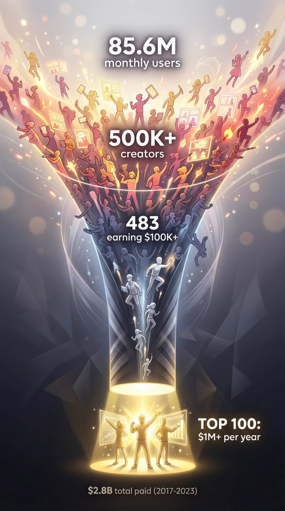

Those numbers sound incredible, but two crucial caveats apply. First, that data covers professional Originals creators, not the millions of Canvas hobbyists and independents. Second, the funnel is massive. WEBTOON had [85.6 million monthly active users as of March 2023](<https://en.wikipedia.org/wiki/Webtoon_(platform)>), with over 1 million content titles from 500,000+ creators. If you're on Canvas, you're part of that enormous funnel feeding into a tiny professional tier.

The bottom line is that understanding money on Canvas means ignoring the million-dollar headlines and looking at what self-publishers actually earn.

---

## How Do WEBTOON Canvas Creators Make Money?

As of late 2025, Canvas creators can earn directly on WEBTOON through three pathways: the Ad Revenue Sharing Program (viewer ads plus reward ads), Super Likes (paid tipping from readers), and Creator Rewards (historical only, now discontinued). Beyond these, creators can earn off-platform through memberships, print sales, and merchandise. That off-platform income is where most serious earnings actually come from. Understanding [how to monetize a webcomic](https://www.patron.com/blog/post/how-to-monetize-a-webcomic/) beyond platform-native tools is essential for any creator serious about income.

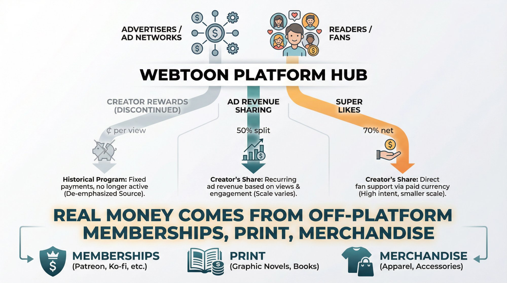

Let's break down each program.

---

### What Is WEBTOON Ad Revenue Sharing?

This is WEBTOON's main monetization program for Canvas creators.

#### Eligibility Requirements

To even turn on ads for your series, you need to hit both thresholds according to [WEBTOON's Ad Revenue Sharing documentation](https://help2.line.me/LINE_WEBTOON/ios/categoryId/20006014/3/pc?lang=en): 1,000+ total subscribers and 40,000+ global monthly pageviews (calculated from the previous month). Once you qualify and get approved, WEBTOON adds ads to your series and shares revenue with you.

#### The Revenue Split

From WEBTOON's official terms: you receive **50% of Net Ad Revenue** for ads shown on your approved series. "Net Ad Revenue" is what WEBTOON gets from advertisers minus operational costs and third-party fees.

So readers aren't paying you directly. Advertisers pay WEBTOON, WEBTOON keeps half of the net amount, and you receive the other half.

#### Payment Mechanics

Here's where it gets frustrating for smaller creators. Your ad revenue accumulates in your Ad Sharing dashboard, but you only receive payment once your balance hits $100 or more. Payouts process around the 15th of the following month via PayPal or other supported methods. If you never cross that $100 threshold, the money just sits there. And if your account gets restricted for any terms violation, WEBTOON can withhold your entire balance.

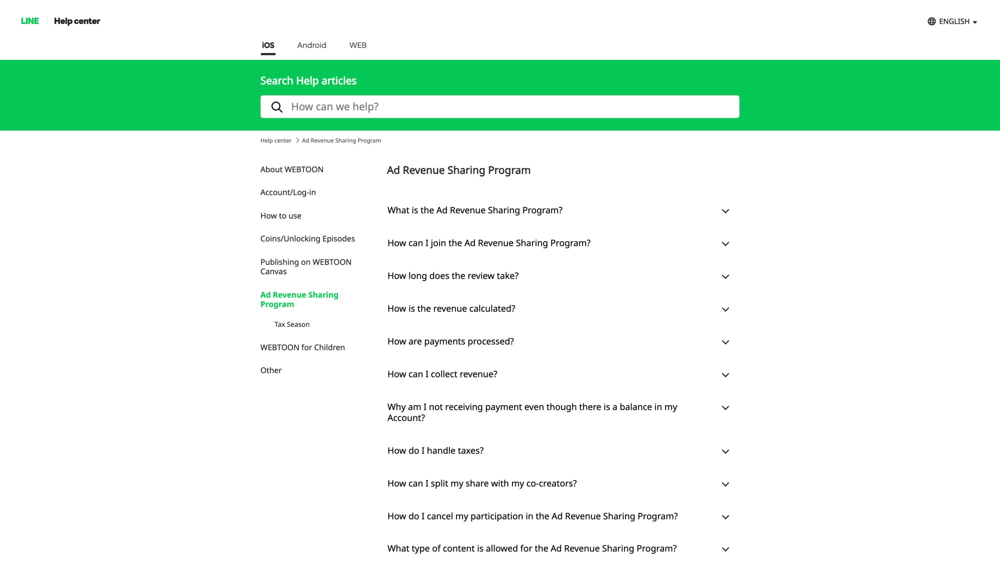

_WEBTOON's official documentation confirms the exact eligibility thresholds for Canvas creators to qualify for ad revenue sharing._

#### Viewer Ads vs. Reward Ads

The Ad Revenue program includes two ad types. Viewer Ads are standard display ads that appear around your episodes and generate the baseline revenue. Reward Ads are video ads that readers choose to watch to unlock episodes or earn bonuses. According to [historical creator reports from Taddy.org](https://taddy.org/blog/how-much-money-webtoon-artists-make), [Reward Ads rates vary based on advertiser spending and global market conditions](https://help2.line.me/LINE_WEBTOON/web/categoryId/20006014/3/pc?lang=en). Documented creator examples show approximately $0.50 per 1,000 pageviews from Reward Ads, though rates fluctuate. Regular viewer ads show historical ranges of approximately $0.28-0.61 per 1,000 pageviews, with WEBTOON explicitly stating that ad earnings depend on advertiser spending and market conditions.

WEBTOON has [updated Reward Ads eligibility and introduced an "UP" badge](https://m.webtoons.com/app/notice/detail?noticeNo=3234) to mark eligible episodes, but exact CPMs aren't publicly disclosed and fluctuate based on advertiser mix and reader geography.

---

### How Much Do Creators Make From WEBTOON Super Likes?

In 2024, WEBTOON rolled out [Super Likes](https://webtooncanvas.zendesk.com/hc/en-us/articles/26143852193044-What-is-the-Super-Like-program), a paid support feature for both Canvas and Originals.

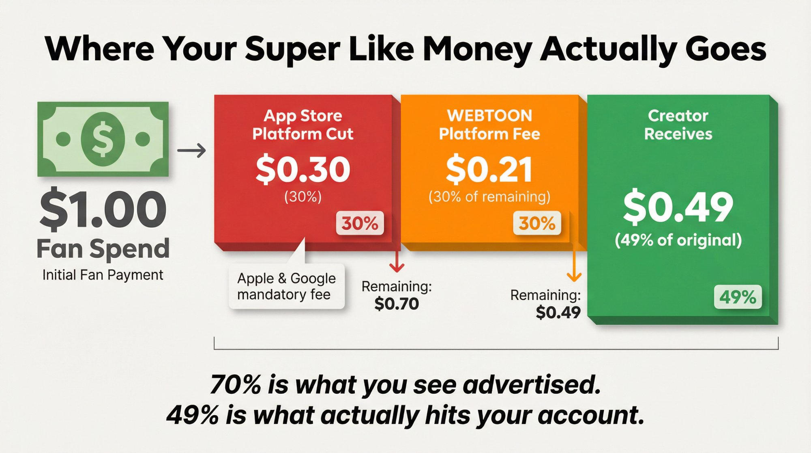

#### How It Works

Readers purchase Super Like packs inside the app (for example, [5 Super Likes for $1, up to 500 for $100](https://www.comicsbeat.com/super-like-or-super-dud-inside-webtoons-new-program/)), then assign those Super Likes to specific episodes of your series. WEBTOON aggregates the spending, deducts platform and app store fees, and shares what's left.

#### The Real Revenue Split (Not What It Looks Like)

[WEBTOON's Creators 101 page](https://www.webtoons.com/en/creators101/makemoney) states that creators receive "70% of net revenue" from Super Likes.

Sounds good, right? Here's the math that actually matters. When a reader spends $1 in the app, Apple or Google takes roughly $0.30 (their 30% app store cut), leaving about $0.70 as "net revenue." You get 70% of that $0.70, which is $0.49. WEBTOON keeps the remaining $0.21. So the creator's actual share of what the fan spent is roughly 49%, not 70%. [Multiple sources confirm](https://www.comicsbeat.com/webtoons-super-likes-breakdown/) creators receive approximately 49% of Super Likes revenue after all fees (app store + WEBTOON cuts), meaning combined fees represent roughly 51% of reader spending, commonly described as "about half" by creators.

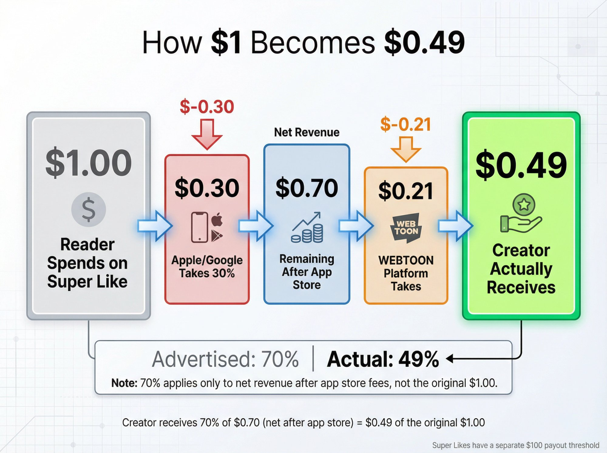

#### The Threshold Problem

Super Likes have their own separate **$100 payout threshold**, [independent from ad revenue](https://webtooncanvas.zendesk.com/hc/en-us/articles/26144041128084-How-are-Super-Like-payments-processed).

Many small Canvas series will never accumulate $100 in Super Likes. That means WEBTOON and the app stores keep 100% of what fans spent on those tips.

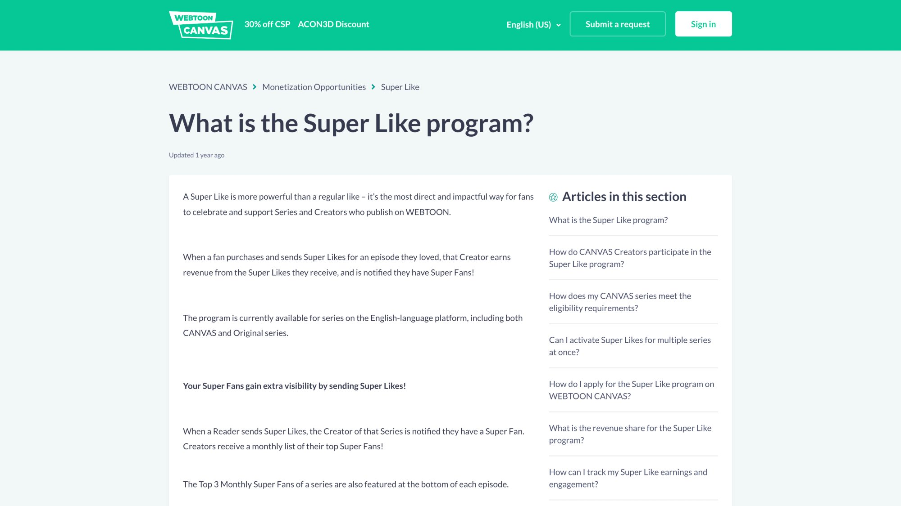

_WEBTOON's support documentation for the Super Likes program, confirming the 70% net revenue share and separate $100 payout threshold._

One Reddit creator summarized it bluntly: "Spending $1 on 5 Super Likes will be equivalent to giving the person $0.49, whereas other websites may only take 10% or nothing."

---

### What Happened to WEBTOON Creator Rewards?

The **Canvas Creator Rewards Program** used to be a significant part of the income conversation.

According to [WEBTOON official notices and creator resources](https://www.webtoons.com/en/notice/detail?noticeNo=2838), creators who crossed specific monthly pageview milestones (starting at 40,000) could earn flat bonuses between **$100 and $1,000** on top of their ad revenue. The bonus structure included $100 for 40k views, $300 for 200k, $800 for 600k, and $1,000 for 1.5M views.

During the pandemic, WEBTOON even ran [100% net ad revenue support for Canvas creators](https://m.webtoons.com/en/notice/detail?noticeNo=1519) for part of 2020-2021.

**The critical update:** WEBTOON [announced that Creator Rewards would end after January 2023 payouts](https://www.webtoons.com/en/notice/detail?noticeNo=2838), replaced by the Super Likes tipping system.

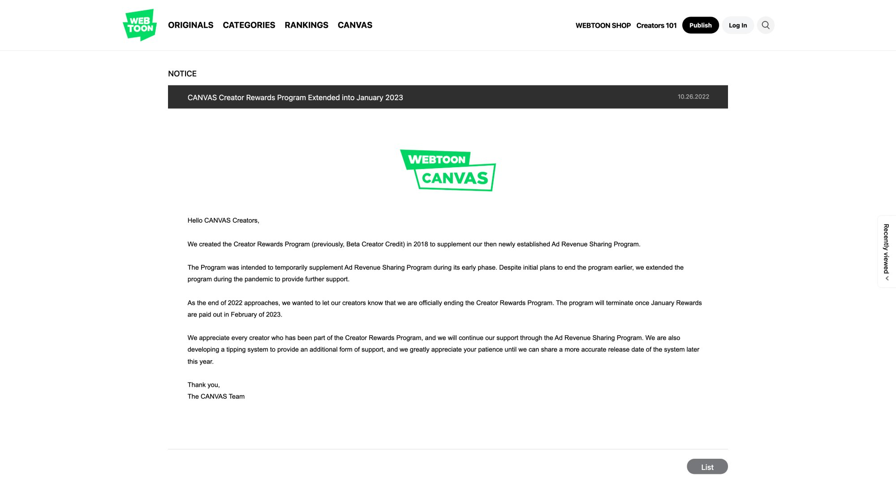

_WEBTOON's official announcement confirming the discontinuation of the Creator Rewards program, which offered $100-$1,000 monthly bonuses based on pageview milestones._

This matters because any income screenshots or blog posts from before February 2023 that look unusually good often include Creator Rewards bonuses that no longer exist. You should treat those as historical snapshots, not current benchmarks.

---

## Real WEBTOON Canvas Creator Earnings: Actual Numbers

Let's look at documented earnings from creators who've shared their stats publicly. Most of these examples come from 2020-2023, but they align with creator reports through 2025, especially once you account for the end of Creator Rewards.

### Creator Case Studies

| Creator                          | WEBTOON Stats                      | Time Period                | Total WEBTOON Income | Effective RPM       |
| -------------------------------- | ---------------------------------- | -------------------------- | -------------------- | ------------------- |
| Morishita (_S-Morishita Studio_) | ~500K views, 23K subs, 19 episodes | 2020-2021                  | **$80**              | $0.16/1K views      |
| TambriArt (_Fairy Lantern_)      | 2.2M views, 25K subs, 83 episodes  | 2021-2023                  | **$824**             | $0.37/1K views      |
| Anonymous Reddit creator         | ~1.3M views                        | Not specified              | **$145**             | $0.11/1K views      |
| Historical thread creator        | 40-50K monthly views               | 2020 (100% revenue period) | **$15-25/month**     | $0.38-0.50/1K views |

_Sources:_ [_Taddy.org creator earnings analysis_](https://taddy.org/blog/how-much-money-webtoon-artists-make)_,_ [_Reddit WebtoonCanvas discussion_](https://www.reddit.com/r/WebtoonCanvas/comments/1afwpbj/how_much_money_do_webtoon_creators_really_make/)_,_ [_Historical Reddit thread_](https://www.reddit.com/r/WebtoonCanvas/comments/jk65yk/to_big_canvas_creators_how_much_can_you_earn/)

---

### 500,000 Views = $80 in WEBTOON Ad Revenue

_Half a million views. Eighty dollars._

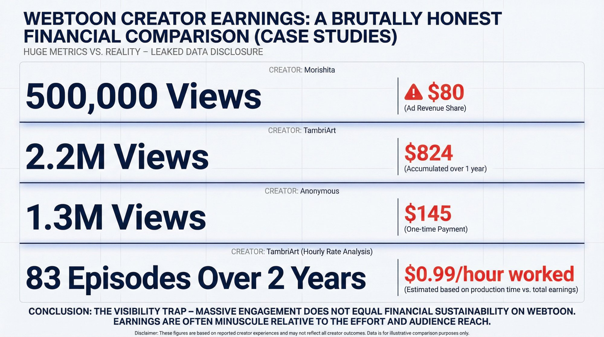

According to [Taddy's analysis](https://taddy.org/blog/how-much-money-webtoon-artists-make), Morishita's Canvas series accumulated roughly 500,000 pageviews and 23,000 subscribers across 19 episodes over about a year.

Total ad revenue earnings: **$80**.

Because WEBTOON requires $100 minimum for payout, Morishita hadn't even collected that $80 at the time of their video breakdown.

Let's calculate the effective RPM (revenue per thousand pageviews):

- 500,000 views / 1,000 = 500 units
- $80 / 500 = **$0.16 per 1,000 views**

That's well below what most new creators assume when they imagine "YouTube-style" ad money.

---

### 2.2 Million WEBTOON Views = $824 Total Earnings

TambriArt's _Fairy Lantern_ performed significantly better in raw numbers: 2.2 million pageviews, 25,000 subscribers, and 83 episodes over two years.

Total ad revenue: **$824**.

But here's where it gets interesting. Taddy's breakdown showed massive month-to-month fluctuation:

| Month      | Views   | Ad Revenue | RPM          |
| ---------- | ------- | ---------- | ------------ |
| May 2022   | 400,000 | $231       | **$0.58/1K** |
| April 2023 | 100,000 | $28        | **$0.28/1K** |

Same creator, same series, same platform. The "value" of each view nearly halved between those months. That volatility is _exactly_ why ad-only income creates so much uncertainty.

---

### YouTube Creator Breakdown: 2023 Comic Income

[One creator's YouTube breakdown of their 2023 comics income](https://www.youtube.com/watch?v=CU_cjoSor6k) showed roughly:

- **$500** from WEBTOON
- **$51** from another platform
- **$934** from membership platform income
- **~$1,935** total annual comic income

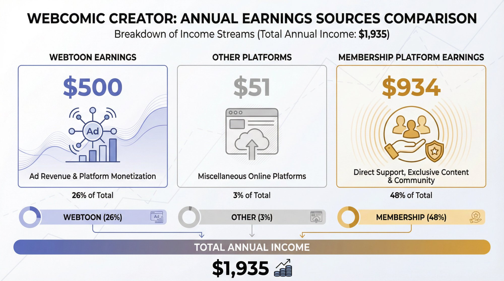

Even in this modest example, **membership income outperformed WEBTOON ad income by nearly 2x**. This pattern holds across [nearly every successful webcomic creator](https://www.patron.com/blog/category/webcomics/) we've analyzed.

---

## WEBTOON Canvas Income by View Count: What to Expect

Based on the case studies and creator reports above, here's what you can realistically expect at different stages. Note that off-platform revenue estimates vary significantly based on audience engagement, conversion strategies, and niche:

| Stage           | Monthly Views | WEBTOON Income (Ads + Super Likes)       | Off-Platform Potential                      |
| --------------- | ------------- | ---------------------------------------- | ------------------------------------------- |
| Just Starting   | 0-10K         | **$0**                                   | Tips if you link tip jar                    |
| Early Traction  | 10K-40K       | **$0** (below ad threshold)              | $50-200/mo possible with engaged audience   |
| Ad-Eligible     | 40K-100K      | **$10-30/month** (estimates vary)        | $100-500/mo with active conversion          |
| Growing Midlist | 100K-300K     | **$50-150/month** (upper-range estimate) | $500-2,000/mo at 0.5-1% conversion          |
| Breakout Canvas | 300K-1M+      | **$150-600/month** (favorable scenario)  | **$2,000-20,000+/month** with strong funnel |

The pattern holds all the way up: **ads are a bonus, not the engine**. Understanding [how to calculate your true take-home pay](https://www.patron.com/blog/post/how-to-calculate-your-true-creator-take-home-pay-2025/) from any platform helps you make smarter decisions about where to focus.

---

## Where Do Successful WEBTOON Creators Actually Make Money?

Here's what every successful WEBTOON creator knows but rarely gets discussed in "how much can I make?" threads:

The creators earning real money are doing it through memberships, books, and adaptations—not Canvas ad revenue.

[Analysis from Taddy.org](https://taddy.org/blog/how-much-money-webtoon-artists-make) found that almost all of the biggest WEBTOON Canvas creators have membership pages, earning anywhere from **$4,000 per month** (Idolomantises, _Monsters and Girls_) to around **$20,000 per month** (PastaFlavour, _Boy Girlfriend_).

### The Shiloh Example: Modest Views, Serious Income

Consider Red & Flynn's _Shiloh_:

| Platform                    | Metric      |
| --------------------------- | ----------- |
| WEBTOON views               | 172,976     |
| WEBTOON followers           | 3,676       |
| Membership platform members | 1,369       |
| Estimated monthly income    | **$6,000+** |

_Source:_ [_Taddy.org analysis_](https://taddy.org/blog/how-much-money-webtoon-artists-make)

Their WEBTOON stats are solid but not massive. Yet they earn more per month from memberships than TambriArt earned in _two years_ of WEBTOON ad revenue despite having 2.2 million views.

The difference is a functional conversion funnel.

---

### How Much Do Top WEBTOON Creators Make From Memberships?

| Creator                        | WEBTOON Presence              | Membership Subscribers | Estimated Monthly Income |
| ------------------------------ | ----------------------------- | ---------------------- | ------------------------ |
| Alice Oseman (_Heartstopper_)  | Originated as webcomic        | 18,000-25,000          | **$18,000-90,000/month** |
| PastaFlavour (_Boy Boyfriend_) | Hundreds of millions of views | Several thousand       | **Five figures/month**   |

_Sources:_ [_MK News coverage of webtoon creator earnings_](https://www.mk.co.kr/en/business/11061133)_,_ [_Patron's webcomic creator analysis_](https://www.patron.com/blog/post/best-platform-for-webtoon-creators/)

Alice Oseman's case is exceptional (Netflix adaptation, book deals, etc.). But it illustrates the pattern: the road from Canvas to a professional career exists, and the crucial step isn't "get better ads." It's **control your own direct revenue channel**.

---

## How Successful Creators Use WEBTOON and Memberships Together

[Our analysis of webcomic monetization](https://www.patron.com/blog/post/best-platform-for-webtoon-creators/) identified a clear pattern among creators earning consistent income:

Platform 1 is for discovery—WEBTOON, [Tapas](https://www.patron.com/blog/post/tapas-monetization-alternatives-for-creators/), or similar. Your archive lives here, readers find you here, and you build audience and habit here. Platform 2 is for monetization—a membership platform with [rolling paywalls](https://www.patron.com/blog/post/what-is-a-rolling-paywall/). Your super-fans pay here and you earn predictable income here.

### Why Rolling Paywalls Work for WEBTOON Creators

The most powerful monetization lever for serial creators is simple: people hate waiting for the next chapter.

Here's how [rolling paywalls](https://www.patron.com/blog/post/what-is-a-rolling-paywall/) work. New episodes appear first on your membership platform, available only to paying subscribers. [After a set delay](https://webtoon.zendesk.com/hc/en-us/articles/13727523223572-What-are-the-different-ways-to-unlock-paid-episodes) (typically 1-4 weeks for external membership platforms; WEBTOON Canvas' Ad Revenue Program uses a 7-day unlock window), those same episodes unlock for free on WEBTOON. Your series feels free to casual readers, but fans who can't stand waiting will pay to stay ahead.

This creates a beautiful flywheel. Readers binge your free archive on WEBTOON, hit a cliffhanger or catch up to your latest free episode, then subscribe to get more immediately. They _stay_ subscribed to avoid falling weeks behind again. Your archive becomes a discovery engine while your newest work generates predictable revenue.

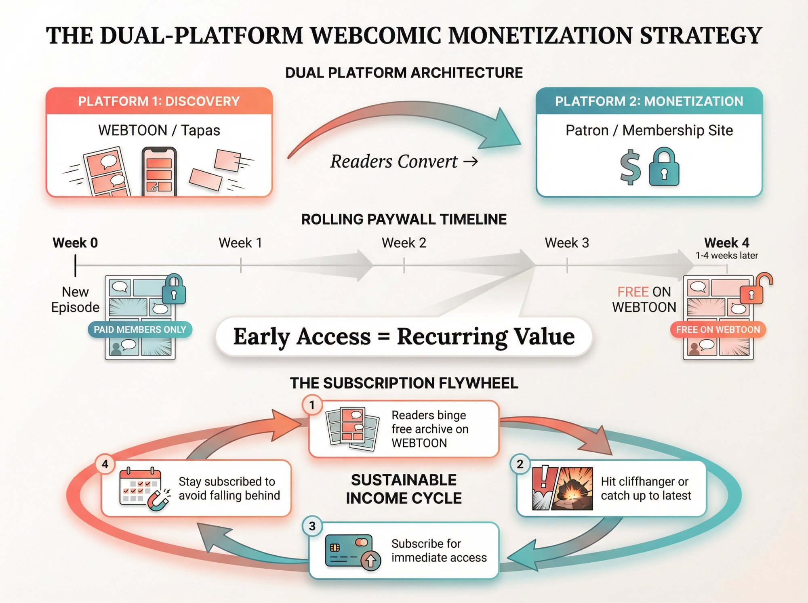

---

## Why We Built Patron for WEBTOON Creators

Most successful Canvas creators currently use membership platforms for their income. It works. But there are real pain points that we're solving.

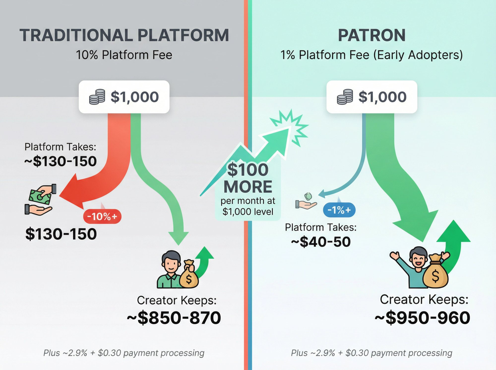

### The Fee Problem

Traditional platforms charge **10% of your earnings** for new creators (as of [August 2025](https://www.patron.com/blog/post/creator-platform-fee-changes-2025/)), plus payment processing (around 2.9% + $0.30 per transaction). That adds up to 13-15% of everything your supporters pay.

At [Patron](https://www.patron.com/), we charge **1% for early adopters**. On $1,000 in monthly membership revenue:

| Platform                 | Platform Fee | You Keep      |
| ------------------------ | ------------ | ------------- |
| Traditional 10% platform | ~$130-150    | ~$850-870     |
| **Patron (1%)**          | ~$40-50      | **~$950-960** |

That's roughly **$100 more per month** in your pocket at the $1,000 level. The gap grows as your audience does.

### Built for Sequential Content

Most membership platforms are built for all creators, from musicians to YouTubers to one-off digital products. They're generalist tools adapted for serialized content.

[Patron](https://www.patron.com/) is built specifically for sequential creators like [webcomic artists](https://www.patron.com/blog/category/webcomics/), [serialized fiction writers](https://www.patron.com/blog/category/writing/), and [podcasters](https://www.patron.com/blog/category/podcast/). [Rolling paywalls](https://www.patron.com/blog/post/what-is-a-rolling-paywall/) are a native feature rather than a workaround. Series and episode organization matches how you actually create. Release scheduling handles timed unlocks automatically. And the [open-source codebase](https://github.com/patroninc/patron) means you can verify how it works and even self-host if you want full control.

### The Practical Stack for 2025

If you're running a WEBTOON series and want to turn it into sustainable income, here's what a sensible setup looks like. For discovery, use WEBTOON Canvas (plus [Tapas](https://www.patron.com/blog/post/tapas-monetization-alternatives-for-creators/) or GlobalComix if you want to diversify). For monetization, set up a rolling-paywall membership on [Patron](https://www.patron.com/). For ownership, maintain your own email list and Discord for direct reader relationships. We've written detailed guides on [how to monetize a webcomic](https://www.patron.com/blog/post/how-to-monetize-a-webcomic/) and [how to price your webcomic tiers](https://www.patron.com/blog/post/how-to-price-your-webcomic-tiers/) that cover the tactical details.

---

## Mistakes That Keep WEBTOON Canvas Creators Earning Less

After analyzing dozens of creator earnings disclosures, a few patterns emerge among those who struggle to monetize effectively.

### Mistake 1: Confusing Followers With Paying Fans

A series can have tens of thousands of WEBTOON subscribers, millions of views, and still earn less than $200 per month from on-platform monetization.

At the same time, another creator with fewer than 200,000 WEBTOON views can pull in **$6,000+ per month** if they have a strong membership funnel with clear early-access value.

The question isn't "how many views do I have?" It's _"what percentage of my readers are paying me directly, and through what?"_

### Mistake 2: Ignoring the $100 Thresholds

WEBTOON has multiple layers of friction between "money generated" and "money received." Ad revenue only pays out at $100, Super Likes only pay out at $100 (separate from ads), and both thresholds must be crossed independently.

A large number of small Canvas creators generate revenue that's never actually paid out because it never passes $100 in either category. Those unpaid balances effectively subsidize the platform. Membership platforms have thresholds too, but they're typically much lower ($10-25), and there's no equivalent of "Super Like money sitting at $73 forever."

### Mistake 3: Chasing Ads Instead of Members

If you're trying to optimize your way to financial success through WEBTOON's ad program alone, consider TambriArt's math.

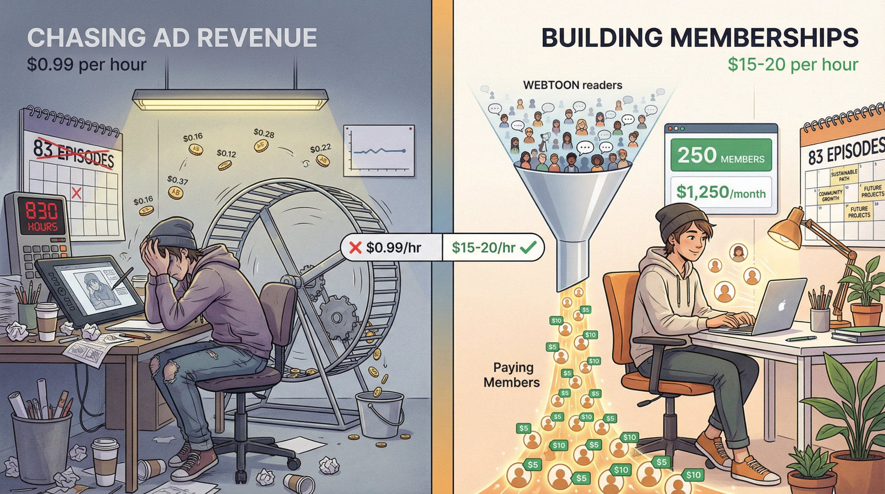

TambriArt produced 83 episodes over two years. Even at just 10 hours per episode (conservative for full-color webtoons), that's 830 hours of production for $824 total ad revenue—an effective rate of $0.99 per hour. For comparison, minimum wage in most developed countries is $10-15+ per hour.

Treating Canvas ad revenue as your primary business model is financially irrational unless you're already in the very top tier of views. A smarter approach is to treat Canvas as audience acquisition and memberships as income acquisition, while building direct relationships through email and Discord as insurance against platform changes.

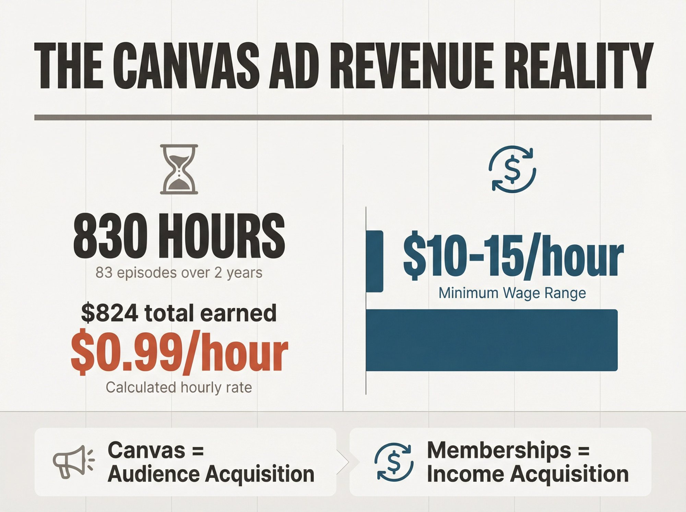

Understanding the [difference between annual vs monthly memberships](https://www.patron.com/blog/post/annual-vs-monthly-memberships-for-creators/) can also help you structure your tiers for maximum retention.

---

## How to Actually Make Money as a WEBTOON Creator

Based on everything above, here's a practical strategy:

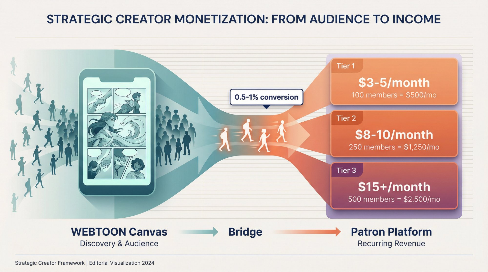

### Step 1: Use Canvas to Build a Bingeable Archive

Your goals on WEBTOON are to publish consistently in a clear genre, make the archive easy to binge from episode 1, optimize thumbnails, titles, and tags for discovery, and treat likes and comments as signals of engagement rather than income. You're building trust and reading habits here. The money comes elsewhere.

### Step 2: Launch a Membership With Rolling Paywalls

A structure that works for most [webcomic creators](https://www.patron.com/blog/category/webcomics/) includes a $3-5 tier offering 1-3 episodes ahead with access to members-only posts, a $8-10 tier offering 3-6 episodes ahead plus sketches and Q&A content, and a $15+ tier with high-touch perks like name credits, polls, and occasional commission discounts.

You don't need as many paying fans as you think. 100 members at $5/month equals $500/month. 250 members at $5/month equals $1,250/month. 500 members at $5/month equals $2,500/month. If 0.5% of 50,000 WEBTOON readers become paid members at $5, that's 250 subscribers and $1,250 per month before fees. For more specific guidance, check out our guide on [how to price your webcomic tiers](https://www.patron.com/blog/post/how-to-price-your-webcomic-tiers/).

### Step 3: Direct Fans Toward Efficient Support

When fans want to support you, they might buy Super Likes (you receive an estimated ~49 cents per dollar spent, though exact rates are not officially disclosed by WEBTOON) or join your external membership platform like Patron (you receive 85-95% of what they pay).

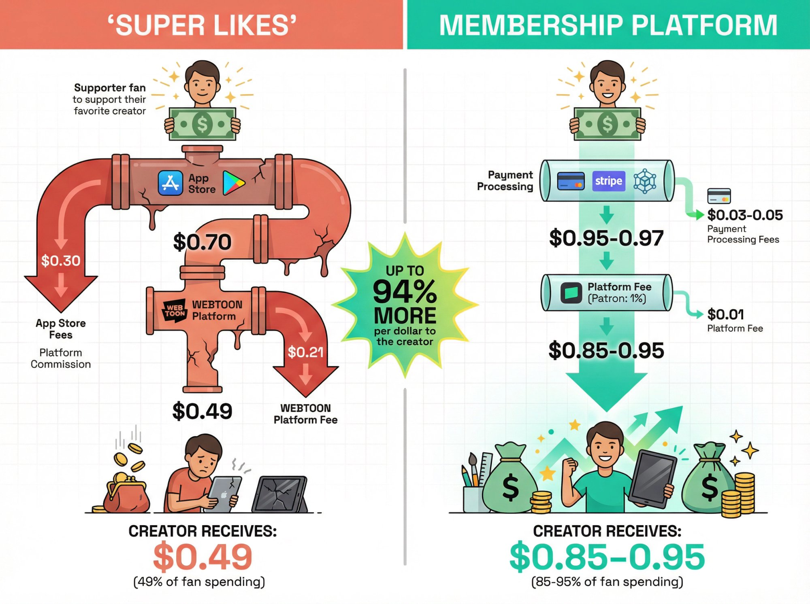

The math is clear. In your episode descriptions and social posts, put your membership link first, put tip jars second, and let Super Likes be optional rather than your primary call to action.

### Step 4: Use WEBTOON Income as a Signal, Not a Lifeline

If you're earning _anything_ from Canvas ads, it means you've crossed 40K monthly views and 1K subscribers. That's a genuine milestone.

If Super Likes are appearing at all, fans are willing to spend money on you through an inconvenient, inefficient system. That's your cue to **offer them a better way to support you**.

When Canvas income appears, treat it as:

_"Proof the funnel is working, not the actual funnel."_

---

## Frequently Asked Questions

### How many views do I need to start earning money on WEBTOON Canvas?

To qualify for WEBTOON's Ad Revenue Sharing Program, you need at least **1,000 total subscribers** and **40,000 global monthly pageviews**. Both requirements must be met, and the monthly views are calculated from the previous month. Once approved, you can earn from viewer ads and reward ads, but you'll only receive payment when your balance reaches $100.

### What's the average RPM (revenue per 1,000 views) on WEBTOON Canvas?

Based on documented creator reports, RPM typically ranges from **$0.10 to $0.60 per 1,000 pageviews**. The most common range falls between $0.20 and $0.40. Reward Ads generate higher RPM (around $1 per 1,000 views historically) but require user opt-in. These rates fluctuate significantly based on advertiser demand and reader geography.

### Do WEBTOON Canvas creators get paid for Super Likes?

Yes, but the effective payout is lower than advertised. While WEBTOON states creators receive 70% of "net revenue," that's calculated _after_ Apple/Google's 30% app store cut. In practice, you receive roughly **49 cents per dollar** a fan spends. Super Likes also have a separate $100 minimum payout threshold.

### What happened to the Creator Rewards program?

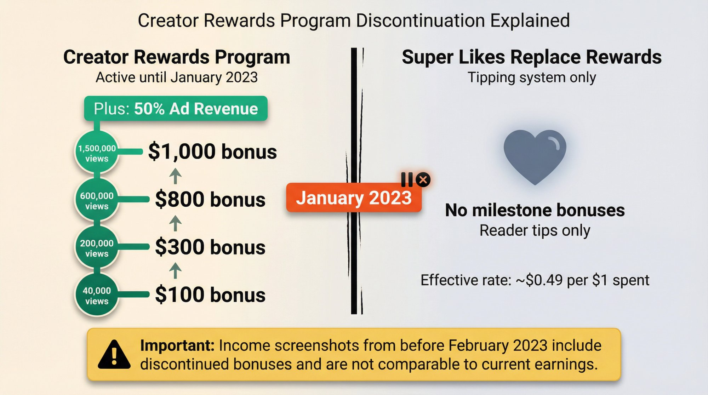

WEBTOON's Creator Rewards program ended after January 2023. It used to offer $100-$1,000 monthly bonuses based on pageview milestones. Any income screenshots or blog posts from before February 2023 that show surprisingly high earnings likely include these discontinued bonuses.

### Can you make a living from WEBTOON Canvas alone?

Realistically, no. Even creators with 1+ million monthly views typically earn only $400-600 per month from WEBTOON's built-in monetization. The creators earning sustainable income use WEBTOON for discovery and audience-building, then convert a percentage of readers into paying members on a separate platform. This two-platform strategy is [essential for webcomic monetization](https://www.patron.com/blog/post/how-to-monetize-a-webcomic/).

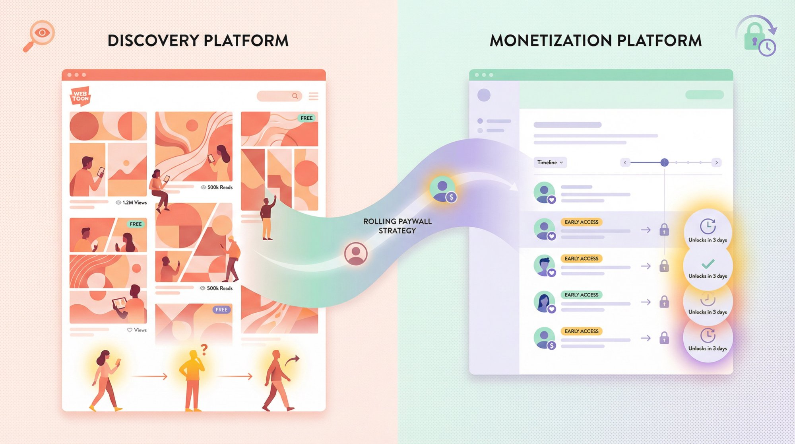

### How much do WEBTOON Originals creators make?

According to WEBTOON's SEC filings, professional Originals creators averaged about **$48,000 per year** in 2023. Some 483 creators earned at least **$100,000 per year**, and the top 100 averaged around **$1 million per year**. These are contracted positions with editorial support, very different from self-publishing on Canvas.

### What's the best membership platform for WEBTOON creators?

The best platform depends on your priorities. Traditional options charge around 10% in platform fees for new creators. [Patron](https://www.patron.com/) offers 1% fees for early adopters and is built specifically for sequential content with native [rolling paywall](https://www.patron.com/blog/post/what-is-a-rolling-paywall/) support. We've written a [detailed comparison of platforms for WEBTOON creators](https://www.patron.com/blog/post/best-platform-for-webtoon-creators/) if you want to dig deeper.

### How do rolling paywalls work for webcomics?

[Rolling paywalls](https://www.patron.com/blog/post/what-is-a-rolling-paywall/) give paying members early access to new episodes, then automatically unlock those same episodes for free readers after a set delay. External membership platforms typically use 1-4 week delays, while WEBTOON Canvas' Ad Revenue Program uses a 7-day unlock window. This lets you maintain a free archive for discovery while earning from super-fans who don't want to wait. Your archive grows over time, attracting new readers, while fresh content stays gated for paying supporters.

### Is it worth putting Super Likes or membership links in episode descriptions?

Both have value, but external membership platform links (like Patron) generate significantly more creator income than Super Likes. Super Likes give you an estimated 49 cents per dollar spent (exact rates not officially disclosed), while external membership platforms typically leave you with 85-95% after fees. Prioritize your membership link as the primary call to action.

### How many paying members do I need to make meaningful income?

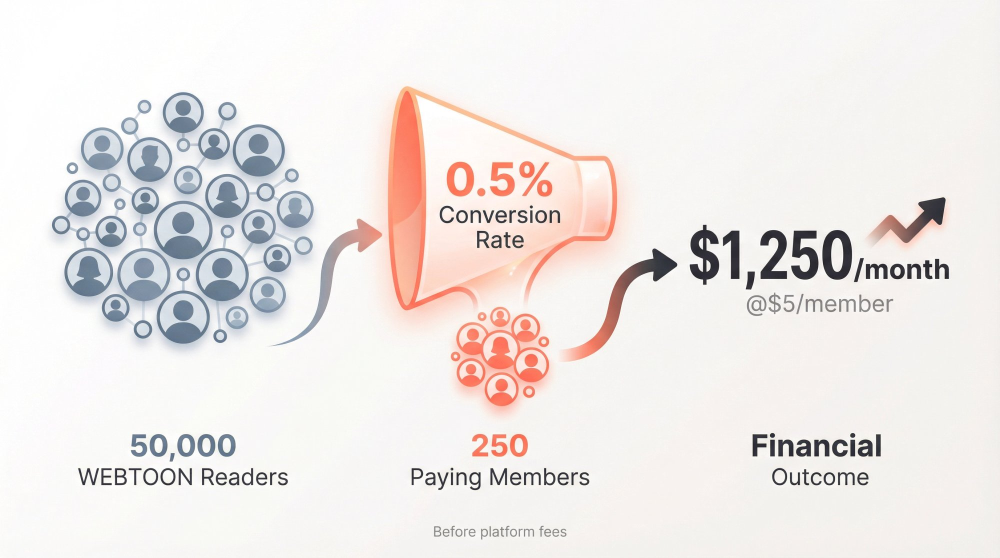

Fewer than you might expect. If 0.5% of your WEBTOON readers become paying members at an average of $5/month, 50,000 readers would yield 250 members and $1,250/month before platform fees. A well-designed membership with compelling early-access perks can convert at 0.5-1% of an engaged audience. Learning [how to price your webcomic tiers](https://www.patron.com/blog/post/how-to-price-your-webcomic-tiers/) effectively makes a significant difference in conversion rates.

---

## The Bottom Line on WEBTOON Canvas Earnings

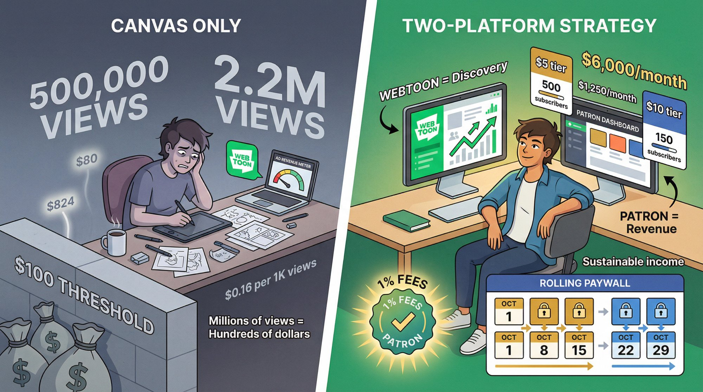

Let's compress everything into what you actually need to remember.

Most Canvas creators earn $0 directly from WEBTOON. Those who qualify for ads typically earn tens of dollars per month. Even series with millions of views rarely break a few hundred dollars monthly from ads and Super Likes combined.

The creators earning real money use a two-platform strategy: WEBTOON for discovery, memberships for revenue. The pattern holds from hobbyist to professional levels.

The fee structure matters more than you think. A platform charging 10% versus 1% means an extra $90 per $1,000 in your pocket. Over a year of consistent memberships, that adds up to significant money.

If you're ready to turn your WEBTOON audience into sustainable income, [Patron is built for exactly this](https://www.patron.com/). [Rolling paywalls](https://www.patron.com/blog/post/what-is-a-rolling-paywall/), series-native organization, 1% early-adopter fees, and [open-source infrastructure](https://github.com/patroninc/patron) you can trust.

_Canvas proves you have an audience. It's time to get paid what that audience is worth._
