The creator economy isn't just big anymore. It's massive.

We're talking about a **$100+ billion industry** with **207 million people worldwide** creating content, and about **45 million doing it full-time**. These aren't just hobbyists posting random videos. Many of them are building real businesses around their passion.

If you've ever thought about becoming a content creator, you're in the right place. This guide walks through exactly how to start, grow an audience, and [turn your content into income](https://www.patron.com/blog/category/monetization/). No fluff, no generic advice you could find anywhere. Just practical steps that works.

## What Is a Content Creator?

A content creator is someone who produces digital content that informs, entertains, or educates an audience. That could mean YouTube videos and live streams, blog articles and newsletters, [podcasts and audio content](https://www.patron.com/blog/category/podcast/), social media posts and reels, [webcomics](https://www.patron.com/blog/category/webcomics/) and [serialized fiction](https://www.patron.com/blog/category/web-serial/), photography and design work, or educational courses and tutorials.

The format doesn't matter as much as the value you provide. If you're sharing something useful or entertaining online and building an audience around it, you're a content creator.

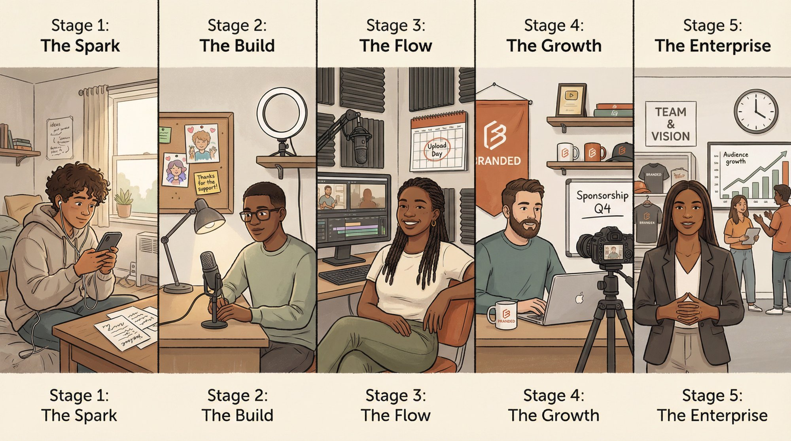

_Why start now?_ Because the barriers have never been lower. You don't need expensive equipment or a production team. You need a phone, an internet connection, and something worth sharing. Plus, the creator economy continues to grow exponentially, with new tools and [monetization options](https://www.patron.com/blog/category/monetization/) emerging regularly.

But let's be honest about the reality. Most beginners don't make money right away. [**59% of new creators haven't monetized yet**](https://www.creatorspotlight.com/p/monetization-report-2025), and [**96.5% of YouTube channels don't earn enough to hit the poverty line**](https://www.fastcompany.com/40537244/96-5-of-youtube-creators-dont-make-above-the-u-s-poverty-line) from ads alone. That's not meant to discourage you. It's meant to set realistic expectations. Success takes time, strategy, and consistency. But it's absolutely possible. Nearly [**47% of creators now do it full-time**](https://www.spiralytics.com/blog/content-creator-statistics-2025/), and while the income distribution among full-time creators varies significantly, full-timers earn more on average ($90,000-$179,000) compared to part-timers ($36,000), though over half of all creators still earn under $15,000 annually.

> **The creator economy reality:** Most beginners start slow, but nearly half of all creators eventually build full-time careers. Success requires time, strategy, and consistency, not overnight virality.

## What Are the Different Types of Content Creators?

Before you start, understand where you might fit in this landscape.

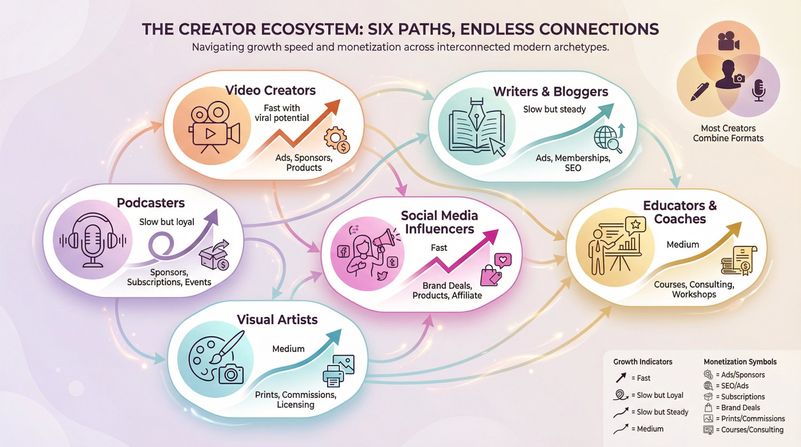

**Video creators** make everything from short TikToks to full YouTube documentaries. They're vloggers, reviewers, educators, and entertainers. Video demands more production work but offers high engagement.

**Writers and bloggers** create articles, newsletters, and serialized fiction. This includes [webcomic artists](https://www.patron.com/blog/category/webcomics/) publishing episodic stories online. Writing is lower barrier to entry and can rank on search engines for years.

**Podcasters** produce audio shows covering interviews, storytelling, education, or commentary. Growth is slower but audiences tend to be incredibly loyal. [Learn how to monetize podcasts without ads](https://www.patron.com/blog/post/how-to-monetize-a-podcast-with-early-access-not-ads/).

**Social media influencers** build followings on [Instagram](https://www.patron.com/blog/category/instagram/), TikTok, Twitter, or LinkedIn. They create a mix of photos, videos, and posts, often partnering with brands.

**Visual artists** share photography, design work, or digital art. They might sell prints, templates, or simply build a portfolio that attracts clients.

**Educators and coaches** teach specific skills through tutorials, courses, or coaching sessions. Their content's primary value is helping people learn or improve.

| **Creator Type** | **Best For**                      | **Growth Speed**          | **Monetization**            |
| ---------------- | --------------------------------- | ------------------------- | --------------------------- |
| **Video**        | Visual storytelling, tutorials    | Fast with viral potential | Ads, sponsors, products     |
| **Writing**      | In-depth analysis, SEO            | Slow but steady           | Ads, memberships, books     |
| **Podcasting**   | Conversations, audio storytelling | Slow but loyal            | Sponsors, memberships       |
| **Social Media** | Quick content, brand partnerships | Fast                      | Brand deals, products       |
| **Visual Arts**  | Design, photography portfolios    | Medium                    | Prints, clients, licensing  |
| **Education**    | Teaching specific skills          | Medium                    | Courses, coaching, products |

Most successful creators don't stick to just one category. A blogger might also run a YouTube channel. A podcaster might share clips on TikTok. You can (and probably should) combine formats eventually. But when you're starting? Pick one and do it well.

## How to Choose Your Content Niche

Every content creator who builds something meaningful starts with clarity about two things: what they'll create about, and who they're creating it for.

### How to Find Your Content Niche

Your niche is the specific topic you'll focus on. Not "fitness" but "15-minute bodyweight workouts for parents." Not "cooking" but "weeknight dinners under $5 per serving."

The sweet spot is where three things overlap. First, **something you actually care about**. You'll be creating content about this for months or years. If you don't genuinely enjoy it, you'll burn out fast. Second, **something you know enough about (or want to learn)**. You don't need to be the world's expert, but you need enough knowledge to provide real value. Third, **something people actually want**. Use tools like [Google Trends](https://trends.google.com/trends/), Reddit, or even YouTube's search bar to see what questions people are asking in your potential niche.

_Don't go too broad._ "Tech reviews" puts you against massive channels. "Budget Android phones for students" gives you a specific audience with specific needs.

### Who Is Your Target Audience?

Who will actually watch, read, or listen to your content?

Get specific. Age range, interests, challenges, goals. The more clearly you can picture your ideal audience member, the easier it becomes to create content that resonates.

Browse forums, subreddit discussions, YouTube comments in your niche. What questions keep coming up? What problems do people struggle with? Collect the exact phrases your audience uses. Your first pieces of content should echo those words back to them.

This specificity is what makes you findable. Platform algorithms work better when they can categorize your content clearly. And potential followers know immediately whether you're for them or not.

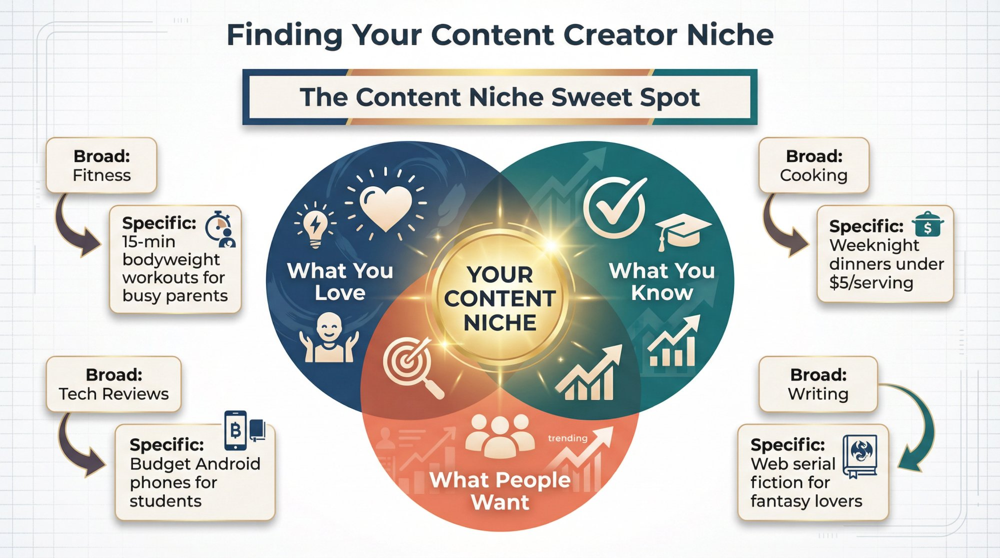

## Which Content Platform Should You Start On?

You can't be everywhere at once when you're starting. Choose **one main platform** where you'll consistently publish, and maybe one secondary channel for depth or discovery.

Here's what works for different content types in 2025:

| Platform                | Best For                                      | Key Benefit                                    |
| ----------------------- | --------------------------------------------- | ---------------------------------------------- |
| **YouTube**             | Long-form video, tutorials, evergreen content | Videos can gain views for years through search |
| **TikTok/Reels/Shorts** | Short viral videos, quick tips                | Fastest way to get discovered by new audiences |
| **Instagram**           | Visual content, lifestyle, behind-the-scenes  | Strong engagement and influencer partnerships  |
| **Blogging**            | In-depth written content, SEO                 | Ranks on Google, provides value for years      |
| **Podcasting**          | Audio conversations, storytelling             | Deep connection with highly loyal listeners    |
| **Twitter/X**           | Real-time thoughts, commentary, threads       | Authority building in specific industries      |

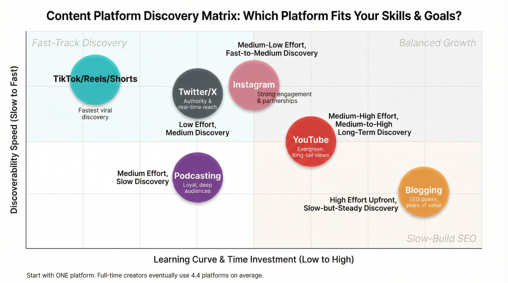

For **sequential content creators** ([webcomics](https://www.patron.com/blog/post/how-to-monetize-a-webcomic/), [serialized fiction](https://www.patron.com/blog/post/how-to-start-a-web-serial/), episodic podcasts), you'll want a platform that handles series well. [Patron](https://www.patron.com/) is specifically built for this, with advanced series management and release scheduling features.

Pick based on two factors. First, **what format matches your skills?** If you hate being on camera, YouTube might not be your first choice. If you love writing, a blog makes sense. Second, **where does your audience hang out?** If you're targeting Gen Z, TikTok and Instagram matter more than LinkedIn.

You can expand to multiple platforms later. In fact, [**full-time creators use an average of 4.4 content types or platforms**](https://www.uscreen.tv/blog/creator-economy-statistics/). But at the start, focus your energy on doing one thing really well.

## What Skills and Tools Do Content Creators Need?

Nobody starts as an expert. Your first videos will be rough. Your first blog posts will feel awkward. That's completely normal.

_The only way to get better is to create a lot of content._ So start with the basics and improve as you go.

### What Skills Do Content Creators Need to Learn?

Depending on your format, you'll need to learn **clear writing** (explanations, stories, good structure), **video production** (basic filming, lighting, editing), **audio editing** (clean sound, removing background noise), **speaking** (clear delivery, natural pacing), and **design** (simple graphics, thumbnails, visual layouts).

You don't need to master everything at once. Pick the 2-3 skills most essential to your content type and focus there. Take free tutorials, study creators you admire, and most importantly, **practice constantly**. Each piece you create teaches you something.

### What Equipment Do Content Creators Need?

You don't need thousands of dollars in equipment. Many successful creators started with just a smartphone and free software.

**For planning:** Google Docs or Notion for scripts and ideas, Google Trends or AnswerThePublic for topic research, and YouTube search bar for seeing what's trending.

**For creation:** Your phone camera with natural light and CapCut or iMovie for editing (video). A basic USB microphone ($50-100) with Audacity or Descript for editing (audio). Canva for thumbnails and graphics (design). Just a text editor and focus (writing).

> _"You don't need a 4K camera. Clean audio, bright lighting, and a clear point will beat fancy equipment most days."_

**What to invest in first:** Better audio makes a bigger difference than better video quality. If you're filming anything, get a cheap clip-on microphone. And good lighting (even a ring light) matters more than an expensive camera.

Upgrade gradually as you earn money from your content. Your first priority is developing skills and building consistency, not buying gear.

### Should Content Creators Use AI Tools?

AI tools in 2025 can help with brainstorming titles, outlining scripts, or removing filler words from audio. But here's the critical part: **use AI as a junior assistant, not a replacement for your creativity**.

AI-generated content floods the internet now. What sets creators apart is authentic human voice, original ideas, and genuine personality. Tools like ChatGPT can help you draft an outline. But the actual content? That needs to be _you_.

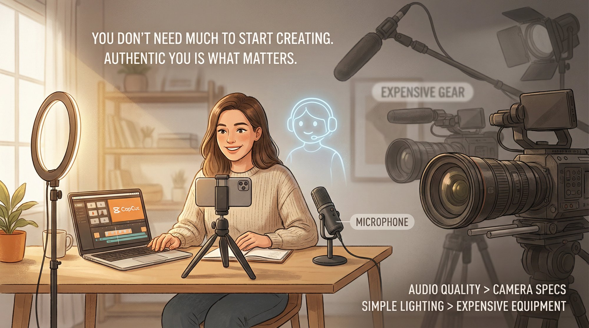

## How to Build Your Personal Brand as a Creator

Your personal brand is what makes you memorable. It's your personality, your style, and the unique perspective you bring to your niche.

**Choose a name and stick with it.** Use the same name (or handle) across all platforms so people can find you easily. Make sure it fits your niche and the vibe you want to project.

**Decide on your persona.** Are you the helpful expert? The funny friend? The no-nonsense straight shooter? This doesn't mean being fake. It means amplifying the real parts of your personality that connect with your audience.

**Create visual consistency.** Pick 2-3 colors and fonts you'll use repeatedly in graphics, thumbnails, and any visual content. This makes your content instantly recognizable. You don't need a designer. Just be intentional about your choices.

**Define your tone.** How do you speak or write? Casual and conversational? Polished and professional? Sarcastic and funny? Whatever feels natural to you, be consistent with it.

**Share your story.** Why are you creating this content? What's your mission? Letting your audience know your "why" builds trust and connection. You don't need a dramatic backstory. Just be honest about what drives you.

> **Authenticity is your competitive advantage.** In 2025, with so much polished, generic content flooding platforms, being genuinely yourself stands out more than perfect production quality.

Most importantly: _be authentic_. Your brand should amplify who you really are, not pretend to be someone you think people want. Audiences in 2025 crave authenticity. With so much polished, generic content out there, being genuinely yourself is a competitive advantage.

## How to Start Creating Content (And Keep Improving)

Time to actually make something.

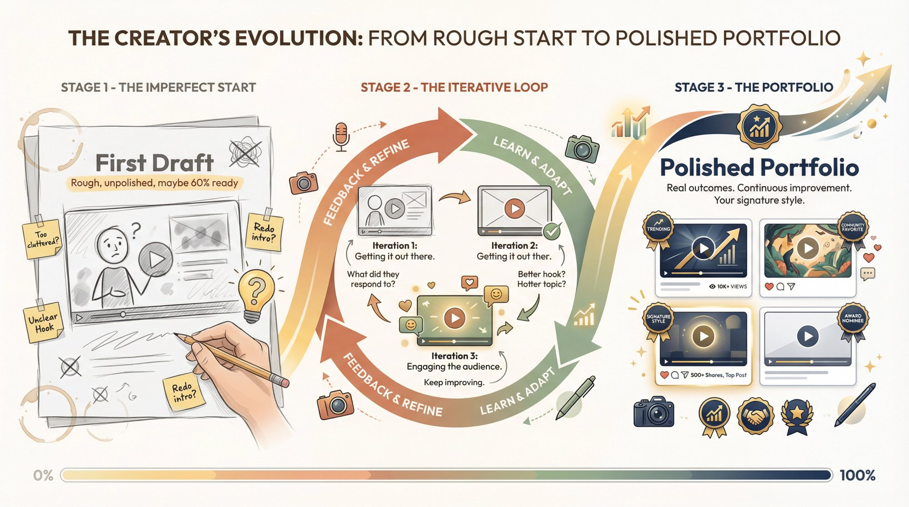

### How Do You Start Creating Content?

Don't wait for perfect. Your first blog post doesn't need to be a masterpiece. Your first video doesn't need cinematic quality. Just publish something.

Most successful creators' early work is rough. The only way to reach your 100th excellent piece is to create your first mediocre one. So launch into it. Write that article. Film that intro. Record that episode.

Start small if that helps. A 2-minute video instead of 20 minutes. A 500-word blog post instead of a full guide. You'll improve with each attempt.

### Should Content Creators Focus on Quality or Quantity?

A common beginner mistake is pumping out tons of low-quality content. Instead, aim for _quality over quantity_ with your initial pieces.

It's fine to post one really well-thought-out video this week rather than seven rushed ones. Each piece should offer something genuinely useful or entertaining to your target audience.

Before publishing, ask yourself: _"If I were my own audience, would I genuinely enjoy or benefit from this?"_

Early on, making a strong impression on a few viewers beats flooding the internet with forgettable content.

### How Do You Stand Out as a Content Creator?

There might be thousands of creators in your niche. What sets you apart is **you**. Your experiences, your humor, your way of explaining things.

Don't be afraid to add personal touches. Maybe your tech tutorials incorporate your love of history with fun historical analogies. Or your cooking videos show your kitchen bloopers and don't pretend everything's perfect.

These personal elements make your content memorable.

### How Do You Build Your Content Creator Portfolio?

Think of your body of content as a portfolio. Even if you're not looking for clients or jobs, this mindset pushes you to make each piece something you're proud of.

Track what works. If a blog post gets 10,000 views, note why. If a video has unusually high retention, figure out what you did differently. Portfolios showing real outcomes are far more persuasive than just claiming skills.

### How Do You Learn from Every Piece of Content?

After publishing, review performance. Not obsessively, but thoughtfully. What did people respond to? What comments did you get? Check basic analytics.

Don't worry if your third video only gets 50 views. Ask why and use that insight for video four. **Every piece is a chance to improve the next one.**

The biggest hurdle now is consistency, which we'll tackle next.

## How to Grow Your Audience as a Content Creator

Creating good content is half the battle. The other half is getting people to see it and stick around for more.

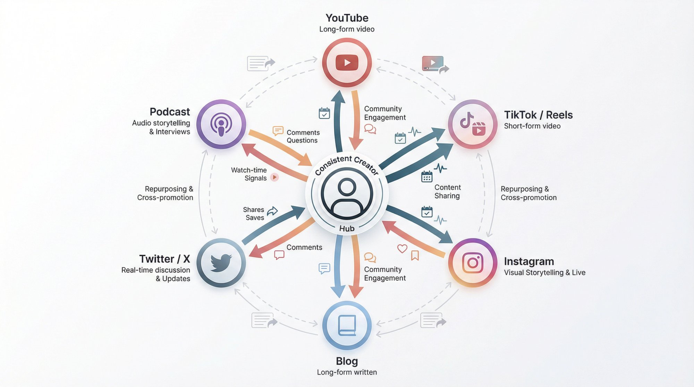

### How Often Should Content Creators Post?

Consistency is critical. This doesn't mean daily posts. It means setting a schedule you can actually maintain and sticking to it.

One YouTube video every Saturday. Three Instagram posts per week. A blog post every other Tuesday. Whatever you choose, be reliable.

Consistency trains your audience to expect and look forward to your content. It also pleases platform algorithms, which tend to reward creators who show up regularly.

Pick a schedule you can sustain long-term. **Better to post biweekly consistently than daily for a month and then disappear.**

### How Do You Use Multiple Content Platforms Effectively?

Focus on your primary platform, but share and repurpose content elsewhere as time permits.

Great blog post? Share key quotes on Twitter. Made a YouTube video? Cut a 30-second highlight for TikTok to draw people to the full version.

Each platform has its own vibe. Adapt the format but keep the message consistent. Cross-promote strategically. Encourage YouTube viewers to follow Instagram for behind-the-scenes content. Direct blog readers to your email newsletter for updates.

Do this **gradually** to avoid overwhelm. Many successful creators start on one platform, then add a second once they have a routine.

### How Do You Engage with Your Content Creator Community?

Audience-building isn't broadcasting. It's relationship-building.

Reply to comments on your videos and posts. Answer questions your readers send. If someone compliments your work on Twitter, thank them.

This shows you're listening and that you value your audience. Those first 100 followers can turn into superfans if they feel a personal connection to you.

Engagement breeds more engagement. When people see you respond, they're more likely to comment too.

Plus, your best content ideas often come from audience feedback. Pay attention to what they ask about or want to see more of.

### Should Content Creators Collaborate?

Networking accelerates growth and makes the journey more fun.

Connect with other creators in your niche or complementary niches. Comment on their content with genuine insights. Share their great posts. Reach out to say hi.

Look for collaboration opportunities like guest appearances on each other's channels, co-hosted live streams, guest articles on each other's blogs, or joint projects and challenges.

Collaboration exposes both of you to each other's audiences. Keep collaborations relevant. You want overlapping audiences and a genuine fit.

A family travel vlogger teaming up with a travel gear reviewer? Perfect. Random pairings that make no sense? Skip those.

### Should Content Creators Follow Trends?

Keep an eye on trending topics, hashtags, or formats you could tie into your content. Trending challenges can boost discoverability.

But only jump on trends that align with your brand. If there's a trending sustainability hashtag and you're a DIY creator, post an eco-friendly craft tip with that tag.

Riding trends can give temporary visibility spikes. But core audience growth comes from consistency and value, not chasing every viral moment.

### How Do You Get People to Share Your Content?

Don't be afraid to ask followers to spread the word if they find your content helpful.

A simple _"If you enjoyed this, please share it with a friend!"_ can nudge people to promote you. Make content that's naturally shareable. Infographics, quotable snippets, useful how-tos that people want to send to others.

> **Value-first principle:** Always include a next step for your audience. At the end of a video, ask them to comment with questions or join your email list for more tips. Guiding people on what to do next increases engagement and loyalty.

Always include a next step for your audience. At the end of a video: _"Comment below with your questions"_ or _"Join my email list for more tips."_ Guiding people on what to do next increases engagement and loyalty.

Growing from zero feels slow at first. You might feel invisible for weeks. That's normal. Keep at it. Even the biggest creators started with zero followers.

## How Do Content Creators Use Analytics?

As you create regularly, you'll accumulate performance data. Don't ignore it. Being data-driven (even in a simple way) dramatically improves your content over time.

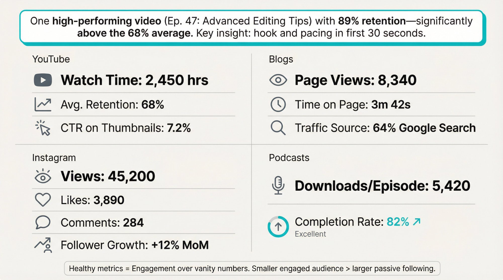

### What Analytics Should Content Creators Track?

Make it a habit to check analytics weekly or monthly. Look at metrics that matter for your goals.

**YouTube:** Watch time, audience retention graphs (where do people drop off?), and click-through rate on titles and thumbnails.

**Blogs:** Page views, time on page, bounce rate, and traffic sources (Google search vs social media).

**Instagram/TikTok:** Views, likes, shares, comments, and follower growth.

**Podcasts:** Downloads per episode and completion rate.

These metrics give clues. If one YouTube video has much higher average view duration, analyze why. Better hook? Hotter topic? If your blog post on Topic X got tons of Google traffic, that topic probably has strong search demand.

### How Do You Find Content Patterns That Work?

Over time, you'll see what consistently works and what doesn't.

Maybe your audience loves tutorial videos but ignores vlogs. Or your humorous posts always go viral while serious ones fizzle.

Use these insights to refine your strategy. This doesn't mean only doing one thing. But prioritize what resonates.

Regularly review metrics to reveal your most successful content types and best posting times. Maybe your data shows your audience is most active around 7 PM. Schedule new posts around then for maximum engagement.

### How Should Content Creators Experiment with Changes?

Treat content creation as ongoing experimentation.

Try tweaking your approach and see if numbers improve. Test a new thumbnail style on a few YouTube videos to see if click-through rate goes up. Experiment with shorter vs longer Instagram captions.

Change one element at a time so you can attribute results. If something flops, you learned. If it succeeds, incorporate that change permanently.

### How Do Content Creators Stay Updated on Platform Changes?

Data isn't just your own stats. It's also what's happening broadly on platforms.

If Instagram suddenly boosts Reels over static posts, that's useful for adjusting strategy. In recent years, platforms like TikTok shifted how content gets discovered. YouTube introduced Shorts to compete.

Follow official creator blogs and reliable industry news. Study your niche environment. If other creators in your field are blowing up with a certain trend, analyze why.

### Should Content Creators Obsess Over Analytics?

There's a line between healthy analytics use and unhealthy obsession.

It's easy to fixate on views, follower counts, and likes. But **not all metrics are equal**. A smaller engaged audience (high watch time, lots of comments) is more valuable than big numbers of passive followers.

Don't let a dip in numbers devastate you. Seasonality and algorithm quirks happen.

Use data as a guide, not your master. If a controversial topic would get clicks but doesn't align with your brand or ethics, skip it despite potential numbers.

Let data guide you, especially retention and saves. Keep learning and adjusting. The loop never ends.

## How Do Content Creators Make Money?

Once you've built content and a following (even a small, loyal one), you can explore ways to earn income.

In 2025, there are more [monetization options](https://www.patron.com/blog/category/monetization/) than ever. Smart creators develop **multiple revenue streams** rather than relying on just one.

| **Method**              | **Effort**                  | **Earnings**        | **Best For**                       |
| ----------------------- | --------------------------- | ------------------- | ---------------------------------- |
| **Ad Revenue**          | Low (passive)               | $2-3 per 1K views   | Large audiences, evergreen content |
| **Sponsorships**        | Medium (pitching + content) | $100-$10K+ per deal | Engaged niche audiences            |
| **Affiliate Marketing** | Low (link + promote)        | 1-10% per sale      | Product reviewers, educators       |
| **Memberships**         | Medium (exclusive content)  | $5-50/month per fan | Sequential creators, communities   |
| **Digital Products**    | High (creation) then Low    | $10-200+ per sale   | Educators, experts, designers      |
| **Merchandise**         | Medium (design + promote)   | $5-30 per item      | Creators with strong brands        |

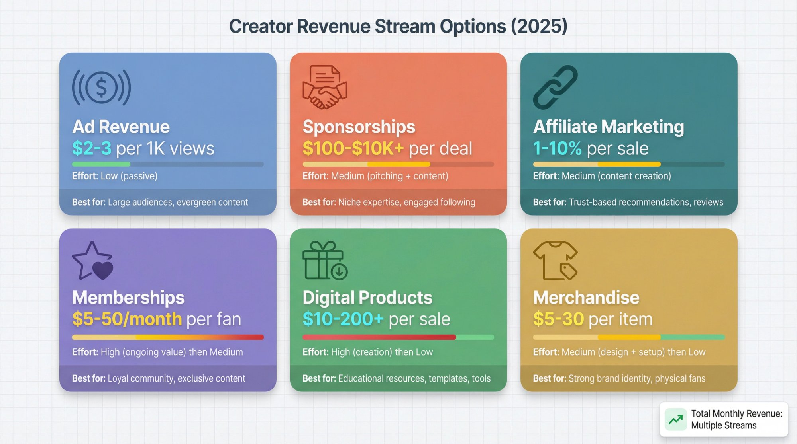

### How Much Do Content Creators Make from Ads?

Platforms like YouTube pay you a share of ad revenue once you meet criteria (1,000 subscribers and 4,000 watch hours for YouTube Partner Program).

This income is generally modest unless you have very large view counts. Rough estimate: **$2-3 per 1,000 views on YouTube** for many niches. That's about **$2,000-3,000 per million views**, but it varies widely by topic and viewer demographics.

Blogs can use display ads (Google AdSense, Mediavine) that pay per view or click.

**Reality check:** Ad rates fluctuate. Economic changes, seasonality, global events can raise or lower them. [During COVID, many creators saw ad rates drop 30%](https://www.tubefilter.com/2020/04/16/creators-disclose-declining-adsense-rates-coronavirus/), pushing them to diversify income.

Enjoy ad income if you have it, but don't rely entirely on it.

### How Do Content Creators Get Brand Deals?

This is often the **most lucrative avenue** for creators with an audience.

Brands pay you to feature or mention their product in your content. A dedicated review, a brief shout-out in a video, an Instagram post wearing their clothing.

The key: _maintain authenticity_. Only promote products you genuinely like or that fit your audience. Followers can spot forced sponsorships, and it erodes trust.

When done right, sponsorships are win-win. Your audience discovers something useful and you get paid.

Rates depend on follower count and engagement. A micro-influencer with 10,000 Instagram followers might charge a few hundred per sponsored post. Larger creators can command thousands.

In fact, [**69% of content creators say brand deals are their most lucrative income source**](https://www.spiralytics.com/blog/content-creator-statistics-2025/), and brand collaborations became the biggest money maker for creators with [**42% of total earnings in 2025**](https://www.lumanu.com/blog/breaking-down-1-billion-in-creator-payouts-2025-influencer-compensation-insights).

To start, create a simple media kit (one-pager with your stats and audience info) and reach out to brands you love. Or join influencer marketplaces where brands look for creators.

### How Does Affiliate Marketing Work for Creators?

Affiliate revenue works for creators of any size. You earn commission for recommending products. No special deal or minimum followers required.

Classic example: A blogger links to products on Amazon with their affiliate link. If a reader clicks and buys, the creator gets a small percentage (usually 1-10% of the sale).

Many companies have affiliate programs, from web hosting to fashion brands.

The beauty of affiliate marketing is it's low effort, potentially high reward. You're monetizing recommendations you'd probably make anyway.

A tech reviewer can include purchase links for gadgets they review. A food blogger can link to their favorite blender.

Over time, if your content drives sales, this becomes steady passive income.

The key: keep recommendations _relevant and trustworthy_. Pushing random products for commission hurts credibility. But promoting things you already love so your audience benefits? That's smart.

Many affiliate programs (Amazon Associates, ShareASale) are free to join.

### How Do Content Creators Use Memberships?

Creators with dedicated communities often turn to direct support from fans.

#### What Are Content Creator Membership Platforms?

Subscription-based support lets fans pay a monthly amount in exchange for exclusive perks. This is powerful because it's **recurring revenue**. A small base of loyal fans provides stable income.

Millions of people have paid memberships to creators on various platforms. These platforms have paid out billions to creators since they started. Clearly, audiences are willing to pay for content they love.

To succeed, offer perks that matter: early access to content, bonus episodes or exclusive content, behind-the-scenes updates, community Discord access, personalized Q&As, and ad-free versions.

#### What Are Rolling Paywalls for Sequential Content?

If you publish episodic content ([webcomics](https://www.patron.com/blog/post/how-to-monetize-a-webcomic/), [serialized novels](https://www.patron.com/blog/post/how-to-start-a-web-serial/), [podcasts](https://www.patron.com/blog/post/how-to-monetize-a-podcast-with-early-access-not-ads/)), the [**rolling paywall**](https://www.patron.com/blog/post/what-is-a-rolling-paywall/) model works exceptionally well.

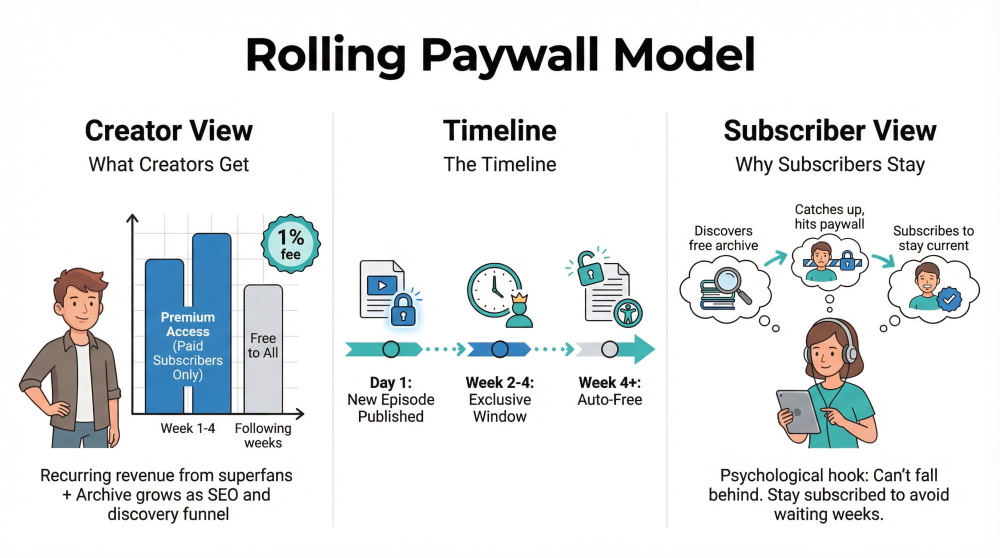

> **Rolling paywalls explained:** You release new episodes to paying subscribers first. Then those same episodes automatically become free after a delay period, commonly ranging from 1-4 weeks. Your archive builds up as free content that attracts new readers, while your most engaged fans subscribe to get episodes early.

Here's how it works: You release new episodes to paying subscribers first. Then those same episodes automatically become free after a delay period, commonly ranging from 1-4 weeks.

Your archive builds up as free content that attracts new readers. Meanwhile, your most engaged fans subscribe to get episodes early.

It's the difference between locking content behind a permanent paywall and creating a time-release system that serves both discovery and revenue.

**Why this converts subscribers:** Readers binge your free archive, hit a cliffhanger or run out of episodes, and subscribe to get more immediately. They stay subscribed to avoid falling weeks behind.

**For sequential creators** (those publishing series, episodes, or chapters), this model turns your back catalog into a discovery funnel while monetizing early access.

We built [Patron](https://www.patron.com/) specifically for this use case. Purpose-built for sequential content with [rolling paywalls](https://www.patron.com/blog/post/what-is-a-rolling-paywall/), advanced series management, and release scheduling. Plus, we charge just [**1% platform fees for early adopters**](https://www.patron.com/blog/post/how-to-calculate-your-true-patreon-take-home-pay-2025/) (versus traditional platforms charging 8-12% for legacy creators, and 10% for new creators as of August 2025). That means you keep more of what you earn.

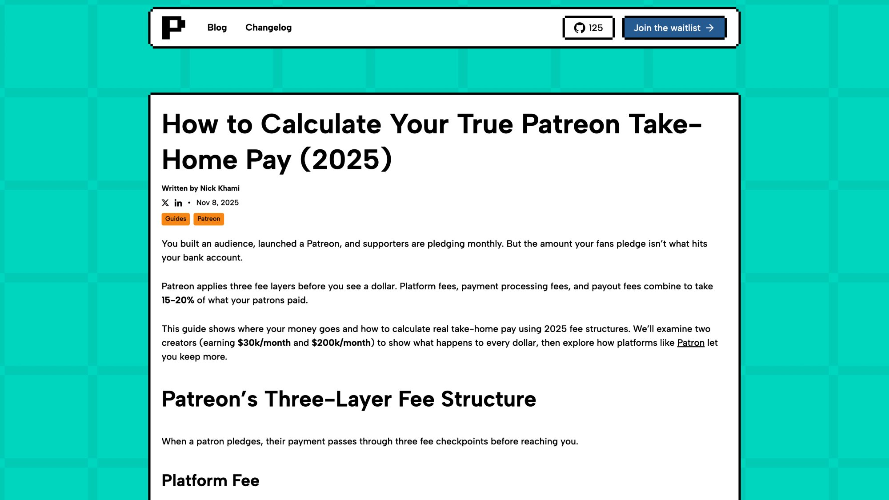

If you're creating [webcomics](https://www.patron.com/blog/post/how-to-monetize-a-webcomic/), [serialized fiction](https://www.patron.com/blog/post/how-to-start-a-web-serial/), or [episodic podcasts](https://www.patron.com/blog/post/how-to-monetize-a-podcast-with-early-access-not-ads/), rolling paywalls let you build both audience and income simultaneously. [Learn more about switching to Patron](https://www.patron.com/blog/post/switch-from-patreon-to-patron/).

#### Do Content Creators Accept One-Time Donations?

Some fans don't want subscriptions but will happily give one-off tips.

Various platforms allow one-time donations. Twitch has "bits" during streams. You can use PayPal or Venmo for tips.

While not predictable income, donations add up and signal strong engagement. [**According to recent 2023 data, 23.5% to 50% of consumers have tipped a creator**](https://supplygem.com/publications/creator-economy/).

Make it easy. Add a donate button on your site or a link in video descriptions with a note like _"Enjoying my content? You can buy me a coffee if you'd like to support."_

### What Digital Products Can Content Creators Sell?

If you have expertise, package it into products.

**E-books or Guides:** Compile your knowledge into a PDF guide or Kindle book. A photographer might sell a "Beginner's Guide to Mobile Photography" for $10.

**Online Courses or Workshops:** Create video courses or conduct live workshops. Various platforms let you sell courses directly.

If you're a fitness creator, sell a 4-week training program. If you do coding tutorials, offer a paid masterclass building a project step-by-step.

Digital courses can be priced higher ($20 to $200+) and become a big income source if your content solves real problems.

**Services and Freelancing:** Your content can market services you offer. A graphic design YouTuber might take freelance clients. A career advice blogger could offer resume review services.

Another option: **UGC (User-Generated Content) services**. You create content _for_ brands to use in their marketing without posting it to your own audience. Brands pay for short videos they can run as ads or on their socials.

**Consulting/Coaching:** If you're experienced in your field, fans might pay for one-on-one advice. Hourly consulting or membership tiers that include monthly coaching calls.

### How Do Content Creators Sell Merchandise?

Selling branded merchandise generates income and strengthens your brand.

T-shirts, mugs, stickers, art prints, or any physical product related to your content. Especially powerful if you have an identifiable brand or catchphrases.

A gaming YouTuber might sell shirts with their channel's inside jokes. A podcast might sell notebooks with quotes from the show.

Thanks to print-on-demand services, you don't need inventory upfront. They print and ship per order.

Plus, merch turns your audience into walking advertisements for you.

### How Much Money Do Content Creators Actually Make?

It varies tremendously based on niche and audience size.

**Beginners** might see **$100-500 a month** after a year of consistent work, often from a mix of sponsorships or affiliate sales. That can cover some bills or reinvestment in gear.

**Growing creators** (tens of thousands of followers) could make **$1,000-5,000 monthly**, especially tapping into multiple streams. A couple brand deals, some ad revenue, successful merch drops.

**Top-tier creators** (hundreds of thousands to millions of followers) can earn **six or seven figures annually** through combinations of the above. Some web fiction authors reportedly earn over $80,000 per month from memberships by offering tons of early-access chapters.

Keep in mind [**only about 10% of influencers make $100k or more per year**](https://www.mbopartners.com/state-of-independence/creator-economy-report/). The majority supplement income or make modest full-time livings.

And that's fine. Even a few hundred extra dollars monthly is great payoff for doing something you love.

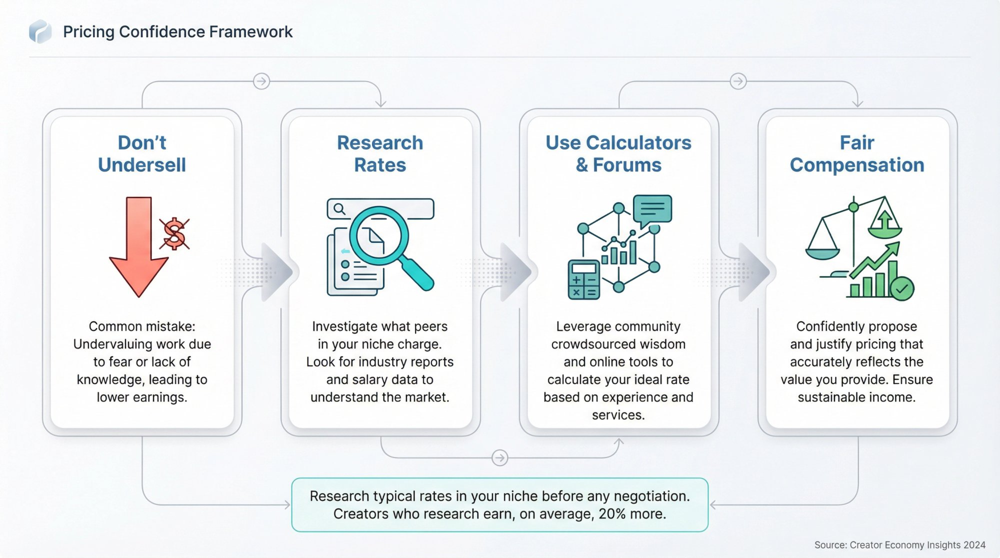

### How Do Content Creators Price Their Services?

When starting to monetize, don't undersell yourself. _Research typical rates._ There are online calculators and forums where creators share what they charge.

Disclose sponsored content clearly. It's legally required and keeps trust with your audience.

Put your audience first. If you bombard them with ads and promos, they'll leave. Start slow. Introduce one small ad or one sponsorship and see how it goes.

Balance revenue goals with providing value and maintaining integrity. Studies show [**15% of consumers are now subscribed to a creator's membership site**](https://nealschaffer.com/creator-economy-statistics/), and that number rises yearly.

People want to pay creators who enrich their lives. Make it worth their while, and income will follow.

## How Do Content Creators Diversify Their Income?

After finding success with one format or platform, diversify both content and income.

### Should Content Creators Use Multiple Platforms?

If you've primarily been on one platform, consider branching out.

Thriving YouTube channel? Start a blog or newsletter to capture search traffic. Big on Instagram? Try YouTube or TikTok for video content.

[**Full-time creators use an average of 4.4 content types or platforms**](https://www.uscreen.tv/blog/creator-economy-statistics/) to engage audiences. Multi-platform presence is common among professionals.

Being on different platforms encourages fans to connect with you in multiple places. If one app loses popularity, you won't lose your whole audience.

But diversify **strategically and gradually**. Pick one new format at a time. Repurpose content where possible.

Turn best blog posts into YouTube videos (script is halfway done). Compile best tips into an e-book. Add bite-sized content (tweets, reels) to funnel people into long-form work.

### Should Content Creators Have Multiple Income Streams?

Ensure you're not relying on just one income source.

Maybe you started with YouTube ads. Add affiliate links or a [membership platform like Patron](https://www.patron.com/). If you've done only brand deals, launch that merch line or digital product.

If one income stream dips, others cover. Multiple smaller streams combined can be substantial.

You might have modest [membership revenue through Patron](https://www.patron.com/blog/category/monetization/), a few affiliates, and occasional sponsors each making a few hundred monthly. Together? That might pay rent.

[**46.7% of creators are full-timers**](https://www.demandsage.com/creator-economy-statistics/), but many only achieved that by aggregating several revenue sources.

### How Do Content Creators Expand Into New Topics?

As you establish yourself, branch out content-wise (carefully).

Tech review channel expanding into lifestyle tech or entrepreneurial advice. Cooking blog introducing gardening content.

Be careful not to stray _too far_ from your core brand. Expansions should feel natural and interesting to your existing audience.

Poll your community. _"Would you guys be interested if I started interviewing other creators?"_ Gauge interest before investing heavily.

Some experimentation keeps content fresh and may attract new audience segments.

### Should Content Creators Collaborate Beyond Their Niche?

Diversifying can mean collaborating with adjacent niches, exposing you to new audiences.

Finance YouTuber collabs with entrepreneurship YouTuber? Both topics overlap nicely. Entrepreneurs care about finances. Finance nerds are often into entrepreneurship.

Cross-overs sustainably grow your fanbase in new areas.

### What Assets Should Content Creators Build?

Think beyond social media clout. Build assets you control.

**Email list:** "Own" your audience contact, unlike on social platforms where algorithms stand between you and fans. Many creators regret not starting email lists sooner.

**Your own website:** A community forum or Discord can fortify your ecosystem outside big platforms.

The goal of diversifying is future-proofing your creator career and amplifying reach.

## How Do Content Creators Stay Consistent Long-Term?

You have all the pieces to build a content creation career. The final step is ensuring you can **sustain** this for the long haul.

Content creation is a marathon, not a sprint.

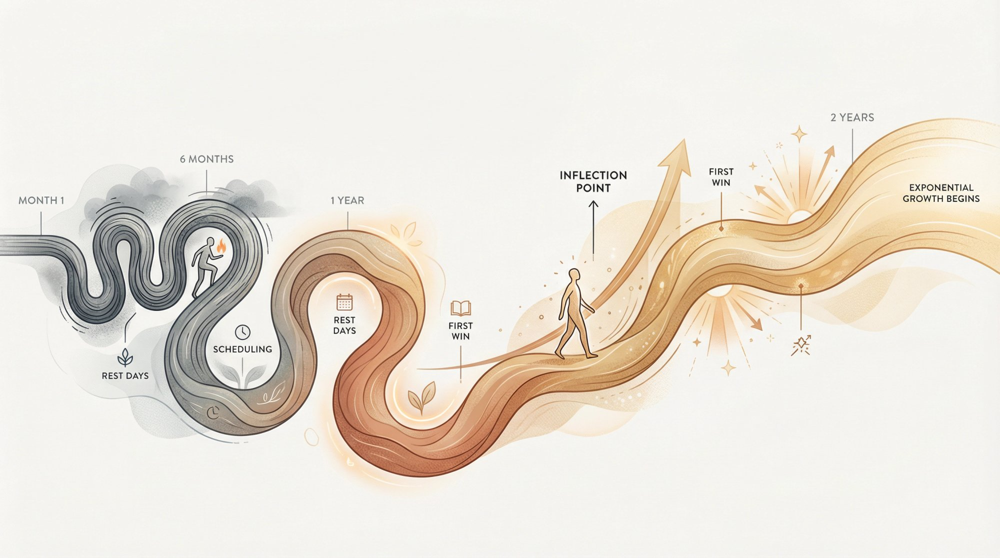

### How Do You Create a Sustainable Content Creation Routine?

Consistency is vital, but it needs to be sustainable.

Set a content schedule you can realistically maintain given other life commitments (job, school, family).

Batch tasks. Film all videos on Saturday, edit on Sunday. Dedicate certain evenings to writing.

Use scheduling tools to automate posts. Treat content creation like a serious job in terms of time management. Block off "content time" on your calendar.

But also schedule **breaks**. Better to take a planned week off (and inform your audience) than grind non-stop and disappear for a month due to burnout.

### How Do Content Creators Avoid Burnout?

Burnout is a real threat. Pressure to constantly produce, respond to fans, and watch stats can overwhelm.

Don't ignore stress signs. If you find yourself dreading content creation or feeling exhausted, adjust.

Reduce posting frequency to something manageable. Take a short hiatus to recharge.

Set boundaries and take at least one day offline each week. Use that day for rest and non-content activities you enjoy.

Exercise, proper sleep, and time with loved ones keep you grounded. If you burn out, there's no content at all. Your well-being is priority one.

### How Do Content Creators Handle Negativity?

The internet comes with trolls and criticism. As you grow, you'll encounter negative comments.

Develop a thick skin and a strategy. Some creators ignore or delete toxic comments. Others address constructive criticism.

A negative comment often says more about the commenter than you. Focus on positive feedback and people you're actually helping.

If harassment becomes serious, use block features and moderation tools.

Don't let one rude comment overshadow 100 supportive ones. But do listen to **constructive** feedback.

### How Do Content Creators Keep Learning?

The creator landscape will continue changing. New platforms arise. Old ones fall away.

Adopt a mindset of lifelong learning. Stay curious about new content styles, technologies, approaches.

Study other creators. Even after you're successful, there's always something to learn from someone else's approach.

Take advantage of free resources. Top creators share tips in interviews, blogs, YouTube channels. There are entire channels dedicated to YouTube strategy or blogging SEO.

Consider attending industry events (VidCon for YouTubers, podcasting conferences) where you can learn and network.

### How Do Content Creators Celebrate Success?

Acknowledge your wins, big and small.

Got your first fan art? Hit 1,000 subscribers? Landed your first sponsorship? Celebrate!

Many creators keep a positive feedback folder with screenshots of nice comments or thank-you messages. It reminds them why they do this, especially on tough days.

Ultimately, remember why _you_ became a content creator. Hopefully because you're passionate about your subject and love sharing it.

Keep that passion at the heart of everything. If you enjoy the journey, your audience will feel it.

### When Should You Quit as a Content Creator?

Building something meaningful takes time. First months (even years) can be slow.

But growth is often exponential. It might take 1 year to get 1,000 followers, then only 6 months to reach 5,000, then 3 months more to hit 10,000.

Most people who "fail" simply gave up before the inflection point.

If this is your dream, hang in there. Adjust your strategy if needed, but keep going.

You create your own luck by making lots of content.

## Content Creator FAQs

**How long does it take to become a successful content creator?**

There's no fixed timeline. Some creators blow up in months. Others take years to build sustainable income. On average, expect 1-2 years of consistent work before seeing significant results. Success depends on your niche, consistency, quality, and a bit of timing. The key is defining what "success" means to you personally.

**Do I need expensive equipment to start?**

No. Many successful creators started with just a smartphone and free editing software. Good content comes from valuable ideas and engaging delivery, not expensive gear. Start with what you have. Upgrade gradually as you earn money from your content. Audio quality and lighting matter more than camera specs.

**How many followers do I need before I can make money?**

You can start earning with surprisingly small audiences. Affiliate marketing works from day one. Some brands work with nano-influencers (1,000-10,000 followers). [Membership platforms like Patron](https://www.patron.com/) let you earn from your first paying fan. While larger audiences generally mean more income potential, engagement matters more than raw follower count.

**What if my niche is too competitive?**

Competition usually means there's demand, which is good. The solution is finding a specific angle within that niche. Don't try to compete on "fitness." Go for "15-minute home workouts for busy nurses." Specificity helps you stand out and makes it easier for the right audience to find you.

**How do I deal with inconsistent income?**

Build multiple revenue streams so if one dips, others cover. Create a financial buffer when possible. Many creators maintain part-time work while building their content business. Consider offering services or products (courses, coaching) that provide more predictable income alongside variable sources like sponsorships.

**Should I focus on one platform or be everywhere?**

Start with one platform where you can consistently create quality content. Once you have a routine there, expand to a second platform by repurposing content. Full-time creators typically use 3-4 platforms, but they didn't start that way. Master one first, then scale strategically.

**How do I stand out when there are millions of creators?**

Be authentically yourself. Your unique perspective, experiences, and personality are what set you apart. Drill down to a specific niche. Create content that genuinely helps people, not just content that exists. Build real relationships with your audience. Authenticity beats production quality every time.

**What if I'm not seeing growth?**

Review your analytics to understand what's working and what isn't. Are you solving real problems your audience has? Is your content easy to find (SEO, hashtags)? Are you engaging with your community? Are you consistent with posting? Sometimes growth is slow and then suddenly exponential. Don't quit during the slow phase.

**Can I be a content creator while working a full-time job?**

Absolutely. Most creators start as a side project. Set a sustainable schedule (maybe one video per week or two blog posts per month). Use weekends and evenings effectively. The key is consistency, not volume. Many full-time creators built their audience while working other jobs.

**How do I price my services or products?**

Research what others in your niche charge. Consider your experience level, audience size, and the value you provide. Don't undersell yourself, but be realistic when starting. You can always raise prices as you gain credibility. For digital products, test different price points. For sponsorships, use influencer rate calculators as a starting point.

All data and examples in this guide are current as of 2025. The creator economy is dynamic, so stay updated on new trends and platform features. But the foundational principles (provide value, connect with audience, diversify, be consistent) are evergreen.

Now get started. Put these steps into action. In a couple years, you might be the next success story inspiring others on their content creation journey.
