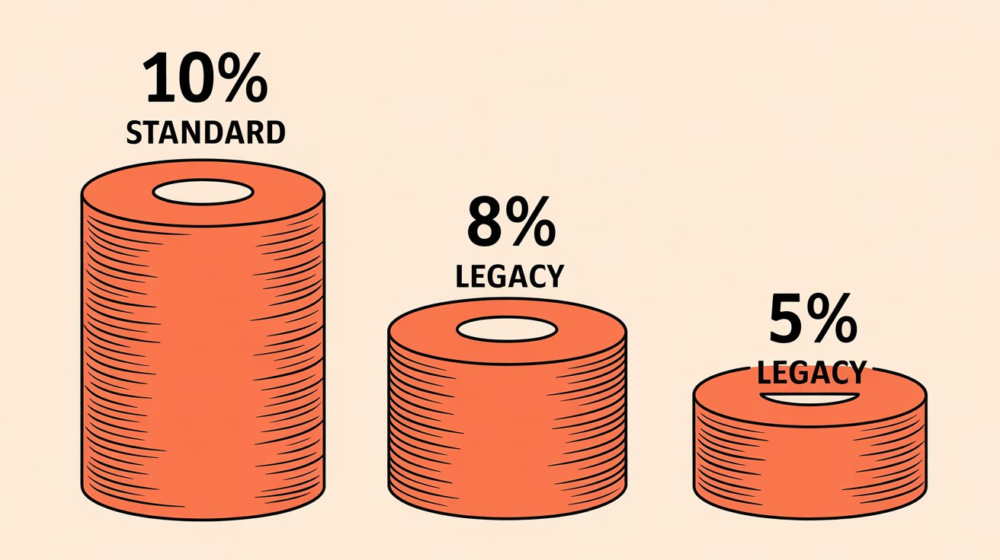
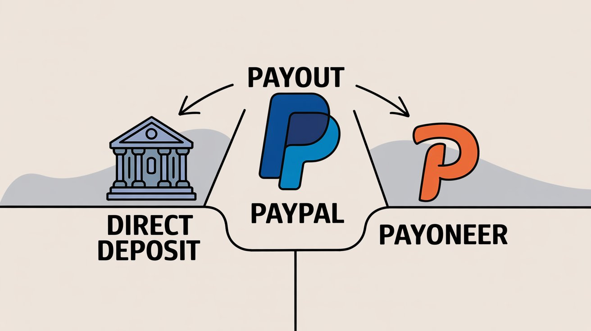
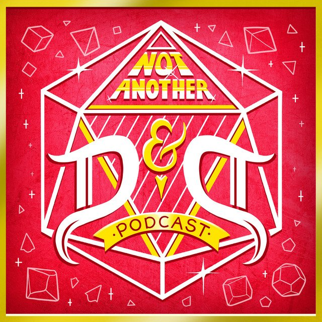
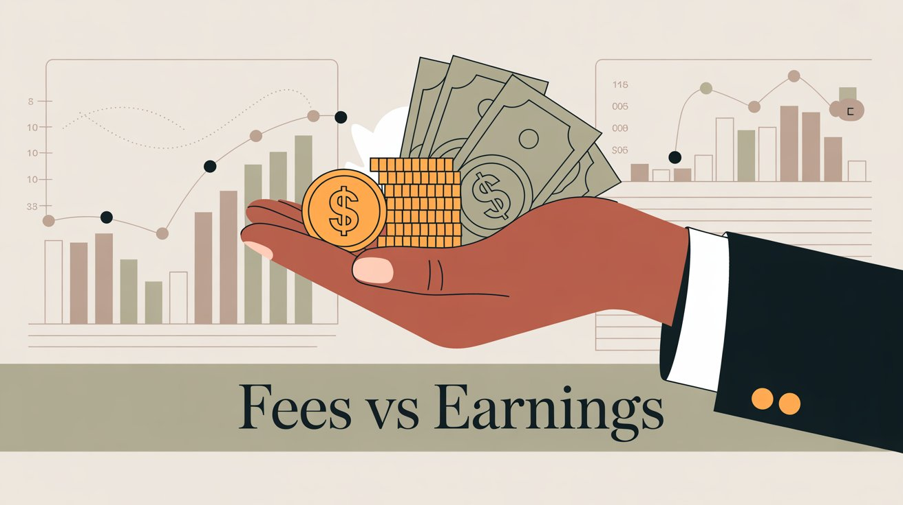

You built an audience, launched a Patreon, and supporters are pledging monthly. But the amount your fans pledge isn't what hits your bank account.

Patreon applies three fee layers before you see a dollar. Platform fees, payment processing fees, and payout fees combine to take **15-20%** of what your patrons paid.

This guide shows where your money goes and how to calculate real take-home pay using 2025 fee structures. We'll examine two creators (earning **$30k/month** and **$200k/month**) to show what happens to every dollar, then explore how platforms like [Patron](https://www.patron.com/) let you keep more.

## Patreon's Three-Layer Fee Structure

When a patron pledges, their payment passes through three fee checkpoints before reaching you.

### Platform Fee

[Patreon takes a percentage of your gross earnings](https://support.patreon.com/hc/en-us/articles/11111747095181-Creator-fees-overview) as their service fee.

Creators who joined after August 4, 2025 are on the standard plan with a **10% platform fee**. This applies to everyone creating a new page or republishing an existing one. [Patron's recent fee changes in 2025](https://www.patron.com/blog/post/patron-fee-changes-2025/) provide context on how the competitive landscape shifted when Patreon raised fees.

Legacy creators from pre-August 2025 might still have older pricing tiers at **5%** or **8%** fees, but only if they never republish their page or make certain account structure changes.

Patreon calculates the platform fee on pre-tax pledge amounts and deducts it automatically before anything else.

### Payment Processing Fees

Every credit card transaction costs money to process. Patreon passes these fees directly to creators.

| **Pledge Amount** | **Processing Rate** | **Example Fee** |
| --- | --- | --- |
| **Over $3** | 2.9% + $0.30 | $0.59 on a $10 pledge |
| **$3 or below** | ~5% + $0.10 | $0.15 on a $1 pledge |

[These rates apply to standard credit card and PayPal payments](https://influencermarketinghub.com/top-creators-on-patreon/). Patrons using PayPal outside the US pay an extra **1%** (making it 3.9% + $0.30). Patreon adds a **2.5% currency conversion fee** when a patron's currency differs from your payout currency.

Small pledges get hit hardest. A $1 pledge loses roughly **15% to processing fees alone** before Patreon's platform cut. This is why many creators set a $3 minimum tier.

Understanding these processing economics matters when [pricing your membership tiers](https://www.patron.com/blog/post/how-to-price-your-webcomic-tiers/).

### Payout Fees

Once Patreon processes everything and your balance is ready, you still pay to withdraw it.

Direct deposit or bank transfer usually has **no fee** if you withdraw in your local currency via ACH or local bank transfer. Patreon covers the standard transfer cost, though some international wire transfers through Payoneer may incur a **$15 flat fee**.

PayPal withdrawal costs **1% of the transfer amount**, with a minimum of $0.25 and a maximum of $20. Withdrawing **$1,000** to PayPal costs **$10**.

Payoneer for international creators had a **$15 flat fee** for global bank transfers (no longer available for new users), while the Payoneer prepaid card option has a **$1 payout fee**.

Most creators use direct deposit to avoid the PayPal 1% cut. International creators without local bank options often rely on PayPal or Payoneer, adding another fee layer.

### Taxes and VAT

[Sales tax and VAT are added on top of the patron's pledge amount](https://support.patreon.com/hc/en-us/articles/11111747095181-Creator-fees-overview) in regions where required. This doesn't reduce your payout directly since Patreon calculates the 10% fee on pre-tax amounts, but it slightly increases payment processing fees since those fees apply to the total charge including tax.

Patrons in certain regions pay more than your listed tier price, which can affect conversion rates and create geographic patterns in your supporter base.

## Calculating Patreon Take-Home Pay

Take a creator with **100 patrons paying $10/month** for **$1,000 in monthly pledges**.

**Start with gross pledges.** The dashboard shows **$1,000** (100 patrons × $10 each) before any deductions.

**Subtract the platform fee.** Patreon takes **10%** immediately. $1,000 × 0.10 = $100. Remaining balance is **$900**.

**Subtract payment processing fees.** Each pledge is a separate transaction. At **$10** each, processing costs 2.9% ($0.29) plus the fixed $0.30 fee, totaling **$0.59 per pledge**. For 100 pledges, that's $0.59 × 100 = **$59**. Remaining balance is **$841**.

**Subtract payout fee if applicable.** Direct deposit has no fee, leaving **$841** in net earnings. PayPal withdrawal costs 1% of the transfer ($8.41), leaving **$832.59** in net earnings.

Out of **$1,000 pledged**, you take home **$832-$841** depending on withdrawal method. That's 83-84% of gross pledges. The other 16-17% went to Patreon and payment processors.

This is before personal income taxes. You'll owe additional taxes on that $832-$841 as self-employment income. Patreon sends a 1099-K but doesn't withhold taxes.

## What Patreon Creators Actually Make

Two successful creators and what ends up in their accounts after fees.

### Case Study 1: ArcaneCadence (Web Fiction Author)

ArcaneCadence is a web novelist who launched a VRMMO progression fantasy called *"New Life as a Max Level Archmage"* in mid-2025. [The story gained over 20,000 followers on Royal Road](https://www.reddit.com/r/litrpg/comments/1m89f1j/new_life_as_a_max_level_archmage_come_try_my_story/) in months.

Her Patreon offers early access tiers. Patrons pay to read 5, 10, or 20 chapters ahead of the free release schedule. This model converts well for serial fiction since readers get hooked. This sequential content benefits from [rolling paywalls](https://www.patron.com/blog/post/what-is-a-rolling-paywall/), which monetize early access while eventually releasing content free to grow audience.

| **Metric** | **Value** |
| --- | --- |
| Paying patrons | [~4,000](https://graphtreon.com/creator/ArcaneCadence) |
| Monthly earnings | [~$30,000](https://graphtreon.com/creator/ArcaneCadence) |
| Average pledge | [~$7.50](https://graphtreon.com/creator/ArcaneCadence) |

ArcaneCadence launched in June 2025, just before Patreon's fee change, putting her likely on the legacy **8% platform fee** plan.

Platform fee at 8% costs $30,000 × 0.08 = **$2,400**, leaving $27,600. Processing fees at an average pledge of $7.50 run roughly 3-4% of total revenue, approximately **$1,050**, leaving $26,550. Assuming direct deposit with no payout fee, final take-home is approximately **$26,000-$26,500/month**.

ArcaneCadence loses roughly **$3,500-$4,000 per month** to fees. That's the cost of Patreon's infrastructure.

If she were on [Patron](https://www.patron.com/)'s **1% fee structure** instead of Patreon's 8%, she'd save approximately **$2,100 per month** in platform fees alone. That's **$25,000+ per year** from switching platforms.

### Case Study 2: Not Another D&D Podcast (Actual-Play Podcast)

*Not Another D&D Podcast (NADDPOD)* is a comedy actual-play podcast where entertainers run ongoing D&D campaigns. [They've built one of the largest Patreon communities with over 60,000 members](https://www.patreon.com/naddpod).

Their multi-tier system offers increasingly exclusive content from **$2** (behind-the-scenes access) to **$50** (VIP treatment, shoutouts, live show access), with tiers at **$5**, **$10**, and **$25** in between.

They have 60,000+ Patreon members with [estimated earnings of $100,000-$265,000 per month](https://graphtreon.com/creator/naddpod). They hide exact figures, but this range fits their member count and tier structure. Using a conservative **$200,000/month** for this breakdown.

NADDPOD launched around 2018, putting them likely on a legacy **8% platform fee** plan.

Platform fee at 8% costs $200,000 × 0.08 = **$16,000**, leaving $184,000. Processing fees with many patrons at $5-$10 tiers run around 4% of revenue, roughly **$8,000**, leaving $176,000. Large creators use direct deposit with no payout fee. Final take-home is approximately **$176,000/month**.

NADDPOD loses roughly **$24,000 per month** to fees. That's more than most small creators earn in total.

Even with their grandfathered 8% rate, they're paying **12% total** in combined fees. If they were on Patreon's new 10% standard plan, they'd lose an additional **$4,000/month**.

As revenue grows, the absolute dollar impact of percentage-based fees becomes massive. At $200k/month, every 1% of fee costs $2,000. This is why some top creators eventually build their own membership platforms or consider lower-fee alternatives like [Patron](https://www.patron.com/).

## Patreon Alternatives That Keep More of Your Income

Patreon's fees exist because running a creator platform requires infrastructure, payment processing, and ongoing development. But does it need to cost 10%?

### Patron's 1% Fees for Early Adopters

[Patron](https://www.patron.com/) is building an open-source alternative for sequential content creators (webcomics, serial fiction, podcasts, episodic video). The platform launched in alpha in 2025 with **1% platform fees for creators who join early**.

The [Patron team explicitly states](https://www.patron.com/) they're "not going to charge as much as Patreon does on top of Stripe" and have structured the company to stay lean without venture capital pressure to raise fees over time.

### Savings with 1% Platform Fees

Take our earlier example with **$1,000 in monthly pledges**.

| **Platform** | **Platform Fee** | **Processing Fees** | **Net Earnings** |
| --- | --- | --- | --- |
| **Patreon (10%)** | $100 | $59 | **$841** |
| **Patron (1%)** | $10 | $59 | **$931** |

You keep an extra $90 per $1,000 in pledges by switching platforms. That's nearly an 11% increase in take-home pay without finding a single new supporter or raising prices.

Scaling up:

| **Monthly Revenue** | **Monthly Savings** | **Annual Savings** |
| --- | --- | --- |
| $5,000 | **$450** | **$5,400** |
| $10,000 | **$900** | **$10,800** |
| $30,000 | **$2,700** | **$32,400** |

For ArcaneCadence's $30k/month earnings, switching from Patreon's 10% to Patron's 1% would put an extra **$32,000+ in her pocket annually**. That's enough to hire an editor, commission professional cover art, or invest in marketing. If you're interested in [how to monetize sequential content like webcomics](https://www.patron.com/blog/post/how-to-monetize-a-webcomic/), the fee difference can be game-changing.

### When Lower Platform Fees Matter

If you're earning **$50/month** from 5 patrons, the difference between 10% and 1% is $4.50. Negligible.

Fees become critical when percentages equal real money. At **$2,000+/month**, saving 9% is **$180/month** (**$2,160/year**). That pays for software, equipment, advertising, or covers bills.

Fees matter when you're trying to go full-time. Every percentage point matters when calculating whether you can afford to create content as primary income. An extra **$200-500/month** can be the difference between viable and needing a day job.

They matter when you want to reinvest in content. Lower fees mean more budget for better production value, collaborations, or promotion. Compounding growth comes from reinvesting earnings into better content.

### What to Know Before Switching to Patron

[Patron](https://www.patron.com/) is currently in alpha as of late 2025.

User authentication, creator profiles, content posting, series management, payment infrastructure, and core early-access/release scheduling features work. These make it useful for sequential creators. You can track development progress through [Patron's public changelog](https://www.patron.com/changelog/).

Discord integrations, email systems, community chat, and other parity features with established platforms are coming. The team ships weekly updates and documents progress publicly on their changelog.

[Patron's codebase](https://www.patron.com/blog/category/technical/) is publicly available under Apache 2.0 license. If you want custom features or self-hosting, you have options. The platform is transparent about how it works.

If you're currently earning significant income on Patreon, jumping ship overnight carries risk.

But if you're starting out or comfortable being an early adopter, [Patron](https://www.patron.com/) offers a compelling financial advantage that scales as you grow.

Check out [this guide on switching from Patreon to Patron](https://www.patron.com/blog/post/switch-from-patreon-to-patron/) if you're considering the move.

## Creator FAQ on Fees and Take-Home Pay

### How often does Patreon pay creators?

Patreon processes payments at the beginning of each month and transfers funds to your balance within days. You can withdraw to your bank account anytime your balance exceeds the minimum threshold (usually **$10-20** depending on region). Most creators withdraw monthly.

### Can I reduce payment processing fees by using annual memberships?

Somewhat. Annual memberships reduce transactions (12 monthly charges become 1 annual charge), so you pay the **$0.30 fixed fee** once instead of twelve times. This saves around **$3.30 per year per patron** on processing fees. Annual memberships have tradeoffs though. Higher upfront cost for patrons can reduce conversion, and if a patron churns, you lose a year's revenue instead of one month. See [this comparison of annual vs monthly memberships for creators](https://www.patron.com/blog/post/annual-vs-monthly-memberships-for-creators/).

### Do Patreon's fees include payment processor costs?

No. Patreon's platform fee (**10%** for new creators) is separate from payment processing fees (**~2.9% + $0.30**). Both are deducted from your earnings. Many creators don't realize this initially and think "10% fee" is the total cost, when the real total is closer to **13-15%** depending on pledge sizes.

### What happens if I switch from Patreon to another platform?

Migration is possible but requires planning. You'll need to export your patron list and tier structures, communicate the move to supporters in advance, manually recreate your content structure on the new platform, and likely cross-post content on both platforms during transition.

Many creators run dual accounts for 1-3 months while migrating to avoid losing supporters who don't immediately follow to the new platform.

[Patron is building migration tools](https://www.patron.com/blog/post/switch-from-patreon-to-patron/) to make this easier for creators coming from Patreon.

### How can I minimize Patreon fees without switching platforms?

Set higher minimum tiers to avoid **$1-2** pledges that lose **15-25%** to fees (most creators start at **$3** or **$5**). Use direct deposit to skip PayPal's **1%** withdrawal fee. Encourage annual subscriptions to reduce transaction count (but see tradeoffs above). Batch content posts (doesn't affect fees but reduces platform management time).

None of these strategies can get you below Patreon's **10% platform fee**. If you want meaningfully lower fees, you need a different platform like [Patron](https://www.patron.com/) with structural **1%** pricing.

### How do taxes work with Patreon income?

Patreon reports your earnings to tax authorities if you meet thresholds (in the US, **$20,000+** in a year or **200+** transactions). You'll receive a 1099-K form. Patreon does not withhold income tax, so you're responsible for paying quarterly estimated taxes if you're in the US.

Consult a tax professional familiar with self-employment income to avoid surprises.

The take-home calculations in this article are pre-tax (before your personal income taxes).

### Can I see a breakdown of fees in my Patreon dashboard?

Yes. Patreon's Analytics/Insights section shows you [earnings after fees each month](https://support.patreon.com/hc/en-us/articles/11111747095181-Creator-fees-overview), broken down by platform fee, processing fees, and payout fees. You can cross-check this against manual calculations. The dashboard also shows gross pledges vs. net earnings, so you can see exactly where your money went.

### Why are small pledges so expensive in fees?

The fixed **$0.30 processing fee** per transaction hits small pledges disproportionately hard. On a **$1** pledge, $0.30 is **30%** before counting percentage-based fees. On a **$10** pledge, $0.30 is only **3%**. Platforms like Patreon originally aggregated pledges (charging patrons once for all their memberships) to reduce per-transaction fees. This caused other issues (patrons being charged for creators they forgot they supported), so Patreon moved to per-creator billing, which increased fees for creators with many small supporters.

### Is Patron actually sustainable at 1% fees?

[Patron's model](https://www.patron.com/) relies on staying lean and avoiding venture capital, which removes pressure to extract maximum revenue. The **1% early-adopter fee** is a lifetime lock for creators who join during alpha/beta. The plan is to keep infrastructure simple, use open-source contributions, and avoid bloating the platform with features requiring massive teams. Whether this works long-term remains to be seen (the platform launched in 2025), but the founder has a track record of building sustainable tech companies, adding credibility.

## Know Your Numbers, Maximize Your Earnings

Calculating your true Patreon take-home pay is straightforward once you understand the three-layer fee structure. New creators pay a **10% platform fee**, **~3-5% payment processing** (varies by pledge size), and **0-1% payout fee** (depending on withdrawal method).

Most creators keep **80-85% of gross pledges** after all fees, before personal taxes.

For someone earning **$1,000/month**, losing **$150-200** to fees might feel acceptable. At **$10,000/month**, losing **$1,500-2,000** starts to sting. For creators at **$50,000+/month**, the absolute dollar loss to fees becomes substantial enough to consider alternatives.

With 1% platform fees vs. Patreon's 10%, you keep an extra 9% of every dollar supporters pledge. Over a year, that difference compounds significantly.

[Patron](https://www.patron.com/) offers a compelling option for sequential content creators who want to keep more of what they earn. You can read more about [the broader creator platform landscape](https://www.patron.com/blog/category/patreon/) and how different platforms compare.

Whether you stick with Patreon or explore alternatives like [Patron](https://www.patron.com/), knowing your numbers matters. Your supporters are funding your work. Understanding exactly how much of that support reaches you lets you make informed decisions about pricing, platform choice, and long-term sustainability.

Run your current Patreon numbers through the calculations in this guide, then compare what you'd keep on a 1% platform.

Ready to keep more of what you earn? [Check out Patron](https://www.patron.com/)!
