You've got a story in your head. Maybe it's a romance where two rivals slowly fall for each other, or a fantasy epic about a chosen one who really doesn't want to be chosen. Whatever it is, you're wondering if you can turn it into a [webtoon](https://www.patron.com/blog/category/webtoon/).

The short answer? **Yes, absolutely.**

But most guides won't tell you this upfront: making a webtoon isn't just about drawing well. It's about **building a production system** that can ship episodes consistently without burning you out, designing content that hooks readers on mobile screens, and eventually [monetizing your superfans](https://www.patron.com/blog/category/monetization/) so you can keep creating.

This guide covers the entire pipeline from concept to publication to revenue. By the end, you'll have **a repeatable process, a launch plan, and a way to earn money that doesn't depend on luck.**

## What Is a Webtoon? (Mobile-First Definition)

Let's start with the basics. A [webtoon](https://www.patron.com/blog/category/webtoon/) isn't just "a comic, but online."

It's a **mobile-first, vertical-scroll reading experience**. That single constraint changes everything about how you create.

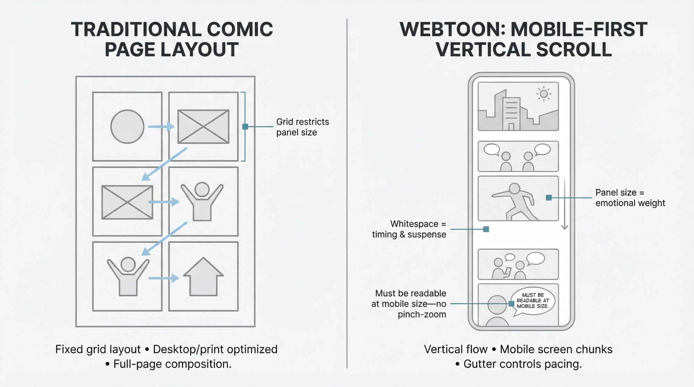

Think about it: when readers consume your story on their phones, they're seeing it in screen-sized chunks, not full pages. The pacing becomes screen-based. Empty space between panels (the "gutter") becomes a storytelling tool that controls timing, suspense, and emotional impact.

**What changes:**

- Text must be readable without pinch-zooming, or you lose immersion and retention
- Panel composition works vertically, not in traditional grid layouts
- Your art style becomes a _production decision._ If your art takes too long per episode, you'll struggle with consistency. Industry data shows [webtoon creators often spend 30+ hours per episode](https://tips.clip-studio.com/en-us/articles/7417), which works for monthly schedules but risks burnout with weekly updates

The core principle? Webtoons are **sequenced experiences**. Your job is to control attention, reveal, and emotion per scroll. Not just draw "good panels."

## Choose Your Webtoon Production Model (Before You Draw)

Most creators jump straight into drawing without thinking through sustainability. That's a mistake.

You need to pick a production model that matches your skills, time, and goals.

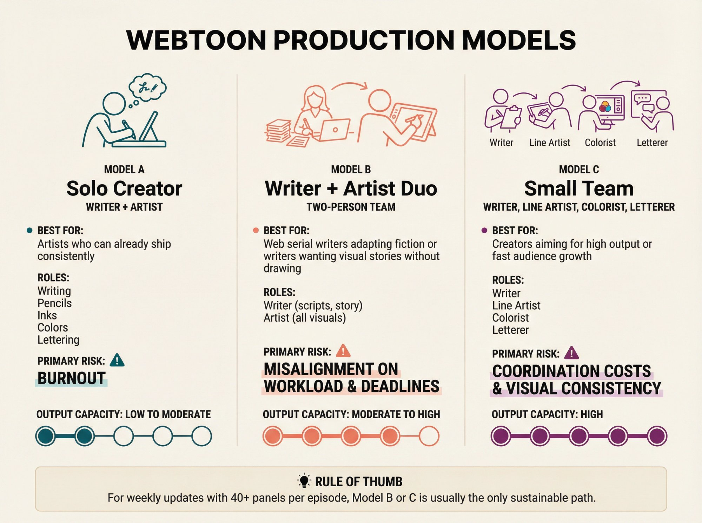

### Model A: Solo Creator (Writer + Artist)

**Best for:** Artists who can already ship consistently

This is you doing everything. Writing, pencils, inks, colors, lettering, the whole deal.

_The reality check:_ This only works if you have a simplified art style or you're okay with lower update frequency. Burnout is the biggest risk here.

### Model B: Writer + Artist Duo

**Best for:** [Web serial writers](https://www.patron.com/blog/category/web-serial/) adapting fiction into comics, or writers who want to create visual stories without drawing

One person writes and scripts. The other draws.

_The catch:_ Misalignment on workload and deadlines will kill the partnership. You need strong contracts and clear communication from day one.

### Model C: Small Team (Writer, Line Artist, Colorist, Letterer)

**Best for:** Creators aiming for high output or fast audience growth

This is how you ship weekly episodes at 40+ panels without dying.

_The challenge:_ Coordination costs and maintaining visual consistency across multiple people.

**Rule of thumb:** If you want to publish weekly with 40+ panels per episode, Model B or C is usually the only path that works.

## Pre-Production: Build Your Season 1 Bible

Most [webtoons](https://www.patron.com/blog/category/webcomics/) fail for one of two reasons.

1.  The story doesn't hook readers fast enough
2.  The creator can't maintain their update schedule

Pre-production solves both problems.

### Your Minimum Viable "Season 1 Bible"

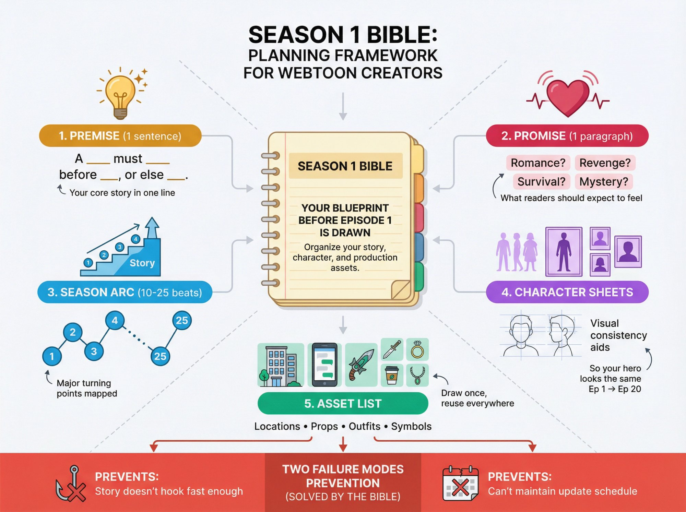

Create these documents _before_ you draw Episode 1:

**Premise (1 sentence):**  
"A \_\_\_ must \_\_\_ before \_\_\_, or else \_\_\_."

**Promise (1 paragraph):**  
What emotional experience should readers expect? Romance? Revenge? Survival? Mystery?

**Season Arc (10-25 beats):**  
Major turning points mapped out. Not every detail, just the spine of your story.

**Character sheets:**  
Visual consistency aids. Even rough sketches work. You need these so your protagonist looks the same in Episode 1 and Episode 20.

**Asset list:**  
Recurring locations, props, outfits, symbols. If your main character lives in an apartment, draw that apartment once and reuse it.

### How to Develop Your Webtoon Genre and Hook

Pick your genre deliberately: romance, fantasy, sci-fi, slice-of-life, action, horror, or a blend.

Then add your **unique hook**. What's your twist on familiar tropes?

_Example:_ Instead of "martial arts webtoon," try "a shy judo athlete trains with a mysterious expert to defeat her childhood rival while falling for them." That's _The Gentle Way_ on [WEBTOON CANVAS](https://www.webtoons.com/), and it's grown to 296,000+ subscribers by combining judo with romance.

The premise should excite you _and_ intrigue readers.

### The First-3-Episodes Rule

[WEBTOON CANVAS](https://www.webtoons.com/) explicitly recommends launching with **3 episodes** because:

- Readers get a subscribe prompt after finishing at least three episodes
- New readers have enough content to get invested in your story
- You can test if your production pipeline actually works before committing to weekly updates

Your real goal isn't "finish Episode 1." It's: **ship Episodes 1-3 as a complete unit**.

### Balance Planning with Action

One creator reflected: _"I was locked in a cycle of learning and planning... but you learn a lot faster actually making and posting your comic than just researching."_

Don't overthink forever. Plan the beginning, middle, and end in broad strokes, but get into production. You'll improve faster by shipping than by endlessly refining your outline.

## Best Tools and Workspace Setup for Webtoons

### Digital Drawing Equipment You'll Need

Most webtoon artists draw digitally. You'll need this:

**Graphics tablet options:**

- Wacom pen tablet (affordable entry point)
- iPad with Apple Pencil (most portable)
- Android tablet with pressure-sensitive stylus
- Pen display like Wacom Cintiq (desktop setup)

Drawing with a mouse is technically possible, but it's brutal for comic art. Don't torture yourself.

### What Art Software Works Best for Webtoons?

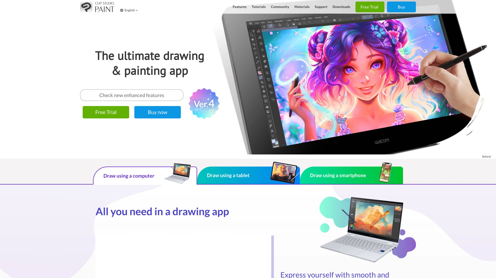

[**Clip Studio Paint**](https://www.clipstudio.net/en/) **is the industry standard for webtoon and manga creation.**

Why? It's built specifically for sequential art:

- Webtoon canvas preset that handles vertical format automatically
- Speech bubble tools designed for comics
- EX version includes "Export to Webtoon" function that auto-slices your long canvas into platform-ready chunks

One artist noted: _"My process is much faster on Clip Studio Paint now... this program was actually made with comic artists in mind."_

**Other solid options:**

- Photoshop (general-purpose, not comic-specific)
- Medibang Paint (free)
- Krita (free, open-source)
- Procreate (iPad only, great for sketching)

### Canvas Size and Resolution: The Technical Specs

This part matters because upload limits can destroy your art quality through compression.

**WEBTOON CANVAS upload requirements (verified Dec 2025):**

| Requirement   | Specification              |
| ------------- | -------------------------- |
| Width         | \<800px (per slice)        |
| Height        | \<1280px (per slice)       |
| File size     | Max 2MB per image          |
| Total episode | Max 20MB, up to 100 images |
| Formats       | JPG/JPEG/PNG               |

_Source:_ [_WEBTOON's official creator checklist_](https://www.webtoons.com/)

**Recommended approach:** Draw at double resolution (**1600px width**), then downscale when exporting. This preserves detail and gives you flexibility.

Use high DPI (**300 or 600**) when drawing for crisp linework. You'll compress for upload, but you want that master file to be pristine.

**Tapas requirements:**

| Requirement    | Specification                         |
| -------------- | ------------------------------------- |
| Maximum width  | 940px                                 |
| File size      | Under 2MB per image, 20MB per episode |
| Maximum height | 4000px (GIFs: 1000px)                 |
| Formats        | JPG/PNG/GIF                           |

_Source:_ [_Tapas File Size Guide_](https://www.creators.tapas.io/file-size-guide)

Note: Unlike WEBTOON, Tapas does not auto-slice images. You'll need to manually slice longer episodes.

### The "Master File" Approach (Recommended)

To publish across multiple platforms efficiently:

1.  **Draw in high-resolution master** (e.g., 300 dpi, 1600px width minimum)
2.  **Export platform-specific versions:**
    - WEBTOON: **800px width slices**
    - Tapas: **940px width slices**

3.  **Compress intentionally** rather than letting platforms randomly compress your work

This gives you control over quality.

### Workspace Organization That Saves Time

**Layer discipline:**

- Separate layers for sketches, inks, colors, text, effects
- Name your layers clearly (not "Layer 23 copy 4")
- Set up templates for repetitive tasks

**Asset preparation:**

- Create texture brushes for backgrounds
- Build a screentone library
- Choose fonts that are _legible on mobile_

**Backups:**

Use cloud storage or version control. Losing a week's work because your hard drive failed will break you.

## How to Script for Vertical Scroll (Not Traditional Pages)

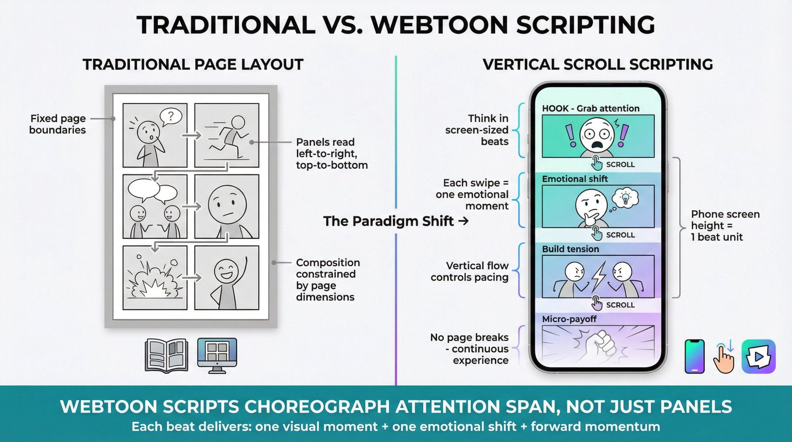

A webtoon script is closer to a screenplay than a novel.

### Think in "Phone Screens," Not Panels

The fundamental unit of a webtoon isn't a panel. It's a **screen-sized beat**.

Each beat should deliver:

- One visual moment (or small sequence)
- One emotional shift (curiosity to tension to humor to relief, etc.)

You're choreographing attention span, not just laying out panels.

### Simple Script Template (Copy This)

```
EPISODE #: [Title]

HOOK (opening beats - typically 1-3 mobile screens)
- Beat 1:
  Visual: [What the reader sees]
  Text: [Dialogue or narration]
  Purpose: [Emotion you're triggering: shock/curiosity/empathy/humor]

SCENE 1
- Beat 2:
  Visual:
  Text:
  Purpose:

- Beat 3:
  ...

SCENE 2
...

CLIFFHANGER (final beats - length varies by pacing)
- Final Beat:
  Visual:
  Text:
  Purpose: [A question the reader MUST answer next episode]
```

### Episode Length and Pacing

Common range: **30-60 panels per episode** for weekly series.

**Pacing guidelines:**

- Write natural-sounding dialogue broken across panels and speech bubbles
- Keep it snappy (webtoon readers scroll quickly)
- Avoid text-heavy panels that slow momentum
- _Something should happen_ in each episode (character development, plot event, joke payoff)
- Balance: Not too short (readers feel cheated), not too long (you can't keep it up)

It's perfectly fine to split long chapters into multiple episodes. Better to maintain pace than cram everything together.

### What Web Serial Writers Must Adapt

If you're adapting [prose fiction to webtoon format](https://www.patron.com/blog/category/writing/):

**Narration becomes visuals:** Replace internal monologue with facial expressions, framing, environment details. _Show, don't tell_ becomes mandatory.

**Dialogue must be shorter:** Long blocks kill scroll momentum. Break it up or cut it down.

**Every scene needs visual purpose:** If it's only exposition, compress it or cut it entirely.

**Focus on visually translatable moments:** Action, emotion, revelation translate best to visual medium.

## Storyboarding for Scroll: The Screen-by-Screen Method

Most beginner webtoons look like this: panels stacked vertically with no rhythm or flow.

Professional [webtoons](https://www.patron.com/blog/category/webcomics/) look like this: **controlled sequences of reveals** that manage attention and emotion.

### The Screen-by-Screen Storyboard Pass

Add a "phone screen guide" rectangle in your storyboard file. Some apps have preview tools that simulate this.

Storyboard with attention to **pacing and panel sequencing** rather than rigid formulas. Break your narrative into key beats and milestones. Many creators use storyboards to plan story flow, timing between panels, and visual rhythm.

One common approach organizes beats like this (though your pattern may vary):

- Establish location and mood
- Show character objective
- Introduce conflict
- Build escalation
- Deliver micro-payoff

The specific structure adapts to your story needs.

### Thumbnailing Process

**Quick rough layouts** are your friend here.

- Sketch stick figures and scribbles to figure out panel composition
- Goal: Nail the storytelling flow, not make pretty drawings
- Decide how each script moment translates into panels
- Vary panel sizes to create visual rhythm

> **Spacing rule:** Bigger emotional beats deserve more vertical space. If you want the reader to _pause_, you must _create a pause_ with whitespace.

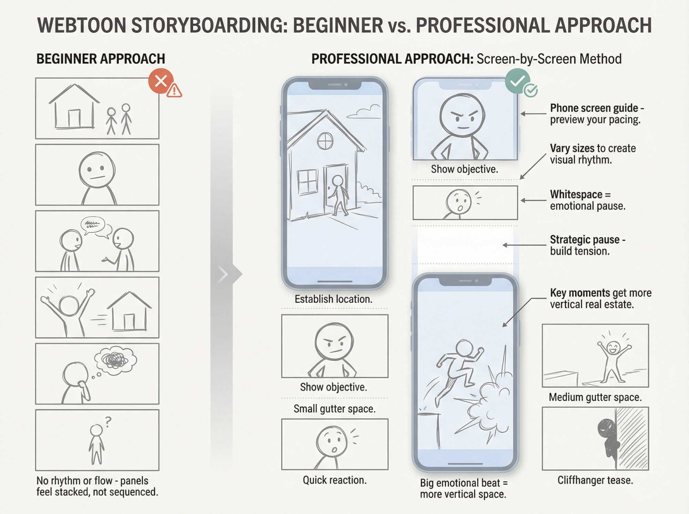

### Paneling and Composition

**Webtoon panels are separated by whitespace (the "gutter").**

- Think one-column vertical format, not traditional page layouts
- Mix long vertical panels (establishing shots, dramatic action) with smaller panels
- Use close-ups on faces for emotional moments
- Wide panels for big reveal scenes
- Plan speech bubble placement so you don't cover important art

### Finished is Better Than Perfect

Don't get stuck perfecting your storyboard.

Your roughs don't need to look good. They're just for you. The point is to lay down the storytelling beats.

**Complete the episode's draft rather than keep redrawing one perfect panel.** Efficiency is survival in ongoing content production.

## The Art Pipeline That Survives Weekly Deadlines

Your pipeline needs to do two things at once:

1.  Look good enough to earn readers
2.  Ship reliably enough to keep them

These goals sometimes conflict. Balancing them is the challenge.

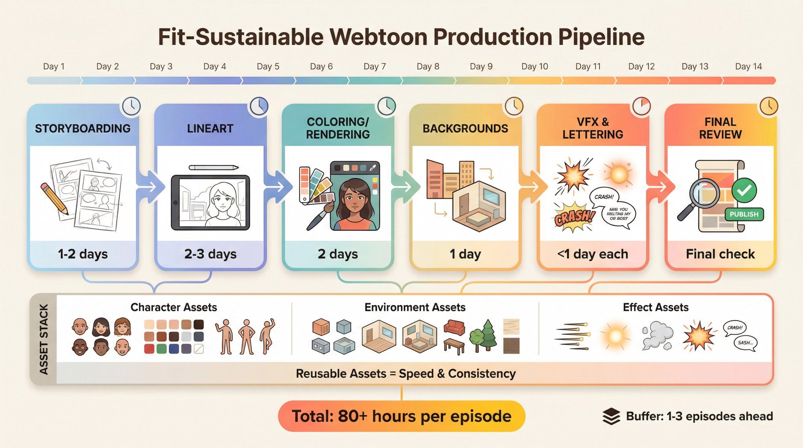

### Sustainable Weekly Pipeline Example

Weekly schedules vary widely but commonly span **7-14 days** of work time. A typical breakdown based on [industry data](https://tips.clip-studio.com/en-us/articles/7481):

| Stage                  | Time Allocation |
| ---------------------- | --------------- |
| **Storyboarding**      | 1-2 days        |
| **Lineart**            | 2-3 days        |
| **Coloring/Rendering** | 2 days          |
| **Backgrounds**        | 1 day           |
| **VFX & Lettering**    | \<1 day each    |
| **Final Review**       | Final check     |

Total: **80+ hours per episode** on average. Maintaining a buffer of 1-3 episodes ahead is essential for sustainability.

### Simplification Strategies When Weekly Feels Impossible

If you're drowning, simplify:

- Fewer panels per episode
- Simpler backgrounds (or reuse them more)
- Flatter rendering style
- Smaller cast per episode
- Fewer location changes

**There's no shame in this.** _Shipping consistently beats shipping perfectly_.

### The "Asset Stack" That Speeds You Up

Create and reuse these elements:

**Character assets:** 5-10 expression variations per main character, plus color palette per character (skin/hair/clothes)

**Environment assets:** Recurring backgrounds like bedroom, street, café, school. Also recurring props such as weapons, phones, books.

**Effect assets:** Speed lines, glows, smoke, impact effects

This is how teams ship at scale. Solo creators need this even more.

### Drawing Process Details

**Sketching and inking:**

Use your storyboard as a guide. Refined sketch layer first, then **ink lineart** on top. Draw clean lines that read well on small screens. Zoom out or preview at phone size to check readability.

**Coloring and shading:**

Most [webtoons](https://www.patron.com/blog/category/webtoon/) are fully colored (black-and-white is rare but possible). Flat colors first (layer beneath line art). Add shading, highlights, effects on additional layers. Develop a **color workflow** that isn't too time-consuming. Cell shading (clean shadows) vs. fully painted rendering (choose based on what you can sustain).

**Background strategy:**

Don't draw super detailed backgrounds for _every_ panel. Focus detail on key establishing shots and important moments. Simplify or use abstract backgrounds (gradients, speed lines) for dialogue panels. _Budget panels_ keep flow going while you spend time on big impactful moments.

**You don't need every panel to be a masterpiece.** Your readers care more about story momentum than perfect rendering.

## Lettering and Readability

Webtoon readers consume on mobile. If your text is hard to read, you'll lose them even if your art is incredible.

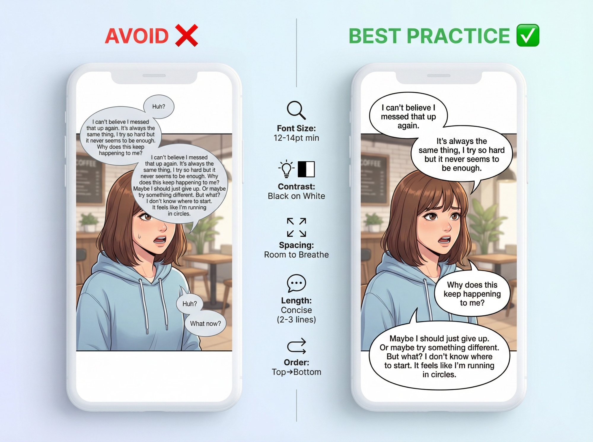

### Practical Lettering Rules

**Text brevity:** Keep it short. Let art do heavy lifting.

**High contrast:** Black text on white speech bubbles is standard for good reason.

**Breathing room:** Don't cram bubbles into busy artwork. Give text space.

**Font size:** Large enough to read comfortably on phone screens (**12-14pt minimum** at 800px width).

[WEBTOON's creator checklist](https://www.webtoons.com/) explicitly emphasizes mobile readability.

### Text and Speech Balloons

**Font choice:** Use clear, legible fonts. Comic-style or all-caps for speech works well.

**Speech balloon creation:** Oval or rectangular balloons behind text. High contrast for readability. Tail pointing to the speaking character.

**Dialogue length:** Keep it concise. Long monologues kill momentum. Break long sentences into multiple balloons or panels. Place balloons in reading order (top to bottom, left-most first).

> **Writing tip:** Write _less_ text than you think you need. Let facial expressions and body language carry emotional nuance. Text should guide main points, not explain everything.

## Episode Architecture: Hook, Escalate, Cliffhanger

There's no single perfect panel count, but there **is** a perfect structure.

### The 3-Part Episode Structure

Every episode should follow this pattern:

**1. Hook (opening beats):** Earn the reader's attention immediately. The exact panel count varies by creator and pacing, but think of it as the first 1-3 mobile screens.

**2. Escalation (middle section):** Deliver story progression, character development, or emotional payoff

**3. Cliffhanger (closing beats):** Create inevitability so readers _have to_ read the next one. Panel count varies based on your pacing needs and story rhythm.

### Vertical Flow and Strategic Spacing

The vertical scroll format lets you control _time_ with space.

**Spacing techniques:**

- Extra blank space before big reveals or scene transitions (builds anticipation)
- Fast-paced dialogue: panels closer together to keep momentum
- Very tall panel: slows reader down as they scroll through it, emphasizes dramatic moment
- [WEBTOON allows extremely long episodes](https://www.webtoons.com/) with a maximum upload of 20MB per episode. Individual images are limited to 800x1280px, but the platform automatically slices longer vertical episodes to fit specifications

**Test your episode** in a vertical viewer or on your actual phone. Adjust spacing based on how it _feels_ to scroll through.

### Buffer Strategy That Prevents Burnout

For weekly publishing:

- **Launch buffer:** 3 episodes ready before you publish anything
- **Ongoing buffer:** Stay 1-3 episodes ahead of your publication schedule

This protects you from unexpected life events, creative blocks, or just needing a break. Readers forgive a lot, but they won't forgive abandonment.

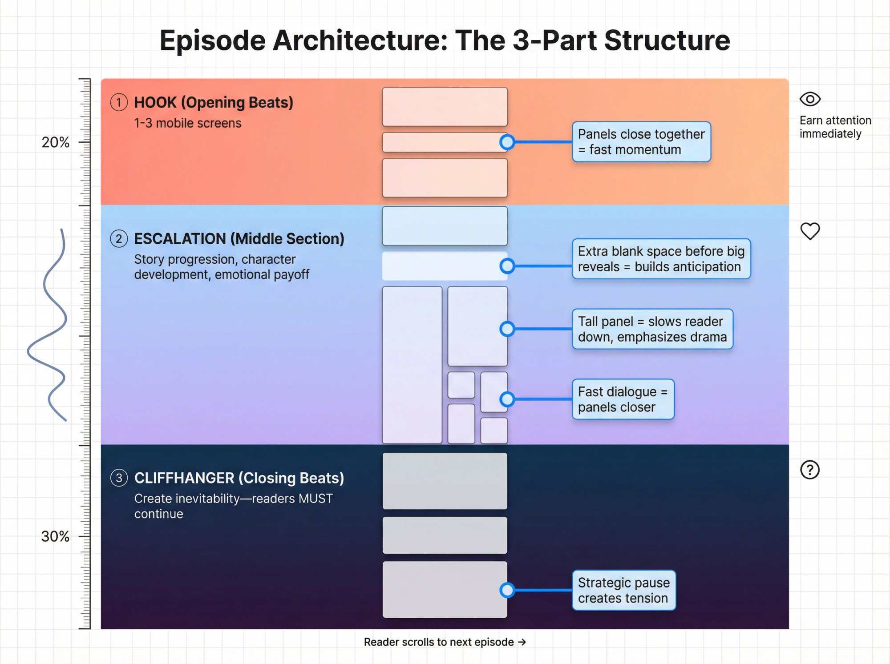

## Export and Upload Specs (Don't Let Compression Ruin Your Art)

This section matters because upload limits can silently destroy your art quality through automatic compression.

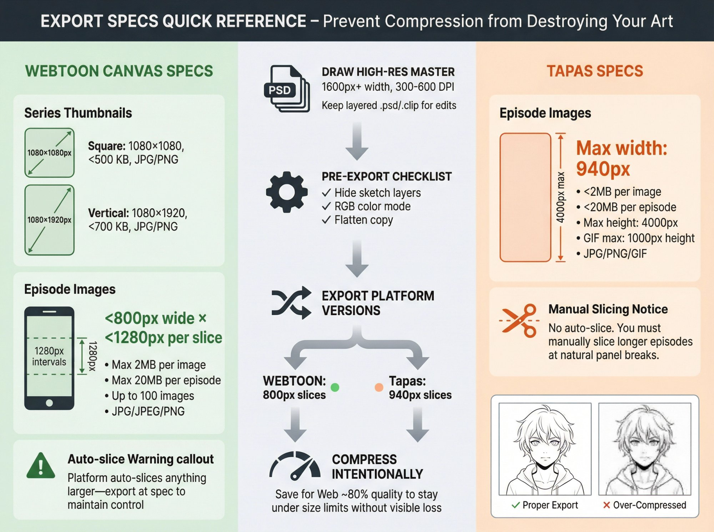

This section matters because upload limits can silently destroy your art quality through automatic compression.

### WEBTOON CANVAS: Series and Episode Thumbnails

[WEBTOON requires](https://www.webtoons.com/) both square and vertical series thumbnails, plus episode thumbnails:

| Thumbnail Type  | Dimensions                | Max File Size | Format       |
| --------------- | ------------------------- | ------------- | ------------ |
| Square series   | **1080×1080**             | \<500 KB      | JPG/JPEG/PNG |
| Vertical series | **1080×1920**             | \<700 KB      | JPG/JPEG/PNG |
| Episode         | **202×142** (recommended) | \<500 KB      | JPG/JPEG/PNG |

_Optimization tip:_ Adjust image quality (e.g., "Save for Web" at around **80% quality**) to stay under size limits without visible degradation.

### WEBTOON CANVAS: Episode Image Requirements

From [WEBTOON's official creator checklist](https://www.webtoons.com/):

- Images should be **\<800px wide** and **\<1280px long** per slice
- System may auto-slice/optimize anything larger (which ruins your control)
- **Max 2MB per image**
- **Max 20MB total per episode**, up to 100 images
- Supported formats: JPG/JPEG/PNG

**The implication:** Even if you draw on a huge canvas, your final upload must survive compression. Export strategically.

### Tapas: Episode File Requirements

From [Tapas File Size Guide](https://www.creators.tapas.io/file-size-guide):

- **Maximum width:** 940px
- **File size:** Each image under 2MB; total episode under 20MB
- **Maximum height:** 4000px (GIF images limited to 1000px)
- Supported formats: JPG/PNG/GIF

Note: Tapas does not auto-slice images like WEBTOON. You must manually slice longer episodes to meet height requirements.

### Technical Checks Before Export

**Pre-export checklist:**

- Hide any guidelines or sketch layers
- Ensure color mode is **RGB** (web requires RGB, not CMYK)
- Keep layered master file for future edits, export flattened copy
- Final uploaded files usually **JPEG format** (PNG if transparency needed)

**Slicing strategy:**

Many artists export full vertical image then slice into 1280px high chunks. [**Clip Studio Paint EX**](https://www.clipstudio.net/en/) can automate slicing during export. If slicing manually, cut at natural breakpoints between panels. Name files in order (Episode1_1.jpg, Episode1_2.jpg, etc.)

## How to Publish on WEBTOON CANVAS (Step-by-Step)

[WEBTOON CANVAS](https://www.webtoons.com/) publishing happens through the website, not the mobile app.

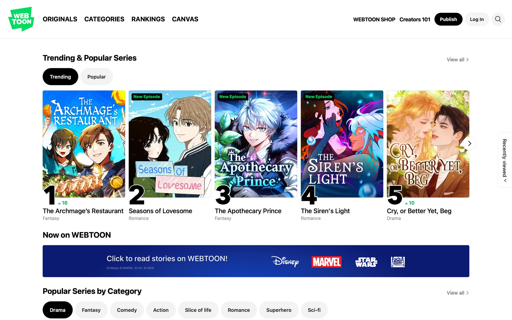

### High-Level Process

1.  Create account + creator nickname
2.  Click the **Publish** button on website
3.  Fill in series info: title, categories, summary
4.  Upload series thumbnails (square and vertical)
5.  Agree to policies and terms
6.  Upload episode files + episode thumbnail
7.  Preview or **schedule** episodes for specific day/time before publishing

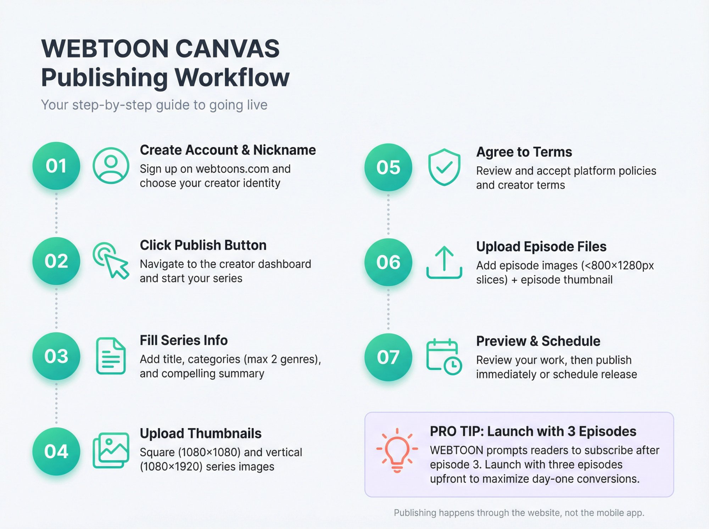

### Platform Choice Strategy

**Biggest platform:** [WEBTOON](https://www.webtoons.com/) with Canvas section for user-generated content (around **160 million monthly active users**)

**Other popular platform:** [Tapas](https://tapas.io/)

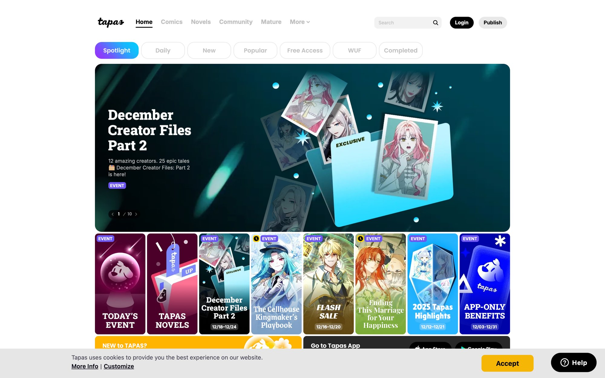

**Others:** ComicFury, GlobalComix, etc.

**Multi-platform publishing:** You _can_ publish on multiple platforms simultaneously (WEBTOON Canvas and Tapas both allow this). Just be aware that if you sign an exclusive contract later (like becoming a WEBTOON Original), you might have to remove other postings.

For beginners, **Canvas and Tapas are both great non-exclusive options**.

### Launch Strategy: The First Episodes Matter Most

**Recommended approach:** Launch with **3 episodes upfront**.

**Why this works:**

- Readers are more likely to subscribe if they can read several episodes and get hooked
- [WEBTOON's app prompts users to follow after finishing the third episode](https://www.webtoons.com/)
- Helps you gain subscribers from day one
- Tests whether your production pipeline actually works

If you don't have three full episodes ready, you _could_ break one long episode into parts, but each should make sense as a standalone reading experience.

**After launch:** Stick to a **consistent update schedule**. Consistency matters more than frequency.

### What Update Frequency Works for Webtoons?

**Most successful** [**webtoons**](https://www.patron.com/blog/category/webtoon/) **update weekly or biweekly on a set day.**

Choose a schedule you can handle without burning out. It's better to update _consistently_ (every Friday) than bunch updates one month and then disappear.

Consistency keeps readers engaged and builds anticipation for your next release.

### Use Platform Features to Your Advantage

**Series setup:**

Fill out series info with compelling description. Select up to two genres on WEBTOON that fit your comic. Tag series with relevant keywords.

**Reader engagement:**

Enable **subscribe/follow** so fans get notifications. Respond to reader comments (early engagement turns casual readers into loyal fans).

## How to Grow Your Webtoon Audience

You can't [earn from what you can't retain](https://www.patron.com/blog/category/monetization/).

### The Growth Loop

This is how successful webtoons compound:

1.  **Hook readers** with strong opening episodes
2.  **Get subscribes** through quality and consistency
3.  **Ship episodes** reliably
4.  **Convert superfans** into paying supporters
5.  **Use supporter revenue** to sustain (or improve) production
6.  **Deliver better quality** and consistency
7.  **Repeat**

### The "Episode 3 Conversion Moment"

Because [WEBTOON triggers a subscribe prompt](https://www.webtoons.com/) after readers finish the third episode:

- **Episode 1:** Premise + character introduction + inciting incident
- **Episode 2:** Escalation + consequences of Episode 1
- **Episode 3:** First major payoff + next burning question

This is your conversion funnel. Make it count.

### Why Consistency and Reliability Beat Everything

**The most important factor in audience growth:** Update consistency.

Many readers only check out new series if they see regular updates. Even if early growth is slow, readers who find your comic will stick around if they can count on you.

One creator's advice: _"You won't get readers overnight... It will be a quiet start, so appreciate the few who see your comic first and keep posting."_

As your archive grows:

- New readers have more to binge (they're more likely to subscribe)
- Your work appears in more searches
- The compound effect kicks in

Treat your webtoon like a commitment to your readers.

### Engage with Your Readers

Building community turns readers into fans:

**Simple engagement tactics:** Reply to comments on episodes ("Thanks for reading!" goes a long way). Answer questions when you can. Encourage readers to like and share if they enjoyed the episode.

**Social media presence:** Create accounts for your webtoon on Instagram, Twitter (X), TikTok. Share updates, behind-the-scenes sketches, character art. Join webtoon creator communities on Discord.

**Community building:** Strong webtoon communities exist on social media and Discord servers. Genuinely contribute and make friends (don't just spam links).

### Cross-Promotion with Fellow Creators

**Networking pays off:**

Connect with creators at similar stage or in similar genre. Cross-promotions: recommend each other's series at end of episode. Mutually beneficial audience sharing. Make sure it's a comic you genuinely think your readers would like.

Some platforms have forums or social media threads specifically for finding cross-promo partners.

### Content to Create Every Week (Fast Marketing)

Don't overthink social media. Create these quickly:

- 1 hook panel crop (vertical format for Instagram/TikTok)
- 1 character reaction crop
- 1 "next episode" tease line
- 1 behind-the-scenes post (for supporters or general audience)

This takes 15-30 minutes and keeps you visible between episodes.

## Web Serial to Webtoon: The Writer-First Adaptation Path

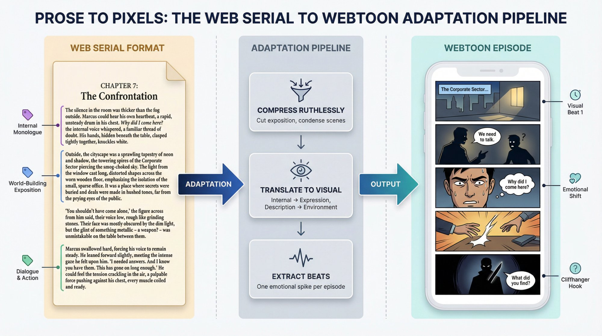

If you're a [web serial writer](https://www.patron.com/blog/category/web-serial/), you already have a superpower: **you understand serialization**.

A webtoon is exactly that, just visual.

### Step 1: Choose the Right Arc to Adapt

Pick a story arc that has:

- Clean inciting incident
- Tight antagonist or problem
- At least 3 strong cliffhanger moments built in
- Minimal location changes (cheaper and faster to draw)

Don't try to adapt your entire novel at once. Start with a contained arc.

### Step 2: Convert Chapters to "Episode Beats"

Most webtoon episodes are **not** "one chapter = one episode."

Instead: Compress exposition ruthlessly. Keep only moments that translate visually. Aim for one emotional spike per episode.

Prose can carry internal monologue and world-building paragraphs. Comics can't. Cut aggressively.

### Step 3: Hire Smart (If You're Not Drawing)

At minimum you need:

- **Storyboard/layout artist** OR lead artist who can handle full pipeline
- **Letterer** (yes, it matters for readability)
- Optional but helpful: flat colors assistant, background specialist

### Step 4: Write Contracts Like a Producer

Not legal advice, but your agreement should clearly state: Who owns what (IP rights + original files). Deadlines + revision limits. Payment terms and schedule. Crediting (how names appear in episodes). What happens if someone stops mid-season. Whether artist can sell prints or commissions of your characters.

**This one step prevents most adaptation disasters.**

Web serial writers who skip contracts end up in nightmares where artists vanish mid-season with no recourse.

## Real Webtoon Creator Case Studies (Actual Numbers)

Let's look at creators who've built sustainable businesses around sequential content.

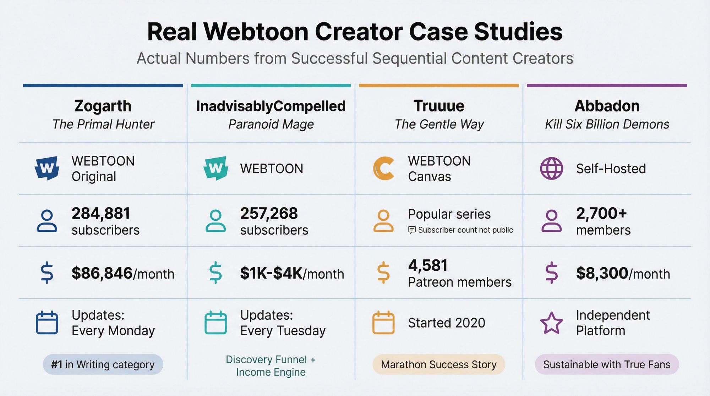

### Case Study 1: Zogarth (_The Primal Hunter_)

**Web Serial to WEBTOON Original**

**Metrics:**

| Platform                        | Performance            |
| ------------------------------- | ---------------------- |
| WEBTOON subscribers             | **284,881**            |
| WEBTOON views                   | **18.9M**              |
| Update schedule                 | Every Monday           |
| Monthly memberships (estimated) | **$86,846/month**      |
| Members                         | **10,646**             |
| Rank                            | #1 in Writing category |

_Sources:_ [_Graphtreon_](https://graphtreon.com/)_,_ [_WEBTOON_](https://www.webtoons.com/)

**What to learn:** Consistency plus serial momentum scales exponentially. IP that proves engagement in prose can justify investment in visual adaptation. Weekly cadence becomes part of the product, not just a schedule.

### Case Study 2: InadvisablyCompelled (_Paranoid Mage_)

**Web Serial to WEBTOON**

**Metrics:**

| Platform                        | Performance       |
| ------------------------------- | ----------------- |
| WEBTOON subscribers             | **257,268**       |
| WEBTOON views                   | **15.9M**         |
| Update schedule                 | Every Tuesday     |
| Monthly memberships (estimated) | **$1K-$4K/month** |
| Members                         | **517**           |

_Sources:_ [_Graphtreon_](https://graphtreon.com/)_,_ [_WEBTOON_](https://www.webtoons.com/)

**What to learn:** You don't need #1-in-the-world revenue to justify adaptation. A webtoon can be both a discovery funnel _and_ an income engine.

### Case Study 3: Truuue (_The Gentle Way_)

**Canvas Success Story**

Started in 2020 as a passion project combining judo and romance. Creator shared it on the Reddit judo community.

Early reader comment: _"Thank you for stepping up to fill the gap... \[Judo\] is tragically underutilized \[in stories\]. Reading your comic has increased my determination to become a judoka."_

**Current stats (Late 2025):**

| Metric              | Value                                               |
| ------------------- | --------------------------------------------------- |
| WEBTOON subscribers | Popular series (exact count not publicly displayed) |
| Patreon members     | **4,581 members**                                   |
| Platform            | WEBTOON Canvas                                      |

_Sources:_ [_WEBTOON Canvas_](https://www.webtoons.com/)_,_ [_Patreon TUJC_](https://www.patreon.com/TUJC)

Note: WEBTOON Canvas does not publicly display subscriber counts on series pages. The series has strong community engagement on Patreon.

**What to learn:** Growing a webtoon audience is a marathon. Even starting with a niche idea and few readers, dedication compounds over time. Engage early fans deeply (they become evangelists). Don't be afraid to be different. A unique angle helps you stand out.

### Case Study 4: Abbadon (_Kill Six Billion Demons_)

**Self-Hosted Webcomic**

**Metrics:**

| Platform            | Performance               |
| ------------------- | ------------------------- |
| Monthly memberships | **2,700+ members**        |
| Monthly revenue     | around **$8,300**         |
| Platform            | Own website (not WEBTOON) |

_Source: membership platform data_

**What to learn:** Even without massive traffic on big platforms, _a few thousand true fans can sustain a creator's livelihood_.

## How to Make Money from Your Webtoon

Once you have a decent following, you can start earning. It takes time and sizable readership, but it's absolutely achievable.

### Revenue Layer 1: WEBTOON Ad Revenue Sharing

**Eligibility requirements (as of 2025):**

- **40,000+ global monthly pageviews**, AND
- **1,000+ total subscribers**

**How it works:**

- [WEBTOON shares 50% of net ad revenue](https://www.webtoons.com/) with eligible creators
- Earnings update monthly (on the 21st of following month)
- Payment issued once you hit $100 (paid in $100 increments, by 15th of following month)

**Additional WEBTOON programs:**

- **Super Likes:** Direct fan support. Eligible at 500 total likes or higher for your series.
- **Reward Ads:** For high-traffic creators (requires [200,000+ US monthly pageviews](https://www.webtoons.com/)). Readers watch video ads up to 30 seconds to unlock episodes, generating revenue for creators.

**Reality check:** Ad rates are modest unless you're pulling millions of pageviews. Good supplemental income, rarely primary source unless you have massive readership.

### Revenue Layer 2: Fan Donations and Tipping

Some platforms allow direct tipping:

- [Tapas has ink tipping system](https://tapas.io/)
- WEBTOON has tipping features
- External options: Direct payment links in your social media

These are unpredictable and sporadic. Consider them "icing on the cake."

### Revenue Layer 3: Membership Platforms (The Primary Income Source)

**The model:** Offer paying subscribers extra perks, typically **early access to new episodes**, exclusive bonus content, and behind-the-scenes material.

This is where sustainable income lives.

**Platform fee comparison (2025):**

| Platform                              | Fee Structure                                                  | Open Source |
| ------------------------------------- | -------------------------------------------------------------- | ----------- |
| Traditional platforms                 | **10%** for new creators (as of Aug 2025) + payment processing | No          |
| [**Patron**](https://www.patron.com/) | **1% lifetime** for early adopters + payment processing        | **Yes**     |

_Sources: Industry data,_ [_Patron_](https://www.patron.com/)

### Why Membership Works for Webtoons

**The rolling paywall model:**

New episodes release to paying supporters first. After a set period (usually 1-4 weeks), those same episodes automatically unlock for free readers.

[This works so well for webtoons](https://www.patron.com/blog/post/what-is-a-rolling-paywall/) because:

**For you:**

- Predictable recurring revenue from superfans
- Early access is simple to deliver (you're already creating episodes)
- No additional work once the system is set up

**For free readers:**

- They can still eventually read everything if patient
- Your archive keeps growing as free content
- Builds discovery funnel through back catalog

**For paying supporters:**

- They stay ahead of the story
- Avoid cliffhangers and waiting
- Feel like VIPs supporting their favorite creator

### The Psychology Behind Rolling Paywalls

What actually happens:

1.  **New reader discovers your webtoon** through search, social media, or platform recommendation
2.  **They binge your free archive** (maybe 20-30 episodes)
3.  **They hit a cliffhanger** or run out of episodes at a crucial moment
4.  **Subscribe to get more immediately** instead of waiting weeks
5.  **Stay subscribed** to avoid falling weeks behind the story

Your back catalog works constantly, attracting new readers who might convert later. Meanwhile, your most engaged fans pay to stay ahead.

### How [Patron](https://www.patron.com/) Handles This

We built [Patron](https://www.patron.com/) specifically for [sequential content creators like webtoon artists](https://www.patron.com/blog/category/webcomics/).

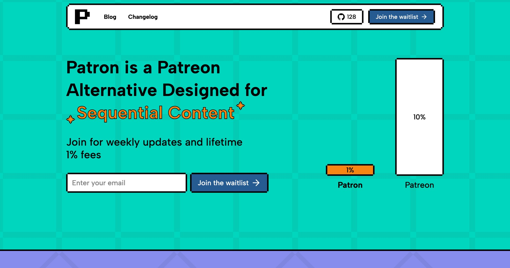

**What's different:**

- **Built-in rolling paywall scheduling** (no manual flipping posts from paid to public)
- **Series and episode organization** designed for serialized stories
- **1% platform fees** instead of 10% (for early adopters)
- **Open-source** (you can self-host if you want full control)

> **The math:** If you're earning $1,000/month from supporters: On traditional platforms, that's a $100 platform fee ($900 net). On [Patron](https://www.patron.com/), that's a $10 platform fee ($990 net). That's **$90 more per $1,000** staying in your pocket. Over a year, that's **$1,080**. Over five years? **$5,400**.

_Source: Fee calculations based on industry data and_ [_Patron's early adopter offer_](https://www.patron.com/)

### Proven Tier Structure for Webtoons

A tier structure that works:

| Tier                | Price      | Benefits                                    |
| ------------------- | ---------- | ------------------------------------------- |
| **Early Reader**    | $3/month   | 2 episodes early + supporters-only comments |
| **Binge Tier**      | $7/month   | 8-12 episodes early + hi-res downloads      |
| **Studio Pass**     | $15/month  | PSD timelapses + brushes + tutorials        |
| **Patron Producer** | $30+/month | Credits in episodes + monthly Q&A           |

**Key principle:** Higher tiers add _different value_, not just "more early access."

Learn more about [how to price your webtoon tiers](https://www.patron.com/blog/post/how-to-price-your-webcomic-tiers/).

### When to Launch Membership

**Don't rush it.**

Focus on building audience first. Generally recommended: reach a few thousand consistent readers before pushing membership heavily.

If you launch too early with a handful of readers, an empty membership page can be discouraging.

**Communication is key:**

Clearly explain how fans can support you. Tell them exactly what they'll get in return. Keep your promises (if members get 2 episodes early, maintain that buffer). If life happens and you need to pause, update your supporters with transparency.

### Revenue Layer 4: Merchandise and Prints

If your comic grows popular, consider:

**Digital products:** PDFs or e-books of chapters. Bonus art packs. Wallpapers and printables.

**Physical products:** Printed volumes (Kickstarters work well for this). Art prints. Keychains, stickers, apparel.

**When it makes sense:** Usually after you've established a fandom. Physical merch especially can be risky and costly upfront.

Print-on-demand services let you offer products without large inventory investment.

### Revenue Layer 5: Official Publishing or Licensing

**WEBTOON Originals:** If your Canvas series becomes extremely popular, [WEBTOON might approach you](https://www.webtoons.com/) with an Originals deal. They pay (stipend/advance + performance bonuses) to produce your comic exclusively. Only a small fraction of Canvas series get this offer.

**Other licensing:** TV or animation adaptation. Print publishers picking up your series. International translations and distribution.

These are "endgame" possibilities if your series really takes off.

**Practical approach:** Focus on building sustainable independent income (membership, ads, merch) so you're not dependent on being chosen by a publisher. If the call comes, you'll be in a strong negotiating position because you already have revenue on your own.

## The 30-Day Launch Plan (Ship Your First 3 Episodes)

This is an aggressive but achievable timeline for launching a webtoon. Standard industry guidance recommends having at least one month's buffer of episodes ready before launch, but this accelerated approach can work if you're disciplined.

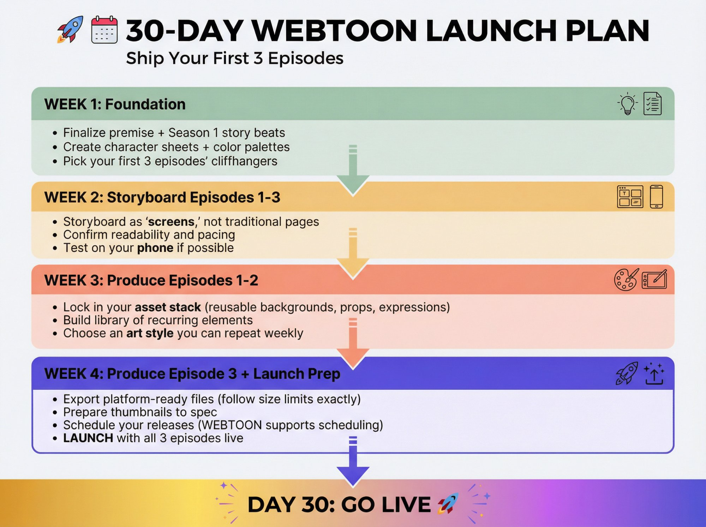

### Week 1: Foundation

- Finalize premise + Season 1 story beats
- Create character sheets + color palettes
- Pick your first 3 episodes' cliffhangers

### Week 2: Storyboard Episodes 1-3

- Storyboard as "screens," not traditional pages
- Confirm readability and pacing
- Test on your phone if possible

### Week 3: Produce Episodes 1-2

- Lock in your asset stack (reusable backgrounds, props, expressions)
- Build library of recurring elements
- Choose an art style you can repeat weekly

### Week 4: Produce Episode 3 + Launch Preparation

- Export platform-ready files (follow size limits exactly)
- Prepare thumbnails to spec
- Schedule your releases (WEBTOON supports scheduling)
- **Launch with all 3 episodes live**

## Keep Evolving, Stay Persistent

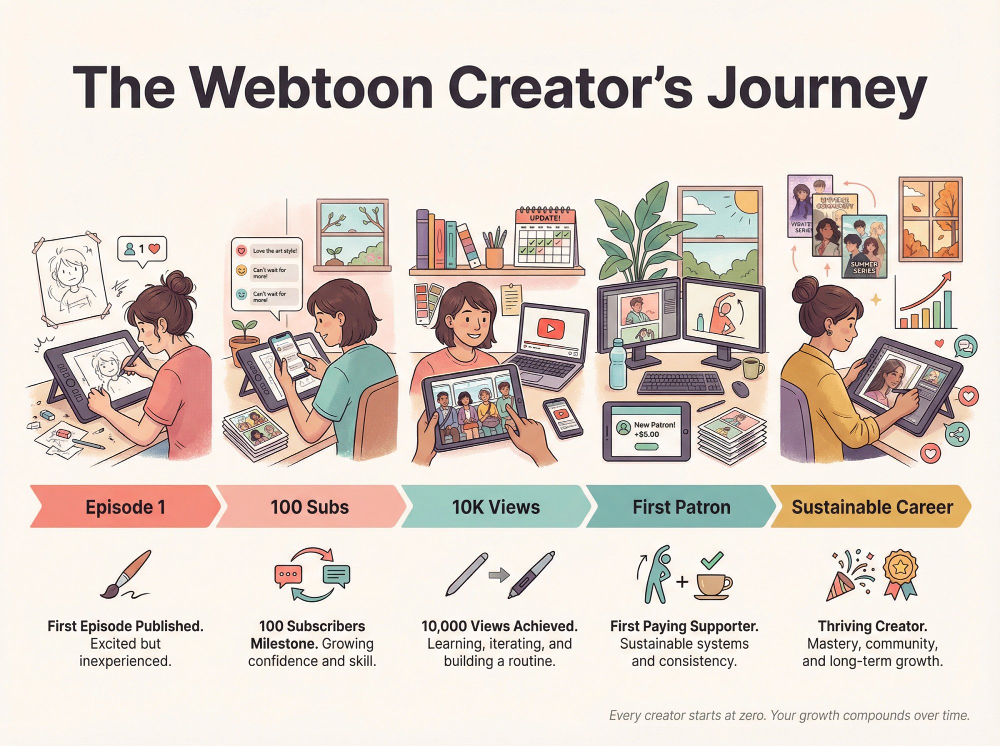

Making a [webtoon](https://www.patron.com/blog/category/webtoon/) is a marathon that can span years.

### Learn from Feedback

Pay attention to reader reactions:

Are people confused about plot points? Add clarity in future episodes. Did a particular episode get especially strong response? Analyze why (art quality, plot twist, emotional moment, humor). Use insights to inform future work.

Over time, you'll develop intuition for what your audience loves.

### Hone Your Craft

Continuously improve art and writing skills. Study [webtoons](https://www.patron.com/blog/category/webcomics/) you admire for paneling and pacing techniques. Watch tutorials (Clip Studio Tips, YouTube channels focused on comics). As you improve, incorporate new techniques (dramatic lighting, dynamic angles). Balance improvement with consistency (don't sacrifice update schedule by over-polishing).

### Manage Your Time and Health

**Burnout is real.**

Webtoon creation is time-intensive. It's better to find a pace you can sustain than sprint and collapse.

**Sustainability practices:**

Use buffering to give yourself breathing room. Take care of your drawing hand and arm (stretching, ergonomics). Protect your mental health. If you need a break or hiatus, _communicate_ with readers.

Making comics should be enjoyable, not just a grind. Most readers will be understanding if you're transparent about needing time off.

### Celebrate Milestones

Don't forget to enjoy the journey.

**Celebrate achievements:** First episode published. 100 subscribers. 10,000 views. 100,000 views. First paying supporter. First $100 month.

Each milestone is proof of your hard work and creativity. Thank your readers when you hit these moments. They'll feel part of your success story and become more supportive.

## Frequently Asked Questions

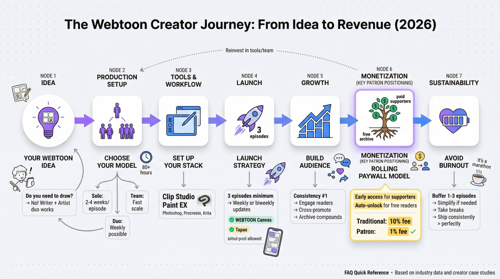

### How long does it take to make a webtoon episode?

It varies widely based on your art style, panel count, and production model. [Industry data shows episodes often require 80+ hours of work](https://tips.clip-studio.com/en-us/articles/7481). Solo creators working part-time may need 2-4 weeks per episode. Full-time creators with simplified styles can achieve weekly updates. Teams can produce faster by dividing work (writing, lineart, coloring, lettering).

_Key factors:_ Art complexity, episode length (30 vs. 60 panels), your skill level, and whether you're reusing assets efficiently.

### Do I need to know how to draw to make a webtoon?

You need _someone_ who can draw, but it doesn't have to be you. Many successful [webtoons](https://www.patron.com/blog/category/webtoon/) are collaborations between a writer and an artist. If you're a writer, you can hire artists or find collaboration partners. Just make sure you have clear contracts defining ownership, deadlines, and payment.

### What's the best software for making webtoons?

[**Clip Studio Paint**](https://www.clipstudio.net/en/) **is one of the most popular and widely-used software for webtoon creation**, particularly the EX version which includes webtoon-specific features like auto-slicing for vertical scroll format. Other solid options: Photoshop (general-purpose), Procreate (iPad), Medibang Paint (free), Krita (free).

### How much money can you make from webtoons?

Webtoon earnings range from zero to potentially six figures monthly, though six-figure earners are extremely rare exceptions. Most Canvas creators earn modest amounts ($100-$1,000/month from ads and tips), while featured Originals creators typically earn $2,000-$5,000/month base pay.

The real money comes from **membership platforms** where superfans pay for early access. [Webtoon creators with paying supporters](https://graphtreon.com/) earn varying monthly income. Examples show creators earning from $1,300 to $13,000+ monthly on Patreon, depending on their supporter base and tier pricing.

_Source:_ [_Graphtreon earnings data_](https://graphtreon.com/)

### How many episodes should I have before launching?

**Launch with 3 episodes minimum.** [WEBTOON explicitly recommends this](https://www.webtoons.com/) because readers get a subscribe prompt after finishing the third episode. Having 3 episodes upfront gives new readers enough content to get invested in your story.

### How often should I update my webtoon?

**Weekly or biweekly on a consistent day** is ideal. Consistency matters more than frequency. It's better to update every other Friday reliably than post randomly. Consistency builds reader trust and habits.

### Can I publish my webtoon on multiple platforms?

Yes! [WEBTOON Canvas](https://www.webtoons.com/) and [Tapas](https://tapas.io/) both allow non-exclusive publishing. Many creators simul-post to both platforms for broader reach. Just be aware that if you later sign an exclusive contract (like becoming a WEBTOON Original), you might need to remove your series from other platforms.

### What's a rolling paywall and why does it work?

A [rolling paywall](https://www.patron.com/blog/post/what-is-a-rolling-paywall/) means new episodes are available to paying supporters first, then automatically unlock for free readers after a set time (usually 1-4 weeks).

**Why it works:** Your archive builds up as free content that attracts new readers. When they binge and hit a cliffhanger, many subscribe to get episodes immediately. Meanwhile, paying supporters stay ahead of the story. It's the best balance between discovery (free archive) and income (paid early access).

### How do I grow my webtoon audience?

**Consistency is #1.** Update on schedule, engage with reader comments, share behind-the-scenes content on social media (Instagram, TikTok, Twitter), and participate in creator communities. Cross-promote with fellow creators in similar genres. Focus on quality storytelling and the audience will compound over time.

### Should I use a membership platform for my webtoon?

Both traditional and modern platforms work, but there are key differences:

| Feature                      | Traditional                  | [Patron](https://www.patron.com/) |
| ---------------------------- | ---------------------------- | --------------------------------- |
| Platform fee                 | **10%** (new creators, 2025) | **1%** (early adopters)           |
| Built for sequential content | No                           | Yes                               |
| Rolling paywall automation   | Manual workaround needed     | Built-in                          |
| Open source                  | No                           | Yes                               |

If you're creating [serialized content like webtoons](https://www.patron.com/blog/category/webcomics/), [Patron's](https://www.patron.com/) built-in features and lower fees are designed specifically for your workflow.

### How do I handle burnout?

**Prevention beats cure:**

Build a buffer of 1-3 episodes ahead. Simplify your art style if needed. Use reusable assets aggressively. Take scheduled breaks (communicate with readers). Don't feel guilty about protecting your health.

Many successful creators take planned hiatus between seasons. Readers prefer transparency and occasional breaks over sudden abandonment.

### What if my art isn't perfect?

Your art will improve as you create more episodes. Readers are surprisingly forgiving of rough early art if the story is compelling. **Shipping consistently beats shipping perfectly.** Many popular [webtoons](https://www.patron.com/blog/category/webtoon/) have visibly improved art quality over their run. Don't let perfectionism stop you from launching.

---

## Final Thoughts: Just Start

Creating a webtoon is one of the most rewarding creative projects you can take on. You'll bring characters to life, build a world panel by panel, and touch readers' hearts and imaginations.

**Challenges exist:** Slow initial growth, creative blocks, technical headaches, balancing production with life.

**But stick with it.**

Even creators who started with humble beginnings have grown to massive audiences and made livings from their art.

The key ingredients:

- Produce a story you're passionate about
- Connect genuinely with your community
- Keep improving little by little
- Ship consistently

**Remember:** Every famous webtoon creator started with zero subscribers. Growth can be exponential (the first 100 readers are the hardest to get, but 100 can become 1,000, then 10,000, then 100,000).

The key is to **persist and keep your readers happy** by delivering the story you promised on a regular schedule.

Now that you have this roadmap, **it's time to take action.**

Brainstorm that story idea. Draw that first character. Script that first episode. Then keep going.

The webtoon world is waiting for the next great series.

It just might be yours.

---

Ready to start [earning from your webtoon with rolling paywalls](https://www.patron.com/blog/post/what-is-a-rolling-paywall/) and early access tiers? [Check out Patron](https://www.patron.com/) to see how we're helping [sequential content creators](https://www.patron.com/blog/category/webtoon/) keep more of their earnings while building sustainable supporter communities.
