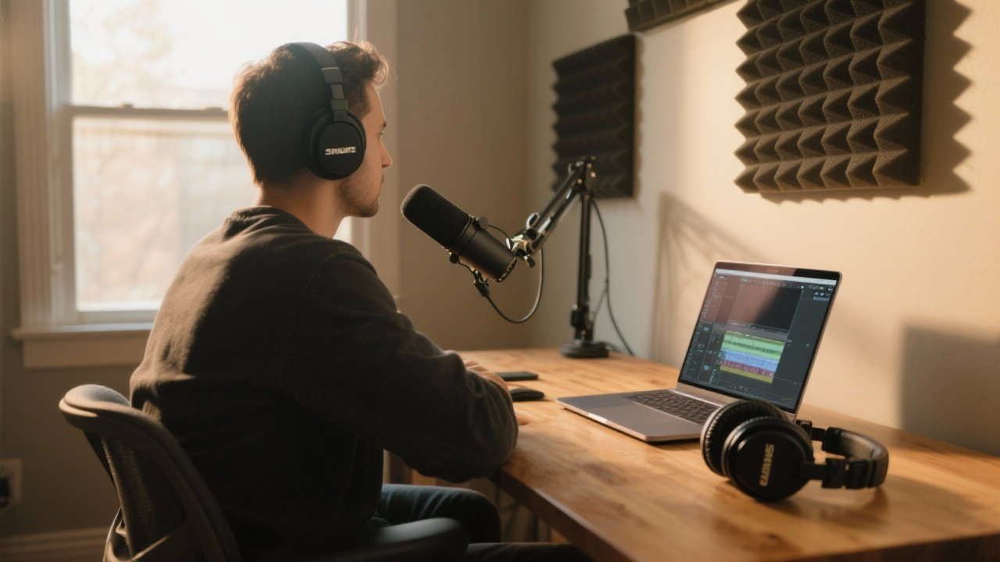

Podcast ads pay $18 to $50 per 1,000 listens. At that rate, you need 10,000 downloads per episode to earn $250. Most indie podcasters never reach those numbers.

**There's a better way.** Early access memberships with rolling paywalls let your most engaged listeners support you directly by getting episodes before everyone else. No more chasing advertisers.

Here's how rolling paywalls work. You release new episodes to paying subscribers first, then those same episodes automatically become free after a set delay (usually 3 to 7 days). Your paying fans get exclusive early access, while your free feed continues building your audience through your unlocked archive.

This creates a powerful conversion loop. New listeners discover your show through free episodes, binge the back catalog, hit the paywall when they catch up to current content, and subscribe to hear what happens next immediately instead of waiting. They stay subscribed because falling even a few episodes behind means waiting weeks to catch up.

The psychology is simple. If someone loves your content enough to listen to 50 free episodes, they'll pay $5/month to avoid waiting seven days for episode 51. Rolling paywalls capture that conversion moment.

## Why Early Access Beats Podcast Advertising

Advertising revenue requires massive scale. Early access memberships let even a small dedicated audience generate meaningful income.

A single patron paying $5/month equals the ad revenue from approximately 200 listens at $25 CPM. If 50 listeners convert to paid members, that's $250 monthly. The same as running ads for 10,000 downloads per episode.

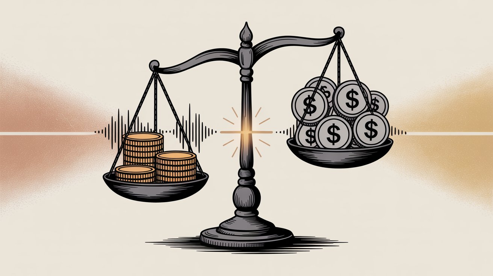

This model offers four key advantages. **Lower volume thresholds** let you monetize 500 true fans instead of needing 50,000 casual listeners. **Predictable recurring income** from monthly subscriptions provides stability that ad deals can't match. Paying members contribute 10 to 20x more than ad supported listeners. **No advertiser constraints** mean you can create content your audience loves without seeking sponsor approval.

| **Revenue Model** | **Income Per Listener** | **Volume Required** | **Predictability** |
| --- | --- | --- | --- |
| Advertising (CPM) | $0.02 to $0.05 | 10,000+ per episode | Low (seasonal) |
| Early Access | $3.00 to $7.00 | 100 to 500 members | High (monthly) |

Podcast industry data confirms this trend. Podcasters make up only 7.7% of creators on traditional membership platforms but account for nearly **14.8% of total creator payouts**. Podcast fans contribute disproportionately because audio content creates deeper engagement than other media.

Some podcasts generate over six figures monthly from listener subscriptions alone. You don't need those numbers to succeed. Even 20 to 30 paying members can cover your hosting costs and equipment upgrades.

Beyond revenue, direct support builds **closer community relationships**. When someone pays to support your show, they're invested in your success. Many creators leverage this through private Discord channels, Q&A sessions, or polls for future topics. This engagement is impossible to achieve with ad-supported listeners you never directly contact.

## What Are Rolling Paywalls for Podcasts?

Rolling paywalls solve the fundamental tension in podcast monetization. You need free content for discovery but also need revenue from your most engaged fans.

A traditional paywall locks all premium content behind permanent subscriptions. This maximizes per-subscriber revenue but kills your growth. New listeners can't sample enough content to convert, and your show becomes invisible to podcast apps and search algorithms that index free feeds.

Rolling paywalls introduce time based access windows. In a typical release schedule, new episodes drop for paying subscribers on Monday, then the same episode releases to the public feed on Friday. Paid members get a four day head start while free listeners still receive every episode, just slightly delayed.

This works because podcast consumption is time sensitive. Listeners don't want to fall behind. If they're three episodes back on a serialized show, they risk spoilers or feel disconnected from the community discussing current episodes. Early access creates urgency without creating resentment.

Think about your own listening habits. When you love a show, waiting a week for the next episode feels long. If your favorite podcast offered you the next three episodes right now for $5, you'd probably pay. Many listeners gladly pay that convenience premium.

### How Rolling Paywalls Build Your Podcast Audience

Rolling paywalls transform your archive into a discovery funnel. As episodes age, they unlock and become freely available. New listeners find your show, binge 50 free episodes, and get hooked. When they catch up to current content, they face a choice. Wait for weekly releases or pay to binge ahead.

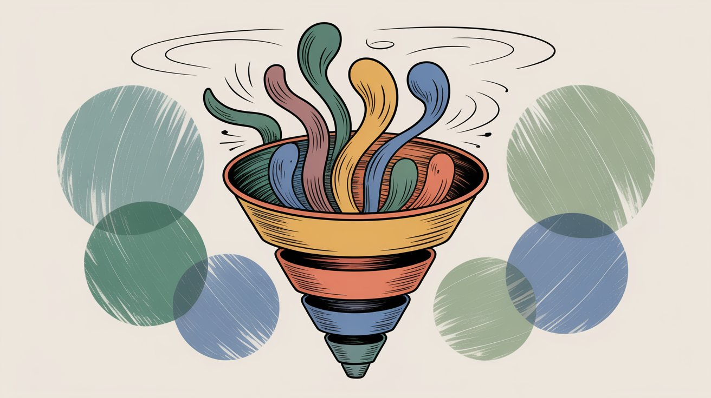

Rolling paywalls let you monetize early access while building organic discovery through your archive. It's the difference between a permanent paywall and a time release valve that keeps growing your audience.

Open-source membership platforms were specifically built for this model. These platforms automatically manage release schedules per tier, so you can offer different early access windows to different membership levels without manual publishing complexity.

Early access requires staying ahead in your recording schedule. If you promise episodes every Monday to subscribers with public release on Friday, you need to record at least a week in advance. Many successful podcasters maintain a three to four episode buffer so they never miss a subscriber deadline. Consistency matters more than anything when people pay you monthly.

## How Much Do Podcasters Earn from Early Access?

Let's look at specific examples of podcasters monetizing through early access and memberships.

### [The History of Egypt Podcast](https://www.egyptianhistorypodcast.com)

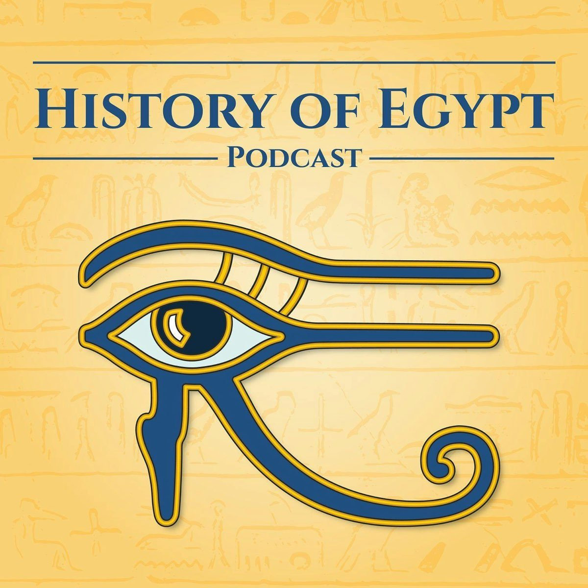

Dominic Perry runs a niche history show focused on ancient Egypt. His core membership tier costs $5/month and includes ad free episodes, early access, and bonus materials.

He explicitly reassured casual listeners that the main feed would remain free forever. This reduced friction for non paying fans while creating a clear value proposition for supporters. He also offered community engagement like quarterly giveaways and content polls for paying members.

The result is enough recurring revenue to cover hosting costs, research expenses, and equipment upgrades for a specialized show that wouldn't attract major advertisers.

### [Darknet Diaries](https://darknetdiaries.com)

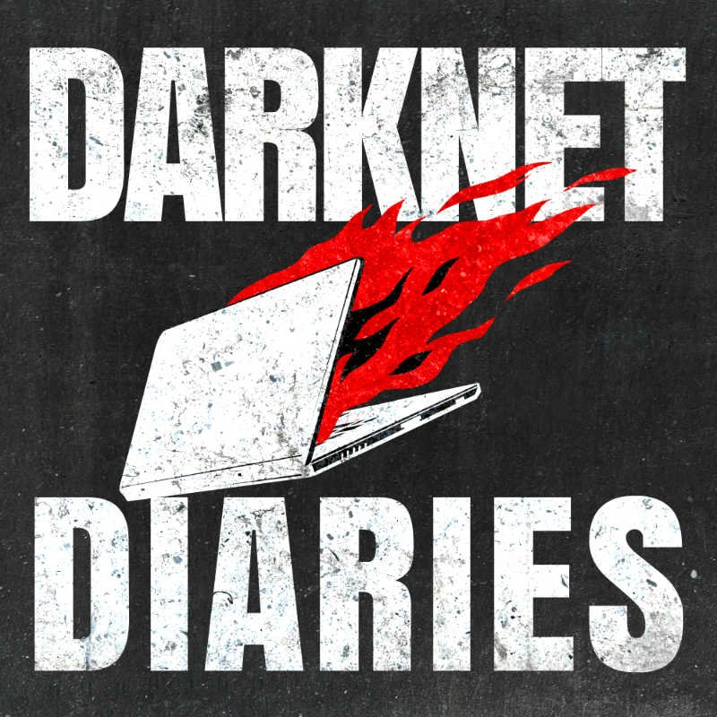

Jack Rhysider's cybersecurity podcast reaches hundreds of thousands of listeners. Despite having the audience size to command premium advertising rates, he monetizes primarily through direct support.

His membership approach is straightforward. Paying members get an ad free feed and periodic bonus episodes. Research shows the show had nearly 6,000 paying members generating about $20,000 per month.

When Jack experimented with podcast subscriptions, he gained 670 paying subscribers in 45 days with minimal promotion. This demonstrated latent demand from listeners who simply discovered the subscription option and chose to support the show.

Personal connection with supporters matters more than platform convenience. He sends thank you notes and merchandise to members. That relationship building drives retention far more effectively than any automated system.

### [True Crime Obsessed](https://www.truecrimeobsessed.com)

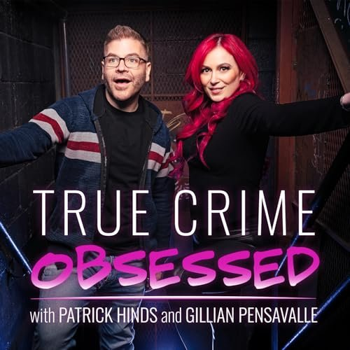

True Crime Obsessed demonstrates the revenue ceiling for listener supported podcasts. The show currently has approximately 49,000 paying members with estimated monthly earnings in the six figure range.

Their membership structure offers multiple tiers. A $5 tier with monthly bonus episodes and early access. A $10 tier adding everything above plus ad free versions. And $15+ tiers featuring exclusive merchandise, ringtones, and VIP access to live show tickets.

They've built a comprehensive fan experience that monetizes different levels of engagement. While most podcasters won't reach this scale, it proves the model works from 20 members to 20,000.

### Cross-Industry Validation

Serial fiction authors use the same model with remarkable success. Web novelist ArcaneCadence launched a story on Royal Road and within months attracted 3,500+ paying supporters earning over $30,000 monthly by offering advance chapters.

Her free readers get weekly chapter releases. Paying fans read 12 to 15 chapters ahead in the story. This read ahead model in fiction proves that serial content plus early access equals sustainable income across all media types.

## How to Set Up Early Access for Your Podcast

Let's walk through the actual implementation, from choosing your platform to delivering content to paid subscribers.

### Step 1. Choose Your Podcast Membership Platform

You have several options for hosting your membership.

**Open-source platforms.** Some platforms charge only 1% fees for early adopters, letting you keep 99% of subscription revenue (minus payment processing). These platforms were built specifically for sequential content creators, with features like automated release scheduling, series organization, and rolling paywall management.

**Traditional creator platforms.** Services like the established membership platforms charge 5-12% platform fees plus payment processing. They offer larger built-in audiences but take significantly more of your revenue.

**Native podcast apps.** App based subscriptions take 30% the first year and 15% thereafter. They don't provide subscriber contact information. Other native subscription services charge around 5% of subscriber revenue.

**Self hosted solutions.** If you're technical, WordPress plugins can generate private RSS feeds with no platform fees. You handle all the infrastructure yourself.

When choosing, consider what percentage of revenue you're willing to give up. 1% versus 30% is a massive difference. Consider where your audience already congregates and whether they're comfortable with external platforms. Consider how much technical complexity you can handle, and whether you need subscriber contact info for community building since some platforms don't share this.

Most podcasters start with a managed platform so they can focus on content rather than infrastructure. You can always migrate later as you scale.

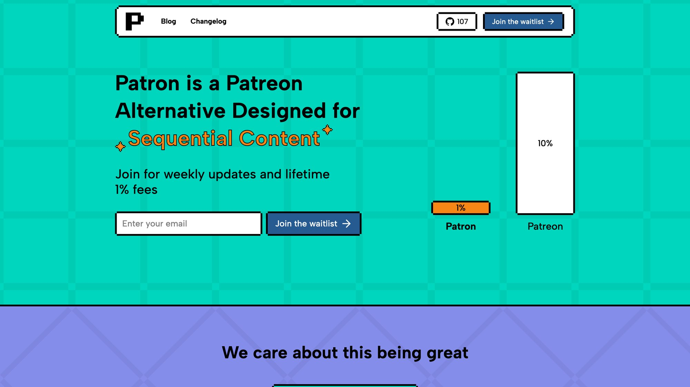

[Patron](https://www.patron.com) is a creator-friendly alternative to Patreon built specifically for sequential content. We take pride in our low 1% fee structure and rolling paywall automation, which are the exact features discussed throughout this setup guide.

### Step 2. How to Price Your Podcast Membership Tiers

The most effective approach uses two to three tiers at different price points. An entry tier at $3 to $5/month typically includes early access to all episodes, three to seven days ahead of public release, ad free listening, and member only updates or behind the scenes posts. This tier converts the most people because the value clearly exceeds the cost. Someone who listens to your show weekly gets four or more episodes per month early for less than a coffee.

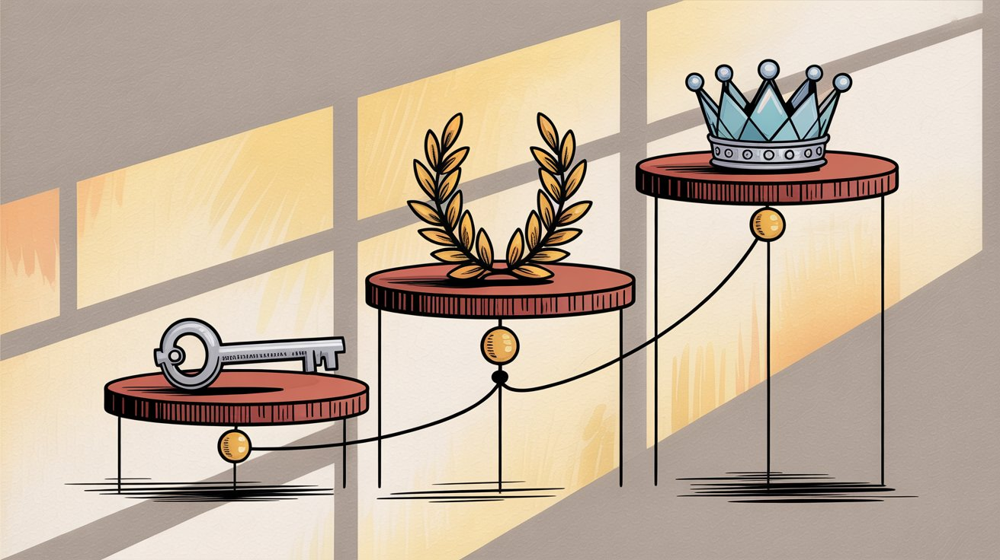

A standard tier at $7 to $10/month adds everything from the entry tier plus one bonus episode per month, extended interviews, Q&A sessions, or special topics. This tier also includes access to a private community like Discord, Slack, or members only chat, plus input on future episode topics via polls. Many supporters gladly jump to this tier for exclusive content, though you'll need to budget an extra two to three hours monthly to create one quality bonus episode.

The premium tier at $15 to $25/month includes everything in standard tier plus physical merchandise after three months like stickers or t shirts, monthly group video calls or live Q&A sessions, producer credits or shout outs in episodes, and first access to live show tickets or special events. Premium tiers attract superfans who want maximum connection to your show, but keep fulfillment manageable as you scale.

Your base tier should feel like an impulse buy. $5 is low enough that listeners don't over analyze the decision. Higher tiers let engaged fans contribute more while receiving proportional value.

For more insights on pricing strategy, check out our guide on [annual vs monthly membership](https://www.patron.com/blog/post/annual-vs-monthly-memberships-for-creators/) options.

### Step 3. Set Up Private RSS Feed for Podcast Members

The technical mechanism for early access is a private RSS feed. When someone subscribes, they receive a personal feed URL with authentication that works in any podcast app.

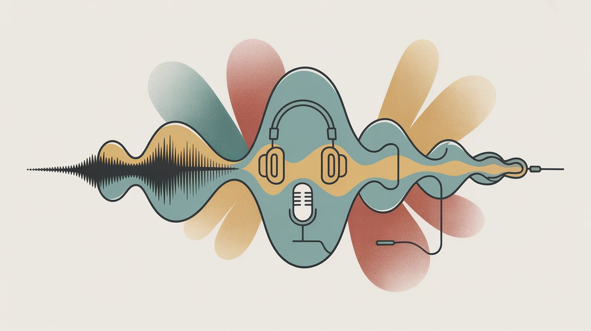

All managed membership platforms handle this automatically. Each member gets a secure feed link they add to Apple Podcasts, Overcast, Pocket Casts, or any standard podcast player.

Your member feed should include early releases of your regular episodes, which is the core value proposition, any bonus episodes or special content, and behind the scenes audio if you create it. Some creators put everything in the paid feed while others keep bonus content separate. Choose the system that's easiest for you to maintain. Consistency matters more than complexity.

Spotify doesn't support importing external private feeds. If you have many Spotify listeners, you'll need to either use Spotify's native subscription system for those users or guide them toward other podcast apps for premium content.

### Step 4. How to Promote Your Podcast Membership

Your audience won't automatically discover your membership option. You need to tell them repeatedly without being annoying.

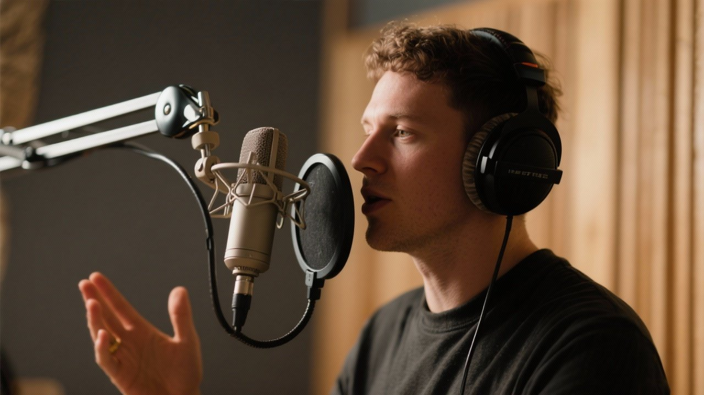

On air mentions are your most powerful tool. Include a 15 to 20 second call to action in every episode.

"Loving the show? Join our early access community. For $5 a month, you'll get every episode a week early, ad free. That's four bonus episodes compared to waiting for the public releases. Support us and never wait again."

Mention it in both your intro and outro. Some listeners skip intros. Others bail before the end. Cover both bases.

Show notes and descriptions should always include your membership link prominently. Use clear benefit focused language like "Get episodes early. Join for $5/month and hear new episodes a week before everyone else, completely ad free."

Social media bios across all platforms should link to your membership page. Periodically post reminders when big episodes are coming. "Patrons will hear tomorrow's season finale today at 3pm."

Email newsletter subscribers are highly engaged listeners likely to convert. Send them a dedicated announcement about your membership launch, then include a reminder in every monthly newsletter.

Limited time incentives can jumpstart conversions. Consider offering founding members a bonus like a physical sticker or extra content if they join within your first month. The History of Egypt Podcast did this by offering early subscribers entry into a giveaway for unique items.

Research indicates that even a 1% to 5% overall conversion rate is normal and profitable.

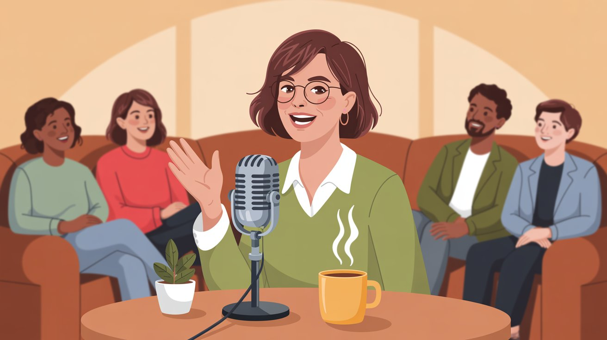

### Step 5. How to Keep Podcast Subscribers Long Term

Acquiring members is step one. Keeping them subscribed is where you actually build revenue.

Monthly recurring subscriptions mean a patron who stays for 12 months generates 12x the value of someone who tries one month and cancels. Retention is everything.

Consistency builds trust. If you promise episodes every Monday for paying members, hit that deadline every single week. Treat it like a commitment to partners, not casual listeners. If you ever need to skip a week, communicate proactively and consider extending their billing cycle or providing bonus content as thanks for patience.

Engage your supporters personally. Thank new members by name in a patron only post. Reply to their comments. Ask for their input on episode topics. People stay subscribed because of the personal connection as much as the content.

Deliver on promised perks. If your tier includes one bonus episode monthly, make sure it drops every month. Don't over promise what you can't consistently deliver. Better to under promise and over deliver occasionally.

Show appreciation regularly. Your paying members chose to support you when they could listen for free. That deserves recognition. Some creators do an annual thank you live stream, send physical cards to long term subscribers, or give early access to merchandise. Small gestures create deep loyalty.

Happy members become evangelists who convince friends to join. Word of mouth growth from satisfied supporters is one of the most powerful scaling mechanisms for membership models.

## Why Patron Works Better for Podcasters Using Early Access

Traditional membership platforms were designed for general creators, not specifically for sequential content like podcasts. That's why specialized platforms emerged.

### Automated Rolling Paywall Management

Specialized platforms handle the complexity of timed releases automatically. You upload an episode once and set your rules. Tier 1 members get immediate access. Tier 2 members get access after three days. The public feed gets access after seven days. The system manages scheduling across all tiers without requiring you to manually publish multiple times. You can change your windows whenever you want. The automation adapts instantly.

### Content Organization for Series

Podcasts are inherently sequential. Series focused platforms let you organize episodes chronologically with automatic next episode navigation. Your members can binge content in order without hunting for episode numbers or getting confused by out of sequence releases.

This matters more than you'd think. When someone subscribes and wants to catch up on your early access episodes, they need an intuitive way to listen in order. Generic membership platforms treat every post as independent. Specialized platforms built for serial storytelling from the ground up.

### Platform Fees That Keep Money in Your Pocket

Some platforms charge only 1% for early adopters, compared to 8% to 12% on traditional platforms or 30% on some app native subscription systems.

On $1,000 in monthly subscriptions, here's the comparison.

| Platform | Platform Fee | Your Net Revenue |
| --- | --- | --- |
| Low-Fee Platforms | 1% ($10) | $990 |
| Traditional Platforms | 8-10% ($80-$100) | $900-$920 |
| App-Native (Year 1) | 30% ($300) | $700 |

That extra $90 to $290 monthly compounds into thousands of dollars annually. At scale, the difference becomes massive.

Plus payment processing at typically 2.9% and $0.30 per transaction via Stripe, which applies across all platforms. Lower fee platforms don't take a cut on top of Stripe like some services do.

### Community Features for Engagement

Specialized platforms include built in community features like Discord integration, audience insights, and member communication tools. You can message your supporters, run polls, and build that personal connection that drives retention.

Some podcasters tell us that community features matter as much as the content delivery system itself. Your superfans want to feel like insiders, not just transaction numbers.

### Open Source and Transparent

Open source platforms like Apache 2.0 license let you see exactly how the platform works. For creators concerned about platform risk or vendor lock in, knowing you could self host if needed provides peace of mind.

Creator friendly platforms stay committed to low fees because they answer to creators, not venture investors demanding growth at any cost. Low fees aren't temporary. They're built to stay sustainable at minimal margins so podcasters keep more of their earnings.

Ready to monetize your podcast with early access? Start on a creator friendly platform today and set up your first membership tier in minutes. Try automated rolling paywalls and see why podcasters are choosing platforms built specifically for serial content creators.

## Other Podcast Membership Platform Options

While specialized platforms offer the best combination of features and pricing for podcasters, you should understand all your options.

### Traditional Creator Membership Platforms

The established platforms like Patreon (not to be confused with Patron, us!) have been around for over a decade. Their advantages include a large existing user base familiar with supporting creators, proven payment processing and customer support systems, and extensive creator resources and community. However, their disadvantages include higher fees at 8% to 12% platform fee, as documented in our [creator platform fee comparison articles](https://www.patron.com/blog/post/patreon-fee-changes-2025), plus payment processing, generic tools not optimized for sequential content, and less control over your member experience.

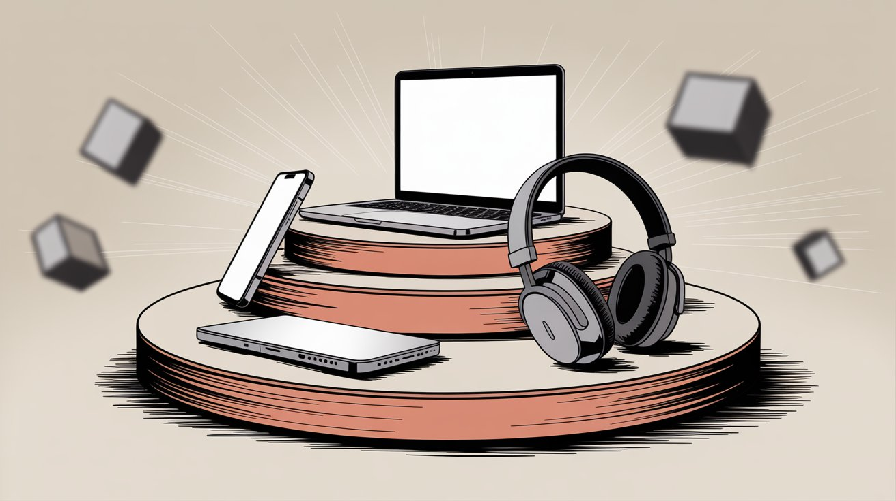

These platforms work well if you value their existing audience and don't mind the higher fees. Many successful podcasters use them effectively.

For a detailed comparison of different creator platforms, see our [guide comparing Ko-fi with traditional membership platforms](https://www.patron.com/blog/post/ko-fi-vs-patreon-which-platform-is-best-for-creators/).

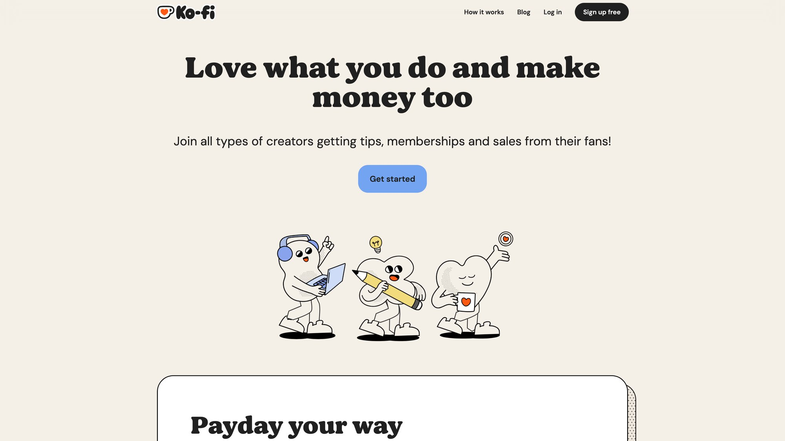

### App-Native Subscriptions

Apple Podcasts and Spotify both offer built in subscription features that let listeners pay directly within the app. The advantages include zero friction for listeners already using those apps, integrated discovery where your subscription offering appears in app, and no need to drive traffic to external platforms. But the disadvantages are significant. High fees at 30% year one and 15% thereafter for some platforms. No access to subscriber contact information, so you can't build direct relationships. Around 5% fees on others but limits you to their ecosystem. Subscribers trapped in a single app ecosystem can't use their preferred podcast player.

App native subscriptions work as a supplementary revenue stream, but building your core membership on a platform that doesn't share subscriber data limits your ability to engage your community.

### Podcast Specific Services

Services like Supercast and Glow.fm focus exclusively on podcast subscriptions with private RSS feeds. Their advantages are being purpose built for podcast specific workflows, handling technical RSS details automatically, and designed around audio content delivery. The disadvantages include fees typically ranging from 5% to 10% plus payment processing, smaller user bases than general creator platforms, and less community and engagement features.

These platforms fall between general membership tools and app native subscriptions. They solve the technical RSS challenges well but often lack advanced community features podcasters need for retention.

### Self-Hosting

If you're technically proficient or have developer resources, self hosting gives you maximum control. The advantages include no platform fees beyond payment processing, complete ownership of your member data, and unlimited customization. However, the disadvantages are substantial. It requires technical maintenance and security updates. You handle all customer support issues. You need to implement RSS authentication yourself. Payment processing integration is your responsibility.

Self hosting makes sense if you're already running WordPress with membership plugins or have development resources. Most podcasters prefer managed solutions so they can focus on content.

### Multi Platform Strategy

Some creators use multiple platforms simultaneously. Maintaining a core membership on a creator focused platform for lowest fees and best features. App native subscriptions to capture iOS users who won't leave the app. Occasional promotions for discovery.

This maximizes revenue but increases complexity. You'll manage subscribers across different systems with different access patterns. Start simple with one platform, then expand if the additional revenue justifies the operational overhead.

If you're considering switching from a traditional platform to Patron, our [comprehensive migration guide](https://www.patron.com/blog/post/switch-from-patreon-to-patron/) walks through the process step-by-step.

## Podcast Monetization FAQ

### How many paying members do I need to make this worthwhile?

Even 20 to 30 members paying $5/month covers hosting costs, equipment upgrades, and validates that your audience values your content. That's $100 to $150/month. Many podcasters start seeing meaningful income at 50 to 100 members, which is $250 to $500/month. At 200+ members you're looking at $1,000+/month, approaching part time income from your show.

The exact number depends on your goals. If you want to cover expenses, aim for 20 to 50 members. If you want supplemental income, aim for 100 to 200 members. If you want full time income, aim for 500+ members at higher tiers.

### What if my free audience shrinks when I add paid options?

This rarely happens with rolling paywalls because your free feed continues delivering all content. You're not removing anything listeners currently get. You're adding an optional early access tier for people who don't want to wait.

Research shows that adding paid tiers actually increases overall engagement because it gives fans a way to support you. Many listeners who could never afford to pay still appreciate that you have a sustainable revenue model.

### How far ahead should I release episodes to members?

Most podcasters use three to seven day early access windows. This creates meaningful value, almost a week ahead, without requiring you to stay too far ahead in production.

Some shows do 24 to 48 hour early access. This works if your content isn't particularly time sensitive. Longer windows of two or more weeks work for highly serialized narrative content where being multiple episodes ahead provides substantial value.

Test different windows with your audience. Automated scheduling makes it easy to adjust timing without republishing content.

### What if I miss a deadline for paid subscribers?

Communication is critical. If you know you'll be late, tell your members immediately. Explain what happened and when they can expect the episode.

Consider extending their billing cycle by a week or providing bonus content as compensation. Most members are understanding if you're transparent and rare delays don't become patterns.

Consistent reliability matters more than perfection. If you maintain 95% or better on time delivery, occasional issues won't hurt retention.

### Should I keep ads on my free feed if I have paying members?

This is a personal choice. Many podcasters run ads on the free feed but provide ad free versions to paying members. This maximizes revenue without double dipping on subscribers.

Some creators remove all ads once membership revenue exceeds what they made from advertising. They find that ad free content for everyone improves the listening experience and listener supported models feel more aligned with their values.

Test what works for your audience. You can always change your approach as your membership grows.

### What membership perks work best besides early access?

Bonus episodes are the most valued perk after early access. Record extended interviews, deep dives on topics you couldn't cover in main episodes, or Q&A sessions with your community.

Ad free listening is standard for paying members. If your free feed has ads, members expect the premium feed to be clean.

Community access through Discord, Slack, or private forums creates belonging. Many members stay subscribed primarily for the community even if they fall behind on episodes.

Physical rewards like stickers or merchandise work well at higher tiers but be careful with fulfillment complexity as you scale.

Input on content through polls, suggestion priority, or guest requests makes members feel invested in the show's direction.

### Can I change my pricing or tiers later?

Yes, though handle changes carefully to avoid upsetting existing members. Most platforms let you grandfather existing subscribers at their current price while charging new members differently.

When raising prices, give existing members at least 30 days notice and explain why. Better equipment, more content, or expanding production. Many will understand and stay subscribed.

When adding new tiers, existing members usually get the option to upgrade without disrupting their current benefits.

Tier management tools make it easy to adjust pricing and benefits as your show evolves.

### How do I handle payment processing and taxes?

Most membership platforms handle payment processing through Stripe or similar services. This includes automatic sales tax calculation for digital goods in applicable jurisdictions.

You'll receive 1099 forms in the US reporting your income. Set aside approximately 25% to 30% of earnings for taxes if you're self employed. Consult an accountant as your membership revenue grows.

Platforms handle the technical payment details so you don't need to become an expert in payment processing compliance.

### What if I want to migrate platforms later?

Most platforms let you export subscriber email lists. Check your agreement. You can then invite members to move to a new platform.

Migration inevitably causes some churn as not everyone will switch. Expect 10% to 30% of members might not complete the transition. Plan migrations during natural breaks between seasons and communicate extensively about why you're moving and what members need to do.

Starting with a creator friendly platform reduces the likelihood you'll need to migrate. Open source platforms provide additional peace of mind since you could technically self host if needed.

### Can I offer free trials or discounted first months?

Yes, though approaches vary by platform. Some let you offer coupon codes for first month discounts or limited free trial periods.

Be cautious with trials. They attract people who planned to cancel after the free period rather than true supporters. Many successful creators skip trials entirely and focus on clear value propositions that justify immediate payment.

If you do offer trials, make them short at seven days max so members quickly experience the full value and decide whether to continue.

### How long does it take to build meaningful membership revenue?

Most podcasters see steady growth over 6 to 12 months. You might get 10 to 20 members in your first month, then add 10 to 20 more monthly as your promotion becomes consistent and word spreads.

Growth accelerates as your back catalog expands. New listeners who binge 50 episodes often convert faster than casual listeners who've heard 5 episodes.

Focus on consistent delivery and regular promotion. Membership revenue compounds over time as you retain existing supporters and add new ones monthly. Even modest growth rates result in substantial income after a year or two.

## Start Monetizing Your Podcast with Early Access Today

Ad supported podcasting requires massive scale to generate meaningful income. Early access memberships let you monetize passionate listeners immediately, regardless of your total audience size.

The model works because it aligns your incentives with listener interests. Fans get content sooner. You get sustainable revenue. Everyone wins.

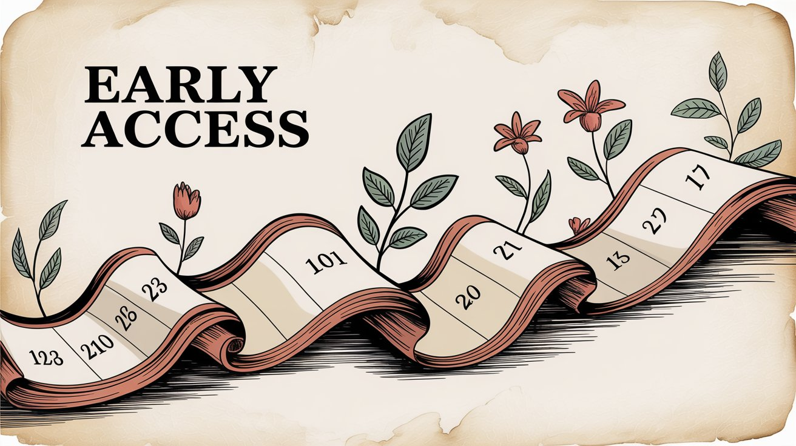

Key takeaways. Rolling paywalls balance monetization and discovery by releasing content to paying members first, then making it free after a delay. Even 50 to 100 paying members at $5/month generates more income than ads for most indie podcasts. Specialized platforms offer automated scheduling, series organization, and low fees specifically for sequential content creators. Consistency plus community engagement drive retention and long term revenue growth.

Thousands of podcasters have proven this model works across every genre, from true crime to tech to niche history shows. Your audience includes people ready to support you. Give them the opportunity.

Launch your membership today and start offering early access to your most engaged listeners. Set up your first tier in minutes and see why podcasters choose platforms built specifically for serial content creators.

Explore more [guides and resources](https://www.patron.com/blog/post/category/guides/) to help you build and grow your podcast membership community.