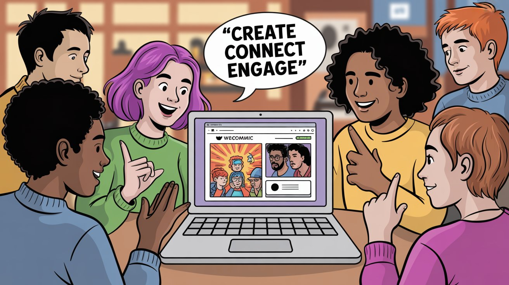
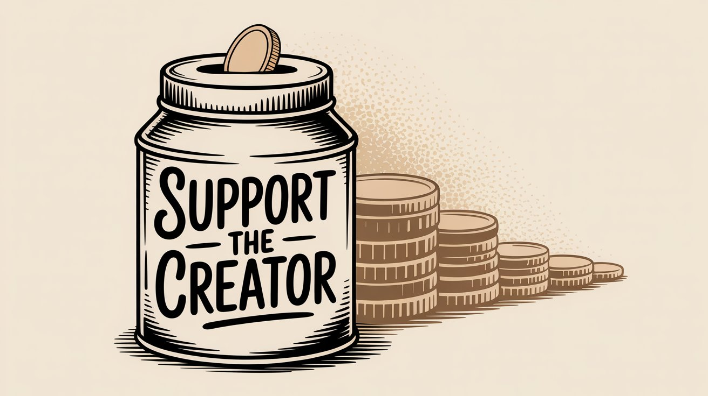
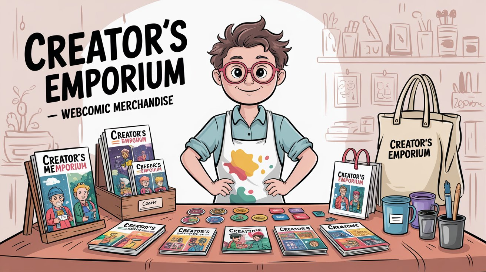
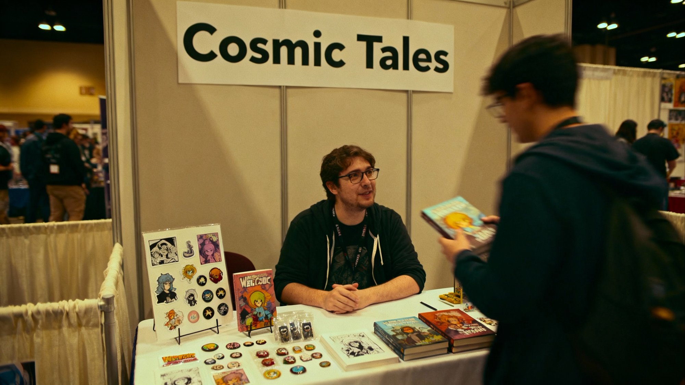
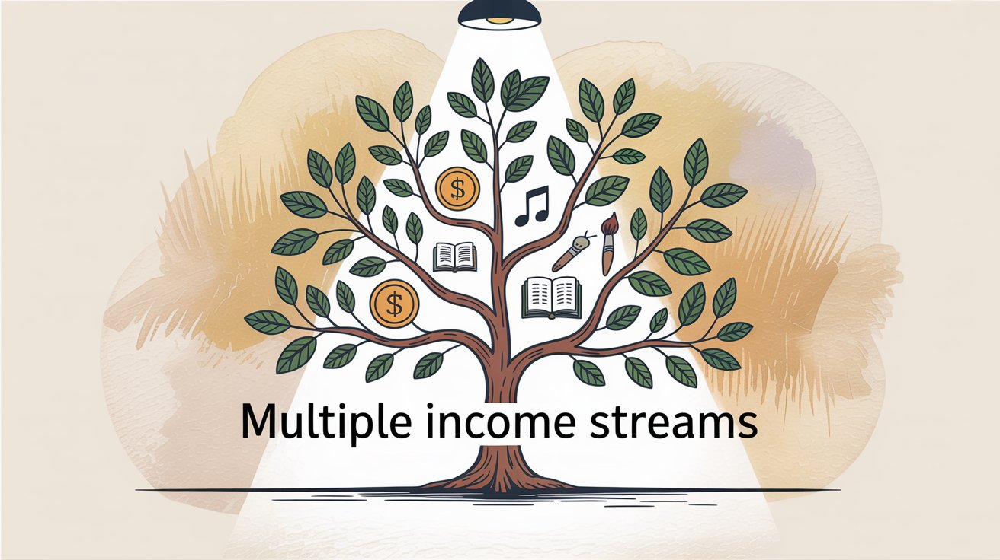

You've spent countless hours on your webcomic. Panel by panel, you've built characters and story arcs that readers actually care about. But when it comes to making money from your work, the path isn't always clear.

The webcomic market hit [**$7.63 billion in 2024** and is heading toward **$8.17 billion in 2025**](https://www.fortunebusinessinsights.com/webcomics-market-105731). Creators now have [**25 million paying supporters** across membership platforms](https://www.axios.com/2025/08/05/patreon-10-billion-creator-economy-ai), with over **$10 billion** paid out since 2013.

What matters most: successful webcomic artists don't rely on just one income source. They combine several revenue streams to make a living. This guide shows you exactly how to do that.

## How to Build a Webcomic Audience Before Monetizing

Before you focus on money, you need readers. That sounds obvious, but too many creators try to monetize early, before they have an audience that actually cares about their work.

Think about it: a webcomic with 50 pages and no engaged readers won't generate income, no matter how many monetization methods you try. But a comic with 200+ pages and a dedicated community? That's when things start working.

**What you need before monetizing:**

• **Consistent publishing schedule.** Pick a pace you can maintain (weekly, biweekly, monthly) and stick to it. Readers build habits around your updates. When you disappear for months, they move on.

• **Enough content to hook readers.** You probably won't see much support until your story has real momentum. Nobody pays for early access when there's nothing to be early for.

• **Actual community engagement.** Respond to comments. Be present on social media. Show your readers you're a real person who cares about the work.

• **Multiple distribution points.** Run your comic on your own website AND platforms like WEBTOON Canvas or Tapas. Your site gives you control. Platforms bring new eyes to your work.

The competition is _intense_. Thousands of webcomics update daily. Standing out takes time. But once you have a foundation of readers who genuinely love your work, monetization becomes much more straightforward.

## How to Make Money from Webcomic Ads

Once you have consistent traffic, ads can provide baseline income. It's not _glamorous_, and you won't get rich from it, but it's money you earn just by posting your comic.

### How to Add Ads to Your Webcomic Website

If you self-host your comic, you can add banner ads through Google AdSense or comic-specific ad networks. Your earnings scale with traffic. Unless you're pulling tens of thousands of monthly pageviews, don't expect huge payouts. But it's passive income.

The trick is balance. Too many ads and you'll drive readers away. A banner at the top or side is usually fine. Ads between every panel? That's pushing it.

### WEBTOON and Tapas Ad Revenue: What You'll Actually Earn

WEBTOON Canvas and Tapas both share ad revenue with creators who hit certain thresholds:

**WEBTOON Canvas** pays creators **50% of ad revenue** shown on their pages. You need at least **1,000 subscribers** and **40,000 U.S. monthly page views** to qualify. Once you hit those numbers, ads automatically appear on your episodes.

[WEBTOON has paid out over **$1 million per month**](https://about.webtoon.com/sustainability/35) to creators through ad shares and bonuses since 2020. The platform also offers occasional performance bonuses (like **$100** for hitting 40k views).

**Tapas** takes a different approach. They give creators **70% of ad revenue** with just **100 subscribers** required. That lower bar makes it more accessible, though Tapas has a smaller overall audience than WEBTOON.

**Reality check:** Most creators make _coffee money_ from ads, not _rent money_. But as your audience grows, it becomes a nice supplement. And unlike commissions or merchandise, ads don't require extra work once set up.

## How to Accept Donations for Your Webcomic (Tip Jars)

Not everyone will commit to a monthly subscription, but some readers want to toss you a few dollars as a thank-you. That's where tip jars come in.

Several platforms offer simple tip jar functionality where fans can send small one-time donations. Many of these services charge minimal or zero fees on tips, making money through optional premium features instead. You can embed tip buttons on your site, making it straightforward for readers to support you.

**PayPal** works too. Set up a PayPal.Me link or add a donate button to your site. It's straightforward but lacks the community features of creator platforms. Standard transaction fees apply.

**Platform tip systems** exist on places like Tapas, where readers can tip creators with in-app currency. If you're already on those platforms, enable these features so fans have an easy way to send support.

Make your tip link visible (sidebar, end of episodes, social media profiles), but don't be pushy about it. A simple "Enjoying the comic? Consider supporting with a tip" works fine.

Donations won't be huge or consistent, but they're an easy starting point. When you're just beginning, a few $5 or $10 tips from dedicated readers can be incredibly encouraging and help cover basic costs like hosting.

## How to Make Money with Webcomic Memberships

**This is where things get serious.**

Recurring memberships from dedicated fans can provide steady, predictable income that actually pays bills.

The model is simple: fans pledge a monthly amount (say $3, $5, or $10) in exchange for special perks. For webcomic creators, the most effective rewards tend to be:

• **Early access to new pages.** This is the big one. Subscribers see new updates weeks before the public. Readers who love your comic enough to pay are usually the same ones who can't wait to see what happens next.

• **Exclusive bonus content.** Side stories, character sketches, behind-the-scenes process shots, or commentary. Fans love peeking behind the curtain.

• **NSFW or uncensored versions.** If applicable to your comic, this can be a major draw. Adult content often performs very well behind a paywall. Some creators run a safe-for-work comic publicly and post spicy versions for paying supporters.

• **Community access.** Private Discord servers, patron-only Q\&As, or direct messaging with you. This makes supporters feel like VIPs.

• **Merchandise perks.** Higher tiers might include occasional physical goodies or discount codes for your store.

The catch? Memberships work best once you have both a decent audience AND story momentum.

> **Key insight from a successful creator**: "You won't see much patronage until your story actually goes somewhere. Readers need to be invested before they'll pay."

### Patreon vs Patron: Which Membership Platform Is Best?

Several platforms compete for creator memberships, with very different fee structures:

| Platform                              | Platform Fee         | Key Features                                                                              | Best For                                                |
| ------------------------------------- | -------------------- | ----------------------------------------------------------------------------------------- | ------------------------------------------------------- |
| **Patreon**                           | **10%** + processing | Robust tools (tiers, messaging, analytics), massive name recognition, free follower tiers | Established creators wanting industry-standard platform |
| [**Patron**](https://www.patron.com/) | **1%** + processing  | Open-source, built for sequential content, rolling paywalls                               | Webcomic and serialized content creators                |

**Patreon** is the biggest name. As of 2025, [new creators pay around **10%** in platform fees](https://www.theverge.com/news/687570/patreon-standard-price-plan-increase-10-dollars), plus payment processing (roughly 3-5%). Legacy creators may still have older, lower-fee plans. Most readers already know how Patreon works, which reduces friction. Patreon now allows free follower tiers, helping you build an audience of potential subscribers who can be converted to paid members over time.

[**Patron**](https://www.patron.com/) (not to be confused with Patreon) is a newer, [open-source platform built specifically for sequential content](https://microlaunch.net/p/patron) like webcomics. It charges just **1%** in platform fees, which means you keep 99% of earnings (minus payment processing). More importantly, Patron was designed around how serialized creators actually work.

Instead of treating your comic as a feed of generic posts, Patron understands [series structure, episode scheduling, and rolling paywalls](https://www.patron.com/blog/).

> **Rolling paywalls**: Content starts as exclusive for paying supporters, then automatically unlocks for free readers on your schedule. This preserves early access value while turning your archive into a discovery funnel.

Because [Patron is open-source](https://github.com/patroninc/patron), it's also transparent and customizable in ways proprietary platforms aren't. If you're tech-savvy or have development help, you can even self-host it.

### How to Get More Webcomic Subscribers

A few tips to maximize subscription success:

• **Deliver consistent value.** Don't _over-promise_. One or two solid perks you can reliably deliver beat ten promises you can't keep. Early access and some exclusive art or commentary is usually enough.

• **Price tiers strategically.** A low entry tier ($1-3) gets more people in the door. Higher tiers ($10+) exist for super-fans but expect most supporters at the lower levels. Make sure each tier feels worthwhile.

• **Promote it gently.** Mention your membership option in comic updates ("Support on Patron to read next week's page today"), embed links on your site, and occasionally remind people what patrons are getting.

• **Engage with supporters.** Treat members like the VIPs they are. Thank them, respond to messages, and show appreciation.

• **Understand the actual costs.** All platforms have payment processing fees on top of their platform cut. For example, Patreon's 10% plus processing versus Patron's 1% plus processing. Over time, those differences add up significantly.

Many successful webcomic creators report that memberships provide their largest single revenue stream. With the right approach, even a small group of dedicated fans can generate meaningful monthly income.

## How to Crowdfund Your Webcomic (Kickstarter Guide)

If you've ever dreamed of printing a hardcover collection of your comic or funding something ambitious, crowdfunding might be your answer. Platforms like Kickstarter let you raise money for specific projects by pre-selling to your audience.

For webcomic creators, the most common approach is financing print editions. You collect your comic into a book and run a campaign to cover printing, shipping, and hopefully some profit. It's practically a rite of passage in the webcomic community.

[Comics crowdfunding raised **$46.5 million** on Kickstarter in 2024 alone](https://icv2.com/articles/news/view/59286/comics-kickstarter-up-dramatically-2024), up **34%** from 2023. The success rate was **77.8%**, and the average comic project raised about **$17,500**. The biggest campaigns hit seven figures.

### How to Run a Successful Webcomic Kickstarter

• **Build anticipation early.** Don't launch cold. Tease your campaign months ahead. Show sample layouts, prototype merchandise, and cover designs. Get your readers excited and make sure they know when to back you.

• **Create compelling reward tiers.** Standard tiers include digital PDF, physical book, book plus exclusive print, etc. Higher tiers can offer sketches in the book, name in credits, or even character cameos. Consider retailer bundles at wholesale prices too, as these helped drive 2024's growth.

• **Calculate costs carefully.** Get printing quotes, factor in shipping (domestic AND international), packaging, Kickstarter's **~~5%~~** ~~fee, payment processing (~~**3%**), and a buffer for unexpected costs. It's easy to underestimate. You don't want a successful campaign that loses you money.

• **Communicate consistently.** During the campaign, post updates and introduce stretch goals ("If we hit $20k, everyone gets a bonus mini-print"). After funding, deliver on your timeline or communicate honestly about delays. Happy backers become repeat supporters for future projects.

Beyond books, you can crowdfund other initiatives: merchandise sets, animated shorts, or even "fund my next chapter" campaigns. But Kickstarter remains the standard for large projects because of its discovery features and credibility.

A well-done book campaign can generate thousands or even tens of thousands of dollars, which is transformative for an indie creator. Plus, you'll have a physical product to continue selling online and at conventions afterward.

## What Webcomic Merchandise Actually Sells

Fans love owning physical pieces of the stories they care about. Merchandise turns your comic's art and characters into products that generate income while promoting your work.

**Common merchandise for webcomics:**

| Merchandise Type         | Production Cost | Typical Price | Best For                  |
| ------------------------ | --------------- | ------------- | ------------------------- |
| **Art prints & posters** | Low             | $15-30        | Cover art, popular panels |
| **Stickers & keychains** | Very low        | $3-8          | Impulse buys, characters  |
| **Apparel (POD)**        | Medium          | $20-40        | Brand loyalty, quotes     |
| **Enamel pins**          | Medium          | $10-15        | Collectors, fandoms       |
| **Specialty items**      | Varies          | Varies        | Plush, mugs, notebooks    |

• **Art prints and posters** of cover art, chapter illustrations, or popular panels. These are cheap to print in bulk and easy to sell online or at events.

• **Stickers and keychains** featuring your characters or logo. Small, affordable items that fans love. People use stickers to decorate laptops and bags.

• **Apparel** like t-shirts, hoodies, and tote bags with your comic's name, quotes, or artwork. Print-on-demand services (Printful, Redbubble, TeePublic) make this straightforward. You upload designs, they handle printing and shipping per order, and you get a cut. No upfront inventory, but lower margins per item.

• **Specialty items** like enamel pins (very collectible in webcomic fandoms), mugs, notebooks, or even plush dolls if your characters fit that format.

### How to Sell Webcomic Merchandise Online

You can sell through marketplaces like Gumroad, Etsy, or Storenvy. Some creators integrate shops into their personal websites with Shopify or WooCommerce. Others rely on print-on-demand storefronts like Redbubble or TeePublic, which also offer platform discovery (helpful if your designs have broader appeal).

**Fulfillment models:**

• **Print-on-demand (POD)** eliminates inventory risk. The service prints and ships each item when ordered. Good for apparel, mugs, and phone cases. Profit might be just a few dollars per item, but zero hassle once set up.

• **Self-fulfillment** means you order items in bulk (like 100 posters), store them, and ship orders yourself. Higher profit per unit since bulk is cheaper, but you invest money upfront and spend time on packaging and post office runs. Best for items where you can predict demand.

• **Hybrid approach:** Self-fulfill small stuff like prints and stickers, use POD for bigger items like t-shirts. This keeps things manageable.

Merchandise works best after you have an established fan base. Launching a store for a brand-new comic with no readership rarely works. Wait until readers start asking "Where can I buy a poster?" That's your sign.

Beyond income, merch turns your readers into walking advertisements for your comic. A cool shirt or enamel pin can spark conversations and attract new fans.

## How to Publish Your Webcomic as a Book

Many fans (and creators) have a special attachment to holding a physical book. Publishing your webcomic in print form generates revenue while cementing your work in a tangible format.

You have two main paths:

① **Self-publishing** means you handle (or outsource) printing and sell books directly through crowdfunding, your online store, or at conventions. You can work with print-on-demand services like Amazon KDP, IngramSpark, or Lulu (they print individual copies as ordered, lower upfront cost but higher per-unit cost). Or you do an offset print run of a few hundred copies (cheaper per unit but big upfront payment). Self-publishing gives you full control and highest profit per book, but you manage all logistics.

② **Traditional publishing deals** are trickier. A publisher might pick up your webcomic for print if it's already popular or award-winning. Imprints like Seven Seas, Dark Horse, or Webtoon Unscrolled have published hit webcomic graphic novels. Publishers handle distribution (bookstores, etc.) but you share profits and possibly give up some rights. These deals can legitimize your comic to new audiences and sometimes include advance payments.

A middle ground involves indie comics publishers or collectives (Hiveworks, Iron Circus Comics) that specialize in webcomic creators. They help print books, manage stores, and run ads in exchange for revenue splits.

If self-publishing, running a Kickstarter is the most common funding method. Many creators successfully raise thousands to print their first volume. After fulfilling backer copies, you can sell extras on your site or at events for ongoing income.

Some webcomic books become bestsellers. For example, the graphic novel of Lore Olympus hit #1 on the New York Times bestseller list.

**Important:** Retain your print rights if you sign any contracts (like platform deals). Don't accidentally sign them away. Print rights can be lucrative whether you use them yourself or negotiate them for better deals.

Turning your webcomic into a book creates a new revenue stream (people will pay $15-40 for a book they already read online because they want to own it and support you) and a product you can sell for years. It's also easier to sell books at conventions than trying to pitch prints alone.

## How to Make Money Taking Webcomic Commissions

While not directly monetizing the comic itself, many webcomic artists leverage their audience and skills to earn through commissions or related freelance work.

If readers love your art style, some will pay for custom pieces. This can range from drawing their favorite character, to personal avatars, to short comic strips as gifts.

**Personal commissions for fans:** Advertise that you take commissions on your site and social media. Popular webcomic artists often get requests, and you can manage demand with waitlists or limited slots.

Set up a commission info page with rates (like $50 for a bust, $100 for full-body, $200+ for complex pieces or comic pages) and what you will and won't draw. Many creator platforms now include built-in commission features, making transactions easier.

**Membership commission tiers:** Some creators include limited commission spots in high membership tiers (like a $100/month tier where the patron gets a monthly sketch). This can be hard to maintain, so price it to make your time worthwhile.

**Freelance opportunities:** Your webcomic acts as a portfolio. You might get offers for comic anthologies, guest art, or sponsored work. Networking with other creators opens doors to paid collaborations.

Make it clear you're available for hire. Many readers assume creators are too busy unless you explicitly say "Now booking commissions" or provide a contact form.

**Time management note:** Commissions pull time away from your comic, so balance carefully. Charge what your time is worth (don't undersell yourself, you're also leveraging your brand). It's fine to close commissions when you need to focus on the comic.

Commissions might not scale into huge income unless you raise prices significantly, but they provide a helpful income buffer. For some creators, commissions bridge the gap until other revenue streams grow enough to go full-time.

## How to Sell at Comic Conventions (For Webcomic Artists)

If you have a following (even regionally), conventions and art fairs can yield significant sales and new fans. Having a table at a comic con or zine fest puts you directly in front of people who are actively looking to buy art and comics.

**Ways to make money at events:**

• **Selling merchandise and books.** This is where your physical products shine. Attendees buy books, prints, stickers, pins, and more. A well-stocked, attractively displayed table can bring in hundreds or thousands of dollars over a convention weekend.

• **On-the-spot commission sketches.** Some artists offer quick pencil or ink sketches for a fee (like $20-50 for a headshot). It's interactive, and people love watching art happen live.

• **Promoting digital readership.** Even if someone doesn't buy much, hand out business cards or bookmarks with your comic URL and membership link. New readers eventually mean more online monetization.

• **Networking.** You'll meet fellow creators for potential collaborations or cross-promotions, and occasionally publishers or media folks. These connections can lead to future income indirectly.

Start with local, smaller events to get a feel for it. Costs include table/booth fees ($50 at small events to $300+ at big cons), plus travel, lodging, and booth setup (banner, displays). It's an investment, so you want enough inventory to cover costs through sales. Many artists split booths with friends to reduce expenses.

**Choose events wisely.** A huge anime convention might be perfect for a manga-style fantasy webcomic but less ideal for a niche autobiographical comic (which might do better at a small press expo). Research which events align with your genre and audience.

Conventions also strengthen your community. Meeting fans in person can convert casual readers into superfans (and membership supporters). Plus, connecting with people who love comics is energizing, even if exhausting. Post-pandemic, in-person events are coming back strong, so consider adding one or two to your yearly schedule if feasible.

## Can You Get a Publishing Deal for Your Webcomic?

This is more advanced and rare, but worth understanding. If your webcomic becomes very popular, you might attract opportunities for official publishing deals or licensing of your intellectual property.

**WEBTOON Originals / Paid Publishing:** Platforms like WEBTOON scout top indie series to become Originals, where they pay you a stipend per episode to serialize exclusively. One creator mentioned this was their "most consistent money" source. But deals come with conditions: tight weekly deadlines, and platforms often take significant shares of ad revenue or restrict separate early-access options on other platforms. Contracts can also restrict merchandising or print rights. Read the fine print. The paycheck is nice, but you're trading some autonomy.

**Traditional comics publishing:** A publisher might want to release your comic in stores or bookstores. They may pay an advance and royalties. The upside is professional distribution and marketing. The downside is splitting profits and potentially pausing free online releases.

**Adaptations (TV, film, games):** This is rare but not impossible. Webcomic-based Netflix shows like Heartstopper or All of Us Are Dead started as webcomics. Usually, a studio buys an option (a fee for rights for a period), and if it goes into production, you negotiate a bigger contract. These deals are complex. If this happens, get a good entertainment lawyer.

**Merchandise licensing:** A company might license your IP to make merch (like figurines), paying you royalties. Again, only likely for very popular titles.

While you can't bank on these opportunities, prepare for them. **Protect your IP.** Make sure you clearly own your work (watch platform terms that might grab rights). Having a large, engaged audience is usually what attracts these deals, so focusing on growing your community is the best strategy.

And if offers do come, evaluate not just the money but the impact on your creative control and existing revenue. Some creators turn down platform contracts because they make more independently through memberships. Others accept because stable salary and exposure is worth it. It's a personal choice based on your goals.

## How to Combine Multiple Webcomic Income Streams

We've covered ads, donations, subscriptions, crowdfunding, merchandise, commissions, events, and licensing. **The most successful creators combine several of these.**

**A common progression:**

① Start with free webcomic content to build an audience

② Add a tip jar for goodwill donations

③ Launch a membership platform for early access and exclusives (often becomes your primary income stream)

④ Run a Kickstarter to print Volume 1

⑤ Use profits to invest in merchandise

⑥ Sell books and merch in an online store and at conventions

⑦ Take commissions when time allows for extra income

⑧ Down the road, consider bigger deals if they align with your interests

Each creator's mix will differ based on genre, audience, and personal bandwidth. An action-romance webtoon might thrive on memberships and merch, while a gag comic might lean more on ad revenue and books.

**Avoid burnout.** It's tempting to try everything at once: updating three times weekly, creating exclusive member comics, managing a full merchandise catalog, and attending monthly conventions. Pace yourself. Do a few things well rather than stretching so thin that your comic quality suffers. The comic itself drives all these opportunities. If it falters, everything else does too.

## How Much Money Can You Make from a Webcomic?

Making a full living from a webcomic is difficult and usually slow. Most creators don't see substantial income for at least a couple of _years_ of consistent updates. Many treat it as part-time until revenue grows.

Membership platforms now deliver $2 billion annually to creators, but that's spread across hundreds of thousands of people. The top 1% earn big chunks while many make under $100 monthly. Webcomic creator incomes range widely: a few superstar teams earn six figures, some solid solo creators earn $1,000-5,000 monthly, and countless others make beer money.

All of those are valid. Define what success means for you. Maybe it's covering art supplies. Maybe it's quitting your day job. Both are legitimate goals.

Success isn't only about dollars. Monetization should support your ability to keep creating. Done right, it deepens your connection with readers. Interacting with members or meeting fans at conventions can be incredibly rewarding beyond money.

**This is the best time in history to be a creative person building a business around what you love**. The internet and tools available in 2025 have lowered barriers between you and a worldwide audience of comic lovers who want to support artists directly.

## Your Webcomic Monetization Action Plan

Monetizing a webcomic blends creativity and entrepreneurship. Start with great content and a genuine fan community. Layer on revenue streams gradually as they make sense. Be adaptable. Try things, learn what works, and iterate. One year you might focus on memberships, another year on Kickstarters. The balance can shift over time.

Most importantly, keep your passion for the story itself. Monetization exists to sustain the art, not replace it. Audiences can tell if you're genuinely into your work or just extracting money. The more you prioritize creating an amazing comic and caring about readers, the more those readers will want to support you financially.

You don't need to monetize in every possible way. Just focus on the methods that make sense for you and your comic. With dedication and smart strategy, your webcomic can generate real revenue and potentially become your full-time career. Many have done it, and the opportunity is only growing.

Go turn those panels into income, without sacrificing what made you start creating in the first place.
