Instagram has become one of the most powerful platforms for [webcomic creators](https://www.patron.com/blog/category/webcomics/) to build an audience. With [over 2 billion monthly users as of 2024](https://backlinko.com/instagram-users), the potential reach is enormous. But if you've been posting your comics for free and wondering how to actually make money from your work, you're not alone.

Here's what most people don't realize. Instagram itself won't pay you when your comic goes viral. There's no ad revenue split, no creator fund for static images. So how do successful webcomic artists actually earn income? They use a multi-platform approach, combining Instagram's massive reach with external monetization tools.

One of the most effective strategies is the [**rolling paywall model**](https://www.patron.com/blog/post/what-is-a-rolling-paywall/), where paying supporters get early access to new episodes while older content eventually becomes free for everyone. This approach lets you [monetize your most dedicated fans](https://www.patron.com/blog/post/how-to-monetize-a-webcomic/) while still growing your audience through free content. New readers discover your back catalog, binge through it, hit a cliffhanger, and then realize they can pay to read ahead immediately. It's the difference between locking everything behind a permanent paywall and creating a time-release system that serves both discovery and revenue.

This guide covers everything you need to know about monetizing your Instagram webcomic. Building an engaged audience. Choosing the right membership platform. Selling merchandise. Learning from creators who've turned their comics into full-time income.

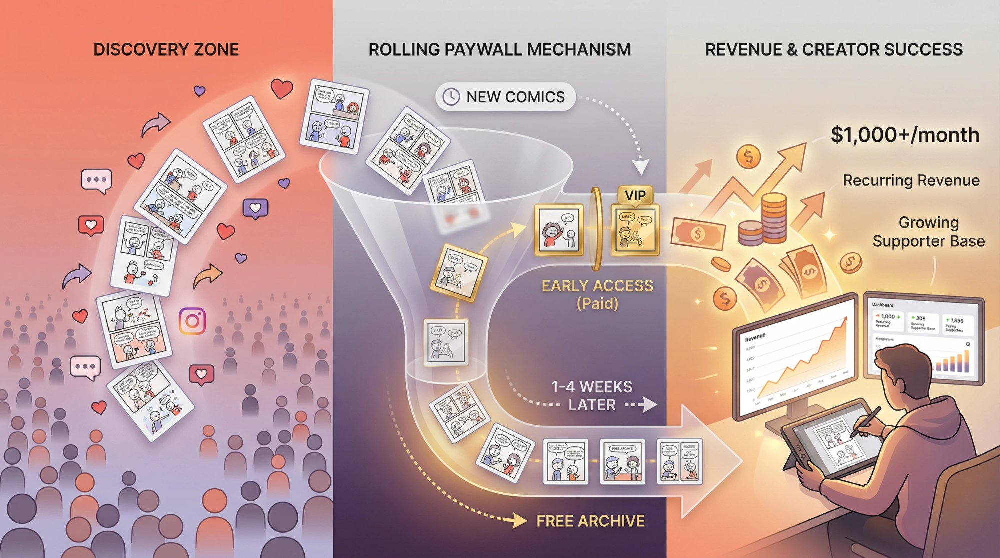

## Why Instagram Works for Webcomic Creators

Back in [late 2018, webcomic artists began migrating from Tumblr to Instagram](https://www.howtolovecomics.com/2020/11/13/instagram-is-the-new-home-of-webcomics/) after Tumblr's policy changes made it less hospitable for creators. Since then, Instagram has become the unofficial home of webcomics online.

**The audience is already there.** Instagram's [2 billion+ user base](https://backlinko.com/instagram-users) means that no matter how niche your comic is (whether it's sci-fi dinosaurs or autobiographical doodles) you can find your people. The platform is visual-first, which makes it a natural fit for comic art.

**The carousel feature is perfect for comics.** This is the *real* secret weapon. The [multi-image carousel lets readers swipe through panels](https://www.marketingbrew.com/issues/this-dino-comic-has-a-clever-instagram-strategy) like they're reading a comic book. Each swipe counts as engagement, which [tells the algorithm your content is worth promoting](https://www.marketingbrew.com/issues/this-dino-comic-has-a-clever-instagram-strategy). It's interactive, it keeps people on your post longer, and it makes the reading experience feel intentional rather than passive.

**The community is thriving.** Instagram has developed a [vibrant webcomic ecosystem](https://www.howtolovecomics.com/2020/11/13/instagram-is-the-new-home-of-webcomics/) with creators covering every genre imaginable. Humor dominates (relatable "adulting" comics, dark comedy, absurdist jokes), but you'll also find fantasy, horror, slice-of-life, and everything in between. Creators collaborate, tag each other, and share work through Stories. Fans tag friends in comments. The network effect is real.

**Viral potential is massive.** Nathan W. Pyle's *Strange Planet* comics about blue aliens went from [zero to 1.7 million followers in just five weeks](https://ew.com/books/2019/05/01/nathan-pyle-strange-planet-book-announcement/), which led to a book deal and eventually an Apple TV+ show. That kind of explosive growth is rare, but it demonstrates what's possible when a comic resonates with Instagram's audience.

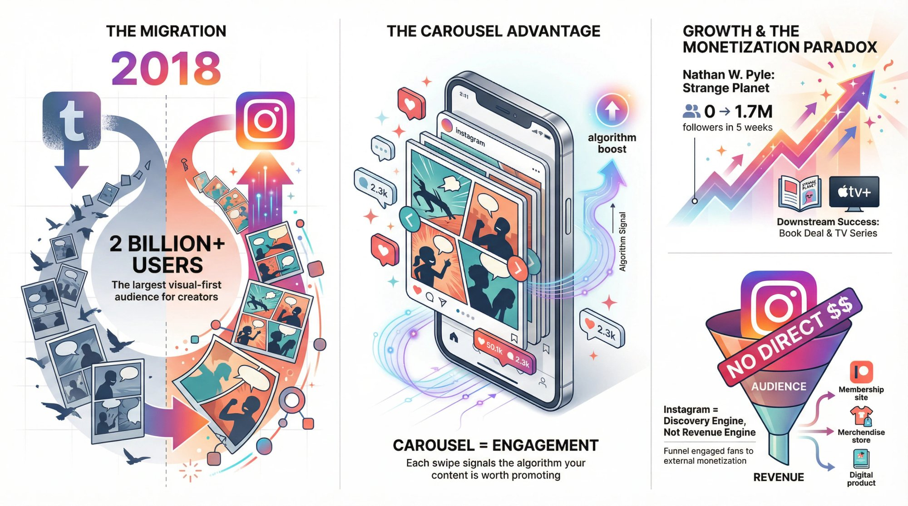

**The catch.** Instagram is excellent for building an audience, but it offers almost no direct monetization for image posts. You won't get paid when your comic goes viral. Your job is to use Instagram as the discovery engine and then funnel your most engaged fans toward external revenue streams.

## How to Build Your Webcomic Audience on Instagram

You can't monetize an audience you don't have. Before worrying about revenue, focus on building a loyal following. The larger and more engaged your community, the more potential supporters you'll have when it's time to launch memberships or sell merch.

**Post consistently.** This is the foundation of *everything*. Successful Instagram comic creators stick to a reliable schedule, whether that's twice a week or daily mini-strips. Consistency keeps fans engaged and signals to the algorithm that you're serious.

**Use carousel posts strategically.** If your comic has multiple panels, split them into a swipeable carousel. Creators like [@dinosandcomics (with millions of followers)](https://www.marketingbrew.com/issues/this-dino-comic-has-a-clever-instagram-strategy) post every comic this way.

Pro tip. Put a teaser on the first slide, maybe a zoomed-in panel or bold text, to [stop people mid-scroll](https://www.marketingbrew.com/issues/this-dino-comic-has-a-clever-instagram-strategy). Then add a final slide showing the whole comic as one image so readers can easily screenshot it or share in DMs.

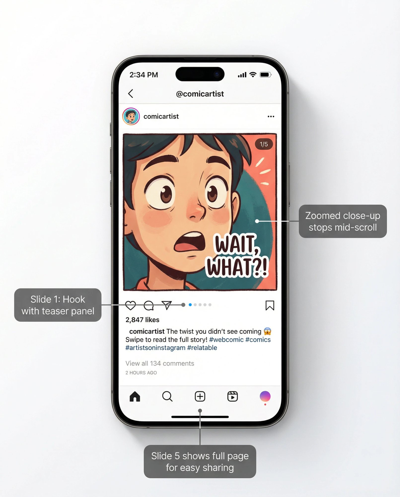

**Use hashtags and captions well.** Use relevant tags like #webcomic, #comic, #graphicnovel, plus niche-specific ones like #fantasycomic or #relatablememes. Write captions that encourage interaction. Ask questions, prompt people to tag friends, or share the story behind the comic.

**Engage with your community.** Reply to comments. Thank people who share your work in their Stories. Consider doing Q&As or behind-the-scenes content in Stories or Lives.

Comic artist [Jenny Jinya doubled her Instagram following from 174k to 344k in six months](https://www.boredpanda.com/dog-owner-letting-go-loving-reaper-jenny-jinya/) by consistently posting emotional animal comics and engaging with her audience. That emotional connection translated into over 2,400 paying supporters funding her work.

**Collaborate and cross-promote.** Partner with other creators for shout-outs, guest comics, or challenge themes. Many [webcomic artists](https://www.patron.com/blog/category/webcomics/) also post on Webtoon, Tapas, Reddit, or Facebook, directing those audiences back to Instagram. The more places people can find you, the faster you'll grow.

**Focus on quality.** The Instagram comic space is competitive. Well-drawn or uniquely written comics get shared more. Pay attention to which posts perform best and refine your approach based on that data.

## How to Make Money From Your Instagram Webcomic

Once you've built an engaged following, you have several paths to turn that attention into income. Most successful creators use a combination of these methods rather than relying on just one.

### How to Earn With Fan Memberships and Subscriptions

Memberships are one of the **most reliable income sources** for webcomic creators. Your biggest fans pay a few dollars per month in exchange for exclusive perks, and you get predictable recurring revenue.

**How it works.** You set up tiers on a [membership platform](https://www.patron.com/) (typically $1, $3, $5, or $10 per month) and offer rewards at each level. Common perks include early access to new comics so subscribers see tomorrow's comic today. Bonus comics that free followers never see. High-resolution images or wallpapers. Work-in-progress sketches and behind-the-scenes updates. Voting on storylines or characters. Physical rewards at higher tiers like stickers and signed prints.
    

**Ben Hed (Pet Foolery)** runs one of the most successful webcomic membership programs. He offers [4 extra comics per month for just $1](https://www.instagram.com/p/CXlrO_drAiA/), an incredible deal that's attracted [over 20,000 paying members](https://graphtreon.com/creator/petfoolery). His estimated monthly earnings range from [$17,000 to $69,000](https://graphtreon.com/creator/petfoolery) based on publicly available tier information.

As Ben [wrote about his journey](https://www.boredpanda.com/adorable-dog-cat-comics-pixie-brutus-pet-foolery/). *"Ever since the first Pixie and Brutus comic I posted on Instagram, I've been overwhelmed with support... one moment it was a side-job, then I had over a million followers and illustration became my full-time job!"*

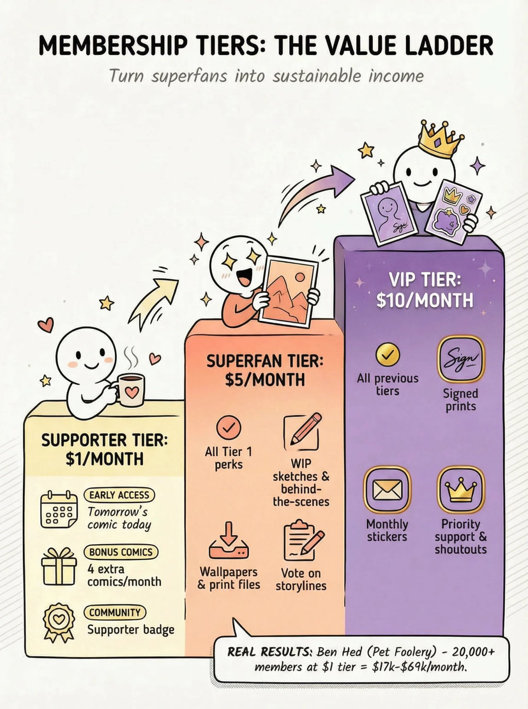

#### How to Choose the Right Membership Platform

| Platform | Platform Fee | Best For | Key Differences |
| --- | --- | --- | --- |
| Traditional platforms like Patreon | 8-12% (typically 10% for new creators as of August 2025) | General creators | Established, but higher fees |
| [Patron](https://www.patron.com/) | **1% for early adopters** | Sequential content (webcomics, serialized fiction) | [Rolling paywalls](https://www.patron.com/blog/post/what-is-a-rolling-paywall/) built-in, designed for episodic content |
| Ko-fi | 0% (for tips only) or 5% (for memberships, shop, and commissions) | Simple tip jar + basic memberships | Lower fees, fewer features |

The fee difference matters more than you might think. On $1,000 of monthly supporter revenue, Patreon at 10% fee takes $100 to the platform, leaving **$900 to you** before payment processing. [Patron](https://www.patron.com/) at 1% fee takes $10 to the platform, leaving **$990 to you** before payment processing.

That's an extra **$90 per month** in your pocket, and the gap only widens as you grow. If you want to understand exactly how fees impact your earnings, check out our guide on [how to calculate your true take-home pay](https://www.patron.com/blog/post/how-to-calculate-your-true-patreon-take-home-pay-2025/).

#### Why Rolling Paywalls Work for Webcomics

Here's the psychology that makes [rolling paywalls](https://www.patron.com/blog/post/what-is-a-rolling-paywall/) so effective for sequential content.

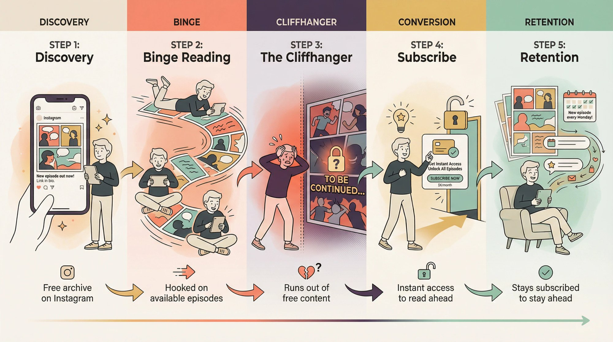

New readers discover your free archive on Instagram. They binge through available episodes and get hooked. They hit a cliffhanger or run out of free content. They realize they can subscribe to read ahead immediately. Once subscribed, they stay subscribed to avoid falling weeks behind.

This model solves both sides of the creator dilemma: you need free content for discovery, but you also need paying supporters for income. Traditional all-or-nothing paywalls force you to choose. Rolling paywalls let you have both.

[Patron](https://www.patron.com/) was built from the ground up for this exact model. You publish new episodes to paying supporters first, then those episodes automatically unlock for free readers after a set window (usually 1-4 weeks). Your archive keeps growing as free content that attracts new readers, while your most engaged fans pay to stay ahead. Learn more about [how to monetize a webcomic](https://www.patron.com/blog/post/how-to-monetize-a-webcomic/) using this approach.

#### How Instagram Native Subscriptions Work

Instagram [launched its own subscription feature in 2022](https://www.theverge.com/2022/7/14/23215855/instagram-creator-subscriptions-feed-posts-chat), letting creators offer subscriber-only content directly in the app. You can set prices from $0.99 to $99 per month and provide:

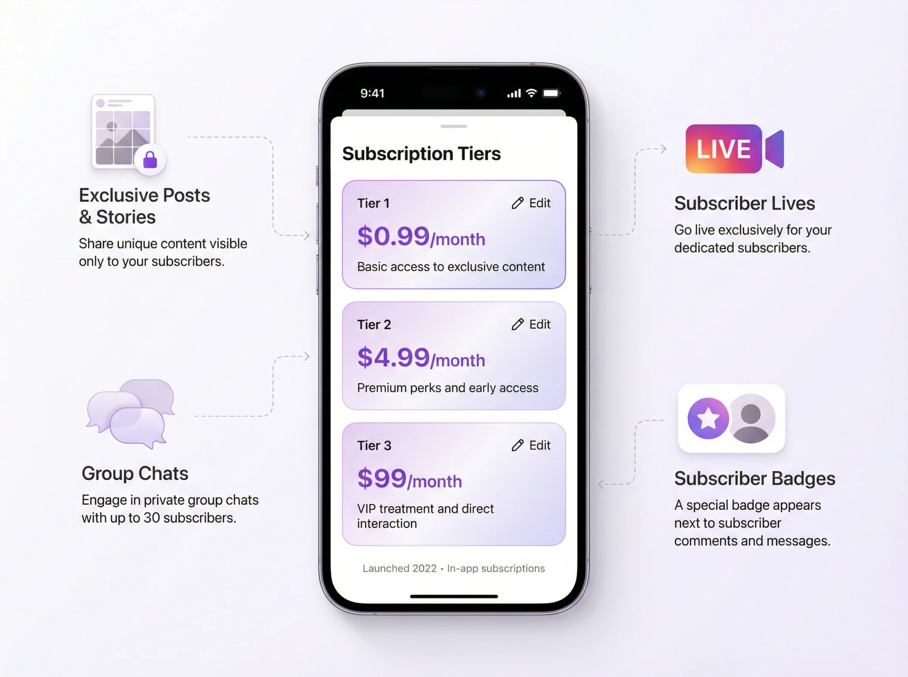

Subscriber-only posts and Stories. Exclusive Lives. Subscriber group chats. Special badge next to subscriber names.

The advantage is convenience. Fans don't have to leave Instagram to support you. [Meta initially announced they wouldn't take a cut until 2024](https://www.theverge.com/2022/6/21/23176749/meta-instagram-facebook-creators-revenue-policy-reels), though their current revenue share may have changed.

The disadvantage is that it's limited to the Instagram environment, which can feel restrictive for longer content, high-res art, or detailed community updates. Many creators use Instagram subscriptions for casual extras while running a more robust membership on an external platform.

### How to Sell Webcomic Merchandise and Prints

If your audience loves your characters, many will happily buy physical products featuring them. Merchandise can become a significant revenue stream, and Instagram doubles as the perfect showroom.

**Popular merch options for webcomic creators**

Art prints and posters offer high-quality prints of your best strips in open edition or limited signed runs. Books compile your comics into a physical collection since fans often request these for a tangible collection of their favorite strips. Clothing and accessories like t-shirts, hoodies, enamel pins, keychains, and tote bags work well if your comic has a meme-worthy panel or catchphrase. Stickers are low-cost, high-margin items perfect for fans on a budget. Plushies and figures require more investment or crowdfunding but prove wildly successful if you have an iconic character.

**How @dinosandcomics turns every post into a sales funnel**

The creators behind this wholesome dinosaur comic (now rebranded as [@dinosaurcouch with 4 million followers](https://www.instagram.com/dinosaurcouch/)) have mastered merch promotion on Instagram. [Every comic they post includes a final carousel slide showing their characters on mugs, shirts, and other products](https://www.marketingbrew.com/issues/this-dino-comic-has-a-clever-instagram-strategy). It's a subtle nudge after the reader has just enjoyed the comic, and it works because fans don't mind the promo when it features the same beloved characters they just laughed at.

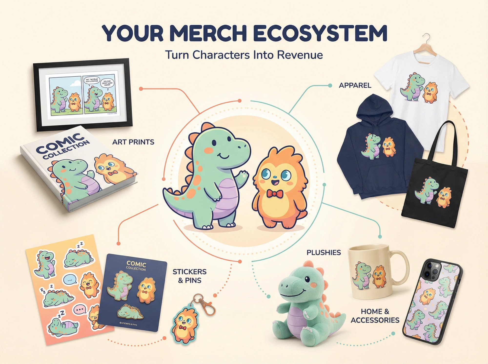

This approach essentially turns every Instagram post into [a complete sales funnel](https://www.marketingbrew.com/issues/this-dino-comic-has-a-clever-instagram-strategy). Entertainment plus shareability plus purchase opportunity, all in one carousel.

**Nathan Pyle's Strange Planet** used its Instagram popularity to build a full merchandise empire. Within months of going viral, the comic [secured a book deal with HarperCollins](https://ew.com/books/2019/05/01/nathan-pyle-strange-planet-book-announcement/), with the book releasing in November 2019. By 2020, [Strange Planet had 6 million Instagram followers](https://www.instagram.com/nathanwpylestrangeplanet/) and an expanding product line including calendars, plushies, and more.

**Getting started with merch**

If you're new to merchandise, start with **print-on-demand** services like Printful, Teespring, or Redbubble. You don't invest upfront or hold inventory. The profit per item is smaller, but you gauge interest risk-free. As demand grows, you can invest in bulk orders for better margins or run pre-order campaigns for bigger items like books or plushies.

### How to Crowdfund Your Webcomic Projects

Crowdfunding works best when you have a sizable, engaged audience and a clear project they're excited about, like a book collection or special merchandise.

**Book collections** are the most common crowdfunding project for [webcomic creators](https://www.patron.com/blog/category/webcomics/). After you've been posting for a while, you might have 100+ comics that could fill a book. Rather than pay printing costs out of pocket, you launch a Kickstarter campaign, essentially taking pre-orders while offering special rewards (signed copies, exclusive mini-prints, original sketches for high-tier backers).

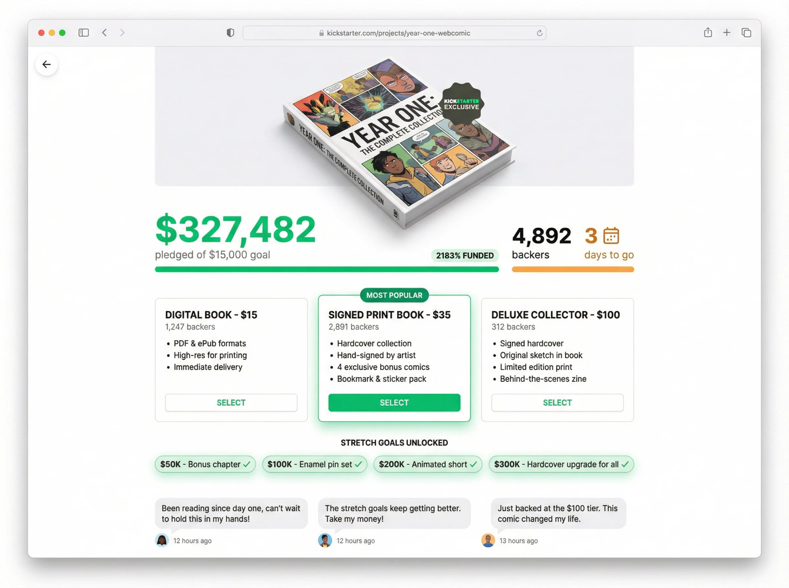

It's not unusual for popular webcomic Kickstarters to raise tens of thousands of dollars. **Extra Fabulous Comics** turned their edgy humor strips into a party card game and raised over $300,000 on Kickstarter, far beyond their initial ask, thanks to their loyal Instagram and Facebook following.

**When to use crowdfunding**

You have at least a few thousand engaged followers. There's clear demand from fans asking for a book. You're ready to handle fulfillment logistics. You want to fund a bigger project like plushies, an animated short, or a game.

Even smaller campaigns can work. If you have 200 true fans who each pledge $30 for a book, that's $6,000. Likely enough to print a short run.

### How to Earn From Commissions and Freelance Work

Your growing profile as an artist can attract paid work beyond your main comic.

**Fan commissions.** Some fans will pay you to draw custom art, like drawing them in your comic style or creating a birthday gift for someone. If you're open to commissions, mention it in your bio or occasional posts. Rates vary widely ($50 to $300+) depending on complexity and demand.

**Brand collaborations.** As your following grows, companies might pay to sponsor a comic post. A pet food company might pay Pet Foolery to create a Pixie & Brutus strip featuring their product. These opportunities typically come after you've built a substantial audience. (Always follow ad disclosure rules if you take sponsored deals.)

**Freelance illustration.** Magazines, websites, or greeting card companies might hire you for projects based on your style. Your Instagram serves as a portfolio that attracts these opportunities.

One note: don't let commission work completely pull you away from your main comic. Your comic is the engine that builds your audience and feeds all other revenue streams.

### How to Accept Tips and Donations for Your Webcomic

Some fans simply want to support you without expecting anything in return. Make it easy for them.

**Tip jars.** Platforms like Ko-fi let people send one-time donations (typically $3-$5) as a "tip." [Ko-fi doesn't take a platform fee on tips](https://www.patron.com/blog/post/ko-fi-vs-patreon-which-platform-is-best-for-creators/), though payment processing fees still apply. Include a link in your bio and occasionally mention it in Stories.

**Instagram Live Badges.** When you go Live, [viewers can purchase "Badges" (tips) during the stream](https://www.theverge.com/2022/6/21/23176749/meta-instagram-facebook-creators-revenue-policy-reels). It's not huge money unless you have many viewers, but it's an option if you do drawing sessions or chats.

### How Webcomic Licensing and IP Deals Work

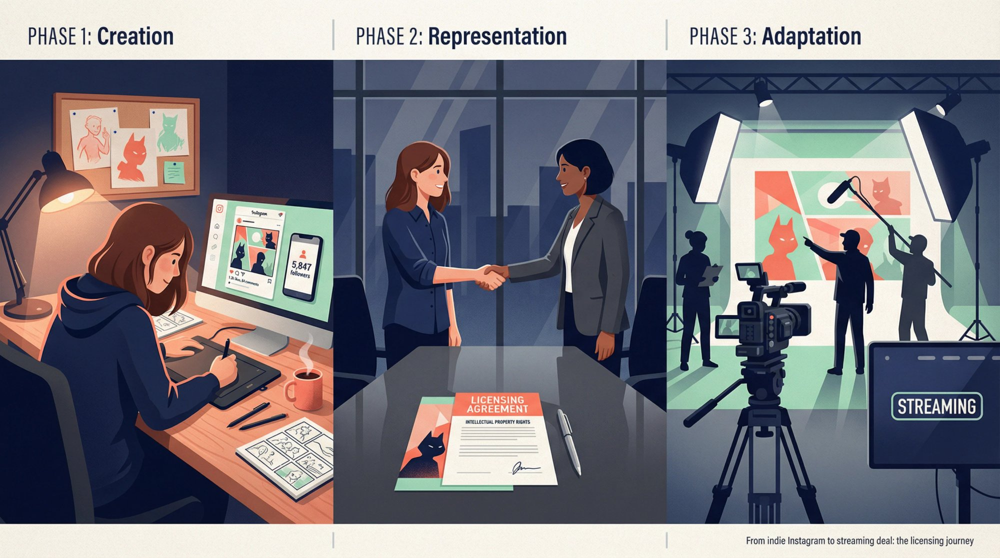

This is the long game, but worth mentioning. If your webcomic becomes popular enough, you might get opportunities to license your characters for other media. This is how *Heartstopper* went from webcomic to graphic novel to Netflix series, and how *Strange Planet* got an Apple TV+ adaptation.

These deals are the ultimate monetization. Someone pays you for the rights to make a product from your comic. If that day comes, get a good lawyer or agent to help with contracts.

For now, focus on the practical methods. [Memberships](https://www.patron.com/), merchandise, and direct fan support.

## How to Balance Free and Paid Webcomic Content

One of the trickiest parts of monetizing your webcomic is deciding what to give away versus what to hold back. Here's how to think about it.

### How the Early Access and Rolling Paywall Model Works

This is the approach we recommend. Release new comics to paying members first, then make them free after a set period (1-4 weeks). Paying supporters feel valued because they get content early. Free followers aren't cut off since they just wait. Your archive grows as discoverable content. Works especially well for story-driven comics with cliffhangers.

[Patron](https://www.patron.com/) automates this entire process. You set your release schedule, define which tiers get early access, and the platform handles the drip-unlock timing automatically. For detailed strategies, read our guide on [what is a rolling paywall](https://www.patron.com/blog/post/what-is-a-rolling-paywall/).

### Creating Exclusive Content for Paying Supporters

Keep your main comic free on Instagram, but create **bonus content** exclusively for supporters. Pet Foolery does this well: the main Pixie & Brutus strips post to Instagram for everyone, while members get [extra bonus comics each month](https://www.instagram.com/p/CXlrO_drAiA/) that casual followers never see.

This works because it doesn't affect the main storyline. Free readers don't feel like they're missing essential plot. Paying fans get extra laughs and insider content.

### Offering Paid Community Access

Some fans pay for the **community** as much as the content. Consider offering a Patron-only Discord server, behind-the-scenes updates and work-in-progress posts, live drawing sessions for subscribers, and voting on comic topics or characters.
    

### Why You Should Keep Some Content Free

Keep a steady stream of free content on Instagram. That's your growth engine. If you suddenly made everything subscriber-only, you'd stunt your reach. The better approach is additive: free content builds audience, paid content captures your most dedicated fans.

**The 1000 True Fans approach.** You might have 50,000 Instagram followers, but only 500-1,000 are "true fans" who'll buy anything you sell. Serve both groups appropriately.

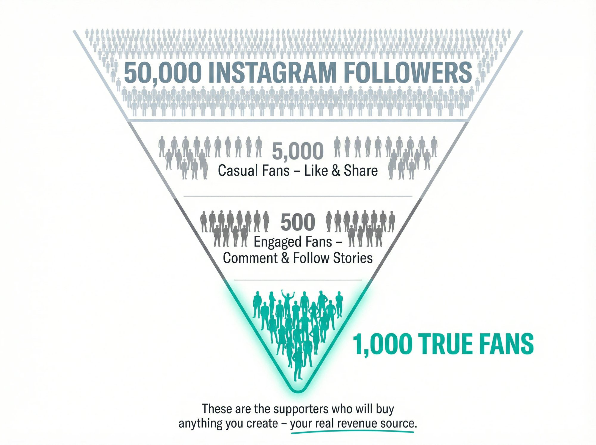

## Why Patron Is Built for Webcomic Creators

We built [Patron](https://www.patron.com/) specifically for creators who publish sequential content, like [webcomics](https://www.patron.com/blog/category/webcomics/), serialized fiction, and [podcasts](https://www.patron.com/blog/category/podcast/). Unlike platforms designed for general creators, Patron understands how episodic storytelling works.

[**Rolling paywalls**](https://www.patron.com/blog/post/what-is-a-rolling-paywall/) **are built in.** You don't have to manually move posts from paid to free. Set your schedule (new episodes to supporters, older episodes unlock for free readers after X weeks), and Patron handles it automatically. Your archive becomes a discovery funnel while your newest work stays premium.

**1% fees for early adopters.** Traditional platforms like Patreon charge 8-12% on top of payment processing. Patron takes just 1% for early adopters. On $1,000 monthly revenue, that's $90 more in your pocket compared to a 10% platform. See the [2025 fee changes](https://www.patron.com/blog/post/patreon-fee-changes-2025/) that are driving creators to explore alternatives.

**Designed for series, not random posts.** Patron organizes content into series with proper episode ordering, navigation, and scheduling. Readers can follow a story in sequence, not scroll through a jumbled feed. This matters for narrative-driven webcomics.

**Open source and creator-owned.** Patron is [Apache 2.0 licensed](https://github.com/patroninc/patron). You can trust the platform because you can see exactly how it works. And if you ever want more control, self-hosting is an option.

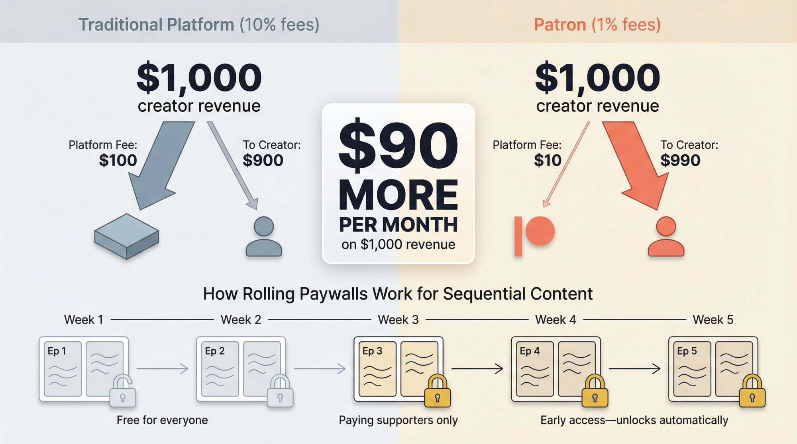

If you're currently running a membership somewhere else and frustrated by high fees or clunky tools for sequential content, consider [switching to Patron](https://www.patron.com/blog/post/switch-from-patreon-to-patron/).

## Tips for Long-Term Webcomic Monetization Success

**Be patient.** Building an audience takes time. It might be months or years of consistent posting before you gain traction. Focus on improving your craft and engaging authentically. Monetization is a marathon.

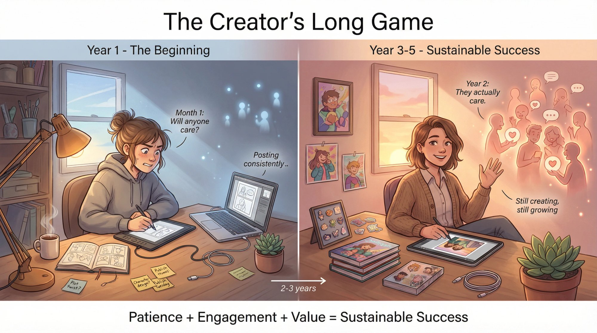

**Stay updated on platform changes.** Instagram's algorithm shifts. New features launch. Fee structures change on membership platforms. Keep an eye on these developments and adapt. Having an email list or presence on multiple platforms protects you if any single platform becomes unfriendly.

**Engage constantly.** The more connected your followers feel, the more likely they'll support you. Reply to DMs (within reason), run occasional polls, share the story behind your comics. Passion is infectious.

**Value your work.** When [setting prices for membership tiers](https://www.patron.com/blog/post/how-to-price-your-webcomic-tiers/), commissions, or products, research what others charge and don't undersell yourself. People are paying for your creativity and the joy your comic brings, not just the physical item or file.

## Common Webcomic Monetization Mistakes to Avoid

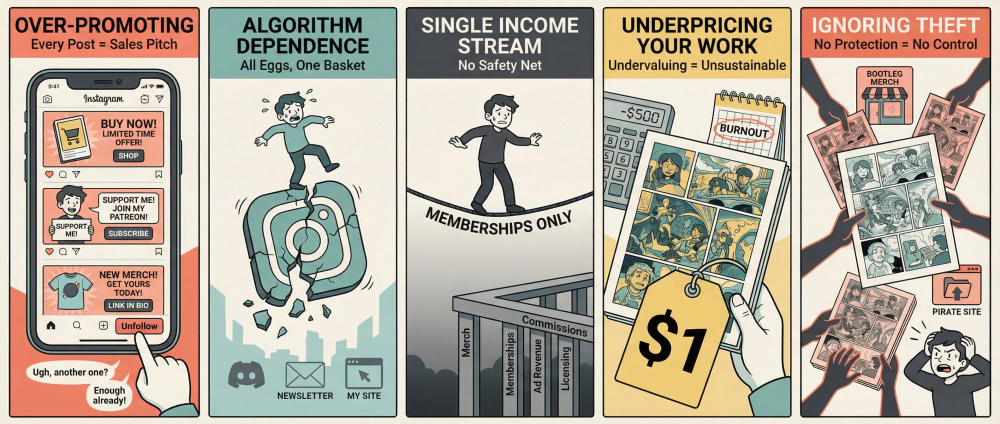

**Over-promoting.** If every post is "buy this, join that, support me," you'll turn off followers. Your Instagram should primarily be great free content. Aim for 80% content and 20% promotion. And when you do promote, frame it around the fan's benefit like "get extra comics" rather than your need like "help me pay rent."

**Algorithm dependence.** Instagram has pushed Reels heavily, and while static image posts aren't officially deprioritized, Reels naturally achieve more reach due to their discovery-focused design. If your reach drops due to algorithm changes, you'll need to adapt (maybe experimenting with animated comics as Reels) or diversify where you post. Always have ways for fans to reach you outside Instagram.

**Single income stream risk.** Don't put all your eggs in one basket. If membership revenue is 100% of your income and that platform has issues, you're stuck. Aim for a diversified mix. For example, memberships might be 50%, merch could be 30%, and commissions around 20%. The exact percentages will vary based on your situation, but diversification is protection.

**Underpricing.** New creators often charge too little out of fear. But a $1 tier with limited perks might not be sustainable, and undervaluing your work sets an expectation that's hard to raise later. Start reasonably, deliver real value, and adjust as you learn what your audience will support. Our guide on [how to price your webcomic tiers](https://www.patron.com/blog/post/how-to-price-your-webcomic-tiers/) can help.

**Ignoring theft.** Popular webcomics get their content stolen (reposted without credit, put on knockoff merchandise). Watermark your comics subtly, use services like Pixsy to find stolen art, and issue takedown requests when needed. Treat your comic like the business it's becoming.

## Frequently Asked Questions

**How many followers do I need before I can start monetizing?**

There's no magic number. Some creators launch memberships with just 1,000 followers and get their first supporters. Others wait until 10,000+. The key is *engagement quality*, not raw follower count. If you have 500 followers who comment, share, and genuinely care about your work, that's more valuable than 50,000 passive follows. Start whenever you feel comfortable asking, even if it's small at first.

**Should I use Patreon, Patron, Ko-fi, or Instagram Subscriptions?**

It depends on your needs. [Patron](https://www.patron.com/) is best if you create sequential content ([webcomics](https://www.patron.com/blog/category/webcomics/), serialized stories) and want [rolling paywalls](https://www.patron.com/blog/post/what-is-a-rolling-paywall/) with low fees. Traditional platforms are established but charge higher fees (10% for new creators). Ko-fi works well for simple tip jars or basic memberships. Instagram Subscriptions are convenient but limited in features. Many creators use a combination. For a detailed comparison, read [Ko-fi vs Patreon: Which Platform is Best for Creators](https://www.patron.com/blog/post/ko-fi-vs-patreon-which-platform-is-best-for-creators/).

**What should I charge for membership tiers?**

Start with a low entry tier ($1-$3) to make it easy for casual fans to support you. Add a mid-tier ($5-$10) with more substantial perks. Optional higher tiers ($15-$25+) can include physical items or commission work. Look at what similar creators charge and what you can sustainably deliver. Our detailed guide on [how to price your webcomic tiers](https://www.patron.com/blog/post/how-to-price-your-webcomic-tiers/) breaks this down further.

**How do I promote my membership without being annoying?**

Post about it occasionally (maybe monthly or when you hit milestones), not constantly. Show teasers of patron-only content. Thank your supporters publicly sometimes. Make your pitch about the value they get, not just your financial needs. And always deliver what you promise.

**Can I really make a living from webcomics on Instagram?**

Yes, but it usually takes time and a combination of revenue streams. Pet Foolery earns an estimated $17k-$69k monthly from memberships alone. War and Peas earns several thousand monthly from ~1,300 patrons. These creators also sell books and merchandise. It's possible, but expect it to take a couple years of consistent work to reach sustainable income.

**What if my comic is niche? Can I still monetize?**

Absolutely. Niche can actually be an *advantage* because your audience, while smaller, tends to be more passionate and committed. A fantasy webcomic about dragons might have fewer followers than a relatable "adulting" comic, but those dragon fans might be more willing to pay for exclusive content or specialized merch. Focus on serving your specific audience exceptionally well.

**Do I need to quit my job to make this work?**

No. Most successful [webcomic creators](https://www.patron.com/blog/category/webcomics/) started their comics as side projects while working other jobs. They built audiences over months or years before going full-time, if ever. Ben Hed (Pet Foolery) was working another job when his comics went viral and only transitioned to full-time after his membership income proved sustainable. Let the income grow naturally rather than leaping before you're ready.

## Start Monetizing Your Instagram Webcomic Today

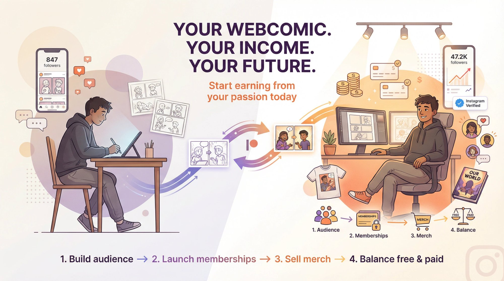

Turning your Instagram webcomic from a hobby into a source of income is absolutely achievable. Thousands of creators are doing it right now, and the path is clearer than ever.

The formula isn't complicated. **Build an engaged audience** through consistent, quality content. **Launch a** [**membership**](https://www.patron.com/) so your biggest fans can support you directly. **Diversify with merchandise, books, or commissions** as your brand grows. **Balance free and paid content** using [rolling paywalls](https://www.patron.com/blog/post/what-is-a-rolling-paywall/) so you keep growing while earning.

Your comic deserves to be seen *and* paid for. If you're creating something people love, give them the opportunity to support that work.

Ready to get started? [Check out Patron](https://www.patron.com/) for a membership platform built specifically for [webcomic creators](https://www.patron.com/blog/category/webcomics/), with [rolling paywalls](https://www.patron.com/blog/post/what-is-a-rolling-paywall/), 1% fees, and tools designed for sequential content.

Now go create something worth sharing.