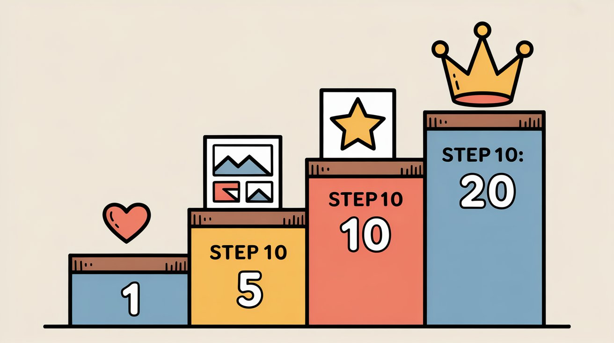
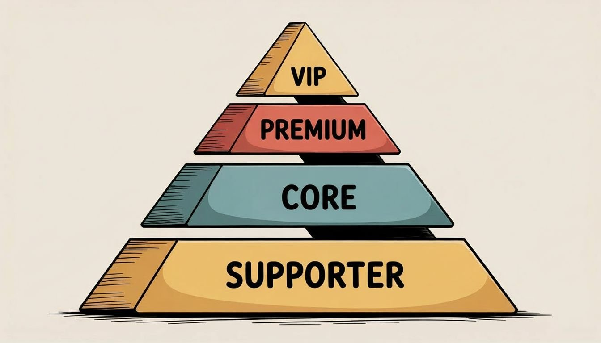
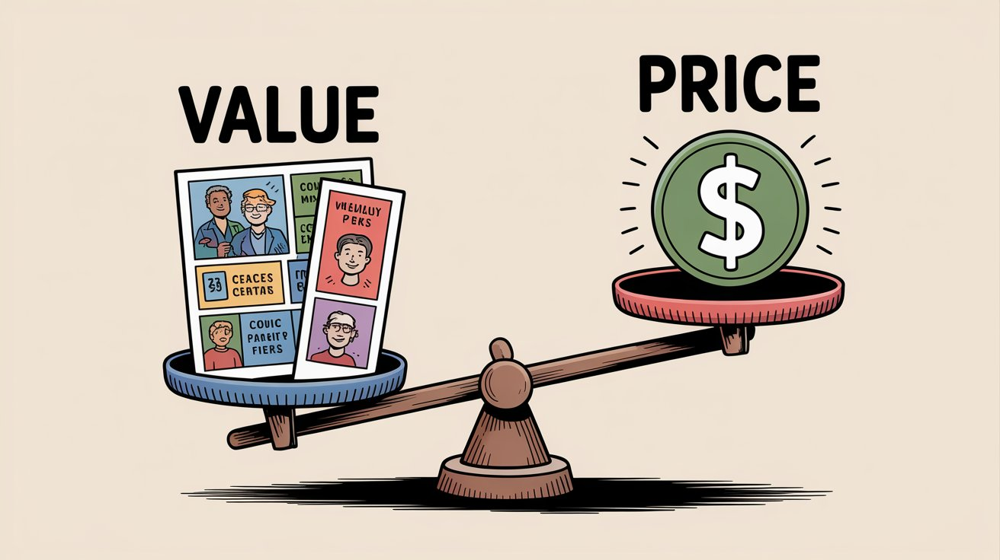
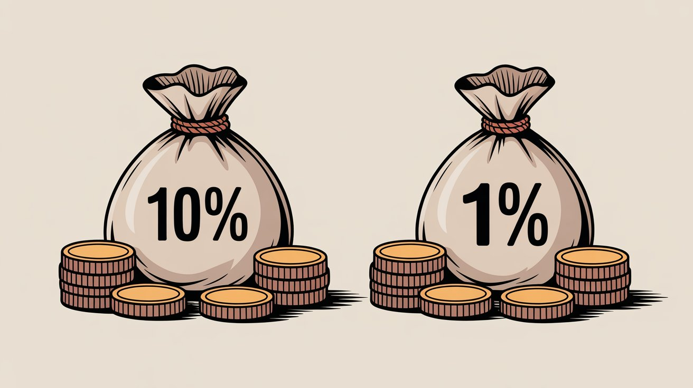

Pricing your [webcomic's membership tiers](https://www.patron.com/blog/category/webcomics) is part art and part science. Set them too low and you undervalue your work. Set them too high and you scare away potential supporters. Finding that sweet spot matters in 2025's creator economy, especially as more webcomic artists turn to membership platforms for steady income.

This [guide](https://www.patron.com/blog/category/guides) breaks down exactly how to price your membership tiers strategically. You'll learn how to make fans feel they're getting great value while you earn sustainable revenue through rolling paywalls and early access models.

If you're searching for how to price your webcomic tiers, you're probably gearing up to offer monthly subscriptions with special perks. Your goal is converting loyal readers into paying patrons by offering early access through a [rolling paywall](https://www.patron.com/blog/post/what-is-a-rolling-paywall/), bonus content, or other rewards at different price levels. The rolling paywall model has become the backbone of successful webcomic monetization because it lets you monetize urgency and engagement without permanently locking anyone out of your work. By the end of this guide, you'll understand which price points make sense for early access tiers, how to structure your offerings around a rolling release schedule, and real world examples of creators earning substantial income through timed exclusivity.

## The Proven Tier Structure That Actually Works

Before diving into theory, let's look at what successful creators actually do. Three web serial creators earning a combined $119,000 per month on Patreon use essentially the same tier structure. This isn't coincidence. It's a proven model that balances fan psychology, value perception, and creator sustainability.

[Zogarth](https://www.patreon.com/zogarth) earns $81,376 per month from The Primal Hunter with three main tiers. His $5 Alchemist tier offers 25 chapters ahead (about five weeks of content at his 5 to 7 posts per week schedule). The $10 Hunter tier, marked as most popular, provides 50 chapters ahead (roughly 10 weeks of content). For superfans, a $50 Apex Hunter tier with limited slots adds premium Discord perks on top of full access.

[Ryn](https://www.patreon.com/cw/Ryn31) pulls in $18,000 monthly with an almost identical structure at slightly different price points. The $3 tier gives 5 chapters ahead, the $5 tier offers 10 chapters ahead, and the $10 tier (also marked most popular) provides 25 chapters ahead. With 5 to 7 updates weekly, subscribers at the top tier stay about four weeks ahead of free readers. The pattern holds.

[Actus](https://www.patreon.com/actus) earns $20,000 per month managing multiple series simultaneously. The $5 First Mate tier provides 25 chapters ahead on one series and 10 chapters on another. The $10 tier, again the most popular, offers complete written content access (50 plus chapters) on the main series and 25 chapters ahead on the secondary series. The multi project approach scales the same basic structure across different stories.

These three creators demonstrate the power of the standard three tier model. Entry tier priced at $3 to $5 with modest early access (5 to 10 chapters ahead). Core tier at $5 to $10 with substantial lead time (10 to 25 chapters ahead). Premium tier at $10 to $15 offering maximum early access (25 to 50 plus chapters ahead). All three mark their $10 tier as most popular, showing where fans perceive optimal value.

For webcomic creators, this translates directly. If you post three times weekly, a $5 tier offering two weeks ahead gives subscribers around six episodes of lead time. A $10 tier with four weeks ahead provides roughly 12 episodes. The specific chapter counts matter less than the principle. Entry tier gives a taste, core tier provides substantial lead time, premium tier offers being as far ahead as possible.

This structure works because it creates clear value steps without overwhelming fans with choices. The price points ($3, $5, $10) feel psychologically safe. The early access windows scale logically. Most importantly, the model is sustainable. You're not promising custom artwork or bonus content. Your regular updates become the reward, delivered to paying subscribers weeks before free readers.

The rest of this guide explains why this model works and how to implement it for your webcomic. But understand the foundation first. Three creators, three different series types, same basic structure, $119,000 per month in combined earnings, these are proven results from the rolling paywall model in action.

## What Do Successful Webcomic Creators Charge for Their Tiers

The proven model gives you a strong starting point, but researching your specific niche adds valuable context. Use tools like Graphtreon (which tracks creator platform statistics) to find top creators in your category. Filter by Comics or Writing to see the most supported creators. You'll likely find the same $3/$5/$10 pattern emerging repeatedly. This isn't copying. It's validation that market expectations cluster around these price points.

When you research, you're looking for two things. First, confirmation that the standard model applies to your genre. Second, any unique variations that might make sense for your specific situation. A beautifully illustrated comic updating twice weekly might price at the higher end of each range ($5/$10/$15) compared to a sketch style comic posting monthly. But the basic three tier structure remains constant.

Ask yourself where do you fit in relative to creators you admire. Similar quality and update schedule? Start with their pricing as your baseline, which will likely align with the proven model. Just beginning with a small audience? Consider starting at the lower end of each tier range ($3/$5/$10) to reduce friction for early supporters. Building momentum matters more than maximizing per patron revenue when you're establishing your base.

Quality and consistency matter equally. Your rolling paywall works best when you maintain consistent releases because the paywall keeps rolling forward with each new episode. If you can confidently create content as good as or better than what higher priced creators offer at the same posting frequency, you can justify matching their pricing. If you're still developing your skills or finding your rhythm, it's perfectly fine to start conservatively. You can always adjust later.

> **Pro tip** Consider grandfathering existing patrons if you ever raise prices. [Patron](https://patron.com/) and other platforms allow creators to increase a tier's price for new subscribers only, so your current supporters stay at the old rate. This rewards early supporters and avoids sudden sticker shock that could lead to cancellations.

By doing your homework on where peers are pricing their tiers, you'll validate that the proven $3/$5/$10 structure works across different genres and styles. You'll also spot creative reward ideas and understand what fans value most, which is almost always early access to your story rather than complex bonus content. The research isn't about reinventing the wheel. It's about gaining confidence that the wheel actually rolls.

## How Many Membership Tiers Should You Offer

The data from successful creators is clear. Three tiers is optimal. Zogarth, Ryn, and Actus all use three core tiers (with Zogarth adding an optional fourth premium tier). This isn't coincidence. Three tiers provides enough variety to capture different commitment levels without overwhelming potential supporters with analysis paralysis.

Why does three work so well? It creates a natural good, better, best psychology. Entry tier gets fans in the door at low commitment. Core tier offers compelling value that feels like the smart choice. Premium tier gives superfans a way to maximize their access. More than three main tiers dilutes the value proposition of each. Fewer than three leaves money on the table by not serving different fan segments.

Here's how to implement the proven three tier structure adapted from creators earning $119,000 combined monthly:

### Tier 1 Entry Level ($3 to $5)

This is your accessible entry point priced for maximum conversion. At $3 to $5 monthly (the cost of a fancy coffee), you're removing price objections while still delivering meaningful value. The rolling paywall makes this tier sustainable because you offer modest early access without extra work. Think 5 to 10 chapters or episodes ahead depending on your posting frequency.

For webcomic creators posting three times weekly, a $3 tier offering one week ahead gives subscribers around three episodes of lead time. A $5 tier with two weeks ahead provides roughly six episodes. The specific count matters less than giving fans enough lead time to feel ahead without being so far that the gap feels insurmountable.

This tier converts casual fans who want to support you but aren't ready for larger commitments. Keep perks focused entirely on early access through your rolling paywall. No custom content, no physical goods, just straightforward time advantage. Whether 10 people or 1,000 people join at this tier, your workload remains identical.

### Tier 2 Core Value ($5 to $10)

This is your sweet spot tier and will likely become most popular (just like it is for Zogarth, Ryn, and Actus). Price it at $5 to $10 monthly and deliver substantial early access that makes fans feel significantly ahead. Think 10 to 25 chapters or episodes ahead depending on your posting rhythm.

For webcomic creators posting three times weekly, a $10 tier offering four weeks ahead gives subscribers around 12 episodes of lead time. Post weekly? Four weeks ahead means four episodes. The goal is providing enough buffer that subscribers feel comfortably ahead of plot developments and cliffhangers that free readers are still experiencing.

This tier succeeds because the value jump from entry tier feels obvious and worthwhile. Doubling or tripling the early access window for just $5 to $7 more creates clear upgrade incentive. Most of your paying audience will land here because it balances value and affordability perfectly. The rolling paywall model makes this tier profitable since you're simply controlling unlock timing, not creating extra content.

### Tier 3 Maximum Access ($10 to $15)

This premium tier serves devoted fans willing to pay double digits to be as far ahead as humanly possible. Price it at $10 to $15 monthly and deliver maximum early access. Think 25 to 50 plus chapters or episodes ahead. For many creators, this means complete written content access where subscribers read everything you've created so far.

For webcomic creators posting three times weekly, a $15 tier offering eight weeks ahead gives subscribers around 24 episodes of lead time. Subscribers at this level experience your story at the cutting edge, seeing plot developments and twists months before free readers.

Only a fraction of your audience will opt for this tier, which is expected and appropriate. These are superfans who can't stand waiting and value being first above all else. The rolling paywall makes serving them easy because you're not doing extra work, just extending the access window to its maximum. You can add light perks like high resolution downloads or behind the scenes commentary, but the extended early access window is the main draw.

### Optional Tier 4 Superfan ($50 and up)

Some creators add a fourth tier at $50 or more for truly dedicated supporters. Zogarth does this with his Apex Hunter tier, offering the same content access as the $10 tier but adding premium Discord perks and limited availability (creating scarcity and exclusivity). Only 16 of 25 slots are filled, showing this tier serves a small but valuable audience segment.

If you add this tier, make it about exclusivity and community rather than content. Permanent custom Discord roles, quarterly video hangouts, character cameos, or limited physical merchandise work well. Keep slots limited so you don't accidentally create a part time job fulfilling dozens of high touch rewards monthly.

Most creators should start with three tiers and add a fourth only after proving demand at the $10 to $15 level. It's easier to add tiers than remove them. The three tier foundation ($3 to $5, $5 to $10, $10 to $15) provides everything you need to build sustainable rolling paywall income.

## What Price Points Work Best for Webcomic Memberships

The three creators earning $119,000 combined monthly have spoken with their results. The price points that work are $3, $5, and $10 as your core three tiers. These aren't arbitrary numbers. They're the result of thousands of creators testing what fans will actually pay for rolling paywall early access.

Zogarth uses $5 and $10 as his main tiers. Ryn uses $3, $5, and $10. Actus uses $5 and $10. Notice the pattern? These specific dollar amounts recur because they hit psychological sweet spots that maximize conversion while delivering clear value differentiation.

### Why These Specific Numbers Work

The $3 to $5 entry point removes price objections. It's coffee money. Fans who want to support you can justify this amount without budget stress. The low friction converts casual supporters who might balk at $7 or $10 but happily pay $3 to $5 for modest early access.

The $5 to $10 core tier hits the value sweet spot. Fans perceive this as reasonable monthly entertainment expense (less than a single movie ticket or streaming service). The price feels substantial enough to deliver real value without feeling expensive. This is why all three successful creators mark their $10 tier as most popular. It's the goldilocks price point where value perception peaks.

The $10 to $15 premium tier serves superfans without scaring away your core audience. Fans willing to pay double digits are already committed. They're not price sensitive at this level. They want maximum access and will pay for it. Going higher than $15 for pure digital early access typically requires adding physical goods or personalized perks.

Jumping to oddball numbers like $6 or $8 can hurt conversion. $6 feels psychologically closer to $10 than to $5 in a patron's mind, reducing its appeal as an entry tier. $8 sits in no man's land between accessible and premium. Stick to the proven $3/$5/$10 framework unless you have specific reasons to deviate.

### Align Price with Value

A guiding rule stands firm: if you wouldn't pay that amount for the content, chances are your audience won't either. Each tier's price should correlate with what you're delivering through your rolling paywall window.

Take a hard look at your tier rewards and ask yourself, would I feel this is worth $X a month? If not, you either need to add more value or adjust the price down. For example, charging $15 per month for just a couple extra sketch doodles might feel steep. But $15 for access to four weeks of pages ahead through your rolling paywall? That might feel like a bargain to readers who can't stand waiting.

Perceived value is what matters. Your mid tier should feel like a no brainer upgrade from the $1 tier (so much more lead time for just a few bucks more). Your top tier should feel like an exclusive club where subscribers are living at the cutting edge of your story.

### Don't Overprice Pure Digital Content

One interesting insight emerges from successful creators: they rarely price core digital content above $10 per month. In other words, if your main offer is access to my comic through a rolling paywall, there's a pricing ceiling before fans expect something more tangible.

Higher tiers that go $20 or more typically involve physical goods, commissioned work, or very personal interactions rather than just more digital comics. Generally, $5 to $10 is plenty to charge for ongoing exclusive comic access through a rolling release schedule. Pushing a regular pages but sooner tier to $20 might work only if your comic is extremely sought after or you bundle other significant perks with it. The rolling paywall model thrives in the $1 to $10 range because most readers feel comfortable paying for timed exclusivity in this price range.

### Consider Regional Pricing Realities

Your audience might be global. $5 USD a month might be easy for an American fan but relatively expensive for a reader in the Philippines or Brazil. While most platforms don't allow different prices by region, they do support local currency payments.

One indirect way to account for this is by keeping a low entry tier (like $1 to $2) universally available. That way fans who can't afford $5 still have an option to support you modestly and get at least a few days of early access through your rolling paywall. A larger international fan base at $1 can still add up to meaningful income.

### Test and Adjust Gradually

Pricing isn't permanent. Many creators have tweaked their tier prices after launch. The key is to do it carefully. If you raise a tier price, consider grandfathering existing patrons at the old rate so only new sign ups pay the higher price. If you lower a price or rearrange rewards, communicate clearly with your patrons about why. You might also experiment with different rolling paywall windows to see what converts best.

> **Key insight** Your community's trust is paramount. Avoid drastic changes without explanation, but minor adjustments based on real demand are absolutely fine.

Maybe you find almost everyone joins at $3 and hardly anyone at $7, so you combine into a $5 tier with a two week early access window. This is a reasonable tweak you can make after observing a few months of data.

### Be Aware of Fees

Different platforms take different cuts. Traditional platforms typically charge 10% of creator earnings for new creators (as of August 2025), plus payment processing fees (around 2.9% plus $0.30 per transaction). Budget around 13% to 15% in total platform and payment fees.

[Patron](https://patron.com/) charges only 1%, with similar card processing on top. These fee differences don't change what fans pay, but they change what you keep. Here's a concrete example showing monthly revenue of $1,000:

| Feature | Traditional Platform (10%) | Patron (1%) |
| --- | --- | --- |
| Monthly Revenue | $1,000 | $1,000 |
| Platform Fee | $100 | $10 |
| Processing Fees (2.9% plus $0.30) | $59 | $59 |
| **You Keep** | **around $841** | **around $931** |
| **Difference** | Base | **plus $90 more** |

> **Fee caveats** For $1 to $3 tiers, Patreon uses micropayment rates (USD is 5% plus $0.10), which raises the effective percentage versus the $10 example above. If a fan pays in a currency different from your payout currency, Patreon adds a 2.5% currency conversion fee. See Patreon's [Creator fees overview](https://support.patreon.com/hc/en-us/articles/11111747095181) and [currency conversion article](https://support.patreon.com/hc/en-us/articles/360044469871) for details.

Over hundreds of patrons, that adds up. Price based on value to the fan, not your fees. Then choose a platform that lets you keep more of it. [Patron was specifically built for rolling paywall content](https://www.patron.com/blog/post/what-is-a-rolling-paywall/) with automated unlock scheduling, which means you save time while also saving money on fees.

## How to Create Rewards That Justify Your Prices

The beauty of the rolling paywall model is that pricing and rewards become elegantly simple. Higher prices mean longer early access windows rather than more labor intensive perks. Lower prices offer shorter windows. The mistake to avoid is overcomplicating your tiers with bonus content when early access alone is what fans truly want.

### Match Perks to Tier Value

Your $2 tier might simply offer early access to each new page a few days ahead of the free release. If you post three times per week, that means subscribers stay about one or two episodes ahead. It's low priced and the perk is exciting for fans but requires zero extra work from you. Your regular content is the reward.

Move up to a $5 tier, and you extend that window. Maybe subscribers read two weeks ahead (around six to seven episodes if you post three times weekly, or two to three episodes if you post weekly). This tier gives readers substantial lead time without requiring you to produce separate bonus material.

By $10 or more, perks should feel more exclusive. Perhaps subscribers access three to four weeks ahead (around 10 to 12 episodes for frequent posters, or three to four episodes for weekly updates). At this price point, fans expect to be as far ahead as possible in your story. You can add light extras like high resolution art downloads or behind the scenes commentary, but the extended early access window is the main draw.

### Design Perks that Scale

One of the biggest errors new creators make is overcommitting on low tiers. Imagine promising every $3 patron a custom chibi drawing. If 100 people join, you've sold 100 drawings for $3 each. This approach leads directly to burnout.

The rolling paywall model solves this problem elegantly. Early access scales perfectly because whether 10 people or 1,000 people subscribe, your effort remains exactly the same. You're simply controlling the timing of when content unlocks rather than creating personalized rewards for each supporter.

For lower tiers, stick to scalable rewards like early access windows. A $3 tier might offer one week ahead (around three to four episodes if you post frequently, or one episode if you post weekly). Whether 10 people or 1,000 people join at this tier, your workload doesn't change. This is key to making your membership sustainable. Reserve custom or one on one perks for higher tiers and limit the quantity if needed, but make early access through your rolling paywall the foundation of every tier.

### Beware of Reward Creep

It's tempting to keep adding perks to make a tier more attractive, but more isn't always better, especially if those perks pile up on you. The rolling paywall protects you from this trap because early access itself is the core value proposition. Always ask yourself, can I realistically deliver this every month or every week?

If the answer is not sure, don't promise it. For instance, offering a new exclusive illustration every week at the $5 tier might excite fans, but can you keep that pace on top of making your main comic? The beauty of the rolling paywall is that you don't need to. Your regular comic updates are the reward, just delivered to subscribers weeks earlier than to free readers.

Consistency builds trust. As [Patron's monetization guide](https://www.patron.com/blog/post/how-to-monetize-a-webcomic/) notes, one or two solid perks beat ten promises you can't keep. With a rolling paywall, your one solid perk is early access (perhaps paired with one light bonus like high res downloads). You can always surprise patrons with extras if you're feeling generous in a given month, but set the baseline deliverables to something you can handle even during busy periods.

### Use Limited Slots for High Tiers

Platforms allow you to cap a tier's memberships. If you have a $50 tier where you critique a patron's art or do a 30 minute video call, you might limit that tier to 5 people. This ensures you don't accidentally end up with 50 people wanting a call.

Limited tiers can also create urgency (only 2 spots left), though this is secondary to making sure you don't overload yourself. For most creators, unlimited slots work fine for tiers based purely on early access through the rolling paywall since that scales effortlessly.

### Get Feedback from Your Patrons

If a certain tier isn't popular, consider running a quick poll or asking followers what they'd want at that level. Maybe your $10 tier isn't enticing because the early access window isn't long enough to justify the price jump from $5. Or maybe fans would happily pay $10 for four weeks ahead (around 12 episodes if you post three times weekly, or four episodes if you post weekly) instead of the two weeks (around six to seven episodes or two episodes) you currently offer.

On the flip side, if you have a $3 tier with high demand and people keep requesting to be even further ahead in the story, this might indicate some could be nudged to a $5 tier with an extended rolling paywall window. Your community's input is gold. Don't be afraid to adjust your offerings based on what your patrons value.

In short, price and perks have to be in harmony. When you promise the right early access window at the right tier, people will feel happy to give you their money each month. The rolling paywall makes this harmony easier to achieve because you're not juggling complex reward tiers, just simple time windows.

## How Top Creators Earn $119k Monthly with Rolling Paywalls

You've seen the theory. Now let's examine the real numbers from three web serial creators who prove the model works. Together they earn $119,000 per month using essentially the same tier structure. These aren't outliers or lucky breaks. They're systematic implementations of the rolling paywall principles we've discussed.

### Zogarth The Primal Hunter ($81,376 Per Month)

Zogarth dominates web serial fiction with The Primal Hunter, earning over $81,000 monthly from nearly 10,000 paying members. His tier structure demonstrates the proven model in perfect execution. The $5 Alchemist tier offers 25 chapters ahead, giving subscribers about five weeks of content lead time at his 5 to 7 posts per week schedule. This entry tier converts fans who want meaningful early access without breaking their budget.

The $10 Hunter tier, explicitly marked as most popular, provides 50 chapters ahead.Roughly 10 weeks of content or about two and a half months of lead time. This tier captures the sweet spot where value perception peaks. Fans feel significantly ahead of free readers while the price stays in that goldilocks zone of reasonable monthly entertainment expense.

For superfans, Zogarth offers the $50 Apex Hunter tier. This tier provides the same content access as the $10 tier but adds premium Discord perks with permanent custom colors that persist even if members downgrade later. Critically, this tier has limited availability with only 16 of 25 slots filled. The scarcity creates exclusivity while the Discord perks add community value beyond just early access.

The posting frequency matters enormously here. At 5 to 7 updates weekly, Zogarth maintains massive chapter lead times that justify his pricing. A webcomic creator posting three times weekly could achieve similar tier differentiation with proportionally adjusted chapter counts. The principle remains constant. Entry tier gets you ahead, core tier gets you significantly ahead, premium tier maximizes your lead.

### Ryn ($18,000 Per Month)

Ryn validates the same model at a different scale, earning $18,000 monthly with an almost identical tier structure. The $3 tier provides 5 chapters ahead. The $5 tier offers 10 chapters ahead. The $10 tier, again marked most popular, delivers 25 chapters ahead. With 5 to 7 updates weekly, subscribers at the top tier stay about four weeks ahead of free readers.

The beauty of Ryn's structure is how clearly it demonstrates value scaling. Each tier roughly doubles or more than doubles the previous tier's chapter count. From 5 to 10 to 25 creates obvious upgrade incentives. A fan at the $3 tier can easily see why jumping to $5 doubles their lead time for just $2 more monthly. The $10 tier more than doubles again, offering maximum access for fans who can't stand waiting.

For webcomic creators, Ryn's model translates perfectly. If you post three times weekly, a $3 tier with one week ahead gives around 3 episodes. A $5 tier with two weeks ahead provides around 6 episodes. A $10 tier with four weeks ahead delivers roughly 12 episodes. The specific counts scale with your posting frequency, but the value ratio between tiers stays consistent.

Ryn also notably increases posting frequency slightly at higher tiers (6 updates weekly at $10 versus 5 to 7 at lower tiers), showing another way to add value at premium levels without creating unsustainable workload. The extra update per week compounds with the longer early access window to make the $10 tier feel truly premium.

### Actus ($20,000 Per Month)

Actus demonstrates how the proven model scales across multiple projects simultaneously, earning $20,000 monthly from several series. The $5 First Mate tier provides 25 chapters ahead on Return of the Runebound Professor and 10 chapters ahead on Rise of the Living Forge. This multi series approach offers substantial value at the entry price point by bundling access across projects.

The $10 tier takes a different approach by offering complete written content access (50 plus chapters) on the main series plus 25 chapters ahead on the secondary series. This complete access model shows another way to structure premium tiers. Instead of just extending weeks ahead, you give subscribers everything you've written so far. They're not just ahead. They're at the absolute cutting edge of your creative output.

Actus also offers a separate $10 tier for Nightmare Realm Summoner with all written content (20 plus chapters) and 4 chapters per week release schedule. This demonstrates the flexibility of the model for creators managing multiple projects at different stages and posting frequencies. The core principle stays the same. Subscribers pay for timed access, with higher tiers providing more complete access across your portfolio.

For webcomic creators considering multiple series, Actus provides the template. Your entry tier might bundle modest early access across all your comics. Your core tier extends that window significantly. Your premium tier offers complete access to everything you create. The rolling paywall makes this sustainable because you're not creating separate content for each series. You're controlling unlock timing across your portfolio.

### The Pattern That Drives $119k Monthly

Three creators, three different series types, same fundamental structure. Entry tiers at $3 to $5 with modest chapter leads (5 to 25 chapters). Core tiers at $5 to $10 with substantial leads (10 to 50 chapters). All three mark $10 as most popular, validating that price point as the value sweet spot. Optional premium tiers add community perks or multi series access without changing the core model.

The combined $119,000 monthly earnings prove this isn't theoretical. It's systematically repeatable. The rolling paywall model works because it scales infinitely (whether you have 100 or 10,000 subscribers, your workload stays constant), provides clear value differentiation (chapter counts create obvious tier differences), and monetizes urgency (fans pay to stay ahead of cliffhangers and plot developments they're already hooked on through free content).

For webcomic creators, the translation is direct. Replace chapters with episodes or pages. Adjust counts based on your posting frequency. Keep the three tier structure. Price at $3 to $5, $5 to $10, and $10 to $15. Mark your middle tier as best value. Add optional premium tiers only after proving demand. This is the proven model backed by $119,000 monthly in real creator earnings.

## When to Deviate From the Standard Model

The three tier $3/$5/$10 structure works because it's been tested by thousands of creators and proven with real earnings data. You should start here. But understanding when and why to deviate from the standard model matters just as much as knowing the standard itself. Deviation should be strategic, not random.

Established creators with existing brand recognition can successfully price higher than the standard ranges. If you're already well known with a dedicated following built over years, you have pricing power that new creators don't. Your fans already trust your quality and consistency. A creator with 50,000 engaged readers might successfully charge $7/$12/$20 for similar early access windows that a newcomer offers at $3/$5/$10. The content value remains the same, but the brand premium justifies higher pricing. That said, even established creators rarely stray far from the proven ranges because fan psychology around value perception stays consistent regardless of creator fame.

Creators managing multiple projects simultaneously can bundle access in ways that justify premium positioning. Actus demonstrates this perfectly with combined series access across tiers. If you produce two or three webcomics updating on different schedules, your $10 tier might offer complete early access across your entire portfolio rather than just one series. The workload per series stays manageable while the combined value perception increases. This multi project approach lets you price at the higher end of each tier range ($5/$10/$15 instead of $3/$5/$10) because subscribers receive multiple content streams for a single subscription price.

Very high frequency posting opens opportunities for extended chapter counts that feel more valuable. Zogarth and Ryn both post 5 to 7 times weekly, which enables offering 25 to 50 chapters ahead while maintaining reasonable time windows (five to ten weeks). A webcomic creator posting daily could offer similar chapter counts at even shorter time windows, making early access feel more immediately valuable. If you post once daily (seven episodes weekly), a two week early access window gives subscribers around 14 episodes ahead. That substantial chapter count might justify pricing at $7 instead of $5 for what's still just a two week window. The frequency amplifies perceived value without changing the fundamental rolling paywall model.

Early stage creators face the opposite situation and should consider starting conservative. If you have fewer than 20 episodes published and a small following, launching with just two tiers ($3 and $5) keeps the structure simple while you prove consistency. You can always add a $10 premium tier after six months when you've built more archive depth and audience trust. Starting lean reduces complexity during your growth phase. The rolling paywall still works with just two tiers. You're simply deferring the premium tier until demand justifies it.

Creators with very slow update schedules (monthly or less frequent) need to adjust chapter counts dramatically. If you post one long form episode monthly, a $5 tier offering two months ahead only provides two episodes of lead time. That feels thin compared to the 6 to 12 episodes that faster posting creators deliver at the same price point. You might need to price lower ($2/$5/$8 instead of $3/$5/$10) to match the perceived value, or you might bundle additional perks like high resolution downloads and behind the scenes process content to shore up value at standard pricing. The rolling paywall principle stays the same, but you're working against the limitation of infrequent posting.

Geographic audience concentration matters when most of your readers come from regions with different purchasing power. If 80% of your audience lives in Southeast Asia or South America where $5 USD represents a significantly larger portion of discretionary income, you might find that a $2/$4/$8 structure converts better than $3/$5/$10. This isn't about devaluing your work. It's about matching your pricing to your audience's economic reality. The flip side also applies. If your audience skews heavily toward high income regions and you produce premium illustrated content, you might successfully price at $4/$7/$12. Know your audience demographics before deviating.

Creators offering physical goods or high touch perks need premium tiers priced accordingly. If you're printing monthly art cards, running video hangouts, or offering personalized commissions, those labor intensive rewards require pricing that compensates your time properly. A $20 tier offering two hours of your time per month on personalized content is reasonable. A $50 tier with physical merchandise shipped internationally needs to cover production and shipping costs plus your effort. These premium tiers should supplement rather than replace your digital early access foundation. Keep your $3/$5/$10 core structure for pure digital rolling paywall access, then add optional high touch tiers at $20 or above for fans willing to pay for personalization.

The pattern across all successful deviations stays consistent. Start with the proven three tier $3/$5/$10 model as your foundation. Deviate only when you have specific strategic reasons backed by your unique situation. Your established brand, multiple projects, posting frequency, audience size, update schedule, geographic concentration, or premium offerings might justify adjustments. But the adjustments should be measured (moving from $5 to $7, not from $5 to $15) and grounded in clear value differences that fans can understand and appreciate.

When in doubt, trust the model. Three creators earning $119,000 combined monthly didn't get there by reinventing the wheel. They implemented the proven structure systematically and let it work. Your creativity belongs in your content, not in experimental pricing schemes that haven't been tested. The boring, repeatable, data backed approach wins in creator monetization. Save your innovation for your story. Let the pricing structure be predictable and proven.

## Quick Tips for Implementing the Proven Model

Let's distill the essential principles for implementing the $3/$5/$10 proven model generating $119,000 monthly for the three creators we've studied.

Start with the standard three tier structure. Price your entry tier at $3 to $5, your core tier at $5 to $10, and your premium tier at $10 to $15. These specific price points have been validated across thousands of creators and different genres. They hit psychological sweet spots where fans perceive clear value without price resistance. Don't get creative with $6 or $8 pricing unless you have specific strategic reasons. The boring, proven approach wins.

Mark your middle tier as most popular. Zogarth, Ryn, and Actus all explicitly highlight their $10 tier as the best value option. This social proof guides new subscribers toward the tier where you want most conversions. The middle tier should offer substantial early access (think two to four weeks ahead, or roughly 6 to 12 episodes if you post three times weekly) at a price that feels like the smart choice. Most of your revenue will come from this tier when properly positioned.

Scale your early access windows with your posting frequency. If you post three times weekly, a $5 tier might offer two weeks ahead (around six episodes) while a $10 tier provides four weeks ahead (around 12 episodes). Post daily? Those same time windows give substantially higher episode counts (14 episodes and 28 episodes respectively), which increases perceived value. The principle stays constant regardless of frequency. Entry tier gives a taste, core tier provides substantial lead time, premium tier maximizes access.

Keep perks focused on early access through your rolling paywall. The beauty of the proven model is its simplicity. You're not promising bonus content, custom artwork, or labor intensive rewards. You're controlling unlock timing on content you're already creating. Whether 10 people or 10,000 people subscribe, your workload remains identical. This is how the model scales sustainably. Reserve non scalable perks like Discord roles or community access for optional premium tiers above $15.

Use Discord strategically for community building at higher tiers. All three successful creators leverage Discord for subscriber engagement. Basic Discord access might start at your $5 tier, with premium roles and exclusive channels at $10 and above. Zogarth's $50 tier offers permanent custom Discord colors even after downgrading, showing how community perks can add value beyond pure early access. Discord costs you nothing extra but significantly increases the stickiness of higher tier subscriptions.

Calculate your chapter counts based on real posting schedules. Don't promise 25 chapters ahead if you only post twice weekly. This would be nearly three months of content. Better to offer 8 to 10 chapters ahead (about four to five weeks) at your $10 tier. Conversely, if you post five to seven times weekly like Zogarth and Ryn, you can confidently offer 25 to 50 chapters ahead because that still translates to reasonable time windows (five to ten weeks). The specific chapter counts matter less than ensuring the time window feels valuable but not insurmountable.

Consider limited slots only for premium tiers above $20. Zogarth limits his $50 Apex Hunter tier to 25 slots with only 16 filled. This scarcity creates exclusivity and prevents overcommitment on high touch perks. Your core tiers ($3/$5/$10) should have unlimited slots because they're built on the scalable rolling paywall model. Limited slots work for tiers where you're adding personal interaction or physical goods that genuinely require capping participation.

Launch with fewer tiers if you're just starting. Early stage creators with small audiences should consider starting with just two tiers ($3 and $5) to keep things simple while building momentum. You can always add a $10 premium tier after six months when you've proven consistency and built archive depth. Better to launch lean and scale up than to launch with four tiers that confuse subscribers and dilute your value proposition.

Grandfather existing patrons when raising prices. If you adjust a tier from $5 to $7 after six months, let existing subscribers keep the $5 rate while new sign ups pay $7. This rewards early supporters and prevents cancellation waves from sudden price jumps. Most platforms including Patron support grandfathered pricing automatically. Use price increases strategically to capture more value from new subscribers without punishing loyalty.

Focus your marketing on the story hook, not the pricing. When promoting your membership, lead with why fans can't wait to read ahead in your story. The cliffhangers, the character development, the plot twists they're dying to know about. The rolling paywall monetizes impatience and urgency. Your marketing should emphasize how far ahead subscribers can read and what story beats they'll experience first, with pricing as a secondary detail. Frame tiers as Read four weeks ahead now rather than Join the $10 tier.

Wait until you have momentum before launching paid tiers. If your webcomic has fewer than 20 episodes published and a tiny following, paid memberships will struggle regardless of pricing. Readers need to be invested in your story before they'll pay to stay ahead. Build your free archive first, prove your posting consistency, develop your audience, and then launch rolling paywall tiers when fans are already hooked. The model works best when you have something worth being impatient about.

## Start With the Proven Model Today

You now have the blueprint generating $119,000 monthly for three web serial creators. This isn't theory or speculation. It's a proven, systematically repeatable model backed by real earnings data and thousands of paying subscribers.

The foundation is simple. Three tiers priced at $3 to $5, $5 to $10, and $10 to $15. Early access windows that scale with each tier, providing roughly one to two weeks, two to four weeks, and four to eight weeks ahead respectively (adjusted for your specific posting frequency). Mark your middle tier as most popular. Keep perks focused on the rolling paywall model where you control unlock timing rather than creating bonus content. Let Discord handle community building at higher tiers.

Start here. Implement this exact structure before you try to optimize or innovate. Zogarth, Ryn, and Actus didn't reinvent the wheel. They executed the proven model consistently and let compound growth do its work. Your creative energy belongs in your webcomic, not in experimental pricing schemes that haven't been validated by real market data.

The rolling paywall makes this model elegantly sustainable. Whether 10 people subscribe or 10,000 people subscribe, your workload stays exactly the same. You're not promising custom artwork, bonus chapters, or personalized rewards that scale with subscriber count. You're simply controlling when your regular content unlocks for different tiers. This is how you build income that scales without burning out.

Calculate your specific chapter counts based on your posting frequency. Three times weekly? Your $5 tier offers around six episodes ahead (two weeks), your $10 tier provides around 12 episodes ahead (four weeks). Daily posting? Those same time windows translate to 14 and 28 episodes respectively, increasing perceived value automatically. The time window matters more than the specific episode count, but presenting both helps fans understand exactly what they're paying for.

Deviate from the standard model only when you have specific strategic reasons. Established brand with 50,000 readers? Price at the higher end of each range. Managing multiple series? Bundle access to justify premium positioning. Very high posting frequency? Extend chapter counts while maintaining reasonable time windows. Early stage creator? Start with just two tiers and add the premium tier later. But always start with the proven foundation and adjust from there, not the other way around.

Your pricing communicates value to potential subscribers. When you confidently price at $3/$5/$10 like successful creators earning six figures annually, you signal that your work delivers real value worth paying for. When you apologetically underprice at $1/$2/$4 despite creating quality content, you train your audience to expect discounts. The proven model works partly because the pricing itself demonstrates confidence in your content.

The readers in 2025 understand subscription models. They pay for streaming services, software, and other creators already. The question they're asking isn't whether to support creators generally, but which specific creators deliver enough value to justify monthly commitment. The rolling paywall makes your value proposition crystal clear. Pay to read ahead in a story you're already hooked on through free content. The urgency is built in. The cliffhangers sell themselves.

Build your free archive first. Launch rolling paywall tiers when you have 20 to 30 episodes published and fans who are genuinely invested in your story. The model needs momentum to work because you're monetizing impatience. If readers aren't yet desperate to know what happens next, they won't pay to skip ahead. Prove your posting consistency, develop your voice, build your following, then launch the proven tier structure when demand already exists.

Your next steps are clear. Set up three tiers at $3 to $5, $5 to $10, and $10 to $15. Configure early access windows appropriate for your posting frequency (aim for one to two weeks, two to four weeks, and four to eight weeks ahead). Mark your middle tier as most popular. Write tier descriptions that emphasize how far ahead subscribers can read and what story beats they'll experience first. Launch when you have sufficient archive depth and audience investment.

The boring, repeatable, data backed approach wins in creator monetization. Three creators earning $119,000 combined monthly prove the model works. Your job isn't to reinvent their success. It's to implement the same proven structure for your webcomic and let the rolling paywall do what it does best at scale: converting reader impatience into sustainable income.

Now go forth and [monetize wisely](https://www.patron.com/blog/post/how-to-monetize-a-webcomic/). Whether you're using [Patron](https://patron.com/) with its 1% fee and built in rolling paywall automation or another platform, you have the blueprint. Start with the proven model. Execute consistently. Let your story sell the urgency. The tier prices will take care of themselves.
