Starting a podcast has never been more accessible, or more crowded. In 2025, there are over **4.5 million podcasts** indexed worldwide, and more than **584 million people** listen to podcasts globally. The opportunity is massive. But so is the competition.

> **The hard truth**: Most podcasts never make it past episode 7 before creators burn out. Only about **15% of independent podcasters** are actually making money from their content.

Don't be discouraged. Be prepared.

This guide walks you through every step of launching a podcast _and_ turning it into a revenue-generating venture. We'll cover planning your show, setting up your recording space, building an audience, and (crucially) proven strategies to monetize that don't require millions of downloads.

All data and strategies are current as of 2025, so you can move forward with confidence that you're using what actually works today. Whether you're building a side hustle or aiming for full-time podcast income, this is your complete blueprint.

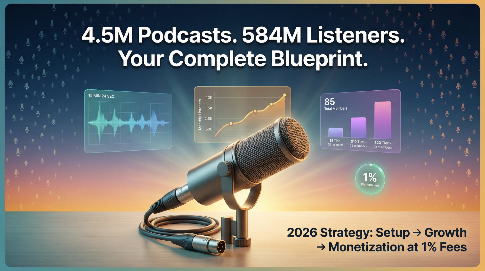

---

## How to Plan Your Podcast for Maximum Success

Every great podcast starts with a clear concept and realistic expectations. A significant majority of podcasters (commonly cited as 75-90%) stop publishing before reaching monetization thresholds ([Podcast Industry Research](https://www.thepodcasthost.com/planning/whats-a-good-number-of-downloads-for-a-podcast/)).

### How to Choose Your Podcast Niche and Topic

Ask yourself _why_ you want to start a podcast and _who_ it's for. Are you sharing expertise, telling stories, or building a community around a topic you love? Define your target audience and niche topic as specifically as possible.

In such a crowded field, **niche shows attract more engaged audiences than broad ones**. Instead of a general "health and wellness" podcast, focus on nutrition for diabetics or mental health for lawyers. The specificity helps you stand out.

There's always a unique angle or perspective you can offer, even on popular topics. Choosing a niche you're passionate about also keeps you motivated (crucial for avoiding "podfade," the common fade-out after a few episodes).

Test your niche by brainstorming at least 10 episode ideas. If ideas don't flow easily, reconsider the topic.

### How to Set Realistic Podcast Goals

Be clear on what success means for you. Is this a creative outlet, a marketing channel for your business, or a direct income source? It won't happen overnight.

On average, even by the 7th day after release, half of podcast episodes get **29 or fewer downloads**. Building an audience takes time. So set **process goals** (like "publish one episode every week for a year") in addition to outcome goals ("reach 1,000 monthly downloads" or "earn $500/month").

Many podcasters measure success by engagement or creative fulfillment rather than revenue at first. Plan for the long haul.

### How to Research Podcast Competition in Your Niche

Before you record a single minute, survey podcasts in your category. Use Apple Podcasts or Spotify to find shows similar to your idea. Listen to a few episodes of top performers.

What are they doing well? What could you do differently? This isn't about copying them. It's about identifying gaps or unique twists. Maybe you can offer a different tone, cover sub-topics they ignore, or target a slightly different demographic.

Carving out your own space makes listeners more likely to find you and stick around.

### How to Name Your Podcast for SEO and Discovery

Your podcast's name is its first impression. Aim for a title that is concise, descriptive, and memorable. Avoid inside jokes or overly generic names. "The John Doe Show" says nothing about content. "Startup Marketing Confidential" is far more informative and intriguing.

Check that the name isn't already in use and that related social media handles or domain names are available.

Along with the name, write a clear podcast description highlighting what value listeners get and your unique angle. This helps hook people in podcast directories and improves search discoverability. Include relevant keywords, but make sure it reads naturally.

### What Podcast Format Should You Choose?

Decide on a format that plays to your strengths and fits your topic. Common formats include interview shows, co-host banter, solo monologues, narrative storytelling, or educational deep-dives.

An interview format works well for business or tech podcasts. A scripted solo format might suit storytelling or history shows. There's no one "right" format. Just ensure it's something you can execute consistently.

Also consider episode length. Most podcasts fall in the 20-60 minute range, with 20-40 minutes being most common. But length should serve the content. A tight 15-minute episode can beat a rambling hour.

Whatever you choose, **consistency is key**. Listeners expect a reliable pattern. Decide if you'll publish weekly (very common), biweekly, or some other interval. Weekly is ideal for building audience habit, if you can sustain it.

Remember: podcasts that last are the ones that keep showing up on schedule. Consistent production is a simple filter for quality and commitment.

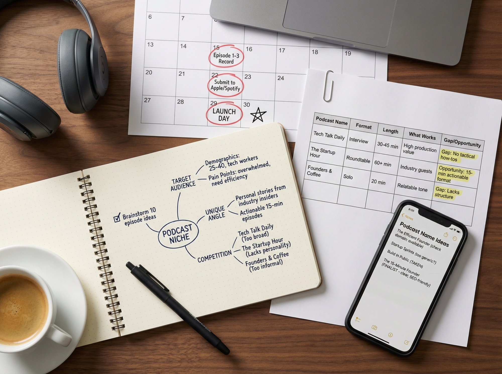

> **Pro Tip: Launch with Multiple Episodes**
>
> When you first go live, consider releasing 3-5 episodes at once rather than a single pilot. A mini backlog gives new listeners something to binge, increasing the chance they'll get hooked. It also shows you have commitment. Many experts suggest launching with a buffer and having a few more in production to stay ahead.

---

## How to Set Up a Home Podcast Studio on a Budget

You do **not** need a professional radio studio to start a podcast. Many successful indie podcasters record from home with basic gear. But you _do_ need to prioritize clear audio.

Listeners will forgive a few "ums" or a cat meowing in the background. They won't stick around for audio that sounds like it was recorded in an echo chamber. Here's what you need:

### Best Budget Podcast Microphones for Beginners

Invest in a decent microphone. It's the most important piece of equipment. The good news? You can get broadcast-quality sound for around **$60-150**.

A **$100 USB mic** used in a quiet, padded space can beat a **$2,000 mic** in a noisy room. USB microphones plug directly into your computer and are very user-friendly for beginners.

Popular models in 2025:

| Microphone     | Type           | Price                                             | Notes                                                                                                                                                                                |
| -------------- | -------------- | ------------------------------------------------- | ------------------------------------------------------------------------------------------------------------------------------------------------------------------------------------ |
| **Blue Yeti**  | USB            | ~$120 (regular price; often on sale for $85-$120) | Widely used among podcasters; [regular retail price $139.99-$159.99, frequently discounted](https://www.amazon.com/Logitech-Creators-Microphone-Streaming-Play-Silver/dp/B002VA464S) |
| **Samson Q2U** | USB/XLR hybrid | ~$70                                              | Great budget option, upgrade path to XLR                                                                                                                                             |
| **Shure SM58** | XLR dynamic    | ~$100                                             | Requires audio interface but very reliable                                                                                                                                           |

These mics are plug-and-play (USB) or easily paired with a basic interface (XLR). No need to break the bank early on.

### What Headphones Do You Need for Podcasting?

Use closed-back headphones while recording and editing. This lets you monitor your audio in real-time (so you catch issues like mic crackle or background noise) and later edit with precision.

You don't need expensive studio headphones. Any comfortable over-ear headphones will do to start. The key is preventing echo/feedback. If you monitor through speakers, your mic will pick up the sound and create a feedback loop.

### How to Create Acoustic Treatment at Home

You'd be amazed how much the environment affects audio. Record in the quietest space available. Soft furnishings (couches, curtains, clothes) help dampen echoes.

**A closet full of clothes is actually a great recording spot** for many beginners. The clothes act as acoustic treatment. If not, consider foam panels or blankets on walls to reduce reverb.

Turn off loud appliances (AC units, fans, refrigerators if possible) while recording. The goal is to minimize background hum and echo so your voice comes through warm and clear.

Remember: listeners' brains tune out if audio quality forces them to strain. Making it easy to listen is crucial.

### Best Free Podcast Recording Software

To record your podcast, you'll use a **DAW (Digital Audio Workstation)** on your computer. A great free option is **Audacity**, which is the most popular free editing tool among podcasters ([Riverside Blog 2025](https://riverside.fm/blog/podcast-editing-software), [Podbean 2025](https://blog.podbean.com/best-podcast-editing-software-apps-in-2025/)).

Audacity works on Windows, Mac, or Linux. It lets you record from your mic, cut and splice tracks, and apply basic noise reduction or leveling. Other beginner-friendly options include **GarageBand** (free on Mac) or **Adobe Audition** (more advanced, paid).

For interviews with remote guests, tools like **Zoom**, **Skype**, or specialized services like **Riverside.fm** and **Zencastr** can record double-ender audio (where each person's audio is recorded locally for better quality). Many podcasters simply record Zoom calls early on. It's easy, though audio quality over Zoom isn't the highest fidelity.

### Podcast Recording Best Practices

Do a short test recording every time to check your levels. You want your voice peaking around -6 to -3 dB on the meter to avoid distortion, but not too low either.

Speak close to the mic (usually 4-8 inches), use a pop filter (a $10 screen) to reduce plosives. Maintain consistent mic placement. Keep water nearby to stay hydrated (mouth clicks are a thing!).

If you make a mistake while recording, just pause and start the sentence again. You can edit out the flub later. No need to stop the whole recording. As you refine your process, [consider how consistent content creation](https://www.patron.com/blog/category/guides/) builds the foundation for eventual monetization.

### How to Edit Your Podcast Episodes

In post-production, you'll clean up and tighten your audio. Remove long pauses, obvious mistakes, and excessive "um/uh" if they're distracting (don't worry about cutting every single one; you still want to sound natural). Quality post-production is part of [building professional content](https://www.patron.com/blog/) that attracts paying supporters.

You can also add a little intro music or outro music for a professional touch, but keep it short (10-15 seconds). Just be sure to use properly licensed music (royalty-free tracks or original music).

Most importantly, listen through the final cut with fresh ears and ensure the volume levels are even. **Loudness normalization to around -16 LUFS** (the standard for podcast volume) is good practice. Tools like Auphonic (online service) or the Loudness Normalization effect in Audacity can help.

This ensures listeners don't have to adjust volume between episodes or between your show and another.

### How to Design Podcast Cover Art That Converts

Before launch, design an eye-catching podcast cover image. This is the square artwork that appears in apps and directories.

It should be 1400x1400 to 3000x3000 pixels in size and still look good at thumbnail size. Use clear title, high-contrast visuals, and avoid tiny text that won't be readable on a phone screen. Professional branding matters when [building a creator business](https://www.patron.com/blog/category/about/).

If you're not a designer, use free tools like Canva (which has podcast cover templates). Don't stress if you're not 100% in love with your artwork at first. You can always update it later. Just make sure it looks professional enough not to turn off first-time browsers.

---

## How to Publish and Launch Your First Podcast

With a concept defined and a few episodes recorded and edited, you're ready to put your podcast out into the world. This involves choosing a **podcast hosting service**, setting up your feeds, and getting listed on all major listening platforms.

### How to Choose a Podcast Hosting Platform

A podcast host is a specialized service that stores your audio files and generates your podcast **RSS feed**. The RSS feed is what you submit to directories like Apple Podcasts. It's essentially the roadmap of your show (with episode titles, descriptions, audio file URLs, etc.) that apps use to pull your episodes.

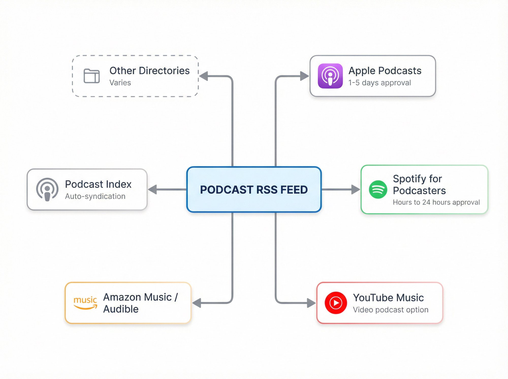

You can't simply upload an MP3 to Apple. You need a host. There are many podcast hosting platforms in 2025:

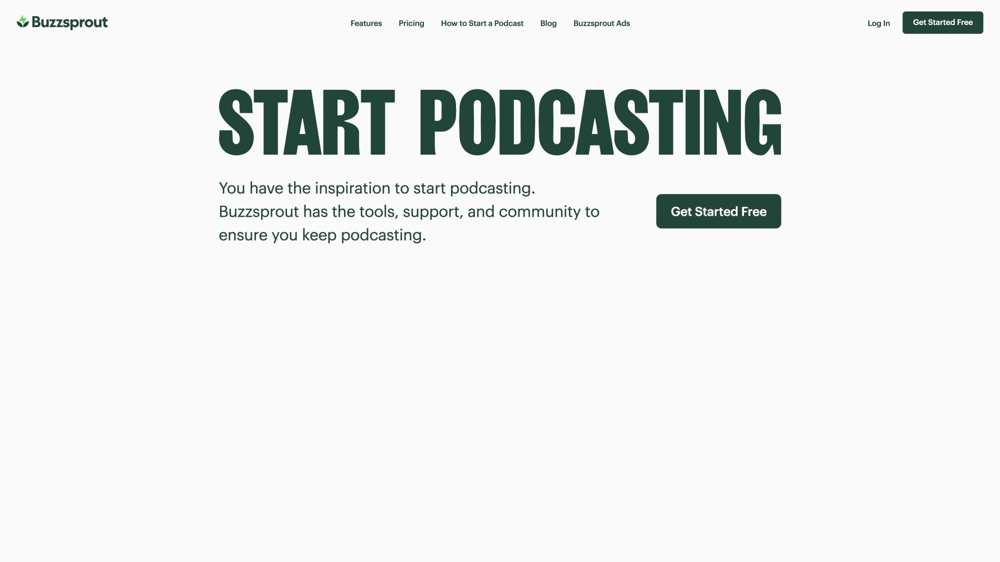

| Platform                            | Cost      | Best For                | Notes                                  |
| ----------------------------------- | --------- | ----------------------- | -------------------------------------- |
| **Spotify for Podcasters (Anchor)** | Free      | Beginners               | Unlimited storage, Spotify integration |
| **Buzzsprout**                      | $12-18/mo | User-friendly interface | Great stats, ad marketplace            |
| **Libsyn**                          | $5+/mo    | Reliability             | One of oldest hosts, very reliable     |

According to the [2025 Independent Podcaster Report](https://alitu.com/creator/content-creation/the-independent-podcaster-report-2025/) surveying 558 creators, 47% of audio-only podcasters spend $10-49 per month on podcasting expenses (including hosting), while 17% manage to spend nothing using free hosts like Anchor.

Once you sign up for a host, you'll upload your episode MP3s, add titles, descriptions, episode art (optional), and the host will generate your RSS feed URL.

### How to Submit Your Podcast to Apple and Spotify

The RSS feed is your golden ticket. Submit it to all major podcast directories so listeners can find your show. As you prepare to launch, remember that [building an audience takes time and strategy](https://www.patron.com/blog/category/podcast/).

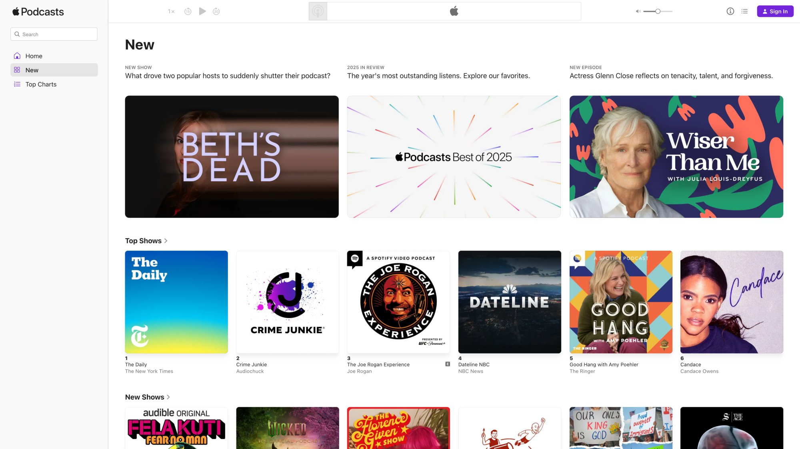

**The most important platform is Apple Podcasts**, though market share data varies by measurement method and geography. Globally, Spotify leads with 38% market share versus Apple Podcasts' 31%. In the U.S., the platforms are closer, with Spotify at 38% and Apple Podcasts at 34%. Buzzsprout's April 2025 data shows Apple Podcasts with 37.5% listener share versus Spotify's 33.2%. Among iOS users specifically, Apple Podcasts dominates with over 70% of listening activity ([ElectroIQ 2025](https://electroiq.com/stats/apple-podcast-statistics/), [Podcast Statistics 2025](https://podcastatistics.com/)). Getting listed on Apple Podcasts also gets you into many smaller apps that pull from Apple's directory.

To submit: create a free Apple ID, then go to Apple's Podcasts Connect portal and submit your feed URL. Apple will review your podcast (checking that you have cover art, no obviously problematic content, etc.). This can take 1-5 days typically.

Next, submit to **Spotify for Podcasters**: Spotify has its own submission. On podcasters.spotify.com, claim your show by providing the RSS feed. Spotify's approval is usually fast (often within hours to 24 hours, though first-time submissions can take up to 10 business days).

Other places to submit:

- **Google Podcasts / YouTube Music**: Google shut down Google Podcasts in April 2024 and migrated users to YouTube Music ([TechCrunch](https://techcrunch.com/2023/09/26/google-podcasts-to-shut-down-in-2024-with-listeners-migrated-to-youtube-music/)). Consider uploading episodes to YouTube to catch that audience.
- **Amazon Music/Audible**: Amazon Music has a podcast section with a simple submission form.
- **Podcast Index/Open Apps**: Your show will likely automatically appear in various open podcast apps (like Overcast, Pocket Casts) once it's on Apple.

Each directory may ask for info (categories, language, etc.). Fill in as much as you can, as this helps visibility. Be patient. After initial submission, new episodes will be picked up automatically via the feed.

Plan your launch date accordingly. Submit the feed a week or so before your official "launch" so your show is actually searchable when you announce it.

### Podcast Launch Strategy: Getting Your First 100 Listeners

You've done the prep work. Now get those first listeners. This is where [your monetization journey begins](https://www.patron.com/blog/category/monetization/), even if you won't activate it until later.

If you followed the earlier tip to launch with a few episodes at once, promote _all_ of them ("Binge the first three episodes now!"). Use your personal network and social media to drum up interest.

**Effective tactics for launch week:**

**Personal Outreach:** Tell friends, family, colleagues. Direct word-of-mouth is powerful for those first downloads.

**Social Media:** Post on any platforms you use (Twitter/X, Facebook, Instagram, LinkedIn if relevant).

**Leverage Guests:** If you interviewed anyone in initial episodes, ask them to share with their audience.

**Communities:** Share your launch in online communities (Reddit, forums, Discord groups) _if_ the community allows promo and your podcast is genuinely relevant.

**Reviews and Ratings:** Encourage early listeners to leave a rating or review on Apple Podcasts or Spotify. Early positive ratings help visibility.

**Episode Titles & SEO:** Make sure episode titles and descriptions are clear and keyword-rich. People searching for topics might find you via podcast app search or Google. An episode title like "5 Budget Travel Hacks for Europe" is more enticing and searchable than "Episode 5 - Travel."

In 2024, about 11% of podcast listeners said they find new shows via search engines, and 50% via searching inside podcast apps. Optimize for those behaviors.

Finally, **remember that launch is just Day 1**. Celebrate it, but know that consistent production and continuous marketing are how you'll grow and sustain your audience over time.

---

## How to Grow Your Podcast Audience Without Burning Out

Growing a podcast audience is often the hardest part. Content may be _king_, but distribution is _queen_. It's a slow burn for most shows.

Don't be discouraged if you have 20 downloads in your first week. If you got, say, 100 downloads per episode early on, you're already in roughly the top 25% of podcasts. Here are strategies to attract and retain listeners:

### Why Consistency Matters More Than Quality

We've said it multiple times, but it bears repeating: **consistency is crucial**. The majority of podcasts that build significant audiences have been publishing regularly for years, not weeks. [Successful creators understand this principle](https://www.patron.com/blog/category/writing/) applies across all content types.

Stick to your release schedule so listeners know they can count on you. Consistency also gives algorithms and directories confidence that your show is "active," which can impact recommendations.

At the same time, **never sacrifice quality for consistency**. If you need to skip a week rather than release a filler episode, do that (but if you plan well, you can often bank an episode or do a shorter one instead of skipping).

Your content needs to deliver value (be it entertainment, education, or inspiration) in every episode to keep people coming back and telling others.

### How to Engage with Your Podcast Listeners

Early on, engage deeply with the audience you do have, no matter how small. Encourage listeners to send feedback or questions (you can set up a podcast email or use your social DMs).

Mention listener comments or answer questions on air. This creates a sense of community and makes listeners feel valued. If you have a loyal core, they'll be your evangelists.

Some podcasters start a free Facebook Group or Discord for their show to corral die-hard fans. Even a Twitter/X hashtag for discussions can help. The closer your connection with listeners, the more likely they'll stick around and recruit friends.

### Podcast Cross-Promotion Strategies

One of the best ways to gain new listeners is to tap into _adjacent_ audiences. **Appear as a guest on other podcasts** in your niche or have other hosts guest on your show.

Podcast listeners are always looking for more content. If they hear you on a show they already like, they're likely to check yours out. There are communities (like r/PodcastGuestExchange on Reddit or various Facebook groups) for swapping guest spots.

Even simpler, you can arrange feed drops or promo swaps (you play a 30-second promo of another show at the end of your episode, and they do the same for you). Just be sure the shows align in topic or audience interest.

### How to Use Video for Podcast Growth

Don't limit your content to just traditional podcast apps. In 2025, 41% of podcast listeners in the US are consuming podcasts as video (e.g. on YouTube).

Consider recording a video of your podcast or even a simple audiogram (audio waveform video) and uploading to YouTube. Many people discover podcasts via YouTube search or recommendations. YouTube is now the largest podcast platform, having surpassed both Spotify and Apple Podcasts in the US market, with over 1 billion monthly podcast viewers worldwide ([Variety 2025](https://variety.com/2025/digital/news/youtube-2025-monthly-podcast-listeners-viewers-1236319232/)).

If on camera, great. If not, you can still put your audio over a static image or waveform animation. Just ensure your episode titles and descriptions on YouTube are strong (and link back to your site or feeds).

You can also **share standout clips** on social media (short 1-minute highlights on Twitter, Instagram, TikTok if appropriate). Tease the content so people want to hear the full thing.

### Podcast SEO: How to Optimize Show Notes

Maintain a website or at least a landing page for your podcast where you post show notes for each episode. These notes can be as simple as a summary and links to things mentioned, or full transcripts.

Transcripts help with accessibility and SEO, though they can be time-consuming to create. Automated transcription tools like Otter.ai can assist. [Building your own platform](https://www.patron.com/blog/post/you-can-just-do-things-getting-patron-com/) gives you more control over your content and monetization.

A website gives you home base under your control. New listeners may find you via Google searches that hit your show notes. For example, if someone searches "how to budget travel Europe podcast" and you have an episode (with show notes page) on that, you want that page to rank.

### What Podcast Metrics Actually Matter

Keep an eye on your download stats to understand what's resonating. Don't obsess over them daily, but check episode performance over time.

Maybe you'll find your audience spikes when you cover a certain sub-topic. That's a signal to do more of that. Or perhaps 30% of your downloads come from one platform (say, Spotify). Then ensure you're optimizing for that platform.

Also note growth trends. Podcast audiences often grow exponentially if you stick it out, but the first few months might look flat. Set milestone goals (e.g., 100 downloads in first 30 days), but be patient.

Some shows explode after an influencer mention or big guest appearance, but many build one listener at a time.

### Download Numbers: What's Actually Realistic?

The hard truth is the _average_ podcast doesn't get huge numbers. Median download numbers for new episodes (within 7 days) are in the few dozens. If you're steadily exceeding that, you're doing something right.

Even if your current listeners are small in number, if they're **engaged** (e.g., you notice the same people commenting or you get messages saying "I love this show!"), you're building a strong foundation. [Small, engaged audiences can be more valuable](https://www.patron.com/blog/post/ko-fi-vs-patreon-which-platform-is-best-for-creators/) than large passive ones when it comes to monetization.

Advertisers and sponsors actually care a lot about engagement and niche targeting, not just raw numbers, especially for smaller shows. For now, focus on being so valuable or entertaining that your listeners _have_ to tell a friend.

That organic word-of-mouth is powerful but only comes if your show consistently delivers value.

### How to Avoid Podcast Burnout

Many creators quit because they run out of steam or ideas. To avoid this, consider **seasons** (you can take a planned break between seasons to recharge), or rotate through content formats to keep it fresh for you.

Continually revisit why you started the podcast. That passion will fuel you through the doldrums. The growth may be slow at first, but as you pass milestones like Episode 10, 20, 50, you'll be far ahead of the majority who quit. [Understanding creator economics](https://www.patron.com/blog/post/how-to-calculate-your-true-patreon-take-home-pay-2025/) helps you set realistic financial goals.

And you'll be ready to reap the rewards of monetization as your catalog and audience grow.

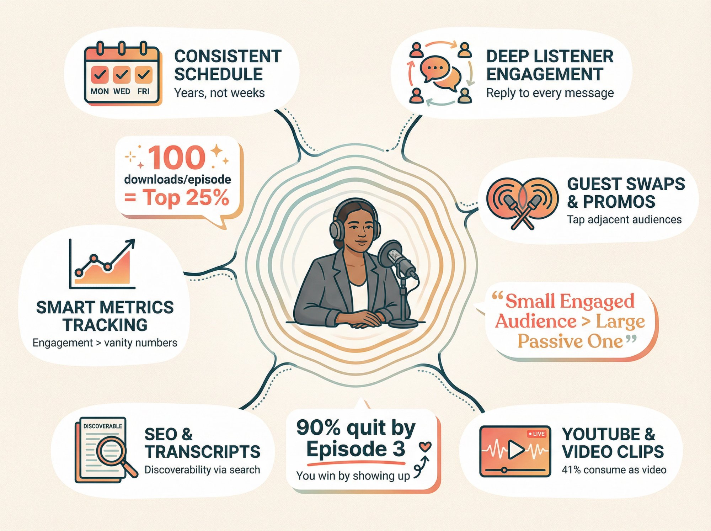

---

## How to Monetize Your Podcast in 2026

How can you turn your podcast from a passion project into an income stream? In 2025, podcasters have more options than ever to monetize.

But choosing the right strategy (or combination of strategies) depends on your content, audience size, and effort you're willing to invest beyond making episodes. It's wise to diversify revenue streams over time, but don't try everything at once.

Below are the most common and effective ways to make money from a podcast, with guidance on when and how to use each.

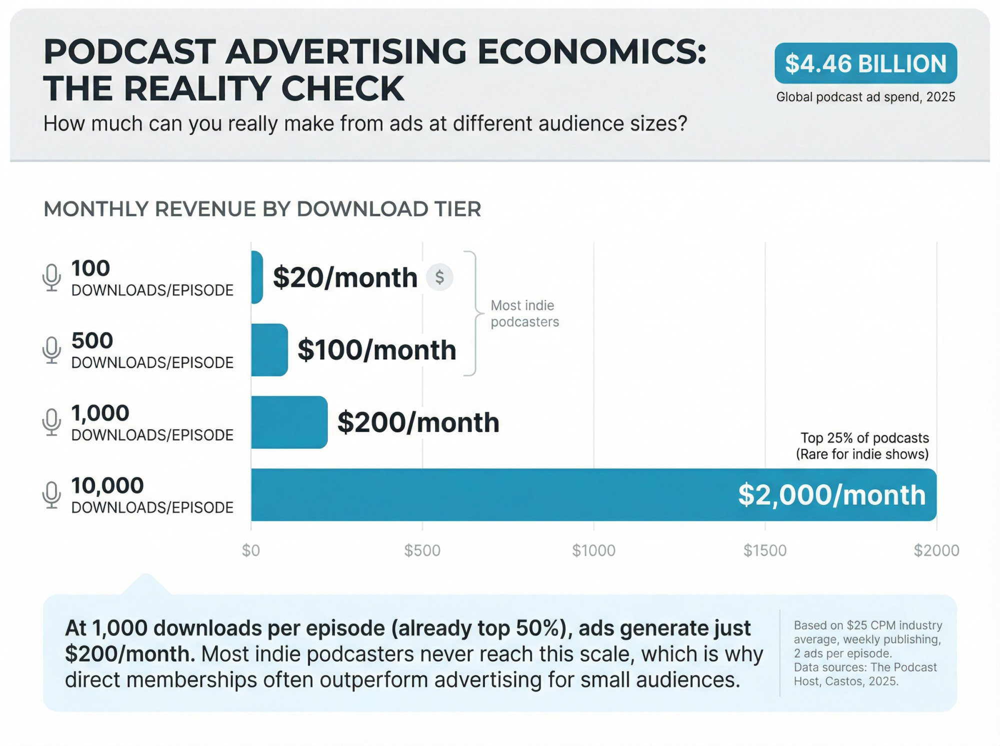

### Podcast Advertising: How Much Can You Really Make?

When people think of podcast money, they often imagine hosts reading ads for Mailchimp or HelloFresh and raking in cash. Indeed, **advertising is a major revenue source** for many top podcasts. In 2025, worldwide podcast ad spending is estimated at **$4.46 billion**.

But the reality is advertising usually only pays off **at scale**. Podcast ads are typically sold on a CPM basis (cost per mille, or 1,000 impressions). Industry averages range from about **$18 to $25 per 1,000 downloads** for a 30-60 second ad slot. Higher rates (**$30-50 CPM**) are possible for highly targeted shows or premium placements.

Let's put that in context:

**Table: Advertising Economics Reality Check**

| Downloads/Episode | Mid-Roll Ad ($25 CPM) | Two Ads/Episode | Monthly (4 eps) |
| ----------------- | --------------------- | --------------- | --------------- |
| 100               | $2.50                 | $5              | $20             |
| 500               | $12.50                | $25             | $100            |
| 1,000             | $25                   | $50             | $200            |
| 10,000            | $250                  | $500            | $2,000          |

If you have **1,000 downloads per episode**, a mid-roll ad at $25 CPM would earn you **$25 per episode**. Run two ads? That's **$50 per episode**, or **$200/month** at weekly publishing. It's not bad, but it's also not quit-your-job money.

At **10,000 downloads per episode**, that same ad slot yields **$250**. [Most independent podcasters never hit these numbers](https://www.patron.com/blog/post/how-to-monetize-a-podcast-with-early-access-not-ads/). Getting to even 1k or 500 downloads per episode is a significant achievement.

This is why you often hear that podcasts need tens of thousands of listeners to attract sponsors. Advertisers want reach.

**When to Pursue Ads:**

If your podcast is getting 500+ downloads per episode in the first 30 days and growing, you can start testing programmatic ad networks at lower download levels. Most sponsors typically require 5,000+ downloads per episode for direct sponsorships ([The Podcast Host](https://www.thepodcasthost.com/planning/whats-a-good-number-of-downloads-for-a-podcast/)). Before that, focus on growth.

One exception: if your show is very niche with an identifiable audience (e.g., a podcast for anesthesiologists or classic car restorers), you might find sponsors even with a few hundred listeners because the audience is _valuable_ to certain advertisers. In such cases, CPM rules are less relevant. You can negotiate a flat rate for sponsorship if alignment is right.

**How to Get Advertisers:**

**Podcast Ad Networks/Marketplaces**: Once you have decent traffic, join services like Midroll, AdvertiseCast, or your host's ad marketplace. These networks connect you with advertisers and take a cut.

**Programmatic Ads**: Some hosts (like Anchor/Spotify, Spreaker) offer programmatic ads which are automatically inserted. Programmatic CPMs can be lower (sometimes $10-15 CPM) and you have less control, but it's hands-off.

**Direct Sponsorships**: Reach out to businesses directly, pitch your podcast, and negotiate a deal. You'd provide a media kit (with download stats, listener demographics, and narrative on your show's niche). Direct sponsors might pay for a package like "$500 for 4 episodes mentioning our product, plus social media shout-out."

**Affiliate Ads**: Many companies have affiliate programs (e.g., Audible.com or various web services). They might not pay upfront, but you get a commission for each sale/sign-up you drive with your promo code or link.

**Best Practices for Ads:**

If you run ads, **integrity and quality** matter. Ideally, use sponsors you truly like or that fit your audience. Listeners can tell when a host-read ad is authentic versus a tired script.

Host-read ads (where you read it in your style) tend to perform better. Don't overload your show with ads, especially early. A common format is one short pre-roll (15 seconds at start), one mid-roll (60 seconds in the middle). If episodes are under 30 minutes, you might just do one ad.

Always **disclose** that it's an ad or sponsored message (both legally and for transparency). Something like, "And now a quick word from our sponsor."

Keep in mind ad revenue can be seasonal (Q4 big, January often slow), and you won't see money until after episodes run and sometimes after invoicing delays.

While ads can eventually be a great income source, many podcasters in 2025 are looking beyond pure ads to more reliably monetize. Which brings us to memberships.

### Podcast Memberships: The Better Way to Monetize

One of the most powerful ways to monetize a podcast (especially a small to mid-sized one) is through **direct listener support**. This can take the form of memberships (subscription for bonus content), crowdfunding campaigns, or simple donations/tips.

The idea is to convert your engaged listeners into paying supporters by offering them extra value and a closer connection.

**Why Memberships?**

Membership or subscription models can yield meaningful revenue **even with a modest audience**. [Early access to new episodes](https://www.patron.com/blog/post/how-to-monetize-a-podcast-with-early-access-not-ads/) can generate more revenue than traditional advertising, even with a modest audience.

> **The Power of Memberships**: 50 members paying $5/month = **$250/month**. While a podcast with 10,000 downloads running multiple ads per episode could earn $500-1,000 ([Castos](https://castos.com/podcast-ads-guide/)), membership revenue of $250/month from just 50 dedicated fans is achievable much earlier in your podcast journey. Many podcasts will reach 50 true fans long before they reach 10k downloads.

Podcast fans tend to be _more willing to pay_ than other media consumers. Podcasts create an intimate bond. Listeners often feel like they know the host. According to creator platform data, podcasters make up only roughly 7.7% of creators on membership platforms but account for 14.8% of payout volume. In other words, podcast audiences contribute disproportionately more revenue per creator than some other mediums.

Audio fosters loyalty.

**Membership Platforms:**

The traditional platform for this has been legacy membership platforms, which have been the go-to for podcasters and creators to offer paid tiers. With these platforms, you can set up tiers (e.g., $5/month "Supporter" for bonus episodes or ad-free feed, $15/month "Superfan" for merch or live Q&A access) and fans get charged monthly.

But be aware: as of August 4, 2025, any creator who publishes their page after this date on certain platforms is subject to a standard **10% platform fee** plan. Creators who published their page on or before August 4, 2025 keep their existing pricing (typically 8% for Pro plan). Plus payment processing fees, which are typically 2.9% + $0.30 per transaction for both Stripe and PayPal ([Swipesum](https://www.swipesum.com/insights/guide-to-stripe-fees-rates-for-2025)). That means you might only take home roughly **85%** of what your patrons pay after all fees.

Many creators find the community and features worth it, but some look for alternatives due to those fees and other limitations.

**Enter** [**Patron**](https://www.patron.com/)**:**

> **Why** [**Patron**](https://www.patron.com/) **Changes the Game for Podcasters**
>
> [Patron](https://www.patron.com/) is an emerging open-source membership platform designed specifically for sequential content like podcasts, with [1% fees for early adopters](https://www.patron.com/) compared to traditional platform's 10%.
>
> It's built around the concept of **rolling paywalls** and features automated release scheduling for paid vs free feeds, letting you keep 99% of subscription revenue (minus payment processor fees) while maintaining flexible, open-source control.

**The Math on** [**Patron**](https://www.patron.com/) **vs Traditional Platforms:**

| Monthly Revenue | Traditional (10% + processing) | [Patron](https://www.patron.com/) (1% + processing) | Your Advantage  |
| --------------- | ------------------------------ | --------------------------------------------------- | --------------- |
| $500            | ~$425 (85%)                    | ~$470 (94%)                                         | **+$45/month**  |
| $1,000          | ~$850                          | ~$940                                               | **+$90/month**  |
| $2,500          | ~$2,125                        | ~$2,350                                             | **+$225/month** |

_Note: Assumes roughly 3% payment processing (Stripe/similar) applies to both._

That **$90/month difference** on $1,000 in revenue is **$1,080 per year**. Over time, that's substantial.

Other alternatives in the membership space include **Memberful** (now owned by traditional platforms, used for custom website integration), **Supercast** and **Supporting Cast** (podcast-specific subscription platforms), or building your own website with a paywall.

For a beginner, the simplest route is to use a platform like [Patron](https://www.patron.com/) which handles user management, payments, and [private RSS feeds for members](https://www.patron.com/blog/post/how-to-monetize-a-podcast-with-early-access-not-ads/) that unlock bonus or early access episodes in their favorite podcast app.

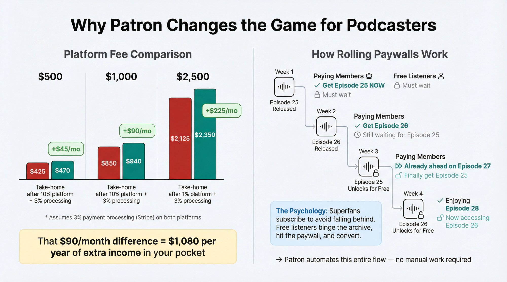

**What Can You Offer to Paying Listeners?**

Common perks include:

**Bonus Episodes:** Extra episodes that only members get. These could be Q&A sessions, deep dives, extended interviews, or entirely different format shows.

**Ad-Free Feed:** If you have ads on the free feed, give members an ad-free version.

**Early Access (Rolling Paywall):** This is a _killer feature_ for story-driven or serial podcasts. The idea of a **rolling paywall** is to [give members early access to new episodes](https://www.patron.com/blog/post/how-to-monetize-a-podcast-with-early-access-not-ads/).

**How Rolling Paywalls Work:**

[A rolling paywall is a time-based access model](https://www.patron.com/blog/post/what-is-a-rolling-paywall/). Paying members get the newest episode immediately, while free listeners will only get that episode after a delay (say, 1-4 weeks).

For example: you release Episode 25 on Monday. Your paying supporters get it Monday. Your free listeners get Episode 25 two weeks later, when Episode 26 is already out for supporters.

This rewards supporters without excluding free listeners from your content. It creates urgency for super-fans to subscribe (so they're not a week behind in the story) but still lets your show grow freely.

**The Psychology of Rolling Paywalls:**

1.  Listener discovers show via free back catalog
2.  Binges episodes, hits cliffhanger or runs out
3.  Subscribes to get new content immediately
4.  Stays subscribed to avoid falling behind

Many podcasters find this model far more lucrative and sustainable than ads when they have even a few hundred loyal listeners. It basically turns your podcast into a freemium product. The archive is free. New stuff is behind a timed window.

[Patron automates rolling paywall scheduling](https://www.patron.com/blog/post/how-to-monetize-a-podcast-with-early-access-not-ads/), so you don't have to manually move files between feeds. [Learn more about rolling paywalls and why they work](https://www.patron.com/blog/post/what-is-a-rolling-paywall/).

**Community Access:** e.g., a private Discord server or Slack channel for patrons, or special live streams just for them. This builds deeper community.

**Merch and Extras:** Higher tiers might include merchandise (stickers, shirts), shout-outs on the show, ability to pitch episode ideas, etc. Keep perks manageable. Don't promise what you can't consistently deliver.

**Price Your Tiers Wisely:**

A very common setup is $5/month for basic support/bonus content. That's a price almost anyone who _really_ loves your show will find reasonable. It's the price at which many members subscribe across creator platforms.

You can have higher tiers like $10 or $20 with extra perks, but expect the majority to opt for the lowest tier if it offers the main bonus content.

**Annual memberships** (paying for a year upfront) are also worth offering. They boost cash flow and commitment (often you'd give a small discount, e.g., two months free when paying annually). [Read our guide on annual vs monthly memberships](https://www.patron.com/blog/post/annual-vs-monthly-memberships-for-creators/) to decide what's right for your audience.

**Reducing Friction:**

Be clear that supporting the show is optional but hugely appreciated. Emphasize what members get, but also that their support keeps the podcast running. Transparency helps. Some creators mention "your support helps me cover hosting fees or upgrade equipment."

Reassure free listeners that the main show isn't going away. For example, many successful podcasters make a point to tell their audience that the free feed would continue and remain the complete show. Early access and bonus materials are just an extra for those who donate.

This approach prevents backlash that you're "locking things away." It's all about framing membership as extra love for true fans, not a shakedown.

**Built-In Podcast Subscriptions (Apple/Spotify):**

In addition to third-party platforms, the major app companies rolled out their own subscription options:

**Apple Podcasts Subscriptions**: You can offer paid subscriptions directly within Apple Podcasts for bonus content. Apple handles the paywall and distribution, but [Apple takes 30% of subscriber revenue in year one (15% in subsequent years)](https://arstechnica.com/gadgets/2021/06/apples-podcast-subscriptions-went-live-today-with-a-30-percent-cut/), and [they charge $20/year to enroll in the program](https://www.macrumors.com/2021/04/20/apple-30-percent-cut-podcast-subscriptions/). It's a steep cut, but it's seamless for iOS users.

**Spotify Paid Subscriptions**: Through Spotify's Anchor platform, you can offer listener support or bonus episodes for a monthly price. [Spotify charges 5% of subscription revenue](https://newsroom.spotify.com/2021-08-24/opening-up-podcast-subscriptions-to-all-u-s-podcasters/). The upside is ease of use for Spotify listeners. While Spotify paid subscription feeds were primarily Spotify-exclusive, Spotify does provide private RSS feeds to subscribers that can work in supported podcast apps ([Spotify Support](https://support.spotify.com/us/creators/article/paid-podcasts-using-your-private-rss-feed/)).

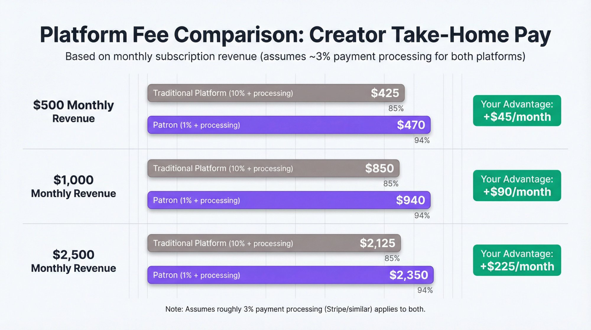

Going Apple/Spotify native locks supporters into those apps, whereas using an open platform like [Patron](https://www.patron.com/) gives a universal feed link.

There's no rule saying you can't do multiple platforms. But managing multiple subscription platforms can be complex. A small team or solo creator might prefer to keep it simple with one platform to start.

If open access and low fees matter to you and your listeners, [Patron's](https://www.patron.com/) 1% model is extremely attractive. If you have lots of iPhone-centric users who demand ease, Apple's route might bring in folks who wouldn't bother creating an account elsewhere.

**Real Examples:**

Many podcasts (big and small) have succeeded with listener memberships. Independent fiction podcasts, news analysis shows, and hobbyist podcasts often find 100 true fans paying $5 is more attainable than 10,000 casual listeners for ads. And beyond the money, having that core support group can turn into a community that further fuels your content (through feedback, word-of-mouth growth, etc.).

**In short, memberships can beat advertising, especially for indie creators.** You don't need to cater to sponsors' content guidelines or chase downloads. You can focus on pleasing your audience. And the revenue is **recurring**, which, if you get say $500 a month from listeners, is relatively stable compared to ad deals that might come and go.

We'd be remiss not to mention simpler donation models too: If you don't want to create bonus content, you can still invite listeners to "buy you a coffee" via platforms like Buy Me a Coffee, Ko-fi, or even PayPal donation buttons.

Those are usually one-off or small monthly tips without expectation of extra content. It's the digital tip jar approach. It generally yields less than a structured membership, but it's something. Note that Ko-fi's pricing structure has changed: new creators now start with Contributor status (5% on all tips), though the original Ko-fi Free plan with 0% on tips still exists. Ko-fi Gold ($12/month) eliminates all platform fees ([Ko-fi Pricing](https://ko-fi.com/pricing)).

You typically need a quite large audience to make significant money from pure donations, since only a small percent will give if there's no added incentive. That's why membership with perks often converts better.

**Key Takeaway:**

If you have even a modest but loyal following, **direct support is likely the quickest path to podcast income**. You might only have a few dozen superfans, but they can contribute more to your bottom line than thousands of passive listeners monetized via ads.

Plus, this model strengthens your relationship with your audience, which in turn can drive growth. It's a win-win: fans get more of what they love, and you get paid to keep creating it.

### Other Podcast Income Streams: Merch, Events, and More

Beyond ads and subscriptions, podcasters are getting creative with monetization. Here are additional channels to consider as you grow:

**Merchandise:**

Selling branded merchandise (t-shirts, mugs, hats with your logo or catchphrases) can both make money and turn listeners into walking advertisements. Services like **Printful, Teespring, or Redbubble** let you do this with no upfront investment. You upload designs and they handle printing and fulfillment on a per-order basis (you get a cut of each sale).

Profit margins on print-on-demand merch aren't huge (maybe $5-10 per shirt), but it's essentially free money if your audience wants to rep your show. Just make sure you have a memorable logo or inside jokes that fans would actually want to wear.

Limited edition merch drops can spur sales ("We have a special 100th episode shirt, only available this month!"). Even stickers or enamel pins can be popular low-cost items.

**Live Events and Tours:**

Once you have a sizable audience, doing live podcast recordings or meetup events can both engage your community and bring in revenue through ticket sales.

We've seen successful podcasts do theater tours (especially comedy or narrative shows) where fans pay to watch a live taping. This is obviously not step 1 for a new podcaster, but down the line it's an option.

Even a local meetup at a bookstore or bar, with a small ticket fee, can cover costs and maybe turn a profit while strengthening listener loyalty. Popular podcasts can sell hundreds of tickets at $20-50 each. Plus, you might sell merch at the event too.

**Books or Premium Content:**

Some podcasters package their content into other products. For example, a history podcast might compile transcripts into an e-book or print book and sell it. Or a business podcast might create a premium research report or online course that they promote on the show.

If your podcast builds you up as an expert in a domain, you can monetize that expertise in various ways (consulting, paid webinars, etc.). This edges into using the podcast as **content marketing** for a bigger product, which is actually a very common model.

**Affiliate Marketing:**

We touched on affiliate ads earlier. Here we mean more generally using your platform to recommend products and earning a commission. For instance, if you host a tech gear podcast, you might have Amazon Associates links for the gadgets you mention. If a listener buys through that, you get a small percentage.

Some podcasts put affiliate links in their show notes for books or gear discussed. It won't make you rich unless you have huge volume, but it's another trickle of income. Just disclose affiliate relationships to be transparent with your audience.

**Podcast Networks and Deals:**

If your show grows big, you might join a network or sign an exclusive deal. Networks like Wondery, iHeart, etc., sometimes scoop up independent shows and handle monetization (ads) in exchange for a revenue share. Or platforms (Spotify, Amazon) might pay for exclusivity.

This is relatively rarefied air and usually comes _after_ you've proven yourself. By the time you're at, say, 50k downloads/episode, you'll likely have inbound interest from networks or advertisers.

Given we're focusing on how to _start_ a podcast and make money, your initial energies should go to the main two buckets (ads and listener support) as appropriate for your size. The others (merch, events, etc.) can layer on once you have a critical mass of fans.

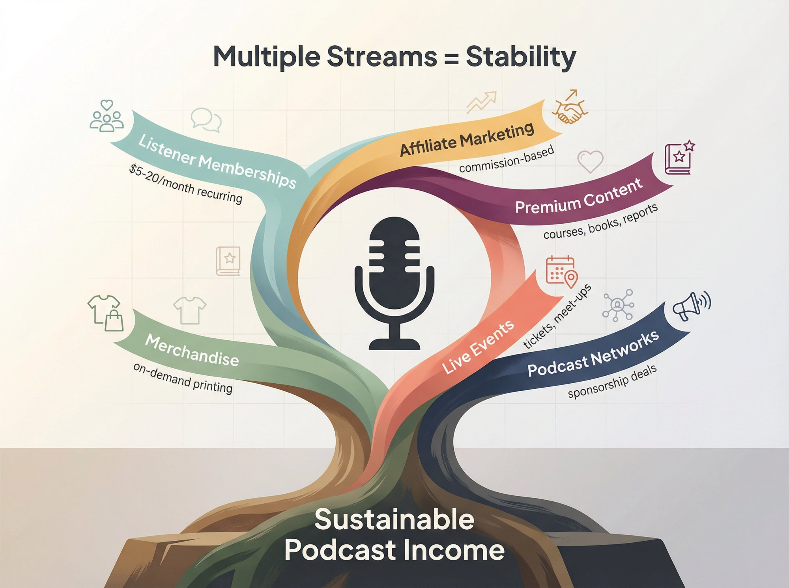

**A Note on Timing:**

It's wise not to try monetizing from episode 1. First, build trust and value. Many successful podcasts waited until they had a few thousand listens or a strong community before introducing any monetization.

An exception could be if you're using the podcast itself to support a business (e.g., you're a consultant and the podcast is a marketing channel). In that case, your ROI is landing a client, which could happen even with a small listener base.

But for pure podcast monetization, **focus on growth and engagement, then monetize**. When you do start monetizing, **explain it to your audience authentically**. Listeners are generally very supportive if they understand it helps keep the show going.

Some podcasters even openly share when they hit certain support goals ("if we reach $X per month, I can go to two episodes a week" or "cover my costs"). This can motivate listeners to help you reach that goal.

Lastly, **deliver on your promises**. If you run an ad, make sure the promo code works and the product is something you're proud to be associated with. If you launch a membership tier, actually post the bonus content on schedule.

Your reputation and relationship with your audience are your most valuable assets. Monetization should never undermine that trust. When done right, monetization can actually enhance your content (funding better production or enabling you to devote more time to it) and bring your most devoted listeners even closer.

---

## Your Podcast Journey Starts Now

Podcasting is one of the most rewarding creative endeavors, and it can be rewarding financially too, if you go in with the right strategy and mindset.

You've learned how to **plan a compelling podcast** that targets a clear niche and audience need, how to **set up your gear and recording space** without overspending, and how to **distribute and promote your show** so it can find its listeners. We've also covered a toolkit of **monetization methods** from ads to memberships to merch, with an emphasis on choosing the path that fits your show's size and your audience's appetite.

As you start this journey, keep a few final pieces of advice in mind:

**Content comes first.** At the end of the day, no monetization hack can make up for a podcast that doesn't resonate. Focus on delivering quality content consistently. If you wouldn't pay (even with your time) to listen to your own show, keep refining it until you would. When you hit that point, chances are others will find value in it too.

**Patience and persistence.** Podcast empires aren't built overnight. Give yourself permission to be in it for the long term. The first 6 months might feel slow. But if you stick to a schedule, continuously improve, and listen to your audience's feedback, the growth will come.

The commonly cited dropout point is episode 7, though research shows 90% of podcasts quit by episode 3 ([Medium](https://medium.com/@alasagilbert/90-of-podcasts-only-survive-their-first-3-episodes-heres-how-to-keep-yours-strong-sold-4e4466585b52)). Remember: you only truly "fail" if you stop. The fact that you'll make it past episode 7 already puts you ahead of the majority.

**Community and networking.** Don't podcast in a vacuum. Connect with fellow podcasters (online or locally). They can provide support, shout-outs, and collaboration opportunities. The podcast community is generally very welcoming.

Engage with your listeners as real people, not just download stats. Those relationships are not only fulfilling but can open doors (from sponsorship leads to speaking gigs).

**Stay current and adaptable.** The podcast industry in 2025 is dynamic. Platforms change (we saw Google pivoting to YouTube in 2024, fees changing on various platforms, etc.), new monetization options arise, and listener behaviors evolve.

Keep learning. Read [podcasting guides and monetization strategies](https://www.patron.com/blog/category/podcast/), follow industry news, and be ready to adapt your strategy. That's how you'll keep your show relevant and growing.

Finally, **remember why you started**. Podcasting can indeed make you money, but most successful podcasters will tell you they kept going because they loved what they were doing and the impact they were making on listeners.

The money follows the passion and effort. If you approach your podcast as a value-delivery vehicle first and a money-making vehicle second, you'll actually likely earn more in the long run, because your content will be better and your audience more loyal.

So go ahead. Hit record, put your voice out there, and step by step, build that podcast you envision. With the information in this guide, you're equipped to not only start a podcast but also turn it into a viable source of income.

For more insights on podcast monetization, check out [Patron's monetization guides](https://www.patron.com/blog/category/monetization/) and [learn how to switch from other platforms](https://www.patron.com/blog/post/switch-from-patreon-to-patron/) if you're ready to keep more of your revenue.

Here's to your success in podcasting and the stories or ideas you'll share with the world. Happy podcasting!

---

## FAQ: Common Podcasting Questions

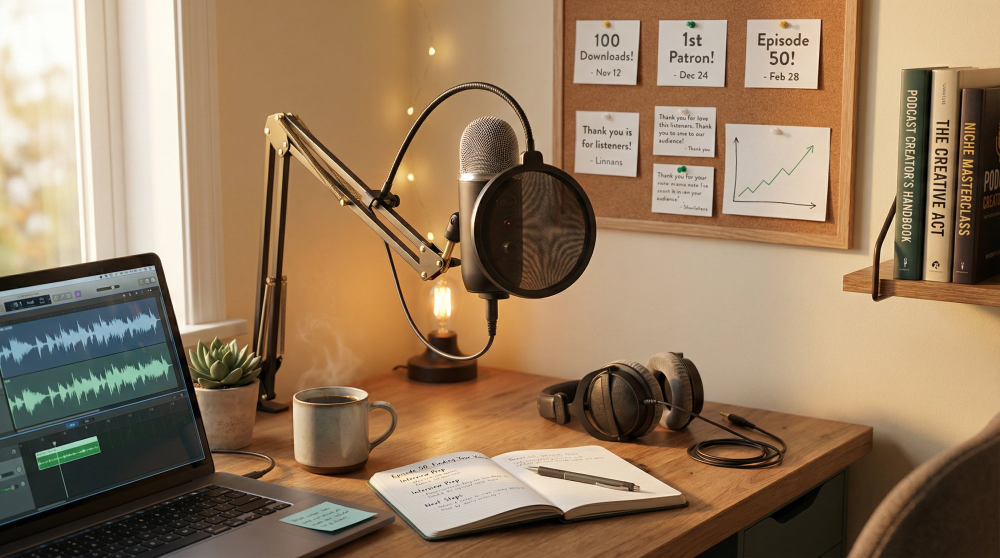

### How much does it cost to start a podcast?

**Initial equipment:** **$100-300** (microphone, headphones)

**Monthly hosting:** **$0-20+** (depending on platform - Spotify for Podcasters is free, entry-level paid hosting typically ranges from $12-20/month)

**Optional:** Editing software (Audacity is free, Adobe Audition roughly **$20/month**), promotional budget

**Total:** You can start for under **$150** in equipment. Ongoing podcast expenses typically range from $0 (with free hosting) to $12-49/month for paid hosting and optional tools.

### How long does it take to make money from a podcast?

**Realistic timeline:** 6-12 months minimum, often longer.

It depends on your niche, consistency, and monetization method. For ads, you need thousands of downloads (which takes time to build). For memberships, you can start earning with as few as 50 dedicated supporters, but building that core takes consistent content and engagement.

Most podcasters who successfully monetize have been publishing for at least a year. Patience is required. The commonly cited dropout point is episode 7, though research shows 90% of podcasts quit by episode 3, which is why those who persist have such an advantage.

### Do I need expensive equipment to start a podcast?

No. A USB microphone in the $100-150 range (like the Blue Yeti at regular retail price of $120-140, though often on sale for $85-120) is sufficient and widely used by successful podcasters.

A quiet recording space is more important than expensive gear. A $100 mic in a quiet, padded space can beat a $2,000 mic in a noisy room. Start basic, upgrade as you grow. Focus on content quality over production perfection early on.

### What's the best podcast hosting platform for beginners?

**Free option:** Spotify for Podcasters (formerly Anchor). Unlimited storage, easy Spotify integration, good for testing the waters.

**Paid options:** Various hosting platforms offer plans from $12-20/month with features like better stats, ad marketplaces, and proven reliability.

All of these generate the RSS feed you need for distribution. Choose based on your budget and features you need. You can always migrate later if your needs change.

### How many downloads do you need to make money from podcast ads?

**Realistically:** **1,000+ downloads per episode** for meaningful income.

At 1,000 downloads with a $25 CPM mid-roll ad, you'd earn roughly **$25 per episode** (or roughly **$100/month** if publishing weekly). At 10,000 downloads per episode, you'd earn roughly **$250 per episode** in ad revenue.

[Most independent podcasters never hit these numbers](https://www.patron.com/blog/post/how-to-monetize-a-podcast-with-early-access-not-ads/), which is why membership models are often better for smaller audiences.

**50 members paying $5/month = $250/month**, achievable much earlier than reaching 10,000 downloads per episode.

### Should you use video for your podcast?

Yes, if you're comfortable on camera. **41% of podcast listeners** in the US are consuming podcasts as _video_ (e.g., on YouTube).

YouTube is the largest podcast platform and helps with discovery through YouTube search. If you're not comfortable on camera, you can still upload your audio with a static image or waveform video.

It's not required but increasingly popular. Many podcasters find their biggest audience growth comes from YouTube.

### What is a rolling paywall and why does it work for podcasts?

A **rolling paywall** is when you [give paying members early access while free listeners get content after a delay](https://www.patron.com/blog/post/what-is-a-rolling-paywall/) (typically 1-4 weeks).

**Why it works:**

- Rewards your biggest fans with early access
- Free listeners still get all content eventually (so it remains discoverable)
- Creates conversion funnel: listener binges free archive, hits cliffhanger, subscribes to get more immediately
- Drives retention: subscribers stay subscribed to avoid falling weeks behind

[Patron](https://www.patron.com/) (the platform) automates rolling paywalls perfectly for podcasters, making it easy to manage paid vs free feeds without manual work.

### How do you get your first podcast listeners?

**Personal network:** Tell friends, family, colleagues. Direct word-of-mouth is powerful for initial downloads.

**Social media:** Announce on all platforms you use. Be genuine, not spammy.

**Guest appearances:** Appear on other podcasts in your niche to tap adjacent audiences.

**Communities:** Share in relevant Reddit threads, Facebook groups, Discord servers (where appropriate and allowed).

**SEO:** Use descriptive episode titles and show notes that help people find you via search (both in podcast apps and Google).

**Patience and consistency:** Growth compounds. 50% of listeners find new shows via in-app search, 11% via Google. Make your content discoverable and keep publishing consistently.

### Why do podcasts fail?

**Inconsistency:** The commonly cited dropout point is episode 7, though research shows 90% of podcasts quit by episode 3. Sporadic publishing kills audience trust.

**Unclear niche/audience:** Trying to appeal to everyone appeals to no one.

**Poor audio quality:** Bad audio creates cognitive friction that makes listeners tune out.

**Trying to monetize too early:** Asking for money before delivering consistent value erodes trust.

**No marketing/distribution strategy:** Great content that no one can find doesn't grow.

**Burnout:** Unsustainable production schedule leads to quitting.

**Solution:** Start focused, stay consistent, invest in decent audio, grow organically before monetizing, and set a sustainable pace you can maintain for years.

### Can you really make full-time income from podcasting?

Yes, but it's rare and takes time. More realistic for most: solid side income ($500-2,000/month) after 1-2 years of consistent work.

**Full-time income typically requires:**

- Multiple revenue streams (memberships + sponsors + merch + courses)
- Building audience over 1-3 years minimum
- Engaged niche audience (not just download numbers)
- Treating podcasting like a business, not just a hobby

Some podcasters use their show to support other income (consulting, coaching, courses) rather than making money directly from the podcast itself.

**The key:** Start with realistic expectations. Build for the long term. Focus on creating value. The money follows engagement and loyalty, not just download counts.

Ready to start your podcast journey? [Explore Patron's podcast resources](https://www.patron.com/blog/category/podcast/) and [see how early adopters are monetizing with 1% fees](https://www.patron.com/).
