Starting a newsletter platform like Substack is one of the most powerful ways to build a direct relationship with your audience. Whether you're a journalist, fiction writer, or content creator, this guide walks you through everything you need to know about launching your newsletter, growing your subscriber base, and potentially earning income through subscriptions.

The newsletter landscape has evolved dramatically. As of late 2025, [over 20 million people read newsletter publications monthly](https://backlinko.com/substack-users), with [more than 5 million paid subscriptions active](https://backlinko.com/substack-users) across platforms. Thousands of writers are earning income, with [top authors collectively making about $40 million per year](https://backlinko.com/substack-users).

**The platform you choose matters as much as the content you create.**

While traditional newsletter platforms have their place, many creators are discovering alternatives that better serve specific content types. If you're creating sequential content like [webcomics](https://www.patron.com/blog/category/webcomics/), [serialized fiction](https://www.patron.com/blog/category/web-serial/), or [episodic podcasts](https://www.patron.com/blog/category/podcast/), you'll want to consider platforms built specifically for your workflow. We'll explore those options as we go.

---

## Why Sequential Creators Need Different Tools

Before we jump into setup, let's talk about what actually matters for building a sustainable creator business in 2026.

If you're creating standalone posts or weekly essays, traditional newsletter platforms work fine. But if you're publishing _sequential content_ (chapters, episodes, anything with a narrative arc), you need something more specialized.

Here's the challenge: You need to monetize your work _and_ let new readers discover your back catalog. Traditional paywalls force you to choose between revenue and discovery. Lock everything behind a paywall and nobody new can find you. Make everything free and you can't pay your bills.

> **The solution:** [Rolling paywalls](https://www.patron.com/blog/post/what-is-a-rolling-paywall/) let paying subscribers access new content early, then automatically release it to free readers after a set time period (typically 1-4 weeks).

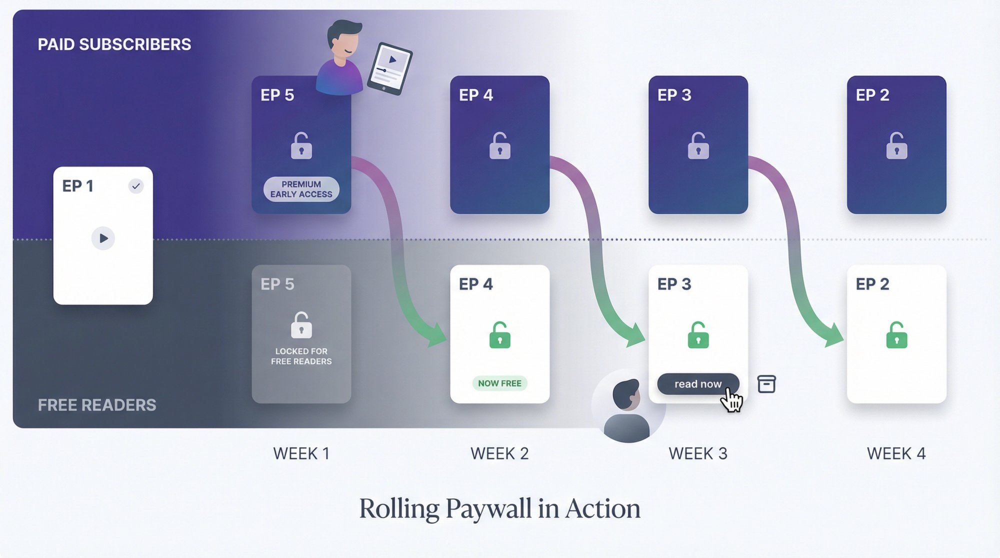

This creates a discovery funnel. New readers find your free archive, binge through it, hit the paywall where current content lives, and subscribe to continue reading. Your archive becomes your marketing engine while your latest work stays exclusive to supporters.

**The conversion psychology is elegant.** Readers binge your free episodes and get invested in the story. When they run out of free content, they're already hooked. They subscribe to keep reading, and they stay subscribed to avoid falling weeks behind. That psychology is what makes [rolling paywalls](https://www.patron.com/blog/post/what-is-a-rolling-paywall/) so effective for sequential content. But most newsletter platforms don't support this workflow natively. You'd need to manually manage access, track release schedules, and update permissions. That's where specialized platforms come in.

[Patron](https://www.patron.com/), for instance, is built specifically for this use case. It's an [open-source platform](https://github.com/patroninc/patron) with **1% fees for early adopters** (compared to the industry standard 10%), automated rolling paywalls, series organization, and release scheduling. The entire platform is designed around episodic content creators.

But let's start with the basics. If you're still exploring options or want to start with a general-purpose platform, here's how to get started.

---

## How to Define Your Niche and Audience

Before creating any account, figure out exactly who you're writing for and why they'd subscribe.

Ask yourself: **Who is my ideal reader, and what specific problem do I solve for them?**

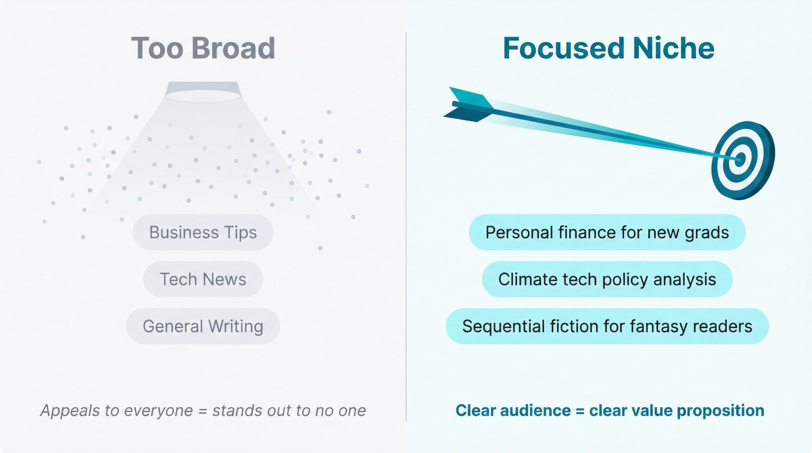

The best newsletters serve a clear audience with focused content. Not "business tips" but "personal finance for new grads." Not "tech news" but "climate tech policy analysis."

**Identify your specific topic.** Choose something you're both passionate about and knowledgeable in. If you try to appeal to everyone, you'll stand out to no one. Successful newsletter writers have a sharp sense of who their audience is and what value they deliver.

**Set realistic goals.** Are you building a side project, a community, or a business? Write down what you want to achieve. "I want to build a community around climate journalism and eventually earn $2,000/month" is more useful than "make money writing."

**Define your value proposition.** What unique perspective or solution do you offer? Think about what job your publication does for readers, and how you can do it better than anyone else.

You don't need everything figured out perfectly. But the clearer you are about your target reader and what keeps them engaged, the easier every other decision becomes.

---

## How to Choose the Right Platform for Your Content

Many creators make a critical mistake here: they choose a platform based on what's popular instead of what matches their content format.

**For general newsletters and essays:** Traditional newsletter platforms work well. They're designed for email-based publishing with flexible content formats.

**For sequential content (webcomics, serialized fiction, podcasts):** You need specialized tools. Managing episode releases, access schedules, and discovery funnels manually is exhausting and error-prone.

Let's compare what you're actually getting with your platform choice:

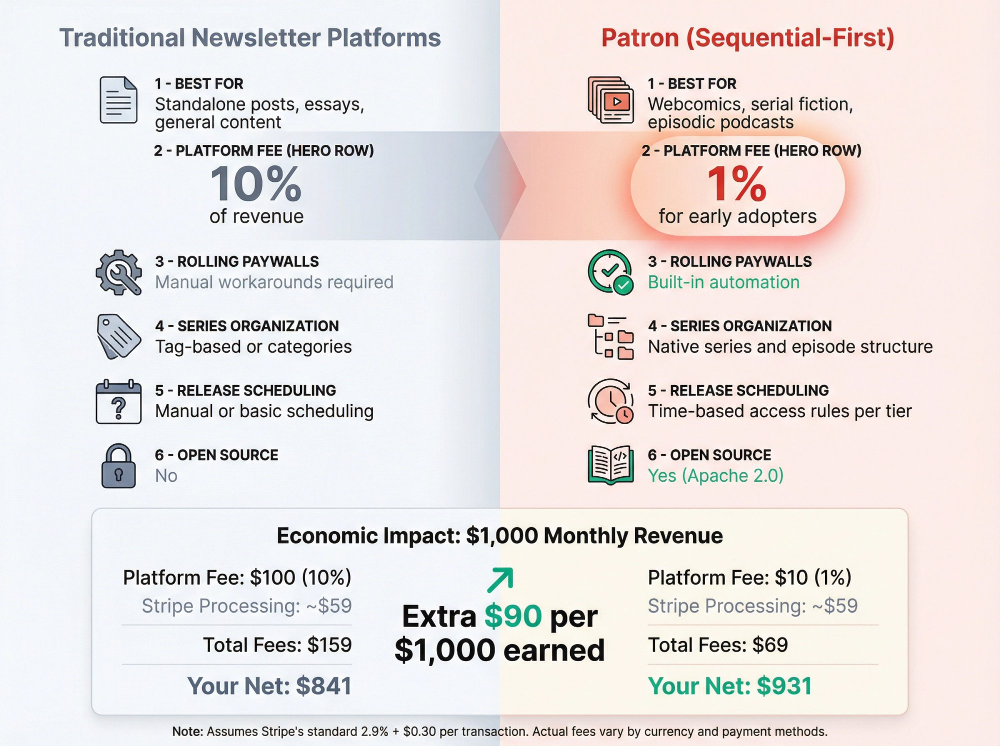

**What the Patron platform actually looks like:**

The difference becomes clear when you compare features side by side:

| **Feature**             | **Traditional Newsletter Platforms**      | [**Patron**](https://www.patron.com/) (Sequential-First)                                                                                                                                             |
| ----------------------- | ----------------------------------------- | ---------------------------------------------------------------------------------------------------------------------------------------------------------------------------------------------------- |
| **Best For**            | Standalone posts, essays, general content | [Webcomics](https://www.patron.com/blog/category/webcomics/), [serial fiction](https://www.patron.com/blog/category/web-serial/), [episodic podcasts](https://www.patron.com/blog/category/podcast/) |
| **Platform Fee**        | 10% of revenue                            | [1% for early adopters](https://www.patron.com/)                                                                                                                                                     |
| **Rolling Paywalls**    | Manual workarounds required               | [Built-in automation](https://www.patron.com/blog/post/what-is-a-rolling-paywall/)                                                                                                                   |
| **Series Organization** | Tag-based or categories                   | Native series and episode structure                                                                                                                                                                  |
| **Release Scheduling**  | Manual or basic scheduling                | Time-based access rules per tier                                                                                                                                                                     |
| **Open Source**         | No                                        | Yes ([Apache 2.0 license](https://github.com/patroninc/patron))                                                                                                                                      |

The economics matter. If you're earning $1,000/month, a **10% platform fee costs you $100** plus payment processing (roughly $59 via Stripe on 100 × $10 payments). That's **$159 in fees, leaving you $841**.

With a **1% platform fee, you pay $10 to the platform** plus the same $59 processing. Total fees: **$69, leaving you $931**. That's an extra $90 per $1,000 earned.

_Note: These calculations assume Stripe's standard 2.9% + $0.30 per transaction rate. Your actual fees vary by currency and payment methods._

For sequential creators, [Patron](https://www.patron.com/) also provides content organization that matches how readers actually consume episodes: in order, with clear navigation, and with automatic unlock schedules. Patron's automated unlock schedules and sequential content organization ([Patron Rolling Paywall](https://www.patron.com/blog/post/what-is-a-rolling-paywall/)) are designed to reduce manual workflow overhead for chapter-by-chapter or episode-by-episode creators, though the specific time savings depend on individual creator setup complexity and comparison baseline.

That said, if you're writing standalone essays or weekly deep dives without narrative continuity, traditional platforms work fine. Choose based on your _content structure_, not just brand recognition.

---

## How to Set Up Your Publication

Let's walk through the account creation and initial setup. I'll use the general process most platforms follow, then note where specialized platforms differ.

### Account Creation

Start by visiting the platform and creating your account with an email address. It's free to start on most platforms. **Choose your publication name carefully.** Make it short, memorable, and relevant to your content. Test: Can you say it clearly on a podcast? Is it easy to spell?

**Pick your URL subdomain wisely.** Most platforms give you `yourname.platform.com` by default. Choose something simple. You can often add a custom domain later to remove the platform name.

Write your one-line description in a single sentence that tells potential subscribers what they'll get. Make it specific: _"Weekly deep dives into climate tech policy"_ beats _"Technology newsletter"_. Set your writer name using your real name or a consistent pen name to help with credibility and discoverability.

### Profile and Branding

Complete your About page. New visitors need to know who you are and why they should subscribe. Share your background, expertise, and what makes your perspective unique.

**Pro tip:** You can always refresh your title, description, and branding as you evolve. Don't let perfect be the enemy of published. Start with something good enough and iterate.

---

## How to Customize Your Publication's Look

Most platforms give you a clean, professional site automatically. Add some personal branding to make it yours.

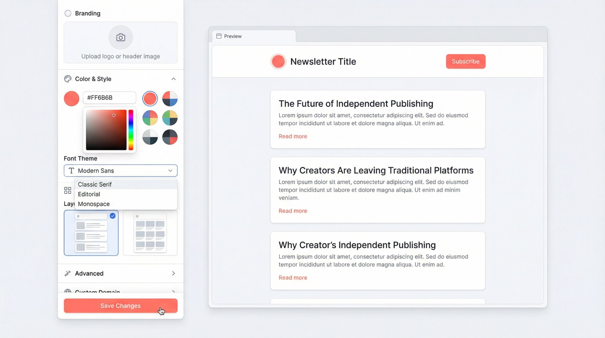

Upload a logo or header image that represents your publication. Keep it simple and legible since it displays small. Free tools like Canva work great for basic logos. Choose an accent color for links and buttons, then select your preferred font theme. These small touches communicate your vibe to readers.

Experiment with layout options. Some platforms offer blog-style or magazine grid layouts. You can also customize navigation links and sidebars as needed.

Consider a custom domain if you own something like _yourname.com_. Most platforms support custom DNS setup, making your publication appear at your personal URL instead of a subdomain. _It's not essential on day one_, but worth considering for long-term brand building.

Set up automated welcome emails for new subscribers. Thank them for joining, tell them what to expect, and (if you enable paid tiers later) explain how to access premium content.

Spend an hour making your publication look polished and on-brand. But don't endlessly tweak design. It's more important to start publishing great content.

---

## How to Plan Your Content Strategy

Consistency beats perfection. Before you publish your first post, create a sustainable content plan.

### Publishing Schedule

**Start with a weekly cadence.** Publishing at least once a week initially helps build reader habits and demonstrates your commitment. Pick a specific day (every Tuesday morning, every Friday afternoon) and stick to it.

Mark your planned send days on a calendar. If it helps, prepare 3-4 weeks of content ideas in advance so you're never staring at a blank page on publish day.

### Content Mix

Brainstorm topics for your first 10 posts. Create a backlog of ideas to reduce writer's block stress. Aim for variety that showcases what your publication offers: explanatory articles, how-to guides, interviews, analysis pieces.

### Free vs. Paid Content Planning

Initially, publish everything free to build your audience. But if you plan to monetize later, start thinking about what premium content you could offer.

Some writers make one post per week free and one paid. Others keep regular posts free but gate deep dives or archive access. There's no single right answer, but planning your eventual paid strategy early makes the transition smoother.

**Reality check:** Growing a newsletter takes time. Early on, you might be writing for a small room. That's normal. Focus on delivering value to whoever's reading, even if it's 10 people. **Consistent publishing compounds** into larger growth over time.

Pick a schedule you can sustain long-term. Extended publishing hiatuses typically negatively impact subscriber momentum and retention ([Whop Newsletter Statistics 2025](https://whop.com/blog/newsletter-statistics/)), though transparent communication about breaks can mitigate subscriber loss ([Inbox Collective](https://inboxcollective.com/how-to-take-a-break-from-writing-your-newsletter/)). _Slow and steady wins._

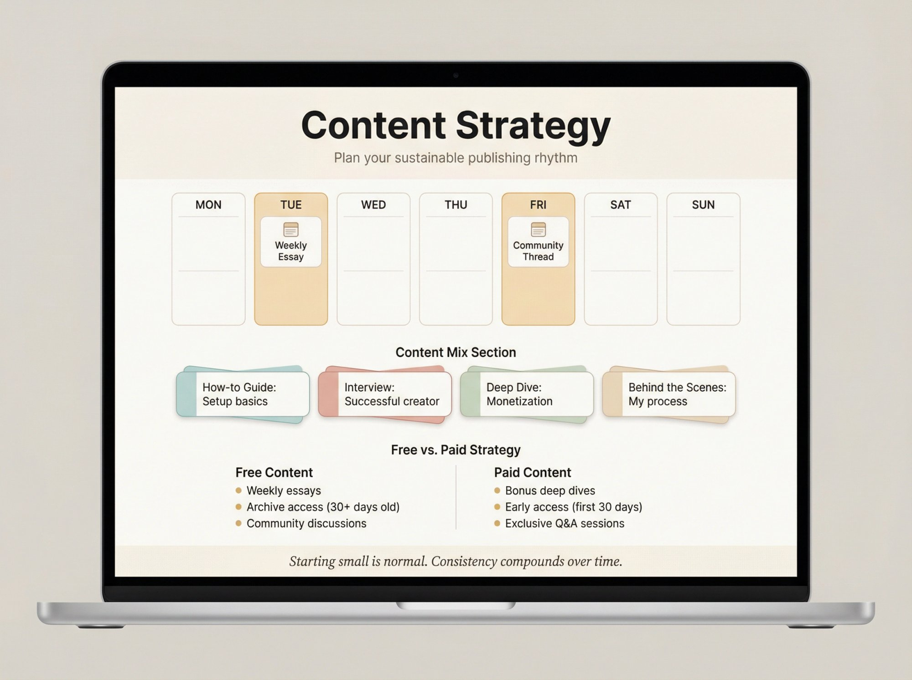

---

## How to Write and Publish Your First Post

Your debut post should introduce your publication to the world.

### What to Include

Make it an announcement. Explain why you're launching, what topics you'll cover, and why readers should care. Share your motivation and enthusiasm. Tell your story because people don't subscribe just for information; they subscribe because of you and your unique expertise. Share a bit of your background or why you decided to start this newsletter. Help readers connect with you.

Write in your authentic voice. Don't sound overly formal unless that fits your style. Be friendly and let your personality through. People subscribe to independent creators _because_ of that personal voice.

**Include a clear call to action.** Encourage readers to subscribe: _"If you like what you read, hit the subscribe button to get future posts in your inbox."_

### Publishing Mechanics

Use your platform's editor to format your post with headings, images, embedded media, or whatever enhances your content. Many modern newsletter editors ([Substack Editor Guide](https://on.substack.com/p/how-to-use-the-substack-editor)) are designed for simplicity and ease of use.

When you're ready, hit **Publish** and send it to your email list. Initially your list might just be a few friends, but you're establishing the habit.

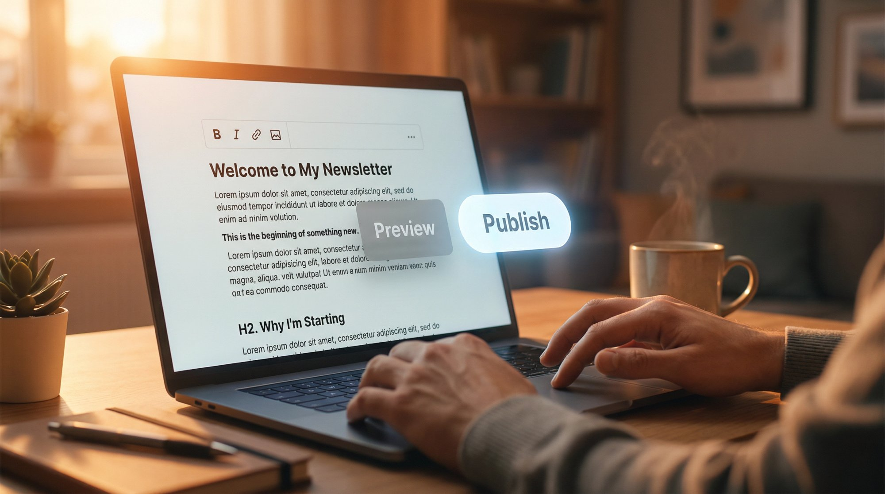

Preview how your post looks in both email and web versions before sending. Check that formatting, images, and links work correctly.

_Don't be nervous about small mistakes._ You can usually edit posts after publishing. And if only a few people are on your list, not many will see any errors anyway. The important thing is learning by doing.

---

## What Content Formats Can You Publish?

Most newsletter platforms support more than just written articles. Here's what you can do beyond text posts.

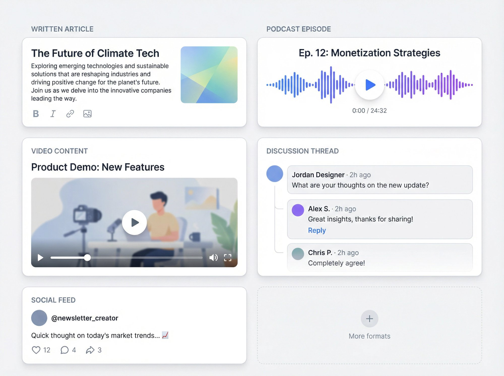

**Standard written articles** form the foundation of most newsletters. These are text posts with optional images, GIFs, and formatting to keep readers engaged.

**Podcast episodes** work on some platforms that let you host audio files directly, creating posts that double as podcast episodes with RSS feeds. If you're creating [podcast content](https://www.patron.com/blog/post/how-to-monetize-a-podcast-with-early-access-not-ads/), consider how early access models work better than ad-based monetization.

**Video content** support varies by platform, but many now offer it. This format works great for vlogs or visual demonstrations that complement your written work.

**Discussion threads** let you create posts that encourage back-and-forth in the comments. These are perfect for weekly Q&A sessions or community chats where only subscribers can participate.

**Social-style feeds** appear on some platforms as short-post features (like a Twitter-style feed) for quick thoughts that don't go to email subscribers.

When starting, focus on your primary content type. Master consistent publishing first. But keep these options in mind as you grow. Diversifying content can enrich your publication and attract different subscriber types.

For example, a tech newsletter might primarily publish articles but occasionally include a members-only podcast. A fiction writer might write weekly chapters _and_ post audio recordings of themselves reading.

Take it at your own pace. These tools are there when you're ready to experiment.

---

## How to Enable Paid Subscriptions

You can absolutely run a free newsletter forever. But if you want to earn income from your writing, here's how monetization works.

### Setting Up Payments

Most platforms use Stripe for payment processing. In your settings, enable paid subscriptions and connect or create a Stripe account. Stripe handles the actual transactions and payouts to your bank.

### Pricing Your Newsletter

Choose **monthly and annual subscription prices**. Common tiers include $5/month or $50/year (giving annual subscribers roughly a 2-month discount) ([Substack Pricing Guide](https://www.reallygoodbusinessideas.com/p/substack-pricing)). Most creators charge $5-$15/month, with $10-$15 for premium content ([SchoolMaker Substack Pricing 2025](https://www.schoolmaker.com/blog/substack-pricing)).

Think about your audience's willingness to pay and what comparable newsletters charge. You can adjust prices later, but existing subscribers typically get grandfathered in.

### Platform Economics

Here's what you actually keep on a traditional 10% platform fee structure with a $5 monthly subscription ([Substack Pricing](https://support.substack.com/hc/en-us/articles/360037607131-How-much-does-Substack-cost)):

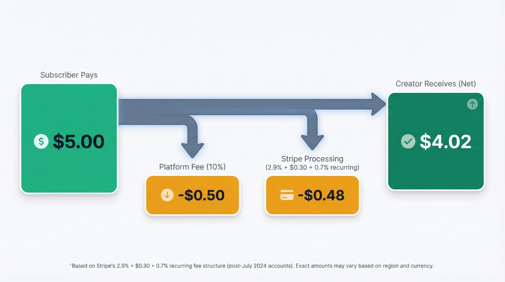

Here's the official fee structure from Patreon's documentation:

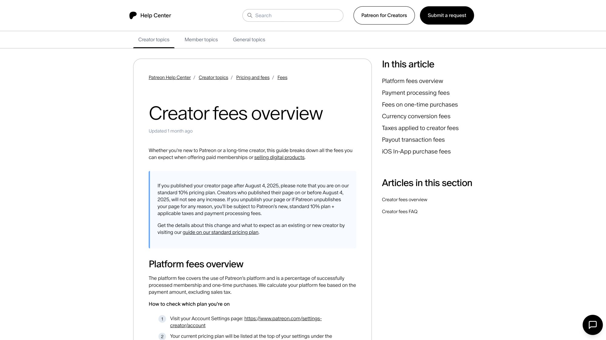

Breaking down a $5/month subscription:

**Platform fee:** $0.50 (10%)

**Stripe processing:** ~$0.48 (2.9% + $0.30 + 0.7% recurring for new accounts) ([Stripe Fees Guide](https://www.swipesum.com/insights/guide-to-stripe-fees-rates-for-2025))

**Your net:** ~$4.02

_Note: Stripe's 0.7% recurring fee applies to accounts created after July 10, 2024._

Platforms typically take 10% of revenue, plus Stripe deducts payment processing fees of roughly 2.9% + $0.30 per charge, plus 0.7% for recurring subscriptions.

Factor these fees into your pricing strategy. [Understanding the true economics](https://www.patron.com/blog/post/how-to-calculate-your-true-patreon-take-home-pay-2025/) helps you set sustainable prices.

### Planning Your Paywall Strategy

Decide what premium subscribers get. **Many writers make certain posts available only to paying subscribers.** You might publish one free post weekly plus a bonus paid post, or keep regular content free while gating monthly deep dives.

Community perks work well for engagement. Paid subscribers could access exclusive discussion threads, subscriber-only chats, or live Q&A sessions that create genuine connection. Bonus tiers at higher price points (like "Founding Member" tiers at $150+/year) can include special benefits: personal thank-yous, merchandise, signed books, or one-on-one calls.

The voluntary support model keeps all content free and asks for optional financial support, like public radio. _This works if maximizing reach matters more than revenue_, but typically offering _some_ exclusive content encourages more conversions.

### When Should You Launch Paid Subscriptions?

You don't need to enable payments from day one. Many experts suggest waiting until you have substantial free audience engagement first.

While platforms often cite 5-10% as target conversion rates ([Substack Going Paid Guide](https://substack.com/going-paid-guide)), actual conversion rates for most creators range from 2-5% ([Really Good Business Ideas](https://www.reallygoodbusinessideas.com/p/substack-average-paid-subscriber-conversion-rate)), with 5% being realistic and 2% being common, particularly for rapidly-growing newsletters. So 5% of 200 free readers is 10 paying users (at $5/mo, that's $50/mo gross). But 5% of 2,000 readers is 100 paying users ($500/mo).

Build your free list first. When you have a few hundred or thousand engaged readers and clear demand for more content, that's the time to launch paid tiers.

### Announcing Your Paid Launch

When you launch paid subscriptions, treat it as a significant event. Create a dedicated announcement post explaining why you're launching paid tiers and what benefits subscribers get.

Reassure free readers what content they'll still receive. Frame it positively: _"Free posts continue as usual, but paid subscribers will now get exclusive deep dives, early access, and community features."_

Consider offering a limited-time discount for early subscribers to incentivize sign-ups.

---

## How to Get Your First Subscribers

You've set up your publication and published your introduction. Now let's get people to actually subscribe.

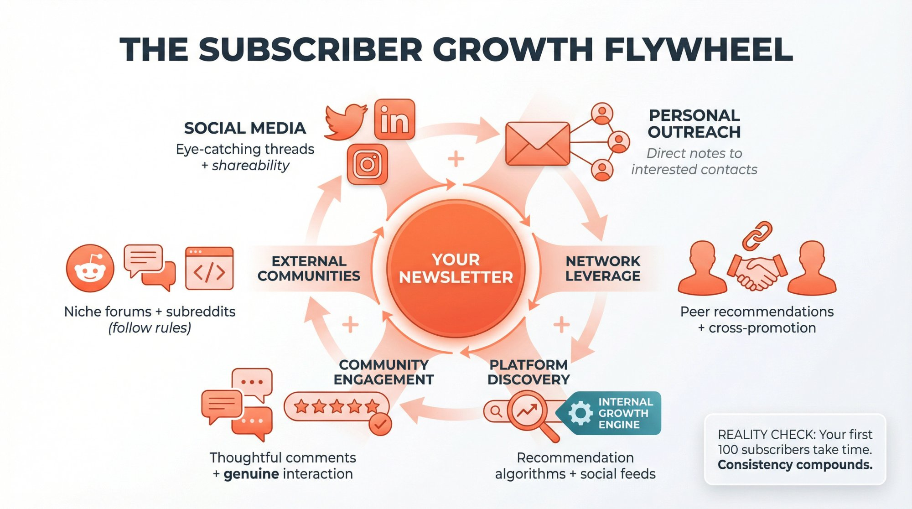

### Tell Everyone You Know

Share your announcement post across all your channels. Post on Twitter/X with an eye-catching thread about your newsletter topic, ending with your link. Make the first post shareable to maximize retweets. Announce on Facebook, LinkedIn, Instagram where your potential readers already hang out.

Personal outreach works better than you think. Email close friends or professional contacts who'd find your content valuable. Not spam to everyone, but personal notes to people already interested in your topic. Update your email signature to include "Subscribe to my newsletter: \[link\]" so every email becomes a gentle promotion.

### Leverage Your Network

Ask peers or mentors with audiences to share your launch. If it aligns with their interests, they might promote it to their followers.

If you know other newsletter writers, they can use **recommendation features** to suggest your publication to their subscribers. Many platforms include cross-promotion tools where writers endorse each other's newsletters.

### Platform-Specific Growth Tools

Different platforms offer different discovery mechanisms. Some have internal recommendation engines where readers discover new newsletters. Writers who actively recommend other publications are often recommended in return, creating a growth flywheel.

Some platforms include social-style feeds for short posts. Recent data shows significant new subscriptions came from internal platform discovery, making these features incredibly powerful for growth.

### Engage in the Community

Don't just publish into the void. Find publications in your niche and leave thoughtful, non-promotional comments. Readers will see your name and can click your profile to subscribe.

If your platform has a social feed, share insights and engage with other creators. Some writers gained hundreds of subscribers in a few months just by being active on platform feeds daily.

**The key is genuine interaction**, not self-promotion spam. Share interesting thoughts, reply to others, build relationships. That's how you get noticed by the right audience.

### Beyond Platform Networks

Promote in external communities where your target readers gather. If you write about coding, share on developer forums. If it's personal growth, relevant Reddit communities might be appropriate (follow their self-promotion rules).

Find where potential readers currently get information and introduce them to your newsletter in a value-adding way.

**Reality check:** Launching might feel slow at first. Don't be discouraged. Keep consistently publishing great work and promoting it. Momentum builds over time. Your first hundred subscribers gives you a base to grow from.

---

## Post-Launch Growth Strategies That Work

Once you have subscribers and a publishing rhythm, shift focus to sustainable growth.

### Consistent Quality Content

The number one driver of growth is writing great content regularly. It sounds obvious, but it's true. People subscribe for valuable content. Focus on delivering that value and growth follows.

Occasionally, a single hit article can bring thousands of new readers if it goes viral or gets media coverage. But you can't predict which one, so just consistently do your best work.

### Learn from Analytics

Use your platform's stats to see what resonates. Track open rates, subscriber growth, shares, and (if applicable) paid conversion rates.

Notice patterns. If Topic A gets high engagement every time, consider doing more of it or creating a dedicated series. Let data inform your content strategy without becoming obsessed with metrics.

### Encourage Reader Engagement

Invite interaction. End posts with questions that prompt comments. Respond to comments thoughtfully so readers feel heard. A lively comment section builds community.

Engaged readers are more likely to convert to paid subscriptions and advocate for your work.

### Cross-Promotion and Collaboration

Don't view other newsletter writers as competition. Often they're collaborators. Do newsletter swaps, guest posts, or shout-outs for each other. Cross-promotions expose you to aligned audiences.

### Experiment with Offers

As your subscriber base grows, try occasional promotions. Limited-time discounts for subscriptions (20% off the first year) create urgency. Free trials for paid tiers (7-day or 30-day trials) lower the barrier to sampling your premium content. Founding member drives with capped slots make early supporters feel special and create genuine scarcity.

Some platforms offer automated features like gift subscriptions or discount offers to prevent cancellations. Explore these tools in your settings.

### Stay Updated

The newsletter landscape changes quickly. Follow your platform's updates for new features or best practices. Read what successful newsletter writers share about their growth strategies.

**Remember:** Growth often comes in spurts. You might gain slowly for months, then one prominent person shares your work and suddenly you have a thousand new subscribers. Keep publishing excellent content so when opportunity arrives, you're ready to convert new visitors into long-term readers.

---

## How to Sustain Long-Term Success

Newsletter writing is a marathon, not a sprint. Here's how to sustain it long-term.

### Build a Routine

Treat your newsletter like a commitment. Set aside dedicated time each week for writing, editing, and engaging with readers. The more it becomes a habit, the easier it gets.

Create a content buffer by staying 1-2 posts ahead. This cushion helps when life gets busy.

### Quality Over Quantity

While consistency matters, never sacrifice quality just to hit publish. If you need to skip a week or send a shorter update to maintain standards, do it. Your reputation with readers is built on trust that you'll deliver value.

### Nurture Core Fans

Over time, you'll notice readers who open every email, leave comments, and share your work. **Nurture those relationships.** They're your evangelists. Their word-of-mouth drives growth.

Consider creating a small group for your most engaged readers (maybe via chat or a community space).

### Handle Breaks Thoughtfully

Writing regularly can be draining. It's okay to take breaks. Just communicate with your audience. If you'll be off for holidays or vacation, let subscribers know when you'll resume.

Alternatively, line up a guest post or "best of" recap to keep your feed active without creating new content from scratch.

### Iterate and Evolve

Your newsletter will change as you do. Pay attention to what content you _enjoy_ creating most and what your audience responds to.

You might start in one niche and find your focus shifting. That's fine. Bring readers along for the journey. Be open to feedback and experiment with new formats or topics. Do more of what works, less of what doesn't.

### Network with Other Creators

Newsletter writing can feel solitary. Build relationships with other writers through comments, cross-promotions, or informal groups. Supporting others often leads to support for yourself.

---

## Best Platforms for Sequential Creators

We've focused on general newsletter platforms, but if you're creating sequential content, specialized tools might serve you better.

### Why Sequential Content Needs Different Infrastructure

If you're publishing webcomics, serialized fiction, or episodic podcasts, you're managing **episode order and navigation** (readers need to follow your story chronologically), **release schedules** (new episodes for paid subscribers, time-delayed access for free readers), and the **discovery vs. monetization balance** (new readers need free archive access to get hooked).

Many traditional newsletter platforms now offer native automation features ([Beehiiv Custom Paywalls](https://product.beehiiv.com/p/custom-paywalls)), though some creators still rely on manual workarounds like tagging, custom email sequences, and spreadsheet-based access management. Legacy workflows using manual approaches can be tedious and error-prone.

### [Patron](https://www.patron.com/): Built for Sequential Content

[Patron](https://www.patron.com/) is an [open-source platform](https://github.com/patroninc/patron) designed specifically for creators publishing in episodes or chapters.

[**Rolling paywalls**](https://www.patron.com/blog/post/what-is-a-rolling-paywall/) automatically release episodes to free readers after a set period. Paying subscribers get early access. Your archive becomes your marketing funnel.

**Series organization** provides native support for organizing content into series with episode order, not just tagged posts.

**Release scheduling** lets you set time-based access rules per tier and per series with no manual updates required.

[**1% platform fees**](https://www.patron.com/) mean early adopters pay just 1% instead of the industry standard 10%, keeping more of their earnings.

[**Open source**](https://github.com/patroninc/patron) architecture uses Apache 2.0 licensing, meaning you can self-host, contribute features, or customize it for your needs.

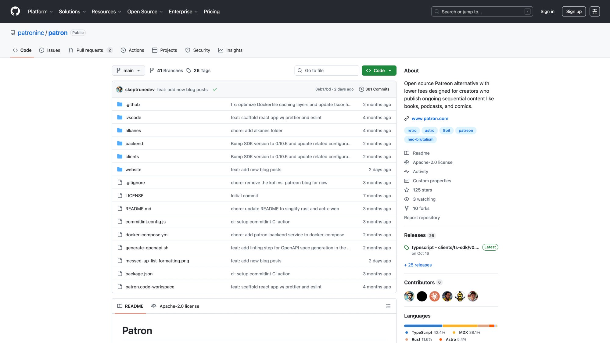

[Patron](https://www.patron.com/) is in alpha as of late 2025, but the core web app, authentication, and SDK exist. It's built by [Nick Khami](https://www.patron.com/blog/post/you-can-just-do-things-getting-patron-com/) (founder of Trieve, acquired by Mintlify in 2025), so there's solid technical execution behind it.

**Consider Patron when** you're creating [webcomics](https://www.patron.com/blog/post/how-to-monetize-a-webcomic/), [serial fiction](https://www.patron.com/blog/post/how-to-start-a-web-serial/), or [episodic audio/video content](https://www.patron.com/blog/post/how-to-monetize-a-podcast-with-early-access-not-ads/). When you want automated rolling paywalls instead of manual access management. When you need series-based navigation for readers to consume your work in order. When you want to keep platform fees minimal ([1% vs. 10%](https://www.patron.com/)). When you appreciate open-source philosophy and want platform transparency.

**Stick with traditional platforms when** you're writing standalone essays or weekly posts without narrative continuity. When you don't need episode-based organization. When you prefer established platforms with large built-in audiences.

Choose based on your _content structure_, not just brand familiarity. The right infrastructure makes your life easier and helps readers engage with your work the way it's meant to be consumed.

---

## Frequently Asked Questions

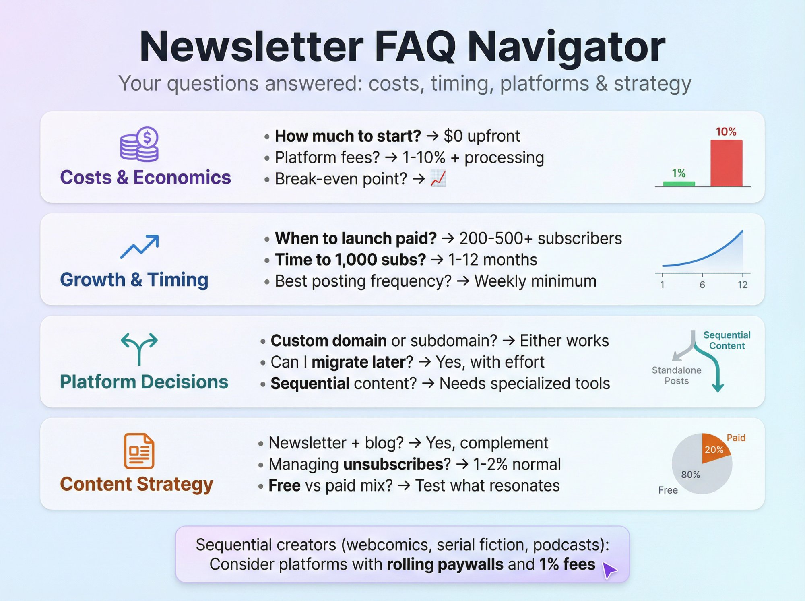

### How much does it cost to start a newsletter?

Starting a newsletter is free on most platforms. You don't pay anything upfront. If you enable paid subscriptions later, platforms typically take 10% of your revenue ([Patron charges 1% for early adopters](https://www.patron.com/)), plus payment processing fees of around 2.9% + $0.30 per transaction via Stripe. There are no monthly hosting fees or setup costs.

### How many subscribers do I need before launching paid subscriptions?

There's no magic number, but typical conversion rates are 5-10% of free subscribers converting to paid. Most experts suggest waiting until you have a few hundred engaged free subscribers. This gives you enough volume that a 5-10% conversion actually means meaningful revenue. But every niche is different. If you have a highly devoted audience, you might convert at higher rates with fewer subscribers.

### Can I move my newsletter to a different platform later?

Yes. Most platforms let you export your email list and content. You own your subscriber list and can take it anywhere. If you start on one platform and later find it's not working, you can migrate. That said, moving is work (re-importing subscribers, setting up a new site, notifying readers), so choose thoughtfully from the start.

### What's the difference between a newsletter platform and a membership platform?

Newsletter platforms are built around email-based publishing. You write posts that go to subscribers' inboxes. Membership platforms focus more on community features, content libraries, and tiered access. Sequential creators often benefit from membership platform features like [rolling paywalls](https://www.patron.com/blog/post/what-is-a-rolling-paywall/) and series organization, which is why platforms like [Patron](https://www.patron.com/) exist specifically for episodic content.

### How long does it take to grow a newsletter to 1,000 subscribers?

It varies wildly. Some creators hit 1,000 subscribers in a month if they have an existing audience elsewhere or create viral content. Others take 6-12 months of consistent publishing and promotion. Growth often comes in spurts rather than linear increases. Focus on consistent quality and distribution. The timeline depends on your niche, content quality, and promotional efforts.

### Should I use a custom domain or stick with the platform subdomain?

Custom domains (like yourname.com) can make your publication feel more professional and may help with SEO. But they're not essential, especially at launch. Many successful newsletters use platform subdomains (yourname.substack.com or similar). You can always add a custom domain later as you grow. Start with the free subdomain and upgrade if brand independence becomes important.

### What's the best posting frequency for newsletters?

Start with at least once per week. Weekly publishing builds reader habits and shows commitment. Some creators publish multiple times per week; others do biweekly. The key is consistency, not frequency. Pick a schedule you can sustain long-term. It's better to publish every other week reliably than to start with three posts per week and burn out after a month.

### Can I run a newsletter and a blog at the same time?

Absolutely. Many creators maintain both. Some use their blog for SEO and long-form content, then send weekly newsletter summaries linking back to the blog. Others do the opposite: publish primarily via newsletter and cross-post selections to their blog. Just make sure you're not spreading yourself too thin. It's better to do one thing excellently than two things poorly.

### What if I create webcomics or serialized fiction? Is a traditional newsletter platform the best fit?

Probably not. Traditional newsletter platforms work for standalone posts, but managing episodic content (chapter order, time-delayed access, series organization) requires workarounds. Platforms built for sequential content like [Patron](https://www.patron.com/) offer native episode management, automated [rolling paywalls](https://www.patron.com/blog/post/what-is-a-rolling-paywall/), and series navigation that matches how readers consume sequential stories. If your content has narrative continuity, use tools designed for that workflow.

### How do I handle unsubscribes and keep my list healthy?

Unsubscribes are normal and healthy. Not everyone will love your content forever, and that's fine. Focus on engaging your core audience, not keeping everyone on your list. Most platforms handle unsubscribe mechanics automatically (required by email regulations). Track your unsubscribe rate, but don't obsess over it. If it spikes suddenly, review what you recently sent and adjust. A 1-2% unsubscribe rate per send is typical and not cause for concern.

---

## Ready to Start Your Newsletter?

The newsletter landscape in 2026 offers more opportunities than ever for independent creators. You can reach readers directly, own your audience relationship, and potentially earn income doing what you love.

**Choose a platform that matches your content structure** (standalone posts vs. sequential episodes). **Start with free content** to build an engaged audience before monetizing. **Publish consistently** on a schedule you can sustain long-term. **Use platform discovery features and cross-promotion** to grow. **Engage genuinely** with readers and other creators.

**If you're creating episodic content like** [**webcomics**](https://www.patron.com/blog/post/how-to-monetize-a-webcomic/)**,** [**serialized fiction**](https://www.patron.com/blog/post/how-to-start-a-web-serial/)**, or** [**podcasts**](https://www.patron.com/blog/post/how-to-monetize-a-podcast-with-early-access-not-ads/)**,** check out [Patron](https://www.patron.com/). It's built specifically for sequential creators with automated [rolling paywalls](https://www.patron.com/blog/post/what-is-a-rolling-paywall/), series organization, and [1% platform fees for early adopters](https://www.patron.com/). The [open-source platform](https://github.com/patroninc/patron) gives you full control over your content infrastructure. Learn more about [how Patron compares to other platforms](https://www.patron.com/blog/post/switch-from-patreon-to-patron/).

**If you're writing standalone essays or weekly analysis,** traditional newsletter platforms work great. Focus on consistent publishing and building genuine connections with readers.

Whatever platform you choose, the most important step is starting. You can create a publication in less than 20 minutes ([Substack Newsletter Guide](https://pubstacksuccess.substack.com/p/how-to-start-a-substack-newsletter)), so if you're on the fence, just begin. Early posts won't be perfect, and growth might feel slow at first. That's normal. Every successful creator started exactly where you are now.

Your newsletter journey begins today. Start writing, start publishing, and start building your audience. The readers you're meant to reach are out there waiting to discover your work.
