You're not actually asking "how do I post chapters online." You're really asking: How do I write something people keep coming back to, week after week? How do I get discovered on places like Royal Road instead of screaming into the void? And how do I turn that attention into predictable income without annoying my readers?

This guide is built for that real question.

We'll walk from absolute zero to "I'm running a functioning serial with a release schedule, a discovery funnel, and a membership setup on [a platform like Patron](https://www.patron.com/)."

## What Is a Web Serial and Why Can It Make Money?

**Definition in plain language**

A [web serial is a story published chapter by chapter](https://en.wikipedia.org/wiki/Web_fiction) on the internet, usually while it's still being written. Readers follow along in real time, like a TV show season, instead of waiting for a finished book. Web serials are ongoing and potentially very long, with frequent updates (several times a week or weekly). They create a feedback loop with readers through comments, Discord, and Reddit. Most are free to read but monetized through memberships, early access, books, or ads.

Web serials can make serious money. Look at current numbers. Zogarth, author of *The Primal Hunter*, runs a Royal Road serial plus advance chapters on a membership platform—[Graphtreon estimates](https://graphtreon.com/top-patreon-creators/writing) about $83,000 per month from more than 10,000 paying members. ErraticErrata, author of *A Practical Guide to Evil* and *Pale Lights*, has more than 3,100 total members and around AU$11,000 per month, largely from "read a few weeks ahead" access to a weekly serial. Bacon Macleod, writing the serial *Runeblade*, launched in late 2024 and is already around 1,400 paying members and about $10,500 per month (source: [Graphtreon](https://graphtreon.com/creator/BaconMacleod)).

These are outliers at the top, but they prove the ceiling is *very* high.

The game isn't "write one perfect book." The game is building three machines that feed each other: a story machine that can run for hundreds of chapters without collapsing, an attention machine that keeps new readers flowing in (Royal Road, Reddit, TikTok, etc.), and a money machine that converts the most obsessed readers into monthly supporters. Your web serial is the engine that powers all three.

## What Do People Search When Looking to Start a Web Serial?

When someone types that query, they usually have a story idea (maybe a first chapter), have heard "Royal Road" or "LitRPG webnovels can make real money," and feel totally lost about structure, schedule, and monetization.

So the right content is a comprehensive, beginner-friendly manual heavy on process, examples, and concrete numbers that walks them from zero to a running system—not just craft tips.

Success for the reader looks like knowing exactly what to do in their first 30 days, having a realistic update schedule matched to their life, understanding how Royal Road discovery works, knowing when to turn on memberships and how to structure tiers, and seeing real creator examples that make this feel actually doable. That's what this guide is going to give you.

## Where to Publish Web Serials in 2025 (Especially Royal Road)

Major hubs in 2025 include Royal Road, which is strongest for LitRPG, progression fantasy, cultivation, xianxia, isekai, and adjacent genres ([audience skews heavily male, mostly 18-24](https://en.wikipedia.org/wiki/Web_fiction)). Wattpad, Webnovel, GoodNovel, and ScribbleHub are huge fiction platforms, but each has its own genre bias and contract ecosystem (source: [Wikipedia](https://en.wikipedia.org/wiki/Web_fiction)). Self-hosted memberships means authors run their own sites and point readers to membership platforms for early access. Email, newsletters, and Substack-style setups are less common in web serial LitRPG land but more common in essays and literary work.

For Royal Road specifically, [a very good 2024 guide by William Flattener](https://medium.com/@william.flattener/royal-road-for-beginners-answering-every-question-about-launching-your-web-fiction-f1cf0fc2e888) lays out how much the site rewards rapid early posting (20k+ words), daily chapters in the first month, and strong cover art and blurbs.

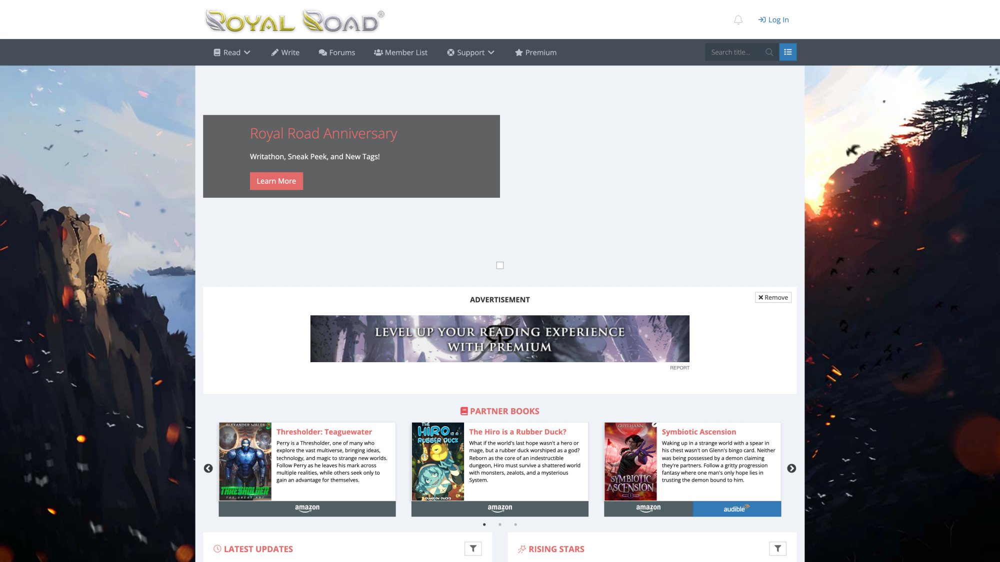

This is where your web serial will live. Royal Road's homepage shows exactly what readers see when they're looking for new stories to follow. The trending lists, genre filters, and discovery mechanisms here are how readers will find your work once you launch.

### How Web Serial Authors Make Money (Beyond Just Writing)

Here's the key insight most beginners miss: successful web serial authors don't rely on a single revenue stream. They build a funnel.

Memberships and subscriptions are where the real money lives. Platforms like [Patron](https://www.patron.com/) let you offer early access chapters, bonus side stories, and Discord roles and community perks. Books and audiobooks come next—collect arcs into volumes on Kindle and Audible. Many Royal Road hits, like [*Reborn as a Demonic Tree*](https://www.royalroad.com/fiction/62881/reborn-as-a-demonic-tree%C2%A0?review=1571879), remove early volumes from the site once they're on Amazon while continuing later arcs as a serial. Tips and one-off support through Ko-fi and similar "bought you a coffee" tools work great for casual support. Commissions and merch round out the options—character art, maps, signed books, print-on-demand.

Memberships dominate the serious money. [Ko-fi now offers both tip jar functionality and comprehensive membership features](https://help.ko-fi.com/hc/en-us/articles/4402945994001-Ko-fi-Memberships-and-Membership-Tiers), including tiered recurring billing and paywalled content through Ko-fi Gold. However, if you want rolling paywalls specifically designed for serial content, platforms like Patron offer specialized features.

**What Are Rolling Paywalls and How Do They Work?**

Here's what makes [Patron different for serial authors](https://www.patron.com/blog/post/what-is-a-rolling-paywall/): rolling paywalls. Traditional setups make you choose between locking content permanently behind a paywall or making everything free forever. Rolling paywalls give you both.

Here's how they work. You release new episodes to paying subscribers first, then those same episodes automatically become free after a set time (usually 1-4 weeks). Your archive builds up as free content that attracts new readers, while your most engaged fans subscribe to get episodes early. It's the difference between locking content behind a permanent paywall and creating a time-release valve that serves both discovery *and* revenue.

The psychology is powerful. Readers discover your serial through free content, binge your archive, hit a cliffhanger or run out of episodes, subscribe to get more *immediately*, and stay subscribed to avoid falling weeks behind. This is why so many top serial authors use this model. It solves the "discovery vs. monetization" problem that kills most web serials.

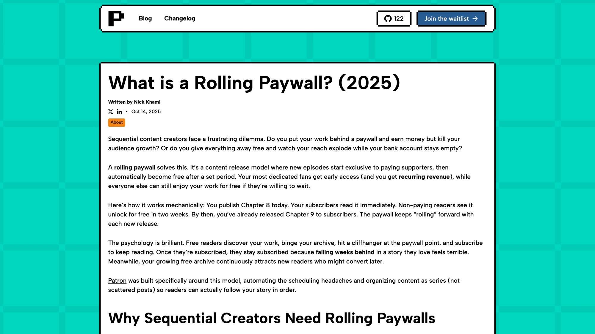

Patron built this feature specifically for serial creators. The screenshot above shows their actual rolling paywall documentation, explaining exactly how the time-release mechanism works to balance early access for paying supporters with free discovery for new readers.

## Step Zero: What Type of Web Serial Writer Are You?

If you skip this, you'll burn out.

Ask yourself three non-romantic questions. First, time budget: how many realistic hours per week can you spend on writing and admin for the next 6-12 months? Second, money ambition: are you a hobbyist who wants a few readers and maybe some coffee money, someone aiming for side-income of $500-$2,000 per month, or pursuing this as a career to pay rent or replace your job? Third, patience: are you willing to grind for 6-12 months before anything meaningful happens?

Your answers give you your minimum sustainable pace. With 5 hours a week, you probably can't do daily 2,000-word chapters for months. With 15-20 hours a week, you can plausibly maintain 3-5 releases per week plus a membership tier 10-30 chapters ahead.

From [Royal Road guides and forum experience](https://medium.com/@william.flattener/royal-road-for-beginners-answering-every-question-about-launching-your-web-fiction-f1cf0fc2e888), chapters under ~1,000 words tend to underperform and feel insubstantial. Many successful stories hit 1,500-3,000 words per update, with three updates per week as a very common pattern.

Build your plan around what you can do every week, not what you wish you could do on your best day.

## How to Design a Serial Story That Won't Collapse at Chapter 37

Most writers start with "cool idea" instead of "can this run for hundreds of episodes."

That's how you end up with a brilliant first arc and a dead serial.

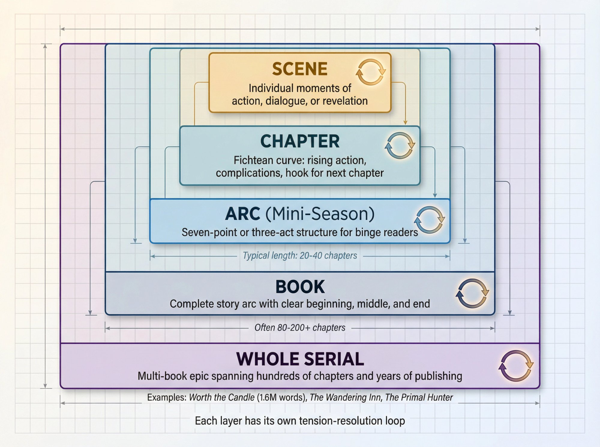

### The chunked, nested architecture (Alexander Wales method)

[Alexander Wales, who finished the 1.6-million word serial *Worth the Candle*](https://alexanderwales.com/how-to-write-a-web-serial/), describes a powerful way to think about serial structure: work in chunks.

Think of your story as nested layers—scenes inside chapters inside arcs (like mini-seasons) inside books inside the whole serial. Each layer has its own mini "peace → conflict → tension → resolution" loop. You don't plan every beat for four years, but you know where each arc should end and roughly where the whole story is headed.

Why this matters: you always know what this current arc is doing, you can foreshadow early and pay off later without feeling lost, and you can cut or replace arcs without destroying the entire serial.

### Plot structure tuned for serials, not standalone novels

On [the Royal Road forums, experienced writers talk about using a hybrid structure](https://www.royalroad.com/forums/thread/141079). At the chapter level, use a Fichtean-curve style: rising action, complications, and a hook that pushes the reader into the next chapter. At the arc level, something like a Seven Point or three-act structure so that binge readers who arrive later still feel a coherent shape.

You have two reader types. Live readers follow chapter by chapter as you post. Binge readers show up later with a big backlog to chew through. For live readers, every chapter must carry its own tension and reason to click "Next." For binge readers, the start of each arc and the arc climax do most of the heavy lifting.

### Serial-friendly premises

Some premises naturally sustain long-running serials. You want built-in progression (leveling up, cultivation, growing city, political career), a clear "experience loop" you can repeat with variation (dungeon runs, cases, quests, tournaments, heists), and a setting that lets you introduce new locations, factions, and power systems over time.

That's partly why LitRPG and progression fantasy [dominate Royal Road](https://en.wikipedia.org/wiki/Web_fiction): the core loop is "gain stats → face harder challenge → gain new abilities." The site's audience is heavily skewed toward those genres, which matters for visibility.

You do not have to write LitRPG, but if your goal is maximum growth on Royal Road, writing in or adjacent to its core genres makes your life easier.

## Why You Need a Backlog Before Posting Your First Chapter

If you ignore everything else in this guide, do this part.

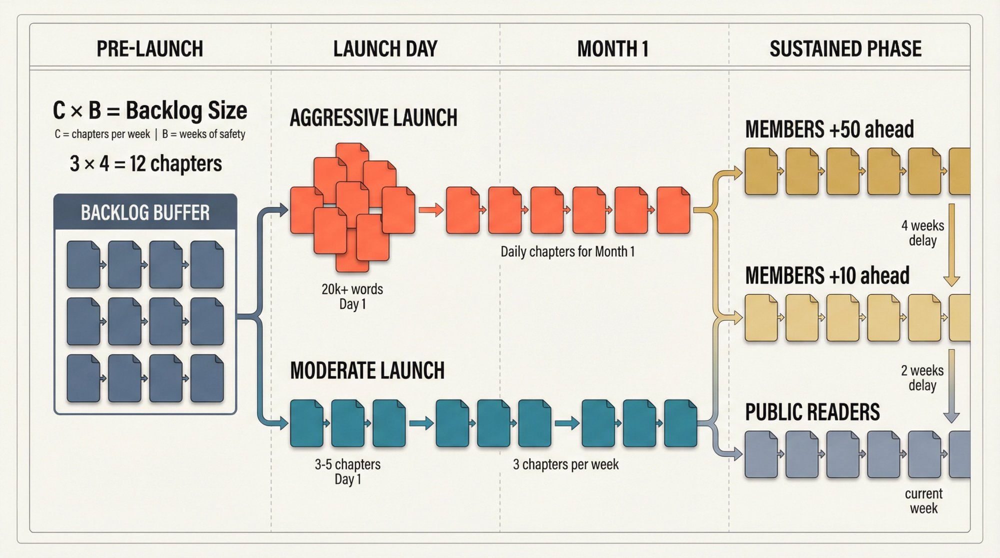

### Why backlog beats "write and post on the same day"

Algorithms reward consistent posting. Life will punch you in the face at some point. Readers drop serials that go on mystery hiatus.

The [Royal Road beginners guide breaks the early life of a serial](https://medium.com/@william.flattener/royal-road-for-beginners-answering-every-question-about-launching-your-web-fiction-f1cf0fc2e888) into two phases. On day 1, post enough chapters to quickly reach around 20,000 words so your story is eligible and competitive for Rising Stars. In month 1, keep a pace of roughly one chapter per day while you collect reviews and comments, then drop to your long-term "cruising" schedule.

On top of that, [Royal Road community discussions](https://www.royalroad.com/forums/thread/130094) suggest that while no publicly confirmed hard minimum exists, stories typically need substantial word counts—a soft minimum around 20,000 words for best competitive odds. Various popularity signals (views, follows, reviews) influence the list, plus some internal factors you can't see.

You can't control the exact formula, but you can control posting enough content on day one, maintaining a daily or near-daily cadence for that first crucial month, and making sure your chapters are solid enough to earn comments and reviews.

### How big should your backlog be

Think in weeks, not chapters. Let C equal chapters per week you plan to publish, and B equal weeks of safety you want if you get sick, busy, or blocked. A reasonable beginner default is C = 3 (Mon / Wed / Fri) and B = 4, which gives 3 × 4 = 12 chapters of backlog.

If you want to follow the aggressive "day 1 / month 1" Royal Road playbook (a big chapter dump plus a chapter per day for a month), you might write 20-30 chapters before launch, post 8-10 in a launch burst, schedule the rest daily, and keep writing during that first month so your backlog doesn't hit zero.

If you plan to offer advance chapters, you need backlog on top of what public readers see. For example, if members get 20 chapters ahead and you post 3 times per week publicly, you'll want a buffer of 30-40 chapters so you have some distance between what members see and what you're still drafting.

## How to Launch Your Web Serial on Royal Road (Step by Step)

We'll assume Royal Road as primary discovery, since that's where a huge chunk of top-earning writing creators come from.

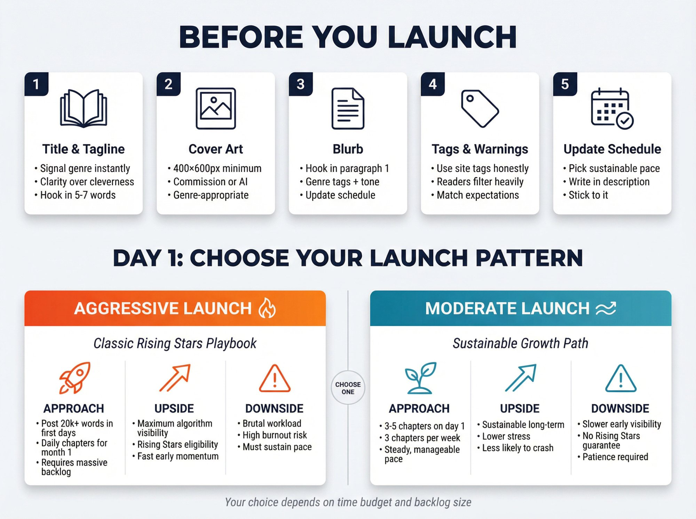

### Before you click "submit fiction"

Prepare these assets. Your title and tagline should signal genre and hook instantly—err on the side of clarity over cleverness. For your cover, [Royal Road requires cover art to be at least 400 x 600 pixels](https://www.royalroad.com/support/knowledgebase/84) (minimum requirement, not maximum; higher resolution images are accepted). You can commission an artist, use Canva or a design template, or use AI as a temporary stand-in until you can afford custom work (this is very common on Royal Road).

Your blurb should lead with a hook in the first paragraph, then set expectations in the second paragraph covering genre tags, tone, and update schedule. Use the site's tags honestly—[readers on Royal Road highly filter by tags](https://medium.com/@william.flattener/royal-road-for-beginners-answering-every-question-about-launching-your-web-fiction-f1cf0fc2e888) like "slow burn", "harem", "kingdom building", etc. Expectation mismatch kills retention. Pick an update schedule you can actually keep, write it in the description, and stick to it.

### Day 1: controlled "chapter bomb"

Two main launch patterns exist. The aggressive launch (classic Rising Stars playbook) means posting enough chapters to reach roughly 20k+ words in the first days, then continuing with daily chapters for the first month. The upside is maximum algorithm pop; the downside is brutal workload and high risk of burnout if you didn't pre-write enough (source: [Royal Road guide](https://medium.com/@william.flattener/royal-road-for-beginners-answering-every-question-about-launching-your-web-fiction-f1cf0fc2e888)). The moderate launch means posting 3-5 chapters on day 1, then 3 chapters per week. The upside is sustainability for most people; the downside is lower peak early visibility, but less likely to crash.

Which one you pick depends on your time budget and backlog. If you genuinely want to chase Rising Stars for LitRPG or progression fantasy, the aggressive route exists for a reason. But many long-running authors say: don't destroy your mental health for a list that's partly luck.

### Month 1: treat it like a sprint and a test

For your first 30 days, focus on consistent posting, encourage comments and reviews at the end of chapters, participate a bit [on the forums and subreddits where it's allowed](https://medium.com/@william.flattener/royal-road-for-beginners-answering-every-question-about-launching-your-web-fiction-f1cf0fc2e888) (Royal Road discussion, r/RoyalRoad, r/litrpg, etc.), and only do light social media promo unless you already have an audience.

If you don't hit Rising Stars in the first month, that's not game over. Many serials build slowly and still become strong earners later through stable readership and membership funnels.

## How to Write Web Serial Chapters That Keep Readers Coming Back

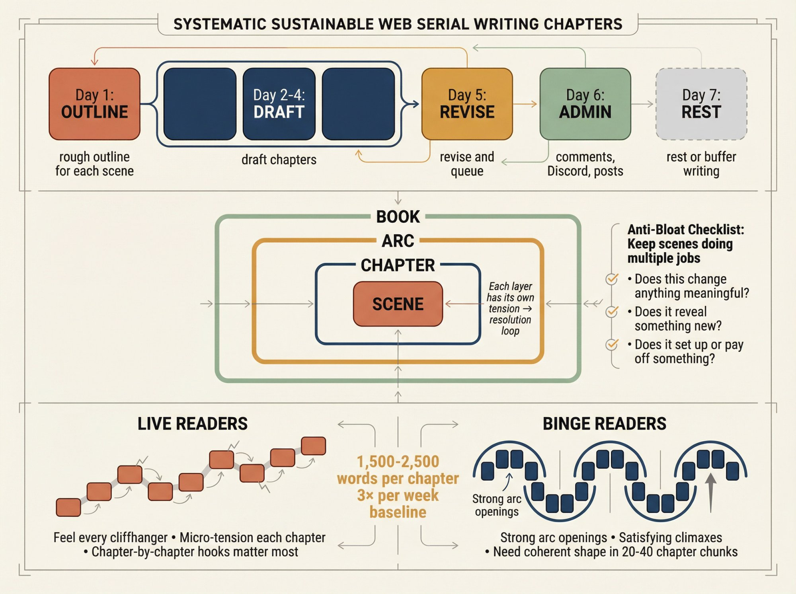

### Structure your workflow in layers

[Combine Wales' chunking idea with a simple weekly routine](https://alexanderwales.com/how-to-write-a-web-serial/). Day 1 is for rough outlining this week's chapters (what each scene actually does). Days 2-4 are for drafting chapters. Day 5 is for revising and queuing chapters. Day 6 is for light admin (comments, Discord, membership posts). Day 7 is for rest or buffer writing.

Even if you work part-time, you can compress this into shorter sessions. The key is that you're not deciding "what happens next" at 2am the night before posting.

### Keep scenes doing multiple jobs

[Wales suggests aiming for scenes that accomplish five things: advance plot, reveal character, provide exposition, interrogate ideas or themes, and are just plain cool](https://alexanderwales.com/how-to-write-a-web-serial/).

When your serial runs long, your main enemy is bloat. For each scene, ask whether it changes anything meaningful, reveals something new, or sets up or pays off something. If the answer is no, compress it, combine it, or cut it.

### Tune chapter length and cadence to your readers

[Rules of thumb from current Royal Road advice](https://medium.com/@william.flattener/royal-road-for-beginners-answering-every-question-about-launching-your-web-fiction-f1cf0fc2e888): avoid chapters under ~1,000 words, aim for 1,500-2,500 words as a comfortable range for most readers, and many successful serials post 3× per week (common baseline) or daily during growth sprints.

Different reader types experience your story differently. Live readers feel every cliffhanger and lull. Binge readers look for strong arc openings and satisfying climaxes. So treat each chapter like an episode with its own micro-tension, and treat every arc like its own book with a clear start, middle, and end.

## How to Turn Web Serial Readers into Paying Members

Once your serial has some traction, the obvious next step is memberships. There are two big mistakes: turning on memberships when you have no audience, and hard-locking everything behind a paywall so nobody new can discover you.

### When to start a membership page

Good triggers include being at least 30-50 chapters in, having hundreds or thousands of followers on Royal Road, and already getting questions like "how can we support you" or "is there somewhere to read ahead."

At that point you can add a membership link to your Royal Road sidebar and chapter footers, and make a soft announcement in an author's note at the end of a chapter. Royal Road explicitly allows monetization links for original fiction, as long as it's not fanfic.

### What to offer members

Look at what top serial creators actually do:

| **Creator** | **Serial** | **Tier Structure** | **Monthly Income** |
| --- | --- | --- | --- |
| Zogarth | *The Primal Hunter* | ~10 chapters ahead ($3)
~25 chapters ahead ($5)
~50 chapters + extras ($10) | [~$83,000](https://graphtreon.com/creator/Zogarth) |
| ErraticErrata | *Pale Lights* | 3 chapters ahead (weekly serial) | [~$7,500 USD](https://graphtreon.com/creator/ErraticErrata) |

Patterns you can copy: early access is the core benefit, the work remains free in time (great for discovery and goodwill), and higher tiers give "more ahead" plus maybe extras like side stories or Discord roles. You do not need complicated physical rewards or monthly bespoke content. Serial readers mainly want more story, sooner.

### Why a rolling paywall is ideal for web serials

Traditional membership platforms don't natively let you say "chapter is exclusive to paying members for X days, then automatically free." You can approximate it by manually unlocking posts, but it's a hassle.

[Patron was built exactly for this](https://www.patron.com/blog/post/what-is-a-rolling-paywall/): it has rolling paywalls where an episode is paid for a while, then automatically unlocks to everyone. This lets you give supporters "first dibs" on new chapters, turn your back catalogue into free discovery material over time, and avoid running two separate feeds manually.

A simple funnel works like this: free readers follow you on Royal Road, chapter footers link to your [Patron page](https://www.patron.com/) with "read 20 chapters ahead," Patron's rolling paywall holds new chapters for paid members for 7-30 days, then those chapters unlock automatically on your Patron public feed or your own site after the window, and you mirror them to Royal Road. This is the same basic structure top creators use, just tuned for automation and serial content.

### Web Serial Membership Platform Fees in 2025

[Platform fees matter a lot](https://www.patron.com/blog/post/how-to-calculate-your-true-patreon-take-home-pay-2025/) once you're above a few hundred dollars a month.

| **Platform Type** | **Platform Fee** | **Processing Fee** | **Total on $1,000** |
| --- | --- | --- | --- |
| Traditional platforms (new creators) | 10% | ~2.9% + $0.30/transaction | ~$130 in fees |
| [Patron](https://www.patron.com/) (early adopters) | 1% | ~2.9% + $0.30/transaction | ~$40 in fees |

A quick example using 2025 numbers: on $1,000 revenue, roughly 2.9% + $0.30 per transaction in processing fees is typical for Stripe in many countries (real rate depends on your region and payment mix). A traditional platform fee at 10% is $100; [Patron's at 1% is $10](https://www.patron.com/blog/post/patreon-fee-changes-2025/). So in this simplified scenario the difference in platform fees alone is about $90 per $1,000 of revenue. Over a year at $2,000 per month that's more than $2,000 difference.

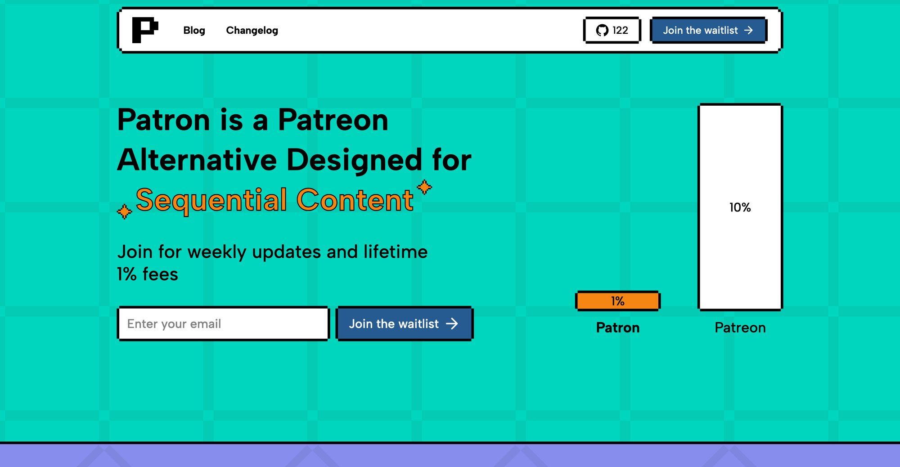

## Real Web Serial Creator Examples: What the Pros Are Doing

These aren't fairy-tale stories. They're current, concrete examples as of 2025. Exact numbers shift month by month, but the structures are stable.

### Creator Profile 1: Zogarth and *The Primal Hunter*

Zogarth writes a LitRPG web serial, [*The Primal Hunter*, hosted on Royal Road](https://www.royalroad.com/fiction/36049/the-primal-hunter/chapter/2184936/chapter-1060-questions-of-trust), currently sitting on more than a thousand chapters with a huge backlog for paying readers.

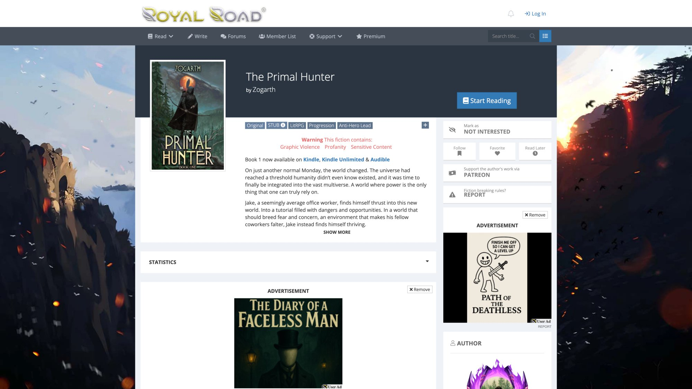

This is what a successful Royal Road serial looks like.

He uses Royal Road as the primary free hub. At the end of chapters he includes a membership plug: ~10 chapters ahead for around $3, ~25 chapters ahead for about $5, ~50 chapters ahead plus side stories for roughly $10. He also links to a Discord server for community.

[Graphtreon currently estimates](https://graphtreon.com/top-patreon-creators/writing) about $83,000 per month with above 10,000 paying members, making him the top ranked writing creator by paid members.

What you can copy: a very clear, simple value ladder where free readers get the whole story (just later) and paid readers get much further ahead rather than a random mix of confusing rewards. Consistency matters too—he's kept up a high release pace for years. You probably won't hit that scale immediately, but you absolutely can copy the structure on a smaller level.

### Creator Profile 2: XKARNATION and *Reborn as a Demonic Tree*

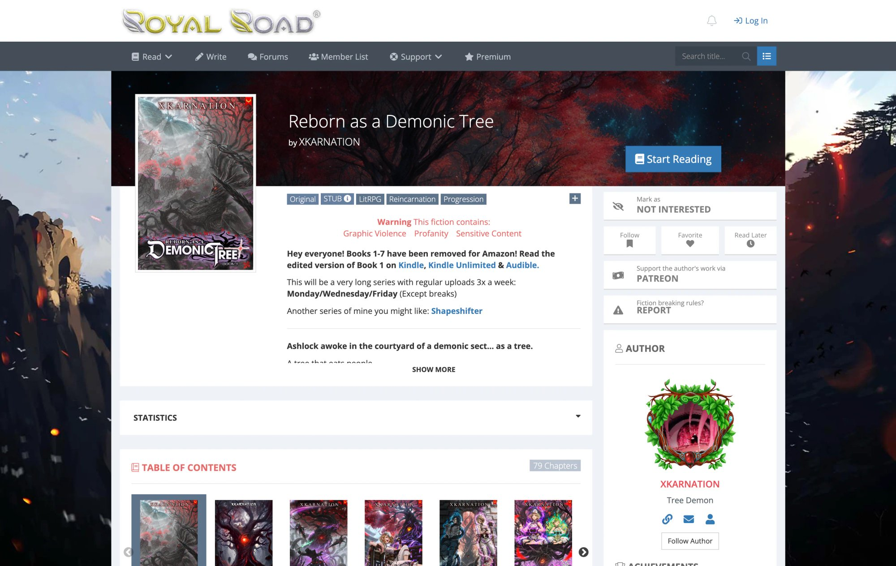

[*Reborn as a Demonic Tree* is a LitRPG cultivation series on Royal Road](https://www.royalroad.com/fiction/62881/reborn-as-a-demonic-tree%C2%A0?review=1571879) with more than 2.2 million views, around 15,000 followers, and thousands of ratings as of mid-2025.

On the fiction page, the author explicitly promises "very long series with regular uploads 3× a week: Monday / Wednesday / Friday (except breaks)." They treat that like a contract. The table of contents shows years of steady posting with clearly marked book breaks—Book 1 and 2 chapters, announcements as volumes move to Amazon, and later books continuing on Royal Road. Early volumes have been removed from the site for Kindle, while later content remains a running serial.

The author links directly from the Royal Road page to Kindle and Audible editions of earlier books, a membership page for extra chapters, and a Discord server for community chat.

What you can copy: an explicit, reliable posting schedule; use of Royal Road as a free frontlist while earlier arcs become paid books; and a simple, clear call to action ("support the author and get access to more chapters").

### Creator Profile 3: ErraticErrata and *Pale Lights*

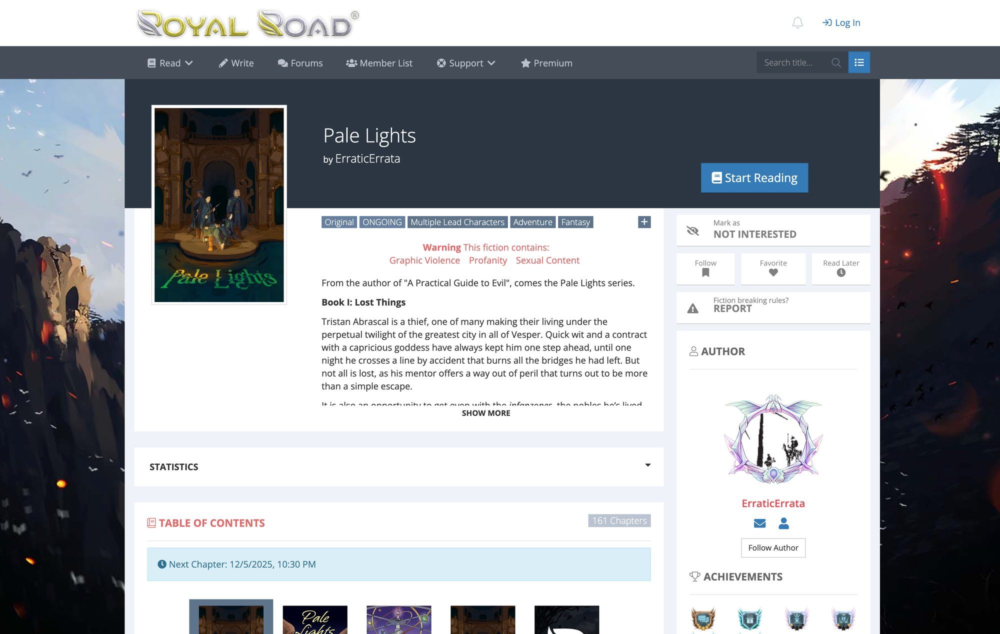

ErraticErrata is a web serial author who wrote *A Practical Guide to Evil* from 2015 onward and is currently serializing [*Pale Lights* exclusively on Royal Road](https://www.royalroad.com/fiction/65058/pale-lights) (transitioned from own website in March 2025), using a membership backend.

*Pale Lights* updates weekly on Fridays on Royal Road. Members get three advance chapters, which equals about three weeks ahead of the public release. As of late 2025, [Graphtreon shows](https://graphtreon.com/creator/ErraticErrata) 3,194 total members and approximately $7,500 USD per month, with 1,891 of those as paid members. This income level supports full-time writing.

What you can copy: weekly cadence instead of ultra-frequent posting (it still works if the story is strong and consistent), a very focused membership promise ("three chapters ahead"), and running everything through your own site while still using a membership platform as the paywall.

### Creator Profile 4: Bacon Macleod and *Runeblade*

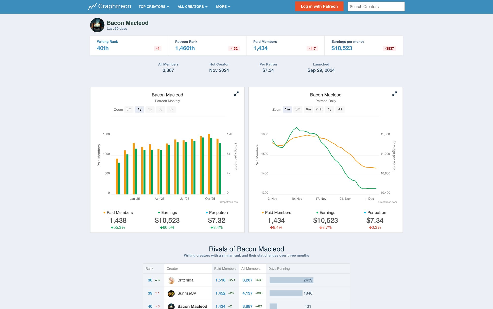

Top creators are inspiring but can feel distant. Bacon Macleod is a useful "mid-high tier" example for a recent launch.

[Graphtreon's tracking](https://graphtreon.com/creator/BaconMacleod) shows, over the last 30 days: writing rank around 40th in the writing category, about 1,439 paying members, estimated $10,516 per month, roughly $7.31 per paying member, launched September 29, 2024. So in well under a year, a focused serial author can move from zero to five figures monthly.

What you can copy: a clear, tightly focused offer (pay for more *Runeblade*, not random perks) and launching memberships after the serial is already moving, not at chapter 3.

## Platform Risk: Why You Shouldn't Marry One Site

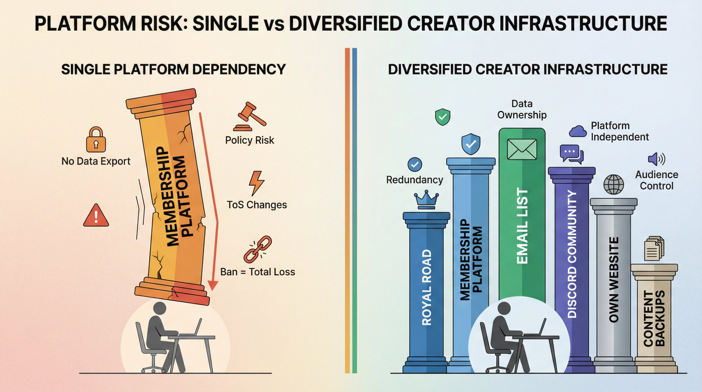

There's a hidden assumption a lot of new writers make: "If I succeed on a membership platform, I'm safe." Not quite.

Traditional platforms have removed or suspended pages for policy reasons, especially around adult content and certain fetish categories. [Understanding how bans and appeals work](https://www.patron.com/blog/post/what-to-do-if-patreon-content-got-banned/), creators sometimes have to leave entirely and rebuild elsewhere. Any third-party membership site can change rules, fee structure, or enforcement style. Once banned, you may lose access to your member list and content archives. Exporting your audience or data after a ban may be impossible.

Defensive moves include always maintaining your own email list, a Discord or similar community space you control, and backups of your chapters. Consider diversifying: Royal Road for discovery, a membership platform for income, and your own site as a canonical home for the story and archive.

One of [Patron's goals as a platform](https://www.patron.com/blog/post/you-can-just-do-things-getting-patron-com/) is precisely to give creators an open-source, self-hostable membership option, so you're not locked into a single private company's policies forever.

## How to Use Patron for Your Web Serial

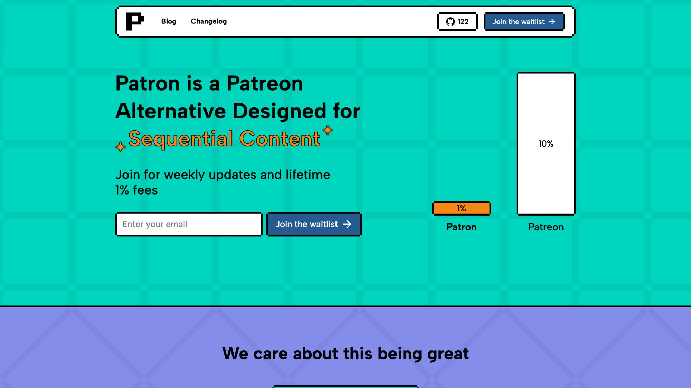

Patron leads with its key differentiator: 1% fees for early adopters (compared to the industry standard 10%). The platform was built specifically for sequential content creators like web serial authors who need rolling paywalls and release scheduling.

Given [Patron is designed for sequential content](https://www.patron.com/), a practical stack for a Royal Road author could look like this.

Royal Road serves as your free serial for discovery and reader community, with an end-of-chapter note like "Read 20 chapters ahead on Patron."

Your [Patron](https://www.patron.com/) hosted page uses rolling paywalls so every new chapter is exclusive for a period (for example 14 days) then automatically unlocks. Have 2-3 early access tiers: Tier 1 at +10 chapters, Tier 2 at +25 chapters, Tier 3 at +50 chapters and side stories. [Patron's 1% early-adopter fee](https://www.patron.com/) keeps more of the upside if you grow large.

Optionally, add your own lightweight site powered by [Patron's open-source stack](https://github.com/patroninc/patron) or your own static site. This mirrors free chapters as an archive and gives you a home base outside any single platform.

This mirrors what top serial authors are already doing, but with automation around timed paywalls and an open-source safety net.

## Common Web Serial Mistakes and How to Avoid Them

### Failure 1: "I'll start memberships on day one"

The problem is that nobody knows you yet, you end up writing more membership posts than chapters, and the page looks like a ghost town. Wait until you have at least a few dozen chapters and a clear cadence, then turn on memberships once readers already show up every update.

### Failure 2: Treating Rising Stars as the only win condition

Yes, hitting Royal Road's Rising Stars list gives a huge visibility spike. But the formula is partly opaque, includes hidden factors, and isn't guaranteed even if you follow every best practice. Treat it as a bonus, not a destiny. Instead, measure returning visitors, comments and reviews per chapter, number of Royal Road followers over time, and how many readers follow your link to your membership page.

### Failure 3: Over-worldbuilding and under-posting

Web serials die when the author spends six months on maps and lore with no chapters going out, or when every chapter turns into a lore dump with no forward motion. [Follow Wales' advice](https://alexanderwales.com/how-to-write-a-web-serial/): worldbuild enough to support what you're about to write, keep notes where you can't contradict yourself, and let some room for the world to grow as you go.

### Failure 4: Burnout from impossible schedules

If you're not a full-time writer yet, daily 3,000-word chapters are a recipe for six weeks of glory and six months of silence.

The Royal Road "gold standard" of daily posts is aspirational, but their own guide says the real key is a schedule you can maintain and communicate clearly. Many successful serials post three times a week.

Be honest with yourself. Don't promise what you can't deliver.

### Failure 5: All your audience lives in someone else's database

If every reader is on Royal Road only and every paying supporter is on one platform only, then a TOS change, ban, or algorithm tweak can hurt you badly. Avoid this by collecting emails (simple newsletter sign-up), running a Discord you control, mirroring free chapters to your own site when possible, and using open-source or self-host options like [Patron](https://www.patron.com/) when you're technically comfortable.

## Your First 90 Days: Complete Web Serial Launch Plan

Let's turn all of this into a simple roadmap you can actually follow.

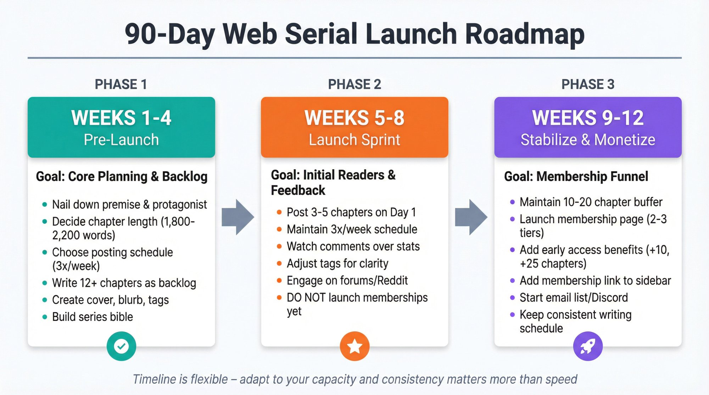

### Weeks 1-4: Pre-launch

The goal is to finish core planning and write backlog. Nail down your premise, protagonist, genre blend, and a rough outline for the first 2-3 arcs. Decide on target chapter length (for example 1,800-2,200 words) and long-term posting schedule (for example 3× per week). Write at least 12 chapters as backlog (more if you can). Create assets: a temporary or commissioned cover, a clear blurb and tags, and a simple series bible with character and setting notes.

### Weeks 5-8: Launch and early sprint

The goal is to get initial readers and gather feedback. Depending on your strategy, either go aggressive (post 8-12 chapters across the first few days, then daily for a month) or moderate (post 3-5 on day 1, then 3× per week).

During this time, watch comments instead of stats obsessively, zero in on what readers respond to, and adjust tags and description for clarity rather than chasing every trend. Do not launch memberships yet unless you already brought a pre-existing audience.

### Weeks 9-12: Stabilize and open memberships

The goal is to flip on a simple membership funnel without breaking your writing flow. Make sure you still have at least 10-20 chapters of buffer and can consistently hit your public schedule.

Launch a [membership page with Patron](https://www.patron.com/) with 2 or 3 tiers and [early access as the main benefit](https://www.patron.com/blog/post/annual-vs-monthly-memberships-for-creators/) (for example +10, +25 chapters). Add a short pitch in your Royal Road sidebar and a tasteful footer at the end of chapters with the membership link. Start an email list and/or Discord community.

Then keep writing. The entire point of your system is to give you a protected block of time each week to sit down and add words to the story.

## What makes this game worth playing?

Web serials are hard. They'll ask you to learn story craft, learn basic marketing and platform strategy, and learn how to run a micro business.

But 2025 is a very good time to start if you take it seriously. Platforms like Royal Road have matured communities and clear genre signals. Membership culture is normal; readers are used to supporting serials. Tools like [Patron](https://www.patron.com/) exist specifically to make serial monetization easier, with [rolling paywalls](https://www.patron.com/blog/post/what-is-a-rolling-paywall/) and [low fees for early adopters](https://www.patron.com/blog/post/patreon-fee-changes-2025/).

If you focus on a serial-ready premise, a sustainable posting schedule, a simple "read ahead" value proposition, and owning your relationship with readers long term—then you're not just "starting a web serial." You're building a small, persistent, story-driven business.

### Quick recap checklist

You're ready to start if you can honestly check these off:

☐ I know my **genre, premise, and target reader**

☐ I have at least **10-20 chapters** written before launch

☐ I have a **cover, blurb, tags, and posting schedule** prepared

☐ I understand Royal Road's basic **growth playbook**: early word count, consistency, and reader engagement matter more than magic tricks

☐ I have a plan for **memberships** that centers on early access, not complicated rewards

☐ I have at least one **off-platform channel** (email list, Discord, or my own site) so I'm not all-in on a single company

☐ I know my **time budget** and have chosen a schedule I can keep for six months

All stats, fees, and platform details in this guide are accurate to the best of currently available data in 2025. Always recheck pricing and policies before making financial decisions, since platforms and processors update their terms regularly.

**Now the only thing left is the part no guide can do for you: open that document and write the next chapter.**

## Frequently Asked Questions

### How long should web serial chapters be?

Most successful Royal Road serials fall between **1,500-2,500 words per chapter**. Anything under 1,000 words tends to feel insubstantial, and readers often complain in comments. Chapters over 3,000 words can work, but they're harder to write consistently multiple times per week.

The sweet spot for most writers is around **1,800-2,200 words**. That's enough to tell a complete scene, hit a tension point, and leave readers satisfied but wanting more.

### When should I start taking payments?

Wait until you have:

- **30-50 chapters posted** (at minimum)
- **Hundreds or thousands of followers** on Royal Road
- **Regular comments** asking "how can I support you?" or "is there a way to read ahead?"

Starting memberships too early (like at chapter 5) makes you look presumptuous and your page looks empty. Build trust and momentum first. Then when you turn on memberships, you'll have people actually ready to subscribe.

### What if I don't hit Rising Stars?

**Don't panic.** Rising Stars is partly algorithmic and partly luck. Many successful serials with thousands of followers and solid income never hit that list.

Instead, focus on:

- **Consistent posting** on your schedule
- **Building genuine engagement** in comments
- **Steady follower growth** over months
- **Conversion to memberships** when ready

Rising Stars is a nice bonus, but it's not required to build a sustainable serial.

### Should I write on multiple platforms?

Starting on multiple platforms at once spreads you thin. Here's what works:

**Start with one primary platform** (usually Royal Road for LitRPG/progression fantasy) as your discovery engine.

**Add a membership platform** (like [Patron](https://www.patron.com/)) for monetization once you hit 30-50 chapters.

**Consider cross-posting** to other fiction sites (ScribbleHub, Wattpad) only after you have a sustainable routine. Some authors successfully mirror to 2-3 sites, but start simple.

**Always maintain** your own email list or Discord so you're not dependent on any single platform.

### How do I avoid burnout?

Burnout is the #1 serial killer. Here's how to protect yourself:

**1. Build a realistic schedule from day one**

- If you can only write 5,000 words per week, don't promise daily 2,000-word chapters.
- Better to post 2 chapters weekly forever than 7 chapters weekly for two months, then ghosting.

**2. Maintain your backlog**

- Never let your buffer drop below 2-3 weeks.
- If it starts shrinking, slow your public posting to rebuild it.

**3. Plan breaks**

- Schedule a "break week" every 3-4 months where you don't post.
- Announce it in advance so readers expect it.

**4. Don't write yourself into a corner**

- [Use Wales' chunked architecture](https://alexanderwales.com/how-to-write-a-web-serial/) so you can adjust arcs if something isn't working.
- If you realize an arc will take 40 chapters instead of 20, adjust expectations early.

**5. Remember why you started**

- You're doing this because you love telling stories.
- If it becomes purely obligation and misery, take a step back.

### What's better: Patron or traditional membership platforms?

**For web serial authors specifically,** [**Patron**](https://www.patron.com/) **has key advantages:**

**Rolling paywalls**

- Traditional platforms make you manually unlock posts on a schedule
- [Patron automates the "exclusive for X days, then free" model](https://www.patron.com/blog/post/what-is-a-rolling-paywall/)
- This solves the discovery vs. monetization problem

**Lower fees**

- [Traditional platforms charge 10% for new creators](https://www.patron.com/blog/post/patreon-fee-changes-2025/)
- [Patron charges 1% for early adopters](https://www.patron.com/)
- On $2,000/month, that's saving ~$180/month

**Built for sequential content**

- Series organization, release scheduling, and episode management
- Traditional platforms are built for "posts" not "episodes"

**Open-source option**

- You can [self-host if you're technical](https://github.com/patroninc/patron)
- Reduces platform risk

Traditional platforms still work (many top creators use them successfully), but if you're starting fresh with a serial, [Patron](https://www.patron.com/) is worth considering.

The best platform is the one you'll actually use consistently. Pick one, learn it, and focus on writing.

**You now have everything you need. Go write.**