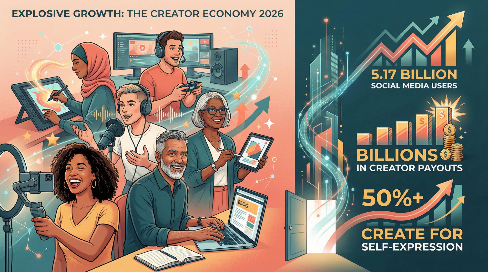
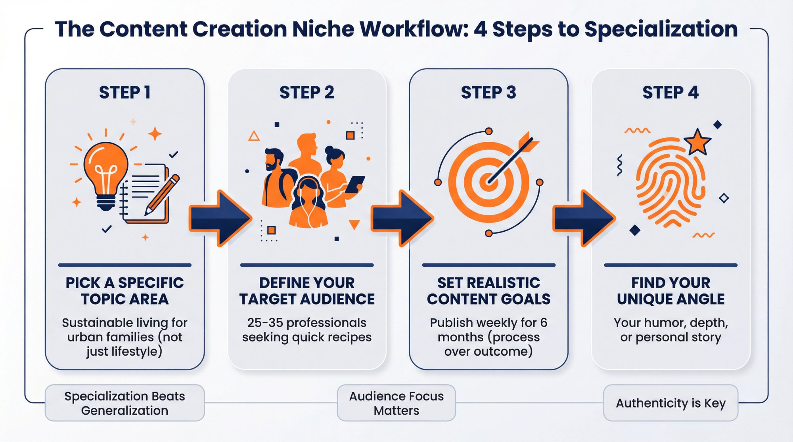
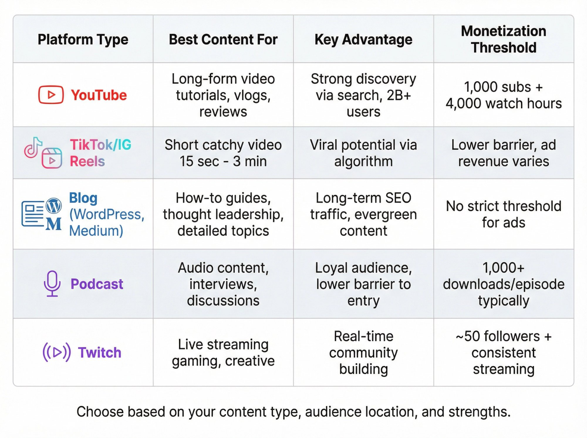
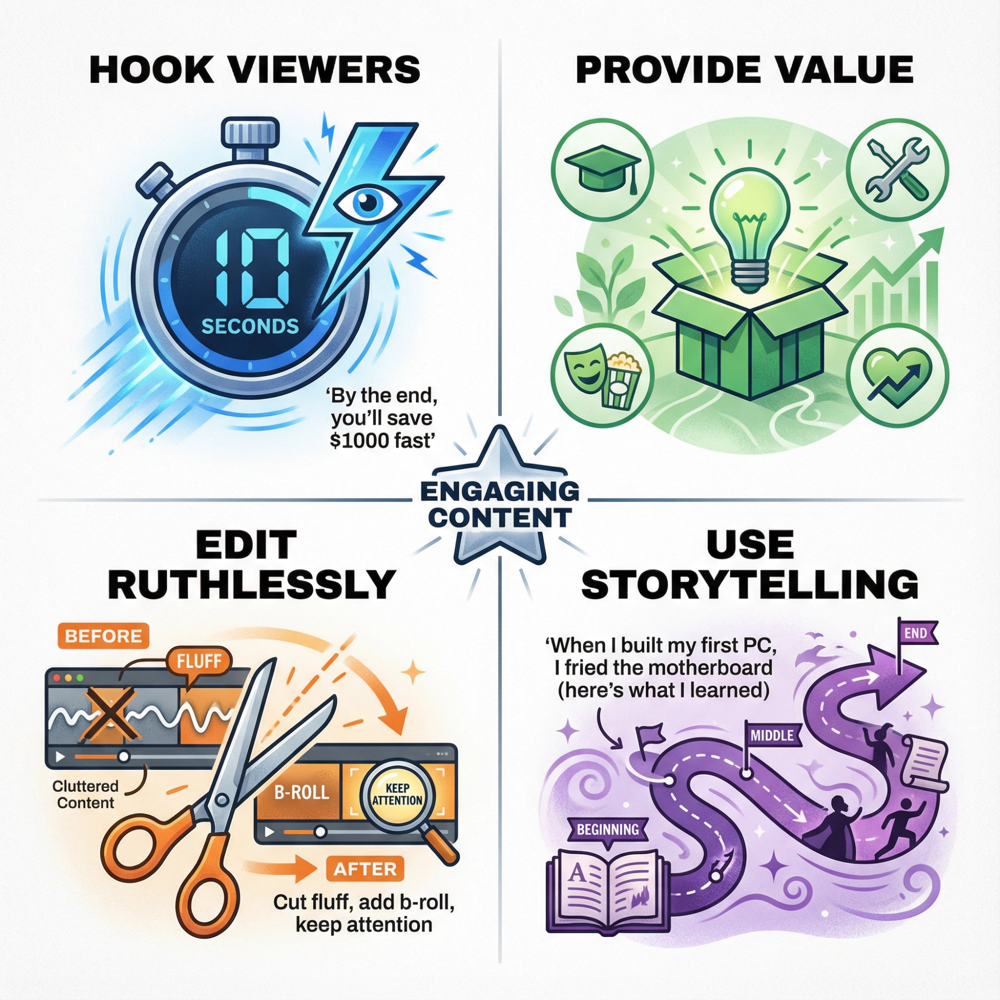
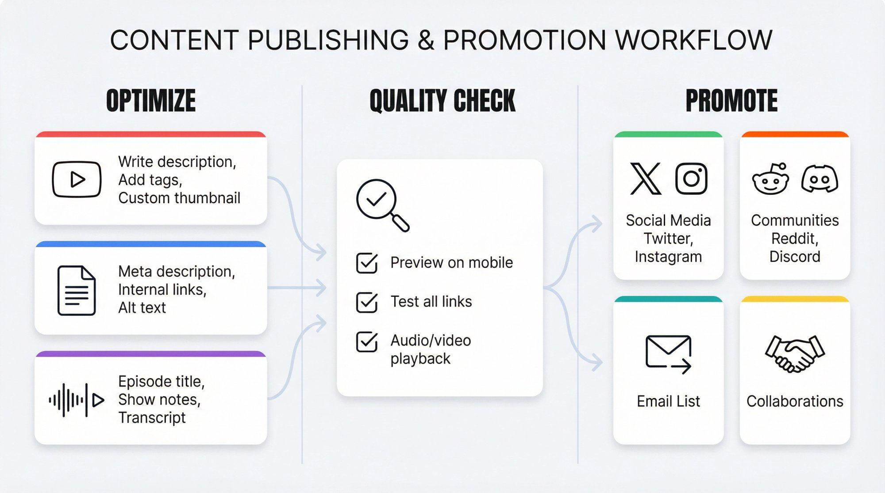
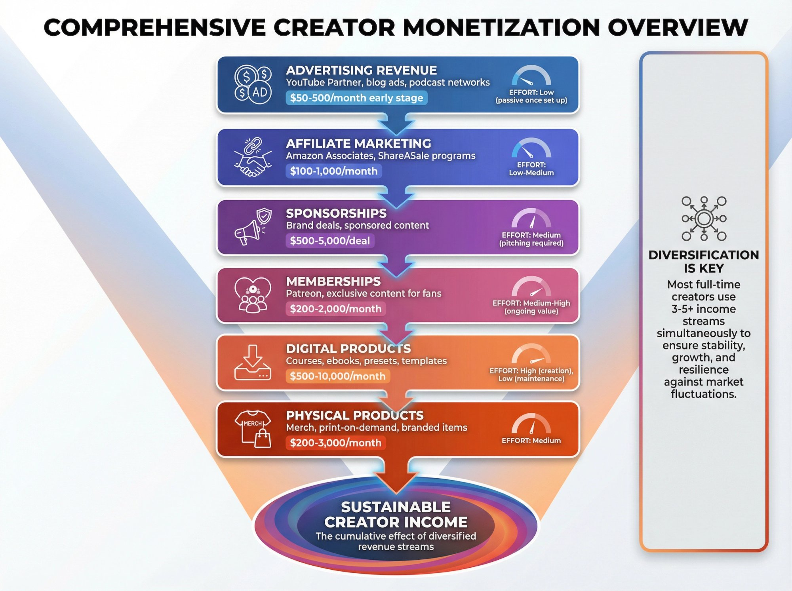
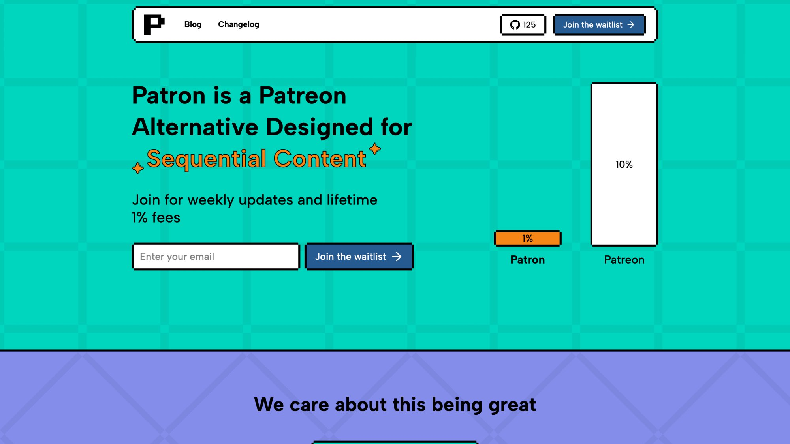
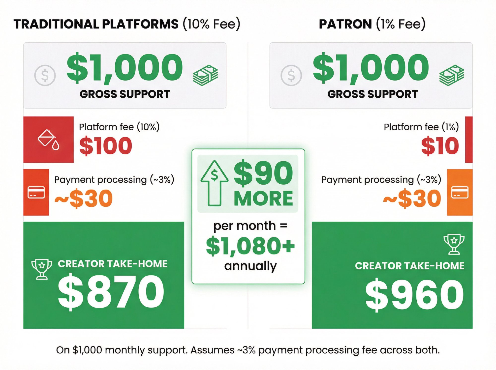
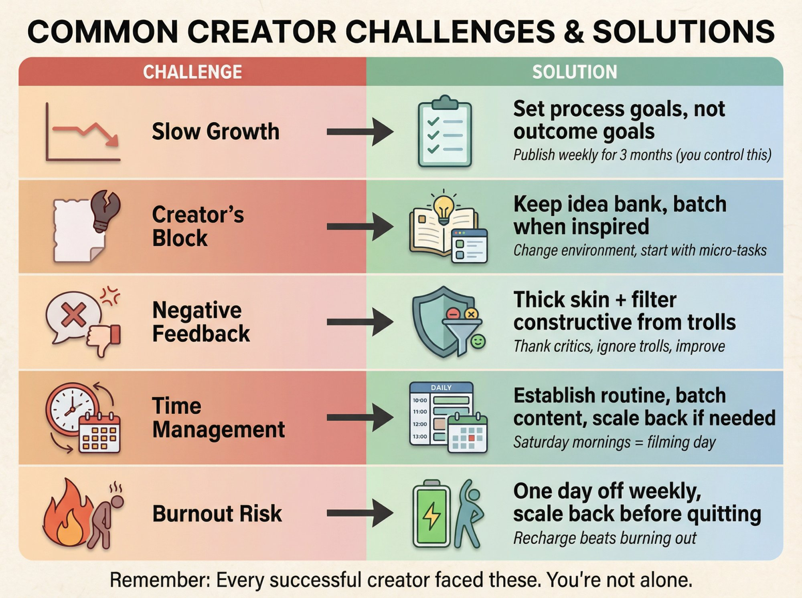
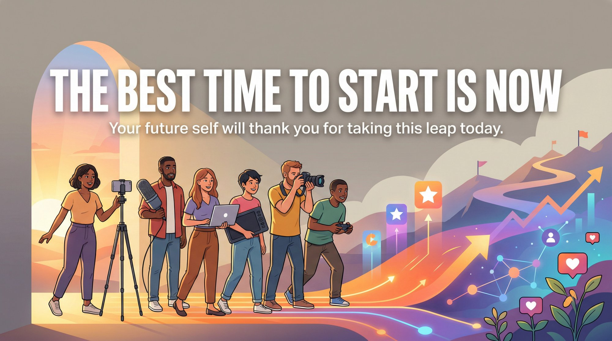

You want to become a content creator. Good news: you're joining over 200 million people worldwide who've already made the leap. The creator economy is now worth more than **$250 billion** and projected to double by 2027.

But most guides won't tell you this: starting is the easy part. The hard part? Building something _sustainable_ that doesn't burn you out in three months.

This guide walks you through everything you actually need to know. From choosing your first platform to earning your first dollar, we'll cover the practical steps that work in 2026, not the theoretical advice that sounds good but fails in practice.

## Why Start Content Creation in 2026?

The timing matters. Platforms have paid out billions to creators, and the infrastructure for supporting creators has never been better. But beyond the money, there are solid reasons to start:

**Global reach without gatekeepers.** You don't need a publisher, network, or anyone's permission. With [5.17 billion social media users](https://datareportal.com/social-media-users) globally, _your audience exists_. You just need to find them.

**Real creative freedom.** You decide what to make, when to make it, and who to make it for. Whether it's videos, writing, podcasts, or comics, you control the entire process.

**Actual income potential.** While only about 4% of creators earn over $100k annually, many earn meaningful side income. **Multiple revenue streams** (ads, sponsorships, memberships, products) make it possible to build something sustainable.

And honestly? Over 50% of creators started just to express themselves, not to build a business. If you're excited about making something, that's reason enough.

## How to Choose Your Content Creation Niche

Start by getting clear on what you're actually creating and why.

### Pick a Specific Topic Area

You probably have dozens of ideas. That's normal. But trying to do everything at once confuses both you and your audience. Choose one primary topic area to start with.

The sweet spot? Something you're knowledgeable about _and_ genuinely interested in. Instead of "lifestyle content," go narrow: sustainable living for urban families. Instead of generic gaming videos, focus on Minecraft mod tutorials.

**Specialization helps you stand out.** You can expand later, but starting focused makes early growth easier.

### Define Your Target Audience

Once you have a topic, think about who would want this content. What problems are they trying to solve? What questions are they asking?

Creating a simple audience persona helps. Maybe it's "25-35 year old professionals who need quick weeknight recipes" or "teen gamers learning Minecraft modding." Understanding your audience guides everything from your tone to your topics.

Spend time in Reddit communities, forums, and social media groups related to your niche. Learn what your potential viewers actually care about.

### Set Realistic Content Goals

Be honest about why you're doing this. Creative outlet? Side income? Future career? Your goals shape your approach.

If you want to eventually go full-time, you might plan for faster posting and earlier monetization. If it's a passion project, focus purely on community and creative fulfillment at first.

**Set process goals, not just outcome goals.** "Publish one video weekly for six months" beats "get 10,000 subscribers" because you can control the former.

### Find Your Unique Angle

What makes you different? Maybe it's your humor, your analytical depth, or your personal story. Early on you might emulate creators you admire (that's fine for learning), but develop your own voice.

Authenticity resonates. Audiences can tell when you're genuinely passionate versus copying someone else.

## How to Choose the Best Platform for Content Creation

Don't try to be everywhere at once. Pick one or two platforms based on your content type and where your audience hangs out.

| **Platform Type**            | **Best For**                                       | **Key Advantage**                          | **Monetization Threshold**              |
| ---------------------------- | -------------------------------------------------- | ------------------------------------------ | --------------------------------------- |
| **YouTube**                  | Long-form video (tutorials, vlogs, reviews)        | Strong discovery through search, 2B+ users | 1,000 subscribers + 4,000 watch hours   |
| **TikTok/Instagram Reels**   | Short, catchy video (15 sec - 3 min)               | Viral potential via algorithm              | Lower barrier, ad revenue varies        |
| **Blog** (WordPress, Medium) | How-to guides, thought leadership, detailed topics | Long-term SEO traffic, evergreen content   | No strict threshold for ads             |
| **Podcast**                  | Audio content, interviews, discussions             | Loyal audience, lower barrier to entry     | Typically need 1,000+ downloads/episode |
| **Instagram**                | Visual arts, photography, general art              | Built-in audience, mix Reels for reach     | Varies by sponsorships/sales            |
| **Twitch**                   | Live streaming (gaming, creative)                  | Real-time community building               | ~50 followers + consistent streaming    |

### Video Platforms for Content Creators

**YouTube** is ideal for longer content (tutorials, vlogs, reviews). With 2+ billion users, discovery is strong. But competition is intense, and the [YouTube Partner Program requires 1,000 subscribers and 4,000 watch hours](https://support.google.com/youtube/answer/72851) before you can earn ad revenue.

**TikTok** and **Instagram Reels** work for short, catchy content (15 seconds to 3 minutes). These can go viral due to algorithmic feeds. Short-form success requires high volume and trend awareness.

Many creators use both: long YouTube videos weekly, with highlights cut into TikTok/Reels to funnel followers.

### Written Content Platforms

**Blogging** works for how-to guides, thought leadership, and topics needing detail. Start with WordPress.com, Blogger, or Medium. Learn basic SEO so your posts get found on Google. A well-optimized article can bring readers for years.

**Medium** has a built-in audience and Partner Program to earn based on read time. **LinkedIn** works for professional or B2B topics.

### Audio Content Platforms

**Podcasting** is great if you prefer talking over video. Barrier to entry is low: a decent USB mic and free editing software (Audacity) gets you started.

Podcasts grow slower because audio isn't as discoverable. Many podcasters use YouTube, TikTok, or Twitter to promote clips and draw listeners. For podcasters specifically looking to monetize with memberships, [early access strategies work better than traditional ads](https://www.patron.com/blog/post/how-to-monetize-a-podcast-with-early-access-not-ads/).

### Visual Arts Platforms

**Instagram** for photographers and general art sharing (mix in Reels for reach). **ArtStation** and **DeviantArt** for digital artists and illustrators.

For webcomics, platforms like **WEBTOON** or **Tapas** are essential for reaching comic readers. The strategy for webcomic creators is typically using a large free platform for audience growth plus a membership platform for monetization of your most dedicated fans.

### Live Streaming Platforms

**Twitch** dominates live streaming for gaming and creative content. YouTube and Facebook also offer live streaming. Streaming builds tight-knit communities through real-time chat interaction.

To make money on Twitch, you need Affiliate status: roughly 50 followers and consistent streaming.

### How to Choose Your Platform

**Where's your audience?** Gen Z comedy? TikTok. Business professionals? LinkedIn or a niche blog.

**What format fits your strengths?** Comfortable on video? YouTube. Better at writing? Blog.

**Discoverability matters.** TikTok's For You page can show your content to thousands. YouTube search surfaces how-to videos. A brand-new blog won't get traffic without SEO or shares.

**Start with one primary platform** and maybe one secondary for promotion. You can always expand later. Focus beats spreading yourself thin.

## Essential Tools Every Content Creator Needs

Starting doesn't require a Hollywood studio. Most successful creators began with smartphones or basic laptops.

### Recording Equipment for Content Creation

For video, your recent smartphone can record HD or 4K quality. Down the line, consider a DSLR or mirrorless camera (**Sony ZV-E10**, **Canon M50 Mark II** are popular for beginners).

For audio and podcasts, **microphone quality matters more than camera**. A USB mic like the **Blue Yeti** [typically costs under $100 on sale](https://www.laptopmag.com/news/sasquatch-savings-blue-yeti-condenser-mic-now-under-dollar100-at-amazon-and-best-buy) (MSRP around $130). Viewers forgive mediocre video, but bad audio is a deal-breaker.

**Lighting** often matters more than an expensive camera. A simple ring light or softbox makes you look professional without huge investment.

### Free Editing Software for Creators

Start with free tools:

- **Video editing**: **DaVinci Resolve** (powerful and free), **iMovie** (Mac), or **CapCut** for mobile
- **Photo/graphics**: **Canva** (beginner-friendly templates) for thumbnails and social graphics
- **Audio editing**: **Audacity** (free, open-source) for podcasts and voice-overs
- **Streaming**: **OBS Studio** (free) for broadcasting to Twitch or YouTube Live

### Organization Tools for Content Planning

Use a **content calendar**. Could be Google Calendar, Trello, Notion, or Airtable. Track your ideas, schedule posts, and manage your content pipeline.

Keep a notes app for ideas as they come. Notion or Evernote work well for organizing concepts into actionable plans.

### How to Use AI Tools for Content Creation

Over 91% of creators now use generative AI to scale production. Use AI as an assistant:

- **Brainstorming**: **ChatGPT** for title ideas, outlines, or concept development
- **Editing aids**: **Descript** transcribes video and lets you edit like text
- **Image generation**: **Midjourney** or **DALL-E** for concept art and thumbnails
- **Captions**: Auto-generate subtitles (captioned videos are essential for social media)

Treat AI as a tool to speed up tedious tasks, _not a replacement for your creativity_. Always verify AI-generated content for accuracy.

### Start Simple, Upgrade Later

Focus on content quality over gear quality. A clear, well-presented idea on an iPhone beats a boring video shot on a $5,000 camera.

Upgrade equipment once you've got momentum and are hitting the limits of your current tools.

## How to Create a Content Strategy That Works

Before you publish your first piece, develop a basic game plan to create consistently without burning out.

### Decide on Your Content Types

Within your niche, what specific types will you create? If you're a tech reviewer: product unboxings, how-to guides, industry news commentary?

List 5-10 content ideas to start. Research popular content in your niche for inspiration. Look for what gets engagement.

**Mix evergreen and timely topics.** Evergreen content (like "budgeting 101") stays relevant and attracts search traffic long-term. Timely content (trending topics, seasonal) can get quick spikes.

### Create a Consistent Posting Schedule

Decide how often you'll post and stick to it. Consistency builds audience trust. Many platforms reward regular posting.

Be realistic about what you can sustain. One high-quality post weekly beats promising daily uploads and burning out in two weeks.

Maybe one YouTube video per week or three TikToks weekly. Mark these on your calendar like appointments with yourself.

### Batch Your Content Production

Outline your workflow for each piece. For a YouTube video: research, script, film, edit, thumbnail, publish, promote.

**Batching** maximizes efficiency. Film 2-3 videos in one sitting when you have good lighting. Or outline a month's worth of posts in one session.

### Learn Basic SEO for Content Discovery

If your content is searchable (how-tos, advice, reviews), do keyword research. Use Google Trends, YouTube autocomplete, or tools like Ubersuggest to see what people search for.

On YouTube, tools like **TubeBuddy** or **VidIQ** show search volume and competition. For blogs, learn to use keywords in titles and headings.

Target slightly niche keywords early on. Easier to rank for "vegan dinner recipes under 30 minutes" than "dinner recipes."

### Balance Quality vs Quantity

Aim for quality with a minimum baseline of consistency. One amazing video monthly won't grow you fast. Daily low-effort posts might burn your audience out.

Set a schedule that forces regular production but maintains value. Don't post just to hit a quota if content isn't ready. But don't let perfectionism paralyze you either.

Your first pieces won't be perfect. Everyone cringes at their early work. You improve by doing.

### Include Effective Calls to Action

Decide what you want your audience to do. Common CTAs: "Subscribe for more," "leave a comment with your thoughts," "join my newsletter."

Don't be shy about guiding your audience. People often need a nudge. Asking a question at the end prompts comments, which boosts engagement metrics.

## How to Create Content That Resonates With Your Audience

Planning is done. Now let's create content that resonates with people.

### Hook Viewers in the First 10 Seconds

You have seconds to convince someone your content is worth their time. Start with a strong hook.

For YouTube: an intriguing 5-10 seconds, or quick intro of value (_"By the end, you'll know how to save $1000 fast"_).

For blogs: headline and first paragraph need to grab interest. Open with a surprising stat, relatable question, or bold statement.

For podcasts: state what's in it for the listener upfront, or tease an interesting moment.

Don't bury the lead. Get to the good stuff quickly.

### Provide Real Value to Your Audience

Ask yourself: _what will someone get from this?_

> **Good content either solves a problem, teaches something new, entertains, or moves people emotionally.**

For educational content, focus on clear, actionable advice. Break down complex concepts. Avoid jargon or explain it when necessary.

For entertainment, deliver authenticity and emotion. A personal story about overcoming a challenge can inspire and connect with viewers.

### Keep a Consistent Voice

Your content should have a recognizable style. Personality on camera, writing tone, visual style, editing pace.

If your brand is upbeat and fun, keep that energy throughout. If you write casually on your blog, don't suddenly drop ultra-formal language.

Consistency makes your content feel professional and builds your brand identity.

### Edit Ruthlessly for Quality

Good editing delivers tight, coherent content that holds attention.

**For video**: Cut fluff and dead air. Use jump cuts to eliminate pauses. Add b-roll to illustrate your points and keep visual interest. Ensure background music doesn't overpower your voice.

**Pay attention to thumbnails and titles**. These package your content. An enticing thumbnail/title combo drastically increases clicks.

**For writing**: Edit for clarity and flow. Use short paragraphs to avoid walls of text. Utilize headings, bullet lists, and images to break up text.

Proofread for grammar (**Grammarly** helps). Ensure logical progression from intro to conclusion.

**For audio**: Cut excessive tangents or filler words if they're distracting. Keep volume levels even. Add music transitions between segments cleanly.

### Be Accurate and Authentic

If presenting facts, do your research and cite sources. This builds trust. For example, mention where statistics come from.

**Authenticity** matters equally. Don't pretend to be something you're not. If you're learning guitar and documenting the journey, frame it as "follow my learning" instead of positioning as a "guitar master."

Disclose sponsored content or affiliate links (legally required in many places and just good ethics).

### Use Storytelling in Your Content

Storytelling is powerful in content creation. Even tech tutorials work better with narrative (_"When I built my first PC, I fried the motherboard (here's what I learned)"_).

For vlogs and entertainment, structure with beginning, middle, end. Take the viewer on a journey. _"I'm preparing for my first art gallery show (come along as I get ready!)"_ beats random event strings.

### Show Your Personality

Infuse **you** into the content. People subscribe because they connect with the creator as much as the content.

Share a bit of your day or feelings. Have a unique quirk or catchphrase. When appropriate, encourage interaction: ask questions, invite their stories in comments.

Engage with your early community. Respond to comments. Those interactions turn casual viewers into true fans.

## How to Publish and Promote Your Content

You've created something great. Now make sure people actually see it.

### Optimize for Each Platform

**YouTube**: Write descriptive, keyword-rich descriptions (especially first 2 lines). Use relevant tags. Add your video to playlists. Create eye-catching custom thumbnails. Consider adding chapters (timestamps) for longer videos.

**Blogs**: Ensure your target keyword is in the title, URL slug, and naturally throughout. Fill out meta description (1-2 compelling sentences). Use heading structure (H1, H2, H3) properly. Add alt text to images. Link to your past relevant posts internally.

**Podcasts**: Write clear episode titles and descriptions with keywords about the episode. Post episodes on your website with show notes or transcripts for SEO.

### Do a Final Quality Check

Watch your uploaded YouTube video to ensure quality is okay. Preview your blog in desktop and mobile view. Listen to your podcast through the app after uploading.

Catch any glitches before your audience does.

### Press Publish Despite Last-Minute Doubt

Many creators feel anxiety right before publishing. _"Is it good enough?"_

At some point, you have to release it. As long as you've done your best within a reasonable timeframe and verified everything works, publish.

**No piece is 100% perfect.** You improve over time, but you can't improve what you never released.

### Promote Your Content Everywhere

Publishing isn't the end. After publishing, distribute:

**Share on social media.** Even with few followers, it's good practice. Post your YouTube link on Twitter with a catchy comment. Share a clip on Instagram Stories. Post the thumbnail on Instagram or LinkedIn if relevant.

**Join relevant communities.** Reddit, forums, Discord servers. If your content matches their interests and rules allow, share tactfully. Be a community member first, not just a self-promoter.

**Ask friends and family** initially. Early views and shares help momentum. Don't spam them constantly, but it's okay to ask close friends to watch your first video if they're interested.

**Use platform features.** On Instagram or TikTok, use relevant hashtags (mix popular and niche ones). On Twitter, tagging mentioned brands might get a retweet.

**Explore collaborations** as you grow. Guest blogging, appearing on another podcast, or YouTube collabs expose you to new audiences.

### Engage With Your Audience

Reply to comments on your content. Thank people for their time and address questions. This boosts engagement metrics and builds community.

Take feedback gracefully. If multiple people say audio was low, fix that next time. If someone asks a question you didn't cover, maybe that's a future post idea.

### Track What Works

After a few days or a week, check performance:

**YouTube**: Look at views, watch time, and retention graphs. If people drop off at 30 seconds, your intro didn't hook. Check click-through rate on your thumbnail. Low CTR means the thumbnail or title needs work.

**Blog**: Check Google Analytics. Which sources brought traffic? How long did people stay on the page? Which keywords are you ranking for?

**Podcast**: Check downloads per episode from your host's stats.

If a piece did well, analyze why. Was the topic hot? Did you share it somewhere effective? Use that insight for future content.

### Iterate and Improve

Take what you learned and apply it to the next piece. Maybe you realize shorter titles work better. Or your blog readers love listicles more than essays.

Continuously refine your strategy based on observations and feedback.

Don't game the system or violate rules. Clickbait might get short-term views but erodes trust. Buying fake followers will ultimately hurt you.

Build your audience honestly. It's slower but sustainable and won't risk your reputation.

## How to Build a Community Around Your Content

Once you're publishing regularly, focus shifts to growing your audience from a handful of viewers to a consistent, engaged following.

### Consistency Builds Trust

Stick to your publishing schedule. When you consistently show up, even with small numbers, you demonstrate reliability.

Viewers might not subscribe after one video, but seeing you put out useful content week after week makes them more likely to commit.

Many creators cite consistency as the #1 factor in their growth. It might take months before big growth spurts, but those jumps often follow long stretches of consistent effort.

### Engage Personally With Your Audience

In early stages, you have an advantage big creators don't: you can give **personal attention** to your audience.

Reply to every reasonable comment. If someone frequently comments, check out their content and drop a supportive comment back. This networking creates your first true fans.

On social media, engage in conversations in your niche. Participate in Twitter chats, comment meaningfully on other creators' posts. As people see your name around, they'll get curious about you.

Treat early community members like gold. They'll become your word-of-mouth evangelists if they feel connected.

### Network With Other Creators

Collaborating with fellow creators exposes you to their audiences. Look for **peers around your level** with similar or complementary content.

Maybe you host each other on a podcast episode, or do a YouTube collab video. Collabs work because audiences enjoy seeing their favorite creators team up.

When reaching out, focus on mutual benefit and be genuine. Start with creators at your level. As you grow, your collab options widen.

### Cross-Promote Your Platforms

Use your channels to feed each other:

- If you have an **email list**, send updates when you publish something special
- If you have decent **TikTok or Instagram** following but want to grow YouTube, post clips with "Full video in bio"
- On YouTube, tell subscribers about your **podcast** via community post
- On your blog, promote your social with embedded feeds or follow icons

Create an ecosystem where finding you on one platform leads to discovering your others.

### Double Down on What Works

As you get data, identify what's working best and do more of that. If videos on a particular sub-topic get above-average views, make more on that theme.

If your listicle blog posts get more shares than essays, lean into that format.

While you don't want to pigeonhole yourself, **lean into your strengths**. Growth often comes from finding the intersection of what you love creating and what the audience responds to.

### Handle Slow Growth With Perspective

Growth often feels slow until it suddenly isn't. You might grind for months with little traction, then one piece blows up or momentum starts compounding.

Many creators stay stuck at 500 subscribers for months, then hit 5,000 by month 12, then 50k by month 18. **It's often exponential, not linear.**

Don't obsessively compare your growth to others. Everyone's trajectory is different. Focus on upward trends quarter by quarter.

If you're truly seeing no growth after a long time, seek feedback and re-evaluate your approach. But don't quit on the first plateau.

An audience of even 100 dedicated people is valuable. Imagine 100 people in a room deeply engaged with your content. That's meaningful. Cherish the audience you have at each stage.

### Avoid Creator Burnout

Growth mode is exciting but taxing. Set boundaries to maintain creative energy.

Take one day weekly completely off from content. Don't obsessively check stats every hour. If creativity drains, step back and recharge.

Coming back refreshed will make your content better and growth stronger long-term.

## How to Make Money as a Content Creator

As your audience grows, you'll start thinking about monetization. While building an audience comes first, having a game plan for eventually earning makes sense.

Reality check: making significant money as a creator takes time. Only about 4% of creators earn over $100k yearly. Most earn much less, and those who do well financially often spent years building.

View monetization in phases. Focus on small wins and setting up multiple potential income streams rather than expecting one big payday.

### Advertising Revenue for Creators

Ads are the classic creator income source.

**YouTube Partner Program**: To join and get ads on your videos, you need [1,000 subscribers and 4,000 watch hours in 12 months](https://support.google.com/youtube/answer/72851) (or 10 million Shorts views in 90 days).

When approved, YouTube shows ads and pays you 55% of ad revenue. Income depends on your niche's CPM (cost per thousand views). Business/finance content earns more per view than entertainment content.

Even before qualifying, create ad-friendly content. Avoid excessive profanity or copyrighted music so your back catalog is ready to earn.

**Blog ads**: Use Google AdSense on your blog fairly early (no strict traffic threshold). Premium networks like [**Mediavine**](https://www.mediavine.com/blog/new-mediavine-requirements/) (50k+ monthly sessions) or [**AdThrive**](https://www.bloggingherway.com/mediavine-requirements/) (100k+ monthly pageviews) require higher traffic but pay better rates.

**Podcast ads**: Usually requires thousands of downloads per episode. Join podcast ad networks or seek sponsors once you have dedicated listenership.

_Pros_: Passive once set up; scales with views; no direct audience ask.

_Cons_: Need large volume for serious money; platform takes a cut; revenue fluctuates.

**When to focus**: Once you meet minimums, enable them. But don't count on ads to pay bills initially. They might cover coffee money or gear upgrades.

### Affiliate Marketing for Content Creators

Promote products via special links. If someone purchases through your link, you earn commission.

**Amazon Associates**: Link to Amazon products and earn 1-4% of sales. For tech reviewers, link to reviewed gadgets in descriptions. Book bloggers link to books.

Include required disclosure: "As an Amazon Associate I earn from qualifying purchases."

**Other affiliate programs**: Many companies have their own programs. Web hosting, VPNs, online courses often offer affiliate commissions. Sites like **ShareASale** or **CJ** aggregate programs.

Choose products **relevant to your content and genuinely useful** to your audience. Authenticity matters because you're vouching for these products.

Always **disclose** affiliate links (ethical and often legally required). Something like "Note: Some links are affiliate, which help support the channel at no extra cost to you."

_Pros_: Earn by recommending things you likely already use; relatively passive; no need to create your own product.

_Cons_: Trust is on the line; income can be inconsistent; only a fraction of viewers might click and buy.

**When to use**: Integrate affiliate links as soon as content naturally fits. Even with low volume, it's practice. As your audience grows, these can turn into substantial earnings.

### Sponsorships and Brand Deals

Brands pay you to promote them or create content featuring them.

**Sponsored content**: A company might pay for a sponsored YouTube video, blog post, or podcast shout-out. Deals range from free products (for micro-influencers) to thousands of dollars for bigger creators.

Brands typically want sizeable or very **targeted** audiences with good engagement. A niche micro-influencer with 5,000 engaged followers might land deals with small boutique brands.

**Reaching out vs. being approached**: Early on, you may need to pitch yourself. Identify brands aligning with your content. Maybe you run a vegan cooking channel (reach out to vegan snack companies with a professional proposal).

As you grow, you'll get inbound offers. Set up a **media kit** (PDF with stats, audience info, past collaborations) and business email in your bios.

**Disclosure & authenticity**: Always disclose sponsored content clearly ("Thanks to XYZ for sponsoring" at video start, #ad on Instagram posts).

Be selective. Don't accept sponsorships from products you don't like or that your audience would find off-putting. It's okay to say no to deals that don't feel right.

_Pros_: Can be very lucrative; often more than ads for the same content; can provide free products or trips.

_Cons_: Obligations to sponsors (deadlines, talking points) add pressure; audience might be skeptical; income is deal-based, not recurring.

**When to pursue**: Generally after you have a few thousand engaged followers or significant blog traffic. But smaller creators can start with small deals (approach local businesses or startups in your niche).

### Fan Support and Memberships

If you have a loyal community, some will directly support you financially in exchange for perks.

**Membership platforms**: These allow fans to pay subscriptions (often monthly) to support you, usually for exclusive content or perks.

| **Platform**                 | **Fee Structure**         | **Best For**                                                 | **Key Features**                                  |
| ---------------------------- | ------------------------- | ------------------------------------------------------------ | ------------------------------------------------- |
| **Patron**                   | **1% for early adopters** | Sequential content (webcomics, serialized fiction, podcasts) | Rolling paywalls, release scheduling, open-source |
| Traditional platforms (2025) | **10% for new creators**  | General membership content                                   | Established user base                             |

[**Patron**](https://patron.com/) is an open-source alternative offering just **1% platform fees** for early adopters versus the industry standard of 5-12%. Traditional platforms now charge **10% for new creators** as of 2025, so [Patron](https://patron.com/) lets you keep significantly more of your supporter donations.

For creators of sequential content (webcomics, serialized fiction, courses, podcasts), [Patron](https://patron.com/) is built with features like scheduling posts and [rolling paywalls](https://www.patron.com/blog/post/what-is-a-rolling-paywall/). Rolling paywalls let patrons see new content early, then it becomes free to everyone later (creating both monetization and organic discovery).

The key with memberships: offer something extra. Early access to content, behind-the-scenes updates, exclusive posts, merchandise discounts, subscriber-only Discord.

**When to start**: Not too early. With 50 followers, launching a membership won't yield much. Usually open these once you have at least a few hundred dedicated fans, or they're asking "How can I support you?"

**Live stream donations**: If you stream on Twitch or YouTube Live, viewers can donate in real-time or subscribe. Twitch Affiliate status requires roughly 50 followers and consistent streaming (very achievable).

**One-time tips**: Simple donation pages allow supporters to pay any amount as thanks, often with minimal fees. Link in your content with "Enjoying my content? Support my work" to give fans an easy way to contribute.

_Pros_: Direct support from fans is rewarding; income can be more stable (100 patrons at $5/mo = $500/mo steady); not at mercy of algorithms; [low platform fees with Patron](https://www.patron.com/blog/post/patreon-fee-changes-2025/) mean you keep most of it.

_Cons_: Must consistently deliver extra value to paying fans (additional work); can be demoralizing if few sign up at first; balance between free and premium content is key.

**When to implement**: Once you notice a community forming, not just drive-by viewers. If you get comments like "I love your work!" or repeat commenters, that's a sign.

**The fee difference matters:** For sequential content creators specifically, [Patron](https://patron.com/)'s **1% fee versus 10% on traditional platforms** makes a real difference. On $1,000 monthly support, that's **$990 vs $900** in your pocket after platform fees (plus payment processing). Understanding [how platform fees actually impact your take-home pay](https://www.patron.com/blog/post/how-to-calculate-your-true-patreon-take-home-pay-2025/) is essential for maximizing your creator income.

### Selling Your Own Products or Services

As your expertise and audience grow, create and sell your own offerings:

**Digital products**: E-books, online courses, preset packs, design templates, music beats. Created once, sold repeatedly (scalable).

A fitness YouTuber might sell an 8-week workout PDF. A programmer might create a coding course. Platforms like **Udemy**, **Gumroad**, or self-hosted course platforms help deliver them.

**Merchandise**: Branded T-shirts, mugs, stickers. Services like **Teespring**, **Redbubble**, or **Printful** offer print-on-demand (no upfront inventory).

Typically effective once you have substantial fanbase. Ensure your branding is something people would actually wear/use.

**Services/Freelancing**: Offer services related to your niche. A social media expert might take on consulting. A photographer might offer editing services or sell presets.

This leverages your content as marketing for your expertise. Higher price point but not passive.

**Events and workshops**: Live workshops, webinars, or meet-and-greet events (virtual or physical) can be monetized once you have devoted following.

_Pros_: Cut out middleman; keep majority of revenue; full control; deepens your brand.

_Cons_: Lot of work to create good products; risk (time spent on something that might not sell well); customer support becomes consideration.

**When to do**: Only after identifying clear demand from your audience. If people comment asking "do you offer coaching?" or "can we buy prints?" (those are green lights).

Also once you have enough followers that even 1-5% conversion yields decent numbers.

### Maintain Transparency and Trust

Whichever monetization paths you pursue, maintain transparency with your audience.

If doing sponsored content or launching paid courses, be upfront. Don't compromise integrity of your free content.

**Audience first, monetization second.** If a monetization tactic alienates your audience, reconsider it.

**Diversify income streams.** Over-reliance on one source is risky. Most full-time creators have multiple streams (ads, sponsors, merch, fan support, etc.).

Keep an eye on the business side: educate yourself on taxes (creator income is usually self-employment), set aside money for taxes, keep receipts of expenses (equipment, software; many are tax-deductible).

## How to Overcome Common Content Creator Challenges

The creator journey is rewarding but has obstacles. Here's how to handle common challenges so you can keep growing.

### Dealing With Slow Growth

It's disheartening when content doesn't get the response you hoped. Know that **this happens to everyone.**

Growth is often exponential after a long flat period. The early phase is hardest (you must believe in yourself before a big audience validates you).

Set **process goals** instead of outcome goals. "Publish one video weekly for 3 months" (process) beats "get 1,000 subscribers in 3 months" (outcome largely out of your control).

You can control output and effort, not how many subscribe. Achieving process goals gives you momentum and accomplishment.

If a piece flops, analyze constructively. Was it topic selection? Title/thumbnail? Timing? Learn and adjust, but don't beat yourself up.

### Overcoming Creator's Block

Days when you can't think of what to create are normal. To combat this:

- Keep an **idea bank**. Jot down content ideas when they come. When feeling uninspired, pick from the list.
- **Change your environment** to spark ideas. Go for a walk, watch other creators for general inspiration, talk to people, read comments for what people are asking.
- Set small **micro-tasks**. "I'll just write the intro" or "I'll just set up the camera." Often starting is hardest; momentum carries you forward.
- **Batch production** when inspired. On great days, outline 3 posts or film 2 videos ahead. Then on low-motivation days, you have something in the pipeline.
- If it's burnout-based, consider a **short break** to recharge, or make a fun low-pressure piece (casual Q&A, behind-the-scenes) to remind yourself creation can be fun.

### Handling Negative Feedback

Not all feedback will be positive. You might get rude comments, dislikes, or someone saying you don't know what you're talking about.

Develop a **thick skin** and filter. Not every criticism is valid (sometimes it's just trolls or unhappy people projecting).

**Do not feed the trolls.** Ignore or delete blatantly hateful comments. Use block tools or moderation filters platforms provide.

Do listen to **constructive criticism**. There's a difference between "this sucks lol" and "Your mic volume is a bit low, had trouble hearing."

Thank constructive critics and improve. If someone corrects a factual error, acknowledge it. Showing humility and willingness to learn can turn critics into respected community members.

Remember: **you can't please everyone.** If 95 people liked your video and 5 didn't, that's normal. Focus on serving your target audience.

### Managing Your Time as a Creator

Juggling content creation with other responsibilities (school, job, family) is challenging.

- Establish a **routine** or specific time blocks for content tasks. Maybe every Saturday morning is filming day.
- Use productivity techniques like **Pomodoro** (focused 25 min work, 5 min break).
- **Prioritize high-impact actions.** If your video is 90% done, finish that before designing a new logo.
- Don't be afraid to **scale back temporarily** if needed. Better to reduce frequency than quit entirely. If weekly videos become too much with a new job, communicate you're switching to biweekly.
- If you have extra time (holidays), create content to **bank for later** when you might be busy, so you can maintain schedule.

### Continuously Learning as a Creator

The digital space evolves quickly. Algorithms update, new platforms emerge, audience preferences shift.

Adopt a mindset of being a **lifelong learner**:

- Watch tutorials or take courses about content creation (YouTube SEO, video editing tricks)
- Follow industry news and [stay updated on creator platform changes](https://www.patron.com/blog/)
- Analyze not just your content, but others in your niche. What works? Could you incorporate something similar?
- Experiment with new features. Early adopters often get platform boosts.

### Staying Authentic as You Grow

As you gain followers, you might feel pressure to cater to demands or chase trends that don't fit you.

While you want to serve your audience, **don't lose sight of why you started and what makes you unique.**

Authenticity is your long-term currency. If you fake a persona or do content you hate just for views, you'll burn out or your audience will sense the lack of genuine enthusiasm.

Occasionally rewatch your earliest content and remember that excitement when you started. You weren't doing it for millions of views then (you were doing it for the love of creating). Keep that spirit alive.

### Celebrate Your Milestones

Don't forget to celebrate small victories. Your first video, your first 100 subscribers, your first positive comment from a stranger (these are huge).

Share these moments with your community ("Just hit 100 subs (thank you all!)") and treat yourself off-platform too.

This journey is long, so enjoying the process is crucial. Find fun in creation itself. The more you enjoy making content, the more that energy will attract others.

### Community Over Competition

It's easy to view other creators as competitors. But truthfully, the creator world is more often a community.

**There's room for everyone.** Cross-pollinating audiences usually helps more than it hurts.

Instead of envy, connect and learn from peers. If someone surpasses you, congratulate them (you might learn from their successes).

Stay positive and supportive in creator communities. It's more fun to have creator friends who understand what you're going through.

### Know Your "Why"

Whenever things get tough, reconnect with your core reason for doing this. Is it because you love teaching? Because creating art fulfills you? Because you want to build community around a passion?

That "why" will fuel you through grinding phases. Some creators write down their mission and stick it above their desk.

On rough days, seeing "I create to help people live healthier lives" or "I want to spread laughter and positivity" reminds you that even if today's video didn't go viral, it might have helped or entertained the viewers who did watch (and that's worth it).

## Start Your Content Creation Journey Today

You have the blueprint for starting content creation (from planning your niche to growing and monetizing your brand).

Don't try to execute it all at once. Content creation is a journey of continuous growth. Even the biggest creators started with zero followers and plenty of uncertainty.

**What matters is taking that first step.** Maybe that's publishing your very first YouTube video filmed on your phone, or writing that introductory blog post despite the butterflies.

### Key Takeaways for New Creators

**Be patient and persistent.** Overnight successes are rare. Most "sudden" breakouts have months or years of unseen effort behind them. Your hard work will compound over time like a snowball gaining size and momentum.

**Focus on your community.** Whether it's 10 people or 10,000, those who consume your content are choosing to give you their time (something invaluable). Respect that by consistently delivering value and engaging authentically.

Quality of audience beats quantity. A loyal core fanbase can take you far.

**Keep learning and adapting.** The digital world won't sit still, so neither should you. Stay curious. Try new content ideas, test new platforms, refine your style as you discover what resonates.

Each piece is a chance to improve. You'll be amazed looking back in a year at how far your skills have come.

**Maintain authenticity and passion.** Don't lose sight of why you started creating. Let your personality shine and create in a way that makes you happy and proud.

The most magnetic creators are clearly passionate and genuine about what they do (that enthusiasm is infectious).

**Use the right tools for you.** Don't shy away from platforms that give you leverage. For example, when the time is right, turning fans into supporters via membership platforms can empower you to create even more of what they love.

With [Patron](https://patron.com/)'s low fee model, you retain more of that support. Tools are there to serve your goals, so leverage platforms that fit your needs and values.

**Enjoy the journey.** Celebrate little wins, laugh off mishaps (they make great stories later), and take pride in each piece you put into the world.

You're contributing something unique (your voice) to the digital landscape. That in itself is awesome.

### The Best Time to Start Is Now

As industry leaders have noted: _"In terms of being a creative person... this is the best time in the history of humanity to do that."_

Opportunities for creators are abundant in 2026. You have global platforms to broadcast yourself, AI tools to assist you, and fans waiting to find their next favorite creator (which could be you).

The most important step is **action**. You learn more by doing in one month than by planning in six.

Start creating now (even if it's imperfect, even if you feel nervous). Your future self (with a thriving channel and great community) will thank you for taking that leap today.

**Now go hit that record button, write that post, draw that comic (and share it with the world).**

Welcome to the creator community. We can't wait to see what you create.

---

## Frequently Asked Questions

**How much does it cost to start content creation?**

You can start with what you already have. A smartphone, free editing software (**DaVinci Resolve**, **Audacity**, **Canva**), and free platforms (YouTube, Medium, etc.) are enough to begin. As you grow, you might invest in better equipment (microphone $50-100, lighting $30-50, camera $300-500), but these aren't necessary upfront. Many successful creators started with phones and basic laptops.

**How long does it take to make money as a content creator?**

This varies widely. Some creators earn their first dollar within a few months through affiliate links or small sponsorships. Reaching significant income (like qualifying for YouTube Partner Program or building a sustainable membership base) typically takes 6-12+ months of consistent posting. Only about 4% of creators earn over $100k yearly, and most who reach that level spent years building their audience.

**Do I need to show my face to be a successful creator?**

Not at all. Many successful creators never show their faces. Faceless channels work for screen recordings (tutorials), voiceovers over b-roll, animation, text-based content, podcasts, and more. Focus on providing value (your face isn't required for that).

**What's the best platform to start on?**

It depends on your content type and audience. For video, YouTube offers strong discovery and monetization. For short-form video, TikTok grows fastest. For writing, start a blog or use Medium. For audio, podcasting. For live streaming, Twitch. Choose based on where your target audience spends time and what format plays to your strengths. Start with one platform and expand later.

**How often should I post content?**

As often as you can while maintaining quality. Weekly posting works for many creators (one YouTube video, one blog post, or 2-3 TikToks weekly). **Consistency matters more than frequency.** It's better to post one quality piece weekly than to promise daily uploads and burn out in two weeks. Set a sustainable schedule and stick to it.

**What if someone steals my content?**

Content theft happens. For serious cases, platforms have copyright claim systems (YouTube's Content ID, DMCA takedowns for websites). You can also watermark visuals or use tools to track content theft. Focus most energy on creating rather than worrying about theft. Most "copying" is actually parallel creation (coincidentally similar ideas are common on the internet).

**When should I start monetizing?**

Start setting up for monetization early (like integrating affiliate links naturally), but don't push hard monetization until you have an engaged audience. For platform monetization like YouTube Partner Program, you need to meet thresholds first (1,000 subs, 4,000 watch hours). For memberships like [Patron](https://patron.com/), wait until you have a few hundred dedicated fans or people start asking how to support you.

**How do I deal with hate comments and negativity?**

Develop thick skin. Not every criticism is valid (many are just trolls). Don't feed them (ignore or delete blatantly hateful comments). Use platform moderation tools and block features. Do listen to constructive criticism though (there's a difference between "this sucks" and "your audio is too low"). Focus on the 95% who appreciate your work, not the 5% who don't.

**Can I really make a living as a content creator?**

Yes, but it's not easy. It typically requires multiple income streams (ads, sponsorships, memberships, products, affiliate income) and significant audience size or very engaged niche following. Most full-time creators spent years building before going full-time. Start as a side project with realistic expectations. If it grows into something sustainable, great. If not, you've still built valuable skills and a creative outlet.

**What's the difference between traditional membership platforms and Patron?**

[Patron](https://patron.com/) is an [open-source alternative](https://github.com/patroninc/patron) to traditional membership platforms, built specifically for sequential content creators (webcomics, serialized fiction, podcasts, courses). The biggest difference is fees: [Patron charges just **1% for early adopters**](https://www.patron.com/blog/post/switch-from-patreon-to-patron/), while traditional platforms now charge **10% for new creators**. On $1,000 monthly support, that's **$90 more in your pocket** each month. [Patron](https://patron.com/) also features [rolling paywalls and release scheduling](https://www.patron.com/blog/post/what-is-a-rolling-paywall/) tailored specifically for episodic content.
