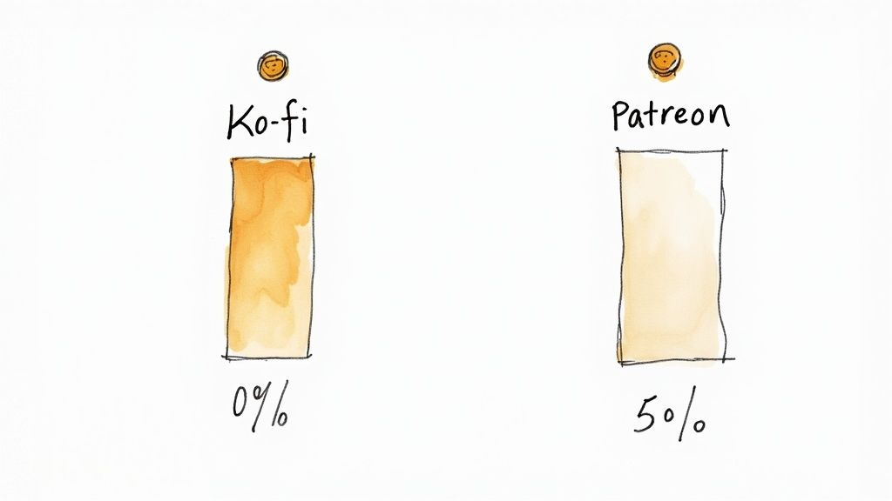
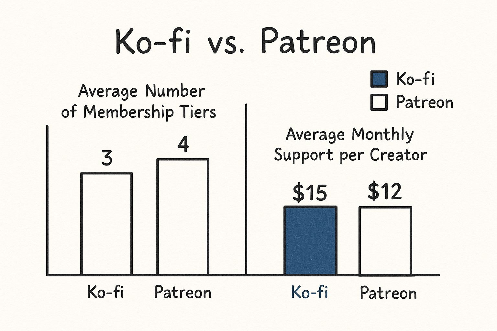
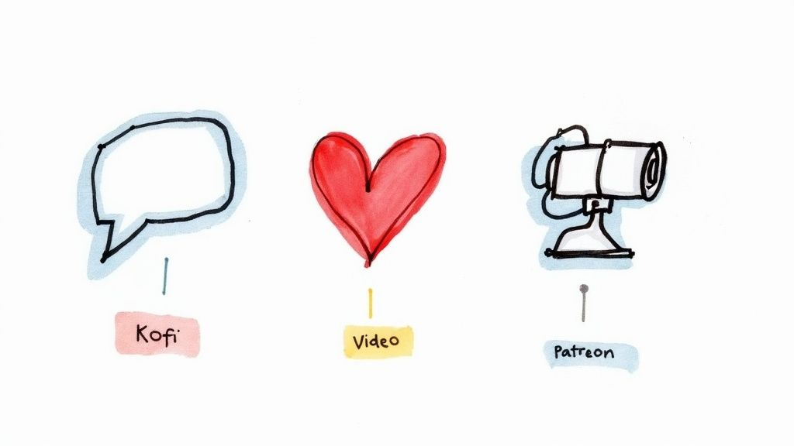

Struggling to pick a side in the Ko-fi vs. Patreon debate? It really boils down to one simple question: are you looking for a digital tip jar or a full-fledged membership business?

**Ko-fi is all about low-pressure, spontaneous support** and simple direct sales. **Patreon, on the other hand, is built from the ground up for structured, recurring revenue** and deep community building.

## Choosing Your Creator Monetization Platform

When you put Ko-fi and Patreon head-to-head, you realize they were built with fundamentally different philosophies. This isn't just about features; it's about the kind of relationship they help you build with your audience and the type of business you want to run. One isn't necessarily "better"—they just serve completely different goals.

To get your head in the right space, ask yourself a few questions:

* **How often do you create?** Are you on a strict, consistent schedule, or do you work more sporadically when inspiration hits?
* **What are your income goals?** Do you need predictable monthly income to pay the bills, or are you just looking for a simple way for fans to show their appreciation?
* **What's your community vibe?** Are you trying to build an exclusive, highly-engaged community, or just offer a straightforward way for anyone to support you?

### Ko-fi vs Patreon At a Glance

Before we get into the nitty-gritty, let's start with a high-level look at how these two platforms stack up. Think of this table as a quick gut check to see which one feels more aligned with what you're trying to do.

| Feature           | Ko-fi                                                                   | Patreon                                                        |
| ----------------- | ----------------------------------------------------------------------- | -------------------------------------------------------------- |
| **Primary Model** | One-off "tips," commissions, shop sales, and simple memberships         | Tiered, recurring monthly memberships                          |
| **Platform Fees** | **0%** on donations; **5%** on memberships/shop (or 0% with Gold plan)  | **5% to 12%** based on your chosen plan, plus commerce fees    |
| **Ideal Creator** | Artists, writers, and hobbyists seeking casual support and direct sales | Podcasters, YouTubers, and creators needing predictable income |
| **Payouts**       | Instant payouts directly to your PayPal or Stripe account               | Monthly payouts after funds clear (with minimum balance)       |

This table gives you a clear snapshot, but the real decision lies in the details we'll explore next.

You can see Ko-fi's "buy me a coffee" spirit right on its homepage. The interface immediately funnels you toward donations, memberships, and commissions, making it clear that it's a flexible, multi-purpose tool for creators.

While both platforms are established giants, it's worth noting that some creators are exploring alternative models. Newer, open-source platforms like [Patron Inc.](https://www.patron.com/) are starting to emerge, catering to creators who want more control and different economic structures.

To really get the right fit in the Ko-fi vs. Patreon debate, you have to look past the feature lists and dig into the mission behind each platform. Their tools, fees, and the entire creator experience are just reflections of their core ideas.

One platform grew from a simple gesture of appreciation, while the other was engineered from the ground up for structured, sustainable income. This fundamental difference is the single most important factor in your decision. It shapes how you'll connect with your audience, the kind of work you're encouraged to create, and ultimately, the financial relationship you'll build with your supporters.

### Ko-fi: The Digital Tip Jar, Evolved

[Ko-fi](https://ko-fi.com/)'s entire origin is right there in the name. It’s inspired by the simple, friendly act of "buying someone a coffee" to say thanks. It began as a digital tip jar, a dead-simple way for an audience to show a little love without the pressure of a monthly commitment. That philosophy of casual, no-strings-attached support is still its beating heart.

This "tip jar" DNA defines its entire model. Payments are often instant, setup is a breeze, and the platform never forces you into a rigid content schedule. It’s all built on the idea that support can be spontaneous and flexible.

Sure, Ko-fi has since added memberships, commissions, and a digital shop, but these features still have that original simplicity. They’re built *on top* of the core tipping function, not as a replacement. This makes it a great spot for creators who want a few different ways to earn, without being shoehorned into a single strategy.

> **Key Insight:** Ko-fi's philosophy is about giving creators flexibility. It trusts you to know what your audience wants—whether that’s a one-off tip, a quick commission, or a simple membership—and gives you the tools without forcing a specific business model on you.

### Patreon: The Membership Engine

[Patreon](https://www.patreon.com/) was built to solve a completely different problem: the feast-or-famine cycle for creators who produce work on a regular schedule. Its mission is to help you build a predictable, recurring revenue stream through a dedicated membership model. It’s less of a tip jar and more of a full-blown toolkit for running a subscription business.

You can see this focus in its entire structure. The platform revolves around **membership tiers**, exclusive content delivery, and robust community management tools. Features like detailed analytics, deep Discord integration, and creator-led workshops are all there to help you grow a paying community and keep them engaged. If you want to go deeper, you can [explore more about Patreon's philosophy](https://www.patron.com/blog/category/about/) and its role in the creator economy.

Everything on Patreon is designed to build long-term relationships between you and your most dedicated fans—your "patrons." It inherently encourages a consistent stream of valuable content to make that monthly subscription feel worth it, which is why it’s a natural home for podcasters, YouTubers, and webcomic artists with established production calendars. The whole experience is fine-tuned to convert followers into paying members who stick around for the long haul.

## Breaking Down the Fees and Payout Structures

Let's talk about the money. When you're picking a platform, the fees and how you get paid are huge factors. You need to look past the flashy marketing slogans and figure out how each platform's fee structure actually impacts your bank account. This is about building something sustainable, and every percentage point counts.

[Ko-fi](https://ko-fi.com/)’s big draw has always been its simple, creator-first fee model. They famously take **0% platform fees** on one-off donations. That means when someone buys you a "coffee," the money goes straight to you, minus the standard PayPal or Stripe processing fees. It makes Ko-fi an absolute no-brainer for creators who get a lot of spontaneous tips from their audience.

But what about recurring support? For things like memberships or selling products through the Ko-fi Shop, the platform takes a **5% platform fee**. This is where the **Ko-fi Gold** subscription changes the game. For a flat fee of about **$6 a month**, that 5% platform fee completely disappears. If you’re generating consistent income from members or sales, upgrading to Gold is almost always a financially smart move.

### Patreon's Tiered Commission Model

[Patreon](https://www.patreon.com/) plays an entirely different game. Their model is built on tiered commissions, meaning they take a percentage of your total monthly earnings. This is one of the most significant financial differences between the two platforms.

Patreon’s Pro plan takes **8% of your monthly income**, while the Premium plan takes **12%**. If you're using their Commerce tools to sell digital products, that's a **5% fee** on those sales. These percentages are on top of the usual payment processing fees. You can find a detailed breakdown of their fee structures on their site.

This tiered system means your platform costs scale right alongside your income. The higher tiers unlock more powerful features for managing your community and digging into analytics, but they also take a bigger slice of the pie.

This data highlights an interesting trend: while Patreon creators often set up more membership tiers, Ko-fi creators tend to see a slightly higher average monthly support per patron. It reinforces Ko-fi's strength as a platform for direct, high-impact financial contributions.

### Let’s Run the Numbers: A Practical Comparison

To really see the difference, let’s compare two income scenarios. We'll use a standard payment processing fee of roughly **2.9% + $0.30** per transaction for our math, though this can vary.

Imagine you earn **$500 a month** from 50 supporters, each paying $10.

* **On Ko-fi (with Gold):** You pay the **$6** Gold fee. After processing fees (around $29.50), your take-home pay is roughly **$464.50**.
* **On Patreon (Pro Plan):** You pay an **8%** platform fee (**$40**) plus processing fees (around $29.50). Your take-home pay is about **$430.50**.

Now, let's see what happens when you scale up to **$2,000 a month** from 100 supporters paying $20 each.

* **On Ko-fi (with Gold):** Your **$6** flat fee doesn't change. After processing fees (around $88), you net approximately **$1,906**.
* **On Patreon (Pro Plan):** The **8%** fee is now **$160**. After processing fees (around $88), your net is about **$1,752**.

> **Key Takeaway:** If your main goal is to maximize your take-home pay from direct support, Ko-fi Gold is often the more profitable option, especially as your income grows. A flat fee becomes incredibly powerful compared to a percentage-based cut at higher earning levels.

This financial tipping point is crucial. Patreon justifies its higher fees with a more robust suite of tools for community management, analytics, and integrations. The decision isn't just about finding the lowest fee—it's about deciding if the value you get from Patreon's features is worth the commission. If you don't need those heavy-duty tools, Ko-fi's model simply leaves more money in your pocket.

## Comparing Content Tools and User Experience

How a platform *feels* during your day-to-day creative work is just as important as how much it costs. The right user experience makes creating feel effortless, while a clunky one just adds friction. This is where the core philosophies of [Ko-fi](https://ko-fi.com/) and [Patreon](https://www.patreon.com/) really diverge.

Patreon is built for structure and consistency. Its entire interface revolves around a post-based feed, much like a private blog or a locked-down social media profile. You publish posts—text, images, videos, polls—and then lock them behind specific membership tiers. This system is perfect for creators on a predictable schedule, like weekly podcasters or monthly comic artists who need a reliable way to deliver exclusive content.

The platform gives you some seriously sophisticated tools for managing these tiers, letting you fine-tune rewards and access levels with real precision. You also get built-in community features like direct messaging and polls, which are great for creating a sense of exclusivity and direct connection with your top supporters.

Here’s a peek at Patreon’s creator dashboard, which immediately highlights its focus on structured posts and community management.

Everything from the layout directs you to create posts, manage your tiers, and check on patron activity. It’s a membership management machine, through and through.

### Ko-fi's All-in-One Creative Hub

Ko-fi, on the other hand, feels more like a versatile, all-in-one hub. Its dashboard isn't just a content feed; it's a multi-tool that rolls several different ways to make money into one clean interface. You can handle one-off donations, membership tiers, a digital shop, and even art commissions, all from the same spot.

This flexibility makes Ko-fi feel less like a rigid content delivery system and more like a creator’s personal storefront. The whole experience is designed for simplicity and speed. You can get a page up and running and start accepting support in just a few minutes.

> **Key Differentiator:** Patreon's user experience is built for **managing a subscription business**. Ko-fi's user experience is designed for **offering multiple ways to get paid** with as little friction as possible.

This difference in focus is a big deal. While Patreon doubles down on its robust subscription system to help you build recurring revenue, Ko-fi prides itself on simplicity. This makes it incredibly appealing to hobbyists or anyone just dipping their toes into monetization.

### Your Supporter's Journey

Think about it from your audience's perspective, too. On Patreon, the journey is all about becoming a "patron" by signing up for a monthly tier. The entire process is designed to guide them toward a recurring subscription, making it a powerful tool for building predictable income.

On Ko-fi, the journey is more casual and varied. A visitor can leave a one-time tip, buy something from your shop, or join a membership—all without feeling pressured into a long-term commitment. This can be a much more welcoming entry point for fans who are hesitant to sign up for *yet another* monthly subscription.

Let's get practical and break down the differences in their toolsets:

* **Content Formatting:** Patreon offers richer text formatting options inside its posts, making it a better choice for long-form content like articles or detailed tutorials. Ko-fi’s editor is simpler, built for speed over fancy formatting.
* **Tier Management:** Patreon’s tools for managing membership tiers are more granular. You have detailed control over benefits and access. Ko-fi keeps it straightforward with an easier-to-manage system.
* **Direct Sales:** Ko-fi’s integrated Shop is a core feature, making it dead simple to sell digital or physical products. Patreon's Commerce tools are a newer, separate feature with its own fee structure.

Ultimately, the choice comes down to your workflow. If your creative business is built around a steady stream of exclusive content for a dedicated community, Patreon's structured experience is the clear winner. But if you'd rather have a flexible, multi-faceted hub that combines tips, sales, and simple memberships, Ko-fi’s friendly and straightforward approach is probably the better fit.

## Building Your Creator Ecosystem with Integrations

Your monetization platform doesn't live on an island. It has to talk to the other tools you use every day—your community platform, your marketing software, your analytics. This is where integrations make or break your workflow, and it’s a critical factor when choosing between **Ko-fi** and **Patreon**.

Patreon was built from the ground up to be the central hub of a creator's business. It’s designed to connect outward, creating a powerful, automated ecosystem for creators who are serious about managing a large community.

Take its deep integration with Discord. It's a game-changer. You can automatically grant server roles based on a member's subscription tier. That's it. You set it up once, and the system handles the rest, saving you countless hours of manual admin work.

### Patreon: The Automation Powerhouse

Patreon’s real strength is its massive list of official integrations. It’s built to plug directly into sophisticated workflows, making it the clear choice for creators ready to scale their operation.

The platform connects with key services like Zapier, Vimeo, Crowdcast, Streamlabs, Google Analytics, MailChimp, Discord, and WordPress. Ko-fi, on the other hand, supports essentials like Twitter, Google Analytics, Discord, and WordPress, but its network is noticeably smaller. It covers the basics, but Patreon goes much further.

> **Key Insight:** Patreon's integrations are all about automation and business intelligence. Tools like Zapier and Mailchimp let you build complex marketing funnels, while Google Analytics allows you to track supporter behavior in detail. It helps you treat your creative work like a real business.

This robust connectivity makes Patreon the obvious pick for creators juggling a multi-platform strategy. If your workflow involves email marketing, private forums, and deep analytics, Patreon has the bridges already built to make it all work together. For those looking to build even more custom solutions, our blog offers additional [technical resources for creators](https://www.patron.com/blog/category/technical/) to help you get the most out of your toolset.

### Ko-fi: A Simpler, More Direct Approach

Ko-fi’s philosophy on integrations mirrors its overall vibe: keep it simple and direct. It doesn't try to be the sprawling command center that Patreon is. Instead, it focuses on a few essential connections to help you promote your page and get paid.

Ko-fi’s integrations are mostly centered on two things:

1. **Social Sharing:** It makes it dead simple to share your Ko-fi page or embed a donation button on places like Twitter, Tumblr, and Facebook. The goal is pure, frictionless traffic.
2. **Payment Processing:** Its tight links to PayPal and Stripe ensure payments are fast and direct, reinforcing that "digital tip jar" feeling.

While Ko-fi also has a Discord integration, its ecosystem just isn't as broad. It lacks official connections to the marketing automation and analytics tools that are standard on Patreon. This isn’t a flaw; it's a design choice. Ko-fi wants to get you up and running quickly, not bog you down with a complex, interconnected system. For creators with simpler needs, this is actually a huge plus.

## Which Platform Is Right for Your Creative Business

<iframe width="1228" height="691" src="https://www.youtube.com/embed/cMzulLA1_Hw" title="Patreon Tutorial 2025: How To Use Patreon For Beginners" frameborder="0" allow="accelerometer; autoplay; clipboard-write; encrypted-media; gyroscope; picture-in-picture; web-share" referrerpolicy="strict-origin-when-cross-origin" allowfullscreen></iframe>

Trying to decide between [Ko-fi](https://ko-fi.com/) and [Patreon](https://www.patreon.com/) isn't about finding the single "best" platform. It’s about finding the right tool for the job you need it to do. A feature that feels liberating for one creator can feel like a burden to another. The right choice comes from looking past the feature lists and really thinking about your specific workflow and the kind of relationship you want with your audience.

To settle the **Ko-fi vs Patreon** debate for *your* business, let's walk through a few practical scenarios. We’ll look at common creator archetypes to see which platform aligns best, helping you figure out where you fit in.

### For the Casual Creator and Hobbyist Artist

Imagine you're an artist who posts new work whenever inspiration hits. Maybe you’re a writer who drops short stories sporadically. You don't have a rigid schedule, and the thought of promising monthly deliverables sounds more like a chore than a career. Your main goal is a simple, no-pressure way for your audience to say "thanks" when they really love something you made.

For this creator, **Ko-fi is the obvious winner**. Its entire philosophy is built around this exact need.

* **No Pressure:** Supporters can leave a one-off tip without committing to a monthly subscription. It's a spontaneous thank you.
* **Simple Commerce:** You can easily add a small shop to sell a few digital prints or take on the occasional commission without getting bogged down in a complex membership system.
* **Instant Money:** The funds go straight to your PayPal or Stripe account. For someone not relying on a steady creative income, seeing that money arrive immediately is incredibly motivating.

> Ko-fi shines for creators whose work is driven by passion, not a production calendar. It captures those moments of audience appreciation without demanding the consistency that a full-blown subscription model requires.

Patreon, with its focus on monthly tiers and exclusive content, would just create unnecessary stress here. Ko-fi gives the hobbyist an effective way to earn a little from their craft without turning it into a demanding job.

### For the Consistent Content Publisher

Now, picture yourself as a weekly podcaster, a YouTuber with a set upload schedule, or a webcomic artist who releases a new page every single Friday. Your entire business is built on delivering consistent value to a dedicated audience. Your main financial goal is to generate predictable, recurring revenue that can cover your costs, let you invest in better gear, and eventually, pay your bills.

In this case, **Patreon is purpose-built for you**. Its entire system is engineered for this model.

* **Structured Memberships:** The tiered system is designed to turn casual followers into committed patrons, giving them a reason to subscribe monthly for exclusive content or early access.
* **Community Tools:** Features like member-only posts, community polls, and deep [Discord](https://discord.com/) integration are all there to help you build a loyal, paying community.
* **Predictable Income:** Knowing what’s coming in each month provides a stable financial foundation. This allows you to actually budget and plan for the future of your business.

For this kind of creator, Ko-fi's model is probably too simple. While it does offer a membership feature, it just doesn't have the robust community management and content delivery tools that make Patreon a true engine for a subscription business.

### The Hybrid Model: A Strategic Approach

So what if you fall somewhere in the middle? Maybe you’re a consistent creator who *also* wants to sell one-off digital products or offer commissions on the side. The good news is, you don’t have to pick just one. A growing number of creators are using a hybrid approach that plays to the strengths of both platforms.

Here’s what that might look like:

1. **Patreon for Recurring Support:** This is the exclusive club for your most dedicated fans. It’s where you post your core members-only content and focus on building that tight-knit community.
2. **Ko-fi for Direct Sales and Tips:** Your Ko-fi page becomes your public storefront and digital tip jar. You can link to it from social media, making it easy for casual supporters to leave a quick tip or buy a digital product without having to sign up for a subscription.

This strategy lets you capture two very different kinds of support: committed monthly patronage and spontaneous, one-time purchases. It gives your audience multiple ways to support you in a way that feels right for them, which can ultimately maximize your income without overcomplicating your main membership offering.

## Ko-fi vs. Patreon: Answering Your Lingering Questions

Alright, even after breaking down the features, some practical questions always pop up. Let's tackle the common "what ifs" that creators run into when choosing between [Ko-fi](https://ko-fi.com/) and [Patreon](https://www.patreon.com/). Think of this as the final check to make sure the platform you pick really fits how you work and what you want to achieve.

### Can I Use Both Ko-fi and Patreon at the Same Time?

Yes, absolutely. In fact, many creators do this, and it can be a really smart move. Using both lets you cater to different parts of your audience—the die-hard fans and the casual supporters—without making them choose a single way to back you. It's about getting the best of both worlds.

Here’s a common and effective setup:

* **Patreon for the core community:** This is where you build your recurring membership. It's for your most dedicated fans who want exclusive content, a sense of community, and a predictable way to support you every month.
* **Ko-fi for everything else:** Think of it as your digital tip jar for one-off thank yous. It’s also a super simple storefront for selling digital products or taking on commissions without the commitment of a monthly pledge.

The trick to making this work is being crystal clear. Tell your audience *why* you're on both platforms and what to expect from each. No one should be confused about the best way to support you. This clarity helps you capture support from all corners of your audience.

### Which Platform Is Better for Selling Digital Products?

Both platforms let you sell digital goods, but they handle it very differently, especially when it comes to fees. If your main goal is straightforward digital sales, **Ko-fi almost always wins on cost.**

On a free Ko-fi account, they take a **5%** cut from your shop sales. But if you upgrade to Ko-fi Gold for about **$6 a month**, that platform fee drops to **zero**. You're only left with the standard payment processor fees, making it incredibly profitable for selling things like e-books, brush packs, or project files.

Patreon’s Commerce feature is built to live inside its membership world. It lets you sell to your patrons and the public, but they charge a flat **5% platform fee** on every sale, on top of payment processing fees. It's integrated, but it's not the cheapest option.

> **Here's the bottom line:** If you just want a simple, low-cost shop to sell products directly, Ko-fi is more direct and profitable. If you see digital products as an extension of your membership—another perk for your community—Patreon's tools will feel more connected to what you're already doing.

### Is It Easier to Get Discovered on Ko-fi or Patreon?

Let's be blunt: neither of these platforms is a discovery engine. This is a common misconception. Unlike YouTube, TikTok, or Instagram, you can't rely on Ko-fi or Patreon to bring you a new audience. Success on either one comes down to *your* ability to bring your existing audience over.

Sure, they both have some kind of "explore" page or search function, but for most creators, the traffic from these features is a rounding error. You are the marketing department. It's on you to promote your page on social media, in your newsletter, or wherever your audience lives.

**Don't pick one platform over the other hoping people will find you there.** The real decision should be based on the features, fees, and workflow that best suit your creative business.
