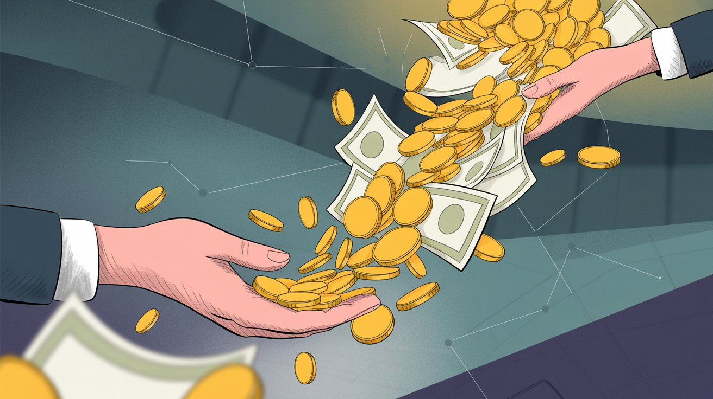
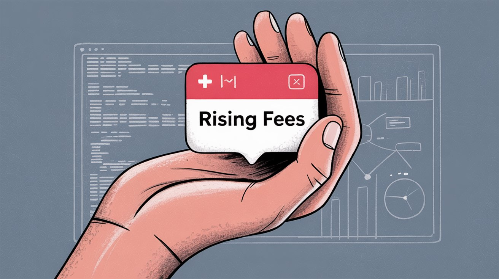
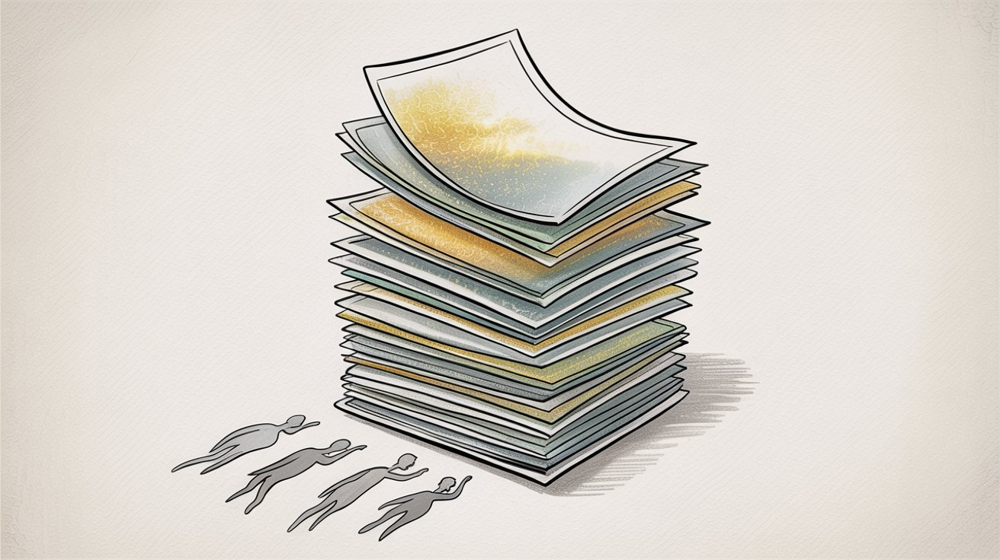
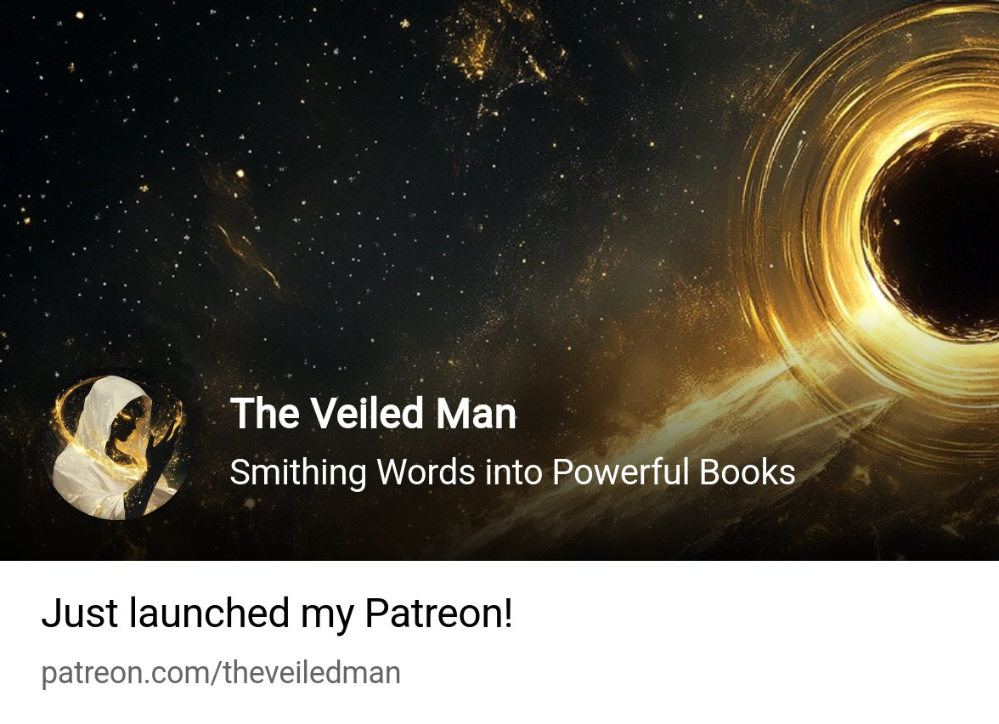
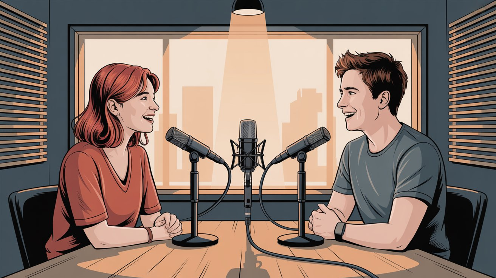
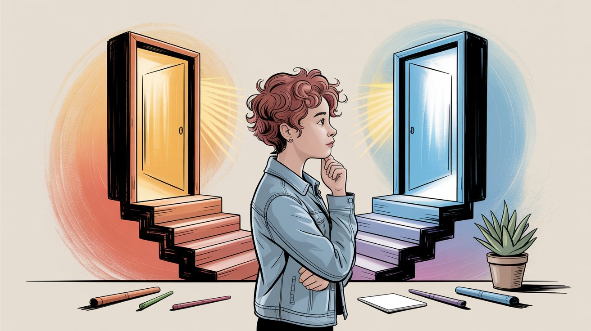

In 2025, Patreon made a move that sent ripples through the creator community: they raised their platform fee to 10% for all new creator accounts. If you're building (or thinking of building) a membership business around your art, writing, podcasts, or any creative work, this change directly affects how much money you'll actually keep from your supporters' contributions.

This isn't just another "platform update" to scroll past. We're talking about a fee structure that could mean the difference between paying your rent and falling short. For some creators, it's an extra $90 out of every $1,000 earned. For others making six figures monthly, it's thousands of dollars that could fund better equipment, hire help, or simply be profit.

In this guide, we'll break down exactly what changed, why Patreon did it, how it affects your bottom line with real creator examples, and what alternatives exist that let you keep more of what your fans give you. By the end, you'll understand the full picture and know how to make the smartest choice for your creative business.

## What Changed with Patreon Fees in 2025?

On June 16, 2025, [Patreon](https://www.patreon.com/posts/were-increasing-130695366) dropped an announcement that caught many aspiring creators off guard: starting August 5, 2025, any creator who launches a new page would be placed on a "standard" plan where Patreon takes **10% of all earnings**. That's double what many early creators pay, and significantly more than the 8% rate that had been standard for years.

Here's the critical detail: **existing creators keep their old rates**. If you launched your page before the August cutoff, you're grandfathered into whatever plan you had (whether that's 5%, 8%, or 12%). Patreon even [encouraged creators to launch before August 4](https://www.patreon.com/posts/were-increasing-130695366) to lock in the cheaper rates. But if you're starting fresh now, you're looking at 10% right out of the gate.

Why does this matter so much? Patreon has become a cornerstone of the creator economy. As of 2025, Patreon boasts [**over 25 million paid memberships and has paid out more than $10 billion to creators**](https://www.axios.com/2025/08/05/patreon-10-billion-creator-economy-ai). When Patreon changes its fee structure, it has real financial implications for potentially millions of creator-supporter relationships.

For new creators, the question becomes: is 10% worth it? And are there better options? First, you need to understand what you're paying for and how this compares to what came before.

## Patreon Pricing Before vs After 2025: What's the Difference?

Patreon pricing wasn't always this simple (or this high). The fee structure has evolved over the years, and understanding that history helps contextualize where we are now.

### The Legacy Tiers

When Patreon first launched, it charged creators just **5% of their earnings**. This "founder's rate" was the original deal, and some creators from those early days (pre-2019) [still enjoy that rate today](https://www.tubefilter.com/2025/06/18/patreon-taking-larger-cut-new-users-earnings-10-percent/). Patreon later offered a "Lite" plan at 5% with minimal features, but that was [discontinued in 2023](https://www.theverge.com/news/687570/patreon-standard-price-plan-increase-10-dollars).

In 2019, two new tiers emerged:

**Pro Plan (8%)** became the default for most creators from 2019 through mid-2025. For 8% of your earnings, you got the core membership features: subscription billing, paywalled posts, analytics, community tools, and more. This was the sweet spot for years.

**Premium Plan (12%)** was the high-tier option for established creators running serious operations. For 12%, you got everything in Pro plus extras like a dedicated partner manager, premium analytics, and merchandise fulfillment support. It was designed for creators with substantial audiences or teams.

### The New Consolidated Standard

After August 4, 2025, all new creators get funneled into one plan: [**10% platform fee across the board**](https://www.patreon.com/posts/were-increasing-130695366). Patreon essentially merged Pro and Premium into a single offering. Here's what that means:

**Everyone pays 10%** for full access to features (no choosing between tiers).

**Merchandise fulfillment is now an add-on:** If you want Patreon to handle merch for you (previously a Premium feature), it costs an additional 3%, bringing your total to [**13%**](https://www.theverge.com/news/687570/patreon-standard-price-plan-increase-10-dollars).

**All other features are included:** Video hosting, livestreaming, community chat, analytics, digital product sales (everything that used to be spread across Pro and Premium is now standard for the 10% fee).

### What About Legacy Creators?

Here's where it gets interesting for grandfathered creators:

Creators on the old Pro plan (8%) [**keep paying 8%**](https://www.theverge.com/news/687570/patreon-standard-price-plan-increase-10-dollars).

Creators who were on Premium (12%) actually got a slight reduction to **11%**, and they can drop the merch service to fall back to 8% if they want.

Those rare early birds still on the 5% founder's rate? They keep it.

This grandfathering creates a two-tier creator economy on Patreon: veterans paying 5-8%, newcomers paying 10% (or 13% with merch). It's a smart business move by Patreon (avoid angering the existing base while raising revenue from new sign-ups who never knew the lower rates).

So what do you actually get for that 10%? According to Patreon, you get a full-service membership platform: hosted creator page, subscription billing (monthly or annual), content paywalls, communication tools, analytics, digital product sales, and video hosting. It's everything you need to run a membership business without cobbling together multiple tools.

The real question is: does that value justify 10% of your revenue? To answer that, you need to understand why Patreon made this change in the first place.

## Why Did Patreon Raise Fees to 10% in 2025?

The official line is straightforward: Patreon has grown tremendously since 2019, and the 10% fee reflects the expanded value they now provide. In their [June 2025 announcement](https://www.patreon.com/posts/were-increasing-130695366), they emphasized that they hadn't raised platform fees in six years, and in that time they've added a suite of tools that go way beyond simple payment processing.

### What Patreon Says They're Providing

**Video and streaming infrastructure** is now a major feature. Patreon hosts video directly, and creators are using it heavily. In the past year alone, fans watched [**over 80 million hours of hosted video**](https://www.patreon.com/posts/were-increasing-130695366). Livestreaming has become a daily occurrence, with creators going live for exclusive fan sessions. These are capabilities that creators used to need Vimeo, YouTube, or Twitch for (now it's built in).

**Discovery and growth tools** have also expanded. Patreon's "Explore" page and recommendation engine have become significant traffic drivers. The company claims these discovery features generate [**over $200 million per year**](https://www.patreon.com/posts/were-increasing-130695366) for creators by bringing new members through Patreon itself. They've also introduced free membership tiers (non-paying followers), which has grown to [over 100 million free member signups](https://www.axios.com/2025/08/05/patreon-10-billion-creator-economy-ai), creating conversion funnels for creators.

**Community engagement features** like direct chat messaging between creators and fans, community forums, and improved notification systems aim to deepen relationships. [Chat messages between creators and fans increased 63% year-over-year](https://www.tubefilter.com/2025/06/18/patreon-taking-larger-cut-new-users-earnings-10-percent/), indicating more active community building happening on Patreon.

Patreon's argument essentially boils down to: "We used to be a payments platform with a content feed. Now we're an all-in-one creator business hub. That's worth a bigger cut."

### What Patreon Isn't Saying (But We Can Infer)

There's also the business reality angle. Patreon is a venture-backed company that has [raised over $400 million](https://www.axios.com/2025/08/05/patreon-10-billion-creator-economy-ai) and remains privately held. They need to grow revenue to justify that investment and potentially go public someday. Increasing the take rate on new creators (without alienating the existing, revenue-generating base) is textbook SaaS growth strategy.

By grandfathering legacy creators and giving two months' notice (June 16 to August 4), Patreon avoided a PR disaster. Current creators kept their deals. New creators, having never experienced the cheaper rates, are more likely to accept 10% as "just how it is."

Patreon even delayed this increase for years. They could have raised fees in 2020 or 2021 as they added features, but waited until 2025. That restraint probably earned them goodwill (though it doesn't change the math for new creators).

### The Creator's Perspective

From where a creator sits, the calculus is simple: are the new features worth the extra percentage points? If Patreon's video hosting saves you $20/month on Vimeo, but the fee increase costs you $50/month, you're still down $30. If their discovery tools bring you 10 new patrons a month you wouldn't have gotten otherwise, maybe it pays for itself.

The challenge is that value is hard to quantify upfront. What's certain is the cost: 10% of everything you earn on Patreon. So here's exactly what that means in real dollars and cents.

## How Much Do Patreon Fees Really Cost Creators?

When creators talk about "platform fees," it's easy to think that 10% is the only thing coming out of your pocket. Unfortunately, it's more complicated than that. Patreon's cut is just one piece of a larger fee puzzle. To understand your true take-home, you need to account for every fee layer.

### The Fee Stack

Here's every fee layer that comes out of your earnings:

**Platform Fee: 10%**

This is Patreon's slice. On $1,000 in pledges, they take [**$100 right off the top**](https://www.tubefilter.com/2025/06/18/patreon-taking-larger-cut-new-users-earnings-10-percent/). This applies to everything: monthly subscriptions, annual memberships, and even one-time digital product sales. Straightforward and unavoidable for new creators.

**Payment Processing: ~3% + $0.30 per transaction**

Separate from the platform's cut. Payment processors (Stripe, PayPal, etc.) charge approximately [**2.9% plus $0.30 per successful payment**](https://support.patreon.com/hc/en-us/articles/36426991446797-A-standard-platform-fee-for-new-creators-effective-after-August-4-2025) in USD.

Why this matters: on a **$10 pledge**, the processing fee is about **$0.59**. On a **$5 pledge**, it's **$0.45**. The lower the pledge amount, the higher the percentage that processing fees eat. For creators with many small-tier supporters, this adds up fast.

**Currency Conversion: 2.5%**

If you have international patrons paying in different currencies, Patreon charges a [**2.5% conversion fee**](https://support.patreon.com/hc/en-us/articles/36426991446797-A-standard-platform-fee-for-new-creators-effective-after-August-4-2025) on those transactions. If everyone pays in your home currency, you skip this. But many creators have global audiences, so some portion of your revenue will likely hit this fee.

**Payout Fees**

Getting money out of Patreon costs something. [PayPal withdrawal: 1% (capped at $20)](https://support.patreon.com/hc/en-us/articles/36426991446797-A-standard-platform-fee-for-new-creators-effective-after-August-4-2025). [Direct bank deposit in the U.S.: just $0.25](https://support.patreon.com/hc/en-us/articles/36426991446797-A-standard-platform-fee-for-new-creators-effective-after-August-4-2025) (negligible). International creators using Payoneer or other methods have their own fee schedules. Usually minor, but part of the equation.

**VAT/GST on Platform Fees**

Depending on where you live, Patreon may [charge taxes (VAT or GST) on their platform fee](https://support.patreon.com/hc/en-us/articles/36426991446797-A-standard-platform-fee-for-new-creators-effective-after-August-4-2025). This typically doesn't affect U.S. creators, but EU creators might see the 10% fee become effectively higher after tax.

### Putting It All Together: A Real Example

Here's how the numbers actually work out on a typical month:

**Starting point:**

- 100 patrons × $10 each = **$1,000 gross**

**Fee breakdown:**

- Platform's 10% fee: **\-$100** → $900 remaining
- Payment processing (100 pledges × $0.59 each): **\-$59** → $841 remaining
- Payout to your bank (U.S. direct deposit): **\-$0.25** → $840.75 remaining

**Your take-home: $840.75 out of $1,000**

That's about **84% of what your patrons paid**. The rest went to Patreon (10%) and various transaction fees (~6%).

If you had some currency conversions or used PayPal for payout, you'd net even less. The effective total cost of using Patreon is **around 15-16% of your gross revenue** for new creators.

Compare this to creators on the old 5% founder plan: they'd pay $50 to Patreon instead of $100, keeping an extra **$50/month** (**$600/year**). That's meaningful money.

### Why This Matters

The platform fee isn't the only cost, but it's the biggest one you can control. Payment processing fees are somewhat fixed (every platform uses Stripe or similar). But platform fees? Those vary wildly. Some platforms charge 1%, others 10%, and a few charge 0%.

When we talk about "keeping more of your support," we're really talking about minimizing that platform cut. Because at the end of the day, every percentage point is money that could go toward making your creative work sustainable (or go to a platform's bottom line).

Now let's make this even more concrete with real creator examples.

## Real Creator Examples: Fee Impact on Small vs Large Creators

Numbers on a page are one thing. Real creators with real earnings show the true impact of fee changes. Here are two very different creators and what the 10% fee means in practice.

### Creator Spotlight: The Veiled Man (Web Fiction Author)

[The Veiled Man](https://www.patreon.com/theveiledman) is an indie fantasy writer who publishes a serialized novel called "Barbarian Awakening" on platforms like Royal Road. To monetize, he offers early access to chapters via membership subscriptions. As of late 2025, he has about **841 patrons** supporting him at roughly **$1,890 per month**.

For a web fiction author, that's solid income (enough to seriously consider going full-time).

**The fee breakdown at 10%:**

- **Gross earnings**: $1,890/month
- **Platform's 10% cut**: -$189
- **Payment processing** (~3% + fees): -$60 (estimated)
- **Net to creator**: ~$1,640/month

That $189 going to Patreon every month adds up to **$2,268 per year**. For context, if The Veiled Man were on a legacy 8% plan, Patreon would take ~$151/month instead of $189 (a difference of $38/month or about $456/year). If he were on the old 5% founder plan, Patreon's cut would be just $95/month, saving him **$1,128 per year** compared to the new 10% rate.

Now imagine if he used a platform with a **1% fee** (like [Patron](https://www.patron.com/), which we'll discuss shortly). The platform fee would drop to just **$19/month** instead of $189. That's **$170/month saved**, or **$2,040/year**. For a creator earning around $20k annually from fan support, an extra $2,000 could cover:

- A month or two of rent in many cities
- New recording/editing equipment
- Hiring an illustrator for a book cover
- Simply more financial breathing room to invest in the craft

The Veiled Man built his following by publishing consistently (new chapters every few days rather than sporadic dumps). In under two months of launching his story on Royal Road, he hit the top of the Rising Stars list, and that engagement translated into nearly $2k/month in membership support. It's a success story showing how serial content can hook an audience.

But here's the reality: small and mid-tier creators feel fee changes the most. An extra $170/month might not matter to someone making $100k/month. But for someone making $1,890/month, it's nearly 10% of their income (the difference between sustainable and struggling).

### Creator Spotlight: Are You Garbage? (Comedy Podcast)

On the opposite end of the spectrum, **Are You Garbage?** (a wildly popular comedy podcast hosted by H. Foley and Kevin Ryan) has turned membership subscriptions into a revenue machine. As of late 2025, they have around [**14,800 paying patrons and earn roughly $128,000 per month**](https://graphtreon.com/creator/AreYouGarbage). That's over **$1.5 million per year** from fan subscriptions alone.

**The fee breakdown at 10%:**

- **Gross earnings**: $128,000/month
- **Platform's 10% cut**: -$12,800
- **Payment processing** (~3%): -$3,800 (estimated)
- **Net to creators**: ~$111,400/month

Losing about $16,600/month to fees might sound acceptable when you're still keeping $111k. And in relative terms, ~87% take-home isn't terrible.

But zoom out. That **$12,800/month** going to Patreon is **$153,600 per year**. Over five years? **$768,000**.

Now compare to legacy rates:

- If they were on the old 8% plan: Platform's cut = $10,240/month → saves $2,560/month
- If they were on the old 5% plan: Platform's cut = $6,400/month → saves $6,400/month

And if _Are You Garbage?_ used a **1% platform** like [Patron](https://www.patron.com/), the platform fee drops to **$1,280/month** instead of $12,800. That's **$11,520/month saved**, or nearly **$138,000 per year**.

What could a podcast do with an extra $138,000 annually?

- Hire a full-time video editor
- Produce live tour shows in major cities
- Invest in a professional studio
- Or just, you know, keep it as profit

Of course, _Are You Garbage?_ gets tremendous value from Patreon's infrastructure. They offer three membership tiers, exclusive shows like "Hard Feelings," and use Patreon to manage fan Q&As and live show pre-sales. For them, the ecosystem might justify the cost (especially since they likely launched before 2025 and could be on a legacy rate anyway).

But the point stands: **the more you earn, the more the 10% costs you in absolute dollars**. And even if you're "only" losing 10%, that's still money you worked for that's going to a platform instead of your pocket.

### The Takeaway

Whether you're making $1,890/month like The Veiled Man or $128,000/month like _Are You Garbage?_, the 10% fee adds up fast. For smaller creators, it can be the difference between bills paid and bills overdue. For larger creators, it's the cost of an employee's salary or a major equipment upgrade.

Fees matter. And when alternatives exist that charge 1% instead of 10%, that difference isn't trivial (it's transformative).

## What Should Creators Do About the 10% Fee?

So you're staring down a 10% platform fee and wondering: what now? Here's a practical breakdown of what creators need to know and consider moving forward.

### 1\. Know Your Plan (and Protect It)

If you launched your page before August 5, 2025, you should be on a legacy rate (5%, 8%, or 12%). Check your settings to [confirm what plan you're on](https://www.patreon.com/posts/were-increasing-130695366). This is valuable. Treat it like grandfathered status on an old phone plan: **don't lose it accidentally**.

Here's the catch: if you unpublish your page and later republish it, Patreon may [bump you to the new 10% standard plan](https://support.patreon.com/hc/en-us/articles/36426991446797-A-standard-platform-fee-for-new-creators-effective-after-August-4-2025). Same if they ever unpublish your page for policy reasons and you get reinstated. So if you've got that 5% or 8% deal locked in, hang onto it. It's literally money you're keeping that new creators can't get.

If you're launching a new page now, accept that you'll be at 10%. There's no way to negotiate a lower rate as a newcomer (Patreon doesn't offer that option).

### 2\. Adjust Your Pricing and Goals

With a higher fee, you may need to recalculate. If you wanted to net $500/month to cover rent, and you previously planned for an 8% platform fee + ~5% processing, you might have set a goal of $570 in pledges. Now, with 10% + ~5%, you might need closer to $600 in gross pledges to net the same amount.

Run the math for your specific situation. And don't be afraid to adjust tier prices if needed. Fans generally understand that platforms take a cut. Some creators even transparently explain fee structures to their communities when raising prices (authenticity tends to build trust).

Just be thoughtful about price changes for existing patrons. Consider grandfathering them at old prices or clearly communicating the "why" behind the adjustment.

### 3\. Use Platform Features to Justify the Cost

If you're paying 10%, make sure you're actually getting value from it. Are you using:

- **Platform video hosting** (so you don't pay for Vimeo)?
- **Livestreaming** for exclusive fan sessions?
- **Community chats and messaging** to engage supporters?
- **Free member funnels** to convert casual followers to paid supporters?
- **Analytics and insights** to understand your audience?

If these tools help you earn more patrons or save money on third-party services, they can offset the higher fee. But if you're basically just using the platform as a payment processor and posting updates (which you could do via email or Discord), it's worth questioning whether 10% is worth it.

Get your money's worth. Patreon is pitching this as a full-service creator business platform (so use it like one).

### 4\. Watch Patreon's Roadmap

Patreon knows they raised fees, and they're promising continued improvements to justify it. For example, they recently [upped video uploads to 100 hours per month for free](https://www.patreon.com/posts/were-increasing-130695366) (instead of a limited total). They're [expanding discovery features and livestreaming access](https://www.patreon.com/posts/were-increasing-130695366).

Since you're paying more now, stay informed about new features. The more tools Patreon ships that help you grow or engage your community, the more that 10% might feel defensible. If they stagnate? That's a sign to reassess.

### 5\. Evaluate Alternatives (Seriously)

This is the big one. The 10% fee makes exploring other platforms a financially smart move (especially if you're just starting out and haven't built deep roots in the existing ecosystem).

Here are some alternatives worth considering:

**Ko-fi** is a creator "tip jar" platform with a lower fee structure. Ko-fi charges **0% on one-off donations** and **5% on memberships or shop sales**. If you subscribe to their Ko-fi Gold plan ($6/month), they take [**0% on everything**](https://www.patron.com/blog/post/ko-fi-vs-patreon-which-platform-is-best-for-creators). Ko-fi is more bare-bones than Patreon for membership management, but if you only need simple recurring support, the fee savings can be substantial. On a $1,000/month income, Ko-fi's 5% = $50 vs. Patreon's $100 (that's $50/month saved, or $600/year). For a detailed comparison of these platforms, check out our guide on [Ko-fi vs Patreon](https://www.patron.com/blog/post/ko-fi-vs-patreon-which-platform-is-best-for-creators).

**Substack** is ideal if you're a writer or newsletter creator. Substack offers newsletter-based paid subscriptions and also takes [**10%**](https://www.patron.com/blog/post/ko-fi-vs-patreon-which-platform-is-best-for-creators) (matching the new rate) plus Stripe fees (~3%). The value prop is integrated email delivery and a reader network. So it's not cheaper, but it's a different model suited to written content and email newsletters.

**Buy Me a Coffee** is another tipping and membership platform. They charge **0% on donations**, and for memberships, the fee is effectively **5%** on their free plan (or 0% if you pay for a monthly subscription). It's similar to Ko-fi in approach (lighter on features, heavier on savings).

**Self-Hosting / DIY Solutions** are options for tech-savvy creators. Some build their own membership setups using tools like Memberful, Ghost, or custom Stripe integrations. Memberful, for instance, charges **4.9%** on their free tier, or **0%** if you pay $25/month for their Pro plan. The trade-off is you manage more of the tech yourself and don't have a built-in community like Patreon. But if you're losing hundreds or thousands monthly in fees, the investment in a self-hosted solution can pay off fast.

[**Patron**](https://www.patron.com/) **(That's Us!)** is a new, open-source membership platform designed specifically for **sequential content creators** (think webcomic artists, serialized fiction writers, and podcasters who release episodic content). Our headline feature is **rolling paywalls**: you can publish an episode for paying supporters first, then automatically unlock it to free readers on a schedule. This gives early access value to patrons while turning your archive into a discovery funnel.

And here's the fee part: we're charging **just** [**1% for early adopters**](https://www.patron.com/). Not 10%. Not 5%. **One percent**. On that earlier example of $1,000 in monthly pledges, [Patron](https://www.patron.com/)'s cut would be **$10** instead of $100. That's **$90/month saved**, or **$1,080/year**. For creators making $10k/month, it's $900/month saved (enough to hire help or upgrade your entire setup).

Why so low? We're taking a radically different approach. [Patron](https://www.patron.com/) is **open-source** (you can see our code on GitHub), we're staying lean on infrastructure, and we're not taking venture capital. That means no pressure to jack up fees later to satisfy investors. The whole point is to build a sustainable platform that keeps creator costs as close to zero as possible, aside from unavoidable payment processing.

We're in early alpha as of late 2025, but the core platform is live and being actively developed. If the idea of keeping 99% of your fan support (aside from payment processing) sounds appealing, you might want to [check us out](https://www.patron.com/).

### 6\. Communicate Value to Your Patrons

If you stick with Patreon, leverage their features in how you talk to your community. "Join my membership for exclusive videos, livestreams, early access, and community chat!" Highlighting what patrons get beyond just "supporting you" makes the membership feel more valuable.

Some patrons do care about fees (they want to know their money is going to _you_, not a platform). You can always gently mention that direct support methods (like PayPal tips) give you a bigger cut, but for recurring membership, wherever your content and community live is where fans will go.

### Is 10% "Bad"?

That's subjective. Patreon argues they're providing a full-service creator business solution (membership tech, community tools, discovery, even a bit of social network) for that 10%. Many creators will find that valuable enough to pay for.

Others will look at platforms charging 1% and think, "Why am I giving away $90/month when I could give away $10?"

The truth is, industry-wide, platform fees are creeping up. YouTube takes 30% of channel membership revenue. Twitch takes 50% of sub revenue by default (though not directly comparable since those include discovery and live infrastructure). Substack takes 10%. In that context, the 10% isn't outrageous (it's the trend).

But here's the thing: **competition is good**. The move to 10% creates an opening for platforms like [Patron](https://www.patron.com/) to say, "We'll do it for less." As a creator, that competition gives you leverage. If one platform overcharges and under-delivers, take your community elsewhere.

## Patron: The 1% Alternative to Patreon

We've talked about platform fees and some alternatives, but now you need to understand what [Patron](https://www.patron.com/) offers and why it's designed specifically to help creators keep more of their earnings.

### Built for Sequential Creators

[Patron](https://www.patron.com/) isn't trying to be a generic membership platform for everyone. We're laser-focused on **sequential content**: webcomics, serialized fiction, podcasts, YouTube series (anything released in episodes or chapters where fans follow along over time).

Why does this focus matter? Because sequential creators have unique needs that generalist platforms don't fully address:

**Rolling Paywalls** is our flagship feature. Here's how it works: you publish a new episode or chapter and gate it for paying supporters first. After a set time (say, two weeks), it automatically unlocks for free readers. This way, your paying fans get early access (the core value of membership), but your back catalog becomes evergreen discovery content that attracts new readers without cannibalizing paid access. It's a model that works beautifully for webcomics and serial fiction but is clunky to set up on generic platforms.

**Content Organization** at [Patron](https://www.patron.com/) is designed around series and episodes, not just "posts." The navigation and UI help fans follow your story or podcast in order, which is a known weak spot on generalist platforms where content gets buried in feeds.

**Release Scheduling** lets you set time-based access rules per tier and per series, so different supporter levels get access at different times. It's flexible without being complicated.

We're also committed to **core feature parity** with Patreon over time: Discord integration, email systems, community chat, analytics (all the table stakes for running a membership business). We're not cutting corners on functionality just to be cheap.

If you're creating sequential content like [webcomics](https://www.patron.com/blog/post/how-to-monetize-a-webcomic) or serialized stories, our platform is purpose-built for your workflow.

### The 1% Fee Structure

Here's the math that makes [Patron](https://www.patron.com/) compelling:

| Fee Component      | Patron                            | Patreon  |
| ------------------ | --------------------------------- | -------- |
| Platform fee       | [**1%**](https://www.patron.com/) | **10%**  |
| Payment processing | ~3%                               | ~3%      |
| **Total cost**     | **~4%**                           | **~13%** |

**On $1,000/month income:**

| Platform | Total Fees | Your Net | Annual Savings  |
| -------- | ---------- | -------- | --------------- |
| Patreon  | $130       | $870     | N/A             |
| Patron   | $40        | $960     | **$1,080/year** |

**On $10,000/month income:**

| Platform | Total Fees | Your Net | Annual Savings   |
| -------- | ---------- | -------- | ---------------- |
| Patreon  | $1,300     | $8,700   | N/A              |
| Patron   | $400       | $9,600   | **$10,800/year** |

That's real money. For a mid-tier creator, it's a car payment. For a full-time creator, it's hiring an assistant or upgrading to a professional studio. For a hobbyist, it's the difference between breaking even and actually profiting.

### Why We Can Charge So Little

You might be wondering: how can [Patron](https://www.patron.com/) afford to charge 1% when Patreon needs 10%? A few reasons:

**We're open-source.** Our codebase is public on GitHub under an Apache 2.0 license. This means transparency, community contributions, and the ability for tech-savvy creators to self-host if they want. Open-source also builds trust (you can literally see how we build the platform).

**We're staying lean.** We're not trying to build a massive, bloated infrastructure. We're focused on doing a few things really well for a specific audience (sequential creators) rather than being everything to everyone. Lean ops = lower costs = lower fees.

**No VC pressure.** We're not taking venture capital, which means no investors pushing us to maximize revenue and eventually IPO. Venture-backed companies face pressure to grow revenue aggressively, often at creators' expense. We're building [Patron](https://www.patron.com/) to be sustainable on creator success, not investor returns. If we keep fees low and creators thrive, we thrive. It's a different model.

**Our founder's track record.** [Patron](https://www.patron.com/) is built by Nick Khami, who previously co-founded Trieve (a Y Combinator-backed startup) and successfully exited when it was acquired by Mintlify in July 2025. He's proven he can build and ship fast. And he genuinely believes creators are getting a raw deal on fees, so [Patron](https://www.patron.com/) is his answer.

### Current Status: Early Alpha, Actively Shipping

Full transparency: [Patron](https://www.patron.com/) is in **early alpha** as of late 2025. The core platform is live (authentication, content management, file hosting, API, and SDK are all functional), but we're still building out features like payments, community tools, and migration support.

Our [public changelogs](https://www.patron.com/blog/category/changelog) show we're shipping weekly. In recent months we've launched:

- Full web app with login, password reset, and profile management
- Series and posts APIs
- File endpoints and CDN prep
- TypeScript SDK (auto-generated via OpenAPI)
- Comprehensive testing and CI/CD pipelines

What's coming:

- Full payment integration (we'll use Stripe, just like Patreon)
- Discord integration
- Email notification systems
- Creator analytics
- Migration tools to help you bring your audience from other platforms

If you're established on Patreon and making serious money, you might want to wait for [Patron](https://www.patron.com/) to hit full production before switching. But if you're just starting out, or if you're a sequential creator frustrated with Patreon's limitations, [joining our early alpha](https://www.patron.com/) could lock you into that **1% fee for life**.

### Who Should Consider Patron?

[Patron](https://www.patron.com/) is ideal if you:

- Create **sequential content** (webcomics, serial fiction, podcasts, episodic videos)
- Want to use **rolling paywalls** to balance early access for supporters and free discovery content
- Care deeply about **keeping more of your earnings** (1% vs. 10% is a big deal)
- Value **open-source** and transparency
- Are tech-curious or want the option to self-host
- Are starting fresh or willing to bring your community to a new platform

[Patron](https://www.patron.com/) might not be right (yet) if you:

- Need a fully mature platform with every feature Patreon has today (we're getting there, but we're early)
- Rely heavily on built-in audience discovery (we're building discovery, but established platforms have more reach)
- Aren't creating sequential content (we're built for episodes/chapters, less so for one-off posts)

That said, we're building fast. The gap between [Patron](https://www.patron.com/) today and Patreon's feature set is closing quickly. And the fee difference? That's not changing. **1% will stay 1%**.

If you're intrigued, [check out Patron](https://www.patron.com/) or [join our community](https://www.patron.com/blog). We're actively onboarding early creators and would love to have you.

## Bottom Line: How to Keep More of Your Creator Income

For new creators joining Patreon in late 2025 and beyond, the **10% platform fee is the new reality**. It's higher than what many legacy creators pay, but it comes with access to a comprehensive set of tools (video hosting, livestreaming, community features, and discovery).

You need to internalize this: after all fees (platform + processing + payout), you'll likely keep around **80-85%** of what your patrons give you. That's down from the ~90-95% that earlier creators enjoyed. The gap matters. It could be the difference between sustainable and struggling, between hiring help and doing it all yourself.

### If You're on a Legacy Plan

If you locked in a 5% or 8% rate before August 2025, congratulations (you have a competitive advantage). Patreon isn't forcing you to the 10% rate, so cherish that grandfathered status. Be careful not to accidentally lose it (unpublishing, policy violations, etc.). And if you're thinking about expanding your offerings or going all-in on Patreon, now's a good time to do it while your fee is low.

### If You're Starting Fresh

Accept that you're looking at 10% on Patreon. Run the numbers for your specific situation and decide if Patreon's value justifies the cost. Make sure you're actually using the features you're paying for. And (critically) **educate yourself about alternatives**.

Platforms like [Patron](https://www.patron.com/) offer the same core functionality for a fraction of the fee. **1% vs. 10%** isn't a small difference; it's transformative. On a $1,000/month income, that's $90/month ($1,080/year) you keep instead of giving to the platform. Scale that to $5k, $10k, $50k/month, and the savings become life-changing.

### The Bigger Picture

The 2025 fee change is part of a larger trend: creator platforms are monetizing more aggressively. YouTube takes 30%. Twitch takes 50%. Substack takes 10%. In that context, the move isn't shocking (it's aligning with the industry).

But here's the silver lining: **competition exists, and it's growing**. Patreon charging 10% creates an opening for platforms like [Patron](https://www.patron.com/) to offer a better deal. As a creator, this competition is your leverage. If one platform overcharges or under-delivers, you can vote with your feet (and your community).

### Every Percentage Point Matters

At the end of the day, every percentage point in fees is money out of your pocket (money that could go toward better equipment, hiring help, or simply making your creative work sustainable). Fans support _you_, not platforms. They want their money to reach you.

So stay informed. Run the numbers. Understand what you're paying for and whether you're getting value. And don't be afraid to explore alternatives if it means keeping more of what your supporters give you.

The 2025 changes are a wake-up call: the landscape shifts, platforms change terms, and creators need to stay sharp. Whether you stick with Patreon or explore options like [Patron](https://www.patron.com/), make the choice that best serves your creative business.

Here's to keeping more of your hard-earned support and building a sustainable creative career on your terms.

**Ready to explore the 1% alternative?** [Check out Patron](https://www.patron.com/) and see how much you could save.
