If you're typing "Royal Road author monetization guide" into a search bar, you're not looking for creative inspiration. You're trying to answer a specific question: **"How do I turn my Royal Road story into actual income without killing my growth?"**

This guide is built from what top Royal Road authors _actually_ do in 2025. We've analyzed [public earnings data from Graphtreon](https://graphtreon.com/top-patreon-earners/writing), [Royal Road's own guides](https://www.royalroad.com/support/knowledgebase/105), founder-level thinking about conversion funnels, and real-world tier structures from the highest-earning serial fiction writers.

## What Does Monetizing a Royal Road Story Actually Mean?

Royal Road isn't a monetization platform. It's a discovery and binge-reading machine for [web serials](https://www.patron.com/blog/category/writing/), LitRPG, and progression fantasy.

Monetizing a Royal Road story really means building a two-platform system. Platform 1 is Royal Road, your free front end where you get as many people as possible reading and hooked on your story—this is your discovery funnel. Platform 2 is your membership backend with paid access, where you send your most engaged readers to early-access memberships through [platforms built for sequential content creators](https://www.patron.com/).

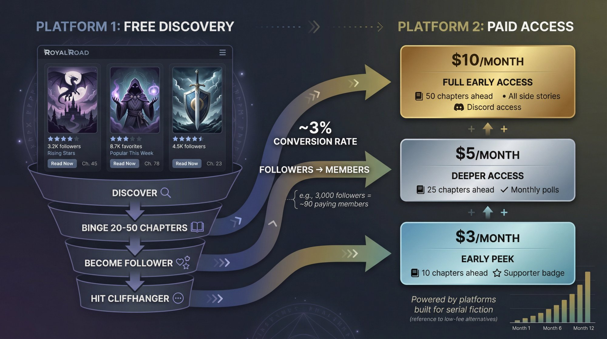

The real job isn't just "add a donation link." It's designing a system where free readers discover you, binge your story, and fall in love with it. Then a slice of those readers converts into paying members for early access. And your schedule is sustainable enough that the system doesn't eat you alive.

If you hold onto that mental model, every tactic in this guide will make more sense.

---

## How Rolling Paywalls Work for Serial Fiction

Here's how [rolling paywalls](https://www.patron.com/blog/post/what-is-a-rolling-paywall/) work and why they matter for Royal Road authors: You release new chapters to paying subscribers first, then those same chapters automatically become free after a set time (usually **1-4 weeks**).

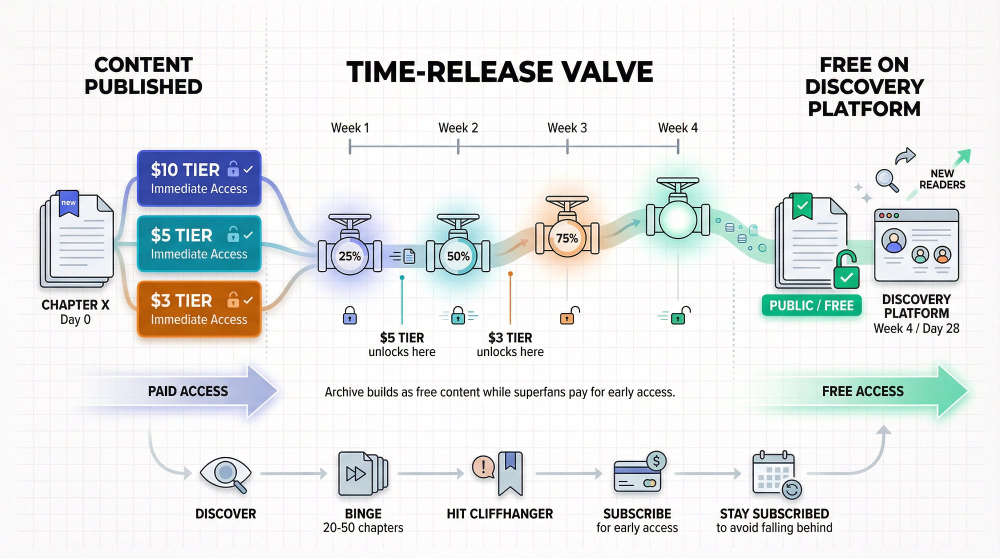

This model is powerful because your archive builds up as free content that attracts new readers through Royal Road's discovery systems while your most engaged fans subscribe to read early. It's the difference between locking content behind a permanent paywall and creating a time-release valve that serves both discovery and revenue.

The conversion psychology works like this: readers discover your story on Royal Road, binge 20-50 free chapters, hit a cliffhanger or run out of episodes, subscribe to get more immediately, and stay subscribed to avoid falling weeks behind the current arc. This two-platform strategy is how most successful webtoon and serial fiction creators make money in 2025.

Rolling paywalls let you monetize early access while building discoverability. It's the difference between a paywall and a time-release valve.

[Patron](https://www.patron.com/) is built specifically for this rolling paywall model, with [series-first organization](https://www.patron.com/blog/category/about/) and release scheduling designed for sequential content creators.

---

## How Much Do Top Royal Road Authors Actually Make?

Before we get into tactics, let's look at what the top end _actually_ looks like.

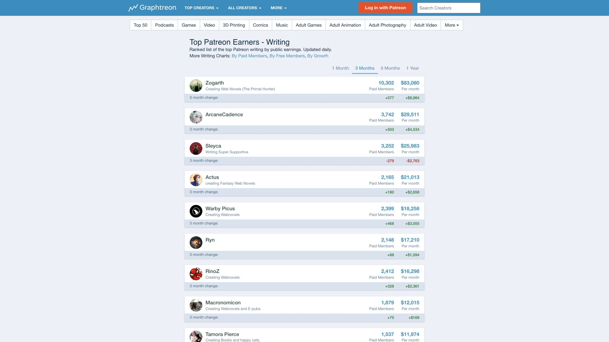

### Case 1: Zogarth (The Primal Hunter)

| Metric                   | Details                                                                                                      |
| ------------------------ | ------------------------------------------------------------------------------------------------------------ |
| **Story Launch**         | September 2020 on Royal Road                                                                                 |
| **Membership Launch**    | Two months after story launch                                                                                |
| **First Month Earnings** | Approximately [$5,000 from around 3,200 members](https://www.elysian.press/p/zogarth)                        |
| **Mid-2021 Earnings**    | Around [$20,000/month](https://www.elysian.press/p/zogarth) (went full-time)                                 |
| **Late 2025 Earnings**   | [Roughly **$83,080/month** with **10,302 paid members**](https://graphtreon.com/top-patreon-earners/writing) |

From [recent chapter notes on Royal Road](https://www.royalroad.com/fiction/36049/the-primal-hunter/chapter/2795110/chapter-1210-the-calm-before-the-lesson), his current tier structure is $3 for 10 chapters ahead, $5 for 25 chapters ahead, and $10 for 50 chapters ahead plus all side stories. This is pure early-access gating—no fancy perks, no merch bundles, no "Discord roles with cool colors." Just clean, value-dense chapter access.

### Case 2: TheFirstDefier (Defiance of the Fall)

TheFirstDefier wrote what's arguably the most influential Royal Road business guide: ["Running your story like the business it is"](https://www.royalroad.com/forums/thread/116847). It's explicitly aimed at authors who want to turn their serial into a paying career.

His strategic advice: treat memberships as a transactional product. People pay to read ahead. A couple of token early-access chapters does almost nothing.

His rule of thumb for member conversion is that members equal approximately 3% of your Royal Road followers. So 3,000 followers might yield around 90 paying members. ([Source](https://www.royalroad.com/forums/thread/116847))

His income estimation formula is: Membership income ≈ K × [price of your highest early-access tier] × [member count], where K is a coefficient usually around 0.7–1.0. TheFirstDefier suggests 0.8 as a decent default.

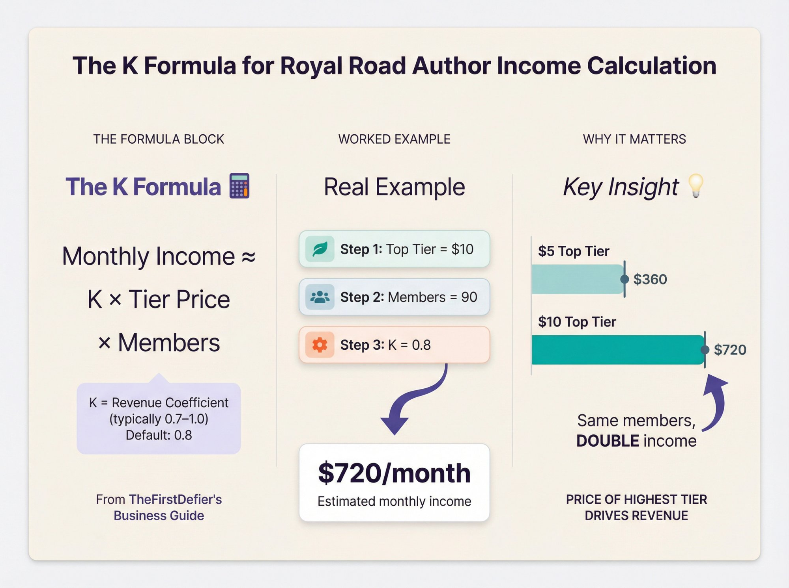

Why $10 is the magic price: if you put full early access at $5, your average revenue per member caps around that number. If you move full early access to $10, your average revenue per member moves with it. Putting full early access at $5 often halves your income versus $10, because most serious readers cluster at the "best value" tier. This isn't theory—this describes actual behavior of thousands of paying readers. This pattern holds across stories like _The Primal Hunter_, _Defiance of the Fall_, _He Who Fights With Monsters_, and others.

### Case 3: ArcaneCadence (New Life As A Max Level Archmage)

Not every success story takes years. Here's a 2025 breakout example:

| Metric                 | Details                                                                                                                                 |
| ---------------------- | --------------------------------------------------------------------------------------------------------------------------------------- |
| **Account Created**    | May 2025                                                                                                                                |
| **Growth (6 months)**  | [Over **24,000 followers** and **7,000+ favorites**](https://www.royalroad.com/profile/729989)                                          |
| **Monetization Setup** | Membership links from [chapter 1](https://www.royalroad.com/fiction/118891/new-life-as-a-max-level-archmage/chapter/2324263/1-vivisari) |

This is a 2025-era example of riding a strong premise and modern launch strategy to a large audience _fast_, then immediately plugging monetization in a way Royal Road explicitly supports.

**The playbook is consistent** across both early and late wave Royal Road successes.

---

## When Should You Start Monetizing Your Royal Road Story?

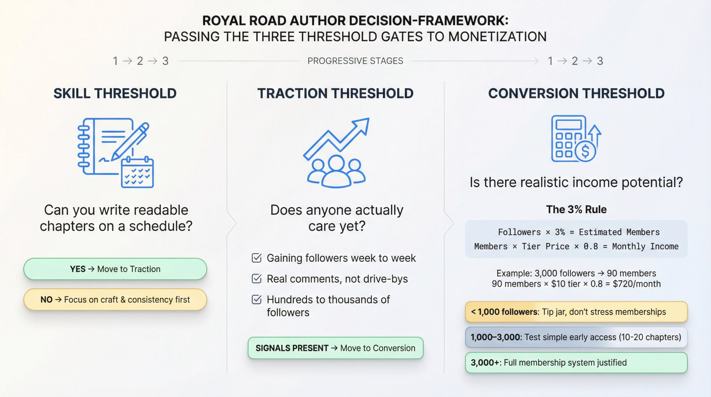

From a business perspective, there are three thresholds.

The skill threshold: can you reliably write readable chapters on a schedule? If not, focus on craft and consistency first.

The traction threshold: does anyone actually care yet? Look for these signals—you're gaining followers week to week, you have real comments (not just "nice chapter" drive-bys), and you have at least hundreds, ideally thousands, of followers.

The conversion threshold: is there realistic income potential?

TheFirstDefier's "watershed" advice: After about **two months of consistent posting**, check your numbers. Take your Royal Road followers and multiply by roughly **3%** to estimate likely early member count. ([Source](https://www.royalroad.com/forums/thread/116847))

For example, let's say you have 3,000 followers. That's 3% of 3,000, which equals 90 potential members. If your full early access tier is $10, your estimated income is approximately 0.8 × $10 × 90 = $720/month. That's not guaranteed, but it's a decision tool. $700+/month might justify prioritizing this story as a serious side hustle. $90/month might not justify the workload if you're already stretched.

### Practical Rule of Thumb

Under around 1,000 followers, focus on craft, schedule, and cover copy. You can put a tip jar, but don't stress about memberships yet.

Around 1,000–3,000 followers, a simple early-access membership is worth testing. Don't over-engineer tiers. Just give 10-20 chapters ahead for one tier and see who bites.

Past around 3,000 followers with solid growth, you're probably leaving money on the table if you don't have a [membership with meaningful early access](https://www.patron.com/).

---

## How Royal Road Fits Into Your Revenue Strategy

### What Royal Road Does and Doesn't Do

Royal Road gives you a huge pool of free readers for web serials and LitRPG/progression fantasy. It provides discovery systems like Newest, Rising Stars, Popular This Week, and Best Rated. You get per-fiction stats including views, followers, favorites, and ratings. There's also a ["Support the author" block](https://www.royalroad.com/support/knowledgebase/105) where you can link membership platforms and other external links.

What Royal Road does NOT do: it doesn't process payments for you and takes no cut of donations. Their knowledge base explicitly describes donations as external links they don't manage. They also forbid monetization links for fanfiction while allowing them for original fiction.

Your business model is simple: Royal Road equals attention, external platforms equal money.

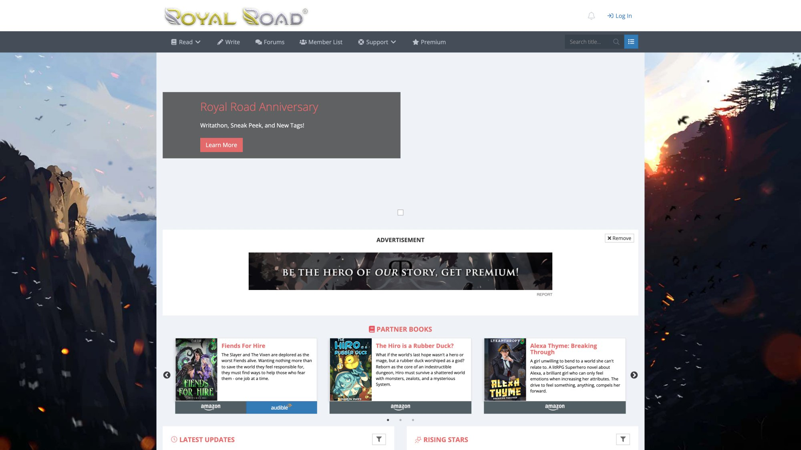

### Royal Road as a Funnel, Not a Store

The journey a stranger takes before paying you monthly looks like this: They see your cover or title on a Royal Road list. They read 1-3 chapters to test. They binge-read 20-50+ chapters. They become a follower and check for new updates. They want more, and more reliably. They click your membership link and convert.

Every tactic you can think of is either making that journey smoother, increasing the number of people who take it, or increasing the amount each paying reader spends.

---

## Best Monetization Strategies for Royal Road Authors

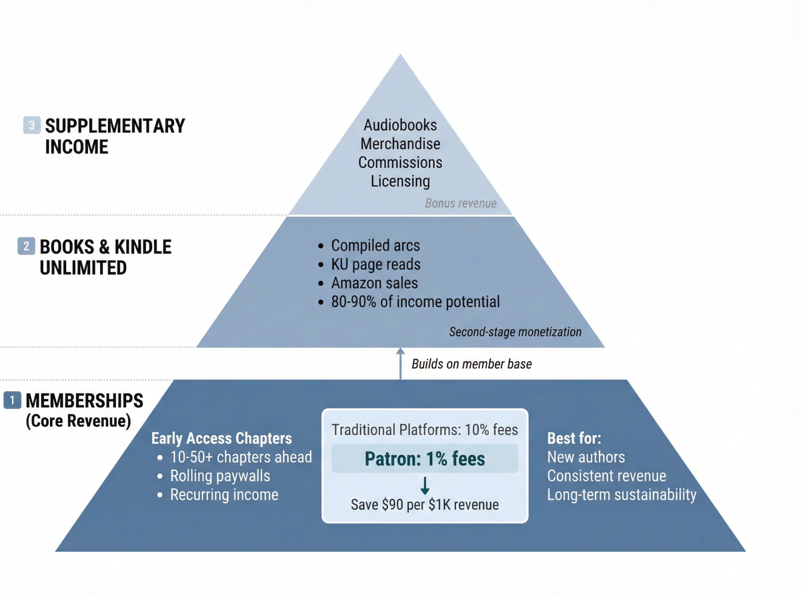

### 1. Memberships (Core Revenue)

This is the foundation for most serious Royal Road authors.

When choosing a membership platform, consider platform fees carefully. Traditional platforms charge 10% platform fees for new creators as of [August 2025](https://www.royalroad.com/forums/thread/106160), which significantly impacts your take-home pay. [Patron](https://www.patron.com/) offers 1% platform fees for early adopters and is [built specifically for sequential content](https://www.patron.com/blog/category/guides/) with [rolling paywalls](https://www.patron.com/blog/post/what-is-a-rolling-paywall/) and series-first organization.

What memberships usually sell: early access chapters are the product. Most tiers offer 10-50+ chapters ahead. Occasionally you'll see side stories, polls, Discord roles, Q&A, or lore posts. But in practice, early access is the product—everything else is additive.

### 2. Books and Kindle Unlimited (KU)

At a certain size, many Royal Road authors compile arcs into books, publish to Amazon, and often enroll in Kindle Unlimited for page-read revenue plus sales.

In his guide, [TheFirstDefier is blunt](https://www.royalroad.com/forums/thread/116847): in LitRPG/progression fantasy, going wide instead of KU "deletes **80-90% of your potential paycheck**" in most cases, because the audience is heavily concentrated on Amazon plus KU.

This is second-stage monetization. You don't need to think about it on day one, but it's where really big numbers come from when combined with memberships.

### 3. Everything Else

Less common but still real: audiobooks, merch (the [_Beware of Chicken_ plush](https://www.royalroad.com/fiction/39408/beware-of-chicken/chapter/2799146/v7c5-just-a-blade-of-grass) is a real thing in 2025), commissions and custom stories, and licensing (games, comics, etc.).

If you're at the point where you're thinking about plush toys, you're already doing most of this guide right.

---

## How to Design Membership Tiers That Actually Convert

### The Early-Access Reality

Top Royal Road authors have basically converged on the same pattern: lots of chapters ahead at the top tier, and almost everyone piles into that tier.

From community discussions on [Reddit](https://www.reddit.com/r/ProgressionFantasy/comments/zniuee/whats_the_minimum_amount_of_chapters_youd_be/) and Royal Road chapter notes, here are real-world examples from 2025: The Primal Hunter offers [$10 for 50 chapters ahead](https://www.royalroad.com/fiction/36049/the-primal-hunter/chapter/2795110/chapter-1210-the-calm-before-the-lesson). Defiance of the Fall offers around 50 chapters ahead at approximately $10 tier. Salvos offers $10 for around 30 chapters plus access to other work. So you're not guessing in the dark—there's a proven structure.

### The "K Formula" and Why $10 is Magic

From [TheFirstDefier's guide](https://www.royalroad.com/forums/thread/116847): Membership income ≈ K × [price of highest early-access tier] × [member count], where K is usually around 0.7–1.0.

You have direct control over the price of your top early-access tier, how many chapters ahead you offer there, and how clearly you present the value. You do NOT have direct control over how many members you have (that's a function of your story, reputation, and funnel).

Key implications: if you put full early access at $5, your average revenue per member caps around that number. If you move full early access to $10, your average revenue per member moves with it. Side perks rarely move this average much at all. That's why you see so many serial authors converge on a simple structure: $3 tier for support plus small lead, $5 tier for more lead plus maybe polls, and $10 tier for full lead (30-50+ chapters).

### Concrete Tier Templates You Can Steal

#### Template A: "Starter" (Under 1,500 followers)

For a story where you're still proving the concept, the $2–$3 Supporter tier offers 5-10 chapters ahead plus Discord role if you have a server. The $5 Early Access tier offers 15-20 chapters ahead. The $10 Superfan tier offers the same chapter lead as $5 for now, plus occasional bonus Q&A posts and name in credits. As you build stockpile, this tier becomes full early-access and $5 tier drops one level.

#### Template B: "Standard" (2,000+ followers)

Once you have solid traction and 40-60 chapters written past the public point, the $3 Early Peek tier offers 10 chapters ahead. The $5 Real Lead tier offers 25 chapters ahead. The $10 Full Early Access tier offers 40-60 chapters ahead plus any side stories and interludes. This mirrors what The Primal Hunter is doing in 2025 almost exactly.

#### Template C: "Long-Runner" (Big Backlog)

If you're in Defiance of the Fall territory with hundreds of chapters, the $3 tier offers 1 arc ahead (10-15 chapters). The $5 tier offers 2-3 arcs ahead (25-30 chapters). The $10 "Live with the author" tier offers 50+ chapters ahead, access to book-length beta drafts before KU, and Discord "spoilers" channels.

Do you need three tiers? Not really. The actual engine is one clearly presented full early-access tier, priced around $8–12 per month. The other tiers are mostly there to give people a cheaper on-ramp and an expensive vanity option if they want to pay more.

---

## How to Add Monetization Links to Royal Road

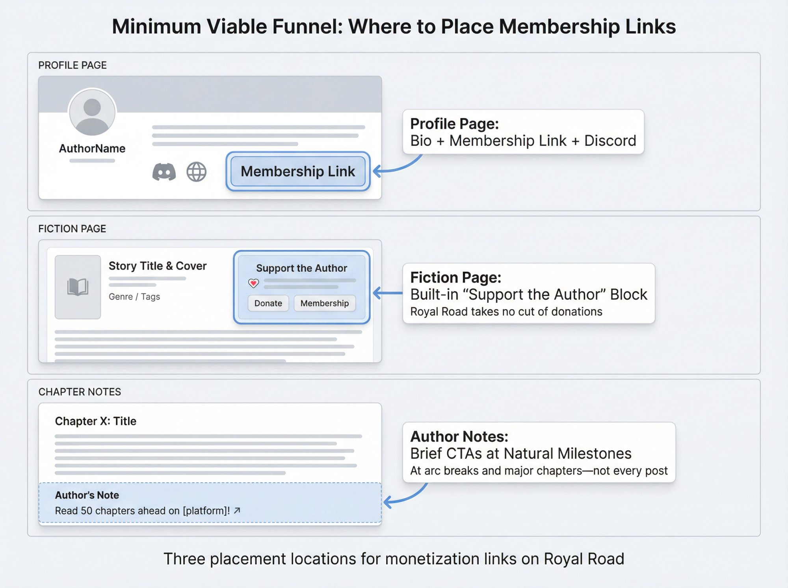

### What Royal Road Officially Allows

From [Royal Road's donation documentation](https://www.royalroad.com/support/knowledgebase/105), you can connect membership platforms to your account, which show up as donation buttons on your fiction and profile. Royal Road takes **no cut** of these donations. However, **fanfiction cannot be monetized** via these links (original fiction only).

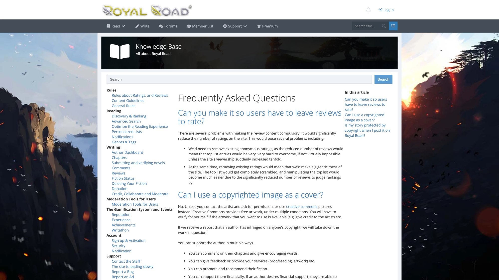

So if you're writing original fiction, the platform is explicitly designed for "free story plus external membership link" monetization.

### Where to Put Your Links

For a minimum viable funnel, on your profile page include a short bio, a link to your membership ([Patron](https://www.patron.com/) or alternatives), and a link to Discord if you have one. On your fiction page, set up the built-in "Support the author" block, put your membership link there, and keep it consistent.

In your author's notes at natural milestones, mention your early access. First chapter gets one line like "If you want to read ahead or support the story, the early-access link is in the 'Support the author' section." At major arc breaks, remind readers that early access exists. For big announcements like a new book or big milestone, mention your new tier. You don't have to nag people every chapter. Big authors often do one short CTA at the top or bottom of each chapter ("Read 50 chapters ahead on [membership platform]") and keep it moving.

### Avoiding "Paywall Resentment"

Royal Road culture is allergic to locking current public chapters behind a paywall, abruptly yanking a story off the site mid-arc without warning, or making the free version obviously inferior in quality.

What readers are fine with: you posting the story for free on Royal Road, offering 10-50 chapters ahead for paying members, and later moving earlier arcs to KU or Amazon once they're "done"—as long as you communicate clearly. If you communicate that Royal Road will always have the main story (albeit behind your paid lead), and memberships are for early access and supporting you, most serious Royal Road readers will cheer you on.

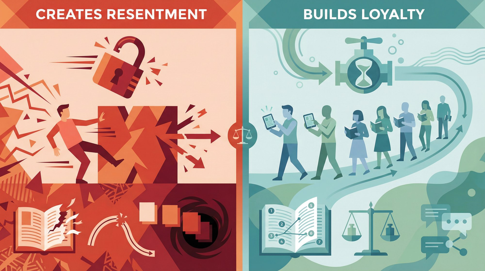

---

## How to Use Patron for Royal Road Monetization

So far we've talked about the classic pattern: Royal Road plus membership platform.

[**Patron**](https://www.patron.com/) **exists specifically to take the "Royal Road plus membership" loop and compress it into a system built for sequential content.** It offers [rolling paywalls](https://www.patron.com/blog/post/what-is-a-rolling-paywall/), release scheduling, and a series-first data model.

### What Patron Actually Offers Royal Road Authors

From [Patron's site](https://www.patron.com/) and [changelogs](https://www.patron.com/changelog/) as of September 2025:

Rolling paywalls let you publish an episode that's initially available only to paying tiers, then automatically unlocks to free readers after a delay you define—so the same chapter can be paid-only on Day 0, then free to everyone on Day 7.

The series and posts model gives [Patron](https://www.patron.com/) first-class "series" entities rather than just generic posts. That maps directly to web serials, webcomics, and podcasts and makes it easier to keep everything in reading order.

Release scheduling lets you set per-tier access rules and schedule chapters in advance. You write a month ahead, Patron slowly drips those chapters to each tier on your schedule, and you don't have to manually copy-paste to multiple platforms.

The platform fee is very low: [Patron advertises 1% platform fees](https://www.patron.com/) for early users, with an explicit "[no VC, stay lean](https://www.patron.com/blog/post/you-can-just-do-things-getting-patron-com/)" stance to avoid future fee hikes. This is significantly lower than the 10% fees charged by traditional platforms.

Open source transparency means [Patron is open source](https://github.com/patroninc/patron), so you can see exactly how the platform works, contribute improvements, or even self-host if you need that level of control.

### How a Royal Road Author Could Use Patron

You can think of [Patron](https://www.patron.com/) as your membership backend that mirrors Royal Road's chapter structure.

An example workflow starts with writing chapters in arcs and building at least a 20-40 chapter stockpile before serious monetization.

Then set up series and tiers on Patron. Your tiers might be $3 for 10 chapters ahead, $5 for 25 chapters ahead, and $10 for 50 chapters ahead. For each chapter you configure release dates: one for the $10 tier, one for the $5 tier, one for the $3 tier, and a public unlock date (if you also host free chapters on Patron or elsewhere).

Use Royal Road as the pure funnel. Post free chapters to Royal Road on a schedule (e.g., 5 times a week). In chapter author notes, link to Patron for early access: "If you want to read up to 50 chapters ahead and support the story with lower fees, the [Patron link](https://www.patron.com/) is in the 'Support the author' section."

Optionally keep or phase out other platforms. Migration is tricky. A sane approach: if you already have existing membership income elsewhere, leave it running but plug [Patron](https://www.patron.com/) for new readers. If you're starting now, start on [Patron](https://www.patron.com/) directly to benefit from lower fees and serial-friendly tooling.

---

## How to Build Your Royal Road Monetization System

Let's combine everything into a practical playbook.

### Step 1: Decide Your Goal Honestly

Pick one. "Serious side hustle" means aiming for $500–$2,000/month where writing remains part-time. "Career replacement" means aiming for $3,000–$10,000+/month between memberships and books. "Lottery ticket" means you're swinging for Zogarth-level numbers, which is possible but requires luck plus good fundamentals. Your schedule, genre, and monetization aggressiveness should match your goal.

### Step 2: Choose a Release Schedule You Can Keep for a Year

Using [TheFirstDefier's advice](https://www.royalroad.com/forums/thread/116847) as a baseline, a good target for "serious side hustle or better" is **1,500–2,500 words** per chapter, **4–7 times per week**.

If that sounds insane, you can start at **3x/week** while you're still learning, or build a stockpile using your best pace, then drop to a lower public schedule while memberships eat into the buffer.

Don't set a schedule your future self will hate you for.

### Step 3: Build a Launch Stockpile

Before you "launch" in the sense of chasing Rising Stars or memberships, aim for **20-40 chapters complete**. Post an initial burst to Royal Road (e.g., 5-10 chapters in the first weekend), then fall into your regular schedule.

That stockpile also becomes your earliest early-access pool later.

### Step 4: Optimize Your Royal Road Presence

Basics to get right: your title, cover, and blurb need to stand out in the crowded LitRPG/progression fantasy ecosystem. Your tags and synopsis matter because readers rely heavily on tags to find the right genre signals.

Your profile should have a clean, short bio and links to your membership ([Patron](https://www.patron.com/) or alternatives), Discord, and website. Your fiction page should ensure "Support the author" includes your membership link, and maybe add a one-liner in the description about "early chapters available via membership."

### Step 5: Turn On Memberships at the Right Time

At around 1,000 followers, create simple tiers but don't push them hard. Offer 5-10 chapters ahead.

Around 2,000–3,000 followers, expand to the "Standard" tier ladder: $3 tier for 10 chapters ahead, $5 tier for 25 chapters ahead, and $10 tier for 40-50 chapters ahead as stockpile allows.

At each milestone, apply the 3% rule to sanity-check: Followers × 3% ≈ near-term member count. Estimated income ≈ 0.8 × [top tier price] × [that member count]. If that number looks life-changing if you can grow a bit more, double down.

### Step 6: Decide Where to Host Memberships

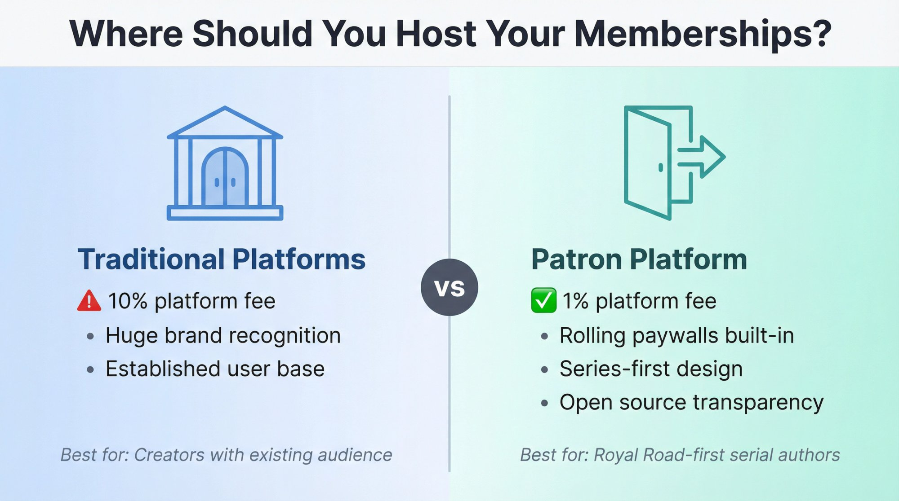

Right now in 2025, realistic considerations: traditional platforms offer huge brand recognition and many readers already having accounts, but come with 10% platform fees for new creators since August 2025 plus payment processing fees.

[Patron](https://www.patron.com/) offers [1% early-adopter platform fees](https://www.patron.com/blog/post/patreon-fee-changes-2025/), [rolling paywalls](https://www.patron.com/blog/post/what-is-a-rolling-paywall/) and series-first design, and is [open source](https://github.com/patroninc/patron). The cons are being newer, smaller, less familiar to readers, and still in alpha.

If you're starting from scratch today and you intend to be a Royal Road-first serial author, [Patron's rolling paywall plus 1% fee](https://www.patron.com/) are very attractive. If you already have existing membership income, a hybrid strategy makes sense: keep legacy platform for existing supporters, point new readers to [Patron](https://www.patron.com/), possibly offer slightly better value on Patron to encourage migration over time.

### Step 7: Plan for KU and Books Once You're Stable

Once you have hundreds of chapters, a strong Royal Road following, and membership income paying real bills, then think about compiling arcs into books, self-publishing or working with a specialist small publisher, and likely enrolling in Kindle Unlimited for exclusivity and page-read revenue.

Plan your story structure so natural arc breaks line up with book boundaries, and you can remove older chapters from Royal Road if you choose KU without ruining the free experience.

---

## Royal Road Monetization Mistakes to Avoid

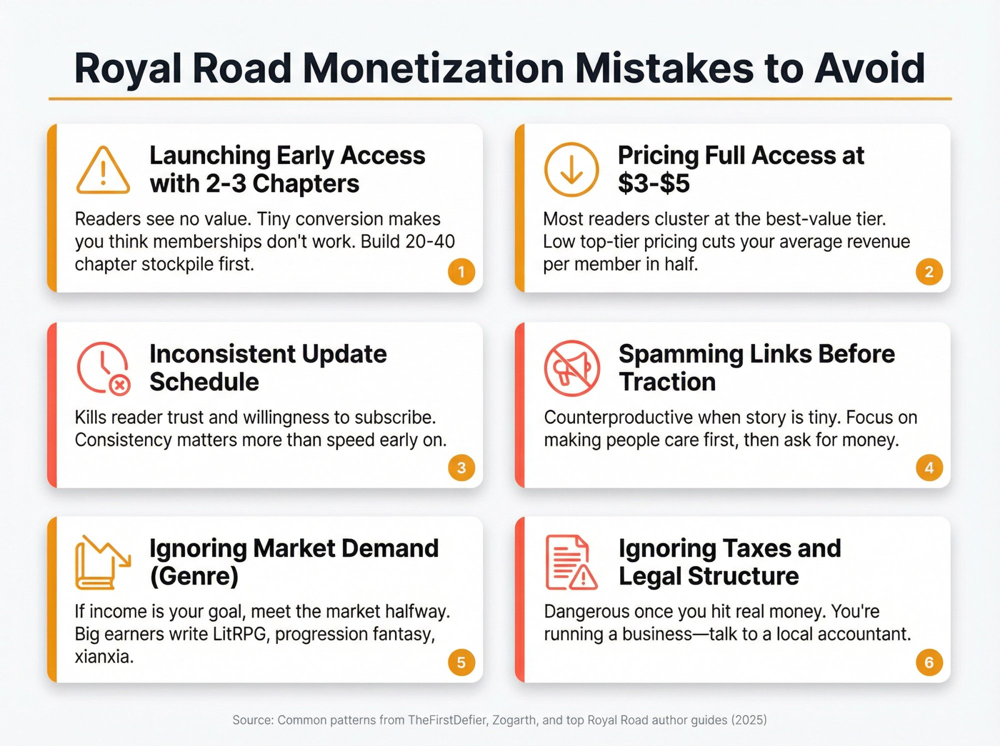

Turning on early access when you only have 2-3 extra chapters means readers don't see real value. Conversion will be tiny, and you'll walk away thinking "memberships don't work."

Putting full early access at $3–$5 and adding "fancy" perks at $10+ doesn't work because most readers cluster at the tier with the biggest chapter lead. Sacrificing your average revenue per user to make a few people feel special isn't a good trade early on.

Inconsistent updates kill reader trust, which kills willingness to subscribe.

Spamming your link in every author note while your story is still tiny is counterproductive. Focus on making more people care, then ask for money.

Refusing to write in genres with demonstrated demand if your explicit goal is money is a problem. There's nothing wrong with pure art. But if you want income, you have to meet the market halfway. Big earners write in niches where readers are hungry: LitRPG, progression fantasy, xianxia, etc.

Ignoring taxes and legal structure once you hit real money is dangerous. At some point you're running a business. Talk to a local accountant. Don't rely on random internet comments for tax strategy.

---

## Why Author Memberships Matter More in 2025

Two big macro shifts matter. First, platform fee changes: as of [August 2025](https://www.royalroad.com/forums/thread/106160), new creators on traditional platforms default to 10% platform fees, up from older tiers. That's on top of payment processing fees. Second, platforms getting aggressive everywhere: app stores, payment providers, and even "tip jar" platforms are expanding premium features and taking bigger cuts.

This pushes two things. First, taking recurring revenue seriously—if you want writing to be more than a side hobby, you need stable, recurring income. Memberships are that. Second, caring about economics at the platform layer. The difference between 10% fees and 1% fees is not "just 9%."

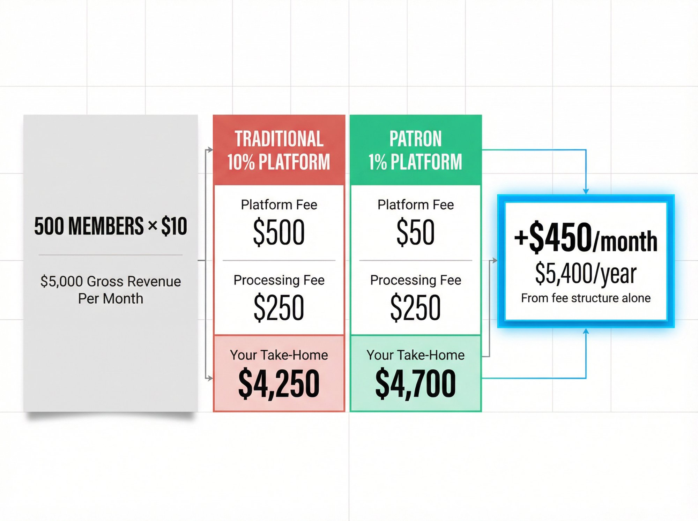

For example, 500 members at $10 equals $5,000 gross per month. Assume payment processing fees average around 5% effective:

| Platform Type                                | Platform Fee | Processing Fee | Your Take-Home     |
| -------------------------------------------- | ------------ | -------------- | ------------------ |
| **Traditional 10%**                          | $500         | ~$250          | ~$4,250 before tax |
| [**Patron**](https://www.patron.com/) **1%** | $50          | ~$250          | ~$4,700 before tax |

That's roughly an extra **$450/month** on the same revenue, or **$5,400/year**, purely from fee structure.

[Learn more about calculating your true take-home pay](https://www.patron.com/blog/post/how-to-calculate-your-true-patreon-take-home-pay-2025/).

Scale that to Zogarth-level numbers and the difference is wild.

---

## Your Complete Royal Road Monetization Roadmap

Here's the distilled game plan. Pick your aim (side hustle or serious career). Commit to sustainable output (preferably 4-7 chapters a week at 1,500-2,500 words). Use Royal Road as your funnel by optimizing title, tags, cover, blurb, and shipping consistent chapters. Turn on memberships once you see traction (usually around 1,000-3,000 followers). Copy a proven tier ladder where $10 is the full early-access tier, with 30-50+ chapters ahead.

Use [Patron](https://www.patron.com/) or alternatives as your membership backend ([Patron](https://www.patron.com/) if you want [1% fees](https://www.patron.com/blog/post/patreon-fee-changes-2025/) and [rolling paywalls](https://www.patron.com/blog/post/what-is-a-rolling-paywall/), alternatives if you care more about reader familiarity). Measure using simple rules like the 3% follower-to-member estimate and the K formula for income. Add KU and books once stable, treating them as second monetization, not replacement. Keep iterating because the boring parts (craft, cadence, consistency) make the exciting numbers possible.

---

## Frequently Asked Questions

### How many chapters should I have written before starting a Royal Road story?

Aim for **20-40 chapters complete** before your "launch." This gives you an initial burst (5-10 chapters in first weekend) to hook readers, a stockpile that becomes your earliest early-access pool, and a buffer against schedule slip during your first few months.

### Can I monetize fanfiction on Royal Road?

No. [Royal Road's policies](https://www.royalroad.com/support/knowledgebase/105) explicitly forbid monetization links for fanfiction. Monetization is only allowed on original fiction.

### Should I start with Patron or traditional platforms?

Start with [Patron](https://www.patron.com/) if you're launching a new serial from scratch, you want [1% platform fees vs 10%](https://www.patron.com/blog/post/patreon-fee-changes-2025/), you like the [rolling paywall](https://www.patron.com/blog/post/what-is-a-rolling-paywall/) and series-first design, or you value [open source](https://github.com/patroninc/patron) and potential for self-hosting.

Start with traditional platforms if you already have existing membership income there, reader familiarity matters more than fees, or you need a more mature ecosystem.

Consider hybrid: keep existing platform for legacy supporters, point new readers to [Patron](https://www.patron.com/).

### What's the minimum follower count before memberships make sense?

Under 1,000 followers, you can add a tip jar but don't stress about memberships yet. At 1,000-3,000 followers, a simple early-access membership is worth testing (10-20 chapters ahead). Past 3,000 followers, you're likely leaving money on the table without meaningful early access.

Use the 3% rule: Followers × 0.03 ≈ estimated member count. Multiply by your top tier price × 0.8 for rough monthly income estimate.

### How many chapters ahead should I offer?

Top Royal Road authors converge on: $3 tier for 10 chapters ahead, $5 tier for 25 chapters ahead, and $10 tier for 40-50+ chapters ahead. The top tier (full early access at around $10) is where most serious readers cluster. Having only 5-10 chapters total as your "full" offering drastically reduces conversion and average revenue per member.

### Should I pull my story from Royal Road when I go to Kindle Unlimited?

Not entirely. The standard approach: Keep your story on Royal Road with your paid lead (**30-50+ chapters ahead** for members). When you compile completed arcs into books for KU, remove _earlier_ arcs from Royal Road. Leave first chapter or first arc as a free "demo." Communicate clearly: "Arc 1 now available on Amazon/KU. Arc 2 continues free here on Royal Road."

This maintains your Royal Road funnel while satisfying KU exclusivity.

### What if readers complain about paywalls?

Royal Road readers are fine with free story on Royal Road, early access memberships for superfans, and later KU releases of completed arcs.

They're NOT fine with locking current public chapters behind a paywall, yanking stories mid-arc without warning, or making free version inferior quality.

As long as you communicate clearly and keep Royal Road as your free funnel (just behind the paid lead), most readers support authors making money.

### How do rolling paywalls work with Royal Road posting?

Example workflow with [Patron](https://www.patron.com/): Chapter 100 gets released to the $10 tier on Day 0, to the $5 tier on Day 7, to the $3 tier on Day 14, and posted free to Royal Road on Day 21.

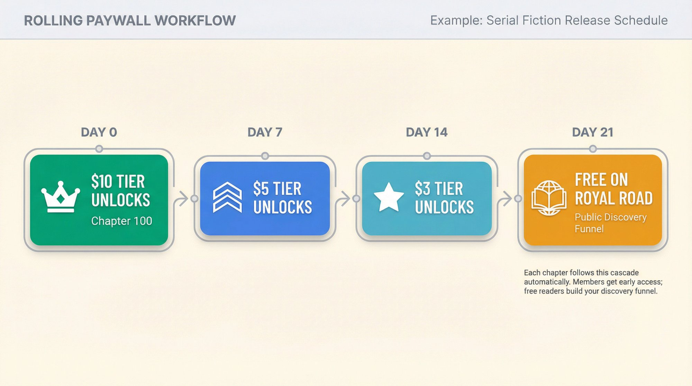

Your [Patron](https://www.patron.com/) handles the automatic unlocking. Royal Road gets chapters on your free schedule. Members get early access based on their tier.

[Learn more about how rolling paywalls work](https://www.patron.com/blog/post/what-is-a-rolling-paywall/).

### What's a realistic timeline from launch to full-time income?

From the case studies: Zogarth went from Royal Road launch to $5,000/month in around 2 months, hitting full-time by month 3-4. TheFirstDefier had a similar trajectory, hitting significant income within first 6 months.

Reality check: these are outliers who combined strong craft, consistent output, popular genre, and good timing.

More realistic for most: months 1-3 mean building following and testing monetization. Months 4-9 could mean growing to $500-$2,000/month if traction is good. Year 2+ could potentially mean $3,000-$10,000/month with memberships plus KU if you execute well. Success isn't guaranteed, but the path is proven.

### Do I need Discord, polls, and fancy perks?

No. The product is early-access chapters. From [TheFirstDefier's guide](https://www.royalroad.com/forums/thread/116847): "Treat memberships as a transactional product. People pay to read ahead." Discord and polls are nice-to-haves. Focus on delivering lots of chapters ahead at a $10 tier. That's what moves the revenue needle.

### Can I use Patron alongside existing platforms?

Yes, and it's actually recommended for migration. Keep your existing membership platform for legacy supporters. Direct new readers to [Patron](https://www.patron.com/) for [1% fees](https://www.patron.com/blog/post/patreon-fee-changes-2025/) and [rolling paywalls](https://www.patron.com/blog/post/what-is-a-rolling-paywall/). Optionally offer slightly better value on Patron (extra side story, cheaper top tier) to encourage gradual migration. Post identical early-access content to both platforms during transition. [Read more about switching platforms](https://www.patron.com/blog/post/switch-from-patreon-to-patron/).

---

## Final Note on Data

All earnings figures, platform fees, and policy details in this guide are based on public information available in **late 2025**: platform fee changes as of August 2025, [Royal Road guides](https://www.royalroad.com/support/knowledgebase/105) updated through November 2025, [Graphtreon earnings snapshots](https://graphtreon.com/top-patreon-earners/writing) updated daily in 2025, and [Patron's site](https://www.patron.com/), [blog](https://www.patron.com/blog/), and [changelog](https://www.patron.com/changelog/) as of September 2025.

Creators' incomes and platform policies change frequently. Before making major financial decisions, double-check latest fee pages, Royal Road's current rules, and tax implications in your country.

But the first principles in this guide will age much more slowly than any single number: treat writing like a business, use Royal Road as a funnel, sell serious early access, design tiers around reader behavior, and use platforms like [Patron](https://www.patron.com/) that are [built for sequential content](https://www.patron.com/blog/category/about/).

These fundamentals will serve you regardless of specific platform fee changes or market shifts.

Ready to start monetizing your Royal Road story? [Check out Patron](https://www.patron.com/) to set up [rolling paywalls](https://www.patron.com/blog/post/what-is-a-rolling-paywall/) and [series-first memberships](https://www.patron.com/blog/category/guides/) built specifically for serial fiction creators.

---
