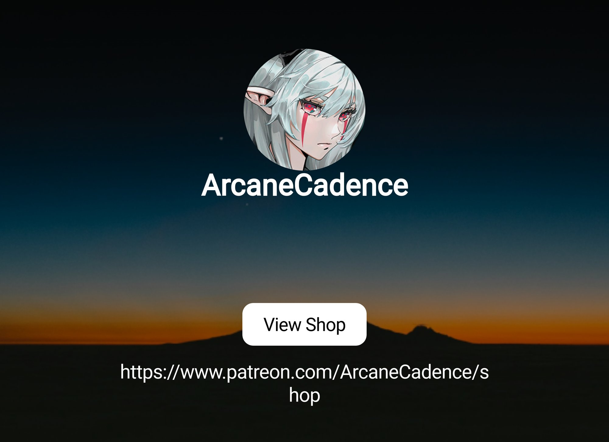
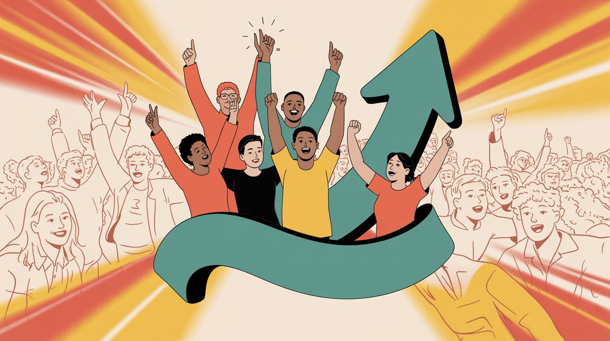
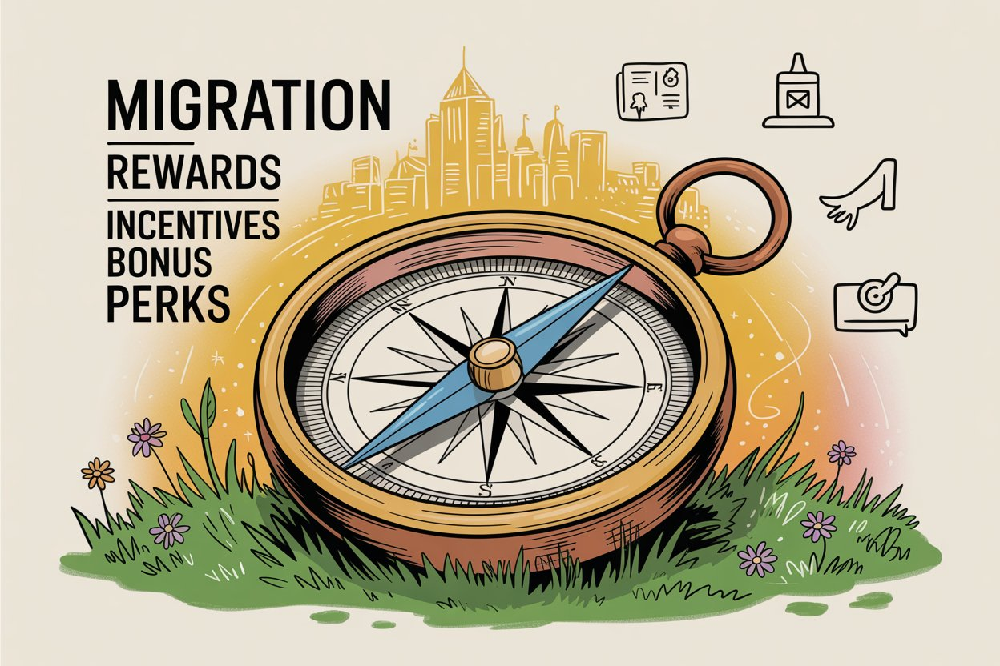
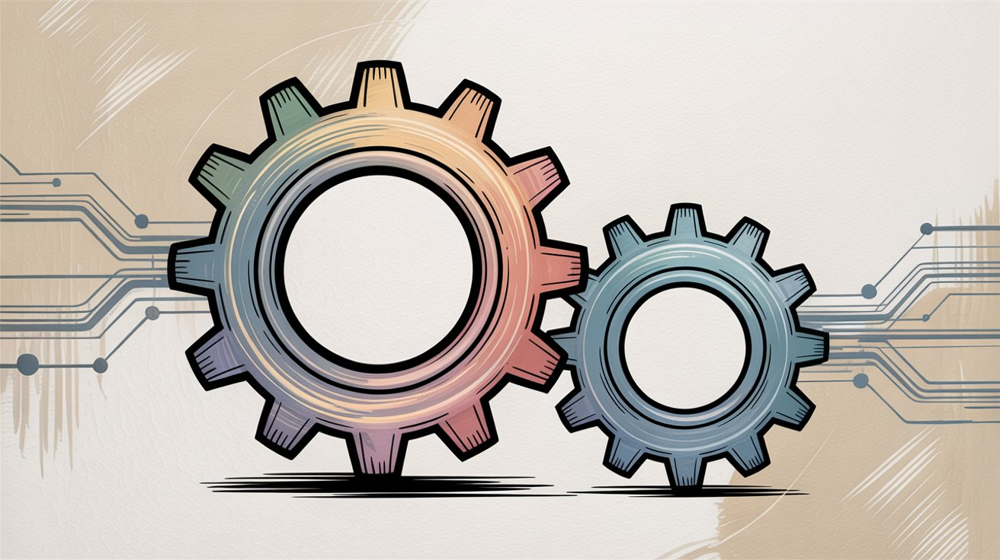

**Making a platform switch can feel daunting.** You've built a community on Patreon, and the last thing you want is to lose those hard-won supporters. But with [Patreon's recent fee hikes to 10% for new creators](https://www.patron.com/blog/post/patron-fee-changes-2025/) and the emergence of new creator-friendly platforms like [Patron](https://www.patron.com/), many creators are considering a move.

If you handle the transition correctly, you can move from Patreon to [Patron](https://www.patron.com/) without losing supporters. You might even gain new ones.

This guide will show you how, with up-to-date tactics, real creator case studies, and a step-by-step plan that works.

## Why Switch to Patron

Patreon has long been the go-to for memberships, but recent changes give many creators pause. In August 2025, [Patreon bumped its fee to **10% for all new creators**](https://www.patron.com/blog/post/patron-fee-changes-2025/). Existing creators on older plans still pay 5-8%, but that's double the cut many were paying before.

Ten percent off the top is significant. It could mean **an extra $90 lost per $1,000 earned** (or around $900 on $10k). For creators earning six figures a month, we're talking **thousands of dollars in fees** that could fund new gear, hire help, or simply be income you keep.

By contrast, [**Patron**](https://www.patron.com/) charges **just 1%** to early adopters. That's not a typo. *One percent.*

On that same $1,000 of supporter pledges, Patron's fee would be only $10, versus Patreon's $100 on a new standard plan. The savings scale with your earnings:

| Your Monthly Revenue | Patreon Fee (10%) | Patron Fee (1%) | **You Keep Extra** |
| --- | --- | --- | --- |
| $1,000 | $100 | $10 | **$90** |
| $5,000 | $500 | $50 | **$450** |
| $10,000 | $1,000 | $100 | **$900** |
| $20,000 | $2,000 | $200 | **$1,800** |

In short, [Patron](https://www.patron.com/) lets your community's support go **almost entirely to you**, aside from payment processing costs.

But fees are only part of the story.

### What Makes Patron Better for Sequential Content Creators

[Patron is purpose-built for sequential content creators](https://www.patron.com/) like [webcomic artists](https://www.patron.com/blog/post/how-to-monetize-a-webcomic), serialized fiction writers, and podcasters in ways traditional membership platforms aren't.

[Rolling paywalls](https://www.patron.com/blog/post/what-is-a-rolling-paywall) work by releasing new episodes to paying subscribers first, then automatically making those same episodes free after a set time period, usually between one and four weeks.

Your archive builds up as free content that attracts new readers, while your most engaged fans subscribe to get episodes early. It's the difference between locking content behind a permanent paywall and creating a time-release valve that serves both discovery and revenue.

The psychology behind this model is powerful. Readers binge your free archive until they hit a cliffhanger or run out of episodes. At that point, they subscribe to get more content immediately. They stay subscribed because they don't want to fall weeks behind.

[Patron](https://www.patron.com/) offers features like [**rolling paywalls**](https://www.patron.com/blog/post/what-is-a-rolling-paywall)**, scheduled releases, and better content organization for series**. On traditional platforms, creators often hack the system to simulate these (using post tags or manual drip schedules). Patron bakes it in.

If you've ever juggled early-access chapters while posting older ones free on another site, you know how valuable this could be.

### What Features Are Available on Patron Right Now

Patron's team has [committed to feature parity with essential tools](https://www.patron.com/) that creators need. Discord integration, email notifications, and community forums/chat are on the [roadmap](https://www.patron.com/changelog/) so that creators aren't cutting any existing functionality by switching.

All the tools you and your fans rely on are expected to be available. This includes private Discord roles and email blasts for new posts. As of late 2025, [Patron is in early-alpha](https://www.patron.com/blog/post/sep-10-sep-17-changelog/); features like authentication, content hosting, and an SDK are already live, with community and integration features actively being developed.

[Patron is open-source](https://github.com/patroninc/patron) and aims to stay lean. This resonates with creators who worry about platform dependency. [The platform publicly vows not to take on venture capital pressure](https://www.patron.com/) that could force fee increases. This philosophy may reassure your supporters that the new platform exists to empower creators, not squeeze them.

> By switching to Patron, you stand to keep more of your income and get a platform that's tailor-made for your content style. The key is executing the switch in a way that brings your community along.

Before we get into the step-by-step plan for a smooth migration, let's look at a couple of real creators to see what's at stake and how a platform change could benefit them.

## Real Creator Story: ArcaneCadence Earning $20K/Month with Sequential Content

[ArcaneCadence](https://www.royalroad.com/profile/729989) is a breakout web novelist worth studying.

In mid-2025, ArcaneCadence launched the serial novel *"New Life As A Max Level Archmage"* on Royal Road (a free fiction platform). In just a few months, the story amassed over [**20,000 followers on Royal Road**](https://www.royalroad.com/fiction/118891/new-life-as-a-max-level-archmage), rocketing to the top of the charts. Readers were hooked by the premise (a gamer wakes up as her max-level character in a fantasy world) and the consistent chapter updates.

That reader enthusiasm quickly turned into financial support.

ArcaneCadence began offering early-access chapters on a traditional membership platform, and the response was massive. By late October 2025, independent estimates put earnings at **about $30,826/month** from ~4,075 paying members, per Graphtreon’s live stats for ArcaneCadence. ([Source: Graphtreon](https://graphtreon.com/creator/ArcaneCadence))

This is one of the fastest growth trajectories the web fiction community has seen, with one commenter noting a ["meteoric rise 99.9% of writers would be jealous of"](https://www.reddit.com/r/litrpg/comments/1m89f1j/new_life_as_a_max_level_archmage_come_try_my_story/).

Perhaps most impressive is the conversion rate. An estimated 18% of Royal Road followers became paying members. Many serial fiction authors consider a 2-5% conversion good. 18% is off the charts.

Two factors drove this success. First, consistency. ArcaneCadence posted new chapters like clockwork, keeping readers on the edge of their seats and willing to pay to read ahead. Second, community. They interacted with fans on Discord and Reddit, building loyalty. They delivered exactly what sequential content fans crave. A steady drip of story and a personal connection.

That combination translated into real income fast.

### What ArcaneCadence Would Save by Switching to Patron

If a creator like ArcaneCadence were to move to [Patron](https://www.patron.com/), the financial upside is clear.

At around $20k per month, traditional platform fees of 10% would be about $2,000. [Patron's 1% fee](https://www.patron.com/blog/post/patron-fee-changes-2025/) would be just $200, meaning ArcaneCadence would keep an extra **$1,800 every month**. At their current trajectory (over [$30k/month as of late 2025](https://graphtreon.com/creator/ArcaneCadence)), they'd save even more.

Those savings could fund cover art commissions, more writing time, or simply provide a buffer to write full-time.

The challenge, of course, would be convincing **thousands of readers to update their payment info and move**. With such a highly engaged fanbase, clear communication and incentives would be key. But if executed well, ArcaneCadence could continue their serial success on [Patron](https://www.patron.com/) while keeping nearly all of their supporters' contributions.

>Serial fiction can foster extremely dedicated supporters. By valuing your fans and delivering for them, you can mobilize a huge percentage to follow you to a new platform, especially if it means you can continue or increase the content they love. Make sure to highlight how the switch benefits them. More of their pledge goes to you, which helps you make more content.

## How Trash Taste Built a $40K/Month Podcast Membership Community

**Trash Taste** is a wildly popular anime and pop-culture podcast on the other end of the spectrum.

Hosted by three YouTuber personalities, Trash Taste delivers free weekly podcast episodes, but their most diehard fans go beyond just listening on YouTube or Spotify. Trash Taste runs a thriving membership program where they offer bonus content to paying subscribers.

This includes things like **"Trash Taste After Dark"** (extra unfiltered podcast sessions) and other exclusive episodes not available to the public. The result? They've built one of the largest podcast communities in the creator economy.

As of 2025, [Trash Taste has about **8,300 paying members**](https://graphtreon.com/creator/trashtaste) and earns an estimated [**$40,000 per month**](https://riverside.com/blog/patreon-podcasts) from membership subscriptions.

Their tier structure reflects classic podcast monetization. Tier 1 offers gratitude and maybe access to a members-only feed or Discord. Tier 2 grants early access to content or bonus episodes, allowing subscribers at this level to watch or listen to extra content before anyone else. Tier 3 adds special recognition. Top-tier members get their names in the episode credits along with all the previous perks.

This membership model has fostered a passionate fanbase willing to pay monthly for more of the banter and camaraderie they love. Fans get extra hours of entertainment, and the creators get a reliable income stream to support the show.

### What Trash Taste Would Gain by Moving 8,300 Members to Patron

A community of Trash Taste's size underscores both the potential rewards and challenges of moving platforms.

Financially, the difference is stark. At around $40k per month, traditional platform fees of 10% would skim off $4,000, whereas [Patron's](https://www.patron.com/) 1% fee would be around $400.

That's **about $3,600 more** staying with the creators every month.

Over a year, that's well over **$40,000 extra** that could go into production quality, live events, or hiring staff. Or simply into the hosts' pockets as profit. It's the kind of money even fans understand is significant.

If explained properly, supporters may be very receptive to a switch. The hosts could explain that the savings let them put on more live shows or invest in better gear.

The hurdle is getting thousands of people to take action. Trash Taste would need to recreate their membership tiers exactly so fans get the same benefits and communicate the change clearly across all channels.

They'd also likely run both platforms concurrently for a while, since abruptly moving 8,000+ people is unrealistic. But their strength is community loyalty. These fans feel personally invested in the hosts. With a bit of incentive, such as a special live Q&A for those who migrate or a limited merch discount code, many would likely follow.

Because Trash Taste's content is serial and episodic, [Patron's features](https://www.patron.com/blog/post/what-is-a-rolling-paywall) like scheduled releases and robust Discord integration would only enhance the fan experience.

>Established creators can successfully migrate if they plan carefully. When you're earning tens of thousands per month, even a small percentage fee reduction translates to huge gains. Those gains can ultimately benefit your fans through better content funded by the savings. The key is to respect the community's attachment. Communicate the why, ensure a seamless experience on the new platform, and don't rush the transition.

With the *why* and *what's at stake* clear from these examples, let's get into **how** you can actually execute a smooth switch to [Patron](https://www.patron.com/).

Whether you're a rising star like ArcaneCadence or a more established creator, the migration principles are similar.

## 6-Step Plan to Switch from Patreon to Patron Without Losing Supporters

Switching platforms requires both technical setup and community management. You'll be moving content and payment processes, but just as importantly, you'll be guiding your audience through a change.

Follow these steps to cover all bases.

### Step 1: Audit Your Current Patreon Setup and Create Your Migration Timeline

Start by taking stock of your current setup and making a transition game plan.

List out your tiers, pricing, and benefits. What perks do you offer at each level? You'll want to recreate these on [Patron](https://www.patron.com/) to keep things consistent for supporters. Jot down the details like tier names, dollar amounts, descriptions of rewards, and which content is tied to each tier.

Export key data. Traditional membership platforms allow creators to download certain data. Go to your dashboard and export your supporter list as a CSV file that includes names, emails for those who opted in, and pledge amounts. Also export your earnings history for records. Save any content like posts, images, or videos you might need to re-upload.

For privacy and security, you cannot export payment info. Nobody can auto-transfer subscriber credit cards between platforms. This means supporters will have to re-subscribe on [Patron](https://www.patron.com/) themselves. Plan on clearly asking them to do so.

Check your obligations and timing. Are you in the middle of a billing cycle or a big reward fulfillment? If many members just paid for the month, you might wait until near the end of the cycle to start migrating so they get what they paid for.

Also consider annual subscribers. If some supporters paid upfront for a year, you may need to continue honoring their rewards until their term is up, or offer them a special transfer deal. Identify any such edge cases now.

Choose a target timeline. Set a tentative schedule for the transition. For example, you might decide to announce the move in the first week of the month, run both platforms in parallel for the rest of the month, and aim to fully switch by next month.

Having a timeline helps you communicate clearly and not leave members in limbo. Plan for at least 2-4 weeks of overlap where you maintain both platforms. This overlap period is crucial to avoid a sudden drop in income.

Join Patron if you haven't already. If you're not already on [Patron's waitlist or alpha](https://www.patron.com/), sign up for access. Get familiar with the interface, features, and any differences. Knowing the tool well will make the move smoother for you and easier to explain to fans.

### Step 2: Set Up Your Patron Page and Recreate Your Membership Tiers

Now it's time to build your new home on [Patron](https://www.patron.com/).

Create your creator page and series. [Patron is designed around sequential content](https://www.patron.com/blog/category/guides), so you may be prompted to set up a Series for a webcomic, story, podcast, or other ongoing project. Then add episodes or chapters as posts. Go ahead and configure that structure.

If you have multiple ongoing series, [Patron](https://www.patron.com/) lets you organize them separately under your profile, each with its own feed. This is a good time to organize your content in a way that might be clearer than traditional one-size-fits-all feeds.

Recreate your membership tiers. Use the notes from Step 1 to set up tiers on [Patron](https://www.patron.com/) with the same prices and benefits. It's usually wise to keep things identical to your current offerings, at least initially, so that supporters feel it's a lateral move with no loss of perks.

If [Patron](https://www.patron.com/) offers new options like [per-series tiers](https://www.patron.com/blog/post/how-to-price-your-webcomic-tiers) or other flexible paywall settings, you can consider those down the road. During the transition, keep it simple.

For example, if you had $3 for "Supporter", $5 for "Super Fan", and $10 for "VIP" tiers, make those same tiers on [Patron](https://www.patron.com/) with the same names and reward descriptions.

Fill your Patron page with some content. Before inviting everyone over, populate the new platform so it doesn't feel empty. Upload a few recent posts or pieces of content.

A good approach is to post your latest 5-10 pieces and mark them for the appropriate tiers. This ensures that when your members arrive on [Patron](https://www.patron.com/), they can scroll and see familiar content right away, reinforcing that everything is here too.

Also consider making a welcome post. Perhaps a short public note on [Patron](https://www.patron.com/) greeting new visitors, which can double as a guide for how to use your Patron page.

Customize branding and visuals. Set up your [Patron page](https://www.patron.com/) with your banner, profile pic, bio, and links, just as you did on your current platform. Consistent branding will make supporters feel at home.

[Patron](https://www.patron.com/) likely allows you to connect your socials, website, and other links, so fill all that out so your profile looks legit and polished.

Do technical checks. Connect your Stripe account or whatever payment processor [Patron](https://www.patron.com/) uses so you can actually receive funds. [Patron uses Stripe for payments](https://www.patron.com/blog/post/aug-24-sep-2-changelog/), so you'll need to set that up if you haven't before.

If payments are enabled for your account, do a quick test with a dummy supporter or a friend at a low tier to verify checkout and content access end to end. This step is important. You don't want the first impression for real supporters to be a broken signup or locked content that should be open.

Plan content scheduling if needed. [Patron's rolling release feature](https://www.patron.com/blog/post/what-is-a-rolling-paywall) means you can schedule when posts become free. If you want to use this, decide on those timings. For example, chapters could be exclusive to supporters for 2 weeks, then unlock for free readers.

You don't have to use this immediately, but if it's a selling point for moving, be ready to explain it to fans. You can tell them that older posts will become free after a set number of days, helping more people discover the series. It can soften the ask of moving by highlighting a feature that benefits everyone.

By the end of Step 2, you should have a [Patron page](https://www.patron.com/) that mirrors your current setup. Same tiers, a backlog of content, and all the basic info. Essentially, the stage is set to welcome your community over.

### Step 3: Announce Your Platform Switch to Your Supporters

This step is make-or-break. How you tell your followers about the switch will greatly influence whether they come along.

Transparency, positivity, and repetition are key.

Craft your announcement message. Write a post explaining why you're moving to [Patron](https://www.patron.com/) and how it will work. Consider also sending an email, Discord announcement, and tweets.

Focus on the benefits to your supporters. For example, you might say that you'll be able to keep more of their contribution. Traditional platforms take a much bigger cut now, whereas [Patron only takes 1%](https://www.patron.com). This means you can invest more into making content for them.

Emphasize that nothing about their support level or perks is being taken away. You're simply moving platforms to better serve them and you.

If [Patron](https://www.patron.com/) has features that will improve their experience, such as better content organization, a better reading or viewing experience, or more consistent update tools, mention those too.

Highlight Patron's low fees in fan-friendly terms. Many supporters will appreciate that their favorite creator isn't losing 10% of their pledge to a platform.

You can say something like this. On [Patron](https://www.patron.com/), only 1% of your pledge goes to platform fees, versus 10% on traditional platforms. That means if you pledge $10, I actually get $9.90 instead of $9.00. Over a year, that difference is huge. It helps me keep creating at the pace and quality you expect.

When put this way, supporters feel like they're part of a positive change. It's money they were willing to spend anyway. Now more of it goes to you, whom they want to support.

Explain what supporters need to do. Be very clear on the action. For example, ask them to head over to your Patron Page and sign up for the same tier they had before.

Provide the direct link to your [Patron page](https://www.patron.com/). Explain that they will need to enter payment info on [Patron](https://www.patron.com/) because it's a separate platform. Some may not realize this.

If you have an annual membership option, note how you're handling that on [Patron](https://www.patron.com/). Patron might not have annual payments yet, so maybe you'll honor the remaining months manually or ask them to switch when their year is up. Clarity will prevent confusion.

Reassure them about content access. Let fans know that all the content they've been enjoying will be available on [Patron](https://www.patron.com/), perhaps even improved.

If you're going to dual-post for a while, which is recommended, mention that. You can say something like this. I will continue updating both platforms for the next few weeks during the transition, so you won't miss anything even if you take a little time to switch.

This removes the urgency pressure and shows you're not abandoning those who don't switch immediately.

Set a target date gently. While you'll run both for a bit, it helps to give an idea of timing. You might say that you plan to fully move over by a specific date. After that, new content will be on [Patron](https://www.patron.com/) only.

Make sure this date is at least a few weeks out. You don't want to rush people. Some members don't log in frequently, so you need to allow for those who might not see the message right away.

Stay positive about your current platform. It's okay to explain the reason like fees or feature limitations, but avoid sounding overly negative or disparaging the platform as a whole.

For example, instead of saying "Platform X is greedy now, so I'm leaving," say something like this. Traditional platforms recently increased their fees for creators to 10%, which prompted me to look for alternatives. I found [Patron](https://www.patron.com/), an [open-source platform](https://github.com/patroninc/patron) with only 1% fees and features tailor-made for creators like me. I truly believe this switch will benefit us all.

This way you're not alienating any supporters who feel attached to the old platform, and you're not burning bridges. You'll be cross-posting for a while, after all.

Offer to help and provide FAQs. Some people might be unfamiliar with [Patron](https://www.patron.com/). In your announcement, briefly explain that Patron is a new platform for creator memberships. It's easy to use and they can sign up just like they did on the old platform. Payments are processed securely via Stripe.

If you anticipate questions, consider a mini FAQ. For example, what happens if I don't move right away? You'll keep posting on both platforms for a short transition, but to get all new updates long-term, they'll need to join you on [Patron](https://www.patron.com/). Will I lose access to old posts I paid for? You've copied recent posts to [Patron](https://www.patron.com/), and old content will remain accessible for a while as you won't delete the page immediately.

Addressing concerns upfront builds confidence.

Announce across multiple channels. Don't rely on one post alone. Not all members read every update. Over-communicate the message on all platforms where you engage with fans. This includes posts that you should pin, DMs for high-tier members perhaps, Discord server announcements, Twitter/X, Facebook, and email newsletters. Wherever your supporters are.

The tone can be adjusted per platform. More casual on social media, more detailed in your main announcement. But the core info should be consistent. This multi-channel approach ensures even those who aren't actively checking will hear about the switch.

Add a personal touch for top supporters. If you have a small number of high-tier members or personal relationships with some supporters, consider reaching out individually.

A quick, heartfelt message can reinforce their loyalty. For example, you might say something like this. Hey, I wanted to personally let you know I'm moving to [Patron](https://www.patron.com/). Your support means a lot, and I'd love to see you there. It's thanks to you that I can make this change to improve things.

These folks are the least likely to drop off, but it never hurts to show you value them through a personal note.

### Step 4: Offer Migration Incentives to Encourage Your Supporters to Switch

While not strictly necessary, offering a migration perk can nudge fence-sitters and reward loyal fans for making the jump.

Consider exclusive content. Promise a one-time [Patron](https://www.patron.com/)-exclusive post or piece of content that members will get when they join you on Patron. For instance, as a thank-you, you've uploaded a bonus chapter, bonus podcast episode, behind-the-scenes video, or similar content that's exclusive to supporters who've moved over.

This makes joining [Patron](https://www.patron.com/) immediately more enticing. They get something new that's not available on your old platform.

Consider shout-outs or recognition. Announce that you'll do a special thank-you roll-call. For example, you'll be thanking everyone who's with you on [Patron](https://www.patron.com/) in a special post next month. Or their name will appear in the credits of your next video if they've moved to Patron by a specific date.

People love being recognized, and it creates a bit of FOMO for those not on the list.

Consider a limited-time bonus. You could offer a small discount or rebate if the platform allows. For example, join on [Patron](https://www.patron.com/) this month and get your first month $1 off. But only promise this if you know you can fulfill it.

Alternatively, consider merch or a freebie. You could send a Patron-exclusive sticker to everyone who signs up in the next 30 days. Again, only if feasible for you.

Consider a founding member badge. Since [Patron is new](https://www.patron.com/blog/post/sep-10-sep-17-changelog/), you could frame supporters as founding members of your community. Psychologically, people like being early adopters.

You might say something like this. Everyone who joins me on [Patron](https://www.patron.com/) during this early period will get a special "Founding Supporter" role in our Discord. You'll essentially be in the elite first wave, which I think is pretty cool.

This makes switching feel like joining an exclusive club.

Carry over tenure if possible. Reassure supporters that their loyalty isn't reset. For instance, if someone has been a member for 12 months, you consider them a 12-month supporter on [Patron](https://www.patron.com/) too.

[Patron](https://www.patron.com/) might not have that data, but you can honor it socially. Maybe a "1-year club" mention. At minimum, let them know that you still remember and value how long they've supported you, even if the new platform shows everyone as new supporters.

These incentives should be framed as gratitude, not a bribe. You're thanking them for taking the time to switch, and giving a little extra value.

Keep the promises simple and deliverable. You don't want to overwhelm yourself with complicated reward logistics during an already busy transition. Even a modest gesture can make supporters feel appreciated and motivated to act.

### Step 5: Run Both Platforms in Parallel During Your Transition Period

When the big day or launch week arrives and you start getting people joining on [Patron](https://www.patron.com/), resist the urge to immediately shut down your old platform.

A transition period is vital.

Run both platforms in parallel for a short time. For at least a few weeks, typically 2-4 weeks, continue posting all new content to both platforms. Yes, it's a bit of extra work, but it's temporary and hugely reduces the risk of losing anyone.

This way, even those who haven't switched yet won't feel abandoned. They'll still get what they paid for while they consider moving.

Keep your old platform updated with "We're moving" reminders. Each time you post during this period, include a note. For example, reminder that I'm now on [Patron](https://www.patron.com/). If you see this, please join me there to continue getting updates long-term. I'm double-posting for now, but soon this platform will no longer be updated.

You can even stylize these as gentle nag banners at the top of each post. Repetition helps catch those who missed the first announcements.

Monitor the migration progress. Pay attention to how many of your supporters have made the jump. [Patron](https://www.patron.com/) might not have an import tool, but you can manually compare your supporter lists.

For example, cross-check the usernames or emails from your CSV with new [Patron](https://www.patron.com/) sign-ups if you have access to that info via Patron's dashboard. This can be time-consuming if you have many supporters, but even a rough idea helps.

If after two weeks you've only migrated something like 50% of people, you might decide to extend the overlap period a bit and do additional outreach. If you're at 90%, you can be confident about winding down the old platform on schedule.

Provide support for sign-up issues. Some fans might encounter hiccups or have questions about [Patron](https://www.patron.com/). For example, their card didn't work, or they can't find your page.

Be attentive and respond to comments or messages about these issues. Often it's simple. Maybe they entered an email wrong, or [Patron's](https://www.patron.com/) email went to spam. Helping one person promptly not only saves that supporter, but they may spread the word that the new platform works fine once that's sorted.

Stay active and present. Show enthusiasm on [Patron](https://www.patron.com/). Welcome new supporters with a post or send a quick thanks message through Patron's system if possible. People will be more likely to join if they see you engaging over there.

On your old platform, remain courteous and responsive, but you can gradually shift your focus. For instance, you might stop responding to minor comments there and encourage folks to discuss on your [Patron](https://www.patron.com/) or Discord instead. This subtly signals where the community is moving.

Pin a banner announcement. Change your old platform's header or about section to announce the move. For example, edit your page description to start with something like "We've Moved to Patron!" followed by your [Patron link](https://www.patron.com/).

Also consider making a pinned public post that says you're now on [Patron](https://www.patron.com/), updates will cease after a specific date, and they should join you there to continue supporting and accessing new content.

If your platform allows one pinned post, use it. This way, even a random visitor or someone coming back after a hiatus will immediately see where you've gone.

Running both platforms for a bit does mean you're essentially double-posting content, but this short-term redundancy ensures no supporter is left behind unknowingly. It demonstrates goodwill. You're honoring their current subscriptions while guiding them gently to the new setup.

### Step 6: Close Your Patreon Page After Migration Is Complete

After you've given everyone a fair chance to transition, it's time for the final step. Shuttering the old platform so you're not managing two memberships forever.

Make a final post. Announce that as of today's date or a specific date, you will no longer post there. Thank your supporters sincerely for all the support they've given you on that platform. It's been a journey.

Remind them one last time that you'd love to have them on [Patron](https://www.patron.com/) and include the link prominently.

This farewell post should ideally be public so even non-members who stumble on your page see it. Pin the post. It's essentially the sign on the door that says "We've moved, find us at our new address."

Message remaining members directly if feasible. Platforms typically have a messaging system or you can filter for active members. If only a small handful of supporters haven't moved, you might send them a polite direct message before closing, just to ensure they got the memo.

For example, you might say something like this. Hi, I noticed you're still here. I'm about to shut it down as I've moved to [Patron](https://www.patron.com/). In case you missed the announcements, here's the info again. If you already knew and just hadn't had time to switch, no worries and sorry to bug you.

This personal touch can catch any stragglers.

Decide whether to unpublish or leave your page. Platforms give you a few options. You can completely close your creator page, or you could leave it up but inactive, perhaps with a note that you're now on [Patron](https://www.patron.com/).

Some creators leave a skeleton page up so that anyone searching can find the redirect. The downside is someone might accidentally pledge there not realizing you're gone. If you do leave it up, set the tiers to $0 or mark them as inactive, and put "NOT ACTIVE – find me on [Patron](https://www.patron.com/)" everywhere.

Alternatively, you can unlaunch or disable payments. For instance, platforms allow creators to "pause" or "disable" their creator page. If you do that, make sure the page description still conveys the new location, because people might see an old link of yours and go there.

Update external links. By now, you should swap out old platform links for [Patron](https://www.patron.com/) wherever they exist. Your Linktree, social media bios, personal website, Royal Road profile, and YouTube descriptions should all now point to Patron.

This prevents new fans from going to the wrong place. Also update any widgets or buttons you've shared. Essentially, scrub your online presence so [Patron](https://www.patron.com/) is the primary support platform mentioned.

Cancel billing if not auto-canceled. When you're done, ensure your old platform isn't going to charge your remaining members again. If you have monthly billing and you close mid-cycle, consider whether to refund the last month if they didn't get value. Though if you double-posted content that month, they did get their rewards.

Platform guidance is to fulfill any outstanding rewards and then either remove tiers or unpublish so no new charges occur. Follow official steps for closing an account to avoid accidental charges post-closure.

Export data one last time. Before losing access, download any final data you need. Lists, payout reports for tax purposes, and similar records. This is just housekeeping, but important for your records.

After this, your old platform should effectively be an empty storefront or a redirect sign. All your content and community lives on [Patron](https://www.patron.com/) now.

You've successfully migrated.

### Keep Your Community Engaged After Migrating to Patron

Once fully on [Patron](https://www.patron.com/), double down on making your community glad they moved.

Deliver on promises. If you offered a bonus or incentive in Step 4, make sure to follow through swiftly. This will reinforce supporters' trust in you and the new platform.

Re-engage your audience. Perhaps do a fun AMA or stream exclusively for your [Patron](https://www.patron.com/) members to celebrate the new home. This creates a sense of occasion and belonging.

It's also a way to check in if anyone has feedback about [Patron's](https://www.patron.com/) user experience. Listen to minor gripes like login issues and relay them to [Patron](https://www.patron.com/) if needed. Early adopter platforms often appreciate feedback.

Maintain content consistency. Keep your posting schedule consistent, or even improve it, during and after the switch. Fans will settle in quickly if they see that it's business as usual, only better.

The worst thing would be to go silent after asking people to move. That could cause regret or cancellations.

Monitor your earnings. It's normal for there to be a slight dip during a migration. Some folks inevitably drop off. Don't panic.

Compare a couple months of [Patron](https://www.patron.com/) income to your old platform baseline. Account for the fact [Patron fees are lower](https://www.patron.com/blog/post/patron-fee-changes-2025/). Your net might be the same or higher even if raw supporter count is a bit down.

Over time, you may regain momentum, especially as [Patron's](https://www.patron.com/) discovery through SEO on the patron.com domain potentially brings new fans in. Keep an eye on those metrics and tout the positive. For example, if you retained 90% of supporters, that's a huge success.

Even 70% retention can be a win if the fee savings offset the 30% who didn't move. Though usually, with good communication, retention is much higher.

Update supporters on how the switch benefited you and them. A while after moving, consider sharing a reflection. For example, thanks to moving to [Patron](https://www.patron.com/), I saved X in fees this month, which I've put towards Y. Or you might say that you're already seeing the benefits. I can schedule posts more easily and you guys are loving the new reading format.

This closes the loop and reassures everyone that the hassle of switching was worth it.

Your relationship with your audience is the real asset, not the platform.

By treating your supporters with respect, keeping them in the loop, and showing appreciation, you make that relationship platform-agnostic. Whether you're on one platform or another, the goal is the same. Provide value to your fans and make it easy and rewarding for them to support you.

## Conclusion

Migrating from Patreon to [Patron](https://www.patron.com/) may feel like a bold leap, but with careful planning it can be a smooth stride that leaves you and your supporters better off.

You've seen why many creators are considering this move. Drastic fee savings and tools that better serve serial content can directly fuel your creative work.

The key to not losing supporters comes down to communication and continuity. Bring your fans along every step of the way, never let them feel abandoned or confused, and reward their loyalty through the transition.

By auditing your current setup, recreating it on [Patron](https://www.patron.com/), clearly communicating the why and how, running a sensible overlap, and closing your old platform gracefully, you minimize risk and disruption.

Real world examples like [ArcaneCadence](https://www.royalroad.com/fiction/118891/new-life-as-a-max-level-archmage) and [Trash Taste](https://graphtreon.com/creator/trashtaste) show that audiences will follow creators they love, especially when the creator is transparent about the change. In fact, you might find your community appreciates you even more for looking out for your long-term sustainability. Many fans want the majority of their pledge to reach the creator, not a platform.

All data and examples here reflect the landscape as of 2025, a time of rapid shifts in the creator economy. [Patreon's fee changes in 2025](https://www.patron.com/blog/post/patron-fee-changes-2025/) shook things up, but also opened the door for alternatives like [Patron](https://www.patron.com/) to innovate.

As you make your decision, continue to stay updated on [platform developments](https://www.patron.com/changelog/). But ultimately, trust in the bond you've built with your supporters. If you handle this move with the same creativity and care that you put into your content, there's no reason you can't retain your supporter base. You might even grow it further on a platform that gives you and them more value.

Happy creating, and see you on [Patron](https://www.patron.com/).

Here's to a future where you keep more of what you earn, and your fans keep getting the content they came for.