If you're publishing webcomics or serialized fiction on Tapas, you've probably noticed something frustrating: the platform's built-in monetization barely pays for a coffee each month. Tapas is great for reaching readers, but relying on ads and Ink tips alone isn't going to pay your bills.

The most successful Tapas creators figured this out years ago. They use Tapas for discovery and audience building, then monetize through external platforms where they actually keep most of what they earn. And the best tool for serial content creators? [**Rolling paywalls**](https://www.patron.com/blog/post/what-is-a-rolling-paywall/) through membership platforms.

Rolling paywalls work like this: You release new episodes to paying subscribers first, then those same episodes automatically become free after a set time (usually 1-4 weeks). Your archive builds up as free content that attracts new readers, while your most engaged fans subscribe to get episodes early. This creates a conversion funnel that actually *works* for sequential content.

Readers binge your free archive. They hit a cliffhanger or run out of episodes. They subscribe to get more immediately. And they stay subscribed to avoid falling weeks behind. That's the psychology behind why [rolling paywalls convert so much better](https://www.patron.com/blog/post/what-is-a-rolling-paywall/) than traditional permanent paywalls.

This guide covers **Tapas monetization alternatives** that actually work. We'll examine membership platforms with rolling paywall support, one-time donation options, merchandise, crowdfunding, and multi-platform publishing strategies. All with current 2025 data and real creator examples.

## Why Tapas's Built-In Monetization Doesn't Pay the Bills

Tapas isn't *bad* at monetization. It just isn't built to be your primary income source. Understanding its limitations helps you see why external alternatives are essential.

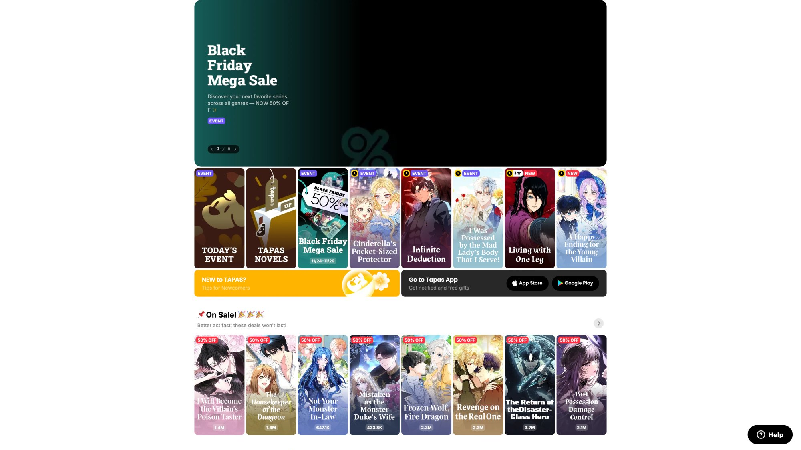

### How Many Subscribers Do You Need to Earn on Tapas?

Before you can earn anything on Tapas, you need to hit specific subscriber milestones. You need **100 subscribers** to enable ads on your series ([Tapas creator documentation](https://www.creators.tapas.io/earning-money)). You need **250 subscribers** to activate Ink support for reader tipping ([Tapas support program details](https://www.creators.tapas.io/earning-money)). And you need around **2,000 subscribers** and a specific format to even *pitch* for Premium deals ([Tapas forum discussions](https://forums.tapas.io/t/what-do-you-have-to-do-to-get-featured-on-tapas-and-how-much-do-you-earn-getting-featured-and-on-ads-if-not-featured/53876)).

New creators earn exactly zero while building their audience. And even after hitting these thresholds, the earnings are underwhelming.

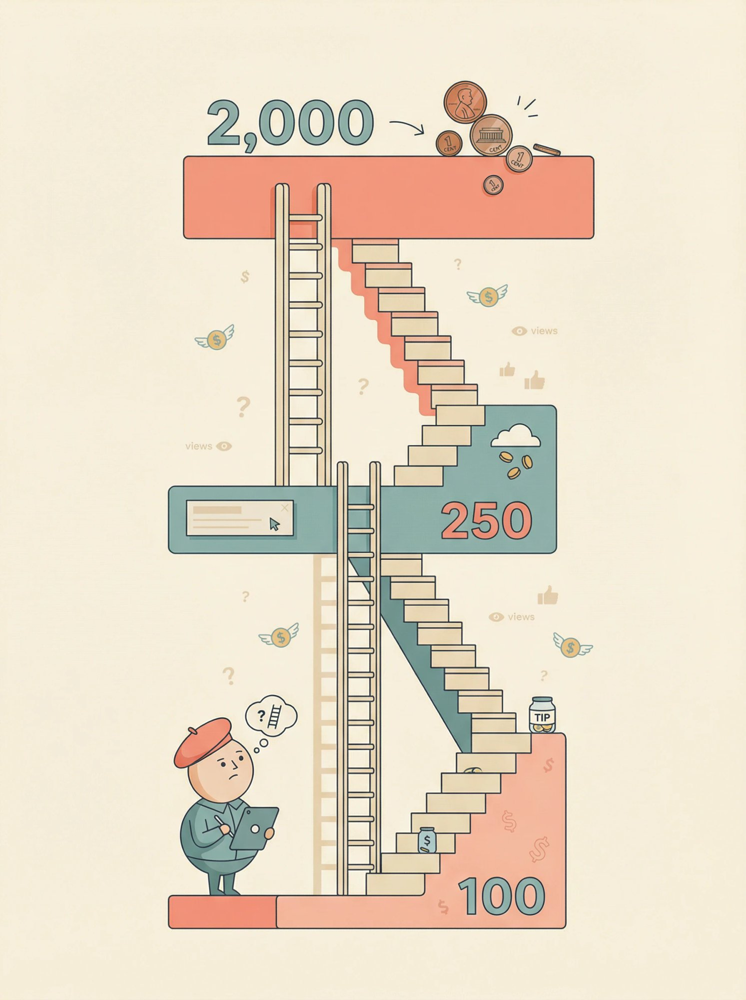

### How Much Do Tapas Creators Actually Earn?

Tapas shares **70% of ad revenue** with creators, keeping 30% for themselves. That sounds reasonable on paper. But ad revenue depends on views, and Tapas's audience is smaller than platforms like WEBTOON.

One Tapas creator shared their real numbers on the [Tapas forums](https://forums.tapas.io/t/what-do-you-have-to-do-to-get-featured-on-tapas-and-how-much-do-you-earn-getting-featured-and-on-ads-if-not-featured/53876): with around 750 subscribers, their monthly ad earnings were **$0.06 to $0.50**. Not $6. Not $50. *Cents*.

You also can't withdraw until you've accumulated at least $25, and the 250 subscriber requirement applies specifically to unlocking Ink support (tipping), while ad revenue requires only 100 subscribers to enable ([Tapas Help Center](https://help.tapas.io/hc/en-us/articles/360007605774-How-do-I-make-money-on-Tapas)). So those pennies just sit there.

Ink donations help, but they're unpredictable. Tapas gives creators [100% of Ink donations after payment processing fees](https://www.creators.tapas.io/earning-money), which is generous. But only a tiny fraction of readers actually tip, and you need that 250-subscriber minimum to unlock the feature.

### Is Tapas Premium Worth It?

Tapas Premium deals *can* be lucrative. The platform contracts you to release episodes behind a paywall, and you get advances or revenue share from paid chapter sales. But there are catches.

**You need a large, engaged audience already.** Premium pitches typically require ~2,000 subscribers and long-form, vertical-scroll format comics.

**Premium defaults to exclusivity, though non-exclusive options exist.** Series on Premium are exclusive unless otherwise agreed upon, but Tapas offers both exclusive and non-exclusive contracts if you negotiate ([Tapas Help Center](https://help.tapas.io/hc/en-us/articles/360059183553-What-does-a-Premium-Novel-contract-look-like-)). This limits your diversification unless you specifically request flexibility.

**Acceptance is competitive.** Tapas Premium is selective, requiring creators to first succeed in Early Access or Creator Bonus Program and meet quality standards, though specific acceptance rates are not publicly disclosed.

Tapas's native monetization works as a supplement, not a foundation. If you want to actually earn a living from serial content, you need to look beyond what Tapas offers by default. Understanding [how platform fees really affect your take-home pay](https://www.patron.com/blog/post/how-to-calculate-your-true-patreon-take-home-pay-2025/) is the first step toward making smarter choices.

## How Rolling Paywalls Help Creators Earn More

Traditional membership like Patreon platforms treat your content like a generic feed of posts. But serial content ([webcomics](https://www.patron.com/blog/category/webcomics/), chapter-based fiction, episodic [podcasts](https://www.patron.com/blog/category/podcast/)) works differently. You're telling a *story* over time. Rolling paywalls are designed specifically for this.

### What Is a Rolling Paywall and How Does It Work?

With a standard paywall, content is either free or locked forever. This creates a problem for serial creators. Lock everything and new readers can't discover you, so growth stalls. Free everything and superfans have no reason to pay.

Rolling paywalls solve both problems. New episodes release to paying supporters first. After a delay you choose (one week, two weeks, a month), those episodes automatically unlock for free readers.

**This means your archive keeps growing and attracting new readers through search and social.** Paying supporters always get something valuable (early access), and free readers can still enjoy your work and eventually convert when they catch up.

One creator described it perfectly: rolling paywalls *"preserve early access value while turning your archive into a discovery funnel"* ([Patron blog on webcomic monetization](https://www.patron.com/blog/post/how-to-monetize-a-webcomic/)).

### Why Do Rolling Paywalls Convert Readers to Subscribers?

[Rolling paywalls](https://www.patron.com/blog/post/what-is-a-rolling-paywall/) tap into real reader behavior. New readers find your free archive and start consuming. Serial content is addictive by design. They read through your backlog. Then they hit your most recent free episode. The story doesn't end. The next chapter exists, but it's supporter-only for another week. A few dollars per month to find out what happens *right now* vs. waiting weeks? Many readers make the jump. Once subscribed, readers stay subscribed. They don't want to fall behind again. The early access becomes part of their routine.

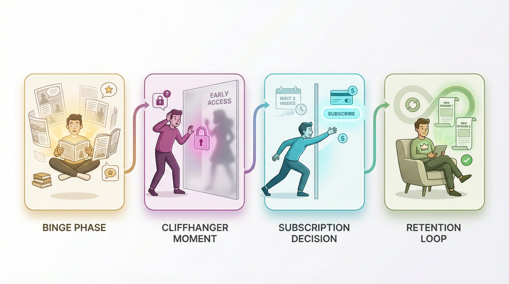

Rolling paywalls offer strategic advantages for serial creators by combining early-access revenue with discovery through unlocking backlogs, making them well-suited for serialized content models.

## Which Membership Platform Pays Creators the Most?

The membership platform you choose directly affects how much you keep from supporter contributions. And in 2025, there are [meaningful differences in platform fees](https://www.patron.com/blog/post/patreon-fee-changes-2025/).

### Membership Platform Fees Compared (2025)

| Platform | Platform Fee | Best For | Key Consideration |
| --- | --- | --- | --- |
| Patreon | 10% | General creators | High name recognition, but [fees add up significantly](https://www.patron.com/blog/post/how-to-calculate-your-true-patreon-take-home-pay-2025/) |
| [Patron](https://patron.com/) | 1% | Sequential content creators | Rolling paywalls, series structure built-in |
| Ko-fi | 0% tips / 5% memberships | Casual supporters | Great for one-off donations |

*Note: All platforms charge additional payment processing fees (~2.9% + $0.30 per transaction through Stripe).*

### How Much More Do You Keep on a 1% vs 10% Platform?

The gap between 1% and 10% might not seem huge. So let's run the numbers on $1,000 in monthly supporter revenue:

| Platform | Platform Fee | Processing (~3%) | You Keep |
| --- | --- | --- | --- |
| Traditional 10% platform | $100 | ~$30 | ~$870 |
| [Patron](https://patron.com/) | $10 | ~$30 | ~$960 |

**That's $90 more per month in your pocket with** [**Patron**](https://patron.com/) **vs. traditional platforms.** Over a year, that's $1,080. Over five years building your audience, it adds up to thousands of dollars.

As we noted in our [webcomic monetization guide](https://www.patron.com/blog/post/how-to-monetize-a-webcomic/): *"those differences add up significantly"* over a creator's career.

### Why Patron Is Built for Serial Content Creators

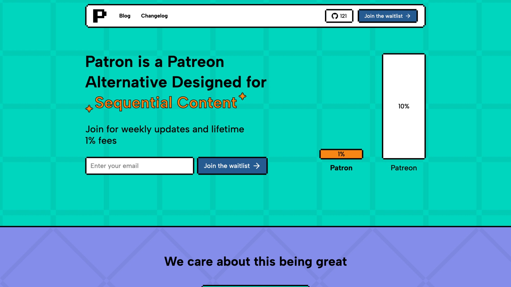

Most membership platforms were built for general creators posting updates, not for people telling stories in episodes. [Patron](https://patron.com/) is different.

**Series Structure Built-In**  
Instead of a generic post feed, [Patron](https://patron.com/) organizes content into series with episodes. This matches how webcomics and serial fiction actually work.

**Automated Rolling Paywalls**  
Set your [paywall window](https://www.patron.com/blog/post/what-is-a-rolling-paywall/) (for example, 2 weeks of early access), and episodes automatically unlock on schedule. No manual work each time.

**Episode Scheduling**  
Plan your release calendar in advance. Schedule episodes to drop for supporters, then schedule when they go public.

**1% Fee Philosophy**  
We built [Patron](https://patron.com/) with the belief that platforms shouldn't take 10% of a creator's income. [Patron charges just 1%](https://www.patron.com/blog/post/how-to-monetize-a-webcomic/), keeping creators as close to 99% as possible after payment processing.

**Open Source**  
[Patron](https://patron.com/) is [open-source under Apache 2.0](https://github.com/patroninc/patron). You can inspect the code, self-host if you're technical, or just trust that there's nothing hidden. This transparency matters for creators building their business on a platform.

### How Do Traditional Membership Platforms Compare?

Traditional membership platforms like Patreon have been around longer and have strong name recognition. Over [25 million fans have paid for creator memberships](https://www.patron.com/blog/post/how-to-monetize-a-webcomic/) across these platforms, with [$10+ billion paid to creators since launch](https://www.patron.com/blog/post/how-to-monetize-a-webcomic/).

That familiarity can reduce friction when asking readers to support you. But the trade-off is real: new creator accounts now face a [10% platform fee](https://www.patron.com/blog/post/patreon-fee-changes-2025/), plus payment processing. You're keeping roughly 85% of what supporters pledge.

Traditional platforms also offer tier management, messaging, analytics, and [free follower tiers](https://www.patron.com/blog/post/how-to-monetize-a-webcomic/) that let fans follow without paying (useful for later conversion). These features work well for general content, but they're not optimized for episodic storytelling the way [Patron](https://patron.com/) is.

### Should You Use Ko-fi for Tips or Memberships?

Ko-fi took a different approach. It started as a simple "buy me a coffee" tip jar and later added memberships.

Ko-fi charges [zero platform fee on one-time donations](https://www.patron.com/blog/post/ko-fi-vs-patreon-which-platform-is-best-for-creators/). Memberships and shop sales incur a [5% fee](https://www.patron.com/blog/post/ko-fi-vs-patreon-which-platform-is-best-for-creators/), or 0% if you pay for Ko-fi Gold. [Instant payouts via PayPal or Stripe](https://www.patron.com/blog/post/ko-fi-vs-patreon-which-platform-is-best-for-creators/) mean you get your money fast.

Ko-fi is excellent for casual support. Readers who aren't ready for a monthly commitment can still show appreciation with a one-time tip. But its membership features are simpler than dedicated platforms. Think of Ko-fi as a low-friction option for *light* supporter perks, not a full-featured creator economy tool.

Many creators [use Ko-fi alongside their primary membership platform](https://www.patron.com/blog/post/ko-fi-vs-patreon-which-platform-is-best-for-creators/). One handles recurring subscriptions with early access. The other captures casual tips from occasional readers.

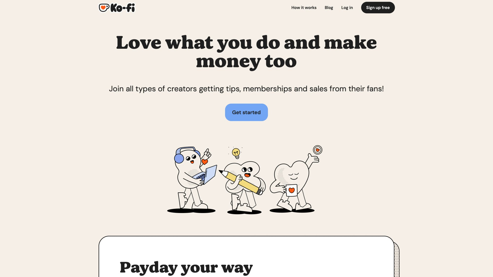

## How to Make Money From One-Time Tips and Donations

Not every reader wants a monthly subscription. Some just want to say *"thanks"* once and move on. Making this easy can add meaningful income with zero ongoing obligation on your part.

### Why One-Time Donations Are Worth Setting Up

One-time donations won't make you rich. But they serve important functions. Readers who aren't ready to commit $5/month might happily drop $3 once, so the barrier to entry is low. Tips are appreciation for work already done, so you don't owe anything extra. Unlike Tapas's 250-subscriber threshold for Ink, external tip jars work from day one. A handful of $5 tips can pay for your domain name, art supplies, or software subscriptions.

### Best Tip Jar Platforms for Creators

**Ko-fi** remains the go-to for tips because of that [zero platform fee on donations](https://www.patron.com/blog/post/ko-fi-vs-patreon-which-platform-is-best-for-creators/). A $5 "coffee" goes almost entirely to you (minus payment processing).

**PayPal.me** links work too, though PayPal's interface isn't designed for creator appreciation. It's just money transfer.

**Buy Me a Coffee** is similar to Ko-fi, with simple setup and low friction.

### Tapas Ink vs External Tip Jars: Which Is Better?

If you've unlocked Ink support on Tapas, you might wonder why you'd need an external tip option too. External tips have no threshold. You can set up Ko-fi on day one, before you have 250 Tapas subscribers. Followers from Twitter, Instagram, or your own website can't use Ink. They need somewhere else to support you. Some people have Ko-fi accounts. Some prefer PayPal. Offering options captures more support.

Use both if you qualify for Ink. [Tapas gives 100% of Ink to creators after processing fees](https://www.creators.tapas.io/earning-money), so there's no downside to keeping it active alongside external options.

### How to Ask for Tips Without Being Pushy

Nobody likes pushy donation requests. But gentle reminders work. Add a Ko-fi link to your Tapas bio and personal website. Mention it briefly at the end of episodes with something like *"If you enjoyed this chapter, you can buy me a coffee to support more updates."* Keep it optional and appreciative, not desperate.

As noted in our [monetization guide](https://www.patron.com/blog/post/how-to-monetize-a-webcomic/), making your tip link visible with simple language like *"if you'd like to support my work, consider leaving a tip"* works fine.

## How to Sell Merchandise and Run Crowdfunding Campaigns

Some of your biggest fans want more than digital access. They want something physical. T-shirts, prints, books, plushies. Merchandise and crowdfunding tap into that desire.

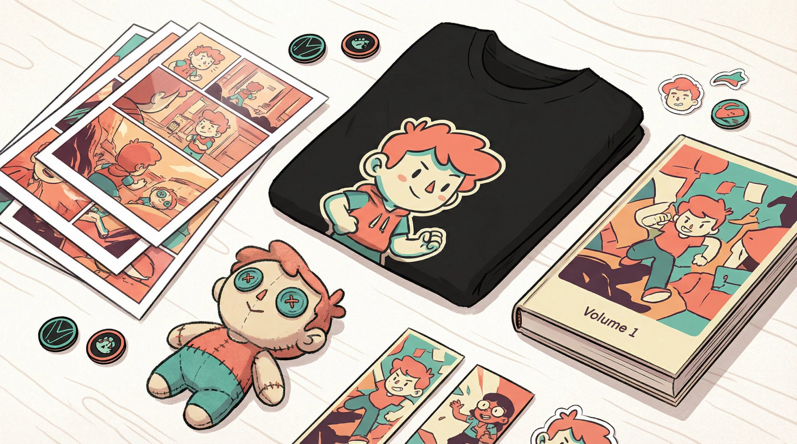

### How to Sell Merch Without Upfront Inventory Costs

Print-on-demand (POD) services let you sell merch without upfront costs. You upload designs, they handle printing and shipping, you keep the profit margin you set.

Popular POD options include Printful, Teespring, and Redbubble for apparel and accessories. Tapas Merch Shop works if you qualify. You can also sell digital products like PDF compilations through various marketplaces.

**Tapas Merch Shop** requires [500+ subscribers and keeps 100% of the profit margin for you](https://www.creators.tapas.io/earning-money). It's convenient if you're eligible, though the program has been in a limited beta phase with access restricted to select creators. Creators meeting the 500 subscriber threshold can contact [merch@tapasmedia.co](mailto:merch@tapasmedia.co) for inquiries.

External POD services offer more flexibility. You control pricing, product selection, and can sell to anyone, not just Tapas readers.

You need a real fanbase before merch works. Merch sales correlate with emotional connection and recognizable characters. Start thinking about merch once you have several thousand engaged readers who'd actually wear your art on a shirt.

### How to Fund a Print Edition With Kickstarter

Kickstarter has become the standard for funding webcomic and webnovel print editions. You create a campaign for your project like "Volume 1 print run." Fans pledge money for reward tiers ranging from PDF to paperback to signed hardcover to merch bundles. If you hit your funding goal, you use the money to produce and ship rewards. Kickstarter takes around 5%, plus around 3% for payment processing.

Crowdfunding beats trickling sales for several reasons. Limited campaign windows motivate pledges through urgency. Stretch goals build excitement by offering bonuses at funding milestones. Printing 500 books at once costs less per unit than POD, giving you economies of scale.

The numbers are real. Comics projects on Kickstarter raised [$46.5 million in 2024](https://www.patron.com/blog/post/how-to-monetize-a-webcomic/), a 34% increase from the previous year. The average successful comics campaign raised [around $17,500](https://www.patron.com/blog/post/how-to-monetize-a-webcomic/), with a 77.8% success rate for that year ([ICv2](https://icv2.com/articles/news/view/59286/comics-kickstarter-up-dramatically-2024)).

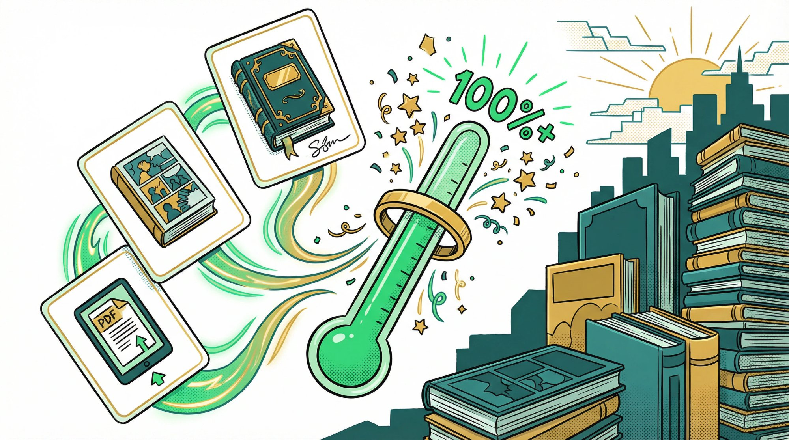

Some campaigns go massive. The creator of *Order of the Stick* famously raised [over $1.25 million to print his webcomic compilations](https://www.theguardian.com/books/2012/feb/22/author-raises-1m-self-publish-webcomic), far exceeding his initial goal. His campaign demonstrated that dedicated fans will pay premium prices for quality physical products they love.

### What Makes a Kickstarter Campaign Successful?

From our [Kickstarter guide](https://www.patron.com/blog/post/how-to-monetize-a-webcomic/), calculate your real costs including printing, shipping for both domestic and international, packaging, platform fees, and a cushion for surprises. Build anticipation beforehand. Don't launch cold. Tease the campaign to your audience so Day 1 has momentum. Offer compelling tiers at different price points like digital PDF at $10, physical book at $25, and deluxe signed bundle at $50. Communicate consistently. Backers who feel updated and valued become repeat supporters for future projects.
    

## How to Grow Your Audience by Publishing on Multiple Platforms

Tapas isn't the only place to publish. **Expanding where you post can significantly grow your audience**, which then feeds into all the monetization methods above.

### Does Cross-Posting to Multiple Platforms Actually Help?

Each platform has its own community. Some readers use WEBTOON exclusively. Others prefer Tapas. Fiction readers might live on [Royal Road](https://www.patron.com/blog/category/royal-road/). By publishing on multiple platforms, you cast a wider net.

More readers means more potential membership supporters, more merchandise customers, bigger crowdfunding campaigns, and less dependence on any single platform's algorithm or policy changes.
    

### Best Platforms for Webcomic Creators

**WEBTOON Canvas** has a larger audience than Tapas. They offer [50% ad revenue sharing for creators who hit 1,000 subscribers and 40,000 monthly page views](https://www.patron.com/blog/post/how-to-monetize-a-webcomic/). Cross-posting on both Tapas and WEBTOON maximizes exposure. For a deeper look at platform selection, check out our guide on the [best platform for webtoon creators](https://www.patron.com/blog/post/best-platform-for-webtoon-creators/).

**GlobalComix, ComicFury, and others** each have their own reader bases. The extra work of maintaining multiple mirrors is minimal if you're already creating episodes.

### Best Platforms for Serial Fiction Writers

[**Royal Road**](https://www.patron.com/blog/category/royal-road/) is massive for fantasy, LitRPG, and progression fiction. It has no direct monetization, but the audience is huge. Many successful web novelists post free chapters on Royal Road and monetize through memberships.

**Wattpad** has Paid Stories (invitation-based). **Webnovel** offers contracts but often requires exclusivity. Evaluate whether the trade-offs make sense for your situation.

### Should You Take an Exclusive Platform Deal?

Exclusive deals with platforms (Tapas Premium, WEBTOON Originals, Webnovel contracts) can provide stable income and promotion. But you often give up the ability to post elsewhere or run your own membership for that content.

Some independent creators find that staying independent and monetizing through fan support is more lucrative long-term, though outcomes vary based on audience size, engagement, and content type. As one veteran creator advised:

> *"Unless you have a big company marketing for you, give your content away free to build buzz, then sell things to the people who already love it"* ([The Guardian](https://www.theguardian.com/books/2012/feb/22/author-raises-1m-self-publish-webcomic)).

This doesn't mean exclusive deals are always bad. If a platform offers significant promotion and a fair revenue split, it might be worth it. Just go in with eyes open about what you're trading away.

### Why Every Creator Should Have Their Own Website

Running your own site gives you full control. You can display ads via Google AdSense, and high-traffic comics sites earn hundreds per month. You can embed your membership platform and tip jars directly. You can build an email list that no algorithm can touch. You can create a permanent home that survives platform changes.

Many creators post on Tapas and [WEBTOON](https://www.patron.com/blog/category/webtoon/) for discovery, then funnel dedicated fans to their own site for the best experience and direct support options.

## How Much Do Top Serial Content Creators Actually Earn?

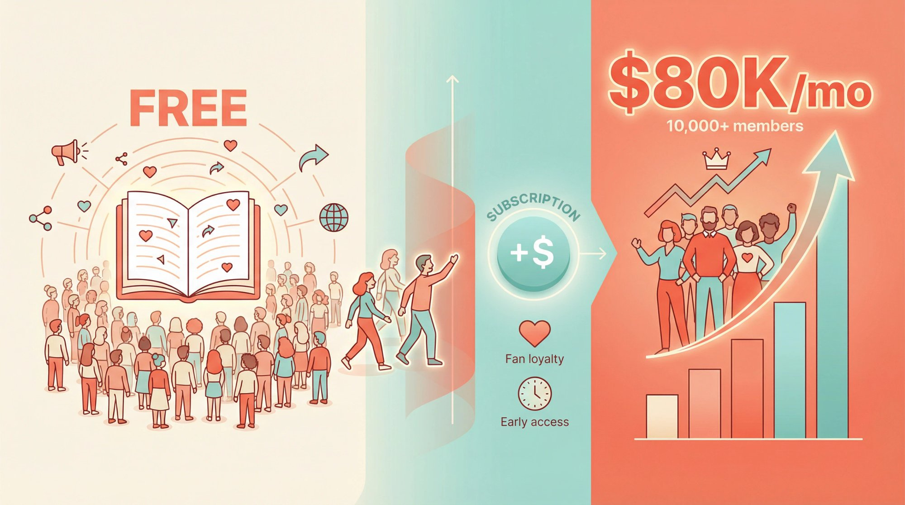

Theory is nice. But what do these numbers actually look like for real creators?

| Creator | Platform Following | Paying Supporters | Monthly Income |
| --- | --- | --- | --- |
| Zogarth (*The Primal Hunter*) | Massive Royal Road following | 10,000+ paying members | ~$72,800-$82,500/month |
| David M. Willis (*Dumbing of Age*) | Independent webcomic | ~3,000 supporters | Estimated $6,000-$20,000/month |

*Sources: Public creator earnings data from membership platform analytics (Graphtreon). Data as of late 2025. Note: Exact earnings figures vary by tracking source and are not publicly disclosed by all creators.*

### How Zogarth Makes $80K+ Per Month From Free Web Fiction

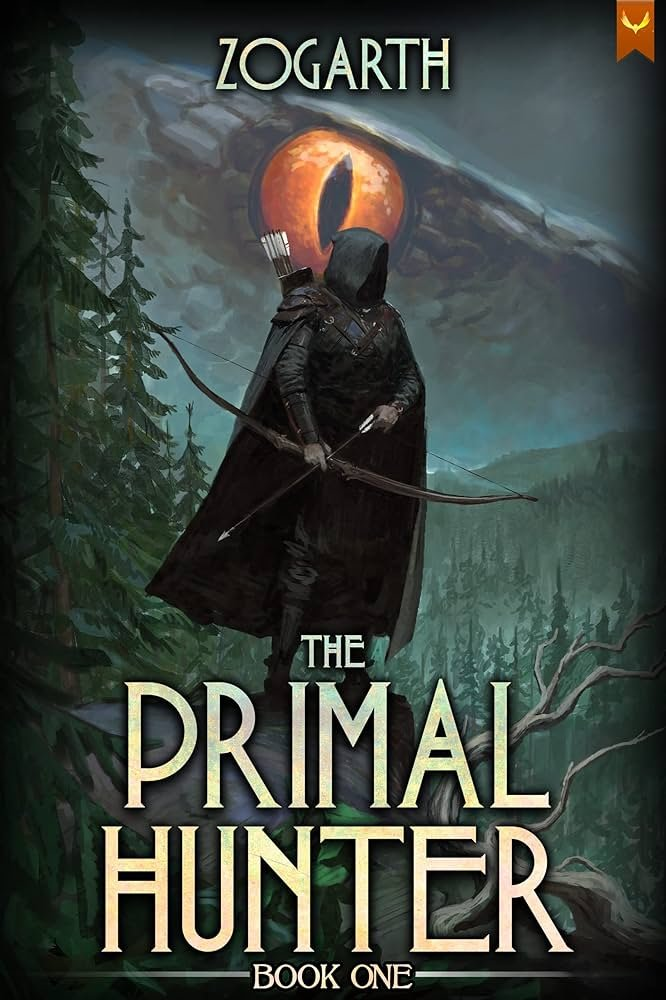

Zogarth writes *The Primal Hunter*, a fantasy web novel. He publishes chapters free on [Royal Road](https://www.patron.com/blog/category/royal-road/) to build an audience, then offers early access chapters and bonus content through memberships.

The result? Over 10,000 paying supporters contributing approximately $72,800-$82,500 per month as of late 2025, with income figures varying by tracking source ([Graphtreon](https://graphtreon.com/creator/Zogarth)). That puts *The Primal Hunter* among the top-earning fiction projects on membership platforms.

Free availability helped the story go viral. Memberships monetized the most engaged readers who couldn't wait for new installments. The two work together.

### How David M. Willis Earns a Full-Time Living From an Independent Webcomic

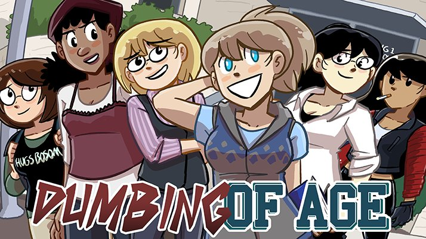

David M. Willis has run *Dumbing of Age*, a slice-of-life [webcomic](https://www.patron.com/blog/category/webcomics/), independently for years. The comic is free to read on his own website. He offers supporters bonus strips and early updates.

His comic has approximately 3,000 supporters with estimated earnings in the range of $6,000-$20,000 per month as of 2025, according to Graphtreon tracking data. That steady income lets him create comics full-time on his own terms.

He built this without Tapas, WEBTOON, or any major platform. His audience found him through the comic's site and social media. Memberships handle monetization. A few thousand true fans willing to chip in a few bucks each adds up to a real salary.

## How to Start Monetizing Your Content Today

You don't need to do everything at once. Pick one monetization method to start, get it running, then add more over time.

### What to Do if You Have Under 500 Tapas Subscribers

Set up a tip jar first. Ko-fi takes five minutes. Put the link everywhere. You can accept support from day one, unlike Tapas's 250-subscriber threshold. Then cross-post. If you're only on Tapas, also publish on [WEBTOON](https://www.patron.com/blog/category/webtoon/) Canvas for comics or [Royal Road](https://www.patron.com/blog/category/royal-road/) for fiction. More readers means faster growth. Then plan ahead. Think about what perks you could offer in a membership. [Early access works for almost everyone](https://www.patron.com/blog/post/how-to-monetize-a-podcast-with-early-access-not-ads/). Start building that content buffer now.

### What to Do if You Have 500+ Tapas Subscribers

Launch a membership first. Pick [Patron](https://patron.com/) if rolling paywalls and serial content structure matter to you. You already have readers who care. Give them a way to support you. Then build your content buffer. Get 2-4 weeks of episodes ahead so supporters always get early access. This is the core membership value. Then consider merchandise. With a larger audience, a portion will buy physical products. Start simple with one t-shirt design and one print.

### What to Do if You Have 1,000+ Paying Supporters

Diversify income streams first. Memberships, merch, crowdfunding for print editions. Don't put everything in one basket. Then plan a Kickstarter. If you have 1,000+ engaged fans, a print campaign is viable. Start planning months in advance. Then optimize fees. If you're on a 10% platform, [calculate what you'd keep on Patron's 1% fee](https://www.patron.com/blog/post/how-to-calculate-your-true-patreon-take-home-pay-2025/). The math might surprise you.

## Frequently Asked Questions

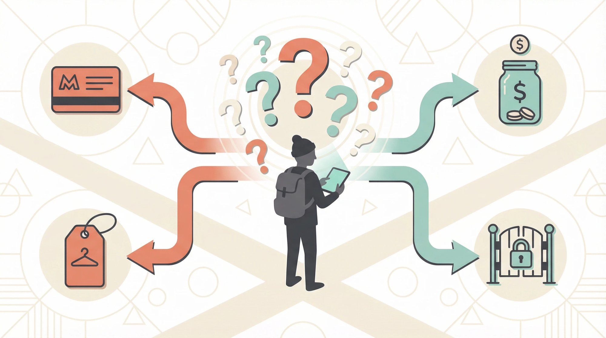

### Can I Use Multiple Monetization Platforms at Once?

Yes. Many creators run a primary membership (like [Patron](https://patron.com/)) for recurring support *and* a Ko-fi for one-time tips. You can also sell merch through a third service simultaneously. Different fans prefer different options.

### How Much Can I Realistically Earn From Tapas Alternatives?

This depends entirely on your audience size and engagement. A creator with 500 dedicated fans might earn $500-2,000/month from memberships. Top creators with tens of thousands of supporters earn five or six figures monthly. The success stories in this guide (up to $82k/month) represent the upper end, but even modest fan support can cover meaningful expenses.

### How Many Readers Do I Need Before Launching a Membership?

You can technically launch with zero audience, but expect zero supporters. Most creators wait until they have 100-500 engaged readers before formally launching. The key is having readers who care about your work, not just passive followers.

### Do I Need to Leave Tapas to Monetize Elsewhere?

No. You can keep publishing on Tapas for discovery while running memberships and tip jars externally. The exception is if you sign an exclusive Premium deal with Tapas. Read any contract carefully before committing.

### How Do Rolling Paywalls Work Exactly?

You set a delay period (such as 2 weeks). When you post a new episode, paying supporters see it immediately. After 2 weeks pass, that episode automatically becomes free for all readers. Your newest content is always subscriber-only, while older content stays free for discovery. Learn more in our complete guide to [what is a rolling paywall](https://www.patron.com/blog/post/what-is-a-rolling-paywall/).

### Are Tapas Premium Deals Worth Pursuing?

Tapas Premium can provide stable income if you get accepted. But you typically need ~2,000 subscribers to qualify, and deals often default to exclusivity (though non-exclusive options are available upon request). This means you may not be able to run a membership for that content unless you negotiate different terms. Whether it's worth it depends on the specific terms offered. Some independent creators earn more with external memberships and full creative control, though outcomes vary by situation.

### Why Does Patron Only Charge 1%?

We built [Patron](https://patron.com/) with the belief that platforms shouldn't take 10% of creator earnings. By staying lean and [open-source](https://github.com/patroninc/patron), we keep costs low enough to pass savings to creators. The goal is for you to keep as close to 99% as possible (after payment processing).

### Should I Build My Own Website or Just Use Platforms?

Both, ideally. Use platforms (Tapas, WEBTOON, [Royal Road](https://www.patron.com/blog/category/royal-road/)) for discovery and reaching new readers. Use your own site for direct relationships with dedicated fans. Your website is the one thing no algorithm change can take away.

### What Happens if My Content Gets Banned on a Platform?

This is another reason to diversify. If you're only on one platform and face issues, your entire income can vanish overnight. For creators worried about platform policies, our guide on [what to do if your content gets banned](https://www.patron.com/blog/post/what-to-do-if-patreon-content-got-banned/) covers recovery strategies.

### Should I Offer Annual or Monthly Membership Options?

Both have advantages. Monthly is lower commitment for new supporters, while [annual memberships](https://www.patron.com/blog/post/annual-vs-monthly-memberships-for-creators/) provide more predictable income and better retention. Many creators offer both options.

### How Should I Price My Membership Tiers?

Pricing depends on your content type and audience. For webcomics, check out our guide on [how to price your webcomic tiers](https://www.patron.com/blog/post/how-to-price-your-webcomic-tiers/) for specific strategies and tier structures that work.

## Start Building Your Creator Income Beyond Tapas

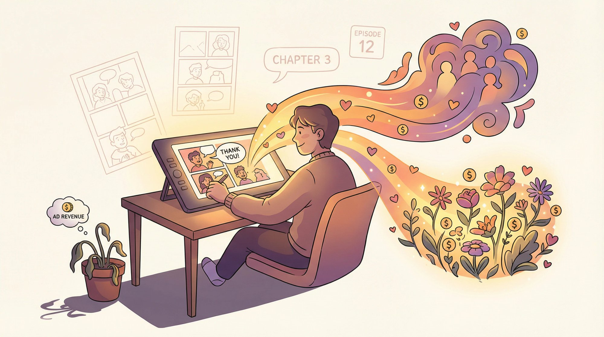

The webcomic and web fiction market hit [$7.6 billion in 2024 and is heading toward $8+ billion in 2025](https://www.patron.com/blog/post/how-to-monetize-a-webcomic/). Real money exists in this space for creators who approach it strategically.

Tapas gave you a starting point. Now it's time to expand beyond what one platform offers. The creators earning sustainable incomes aren't relying on ad pennies or hoping for Premium deals. They're building diverse revenue streams: memberships with [rolling paywalls](https://www.patron.com/blog/post/what-is-a-rolling-paywall/), merchandise for superfans, crowdfunding for special projects, and audiences across multiple platforms.

If you're looking for a membership platform built specifically for how serial content works, [**Patron**](https://patron.com/) was designed for creators like you. Rolling paywalls, series structure, episode scheduling, and just 1% platform fees so you keep more of what your fans contribute.

But whatever tools you choose, the core principle stays the same. Build an audience that loves your work, then give them ways to support you directly. That's how Tapas creators turn passion projects into sustainable careers.

Your readers are ready to support you. Give them the chance.

Check out our [blog](https://www.patron.com/blog/) for more creator guides, platform comparisons, and monetization strategies. And follow our [changelog](https://www.patron.com/changelog/) to stay updated on new features as we build them.

## Sources and References

All data current as of November 2025 unless otherwise noted.

Tapas creator earnings and features from [Tapas Earning Money Documentation](https://www.creators.tapas.io/earning-money). Creator earnings discussions from [Tapas Forums](https://forums.tapas.io/t/what-do-you-have-to-do-to-get-featured-on-tapas-and-how-much-do-you-earn-getting-featured-and-on-ads-if-not-featured/53876). Webcomic monetization strategies from [Patron Blog](https://www.patron.com/blog/post/how-to-monetize-a-webcomic/). Ko-fi vs membership platform comparison from [Patron Blog](https://www.patron.com/blog/post/ko-fi-vs-patreon-which-platform-is-best-for-creators/). Rolling paywall explained at [Patron Blog](https://www.patron.com/blog/post/what-is-a-rolling-paywall/). Platform fee analysis from [Patron Blog](https://www.patron.com/blog/post/patreon-fee-changes-2025/). Crowdfunding success stories from [The Guardian](https://www.theguardian.com/books/2012/feb/22/author-raises-1m-self-publish-webcomic). Kickstarter comics statistics from [ICv2](https://icv2.com/articles/news/view/59286/comics-kickstarter-up-dramatically-2024). Creator earnings tracking from [Graphtreon](https://graphtreon.com/).