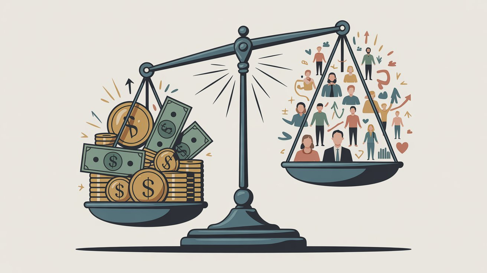
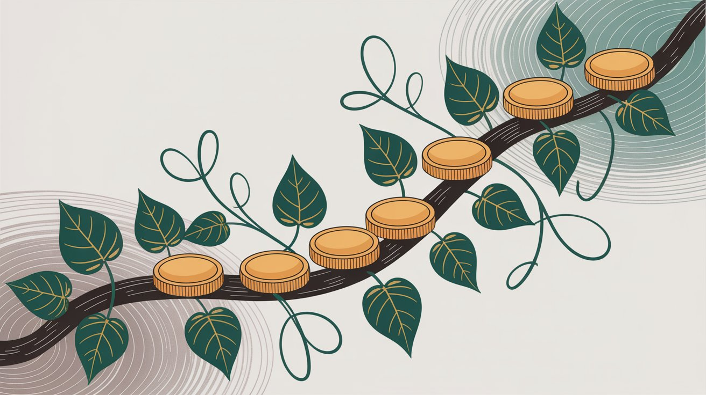
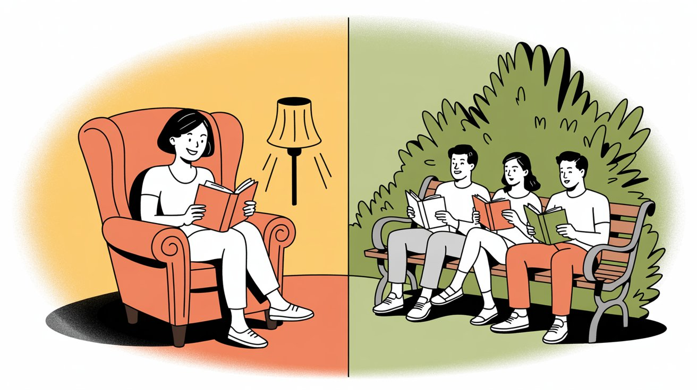
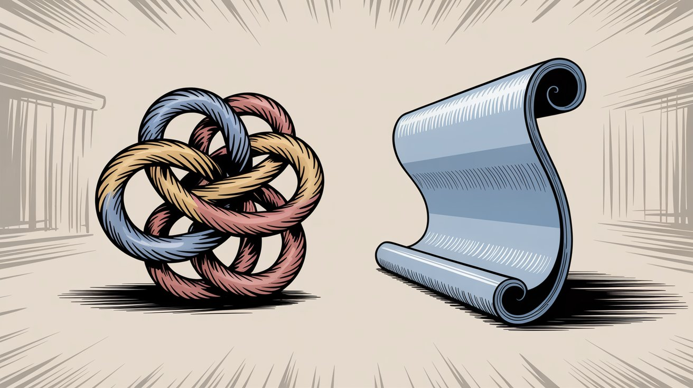
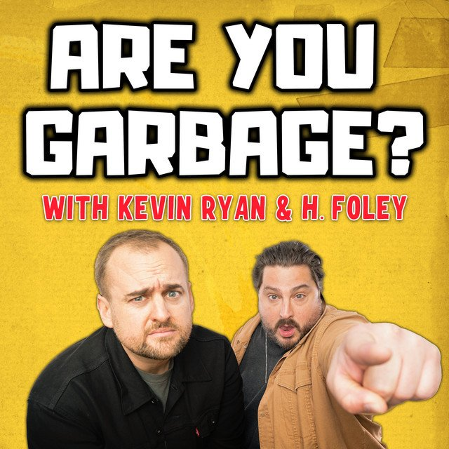
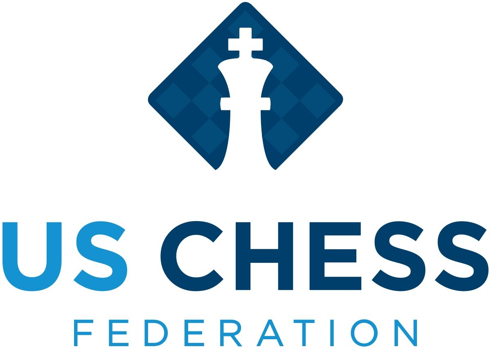
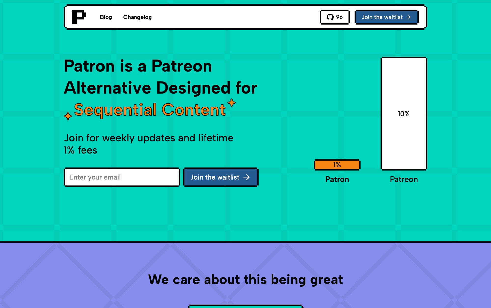

Sequential content creators face a frustrating dilemma. Do you put your work behind a paywall and earn money but kill your audience growth? Or do you give everything away free and watch your reach explode while your bank account stays empty?

A **rolling paywall** solves this. It's a content release model where new episodes start exclusive to paying supporters, then automatically become free after a set period. Your most dedicated fans get early access (and you get **recurring revenue**), while everyone else can still enjoy your work for free if they're willing to wait.

Here's how it works mechanically: You publish Chapter 8 today. Your subscribers read it immediately. Non-paying readers see it unlock for free in two weeks. By then, you've already released Chapter 9 to subscribers. The paywall keeps "rolling" forward with each new release.

The psychology is brilliant. Free readers discover your work, binge your archive, hit a cliffhanger at the paywall point, and subscribe to keep reading. Once they're subscribed, they stay subscribed because **falling weeks behind** in a story they love feels terrible. Meanwhile, your growing free archive continuously attracts new readers who might convert later.

[Patron](https://www.patron.com/) was built specifically around this model, automating the scheduling headaches and organizing content as series (not scattered posts) so readers can actually follow your story in order.

## Why Sequential Creators Need Rolling Paywalls

Traditional monetization strategies force impossible choices. **Hard paywalls** (everything locked behind payment forever) can generate revenue but destroy discoverability. New fans can't sample your work, so they bounce. You spend all your energy on marketing instead of creating.

**Free-only content** (hoping for tips or ad revenue) maximizes reach but leaves enormous money on the table. Only a tiny percentage of readers ever donate voluntarily, and ad rates are abysmal unless you're pulling millions of pageviews.

Rolling paywalls split the difference perfectly, especially for [webcomic creators](https://www.patron.com/blog/category/webcomics) and serialized fiction authors.

### How Rolling Paywalls Fix Creator Income

**1\. Early Monetization from Dedicated Fans**

Your most engaged readers *can't wait* to see what happens next in your story. They'll gladly pay a few dollars monthly for the privilege of reading immediately rather than waiting weeks. This creates **predictable, recurring subscription income** without requiring you to produce endless bonus content. Your regular episodes *are* the reward.

**2\. Eventual Free Access for Discovery**

Because content eventually unlocks, you're not permanently locking away your best marketing material. Every chapter you publish will live a second life as free content, bringing in search traffic, appearing in Google results, and getting shared on social media. Your archive becomes a **discovery funnel** that pulls in thousands of potential fans who can sample your work risk-free.

[Research on content paywalls](https://marketbrief.edweek.org/sales-marketing/what-is-geo-for-ai-and-why-are-k-12-companies-talking-about-it/2025/09) shows that gated content is essentially invisible to search engines and AI-driven search tools. Rolling paywalls fix this by ensuring older content becomes indexable and shareable.

**3\. Continuous Audience Funnel**

Your back catalog works constantly to convert casual readers into paying supporters. Someone discovers your comic at Chapter 50, binges 40 free chapters, gets hooked, hits the paywall at Chapter 40, and subscribes to read the rest. This funnel operates **24/7 without additional effort** on your part.

**4\. Reduced Paywall Friction**

Readers don't feel *priced out* of your work. They know they can follow your series for free if they're patient. This inclusive approach fosters goodwill and community. Free readers often view paying subscribers as "funding the project for everyone," creating a positive dynamic rather than resentment between audience segments.

**5\. Long-Term SEO and Evergreen Value**

Content that stays paywalled forever has no search presence. Marketing teams report better ranking when articles unlock after embargo periods. Some even accelerate unlocking trending pieces to capitalize on search momentum.

For sequential creators in 2025, where AI search is increasingly relevant, having freely accessible content ensures your work enters the public knowledge sphere and contributes to your discoverability.

### Why Creators Manually Do This Already

Thousands of creators on traditional membership platforms already use early access as their primary perk. Web fiction authors post stories free on Royal Road while keeping 5-10 chapters ahead on membership platforms for paying supporters. As chapters advance on the paid platform, older chapters trickle down to the free platform.

The problem? It's **clunky as hell**. You're juggling two platforms, managing dual posting schedules, and manually updating what's behind the paywall. [Traditional platforms don't have native auto-unlock](https://www.reddit.com/r/SideProject/comments/1mtpabr/i_just_bought_patroncom_by_flying_across_the/), so creators set reminders to manually flip posts from patron-only to public.

This demand for better infrastructure is exactly why platforms like [Patron](https://www.patron.com/) were built with [rolling paywalls as a core feature](https://www.patron.com/blog/post/how-to-monetize-a-webcomic/), not an afterthought.

## How Rolling Paywalls Work Step-by-Step

Let's walk through a typical content lifecycle with a concrete example.

**Meet Jane.** She's a serialized fiction writer publishing a fantasy web novel. She just finished Chapter 8.

### Step 1: Release to Subscribers First

Jane publishes Chapter 8 on [Patron](https://www.patron.com/) as a supporter-only post. Her paying subscribers get immediate access. Free readers can only see up to Chapter 7 right now. Chapter 8 is behind the paywall.

### Step 2: Exclusivity Period

For the next week (Jane's chosen delay), Chapter 8 remains exclusive to subscribers. This rewards her paying fans with the thrill of being ahead in the story. During this time, Jane's engaged patrons discuss Chapter 8 in a private Discord channel, speculate about what happens next, and feel like insiders.

### Step 3: Scheduled Unlock

When Week 2 arrives, **Chapter 8 automatically unlocks** for everyone. The paywall "rolls" forward. Chapter 8 becomes free on Jane's public page just as she publishes Chapter 9 for her subscribers. On [Patron](https://www.patron.com/), this happens automatically on schedule. Jane doesn't lift a finger. The platform handles the timing mechanics.

### Step 4: Repeat and Archive Growth

This cycle continues with each release. Chapter 9 will unlock when Chapter 10 comes out. Over time, Jane's **entire back catalog** becomes free except the most recent few chapters. The paywall is a moving window covering only the latest content. New readers can start from Chapter 1, binge the entire free archive, and the story stays accessible to latecomers.

### Step 5: New Reader Conversion

Now consider a new reader discovering Jane's series when she has 40 chapters published. That reader can **binge 35 free chapters** from the beginning. By Chapter 35, they're completely invested in the plot and characters. They reach Chapter 36 and see: *"This chapter is available to subscribers. Subscribe now or check back on Friday for the free release."*

They're hooked. The story has them on the edge of their seat. The cost of a subscription (maybe $5/month) feels trivial compared to the agony of waiting two weeks to find out if the protagonist survives. Many readers at this point **subscribe immediately**.

Those who can't afford it or don't want to subscribe simply wait patiently. They'll get the chapters eventually. But many readers who love the story will pay because **nobody wants to put down a page-turner** they're obsessed with.

> **This lifecycle creates a win-win.** Paying subscribers continually get new content first. Free readers always have something to read and can gradually catch up. Jane doesn't choose between monetizing her work forever (losing potential fans) or giving everything away (earning nothing). She's **monetizing urgency and engagement**.

## Benefits for Creators Using Rolling Paywalls

Unlike one-time sales or sporadic donations, rolling paywalls encourage **recurring subscription income**. Fans subscribe for ongoing early access, providing predictable monthly support. This is similar to standard memberships, but with a crucial difference.

You're not under pressure to constantly produce *extra* exclusive content to justify the subscription. You're just delivering your regular episodes on an early schedule for supporters. Your normal content **is the reward**. You're selling time-limited exclusivity on each installment, not conjuring up entirely separate perks. [Many creators report](https://www.reddit.com/r/litrpg/comments/1jfqztc/why_is_the_advance_chapter_patreon_model_so/) that rolling paywall models feel sustainable because "most authors are already offering everything up for free. People just need to wait a bit for the next chapter."

You're not creating a two-tier content system. You're creating a two-tier *timing* system.

### Audience Growth Engine

Every piece of content eventually becomes free marketing material for your brand. Once a chapter rolls out to free, it can be shared on social media, linked in newsletters, posted on forums, and discovered via Google search. Over time you build a large free catalogue serving as a **sampling platter** for potential fans.

This is similar to the "freemium" strategy used by successful SaaS products. Hook users with free value, then convert the engaged ones to paid. [Web fiction and webcomic creators](https://www.patron.com/blog/category/webcomics) have used this approach for years (posting work free on their sites while offering advance episodes for paying fans). Rolling paywalls just streamline and formalize it.

### No Fan Left Behind

Because past content eventually opens up, you're not permanently locking out your wider audience. Even readers who don't pay can become avid consumers (and promoters) of your work. This leads to larger community, more word-of-mouth, indirect revenue (merch, live events, donations), and higher engagement overall.

Crucially, **fans never feel "priced out"** of following your series. At worst, they need patience. This fosters goodwill. Paying supporters often appreciate that the series is accessible to all eventually. Some see their patronage as "funding it for people who don't want to pay", similar to how public radio donors feel good about supporting content everyone can enjoy. That sense of contributing to the fandom increases loyalty.

### Long-Term SEO and Evergreen Value

Content paywalled forever is invisible to search engines and difficult for newcomers to stumble upon. With a rolling schedule, **every chapter will eventually live a second life as public content**, bringing in search traffic for keywords, appearing in Google results, and being usable as samples in portfolios or pitch decks.

In 2025, where AI-driven search is increasingly relevant, having an archive of freely accessible content expands your presence. Your work can be cited, referenced, and discovered through modern search methods.

### Community and Engagement

A rolling paywall naturally segments your audience by engagement level. Your most eager fans congregate around the newest releases (discussing them in supporter-only channels), while the broader audience discusses slightly older episodes in public spaces.

This staggered dynamic can keep discussion fresh for longer. When an episode goes public after a delay, a whole new wave of readers reacts to it, extending its lifespan in the conversation. You can announce the public release of Chapter 8 while privately releasing Chapter 10, creating **ongoing buzz** in both free and paid channels.

Finally, a financial reality: by converting readers into subscribers, you unlock **recurring income** that's often more substantial than ads or one-off sales for indie creators. Numerous webcomic artists report that subscription memberships become their largest income source, exceeding ad revenue or merch.

## Why Readers Love Rolling Paywall Models

They get what they want most: the **latest content immediately**. In a story with suspenseful narrative, this is huge. Readers *hate* waiting for the next installment. Many are happy to pay a few bucks monthly to avoid delays and support the creator.

One fan [compared it](https://www.reddit.com/r/litrpg/comments/1jfqztc/why_is_the_advance_chapter_patreon_model_so/) to buying the hardcover of a novel instead of waiting six months for the paperback: "I'm willing to pay a bit more to read it now."

That sense of **immediacy and exclusivity** is the draw. Subscribers also enjoy a closer connection to the creator (being part of the inner circle seeing releases first) and can participate in private discussions or feedback. Importantly, they know their money directly fuels creation of the story they love. There's a **patronage mentality** at play, not just a transaction.

### For Free Readers

They can still follow the story **without paying a cent**, as long as they're patient. This is enormous. It means your content remains inclusive and accessible. A free reader might always be a few weeks behind the cutting edge, but they avoid spoilers and catch up at their own pace.

If they love the series, subscribing is always an option later. If not, they still add to readership numbers and community. Free readers get a *delayed gratification* version of the experience. For many, that's perfectly acceptable. It's similar to how TV shows aired weekly on cable for paying subscribers but later came to free-to-air TV.

Free readers also benefit from the fact that **the series is more likely to continue** (because the creator is earning income from subscribers). Even non-paying fans indirectly benefit from subscriber support keeping the project financially viable.

### No One Feels Ripped Off

In some traditional paywall setups, resentment develops. "Why are these people getting it free while I paid?" or vice versa. With a rolling paywall, the value proposition is crystal clear: **you pay to get it now, or get it free later**.

Both reader types get the same content, just at different times. There's less sense that free readers are missing entire bonus storylines, or that paying readers are getting meaningless perks. The difference is speed and convenience, which people readily understand. It's like express shipping vs. free shipping that takes longer.

Creators typically make the schedule very transparent: "All new pages are available to subscribers every Tuesday and become free to all on Friday." When everyone knows the deal, it feels fair.

### Community Crossover

Free and paid readers can mingle in the fandom with relatively little friction. Since content fully reaches free readers (just later), everyone can discuss the story eventually.

Contrast this with a fixed paywall where free folks might *never* get certain chapters. That creates a split fandom where only some people know plot developments. Rolling paywalls ensure **everyone will be on the same page eventually**.

Fan communities often establish spoiler policies (don't spoil the latest subscriber-only chapter in public forums) which works well. Once the chapter is public, broader discussion opens up. This staggered release can generate multiple discussion waves, bringing more fans together over time.

> **In summary, readers control their trade-off: pay for VIP early access, or enjoy a free but lagged experience.** Many start as free readers and later upgrade when their excitement outweighs their patience. Others dip in and out (subscribing for a month to binge ahead, then pausing). The key is **no one is entirely shut out**. Anyone interested in your work can become a fan. The barrier to entry is zero.

## Rolling Paywall vs. Other Monetization Strategies

To appreciate rolling paywalls' strengths, let's compare them to other common creator monetization models.

| Model                      | Access                  | Growth    | Revenue          | Best For                                      |
|----------------------------|-------------------------|-----------|------------------|-----------------------------------------------|
| **Rolling Paywall**        | Timed exclusive to free | Excellent | Strong recurring | Sequential content (comics, fiction, podcasts)|
| **Hard Paywall**           | Paid only forever       | Poor      | High per user    | Premium niche content with existing audience  |
| **Free + Tips**            | All free                | Excellent | Unpredictable    | Building initial audience, ad-supported       |
| **Traditional Membership** | Manual management       | Good      | Good             | General creators, non-serial content          |
| **Free + Ads**             | All free                | Excellent | Scale-dependent  | High-traffic sites, broad appeal content      |

### Rolling vs. Hard Paywall

A **hard paywall** means content is 100% behind payment at all times. You must pay to access anything beyond maybe a teaser or intro. This is seen on some news sites and members-only platforms where *nothing* beyond a snippet is public.

**Pros of Hard Paywall:**

- Generates immediate revenue from loyal fans
- Creates strong sense of premium value (members-only feel)
- Works for highly specialized content (financial advice, exclusive podcasts)
    

**Cons:**

- Severely limits growth
- New readers have **no free entry point**
- Heavy marketing burden (convince people to pay before experiencing quality)
- Risky for serialized stories (new reader not ready to subscribe from Chapter 1 will just leave)
    

**Why Rolling is Different:**

Think of a hard paywall as a steel door versus a rolling paywall as a door that opens after a delay. Rolling paywalls preserve initial monetization (door is closed for new stuff) but remove it when content is no longer "new."

You sacrifice some short-term exclusivity for long-term audience accumulation. The result is often more sustainable. You still earn from core fans, and fence-sitters can preview your work eventually and possibly join later. In practice, creators who tried pure hard paywalls often found their growth stagnated, which is why many switched to rolling or hybrid approaches. Unless you already have a massive following dying to pay, hard paywalls are an uphill battle.

### Rolling vs. Free + Tip Jar

The **free + tip jar** model means all content is offered free, and you ask those who enjoy it to support you voluntarily via donations, one-time payments, or merch purchases. Webcomic artists and bloggers commonly use this early on. (For a deep comparison of donation-based platforms, check out our [Ko-fi vs Patron guide](https://www.patron.com/blog/post/ko-fi-vs-patreon-which-platform-is-best-for-creators/).)

**Pros of Free+Tip:**

- Maximum reach (zero friction for consumption)
- Great for building initial fanbase
- Fosters goodwill (nothing gated away)
- Can work with broad appeal content and indirect monetization
    

**Cons:**

- Tips and donations are **unpredictable and sparse**
- Only a tiny percentage of your audience ever donates
- Even if people love your work, many consume it free and move on
- Hard to earn a living without massive traffic or generous benefactors
- Can feel disheartening for creators putting in full-time effort
    

There's also a psychological effect: when content is completely free, some might subconsciously value it less and hesitate to pay for "nothing in return."

**Why Rolling is Different:**

Rolling paywalls introduce a **clear value proposition for payment**. You're not asking for donations. You're offering a transaction: pay to get something sooner. This taps into impatience and fandom, often converting more people than a no-strings-attached tip jar.

The content is still ultimately free (keeping broad reach benefits), but you create a **reason** for engaged readers to become patrons. Many creators start with free+tip and later add a rolling paywall tier once they have enough content and followers, realizing they can monetize the eagerness of their core fans without alienating others.

A rolling paywall tends to produce steadier income than hoping for spontaneous donations. (You can keep a tip jar alongside for those wanting to support without caring about early access, but most serious supporters will opt for the subscription perk.)

### Rolling vs. Traditional Fixed Membership

**Traditional fixed membership** (as commonly implemented) means you have membership tiers and decide what content is patron-only versus public. Many creators lock *all* substantive content for paying members only. For example, a novelist might post every chapter for patrons and share only the first few chapters with the public.

This is essentially a hard paywall on a membership basis. Some creators release occasional freebies to entice fans, but there isn't a built-in timed release schedule.

**Pros:**

- Proven system (thousands of creators use it successfully)
- Flexibility to offer various rewards and content types per tier
- Works well for content that might not be serialized or has lots of bonus material
- Reliable subscription paywall understood by fans
    

**Cons for Serial Stories:**

- **Logistical challenges**: All content lives in a scrolling feed of posts, not ideal for reading in order
- No native "series" organization (finding Chapter 1 vs Chapter 20 is tedious for new patrons)
- **Scheduling transition from paid to free wasn't a core feature** until recently
- Creators had to manually toggle posts from patron-only to public, or post things twice (once for patrons, later again for public)
- Error-prone and time-consuming
    

Traditional platforms noticed this use case and **introduced an early access scheduling feature** in 2025, showing the demand for rolling paywall functionality. But even with this update, their overall design still assumes a dichotomy between "patrons-only content" and "free content" without inherent series continuity.

Many creators maintain an external site (like Wattpad or Royal Road) for the free version of their story, using membership platforms purely for advanced chapters. It's a clunky workaround.

**Why Rolling is Different:**

[Patron](https://www.patron.com/) was [built specifically to streamline this early-access workflow](https://www.patron.com/blog/post/how-to-monetize-a-webcomic/). Instead of treating each post in isolation, Patron treats your content as **chapters in a series**, knows which ones are free vs. paywalled, and can **automatically unlock chapters** after the set time.

The reader experience is seamless. A new reader starts at Chapter 1 on the same platform, binges until hitting the paywalled point, and subscribes with one click to continue. No hopping between websites or confusion about which posts they can access. Free readers and paying readers are on the same site, just with different access at any moment. Patron also includes quality-of-life features like tracking a reader's last read chapter for easy resumption (tackling issues traditional platforms haven't addressed).

Another difference: Traditional fixed models mean if someone subscribes late, they immediately unlock *all* past posts at once (since those never went public). This can lead to **join-drop behavior**: a reader subscribes for one month, binges the entire 50-chapter archive, then cancels. The creator got one payment.

With a rolling schedule, much of that archive is already free to that reader. Only recent chapters are behind paywall when they subscribe, so it's about **keeping up with newest releases continuously**. It encourages ongoing support rather than one-time binge-unlock.

From the free perspective, a new reader doesn't feel penalized for discovering you late. They don't have to pay for your old chapters because those are free. They only consider paying for what's currently behind the curtain.

In short, traditional membership models and rolling paywalls are converging (as platforms add features like scheduled public release), but rolling paywall-centric platforms offer a **more tailored, automated approach**. If traditional platforms are general tools that can simulate a rolling paywall, [Patron's platform is purpose-built for it](https://www.patron.com/blog/category/guides).

### Rolling vs. Free with Ads

The **free-with-ads** model means you don't charge the audience at all. You monetize via advertising or sponsorships. Many webcomics and blogs operate this way (all content free, site shows banner ads). Some platforms share ad revenue with creators for free views.

**Pros:**

- Maximizes potential audience (anyone can consume freely)
- Revenue scales with eyeballs, not wallet sizes
- If you get millions of views, this can generate decent income
- Doesn't require delivering extra perks (creating the content itself earns money through ads)
- For broad appeal content (gag comics, listicle blogs), can outperform subscription models via volume
    

**Cons:**

- **Ad rates can be low** and fluctuate
- For niche content, you might never hit traffic needed to make real money
- Can influence creative decisions (churning out clickbait to boost impressions)
- Ads detract from user experience (nobody *likes* ads)
- Ad-blockers mean portion of audience yields no revenue
- At mercy of advertising markets and platform policies
- Volume game
    

**Rolling vs. Free+Ads:**

These two models aren't mutually exclusive. In fact, **a hybrid approach is common**. Many creators use a rolling paywall and *still* have ads on free versions. For example, a webcomic artist might show ads on their public website where pages 1-100 are free, while offering newest pages on a subscription service.

Free readers see some ads (giving the creator a little income), paying readers get an ad-free experience plus early pages. This hybrid maximizes monetization: **direct support revenue plus ad pennies**.

The key difference is rolling paywall gives you a **more stable and substantial income stream** from core fans, whereas pure ad-support is all about scale.

If you're confident you can reach hundreds of thousands of readers, ads or sponsor deals might be lucrative. But for most indie creators with smaller (but dedicated) followings, a rolling paywall will far out-earn ads.

**Example math:** 50 patrons paying $5/month = $250 monthly. To earn $250 from web ads in a month, you'd likely need tens of thousands of pageviews (depending on CPMs). Not impossible, but not easy for many.

Another consideration: ad income often plateaus or declines as content ages (old posts get few visits). Subscription income from a rolling paywall continues as long as you're producing new content and retaining subscribers. It's tied to *ongoing engagement* rather than one-time clicks, which tends to be healthier for serialized projects.

**User perception:** Some readers are fine with ads since they pay nothing. Others would rather pay a small fee to have no ads and support the creator. Rolling paywalls cater to the latter by converting some of your audience into paying members. Remaining free readers become the product for advertisers, which you might feel is okay depending on your ethos.

With a rolling model, you can choose: run ad-free for a cleaner experience (since you have subscriber income), or do both. It's flexible.

## Real Creators Earning with Rolling Paywalls

Let's look at real-world success stories to see this model in action.

### The Veiled Man: $1,800/Month in First Month

**The Veiled Man** is a fantasy author publishing on [Royal Road](https://www.royalroad.com/fiction/131727/the-barbarian-awakening). In September 2025, he launched a new LitRPG saga titled *"Barbarian Awakening."*

Instead of dumping a dozen chapters at once (a common tactic), he opted for **steady drip release**: [roughly one chapter every two days](https://www.royalroad.com/fiction/131727/the-barbarian-awakening). Like clockwork.

**The Results:**

Within weeks, *Barbarian Awakening* climbed to [**#1 on Royal Road's "Rising Stars" charts**](https://www.royalroad.com/fiction/131727/the-barbarian-awakening). The story amassed over [3,400 followers in its first month](https://www.royalroad.com/fiction/131727/the-barbarian-awakening), [177,000+ views](https://www.royalroad.com/fiction/131727/the-barbarian-awakening), and consistently positive reviews (readers calling the premise ["an exciting premise"](https://www.royalroad.com/fiction/131727/the-barbarian-awakening) about a *philosophy graduate waking up in the body of a cursed barbarian king*).

But here's where rolling paywalls shine: The author simultaneously offered fans **early access** to future chapters via a membership platform. At any given time, about 10 extra chapters ahead are available to supporters.

Free readers might be on Chapter 15 while supporters can read up to Chapter 25. As new chapters get written, they go to supporters first. Older chapters trickle down to Royal Road for free.

This rolling paywall setup enabled The Veiled Man to convert readership into revenue at an astonishing rate. By early October (just weeks after launch), he had around **800 supporters paying for advance chapters**, earning roughly **$1,800 per month** from subscriptions.

$1.8k may not sound huge compared to top creators, but remember: **this is a brand-new story less than two months old**. Many web serial authors take a year or more to build that kind of support.

**Why did it work so well?**

Quality and consistency. The story's quality got readers invested. The consistent cadence of free releases kept them engaged and checking for updates. Once they caught up to free chapters and hit that paywall, a good chunk decided the story was worth paying to read ahead.

The value proposition is straightforward: "If you want to keep bingeing, support the author and get the next 10 chapters immediately."

The fact that the story kept updating regularly in public also built trust. This wasn't a paywall leaving free readers in the dust. They could see chapters eventually unlocking and knew the author wasn't abandoning the free platform. The membership felt like a **bonus** rather than a gatekeeping toll booth.

### Are You Garbage: $128k/Month from Free+Paid Hybrid

The comedy podcast *"Are You Garbage?"* demonstrates how a free-content strategy combined with rolling paywall perks can generate massive creator income.

The hosts keep their **main podcast episodes free everywhere** (Apple Podcasts, Spotify, YouTube), which has grown their audience to millions of listeners. But they also offer **membership-exclusive bonus shows**, plus subscribers get to submit questions that hosts answer on air.

The free content drives massive audience growth. The paid extras convert the most engaged fans into subscribers.

**The results?**

Nearly **15,000 paying members** generating approximately **$128,000 per month** from subscriptions. They offer three membership tiers starting at $5/month.

This demonstrates the power of the free+paid hybrid model. By keeping main episodes outside a paywall, they became far more popular than if everything was locked down. The free content acts as a **massive funnel** pulling in new listeners. A percentage of those listeners become so engaged they subscribe for bonus content and perks.

For serialized podcast content, this is a rolling paywall variant: free episodes for everyone (great for growth), exclusive bonus episodes for supporters (monetization). The psychology is the same: *fans will pay for more of something they love*.

### Real-World Platform Examples

Beyond individual creators, major platforms have validated rolling paywall models:

**Time-delayed access models:** Some platforms allow readers to pay to unlock the newest episode immediately, or wait typically 7+ days for it to become free. This time-delayed paywall has proven successful in the webcomics world, monetizing eager readers while keeping the overall audience growing.

[**US Chess Federation**](https://new.uschess.org/news/us-chess-digital-archive-live)**:** Keeps the latest 12 months of magazine issues for members only, then each month an older issue rolls out to free access. This 12-month rolling paywall balances member exclusivity with public knowledge sharing.

These implementations show rolling paywalls aren't experimental. They're proven at scale.

## How Patron Streamlines Rolling Paywall Management

If you're managing a rolling paywall manually, you're likely juggling two platforms (free site like Royal Road + paid membership site), manually scheduling when posts go public, dealing with content organization nightmares (finding Chapter 1 vs Chapter 20 in a post feed), creating reader friction (they have to switch platforms to continue reading), and spending hours managing the timing instead of creating.

Generic membership platforms weren't specifically built for sequential content. They can *simulate* a rolling paywall, but you're fighting against the design.

### Patron's Purpose-Built Solution

[Patron](https://www.patron.com/) was [designed specifically for sequential content creators](https://www.patron.com/blog/post/how-to-monetize-a-webcomic/) publishing stories, comics, podcasts, or any series with episodes released over time.

**Key features that streamline rolling paywalls:**

**1\. Automatic Unlock Scheduling**

Set your delay window once (for example, "chapters become free 2 weeks after release"), and [Patron](https://www.patron.com/) handles the rest. You don't need to remember to manually flip dozens of posts from paid to public. The platform unlocks content on schedule automatically.

**2\. Series-First Organization**

Your content is organized as **series and chapters**, not a chronological feed of random posts. Readers can navigate your story in order. They start at Chapter 1, progress naturally, and know exactly where they are in your narrative.

This is huge for [web fiction](https://www.patron.com/blog/category/royal-road), [webcomics](https://www.patron.com/blog/post/how-to-monetize-a-webcomic/), and serialized podcasts. Generic post-based models make this clunky. Patron makes it native.

**3\. Single Platform for Free + Paid Readers**

Free readers and paying subscribers are on the same site, just with different access at any moment. When a free reader hits the paywall point, they see a clear prompt: *"Subscribe to continue reading now, or this chapter unlocks for free on \[date\]."*

One click subscribes them. No platform hopping, no confusion. The experience is seamless.

**4\. Reader Continuity**

[Patron](https://www.patron.com/) tracks where a reader last left off, so they can easily resume where they stopped. This quality-of-life feature matters enormously for serialized content with dozens or hundreds of chapters.

**5\. Fee Advantage: 1% vs. 10%**

Patron charges **1% fees for early adopters**, compared to traditional platforms' **10% platform fee** for new creators (as of August 2025). That's a massive difference.

If you're earning $1,000/month:

- Patron takes $10
- Traditional platforms take $100
    

Over a year, that's $90/month or **$1,080 more in your pocket** with Patron. (Plus payment processing fees from Stripe, which both platforms use.)

**6\. Open Source**

Patron is [open source (Apache 2.0 licensed)](https://github.com/patroninc/patron), meaning you can see exactly how it works, contribute improvements, or even self-host if you want complete control. This transparency builds trust and gives tech-savvy creators options.

### The Experience in Action

**For Creators:**

Set up your series once, configure your rolling window (for example, 2-week delay), publish new chapters to subscribers, platform automatically unlocks older chapters on schedule, focus on creating (not managing logistics).

**For Free Readers:**

Discover your work via search, social, or word-of-mouth, start reading from Chapter 1, binge through free archive, hit paywall point with clear messaging about when it unlocks, choose to subscribe or wait.

**For Paying Subscribers:**

Subscribe with one click, immediately access all paywalled chapters, get new releases as soon as they publish, feel like VIPs ahead of the public.

**No platform hopping. No confusion. Just smooth reading.**

If you're ready to monetize your sequential content without sacrificing audience growth, [check out Patron](https://www.patron.com/).

## How to Set Up Your Rolling Paywall (2025)

Let's walk through actually setting up this model for your content.

### Step 1: Decide Your Delay Window

Common options are **1 week, 2 weeks, or 1 month** of exclusivity.

**Shorter windows (1 week):** Great for fast-paced releases like daily comics. Patrons are always just a week ahead. This works well if you update frequently.

**Longer windows (1 month or more):** Provide more value to subscribers (they're many episodes ahead) but mean free readers wait longer. Works better for weekly or monthly release schedules.

**Balance is key.** The delay shouldn't be so short that few people bother paying, but not so long that free readers lose interest. **One week is a good baseline** many creators use, aligning nicely with weekly release schedules.

Test and get feedback. You can adjust the window if needed. Just communicate clearly whatever you choose.

### Step 2: Choose the Right Platform

[**Patron**](https://www.patron.com/)**:** Built specifically for this, automated scheduling, series-first design, 1% fees. If you're publishing sequential content, this is the purpose-built tool.

**Other platforms:** Generic membership platforms that can simulate rolling paywalls but require manual management. Works but is clunky for series.

**Self-hosted:** Possible with WordPress membership plugins, but complex. You'd need to set up timed content release automation yourself.

**Key consideration:** Automation saves enormous headaches. If you're choosing between manually toggling dozens of posts vs. having a platform handle it, choose automation every time.

### Step 3: Set Clear Expectations

Be transparent about how your release schedule works. Readers will be more patient if they *know* when they'll get content.

**Good examples:**

- "Supporters get chapters immediately. Chapters release to public every Friday."
- "All new episodes are supporter-only for 7 days, then become free for everyone."
- "Subscribe to read 10 chapters ahead, or wait 2 weeks for each chapter to unlock."
    

Setting expectations avoids confusion or frustration. Also assure free readers they *won't miss out forever*. The rolling paywall is just a time delay, not a permanent wall.

### Step 4: Maintain Consistency

A rolling paywall works best when you **consistently release content and consistently unlock content**. If you suddenly stop releasing new episodes for a long time, your paywall stops "rolling."

Subscribers might feel they're not getting new stuff (and could cancel). Free readers have no new unlocks to look forward to. The model stalls.

Try to maintain a rhythm. Even if your schedule slows, adjust the model accordingly (for example, "I'll keep the last two chapters for subscribers until I'm back to regular posting").

**Communicate** with your supporters. They're usually understanding as long as they know what's happening.

### Step 5: Organize Your Content Clearly

Make sure your platform cleanly separates what's free and what's paid. A reader should easily start at the beginning, know which chapters they can access, and see when locked chapters will unlock.

When they hit a locked chapter, show a friendly prompt: *"This chapter is available to subscribers.* [*Subscribe now*](https://www.patron.com/) *or check back on \[Date\] for the free release."*

This messaging reassures them the chapter *will* be free later if they choose not to subscribe.

### Step 6: Community Management and Spoilers

If your story has big twists, coordinate with your community to avoid spoilers leaking from paid content into public forums.

Often it's enough to create separate spaces for discussion (many creators have supporter-only Discord channels or tag spoilers on Reddit). Because the delay is finite, most fans are respectful. They know everyone will get to read it soon, so they hold off on public spoilers.

Set some ground rules: ask supporters not to publicly comment on cliffhangers from the latest chapter until it's public. This usually works out and keeps free readers' experience enjoyable (they don't get spoiled, and might be further enticed seeing that *something* exciting is happening).

### Step 7: Monitor and Adjust

Keep an eye on your numbers. Track how many free readers convert to paid, at what point in the story they tend to subscribe, is there a huge drop-off before the paywall point, and are almost everyone waiting and very few paying?

If you find low conversion, maybe your free portion isn't enticing enough, or maybe the paywall comes too early. If almost no one pays, maybe shorten the delay or promote the value of supporting more.

On the flip side, if you have high conversion (great!), you might experiment with tweaks. Would an extra week of delay bring in even more people willing to pay, or would it just annoy free users?

**Use your community's feedback and your own data to fine-tune.**

### Step 8: Don't Over-Complicate

One key insight from successful membership creators: **don't over-promise perks**. Early access itself is a strong perk. Focus on delivering your story consistently rather than stretching yourself thin with extras.

You don't have to pile on additional rewards beyond early access. Many creators successfully do "early access only" as the sole benefit. Let the quality of your content and the timing advantage do the work.

### Additional Practical Considerations

**Piracy and leaks:** An inevitability of any paywalled content is the risk someone might share subscriber-only content freely before it unlocks. With a rolling paywall, this concern is somewhat blunted. Since content becomes free eventually, the incentive to pirate is lower. (Why leak something today that becomes public next week?)

The best approach is cultivating a good relationship with your community. Often your own fans will report or discourage leaks. You can include gentle reminders: *"Please don't redistribute supporter-only chapters. It allows me to keep writing and is only a short wait for others."* Most true fans will respect that.

**Multiple series:** If you're a multi-project creator (say you have two webcomics or a podcast *and* a fiction series), consider how to structure your paywall. Do you have one subscription covering all your work (the Netflix bundle approach), or separate subscriptions per series?

There are pros and cons. One sub for everything can attract fans of one project to try your others, but might deter someone who only cares about one story. [Patron](https://www.patron.com/) supports organizing content into multiple series under one creator account, and you can manage rolling windows per series.

It might be simplest to have one membership that unlocks all content early across the board, unless the audiences are vastly different. Clarity is key: explain to supporters what their subscription grants them.

**Stay flexible.** You might find after a few months that your delay was too short or too long. Solicit feedback. Maybe introduce a secondary perk to sweeten the deal. Just don't over-promise and under-deliver.

## Why Rolling Paywalls Matter in 2025

We've covered a lot. Let's distill the key points.

**Rolling paywalls create a sustainable cycle** of monetization and audience growth. Your superfans fund your work by paying for immediacy, while your free audience keeps expanding because eventually *all can access the story*. These two groups feed into each other's energy.

**Versus other models:**

- Unlike hard paywalls, rolling access still allows SEO, social sharing, and sampling (critical for growth)
- Unlike pure free or tip-based models, it gives fans a concrete incentive to pay (they get something tangible for their money)
- Unlike traditional membership approaches, it doesn't require endless bonus content or confusing archives
- Unlike solely ad-based monetization, it doesn't demand massive scale
    

You can succeed with a small devoted fanbase who just can't wait for the next update.

**Audience reception:** When handled openly, rolling paywalls are generally well-received. People are used to timed exclusives (movies hit theaters first, then streaming later). Your paying members feel like VIPs, and your free readers don't feel cheated since they know content will come to them eventually (and it does).

**Why it matters now:** In 2025, the creator economy is more crowded than ever. Every platform (YouTube, Twitter/X, Substack) is adding ways to put content behind paywalls. This signals a broader shift toward direct fan monetization.

But with that shift comes the risk of isolating content and harming discoverability. Rolling paywalls strike a timely balance. They empower creators to earn income **on their own terms** while still leveraging the open web and viral platforms for growth.

Plus, with the rise of AI-driven search and content aggregation, if you lock 100% of your work forever, you might become invisible in those channels. A rolling release ensures your work *eventually* enters the public knowledge sphere, contributing to your reputation and reach.

For serialized creators in particular (web fiction authors, podcasters, comic artists), 2025's audiences are accustomed to binge-reading and binge-watching content. A rolling paywall creates a **natural pipeline for binge-able backlogs**. New fans binge the free parts, then face a **gentle monetization checkpoint**. It's far more effective than a cold paywall stopping them at Chapter 3.

It also aligns with how these creators work: releasing incrementally and building an audience over time.

[**Patron**](https://www.patron.com/)**'s role:** The Patron platform was built around this model. Tools purpose-built for rolling paywalls make life easier: they automate unlocks, keep content organized, and take a smaller fee cut (**Patron charges 1% vs. traditional platforms' 10%**, meaning creators keep more earnings).

The existence of such a platform underscores how important rolling paywalls have become. There's enough demand that a new platform focused its entire feature set on "sequential content, rolling paywalls, and scheduling."

**Real-world validation:** In markets like Korea, the wait-or-pay model became a **dominant strategy with proven revenue boosts**. Platforms pioneered it, and data showed it dramatically increases engagement and sales. In the Western creator space, we're catching on and formalizing this technique.

A lot of creators were *unintentionally* doing rolling paywalls by manually updating membership sites and free websites. Now, with knowledge and better tools, they can do it intentionally and efficiently.

> **Bottom line:** A rolling paywall isn't a get-rich-quick scheme or magic wand. You still need to produce content people love. But given content that people *do* love, this model is arguably one of the most powerful ways to monetize in 2025.

It respects the audience (no one is completely left out). It leverages fan enthusiasm (people pay because they *care* deeply about your work). And it creates stable income for creators (recurring subscriptions) while continuously feeding the funnel of new readership.

If you're a serialized content creator looking to earn a living from your art, the rolling paywall approach is **well worth considering**. It marries the old wisdom "build an audience by giving value first" with the practical need to "ask for support to keep going."

And with platforms like [Patron](https://www.patron.com/) making it easier to do this, it's more accessible than ever. You don't have to hack together a solution. You can focus on writing, drawing, or producing, and let the platform handle the timing mechanics.

**Content is king, but timing can be queen.** By strategically timing when your content is exclusive and when it's free, you can have both a paying kingdom and a thriving populous of readers. Rolling paywalls let you nurture your fanbase **and** your bank account in tandem.

For creators seeking sustainable growth and monetization in today's creator economy, that's powerful.

Ultimately, the rolling paywall model proves that **you don't have to choose between reaching the world and making a living**. You can do both. And that's powerful for anyone trying to turn a creative passion into a lasting, self-supported career.

Ready to get started? [Explore Patron's platform](https://www.patron.com/) and see how rolling paywalls can transform your creator business.
