If you're a writer, journalist, or content creator looking to build a direct relationship with your audience, you've probably heard of Substack. But what _exactly_ is it, and how does it actually work?

Substack is a platform that combines **email newsletters, blogging, and subscription monetization** into one streamlined package. Writers publish content that goes directly to subscribers' inboxes and also lives on a clean, public website. The platform handles everything from hosting to payments, making it simple for creators to start earning from their work without dealing with ads or algorithms.

In this guide, we'll walk through exactly what Substack is, how it works for both creators and readers, its key features, pricing structure, pros and cons, and who should (and shouldn't) consider using it. By the end, you'll know whether Substack fits your content strategy or if alternatives like [Patron](https://www.patron.com/) might better serve your needs, especially if you create sequential content like webcomics, serialized fiction, or episodic podcasts.

## What Is Substack? (Complete Platform Overview)

Substack was founded in 2017 by Chris Best, Hamish McKenzie, and Jairaj Sethi with a clear mission: help independent writers make a living from their work by building direct relationships with readers.

At its core, Substack is an **online publishing platform** that makes it easy for anyone to run a subscription-based newsletter. You write content, and Substack distributes it both via email to your subscribers and as a blog post on your dedicated Substack website. Creators can offer content for free, charge readers a subscription fee, or use a hybrid approach with both free and premium posts.

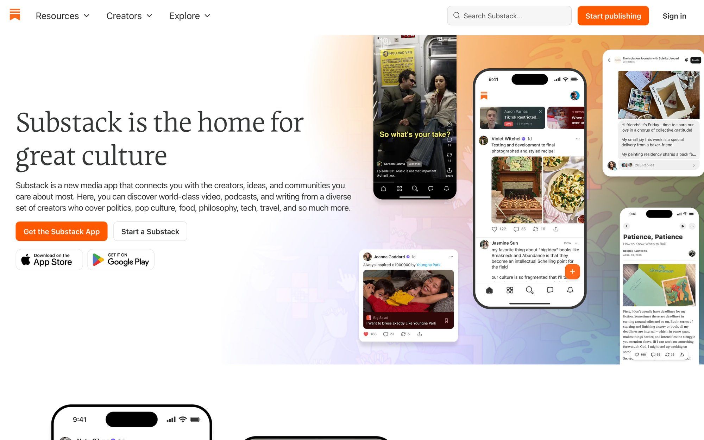

Here's what Substack's actual platform looks like. The homepage emphasizes their core promise: helping independent writers build direct relationships with readers while earning subscription revenue.

### How Does Substack Combine Email, Blogging, and Payments?

Think of Substack as three tools in one:

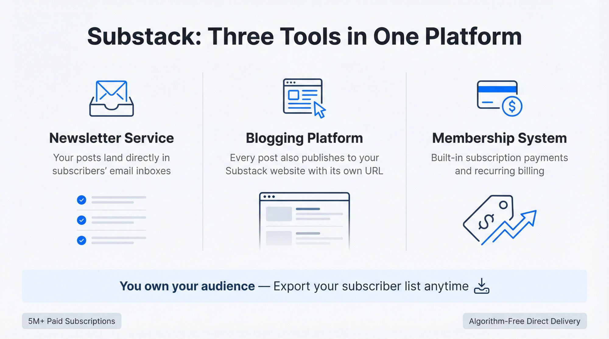

**Newsletter service** (Your posts land directly in subscribers' email inboxes)

**Blogging platform** (Every post also publishes to your Substack website with its own URL)

**Membership system** (Built-in subscription payments and recurring billing)

Unlike traditional publishing or social media, you _own_ your audience on Substack. You can export your subscriber list at any time, which means you're not locked into the platform. This ownership is a huge draw for creators who've been burned by algorithm changes on other platforms.

### Who Should Use Substack in 2026?

While Substack started with independent journalists and writers, it's grown far beyond that. Today, the platform hosts creators across countless genres: political analysts, tech bloggers, novelists, poets, scientists, food writers, and [podcasters who want to monetize with early access instead of ads](https://www.patron.com/blog/post/how-to-monetize-a-podcast-with-early-access-not-ads/).

The numbers tell the story. As of 2025, Substack has **over 5 million paid subscriptions**, up from 4 million in late 2024. The top 10 publishers reportedly earned **over $40 million collectively** in one year, demonstrating just how lucrative it can be for successful writers.

But what makes Substack different from traditional platforms? There are no ads, no algorithmic feeds deciding what readers see, and no intermediaries between you and your audience. Content goes directly to inboxes, creating a more personal connection than social media ever could.

## How to Use Substack as a Creator (Step-by-Step)

Here's exactly how you'd use Substack as a creator, from setup to [monetization strategies that work for different content types](https://www.patron.com/blog/category/monetization/).

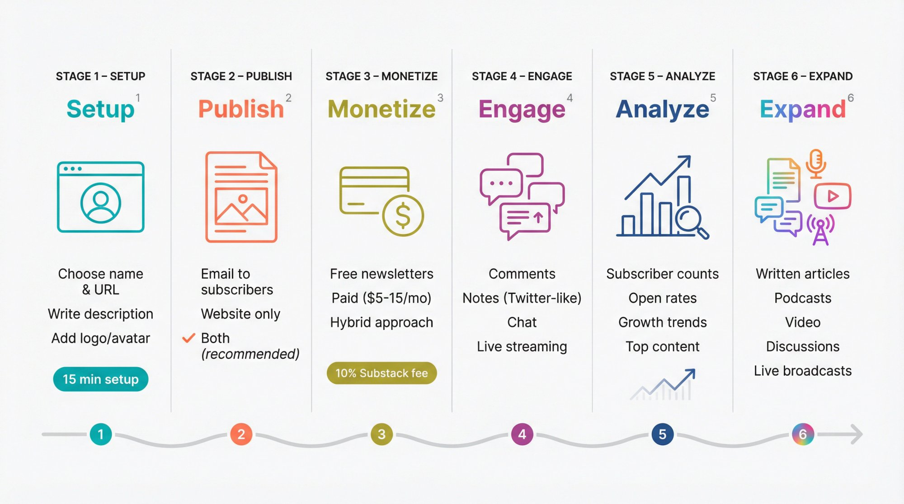

### How to Set Up Your Substack Newsletter

**1. Sign Up and Create Your Publication**

You create a free Substack account using just an email or social login. There's no cost to join and start publishing. After signing up, you'll:

Choose a newsletter name and URL (yourname.substack.com)

Write a short description of what your publication covers

Add an avatar or logo

Optionally [set up a custom domain](https://support.substack.com/hc/en-us/articles/360051222571-How-do-I-set-up-my-custom-domain-on-Substack) for a one-time $50 fee

The entire setup takes maybe **15 minutes** for a basic setup ([Substack Support](https://support.substack.com/hc/en-us)), though most creators spend additional time on branding and customization. No technical skills required.

**2. Write and Publish Posts**

Substack's editor is minimalistic and user-friendly. You can compose posts with formatted text, images, embedded videos, or audio. When you hit publish, Substack gives you options:

Send the post to all email subscribers

Publish it only on your website

Both (this is what most creators do)

Your Substack site displays all posts in reverse chronological order, just like a traditional blog.

**3. Choose Your Monetization Model**

This is where Substack gets interesting. You have complete control over pricing:

**Free newsletters** (All content accessible to anyone who subscribes at no cost)

**Paid newsletters** (Set your own monthly/annual price, typically $5-15/month)

**Hybrid approach** (Some posts free, others gated for paid subscribers only)

Many creators use the hybrid model: free posts attract a wide readership, while premium content is reserved for paying subscribers. When publishing each post, you simply toggle whether it's for everyone or paid subscribers only. This differs from [rolling paywalls that automatically unlock content over time](https://www.patron.com/blog/post/what-is-a-rolling-paywall/), which can be more effective for sequential content creators.

### How to Make Money on Substack (Complete Breakdown)

If you enable paid subscriptions, Substack handles everything:

- Checkout process through Stripe
- Credit card processing
- Recurring billing (monthly or annual)
- Payment reminders when cards expire

The fee structure is straightforward: [Substack takes 10% of subscription revenue](https://support.substack.com/hc/en-us/articles/360037607131-How-much-does-Substack-cost), and Stripe charges roughly 2.9% + $0.30 per transaction.

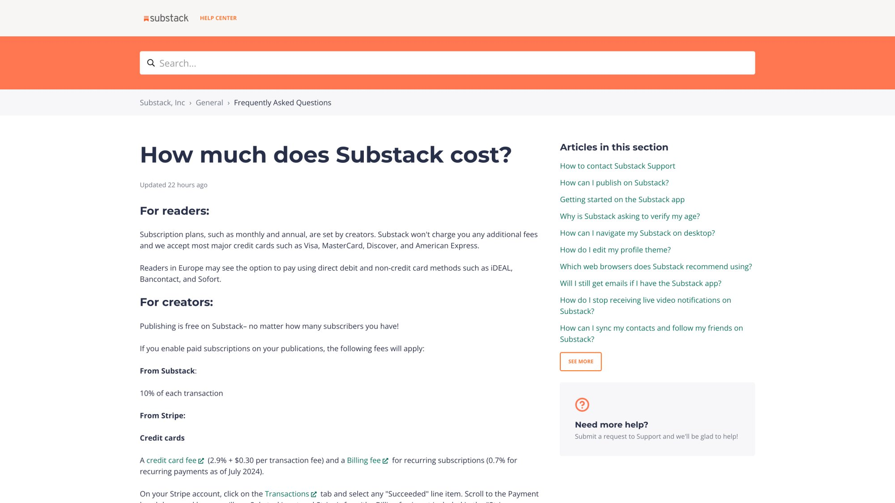

Substack's official support documentation confirms the 10% platform fee. This is the source we're referencing throughout this guide.

| **Your Revenue** | **Substack Fee (10%)** | **Stripe Fee (~4%)** | **You Keep** |
| ---------------- | ---------------------- | -------------------- | ------------ |
| $1,000           | $100                   | ~$40-45              | ~$855-860    |

For a detailed breakdown of how platform fees affect your actual take-home pay, check out this calculator for comparing creator platform earnings.

Important note: If you're running a free newsletter, Substack charges _nothing_. They only make money when you make money, which aligns their incentives with yours.

### How to Engage Your Substack Audience

Substack isn't just a broadcast tool. It includes several engagement features:

**Comments** (Readers can discuss posts, and you can control who comments: everyone, free subscribers, or paid-only)

**Substack Notes** (A Twitter-like feed for sharing quick thoughts and updates)

**Substack Chat** (Group chat functionality for subscriber-only discussions)

**Live features** (In January 2025, Substack rolled out live streaming capabilities to all publishers, with users needing at least 10 free subscribers to access the feature ([TechCrunch](https://techcrunch.com/2025/01/14/substack-rolls-out-livestreaming-for-all-publishers/)))

These features create a more interactive community experience, helping you build deeper connections with readers beyond just sending emails.

### Analytics and Growth Tools for Your Newsletter

Your creator dashboard shows:

- Total free and paid subscriber counts
- Email open rates for each post
- Growth trends over time
- Top-performing content

Substack also offers growth tools like:

**Referral programs** (Subscribers get unique links to invite others, with customizable rewards)

**Pledge system** (Readers can pledge to pay if you launch a paid tier, which helps gauge interest before monetizing)

**Recommendation network** (Writers can recommend each other's publications, creating discovery opportunities)

### What Content Formats Does Substack Support?

Substack has evolved beyond just text. You can now publish:

**Written articles** (The core format, especially popular with [web serial writers](https://www.patron.com/blog/post/how-to-start-a-web-serial/) and [fiction authors](https://www.patron.com/blog/category/writing/))

**Podcast episodes** (Upload audio files and generate RSS feeds for podcast apps)

**Video content** (Upload and share videos with subscribers)

**Discussion threads** (Start conversations that only subscribers can see)

**Live broadcasts** (Host real-time sessions that get saved as draft posts, which creators can then edit and publish ([Substack Support](https://support.substack.com/hc/en-us/articles/30316077882516-Getting-started-with-Live-Video-on-Substack)))

This multi-format support means you can build an entire media brand under one Substack publication.

## How Does Substack Work for Readers?

From a reader's perspective, Substack is beautifully simple.

### How to Subscribe to a Substack Newsletter

To follow a writer, you just enter your email on their Substack page. For free newsletters, that's it. For paid subscriptions, you add a credit card and choose [monthly or annual billing](https://www.patron.com/blog/post/annual-vs-monthly-memberships-for-creators/).

When a writer publishes new content:

- Free subscribers get all free posts via email
- Paid subscribers get both free and premium posts
- Emails are clean and reader-friendly with minimal formatting
- You can read content right in the email or click through to the website

### What Is the Substack App Experience Like?

Substack offers iOS and Android apps that serve as a dedicated newsletter inbox. The screenshot above shows Substack's app marketing - they position it as a clean alternative to email clutter. Instead of mixing newsletters with personal messages, you can:

- Browse all your Substack subscriptions in one place
- Get notifications for new posts
- Participate in Notes and Chat features
- Discover new publications

Many readers prefer the app because it separates newsletter content from regular email.

### How Much Control Do Readers Have on Substack?

Readers have complete control:

- Unsubscribe with one click (link in every email)
- Choose email frequency (some writers offer digest options)
- Cancel paid subscriptions anytime
- Access content on web, email, or app

There's no algorithm for email delivery to subscribers. Every subscribed post goes directly to your inbox. However, Substack does use algorithms for discovery features like the Notes feed, which prioritizes subscription conversions over engagement metrics ([Writing for Progressive Impact](https://writingforprogressiveimpact.substack.com/p/i-tested-substacks-new-algorithm)). This direct delivery model is why many readers (and writers) prefer Substack over social media feeds.

## What Are the Key Benefits of Using Substack?

Here's what makes Substack attractive to creators:

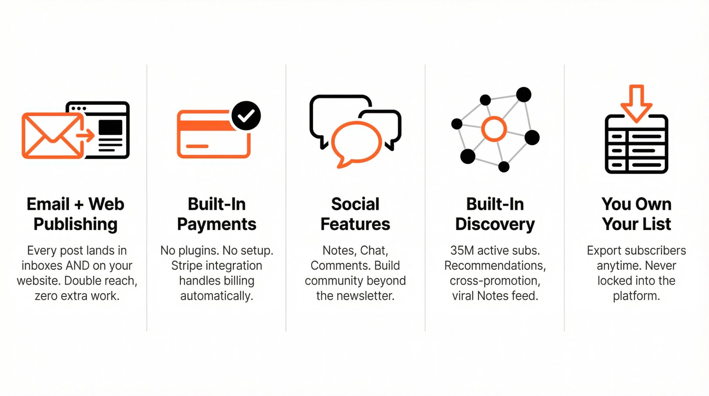

### Email Plus Web Publishing (Dual Distribution)

Every post serves double duty: it's both an email and a blog post. Subscribers read in their inbox, while others discover your content through Google or social shares. This dual distribution maximizes reach without extra work.

### Built-In Payment System (No Setup Required)

No need to set up e-commerce plugins or separate membership platforms. The entire subscription system is integrated. Readers can upgrade from free to paid with a few clicks. Substack handles recurring billing, and you receive payouts directly to your bank.

### Community and Social Features

Substack has become increasingly social. The Notes feature functions like Twitter within Substack, while Chat offers Slack-like discussions for your subscribers. These tools help foster community and improve retention of paid subscribers.

### How Does Substack Help You Grow Your Audience?

Unlike a standalone blog, Substack offers built-in discovery:

- Explore sections highlighting popular content
- Recommendation lists from other writers
- Cross-promotion opportunities
- The Notes feed for viral potential

Over **35 million active subscriptions** exist across Substack, creating a large potential audience already browsing the platform.

### Do You Own Your Content and Subscribers on Substack?

You own your content and can publish it elsewhere if you want. More importantly, you _own your mailing list_ with the ability to export subscribers anytime. This gives creators confidence they're not building on someone else's property.

## How Much Does Substack Cost? (Complete Fee Breakdown)

For creators: Substack is completely free to use unless you charge for subscriptions. No monthly fee, no upfront cost, and no paywall to start. You could run a free newsletter with 100,000 subscribers and pay nothing (except the optional $50 for a custom domain).

When you monetize:

| **Platform** | **Platform Fee** | **Payment Processing**            | **You Keep** |
| ------------ | ---------------- | --------------------------------- | ------------ |
| Substack     | 10%              | Stripe: ~2.9% + $0.30/transaction | ~81-87%\*    |

\*Percentage varies by subscription price due to Stripe's flat fee

Example: A subscriber paying **$5/month** generates:

- $0.50 to Substack (10%)
- ~$0.45 to Stripe (2.9% of $5 = $0.145, plus $0.30 flat fee = $0.445)
- ~$4.05 to you ([Really Good Business Ideas](https://www.reallygoodbusinessideas.com/p/substack-pricing))

For readers: Free newsletters cost nothing. Paid subscriptions typically range from **$5-15/month**, with many writers offering discounted annual plans. There are no additional fees beyond the subscription price (plus any applicable tax).

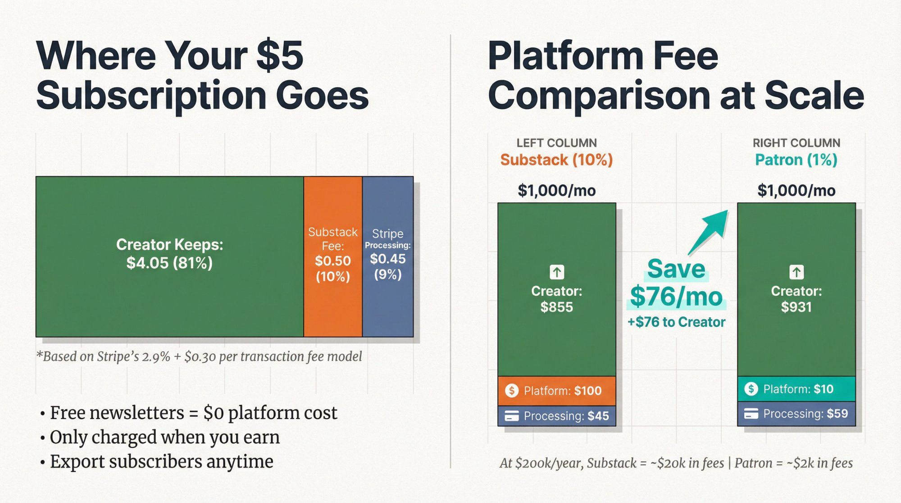

### Is Substack's 10% Fee Worth It?

Substack's 10% cut is higher than some alternatives. For comparison, new creators on similar platforms typically face around 10% platform fees as well. Notably, [traditional membership platforms raised fees to 10% for new creators after August 4, 2025](https://www.patron.com/blog/post/membership-platform-fee-changes-2025/).

For high earners, that 10% adds up. Earning **$200,000/year** means paying Substack ~$20,000. This has prompted some successful creators to eventually migrate to self-hosted solutions or [platforms with significantly lower fees](https://www.patron.com/).

But for most creators, _especially those starting out_, the "free until you earn" model is incredibly valuable. Substack only makes money when you do.

## What Are the Main Benefits of Substack?

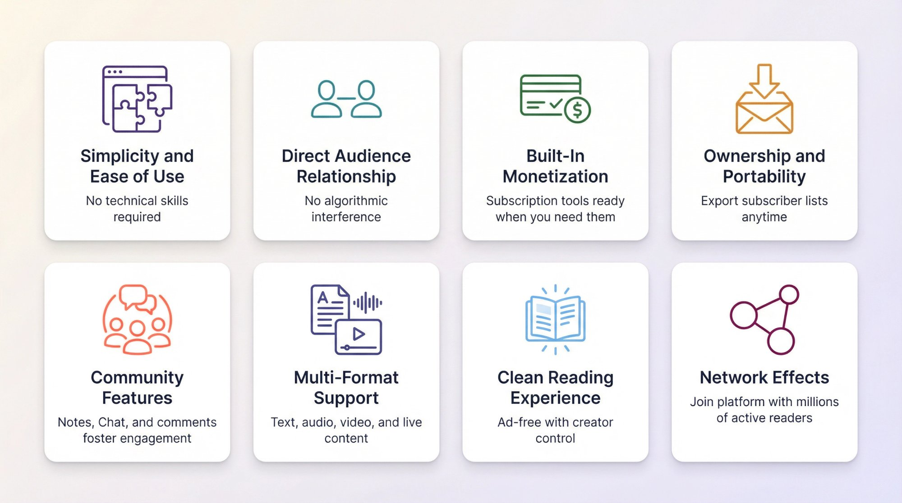

**Simplicity and ease of use** (No technical skills required to create a professional newsletter)

**Direct audience relationship** (Content goes straight to subscribers without algorithmic interference)

**Built-in monetization** (Subscription tools are ready when you need them)

**Ownership and portability** (Export subscriber lists and text/image content anytime, though audio and video content are not included in exports ([Substack Support](https://support.substack.com/hc/en-us/articles/360037466012-How-do-I-export-my-posts)))

**Community features** (Notes, Chat, and comments foster deeper engagement)

**Multi-format support** (Text, audio, video, and live content all in one place)

**Clean reading experience** (Historically ad-free, though in December 2025 Substack quietly rolled out an opt-in pilot program for native sponsorship ads ([Digiday](https://digiday.com/marketing/ad-free-platform-substack-isnt-ruling-out-ads-after-all/)); creators control whether to include sponsored content)

**Network effects** (Join a platform with millions of active readers)

## What Are Substack's Biggest Limitations?

**Limited design customization** (Basic website templates with minimal branding options)

**Basic marketing tools** (Limited automation and segmentation; A/B testing for headlines was introduced in 2025 for publishers with 200+ subscribers, though it's limited to title testing only ([On Substack](https://on.substack.com/p/new-on-substack-ab-testing-for-headlines)))

**10% revenue share** (Can be significant for high earners)

**Not for all content types** (Not ideal for highly visual work, portfolios, or e-commerce)

**Discovery challenges** (Standing out can be difficult as the platform becomes more crowded)

**Platform dependency** (Relying on Substack's infrastructure and policies)

**Basic community moderation** (Limited tools for managing discussions and toxic subscribers)

## Who Should Use Substack in 2026?

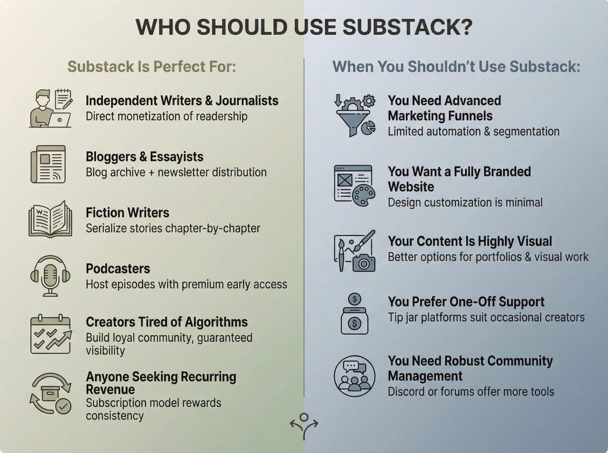

### Substack Is Perfect For:

**Independent writers and journalists** (Perfect for monetizing readership directly)

**Bloggers and essayists** (Combines blog archive with newsletter distribution)

**Fiction writers** (Serialize novels or stories chapter-by-chapter, though [dedicated platforms for serialized fiction](https://www.patron.com/blog/post/best-membership-alternatives-for-writers/) may offer more specialized tools)

**Podcasters** (Host episodes, send show notes, offer [premium content through early access](https://www.patron.com/blog/post/how-to-monetize-a-podcast-with-early-access-not-ads/))

**Creators tired of algorithms** (Build a loyal community that actually sees your work)

**Anyone seeking recurring revenue** (The subscription model rewards consistency)

### When You Shouldn't Use Substack:

**You need advanced marketing funnels** (Limited automation and segmentation)

**You want a fully branded website** (Design customization is minimal)

**Your content is highly visual** (Better options exist for [visual creators](https://www.patron.com/blog/post/how-to-monetize-a-webcomic/), [webtoon artists](https://www.patron.com/blog/post/best-platform-for-webtoon-creators/), or portfolios)

**You prefer one-off support** (Tip jar platforms might suit occasional creators better)

**You need robust community management** (Discord or dedicated forums offer more tools)

## Substack vs. Other Creator Platforms (Complete Comparison)

### Substack vs. Traditional Membership Platforms

While Substack excels for newsletter-based subscriptions, it's not the only option for creators seeking recurring revenue. When [comparing membership platforms](https://www.patron.com/blog/post/ko-fi-vs-traditional-platforms-which-is-best-for-creators/), you'll find different trade-offs in features, fees, and target audiences.

Traditional membership platforms offer different approaches. For example, similar platforms typically charge around 10% for new creators, plus payment processing fees, which totals roughly **13-15% in platform and payment costs combined**.

### How Does Patron Compare to Substack?

If you're creating sequential content like webcomics, serialized fiction, or episodic podcasts, you might want to explore [Patron](https://www.patron.com/).

Patron is an open-source platform specifically designed for creators who publish in episodes or chapters. Explore [the GitHub repository](https://github.com/patroninc/patron) to see the technical foundation. It offers:

**Rolling paywalls** (Release content to paid supporters first, then automatically unlock it for free readers on a schedule)

**Ultra-low fees** (1% for early adopters compared to Substack's 10%)

**Series-based organization** (Built for sequential content rather than generic posts)

**Creator control** (Open-source means you can self-host if needed)

Here's [how rolling paywalls work](https://www.patron.com/blog/post/what-is-a-rolling-paywall/): You release new episodes to paying subscribers first, then those same episodes automatically become free after a set time (usually 1-4 weeks). Your archive builds up as free content that attracts new readers, while your most engaged fans subscribe to get episodes early.

The psychology is powerful: Readers binge your free archive, hit a cliffhanger or run out of episodes, subscribe to get more immediately, and stay subscribed to avoid falling weeks behind.

If your content is episodic rather than issue-based, [Patron](https://www.patron.com/) might be a better fit than Substack. Many creators use Substack for updates and essays while managing their sequential content on Patron. The tools aren't mutually exclusive. If you're currently on other platforms, there are [guides for making the switch](https://www.patron.com/blog/post/switch-from-membership-platforms-to-patron/).

### Substack vs. Email Marketing Services (Mailchimp, ConvertKit)

Compared to Mailchimp or ConvertKit, Substack is extremely creator-friendly but less marketer-oriented. Traditional email services offer more template customization, advanced scheduling, and detailed segmentation, but they primarily charge based on subscriber count (with some platforms like Mailchimp also capping email volume on certain plans) ([Email Tool Tester](https://www.emailtooltester.com/en/blog/convertkit-vs-mailchimp/)).

Substack is free for unlimited subscribers and emails (for free newsletters). That's a _massive_ advantage if you're building an audience. But if you need highly designed newsletters with complex automation, dedicated email tools might serve you better.

### Substack vs. Medium (Which Is Better for Writers?)

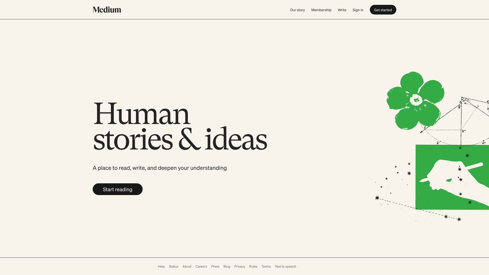

Medium pays writers from a platform-wide subscription pool based on engagement. Substack lets you charge your readers directly and own the relationship.

The screenshot above shows Medium's current interface - notice how it emphasizes curated discovery and reading, while Substack focuses on direct creator-subscriber relationships. Many writers left Medium for Substack because Medium's algorithm and payment system were unpredictable, and as of April 2025, Medium no longer shares email addresses for new subscribers, making it difficult to export your full audience list ([Medium Help Center](https://help.medium.com/hc/en-us/articles/360059837393-Email-subscriptions)). Substack gives you control.

### Substack vs. Ghost (Self-Hosted Options)

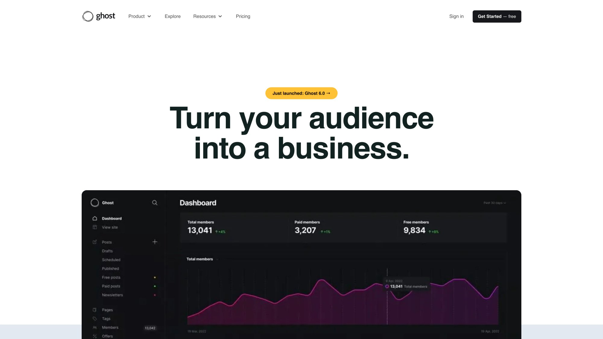

Ghost is an open-source alternative that supports newsletters and paid subscriptions. The screenshot shows how Ghost markets itself - emphasizing open-source technology and professional publishing capabilities. The difference from Substack is control: with Ghost, you host your own site (or pay Ghost's hosting fee) and can customize design extensively while avoiding revenue share.

The trade-off? It's more technical, and you don't get Substack's network of readers. Think of Ghost as a solution for organizations or power users with resources to manage a custom site, while Substack is plug-and-play for solo writers.

## Is Substack Right for Your Content?

Substack has revolutionized independent publishing. With over **5 million paid subscriptions** and tens of millions of active readers in 2025, the platform has proven that the subscription model works for independent creators.

If you love writing freely, sending your work to people who care, and possibly earning income without intermediaries, Substack is worth trying. It excels for creators who want a simple, focused way to publish content and build community without dealing with technical setup or algorithm drama.

The platform is free to start and only charges when you earn, making it a low-risk experiment for most people.

That said, be realistic: Substack is not a magic bullet. You still need to produce great content and put in effort to grow your subscriber base. And it has conscious trade-offs (limited design, basic marketing tools) in favor of simplicity.

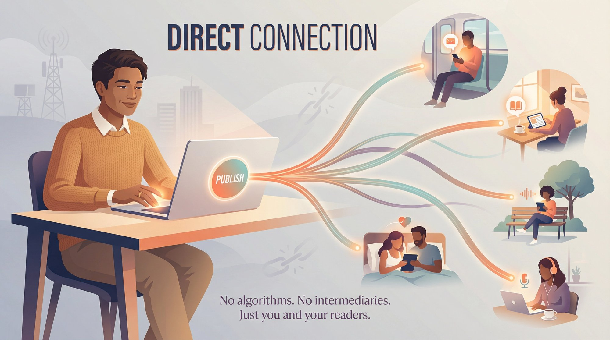

### Making the Right Platform Decision

> **Consider your goals**: If they align with what Substack offers (writing regularly, building loyal readership, possibly charging for premium content), it could be ideal. If your needs fall outside its scope (complex marketing, fully branded site, highly visual content), you might need to supplement or choose a different route.

Many creators start on Substack because it's incredibly easy. You can always evolve your strategy later. Some use Substack purely for audience building even if they monetize differently (through books, consulting, courses), simply because it's an effective way to reach people who care about your work.

For sequential content creators, remember that platforms like [Patron](https://www.patron.com/) offer specialized tools for episodic work. Whether you're creating [webcomic content with tiered pricing](https://www.patron.com/blog/post/how-to-price-your-webcomic-tiers/), [web serials](https://www.patron.com/blog/category/web-serial/), or [podcast series](https://www.patron.com/blog/category/podcast/), explore options designed specifically for that format. You can even check [recent platform updates and features](https://www.patron.com/changelog/) to see how creator tools are evolving.

At minimum, Substack serves as a powerful tool in your creator toolkit, whether as your primary platform or part of a multi-platform presence.

In the end, Substack works best for creators who value direct connection, consistency, and creative control. It's part of a broader shift toward a newsletter renaissance where individual voices can sustain themselves with reader support, outside traditional gatekeepers.

If that excites you, give Substack a shot. You might find it liberating to hit "Publish" and know your work will land in the inboxes of readers who genuinely want to hear from you, with no one standing in between.

## Frequently Asked Questions About Substack

### What is Substack used for?

Substack is used to publish and monetize newsletters. Writers create content that's delivered via email to subscribers and published on a dedicated website. It's popular among journalists, bloggers, fiction writers, and podcasters who want to build direct relationships with their audience and earn subscription revenue.

### How much does Substack cost?

Substack is free for creators running free newsletters. If you charge subscribers, [Substack takes 10% of revenue](https://support.substack.com/hc/en-us/articles/360037607131-How-much-does-Substack-cost), and Stripe charges roughly 2.9% + $0.30 per transaction. For readers, free newsletters cost nothing, while paid subscriptions typically range from **$5-15 per month**.

### Can you make money on Substack?

Yes. Many creators earn substantial income through paid subscriptions on Substack. The top 10 publishers collectively earned **over $40 million** in one year. But success requires consistently producing valuable content and actively growing your subscriber base. Most creators start with a free newsletter to build an audience before introducing paid tiers.

### Is Substack better than Medium?

It depends on your goals. Substack lets you charge readers directly and own your subscriber list, while Medium pays from a platform-wide pool based on engagement. Substack gives you more control over your audience and pricing, making it better for creators who want to build an independent business. Medium might be better if you just want exposure without managing subscriptions.

### Can I use my own domain on Substack?

Yes. [Substack charges a one-time $50 fee](https://support.substack.com/hc/en-us/articles/360051222571-How-do-I-set-up-my-custom-domain-on-Substack) to use a custom domain instead of yourname.substack.com. You'll need to own the domain separately and point it to Substack through DNS settings.

### What's the difference between Substack and email marketing services like Mailchimp?

Substack combines email newsletters with web publishing and built-in monetization. It's free for unlimited subscribers (on free newsletters), while traditional email services charge based on subscriber count. But Mailchimp and similar platforms offer more advanced marketing features like automation, segmentation, and template customization that Substack lacks.

### Can I export my subscribers if I leave Substack?

Yes. You can export your complete subscriber list at any time, which means you're not locked into the platform. This is a major advantage over social media platforms where you don't own your follower relationships.

### Is Substack good for podcasters?

Substack supports podcast hosting, allowing you to upload audio files and generate RSS feeds for podcast apps. It's particularly good for podcasters who want to offer [premium episodes through early access models](https://www.patron.com/blog/post/how-to-monetize-a-podcast-with-early-access-not-ads/) to paying subscribers or combine audio with written show notes and community features.

### What kind of content performs well on Substack?

Long-form written content, in-depth analysis, and serialized stories tend to perform well. Substack's audience values thoughtful, substantial content over quick takes. Successful publications often focus on **niche topics with engaged communities**: politics, technology, finance, fiction, culture, and specialized expertise.

### Should I use Substack or Patron for my content?

It depends on your content format. Substack works best for newsletter-style content: articles, essays, and periodic issues. [Patron](https://www.patron.com/) is specifically designed for sequential content like [serialized fiction for Royal Road authors](https://www.patron.com/blog/post/royal-road-author-monetization-guide/) or episodic podcasts. Patron offers [rolling paywalls](https://www.patron.com/blog/post/what-is-a-rolling-paywall/) (early access that later becomes free) and series-based organization, with much lower fees (**1% vs. Substack's 10%**). Many creators use both: Substack for updates and commentary, Patron for managing their main sequential work.
