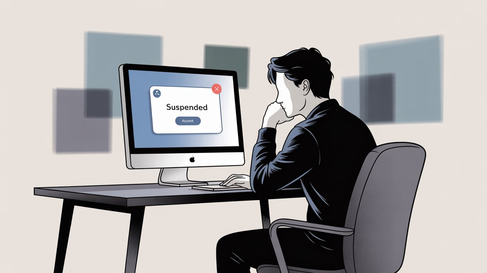
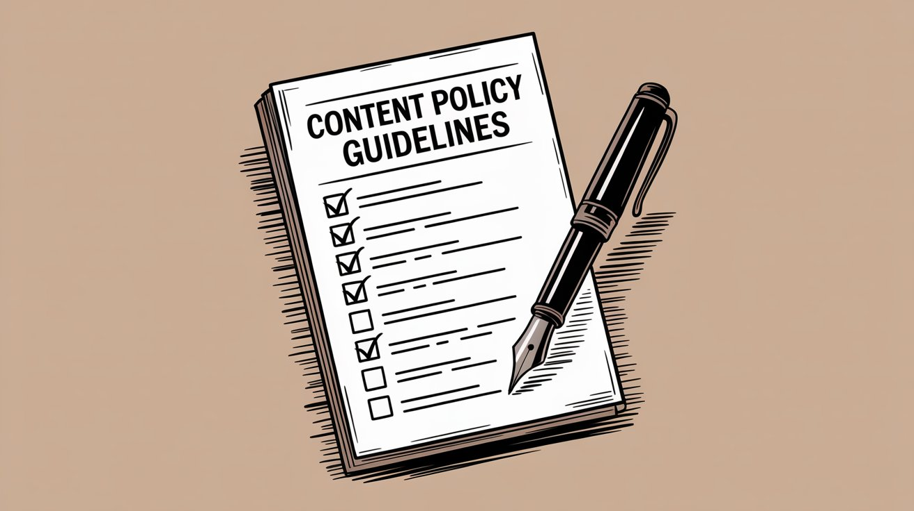
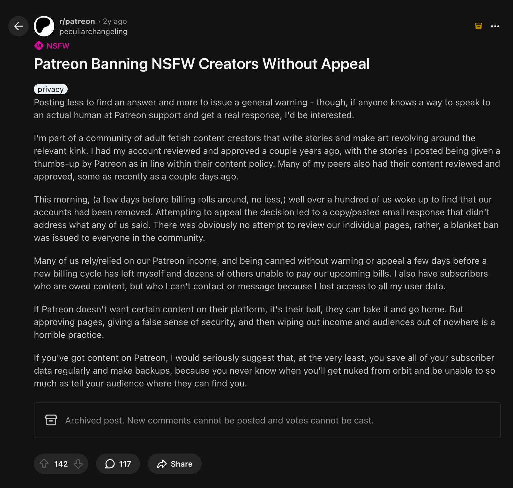
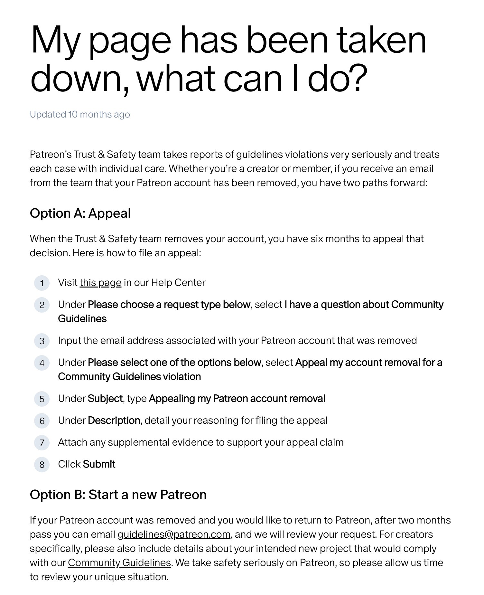
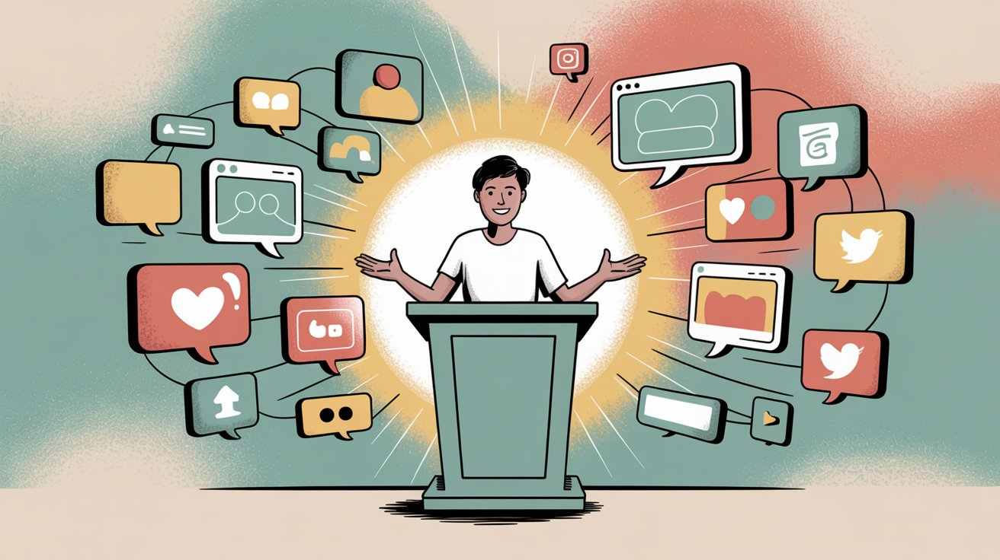
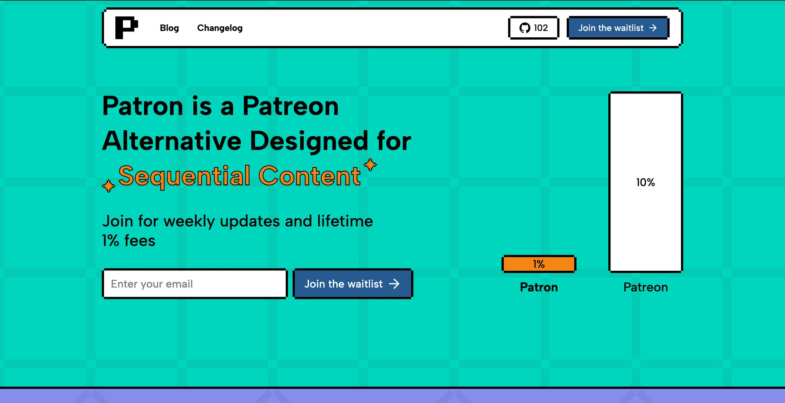
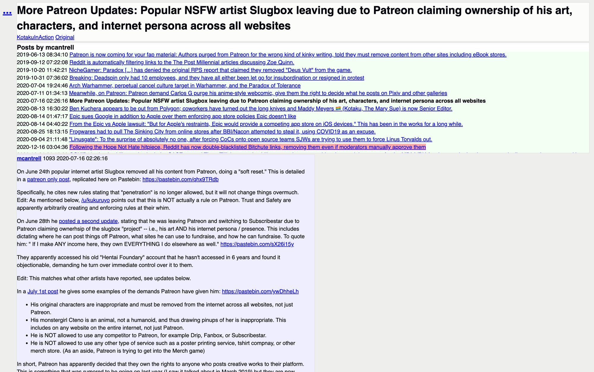
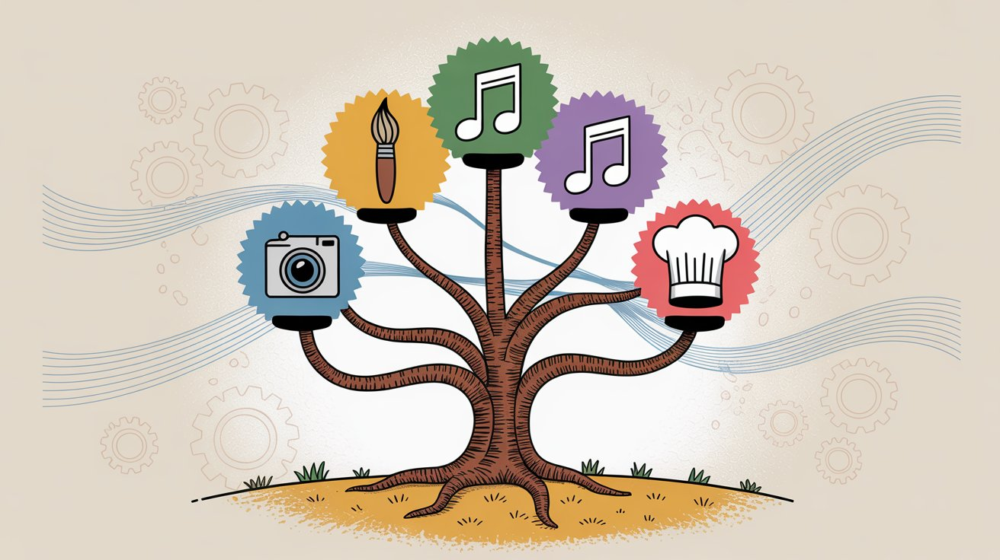

If you've just discovered that Patreon suspended or banned your content, take a breath. You're not the first creator to face this, and you *do* have options moving forward.

Patreon serves as a lifeline for many artists, writers, and podcasters, so a ban or suspension can feel *absolutely* devastating. In this guide, we'll walk through why Patreon bans content, what steps you can take to appeal or recover, how to keep your fans informed, and which alternative platforms might suit you going forward.

By the end, you'll have a clear game plan for moving past a Patreon ban and continuing to earn from your work.

## Why Did Patreon Ban My Content? Understanding the Common Reasons

Patreon enforces Community Guidelines that restrict certain types of content. Some violations are obvious, others less so. Most often, bans relate to prohibited content, especially in the adult/NSFW realm or for hate speech and other policy breaches.

**Adult content violations** are the most common trigger. Patreon explicitly bans sexual content involving minors, incest, bestiality, non-consensual acts, extreme violence, necrophilia, and other extreme fetish material. Even niche kinks like adult baby role-play (ABDL), vore or fetishized cannibalism, and certain transformation or size-difference fetishes are disallowed.

Basically, anything that could be interpreted as exploitative or highly graphic is off-limits on Patreon's platform.

It's not just sexual content that can trigger a ban. Harassment, hate speech, or encouraging harmful acts can also get a creator removed under Patreon's policies. Patreon has tightened enforcement in recent years, partly due to pressure from payment processors and evolving legal requirements.

[In late 2024, Patreon updated its rules to address AI-generated adult content and other issues, signaling that content once tolerated may now be prohibited.](https://news.patreon.com/articles/mid-year-2024-policy-updates-shaped-by-your-feedback)

The reality: Patreon's Trust & Safety team errs on the side of caution. If your page hosts anything that might violate their guidelines, even content linked off-site like an 18+ image on Discord or a taboo PDF on another site, it can put your account at risk. Things you share on social media can also trigger scrutiny.

### How Patreon Crackdowns Affected Fiction Writers in 2024

In mid-2024, several web fiction authors on sites like [Royal Road](https://www.patron.com/blog/category/royal-road) and ScribbleHub noticed Patreon cracking down on adult scenes in their stories. [One author received a warning just for a consensual sex scene between adult characters, no extreme fetishes involved, just a normal smut chapter.](https://forum.scribblehub.com/threads/patreon-nsfw-guidelines-killing-smut-authors.18730/#:~:text=I%27m%20not%20even%20a%20damn,the%20word%20cock%20and%20pussy)

Others in the community expressed frustration that even fictional characters having sex in text form were getting flagged. Some writers decided to self-censor or remove spicy chapters on Patreon, while others talked about moving off Patreon entirely so they wouldn't have to compromise their stories.

This shows how Patreon's stance can affect creators in genres like erotica or mature-themed fiction, even if the content isn't outright illegal.

> **Important distinction:** Patreon usually distinguishes between a minor violation and a major one. [Minor or borderline content issues often result in a post being flagged and hidden with a chance to edit it within **72 hours**](https://support.patreon.com/hc/en-us/articles/8995283013261-Flagged-and-hidden-posts#:~:text=How%20long%20will%20I%20have,to%20correct%20my%20flagged%20post). In these cases, your page isn't fully banned. You're given an opportunity to fix the post and get back into compliance.

But if Patreon bans your entire page outright with no prior warning, it typically means they found a serious violation. As one experienced creator noted, if your account has been banned without warning, there's little hope.

It means they found major issues. When it's not a huge TOS violation, Trust & Safety usually notifies you of specific posts and gives you a chance to fix them first. An immediate ban implies Patreon believes your overall content or behavior is beyond what they can allow.

## How to Appeal a Patreon Ban: First Steps That Actually Work

Patreon banned your content or page. What now?

Before you panic-delete everything or blast Patreon on Twitter, take these practical steps to understand the situation and attempt a resolution.

### 1. Check What Patreon Actually Said About Your Ban

As soon as you discover the ban or suspension, look for an email from Patreon's Trust & Safety team and any notices when you log into your account. Patreon will usually email the account owner explaining the reason for the ban or suspension.

You might also see a banner message upon logging in (if your page is suspended) indicating what guideline was violated.

Read these communications closely. They should tell you whether your page is *suspended* (temporary) or *removed* (banned), and cite which rule was broken. This info is crucial for deciding your next move.

### 2. Which Patreon Policy Did You Violate?

Once you know what Patreon flagged, review the actual language of Patreon's Community Guidelines and relevant policies to fully understand the rule. Was it the adult content policy? The hate speech policy? Perhaps a copyright or fraud issue?

Go to Patreon's guidelines page and find the section that matches your violation. For adult material, Patreon has a detailed Adult Content Guidelines page. Check that too if applicable.

It's important to see exactly what Patreon prohibits in that category. You may realize, for instance, that a specific fetish (a non-consensual scenario in a story, or an illustration of an 18+ character who *looks* underage) is explicitly banned, even if you didn't think it was a big deal.

By understanding the rule you broke, you'll be in a better position to either appeal or adjust your content.

### 3. Can You Fix the Content to Get Reinstated?

There's a big difference between a temporary suspension and a permanent account removal.

**Suspension:** Your page is taken down temporarily, but Patreon is giving you a chance to make changes. In this case, your best move is to edit or remove the offending content and work with Patreon to get reinstated. Patreon suspensions are often resolved within a few days once you comply.

For example, if a specific post was flagged (for, say, an image or wording against guidelines), you typically have **72 hours** to fix that post before it's permanently hidden. Make the necessary edits or delete the post and submit it for review per the instructions Patreon provides.

If you're unsure how to fix it, you can even contact the moderation team for guidance. The key is to show that you're willing to bring your page into compliance.

**Permanent Removal/Ban:** This means Patreon has closed your account (usually for a severe violation). You will no longer have access to your creator page at all. In this scenario, you can't simply edit a post to get back on.

You'll have to formally appeal to Patreon. Patreon's email should state if the removal is permanent. If your page was removed without any prior warnings, assume it's a serious case.

### 4. How to File an Effective Patreon Ban Appeal

Patreon's policies do allow creators to appeal an account removal in many cases. According to Patreon's help center, you have **six months** to file an appeal after your account is removed. Still, it's best to initiate the appeal as soon as you're prepared.

Approach it this way:

**Follow Patreon's Appeal Process:** Use the link or instructions Patreon provided (often in their email or the Help Center article titled "My page has been taken down, what can I do?"). Typically, you'll need to submit a support ticket where you select an option like "Appeal my account removal for a Community Guidelines violation".

In the appeal, be professional and concise. State that you are appealing the decision, acknowledge the reason given, and provide any evidence or arguments for why you believe the decision should be reversed.

**Demonstrate Compliance:** In your appeal message, it's often crucial to show that you've addressed the issue. If you removed or edited content to follow the rules, mention that.

For example, one creator who had an NSFW page suspended shared that they were able to get reinstated by editing their content to meet guidelines and showing Patreon staff the changes.

If your content was mistakenly flagged or falls in a gray area, explain calmly why it actually complies with the guidelines (with references to the policy wording if relevant). The Trust & Safety team will want to see that either the violation is resolved or that they might have made an error.

**Patience (and Some Reality-Checking):** Appeals take time and are not always successful. Patreon states that when an account is removed and under review, any funds in your balance are held for up to **28 days** during the appeal process. During this period, they're evaluating your case.

Suspension reviews might only take a few days, but full ban appeals can take weeks, so be prepared to wait.

Unfortunately, if your ban was for something Patreon has zero tolerance about (for instance, sexual depictions of minors), the chance of reversal is *extremely* low. On the other hand, if it was a more nuanced situation (maybe an automated system mis-flagged something or you're a borderline case willing to adjust), you might have a shot.

Make your best case, but don't pin your entire livelihood on a successful appeal. It's wise to simultaneously plan for alternative ways to reach your fans and monetize.

### Real Case: What Happens When Appeals Don't Work

***Peculiar Changeling*** is an erotica writer who ran into trouble on Patreon in 2023. His niche was ABDL (adult baby diaper lover) fiction, a fetish that Patreon explicitly forbids because it sexualizes an infant role. Patreon removed his page entirely.

He attempted to appeal, noting that his stories were clearly fictional and that similar content had been allowed on Patreon in the past. Unfortunately, he got no response from Patreon's team when he submitted his documentation and appeal.

In his case, the content type was something Patreon was adamant about banning, and the appeals process led nowhere. He ultimately had to seek out other platforms for his work.

> **The lesson?** Appeals can be hit or miss. If your content squarely hits a forbidden category, Patreon may simply shut the door.

### Can You Start a New Patreon Account After Being Banned?

Patreon's own guidelines say that if your account was removed, [you could request to start a brand new account after a waiting period of **2 months**](https://support.patreon.com/hc/en-us/articles/115004403323-My-page-has-been-taken-down-what-can-I-do). This is essentially an appeal for a second chance under a new page, and you'd need to email [guidelines@patreon.com](mailto:guidelines@patreon.com) with a plan for a new project that complies with the rules.

In practice, this is only worth trying if you genuinely intend to create different content that will not trigger the same problems. For example, if you were banned for a certain type of content, launching a new Patreon to continue posting that same content is not going to fly. They'll check your new page and likely shut it down if it's a repeat offense.

This path might be viable if you have multiple creative avenues. For example, your first Patreon was banned for NSFW art, but you also compose music and could conceivably start a Patreon for your music work.

Be *very* cautious here. Patreon will scrutinize any new account you try to open after a ban. For most creators, it might make more sense to cut ties and move on to other platforms rather than walking on eggshells with a new Patreon.

## How to Tell Your Fans About a Patreon Ban Without Losing Them

One immediate concern after a Patreon ban is: how do I tell my supporters what happened without losing them?

Your patrons are the ones directly funding you, so being cut off from them is scary. Let's look at how to handle fan communications in this situation.

### Reach Your Community Immediately on Social Media

Patreon will not notify your patrons that you were banned or suspended. From a patron's perspective, they might just see that your page is gone or your posts disappeared, with no explanation. It's up to you to reach out.

Use any and all channels you have outside Patreon: Twitter/X, Instagram, Facebook, YouTube, TikTok, wherever you have an audience. Make a public post letting people know that your Patreon is no longer available and why.

You don't have to go into gory details. Something like:

*"Hey folks, my Patreon page is currently suspended due to a content policy issue. I'm working on resolving it, but in the meantime, here's how you can stay in touch and support me..."*

The key is to catch your fans before they drift away or think you just quit. If you run a Discord server for your community, announce it there immediately. Pin a message explaining the situation and directing people to any new site or temporary solution (for example, a PayPal tip jar or an alternate platform link).

### Can You Still Download Your Patron List from Patreon?

In a perfect world, you'd message your patrons on Patreon to tell them what's up. But if your account is fully removed or suspended, you might lose access to Patreon's messaging and posts.

Some creators have reported that once banned, they couldn't retrieve their patron list or contact info at all. Patreon effectively locks you out.

(In fact, one banned creator requested Patreon at least give them the list of emails of their patrons so they could fulfill pending rewards off-platform, but they simply haven't responded.)

It's worth checking if you can still download your patron data. Patreon had a feature to export a CSV of your patrons (with emails). If you have the ability to log in to your account settings and grab that, do it immediately.

In many cases of removal, though, you won't be able to access this data. Patreon holds patron privacy in high regard and likely won't share their contact info with you after the fact.

This underscores the importance of not putting all your community eggs in one basket. Hopefully you already have some of your fans following you elsewhere or on an email list.

### What to Say to Fans About Your Ban (Without Burning Bridges)

When you explain the ban to your supporters, be honest but professional. You can say, for example:

*"Patreon flagged my page for a violation of their content guidelines regarding \[X\]. I've appealed the decision (or I'm working on a solution), but I don't know if or when I'll be back on Patreon."*

If you feel wronged, it's fine to express some frustration. Your true fans will likely be sympathetic. But avoid an overly angry or defamatory rant. It can come off as unprofessional or burn bridges unnecessarily.

Emphasize that your gratitude to your fans hasn't changed and that you're committed to finding a way to keep delivering content to them.

### Where Can Fans Support You Right Now?

Importantly, let fans know how they can continue to support you immediately, if they want to. Do you have a backup platform ready (maybe you were already mirroring content on another membership site)? If so, drop the link and invite them over.

If not, you might suggest they follow your free channels for updates and that you'll announce a new support method soon. Some creators temporarily move to one-time payments, while they sort things out.

Not everyone will jump through new hoops to support you, but your most dedicated fans might. You'd be surprised how loyal a core fanbase can be when they know you're in a bind.

### How to Deliver Rewards You Already Owe Patrons

Do you owe patrons any rewards or content that they've already paid for this month? This is tricky when Patreon cuts off your access. Ideally, find a way to deliver whatever was promised, so those patrons don't feel cheated.

For example, if you owe them a bonus chapter or exclusive video, send it via email, post it on a Google Drive link and share the link on social media, or DM people individually if possible. It might not reach everyone, but doing your best here demonstrates integrity.

Make it public if needed (at least temporarily) with a note like: *"This month's exclusive chapter is available free for everyone due to the Patreon issue. If you'd like to support me, here's how..."* Patrons will appreciate that you're trying to make good on your promises despite the platform issues.

### Start Building Your Email List Now

This won't help you the day of the ban, but as a lesson: going forward, try to collect emails or contact info from your supporters independently. Email lists or even a Telegram or Discord group can be lifesavers in situations like this.

Many creators periodically remind their patrons: *"Join my mailing list for updates in case anything ever happens to this platform."* It might feel paranoid until a ban happens, and then you'll be *very* glad you did it.

> **Key Insight:** Don't go silently into the night if Patreon boots you. Let your people know where you went. You've worked hard to gather those supporters. A Patreon ban doesn't have to mean the end of your community.

## Best Patreon Alternatives After Getting Banned (2025)

After the dust settles, you'll face the big question: where do I host my membership or fan funding now?

The good news is, Patreon is not the only option. In fact, for certain types of content (especially adult content), some alternatives might serve you better in the long run.

Below we'll outline the most popular Patreon alternatives and who they're best for. Many creators who've been banned by Patreon have successfully migrated their communities to one of these platforms. You might even use a combination of them to cover all your bases.

### What to Consider Before Choosing Your New Platform

- **What was the reason for my Patreon ban?** Make sure the new platform allows that kind of content.
- **Where does my audience hang out?** If most of your fans are on Twitter and Discord, you might steer them to a platform that integrates well with those, or simply use those channels for distribution while monetizing via another tool.
- **What features do I need?** (paywalled posts, video hosting, livestreams, Discord roles, etc.) Each platform has its pros and cons.
    

### Comparing Membership Platform Options in 2025

When Patreon bans creators, many look to other membership platforms. While there are several options in the creator economy space, each has different content policies, fee structures, and features. Research these platforms carefully to find one that aligns with your content type and creator needs.

**Important Note:** Some platforms are more permissive about adult content, while others have similar restrictions to Patreon. Always review the platform's community guidelines and content policies before migrating.

Many creators who run into issues with Patreon's policies end up on platforms with different content moderation approaches. Still, remember that no platform is 100% without rules, as they all must abide by laws and financial regulations.

### Patron: The Open-Source Alternative Built for Banned Creators

If you're technically inclined or want ultimate control, you should seriously consider an open-source solution. One notable newcomer is [Patron](https://www.patron.com/).

[Patron is an open-source membership platform specifically designed for sequential content creators](https://www.patron.com/), think [webcomic](https://www.patron.com/blog/category/webcomics) artists, serialized fiction authors, podcasters. It launched in 2025 and offers a hosted service (currently in alpha) as well as code that anyone can self-host.

**Why Patron matters for banned creators:**

The appeal of [Patron](https://www.patron.com/) for creators who've been banned is *maximum freedom and control*. Because [it's open source](https://github.com/patroninc/patron), you could potentially run your own instance of the platform on your own server, with your own rules.

Even on the official [Patron hosted platform](https://www.patron.com/), the ethos is "creator freedom." The project explicitly emphasizes transparency and that creators can customize or self-host for complete control.

[Patron](https://www.patron.com/) is aiming to be creator-friendly in policies and fees. They only charge [a 1% platform fee for early adopters](https://www.patron.com/blog/post/patreon-fee-changes-2025) (versus Patreon's 10% or other platforms' higher fees).

Because [Patron is new](https://www.patron.com/blog/category/about), it doesn't yet have all the features or audience ecosystem of Patreon. But it will not discriminate against adult or sequential art content as long as it's legal. The focus is on empowering creators rather than policing them.

**Key Patron Features for Sequential Content:**

One of [Patron's](https://www.patron.com/) most powerful features for creators who publish episodic content is the [rolling paywall system](https://www.patron.com/blog/post/what-is-a-rolling-paywall). This allows you to publish content for paying supporters first, then automatically make it free for everyone after a set time period.

This is perfect for **webcomic creators** who want to give early access to patrons while eventually making archives publicly available, **fiction writers** serializing novels who can offer chapters to supporters first then release them publicly, and **podcasters** providing ad-free episodes early to subscribers.

The [rolling paywall](https://www.patron.com/blog/post/what-is-a-rolling-paywall) creates a natural discovery funnel: your back catalog becomes free promotional content that attracts new readers, who then become paying supporters to get the latest content first. It's a sustainable model that platforms like Patreon don't natively support.

**The self-hosting advantage:**

If you were banned on Patreon for your spicy graphic novel or adult web series, [Patron](https://www.patron.com/) might be an ideal new home. You could either invite your fans to support you on [Patron's hosted platform](https://www.patron.com/) (joining a waitlist for early access, since it's in alpha), or if you have technical resources, deploy your own instance of the [Patron software from GitHub](https://github.com/patroninc/patron).

**The fact that you can self-host means no company can *ever* suddenly ban you.** You'd be running your own site. Of course, you still have to handle payment processing (Patron integrates with Stripe by default, which does have content rules, but you might find more flexible processors if needed).

[Patron](https://www.patron.com/) is a very promising alternative especially for the writing and webcomics community, as it was built by a founder who was frustrated with Patreon's shortcomings for serialized content. You can [follow Patron's development progress on their changelog](https://www.patron.com/changelog) to see new features being released weekly.

**Platform Comparison:**

If you're deciding between membership platforms, [Patron's blog has helpful comparison guides](https://www.patron.com/blog). For instance, there's an in-depth [comparison between membership platforms and tip-jar services](https://www.patron.com/blog/post/ko-fi-vs-patreon-which-platform-is-best-for-creators) that breaks down the differences in business models, features, and use cases. These guides can help you understand which platform type best fits your content and monetization strategy.

**Here's how the fees compare:**

| **Platform** | **Monthly Revenue** | **Platform Fee** | **Creator Take-Home** |
| --- | --- | --- | --- |
| Patreon (10%) | $1,000 | $100 | $900 |
| Patron (1%) | $1,000 | $10 | $990 |

That's a **$90 difference** per $1,000 of revenue. Over a year, that adds up significantly.

**Use case:** Creators of ongoing series (novels, comics, podcasts) who want a Patreon-like setup with far lower fees and open governance. Also, any creator who values open-source or wants the option to self-host their fan platform to avoid future bans.

### Exploring Other Platform Options

There are many other alternatives out there, each with their own niche. Some platforms focus on community building with subscription options, while others are storefronts where you can sell content in packages.

For primarily written content, email newsletter platforms with paid subscriptions exist and are popular with fiction authors and journalists. Some allow controversial voices under a free speech ethos, though they still have content guidelines.

In some cases, creators banned from mainstream platforms experiment with donation platforms that use cryptocurrency or are decentralized. These can bypass traditional payment rules, though asking fans to use crypto may limit support since it's not mainstream-friendly.

You can also go the DIY route by setting up your own website with a paywall using plugins or services that handle paid memberships. This gives you branding control and no content overlord (aside from payment processor terms).

The downside: you have to maintain everything, and the user experience might not be as smooth as a purpose-built platform. But for some, it's the ultimate independence.

### How One NSFW Artist Left Patreon Successfully

*Slugbox* is a well-known illustrator in the furry/anime NSFW community. [Back around 2020, Slugbox ran into major conflicts with Patreon's content policies.](https://www.rareddit.com/r/KotakuInAction/comments/hs1fjo/more_patreon_updates_popular_nsfw_artist_slugbox/#:~:text=)

Patreon began demanding that he remove certain artwork not just from Patreon, but from ALL websites under his control. Even illustrations of his original monster-girl character were flagged (Patreon considered the character "non-human" and thus any sexual depictions fell under bestiality rules).

They also told him he couldn't use competing platforms to host the banned content, effectively trying to control his entire online presence. Feeling these demands were overreaching, Slugbox ultimately left Patreon. He announced to his fans that he was moving off the platform.

Many of his supporters followed him to other avenues. He started using alternative platforms for uncensored art and a personal website to sell art packs. The transition wasn't easy (he lost some casual supporters who never migrated), but by taking his business into his own hands, Slugbox no longer had to live in fear of Patreon's next policy change.

> **This case illustrates** that for creators with highly erotic or "edgy" art, Patreon's rules can become an unpredictable guillotine. Sometimes the better long-term choice is to set up shop somewhere more permissive, even if it means losing the convenience and exposure Patreon provided.

### Understanding That Every Platform Has Some Rules

Remember that no alternative is 100% without rules. Even sites that advertise themselves as creator-friendly have to abide by laws and financial regulations. Many platforms will still ban truly illegal content or things that could get them in serious trouble (child exploitation, etc.).

Many platforms' permissiveness is also proportional to their visibility. A smaller site can fly under the radar with edgy content, but if it grows too popular, payment processors or governments might impose the same pressures Patreon faced.

That said, diversifying where you host your content can mitigate risk. Some creators run multi-platform: a safer PG-13 presence on Patreon (if they ever let you back or if you start a new account for safe content) *and* a presence elsewhere for the hardcore fans.

There's no rule you must pick only one platform. It's extra work to maintain multiple, but it can ensure you're not reliant on a single company's policies ever again.

## How to Prevent Another Creator Platform Ban

Once you've got a plan to move forward (whether by appealing, switching platforms, or both), it's wise to learn from the experience so you can avoid ending up in a similar crisis again.

**Know the Rules Wherever You Go**

Take the time to read the community guidelines of your new platform (or any remaining platforms you use). What got you banned on Patreon might be totally fine elsewhere, or it might also violate the other platform's rules in a slightly different way.

For instance, Patreon forbade a laundry list of NSFW themes. Some platforms might allow most of those, but perhaps have lines you shouldn't cross. Don't just assume. Double-check.

When in doubt, reach out anonymously to the platform's support and ask: "Is XYZ content allowed on your site?" Better to get clarity up front than push boundaries blindly.

**Back Up Your Content and Community**

Export your posts, save your files, keep lists of your patrons (with their contact info if possible). If you lose an account again, having backups means you can re-upload or continue delivering content elsewhere with minimal interruption.

Some creators routinely back up their Patreon posts knowing that a takedown could happen. Also, encourage followers to connect on multiple platforms (Twitter, email list, etc. as discussed) so you always have a way to reach them. Think of it as an insurance policy for your fanbase.

**Diversify Income Streams**

This might be the kick in the pants to diversify how you earn from your work. Relying 100% on one platform (be it Patreon or anything else) is risky.

After a ban, many creators diversify by splitting content across a couple of patronage sites, selling merchandise or digital products, doing occasional crowdfunding for big projects, or exploring other revenue streams.

The idea is that if one income source vanishes, others can help fill the gap. You don't want to be in a position again where a single account suspension cuts off all your revenue overnight.

**Adjust Your Content or Branding if Needed**

This part is up to you and may or may not apply. If you feel that a certain type of content you created is going to keep causing problems on *every* platform (due to legal reasons, payment processing rules, etc.), you might consider adjusting your creative direction slightly.

For example, an adult artist might decide to avoid a few extreme themes going forward so that they can comfortably exist on more platforms without constant bans. A commentator who got banned for hate speech might (ideally) reflect on their content and perhaps steer away from slurs or targeted harassment so they can maintain a presence on mainstream outlets.

It's not our place to tell you what to create. Just note that walking the razor's edge of what platforms allow will always carry risk. Some creators choose to dial it back a notch to build a more stable business, while others double down on the banned content and find underground ways to monetize it.

It's your call.

**Stay Updated on Policy Changes**

One frustrating aspect of Patreon is how policy changes can come with little warning. Try to keep an ear out for news. Follow Patreon's official blog or community forums for any policy updates.

Same goes for any platform you join. Often, platforms will announce upcoming changes that could affect creators. If you catch wind of it early, you can adapt or prepare.

For instance, Patreon's mid-2024 policy proposal about AI-generated content gave creators a heads-up to adjust their content by early 2025. Creators who read that news could start tweaking their pages before any bans hit. Being proactive is better than being reactive.

**Legal and Compliance Considerations**

If your situation was complex or involves significant money, consider getting legal advice. For example, if you lost a huge amount of pledged income that Patreon refuses to pay out due to a ban, a lawyer could advise if there's any recourse.

Patreon's terms are pretty airtight that they can terminate at their discretion, but in certain jurisdictions you might have rights.

At the very least, understand the tax implications. If Patreon held funds and then released them or refunded them, how does that reflect in your earnings? A financial advisor or accountant might need to help if it's significant.

This is not common for smaller creators, but if you're at the level where a ban loses you tens of thousands of dollars, treat your creative biz like a business and consult professionals.

## Moving Forward After Your Patreon Ban

A Patreon ban can feel like the end of the world, but it isn't. Many creators have faced it and come out the other side still creating, still earning, and often happier with the platforms they end up on.

**Your fans are there for YOU and your content**, not for the platform.

Patreon was a convenient meeting place, but it's not the only place your community can thrive. Yes, you will likely lose some casual supporters in the transition (inevitably, a percentage won't follow you to the new site or bother updating their payment info). But the most enthusiastic fans will stick with you if you show them where to go.

Take this as an opportunity to possibly upgrade your setup. Maybe you find a platform that fits your needs better (whether it's lower fees, more creative freedom, or features tailored to your genre).

For example, some creators banned from Patreon found that once the dust settled, they were actually making *more* on the new platform because their fans rallied and they attracted folks who specifically value uncensored content. It can happen.

**Keep creating.** Don't let a platform's decision define your creative journey.

You might need to adjust your strategy, but your talent and connection with your audience are what truly matter, and those are portable.

Use the information in this guide to make a swift recovery plan: appeal if you can, inform your fans, set up shop somewhere new, and continue doing what you love. The road to earning a living as an independent creator is rarely bump-free. Consider this bump a learning experience and maybe even the start of a new chapter.

If you're ready to explore a platform built with creator freedom in mind, [check out Patron](https://www.patron.com/). With its [open-source approach](https://github.com/patroninc/patron), [1% fees](https://www.patron.com/blog/post/patreon-fee-changes-2025), and [features designed specifically for sequential content creators](https://www.patron.com/blog/post/what-is-a-rolling-paywall), it might be exactly what you need to rebuild your creative business on your own terms.

Good luck, and here's to your continued success on *your own terms*!